# `kubehunter\kube_hunter\modules\hunting\etcd.py` 详细设计文档

该代码是kube-hunter安全扫描工具的一部分，专注于检测Kubernetes集群中Etcd服务的远程访问漏洞。通过主动和被动两种Hunter模式，检查未授权的远程写入、读取、版本泄露以及不安全的HTTP访问，并发布相应的安全事件。

## 整体流程

```mermaid
graph TD
    A[OpenPortEvent (port=2379)] --> B[EtcdRemoteAccessActive]
    A --> C[EtcdRemoteAccess]
    B --> D{db_keys_write_access 成功?}
    D -- 是 --> E[发布 EtcdRemoteWriteAccessEvent]
    D -- 否 --> F[不发布事件]
    C --> G{insecure_access 成功?}
    G -- 是 --> H[设置 protocol='http']
    G -- 否 --> I[设置 protocol='https']
    H --> J{version_disclosure 成功?}
    I --> J
    J -- 是 --> K[发布 EtcdRemoteVersionDisclosureEvent]
    J -- 否 --> L[不发布版本事件]
    K --> M{protocol == 'http'?}
    M -- 是 --> N[发布 EtcdAccessEnabledWithoutAuthEvent]
    M -- 否 --> O[不发布未授权事件]
    N --> P{db_keys_disclosure 成功?}
    O --> P
    P -- 是 --> Q[发布 EtcdRemoteReadAccessEvent]
    P -- 否 --> R[不发布密钥事件]
```

## 类结构

```
Event (抽象基类)
├── Vulnerability (继承Event)
│   ├── EtcdRemoteWriteAccessEvent
│   ├── EtcdRemoteReadAccessEvent
│   ├── EtcdRemoteVersionDisclosureEvent
│   └── EtcdAccessEnabledWithoutAuthEvent
Hunter (基类)
├── ActiveHunter (继承Hunter)
│   └── EtcdRemoteAccessActive
└── Hunter
    └── EtcdRemoteAccess
```

## 全局变量及字段


### `ETCD_PORT`
    
ETCD 服务默认端口号，值为 2379

类型：`int`
    


### `logger`
    
模块级日志记录器，用于记录调试和错误信息

类型：`logging.Logger`
    


### `EtcdRemoteWriteAccessEvent.evidence`
    
写入操作返回的结果证据

类型：`str`
    


### `EtcdRemoteReadAccessEvent.evidence`
    
泄露的密钥列表证据

类型：`str`
    


### `EtcdRemoteVersionDisclosureEvent.evidence`
    
ETCD 版本信息证据

类型：`str`
    


### `EtcdAccessEnabledWithoutAuthEvent.evidence`
    
ETCD 版本信息证据

类型：`str`
    


### `EtcdRemoteAccessActive.event`
    
接收的端口事件对象

类型：`OpenPortEvent`
    


### `EtcdRemoteAccessActive.write_evidence`
    
写入操作的证据结果

类型：`str`
    


### `EtcdRemoteAccess.event`
    
接收的端口事件对象

类型：`OpenPortEvent`
    


### `EtcdRemoteAccess.version_evidence`
    
版本探测的证据结果

类型：`str`
    


### `EtcdRemoteAccess.keys_evidence`
    
密钥泄露的证据结果

类型：`str`
    


### `EtcdRemoteAccess.protocol`
    
当前使用的协议类型（https 或 http）

类型：`str`
    
    

## 全局函数及方法


### EtcdRemoteWriteAccessEvent.__init__

该方法是 `EtcdRemoteWriteAccessEvent` 类的构造函数，用于初始化一个表示 Etcd 远程写入访问漏洞的事件对象。它继承自 `Vulnerability` 和 `Event` 类，并接收远程写入操作的结果作为证据。

参数：

- `write_res`：任意类型（通常是 `bytes` 或 `str`），表示远程写入 Etcd 的响应结果，作为该漏洞的证据

返回值：`None`，无返回值（`__init__` 方法）

#### 流程图

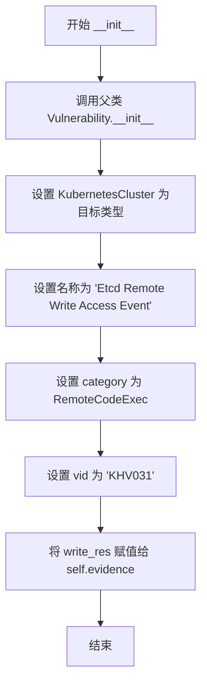

#### 带注释源码

```python
def __init__(self, write_res):
    """
    初始化 EtcdRemoteWriteAccessEvent 漏洞事件对象
    
    参数:
        write_res: 远程写入操作的结果内容,作为漏洞证据存储
                   通常是 HTTP 响应内容(字节或字符串类型)
    """
    # 调用父类 Vulnerability 的初始化方法
    # 参数: 
    #   - self: 当前实例
    #   - KubernetesCluster: 受影响的 Kubernetes 集群类型
    #   - name: 漏洞事件名称
    #   - category: 漏洞类别为远程代码执行
    #   - vid: 漏洞标识符 KHV031
    Vulnerability.__init__(
        self, KubernetesCluster, name="Etcd Remote Write Access Event", category=RemoteCodeExec, vid="KHV031",
    )
    
    # 将远程写入操作的结果保存为实例属性
    # 该证据用于描述漏洞的具体影响和攻击结果
    self.evidence = write_res
```


### EtcdRemoteReadAccessEvent.__init__

该方法是 `EtcdRemoteReadAccessEvent` 类的构造函数，用于初始化一个远程读取访问漏洞事件。当攻击者能够远程读取 Etcd 数据库中的 keys 时，会创建此事件并携带获取到的 keys 作为证据进行发布。

参数：

- `keys`：`任意类型`，从 Etcd 的 `/v2/keys` 端点获取的响应内容，作为漏洞证据

返回值：`None`，构造函数无返回值

#### 流程图

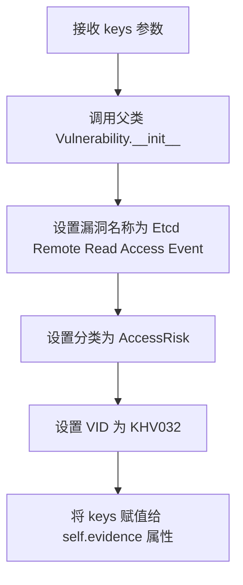

#### 带注释源码

```python
class EtcdRemoteReadAccessEvent(Vulnerability, Event):
    """Remote read access might expose to an attacker cluster's possible exploits, secrets and more."""

    def __init__(self, keys):
        # 调用父类 Vulnerability 的初始化方法，设置漏洞相关的元信息
        # 参数: KubernetesCluster - 受影响的目标类型
        # 参数: name="Etcd Remote Read Access Event" - 漏洞名称
        # 参数: category=AccessRisk - 漏洞分类为访问风险
        # 参数: vid="KHV032" - 漏洞唯一标识符
        Vulnerability.__init__(
            self, KubernetesCluster, name="Etcd Remote Read Access Event", category=AccessRisk, vid="KHV032",
        )
        # 将从 Etcd 数据库读取的 keys 内容存储为证据
        # 用于后续事件发布和漏洞报告
        self.evidence = keys
```


### `EtcdRemoteVersionDisclosureEvent.__init__`

该方法是 `EtcdRemoteVersionDisclosureEvent` 类的构造函数，用于初始化一个表示 Etcd 远程版本信息披露漏洞的事件对象。它继承自 `Vulnerability` 和 `Event` 基类，设置漏洞名称、类别、VID 等元数据，并将获取到的 etcd 版本信息存储为证据。

参数：

- `version`：`str`，从远程 etcd 服务获取的版本信息，用于作为漏洞的证据

返回值：`None`，该方法为构造函数，不返回任何值（隐式返回 `None`）

#### 流程图

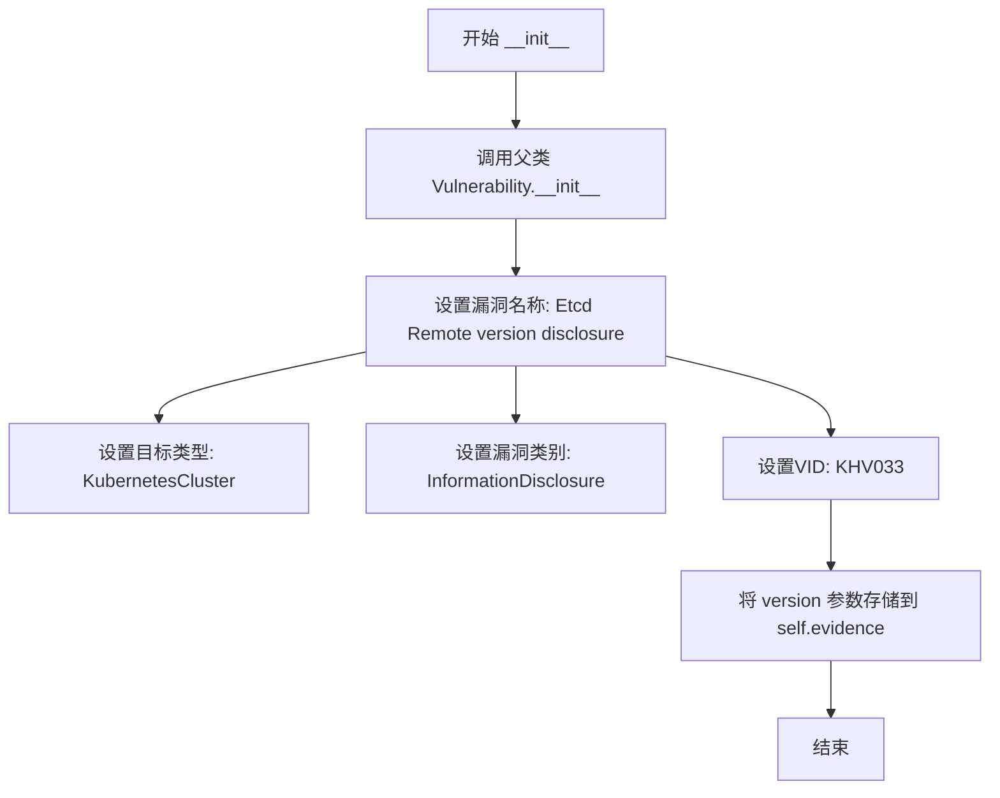

#### 带注释源码

```python
class EtcdRemoteVersionDisclosureEvent(Vulnerability, Event):
    """
    Remote version disclosure might give an attacker a valuable data to attack a cluster
    远程版本信息披露可能为攻击者提供有价值的集群攻击数据
    """

    def __init__(self, version):
        """
        初始化 Etcd 远程版本信息披露漏洞事件
        
        参数:
            version: 从远程 etcd 服务获取的版本信息字符串
        """
        
        # 调用父类 Vulnerability 的构造函数，初始化漏洞基本信息
        # 参数: self, 目标类型, 漏洞名称, 漏洞类别, 漏洞ID
        Vulnerability.__init__(
            self,
            KubernetesCluster,                              # 目标类型为 Kubernetes 集群
            name="Etcd Remote version disclosure",          # 漏洞名称
            category=InformationDisclosure,                # 漏洞类别为信息泄露
            vid="KHV033",                                   # 漏洞唯一标识符
        )
        
        # 将获取的版本信息存储为漏洞证据
        self.evidence = version
```


### `EtcdAccessEnabledWithoutAuthEvent.__init__`

该方法是 `EtcdAccessEnabledWithoutAuthEvent` 类的构造函数，用于初始化一个表示 Etcd 未授权访问漏洞的事件对象。它接收版本信息作为证据，并设置漏洞的类别为未授权访问（UnauthenticatedAccess），同时关联到 Kubernetes 集群资产。

参数：

- `version`：`str`（字符串），表示通过 HTTP 请求获取的 Etcd 版本信息，作为漏洞的证据

返回值：`None`（无返回值），该方法为构造函数，用于初始化对象状态

#### 流程图

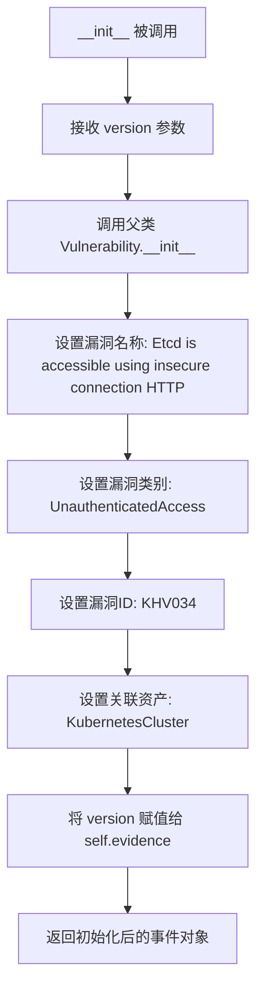

#### 带注释源码

```python
def __init__(self, version):
    """
    初始化 EtcdAccessEnabledWithoutAuthEvent 漏洞事件对象
    
    参数:
        version: 通过不安全 HTTP 连接获取的 Etcd 版本信息
    """
    # 调用父类 Vulnerability 的构造函数，初始化漏洞基本信息
    Vulnerability.__init__(
        self,                                      # 事件实例本身
        KubernetesCluster,                        # 关联的资产类型为 Kubernetes 集群
        name="Etcd is accessible using insecure connection (HTTP)",  # 漏洞名称
        category=UnauthenticatedAccess,           # 漏洞类别为未授权访问
        vid="KHV034",                             # 漏洞唯一标识符
    )
    # 将传入的 version 参数存储为实例的 evidence 属性
    # 用于后续报告或展示漏洞的证据信息
    self.evidence = version
```


### `EtcdRemoteAccessActive.__init__`

EtcdRemoteAccessActive 类的初始化方法，用于接收并存储 OpenPortEvent 事件对象，同时初始化写操作证据属性。

参数：

- `event`：`OpenPortEvent`，触发该 Hunter 运行的端口事件对象，包含目标主机的连接信息

返回值：`None`，构造函数无返回值

#### 流程图

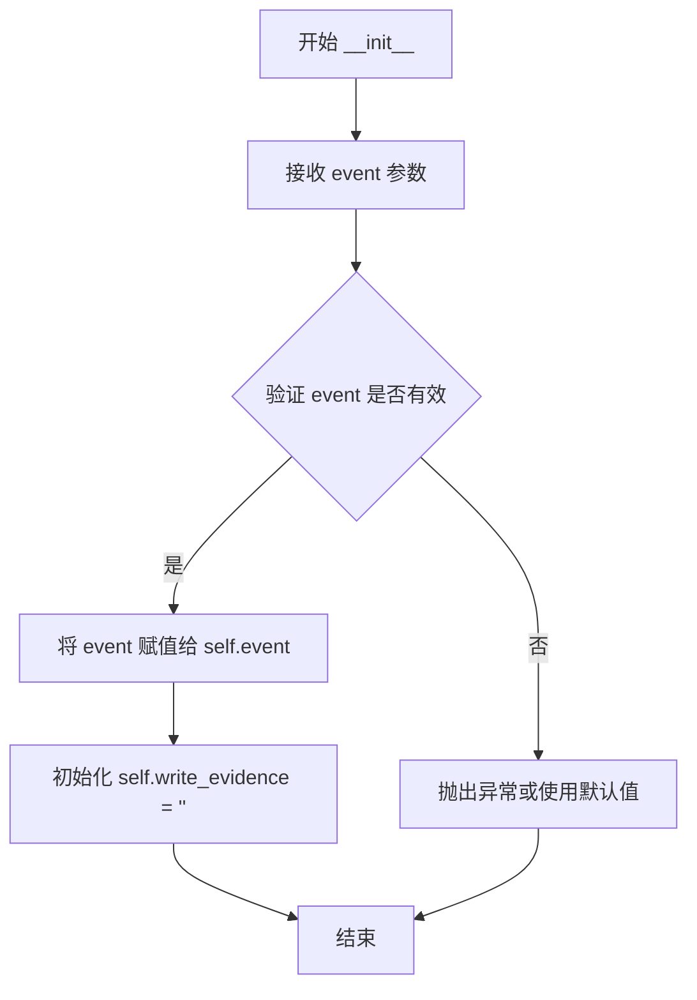

#### 带注释源码

```python
def __init__(self, event):
    """
    初始化 EtcdRemoteAccessActive Hunter
    
    参数:
        event: OpenPortEvent 对象，包含目标 etcd 服务器的主机信息
               从装饰器 @handler.subscribe(OpenPortEvent, predicate=lambda p: p.port == ETCD_PORT)
               可知该事件在检测到 ETCD_PORT (2379) 端口时触发
    """
    # 将传入的事件对象存储为实例属性，供后续方法使用
    # 该 event 对象应包含 host 属性，表示目标 etcd 服务器地址
    self.event = event
    
    # 初始化写入证据字符串，用于存储尝试写入 key 时的响应内容
    # 后续 db_keys_write_access 方法会将实际响应赋值给此属性
    self.write_evidence = ""
```


### `EtcdRemoteAccessActive.db_keys_write_access`

该方法尝试通过 HTTP POST 请求远程写入一个测试键到 etcd 数据库，以验证是否具有远程写访问权限。如果写入成功，返回写入的内容作为证据；否则返回 False。

参数：
- 该方法无显式参数（仅隐式接收 `self`）

返回值：`Union[bytes, bool]`，写入操作的结果证据，如果写入成功返回写入的内容（bytes），否则返回 False

#### 流程图

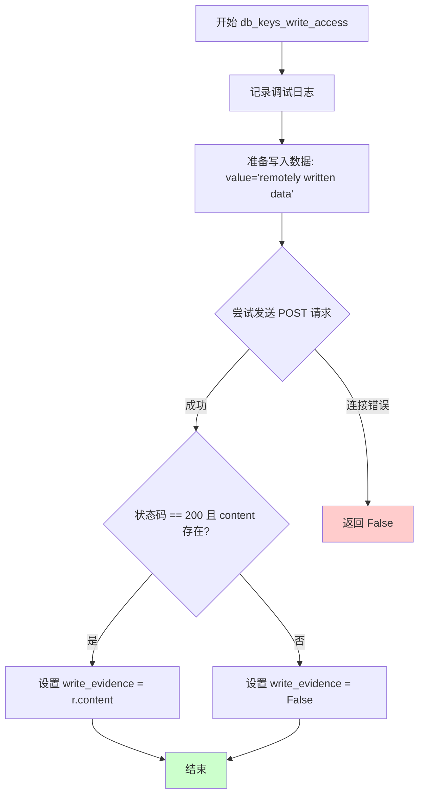

#### 带注释源码

```python
def db_keys_write_access(self):
    """
    尝试远程写入键到 etcd 数据库
    用于检测 etcd 是否允许未授权的远程写访问
    """
    # 记录调试日志，显示目标主机
    logger.debug(f"Trying to write keys remotely on host {self.event.host}")
    
    # 准备写入的数据：测试用的键值对
    data = {"value": "remotely written data"}
    
    try:
        # 发送 POST 请求到 etcd 的 /v2/keys/message 端点
        # 使用类属性 protocol（由 execute 方法设置）和事件中的主机地址
        r = requests.post(
            f"{self.protocol}://{self.event.host}:{ETCD_PORT}/v2/keys/message",
            data=data,
            timeout=config.network_timeout,  # 使用配置的网络超时时间
        )
        
        # 检查响应状态码是否为 200 且内容不为空
        # 如果成功，将响应内容设置为写证据；否则设为 False
        self.write_evidence = r.content if r.status_code == 200 and r.content else False
        
        # 返回写入证据或 False
        return self.write_evidence
        
    except requests.exceptions.ConnectionError:
        # 处理连接错误（如主机不可达、端口未开放等）
        # 返回 False 表示写入失败
        return False
```


### `EtcdRemoteAccessActive.execute`

该方法是一个主动hunter的核心执行逻辑，用于尝试远程写入数据到etcd数据库。如果成功写入，则发布一个EtcdRemoteWriteAccessEvent漏洞事件，以标记发现的安全风险。

参数：
- （无显式参数，隐含self为实例方法）

返回值：`None`，该方法不返回任何值，仅通过发布事件来报告发现

#### 流程图

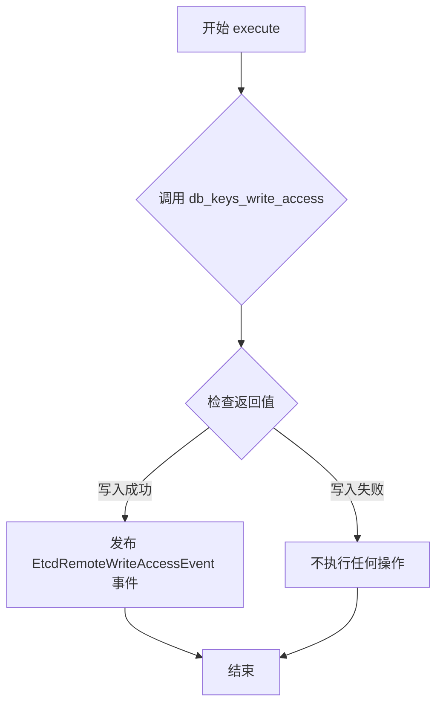

#### 带注释源码

```python
def execute(self):
    """
    执行主动检测：尝试远程写入数据到etcd数据库
    通过调用 db_keys_write_access 方法尝试写入一个测试键值对，
    如果写入成功则发布安全漏洞事件
    """
    # 调用 db_keys_write_access 方法尝试远程写入
    # 如果返回证据（写入成功），则发布漏洞事件
    if self.db_keys_write_access():
        # 发布 EtcdRemoteWriteAccessEvent 事件
        # 传递写入的证据作为事件参数
        self.publish_event(EtcdRemoteWriteAccessEvent(self.write_evidence))
```


### EtcdRemoteAccess.__init__

该方法是 `EtcdRemoteAccess` 类的构造函数，用于初始化 Etcd Remote Access Hunter 实例。接收一个 OpenPortEvent 事件对象，初始化事件引用、存储版本和密钥证据的字符串变量，以及默认使用 HTTPS 协议进行安全通信。

参数：

- `event`：`OpenPortEvent`，从装饰器 `@handler.subscribe(OpenPortEvent, predicate=lambda p: p.port == ETCD_PORT)` 可知，该参数是触发当前 Hunter 的端口事件对象，包含目标主机地址等信息

返回值：`None`，构造函数不返回任何值

#### 流程图

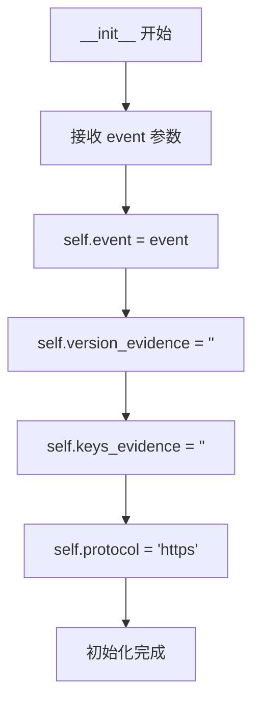

#### 带注释源码

```python
def __init__(self, event):
    # 将传入的 OpenPortEvent 事件对象保存为实例属性
    # 该事件包含目标 etcd 服务的主机地址等信息
    self.event = event
    
    # 初始化用于存储版本信息披露结果的字符串变量
    # 后续 version_disclosure() 方法会将获取到的版本信息存入此变量
    self.version_evidence = ""
    
    # 初始化用于存储密钥信息披露结果的字符串变量
    # 后续 db_keys_disclosure() 方法会将获取到的 keys 信息存入此变量
    self.keys_evidence = ""
    
    # 设置默认协议为 HTTPS
    # 后续 execute() 方法会根据不安全访问测试结果决定是否切换为 HTTP
    self.protocol = "https"
```


### EtcdRemoteAccess.db_keys_disclosure

该方法用于被动检测etcd是否允许远程读取密钥，通过向etcd的v2/keys端点发送GET请求来获取数据库中的密钥信息。

参数：

- `self`：隐式参数，`EtcdRemoteAccess`类实例本身

返回值：`Any`（返回`requests.Response.content`或`False`布尔值），返回etcd密钥内容（请求成功且有内容时）或`False`（连接失败或无内容时）

#### 流程图

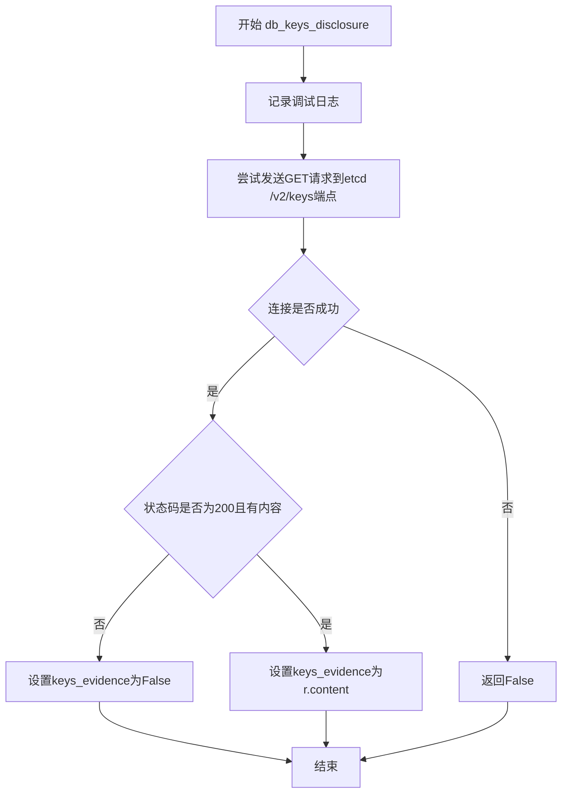

#### 带注释源码

```python
def db_keys_disclosure(self):
    """被动检测etcd远程密钥读取访问"""
    # 记录调试日志，显示正在尝试远程读取etcd密钥
    logger.debug(f"{self.event.host} Passive hunter is attempting to read etcd keys remotely")
    try:
        # 发送GET请求到etcd的v2/keys端点获取密钥列表
        # 注意：此处存在代码bug -- self.eventhost应为self.event.host
        r = requests.get(
            f"{self.protocol}://{self.eventhost}:{ETCD_PORT}/v2/keys", 
            verify=False, 
            timeout=config.network_timeout,
        )
        # 如果请求成功且返回了内容，则保存内容作为证据；否则设为False
        self.keys_evidence = r.content if r.status_code == 200 and r.content != "" else False
        return self.keys_evidence
    except requests.exceptions.ConnectionError:
        # 连接失败时返回False
        return False
```


### `EtcdRemoteAccess.version_disclosure`

该方法是一个被动扫描器的成员函数，用于通过向 etcd 的 `/version` 端点发送 HTTP GET 请求来远程获取 etcd 服务器的版本信息。如果请求成功（HTTP 200）且响应有内容，则返回版本信息作为证据；否则返回 False 表示版本信息不可获取。

参数：

- 该方法没有显式参数（仅隐式接收 `self` 实例）

返回值：`str | bool`，返回获取到的 etcd 版本信息（字符串），如果请求失败或无响应内容则返回 False

#### 流程图

```mermaid
flowchart TD
    A[开始 version_disclosure] --> B[记录调试日志: 尝试远程检查 etcd 版本]
    B --> C[构造请求URL: https://{host}:2379/version]
    C --> D{尝试发送GET请求}
    D -->|成功| E{检查响应状态码 == 200 且有内容}
    D -->|连接失败| F[捕获 ConnectionError 异常]
    F --> G[返回 False]
    E -->|是| H[设置 version_evidence = r.content]
    E -->|否| I[设置 version_evidence = False]
    H --> J[返回 version_evidence]
    I --> J
```

#### 带注释源码

```python
def version_disclosure(self):
    """
    尝试远程获取 etcd 服务器的版本信息
    通过向 etcd 的 /version 端点发送 HTTPS GET 请求实现
    """
    # 记录调试日志，包含目标主机信息
    logger.debug(f"Trying to check etcd version remotely at {self.event.host}")
    
    try:
        # 构造版本检查请求 URL
        # 使用 HTTPS 协议和 2379 端口访问 etcd 的 version 端点
        r = requests.get(
            f"{self.protocol}://{self.event.host}:{ETCD_PORT}/version",
            verify=False,           # 禁用 SSL 证书验证（潜在安全风险）
            timeout=config.network_timeout,  # 使用配置的 network_timeout 作为超时时间
        )
        
        # 判断请求是否成功：如果状态码为 200 且响应有内容
        # 则将响应内容作为版本证据，否则设为 False
        self.version_evidence = r.content if r.status_code == 200 and r.content else False
        
        # 返回获取到的版本证据（字符串）或 False
        return self.version_evidence
    
    except requests.exceptions.ConnectionError:
        # 捕获连接错误（如目标不可达）
        # 返回 False 表示无法获取版本信息
        return False
```


### `EtcdRemoteAccess.insecure_access`

该方法用于通过不安全的 HTTP 协议尝试访问 etcd 的版本端点，以检测 etcd 是否启用了未加密的 HTTP 访问，从而发现潜在的安全风险。

参数：无（仅包含 `self`）

返回值：`Any`，返回成功获取的 etcd 版本信息（bytes 类型）或连接失败时返回 `False`

#### 流程图

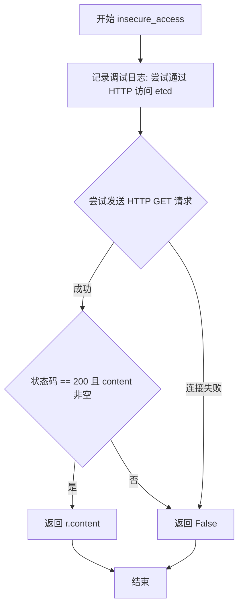

#### 带注释源码

```python
def insecure_access(self):
    """
    通过不安全的 HTTP 协议尝试访问 etcd 的 version 端点
    用于检测 etcd 是否暴露在未加密的 HTTP 连接中
    """
    logger.debug(f"Trying to access etcd insecurely at {self.event.host}")
    try:
        # 构造不安全的 HTTP 请求 URL，使用 2379 端口访问 /version 端点
        r = requests.get(
            f"http://{self.event.host}:{ETCD_PORT}/version", verify=False, timeout=config.network_timeout,
        )
        # 检查响应状态码为 200 且有返回内容，否则返回 False
        return r.content if r.status_code == 200 and r.content else False
    except requests.exceptions.ConnectionError:
        # 捕获连接错误（如端口不可达、服务未启动等），返回 False
        return False
```


### EtcdRemoteAccess.execute()

该方法通过尝试使用 HTTP 和 HTTPS 协议访问 etcd 服务，检查其远程可用性、版本信息泄露以及数据库读取访问权限，并根据访问结果发布相应的安全事件。

参数：
- 无显式参数（仅包含隐式 self 参数）

返回值：`None`（无返回值），该方法通过发布事件来报告发现的安全问题

#### 流程图

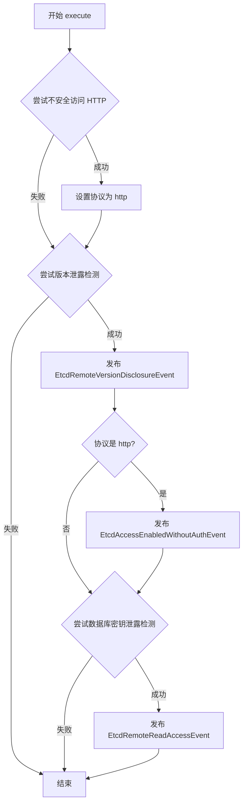

#### 带注释源码

```python
def execute(self):
    # 尝试使用 HTTP 不安全访问 etcd 服务
    # 如果成功返回版本信息，则说明 etcd 可通过 HTTP 访问
    if self.insecure_access():  # make a decision between http and https protocol
        # 设置协议为 HTTP，后续操作使用 HTTP
        self.protocol = "http"
    
    # 尝试获取 etcd 版本信息，用于检测版本泄露漏洞
    if self.version_disclosure():
        # 发布版本泄露事件，通知系统发现版本信息泄露
        self.publish_event(EtcdRemoteVersionDisclosureEvent(self.version_evidence))
        
        # 如果协议仍为 HTTP，说明 etcd 启用了不安全连接且无认证
        if self.protocol == "http":
            # 发布未授权访问事件
            self.publish_event(EtcdAccessEnabledWithoutAuthEvent(self.version_evidence))
        
        # 尝试读取 etcd 数据库中的 keys，用于检测读取访问权限
        if self.db_keys_disclosure():
            # 发布远程读取访问事件，通知系统发现数据库密钥泄露
            self.publish_event(EtcdRemoteReadAccessEvent(self.keys_evidence))
```

## 关键组件


### EtcdRemoteWriteAccessEvent

远程写入访问漏洞事件类，用于报告攻击者可能通过远程写入获取对Kubernetes集群完全控制的风险

### EtcdRemoteReadAccessEvent

远程读取访问漏洞事件类，用于报告攻击者可能通过远程读取获取集群漏洞利用、密钥等敏感信息的风险

### EtcdRemoteVersionDisclosureEvent

远程版本泄露漏洞事件类，用于报告Etcd版本信息泄露可能为攻击者提供有价值攻击数据的问题

### EtcdAccessEnabledWithoutAuthEvent

未授权访问漏洞事件类，用于报告Etcd通过HTTP协议无认证访问的安全风险

### EtcdRemoteAccessActive

主动检测器类，通过尝试向Etcd数据库写入测试数据来验证远程写入权限，检测恶意攻击者可能的完全控制能力

### EtcdRemoteAccess

被动检测器类，检测Etcd服务的远程可用性、版本信息、数据库读取访问权限以及HTTP未授权访问配置

### db_keys_write_access

主动写入检测方法，通过HTTP POST请求向Etcd的v2/keys端点写入测试数据，验证远程写入权限

### db_keys_disclosure

被动读取检测方法，通过HTTP GET请求尝试从Etcd的v2/keys端点读取键值信息，验证远程读取权限

### version_disclosure

版本检测方法，通过HTTP GET请求从Etcd的/version端点获取版本信息

### insecure_access

不安全访问检测方法，使用HTTP协议（而非HTTPS）尝试访问Etcd服务，验证是否存在未授权访问风险

### ETCD_PORT

Etcd服务默认端口常量，值为2379，用于标识需要检测的目标端口

### Event Predicate

基于端口号的事件过滤谓词，用于筛选OpenPortEvent中端口为2379的Etcd相关事件


## 问题及建议


### 已知问题

-   **拼写错误导致运行时错误**：`EtcdRemoteAccess.db_keys_disclosure` 方法中使用 `self.eventhost` 而非 `self.event.host`，会在运行时引发 `AttributeError`。
-   **异常处理不全面**：仅捕获 `requests.exceptions.ConnectionError`，缺少对 `Timeout`、`SSLError`、`RequestException` 等其他网络异常的处理。
-   **重复代码模式**：HTTP请求逻辑在多个方法中重复出现（构建URL、发送请求、检查状态码、提取内容），违反 DRY 原则。
-   **不安全的SSL验证**：多处使用 `verify=False` 禁用SSL证书验证，在生产环境中存在安全风险。
-   **ActiveHunter和Hunter职责重叠**：两者都订阅相同端口的 `OpenPortEvent`，且执行逻辑存在重复，可考虑抽象基类或合并逻辑。
-   **硬编码的协议切换逻辑**：在 `execute` 方法中通过 `insecure_access` 试验性修改协议，不够优雅且可能导致额外的网络请求。
-   **缺少类型注解**：方法参数和返回值均无类型提示，影响代码可读性和IDE支持。
-   **资源未正确释放**：未使用 `requests` 的上下文管理器或显式关闭连接，可能导致连接泄漏。
-   **日志级别不一致**：部分使用 `logger.debug`，但关键操作（如发现漏洞）应使用 `logger.info` 或 `logger.warning`。

### 优化建议

-   **修复拼写错误**：将 `self.eventhost` 修正为 `self.event.host`。
-   **增强异常处理**：使用 `requests.exceptions.RequestException` 捕获更广泛的异常，或分别为不同异常类型提供处理逻辑。
-   **抽取通用HTTP方法**：创建私有方法如 `_make_request(self, method, path)` 减少重复代码，统一处理超时、SSL验证和错误日志。
-   **安全化SSL验证**：优先使用默认的证书验证，若需测试环境禁用，应通过配置控制并添加明确注释说明风险。
-   **重构Hunter类层次**：提取公共逻辑到基类（如处理事件对象、构建基础URL），让 `EtcdRemoteAccess` 和 `EtcdRemoteAccessActive` 继承。
-   **协议选择优化**：在初始化时根据配置或预设条件确定协议，而非运行时探测。
-   **添加类型注解**：为所有方法参数和返回值添加类型提示，如 `def execute(self) -> None:`。
-   **使用Session对象**：利用 `requests.Session()` 重用TCP连接，提升性能并更好地管理连接生命周期。
-   **统一日志策略**：根据操作重要性和上下文选择合适的日志级别，关键发现使用 WARNING 或 INFO。
-   **提取URL路径为常量**：将 `/v2/keys`、`/version` 等路径定义为模块级常量，提高可维护性。


## 其它


### 设计目标与约束

本模块旨在检测Kubernetes集群中etcd服务的安全漏洞，主要目标包括：检测etcd是否支持远程写入访问、远程读取访问、版本信息泄露以及未授权的HTTP访问。设计约束包括：仅针对ETCD_PORT（2379）端口进行检测，需要目标主机网络可达，使用HTTPS作为默认协议（可降级为HTTP），且所有HTTP请求均设置超时限制以避免扫描挂起。

### 错误处理与异常设计

代码采用返回False而非抛出异常的错误处理策略。当发生网络连接错误（requests.exceptions.ConnectionError）时，各检测方法返回False表示检测失败。对于HTTP响应状态码非200或响应内容为空的情况，同样返回False。这种设计使得execute方法可以简单通过if判断来决定是否发布事件。潜在的改进方向包括：区分不同类型的网络错误（超时、拒绝连接、DNS解析失败等），以及添加重试机制处理临时性网络故障。

### 数据流与状态机

数据流遵循以下流程：首先，kube-hunter的端口扫描模块发现目标主机开放2379端口后，发布OpenPortEvent事件。该事件被两个订阅者（EtcdRemoteAccessActive和EtcdRemoteAccess）同时接收处理。被动hunter（EtcdRemoteAccess）先尝试HTTP访问，根据结果确定使用HTTP还是HTTPS协议，随后依次执行版本检测、密钥泄露检测，根据检测结果发布相应的事件。主动hunter（EtcdRemoteAccessActive）则直接尝试远程写入操作，若成功则发布写入事件。整体呈现事件驱动的状态机模式，状态转换依赖于各检测步骤的成功与否。

### 外部依赖与接口契约

主要外部依赖包括：requests库用于HTTP/HTTPS请求，logging模块用于日志记录，kube_hunter框架的核心模块（config配置管理、events事件处理、types类型定义）。接口契约方面，Hunter类需实现execute方法；Event类需继承自Vulnerability和Event基类；所有检测方法需返回检测结果（证据字符串或False）；publish_event方法用于发布检测到的事件。配置文件通过config.network_timeout提供网络超时配置。

### 安全性考虑

代码存在若干安全相关问题：verify=False参数禁用了SSL证书验证，存在中间人攻击风险，建议在生产环境中启用验证或提供配置选项；检测到的漏洞证据（写入的数据、读取的密钥、版本信息）直接存储在事件中，需要确保后续处理和存储的安全性；HTTP降级检测虽然实现了兼容性，但可能泄露敏感信息，建议通过配置控制是否允许HTTP检测。

### 配置管理

配置管理主要通过kube_hunter的config模块实现，关键配置项为config.network_timeout用于控制HTTP请求超时时间。ETCD_PORT常量硬编码为2379，可考虑提取为可配置项以支持非标准端口的etcd实例检测。protocol字段在实例初始化时默认为https，运行时根据insecure_access检测结果动态修改为http。

### 性能考虑

代码通过timeout参数防止HTTP请求无限挂起，这是基本的性能保障措施。改进方向包括：添加请求重试机制处理临时性网络抖动；实现连接复用（使用requests.Session）；对于大规模集群扫描，考虑添加并发控制避免对目标造成过大负载；可添加请求间隔控制防止被目标防火墙拦截。

### 测试策略

建议补充以下测试用例：单元测试覆盖各检测方法的正常返回和异常返回场景；集成测试模拟etcd服务响应进行端到端测试；Mock测试使用responses或requests-mock库模拟HTTP响应，验证事件发布逻辑；边界测试覆盖超时、空响应、错误状态码等场景。由于涉及网络请求，测试应重点关注错误处理路径的覆盖。

### 部署和运维

本模块作为kube-hunter的插件模块部署，无需独立部署。运维关注点包括：确保扫描节点网络可达目标etcd端口2379；注意扫描可能对目标etcd产生写入操作（主动hunter会写入测试key），生产环境需谨慎使用主动hunter；建议在非高峰时段运行扫描任务；扫描结果应妥善保存以便安全审计和合规检查。

### 日志和监控

日志记录使用Python标准logging模块，logger名称为__name__。主要日志点包括：各检测方法的调试级别日志，记录目标主机和检测意图；异常捕获时无额外日志输出，建议补充错误详情便于问题排查；可增加INFO级别日志记录检测到的漏洞数量，便于运维监控。监控方面可关注：扫描任务执行时长和成功率、检测到的漏洞数量和严重程度分布、网络请求失败率等指标。


    