# `kubehunter\kube_hunter\modules\hunting\kubelet.py` 详细设计文档

这是一个 Kubernetes Kubelet 安全漏洞扫描模块，用于检测 Kubernetes 集群中 Kubelet 组件的多个安全漏洞，包括只读端口和安全端口的漏洞检测、特权容器识别、敏感端点暴露等问题，并提供主动验证功能来确认漏洞的可利用性。

## 整体流程

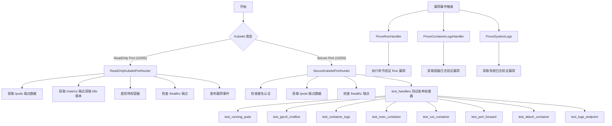

## 类结构

```
Event (基类)
├── Vulnerability (漏洞基类)
│   ├── ExposedPodsHandler
│   ├── AnonymousAuthEnabled
│   ├── ExposedContainerLogsHandler
│   ├── ExposedRunningPodsHandler
│   ├── ExposedExecHandler
│   ├── ExposedRunHandler
│   ├── ExposedPortForwardHandler
│   ├── ExposedAttachHandler
│   ├── ExposedHealthzHandler
│   ├── PrivilegedContainers
│   ├── ExposedSystemLogs
│   └── ExposedKubeletCmdline
├── Hunter (基类)
│   ├── ReadOnlyKubeletPortHunter
│   └── SecureKubeletPortHunter
│       └── DebugHandlers (内部类)
└── ActiveHunter (主动 hunter 基类)
    ├── ProveRunHandler
    ├── ProveContainerLogsHandler
    └── ProveSystemLogs
Enum
└── KubeletHandlers
```

## 全局变量及字段


### `logger`
    
模块级日志记录器，用于记录调试和运行信息

类型：`logging.Logger`
    


### `ExposedPodsHandler.pods`
    
存储从 Kubelet /pods 端点获取的 Pod 列表

类型：`list`
    


### `ExposedPodsHandler.evidence`
    
漏洞证据字符串，包含 Pod 数量统计

类型：`str`
    


### `ExposedRunningPodsHandler.count`
    
当前运行的 Pod 数量

类型：`int`
    


### `ExposedRunningPodsHandler.evidence`
    
漏洞证据字符串，包含运行 Pod 数量信息

类型：`str`
    


### `ExposedHealthzHandler.status`
    
Kubelet /healthz 端点返回的健康状态

类型：`str`
    


### `ExposedHealthzHandler.evidence`
    
漏洞证据字符串，包含健康状态信息

类型：`str`
    


### `PrivilegedContainers.containers`
    
特权容器的列表，每个元素为 (pod_name, container_name) 元组

类型：`list`
    


### `PrivilegedContainers.evidence`
    
漏洞证据字符串，包含第一个特权容器的 Pod 和容器名称及总数

类型：`str`
    


### `ExposedKubeletCmdline.cmdline`
    
Kubelet 启动时使用的命令行参数

类型：`str`
    


### `ExposedKubeletCmdline.evidence`
    
漏洞证据字符串，包含命令行参数信息

类型：`str`
    


### `ReadOnlyKubeletPortHunter.event`
    
触发此 Hunter 的事件对象，包含目标主机和端口信息

类型：`ReadOnlyKubeletEvent`
    


### `ReadOnlyKubeletPortHunter.path`
    
只读 Kubelet 的 HTTP 访问路径 URL

类型：`str`
    


### `ReadOnlyKubeletPortHunter.pods_endpoint_data`
    
从 /pods 端点获取的完整 JSON 响应数据

类型：`dict`
    


### `SecureKubeletPortHunter.event`
    
触发此 Hunter 的事件对象，包含认证信息和安全配置

类型：`SecureKubeletEvent`
    


### `SecureKubeletPortHunter.session`
    
用于与安全 Kubelet 进行 HTTP 通信的会话对象

类型：`requests.Session`
    


### `SecureKubeletPortHunter.path`
    
安全 Kubelet 的 HTTPS 访问路径 URL

类型：`str`
    


### `SecureKubeletPortHunter.kubehunter_pod`
    
kube-hunter 自身的 Pod 信息，用于在 Pod 内运行时测试

类型：`dict`
    


### `SecureKubeletPortHunter.pods_endpoint_data`
    
从 /pods 端点获取的完整 JSON 响应数据

类型：`dict`
    


### `SecureKubeletPortHunter.DebugHandlers.path`
    
Kubelet 基础访问路径

类型：`str`
    


### `SecureKubeletPortHunter.DebugHandlers.session`
    
用于执行调试端点测试的请求会话

类型：`requests.Session`
    


### `SecureKubeletPortHunter.DebugHandlers.pod`
    
用于测试的目标 Pod 信息，包含名称、命名空间和容器名

类型：`dict`
    


### `ProveRunHandler.event`
    
触发此 ActiveHunter 的事件对象

类型：`ExposedRunHandler`
    


### `ProveRunHandler.base_path`
    
安全 Kubelet 的基础访问 URL

类型：`str`
    


### `ProveContainerLogsHandler.event`
    
触发此 ActiveHunter 的事件对象

类型：`ExposedContainerLogsHandler`
    


### `ProveContainerLogsHandler.base_url`
    
Kubelet 的基础访问 URL（根据端口自动选择 HTTP/HTTPS）

类型：`str`
    


### `ProveSystemLogs.event`
    
触发此 ActiveHunter 的事件对象

类型：`ExposedSystemLogs`
    


### `ProveSystemLogs.base_url`
    
安全 Kubelet 的基础访问 HTTPS URL

类型：`str`
    
    

## 全局函数及方法


### `ExposedPodsHandler.__init__`

初始化 ExposedPodsHandler 漏洞处理器，用于存储从 Kubelet /pods 端点获取的暴露 Pods 信息，并将 Pod 数量作为证据保存。

参数：

- `pods`：`List[dict]`，从 Kubelet /pods 端点返回的 Pod 列表数据

返回值：`None`，构造函数无返回值

#### 流程图

```mermaid
flowchart TD
    A[__init__ 调用] --> B[调用父类 Vulnerability.__init__]
    B --> C[设置 component=Kubelet]
    C --> D[设置 name='Exposed Pods']
    D --> E[设置 category=InformationDisclosure]
    E --> F[保存 pods 到实例变量 self.pods]
    F --> G[生成证据: count: {len(self.pods)}]
    G --> H[保存证据到 self.evidence]
```

#### 带注释源码

```python
def __init__(self, pods):
    # 调用父类 Vulnerability 的初始化方法
    # 设置漏洞组件为 Kubelet，漏洞名称为 "Exposed Pods"，分类为信息泄露
    Vulnerability.__init__(
        self, component=Kubelet, name="Exposed Pods", category=InformationDisclosure,
    )
    # 保存传入的 pods 数据（Pod 列表）到实例变量
    self.pods = pods
    # 生成证据字符串，包含暴露的 Pod 数量
    self.evidence = f"count: {len(self.pods)}"
```


### `AnonymousAuthEnabled.__init__`

该方法是 `AnonymousAuthEnabled` 类的构造函数，用于初始化一个表示 Kubernetes Kubelet 匿名认证已启用的安全漏洞事件对象，继承自 `Vulnerability` 和 `Event` 事件类。

参数：

- `self`：隐式参数，`AnonymousAuthEnabled` 实例本身，无需显式传递

返回值：`None`，该方法为构造函数，不返回任何值

#### 流程图


#### 带注释源码

```python
def __init__(self):
    """初始化 AnonymousAuthEnabled 漏洞事件对象
    
    该构造函数创建一个表示 Kubelet 匿名认证配置错误的安全漏洞事件。
    当 Kubelet 配置允许匿名用户访问时，攻击者可能无需认证即可访问
    Kubelet 的所有请求端点，从而执行远程代码或获取敏感信息。
    """
    Vulnerability.__init__(
        self, component=Kubelet, name="Anonymous Authentication", category=RemoteCodeExec, vid="KHV036",
    )
    # component=Kubelet: 指定该漏洞涉及 Kubelet 组件
    # name="Anonymous Authentication": 漏洞名称
    # category=RemoteCodeExec: 漏洞类别为远程代码执行
    # vid="KHV036": kube-hunter 漏洞编号
```


### `ExposedContainerLogsHandler.__init__`

该方法为 `ExposedContainerLogsHandler` 类的构造函数，用于初始化漏洞事件对象。它调用父类 `Vulnerability` 的构造函数，配置漏洞的基本属性，包括组件、名称、类别和漏洞 ID。

参数：
- 无（仅包含隐式参数 `self`）

返回值：`None`，无返回值（构造函数）

#### 流程图

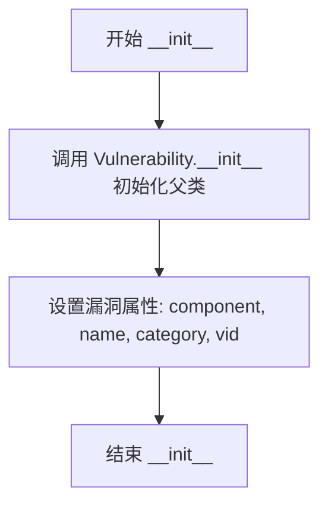

#### 带注释源码

```python
def __init__(self):
    """
    初始化 ExposedContainerLogsHandler 漏洞事件
    
    该构造函数继承自 Vulnerability 和 Event 类，用于表示一个安全漏洞。
    漏洞特征：攻击者可能通过 kubelet 的 /containerLogs 端点获取运行中容器的日志，
    从而造成敏感信息泄露。
    """
    # 调用父类 Vulnerability 的构造函数，初始化漏洞基础信息
    # 参数说明：
    # - self: 当前实例对象
    # - component=Kubelet: 漏洞所在组件为 Kubelet
    # - name="Exposed Container Logs": 漏洞名称
    # - category=InformationDisclosure: 漏洞类别为信息泄露
    # - vid="KHV037": 漏洞的唯一标识符
    Vulnerability.__init__(
        self, component=Kubelet, name="Exposed Container Logs", category=InformationDisclosure, vid="KHV037",
    )
```


### `ExposedRunningPodsHandler.__init__`

该方法是 `ExposedRunningPodsHandler` 类的构造函数，用于初始化一个暴露运行中 Pods 信息的漏洞事件对象。它接收运行中 Pod 的数量作为参数，调用父类 `Vulnerability` 的构造函数设置组件为 Kubelet、名称为 "Exposed Running Pods"、分类为信息泄露，并将数量存储在实例属性中，同时生成相应的证据字符串。

参数：

- `count`：`int`，表示当前正在运行的 Pod 数量

返回值：`None`，Python 中的 `__init__` 方法不返回值，默认返回 `None`

#### 流程图

```mermaid
flowchart TD
    A[开始 __init__] --> B[调用 Vulnerability.__init__]
    B --> C[设置 component=Kubelet]
    C --> D[设置 name=Exposed Running Pods]
    D --> E[设置 category=InformationDisclosure]
    E --> F[设置 vid=KHV038]
    F --> G[self.count = count]
    G --> H[self.evidence = '{} running pods'.format(count)]
    H --> I[结束]
```

#### 带注释源码

```python
def __init__(self, count):
    """
    初始化 ExposedRunningPodsHandler 漏洞事件对象
    
    参数:
        count: 当前正在运行的 Pod 数量
    """
    # 调用父类 Vulnerability 的构造函数，初始化漏洞基本信息
    # component=Kubelet: 表示该漏洞与 Kubelet 组件相关
    # name="Exposed Running Pods": 漏洞名称
    # category=InformationDisclosure: 漏洞分类为信息泄露
    # vid="KHV038": 漏洞的唯一标识符
    Vulnerability.__init__(
        self, component=Kubelet, name="Exposed Running Pods", category=InformationDisclosure, vid="KHV038",
    )
    
    # 存储运行中 Pod 的数量
    self.count = count
    
    # 生成证据字符串，用于描述漏洞的证据信息
    # 格式: "{数量} running pods"
    self.evidence = "{} running pods".format(self.count)
```


### `ExposedExecHandler.__init__`

这是一个漏洞事件类的初始化方法，用于表示 Kubelet 上暴露的容器执行（exec）功能，攻击者可能利用此漏洞在容器中执行任意命令。

参数：

- 无显式参数（仅隐式接收 `self`）

返回值：`None`，该方法为构造函数，不返回任何值。

#### 流程图

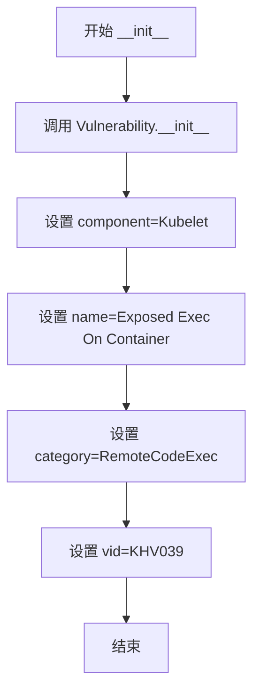

#### 带注释源码

```python
class ExposedExecHandler(Vulnerability, Event):
    """An attacker could run arbitrary commands on a container"""

    def __init__(self):
        # 调用父类 Vulnerability 的初始化方法
        # component=Kubelet: 表示该漏洞属于 Kubelet 组件
        # name="Exposed Exec On Container": 漏洞名称
        # category=RemoteCodeExec: 漏洞类别为远程代码执行
        # vid="KHV039": 漏洞的唯一标识符
        Vulnerability.__init__(
            self, component=Kubelet, name="Exposed Exec On Container", category=RemoteCodeExec, vid="KHV039",
        )
```


### `ExposedRunHandler.__init__`

该方法为 `ExposedRunHandler` 漏洞事件类的构造函数，初始化一个表示"攻击者可以在容器内执行任意命令"的安全漏洞事件。它继承自 `Vulnerability` 和 `Event` 类，设置组件为 Kubelet，类别为 RemoteCodeExec，并指定漏洞 ID 为 KHV040。

参数：

- `self`：隐式参数，类型为 `ExposedRunHandler` 实例，代表当前正在初始化的对象

返回值：`None`，该方法仅执行初始化操作，不返回任何值

#### 流程图

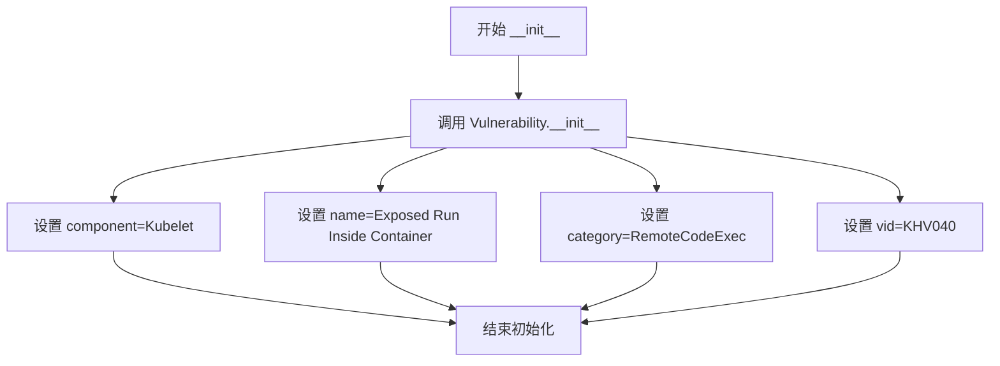

#### 带注释源码

```python
class ExposedRunHandler(Vulnerability, Event):
    """An attacker could run an arbitrary command inside a container"""

    def __init__(self):
        # 调用父类 Vulnerability 的初始化方法
        # 设置漏洞组件为 Kubelet（Kubelet 服务）
        # 设置漏洞名称为 "Exposed Run Inside Container"
        # 设置漏洞类别为 RemoteCodeExec（远程代码执行）
        # 设置漏洞 ID 为 KHV040
        Vulnerability.__init__(
            self, component=Kubelet, name="Exposed Run Inside Container", category=RemoteCodeExec, vid="KHV040",
        )
```


### ExposedPortForwardHandler.__init__

该方法是`ExposedPortForwardHandler`类的构造函数，用于初始化一个表示“暴露的端口转发”漏洞的事件对象，继承自`Vulnerability`和`Event`类，设置组件为Kubelet，名称为"Exposed Port Forward"，类别为远程代码执行（RemoteCodeExec），并关联漏洞ID"KHV041"。

参数：无

返回值：`None`，该方法为构造函数，不返回任何值

#### 流程图

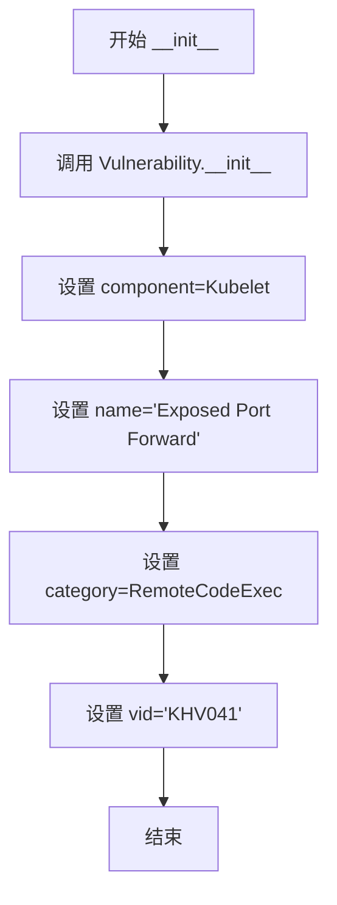

#### 带注释源码

```python
class ExposedPortForwardHandler(Vulnerability, Event):
    """An attacker could set port forwarding rule on a pod"""

    def __init__(self):
        # 调用父类 Vulnerability 的初始化方法
        # 参数 component=Kubelet: 指定该漏洞涉及 Kubelet 组件
        # 参数 name='Exposed Port Forward': 漏洞名称
        # 参数 category=RemoteCodeExec: 漏洞类别为远程代码执行
        # 参数 vid='KHV041': Kube-Hunter 项目的漏洞唯一标识符
        Vulnerability.__init__(
            self, component=Kubelet, name="Exposed Port Forward", category=RemoteCodeExec, vid="KHV041",
        )
```


### `ExposedAttachHandler.__init__`

该方法是 `ExposedAttachHandler` 类的构造函数，用于初始化一个表示"可 attach 到运行中容器"漏洞的事件对象，继承自 `Vulnerability` 和 `Event`，设置组件为 Kubelet，类别为远程代码执行风险，并指定漏洞 ID 为 KHV042。

参数：

- `self`：当前实例对象，无需显式传入

返回值：`None`，构造函数无返回值

#### 流程图

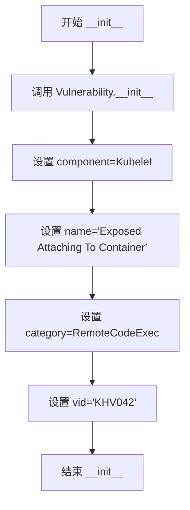

#### 带注释源码

```python
def __init__(self):
    # 调用父类 Vulnerability 的初始化方法，传入以下参数：
    # - component=Kubelet: 指定该漏洞关联的组件为 Kubelet
    # - name='Exposed Attaching To Container': 漏洞名称
    # - category=RemoteCodeExec: 漏洞类别为远程代码执行
    # - vid='KHV042': 漏洞的唯一标识符
    Vulnerability.__init__(
        self, component=Kubelet, name="Exposed Attaching To Container", category=RemoteCodeExec, vid="KHV042",
    )
```


### `ExposedHealthzHandler.__init__`

这是 `ExposedHealthzHandler` 漏洞事件类的初始化方法，用于处理当攻击者访问开放的 `/healthz` 端点时可能获取集群健康状态而不需要身份验证的场景。该类继承自 `Vulnerability` 和 `Event`，用于记录和发布集群健康信息泄露的安全漏洞事件。

参数：

- `status`：`str`，表示从 kubelet 的 `/healthz` 端点返回的集群健康状态字符串

返回值：`None`，无返回值（这是 `__init__` 初始化方法）

#### 流程图

```mermaid
flowchart TD
    A[开始 __init__] --> B[调用父类 Vulnerability.__init__]
    B --> C[设置 component=Kubelet]
    C --> D[设置 name=Cluster Health Disclosure]
    D --> E[设置 category=InformationDisclosure]
    E --> F[设置 vid=KHV043]
    F --> G[将参数 status 赋值给实例属性 self.status]
    G --> H[构造证据字符串: status: {status}]
    H --> I[将证据赋值给 self.evidence]
    I --> J[结束 __init__]
```

#### 带注释源码

```python
class ExposedHealthzHandler(Vulnerability, Event):
    """By accessing the open /healthz handler,
    an attacker could get the cluster health state without authenticating"""

    def __init__(self, status):
        # 调用父类 Vulnerability 的初始化方法，设置漏洞相关元数据
        Vulnerability.__init__(
            self, component=Kubelet, name="Cluster Health Disclosure", category=InformationDisclosure, vid="KHV043",
        )
        # 将传入的 healthz 状态字符串保存为实例属性，供后续事件处理使用
        self.status = status
        # 生成证据字符串，包含获取到的健康状态，用于事件记录和报告
        self.evidence = f"status: {self.status}"
```


### PrivilegedContainers.__init__

该方法是 PrivilegedContainers 漏洞事件类的构造函数，用于初始化特权容器检测结果的漏洞事件。它继承自 Vulnerability 和 Event 类，接收包含特权容器信息的列表，提取第一个容器的 pod 名称和容器名称作为证据，并记录发现的特权容器总数。

参数：

- `containers`：`list`，一个包含特权容器的列表，每个元素为二元组 (pod_name, container_name)，用于记录在节点上发现的具有特权权限的容器信息

返回值：`None`，该方法为构造函数，不返回任何值，仅通过 self 参数初始化对象状态

#### 流程图

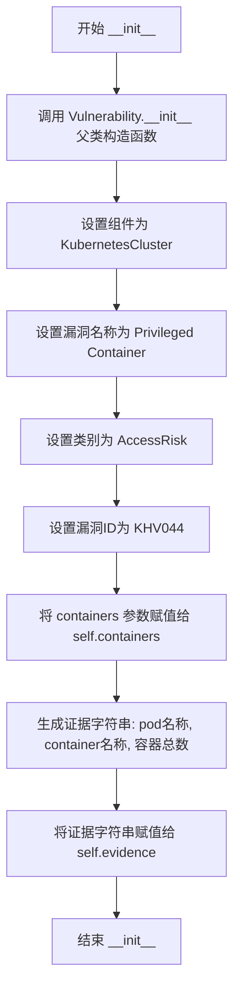

#### 带注释源码

```python
def __init__(self, containers):
    # 调用父类 Vulnerability 的构造函数，初始化漏洞基本信息
    Vulnerability.__init__(
        self, 
        component=KubernetesCluster,  # 设置组件类型为 Kubernetes 集群
        name="Privileged Container",   # 漏洞名称
        category=AccessRisk,          # 风险类别为访问风险
        vid="KHV044",                  # 漏洞唯一标识符
    )
    # 将传入的特权容器列表保存为实例属性，供后续处理使用
    self.containers = containers
    # 生成证据信息，包含第一个容器所在的 Pod 名称、容器名称及发现的特权容器总数
    # containers[0][0] 为第一个容器的 Pod 名称
    # containers[0][1] 为第一个容器的名称
    # len(containers) 为发现的特权容器总数
    self.evidence = f"pod: {containers[0][0]}, " f"container: {containers[0][1]}, " f"count: {len(containers)}"
```


### `ExposedSystemLogs.__init__`

该方法初始化 `ExposedSystemLogs` 漏洞事件对象，继承自 `Vulnerability` 和 `Event` 基类，设置组件为 Kubelet，名称为"Exposed System Logs"，类别为信息泄露（InformationDisclosure），并指定漏洞 ID 为 KHV045。

参数：
- `self`：隐式参数，ExposedSystemLogs 实例本身

返回值：`None`，无返回值（初始化方法）

#### 流程图

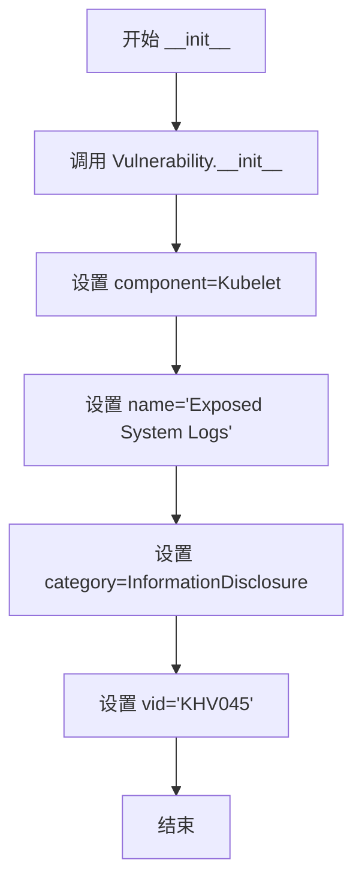

#### 带注释源码

```python
class ExposedSystemLogs(Vulnerability, Event):
    """System logs are exposed from the /logs endpoint on the kubelet"""

    def __init__(self):
        # 调用父类 Vulnerability 的初始化方法
        # 参数说明：
        # - component: 设置为 Kubelet，表示该漏洞与 Kubelet 组件相关
        # - name: 漏洞名称，显示为 "Exposed System Logs"
        # - category: 漏洞类别，设置为 InformationDisclosure（信息泄露）
        # - vid: 漏洞标识符，KHV045 是该漏洞的唯一标识
        Vulnerability.__init__(
            self, component=Kubelet, name="Exposed System Logs", category=InformationDisclosure, vid="KHV045",
        )
```


### `ExposedKubeletCmdline.__init__`

该方法用于初始化`ExposedKubeletCmdline`漏洞事件类，存储从Kubelet的pprof端点获取的命令行标志信息，并生成相应的证据字符串。

参数：

-  `cmdline`：`str`，从Kubelet的/debug/pprof/cmdline端点获取的命令行参数字符串

返回值：`None`（`__init__`方法不返回值）

#### 流程图

```mermaid
flowchart TD
    A[开始 __init__] --> B[调用 Vulnerability.__init__]
    B --> C[设置 component=Kubelet]
    B --> D[设置 name=Exposed Kubelet Cmdline]
    B --> E[设置 category=InformationDisclosure]
    B --> F[设置 vid=KHV046]
    F --> G[将 cmdline 参数赋值给 self.cmdline]
    G --> H[生成证据字符串: cmdline: {self.cmdline}]
    H --> I[赋值给 self.evidence]
    I --> J[结束]
```

#### 带注释源码

```python
class ExposedKubeletCmdline(Vulnerability, Event):
    """Commandline flags that were passed to the kubelet can be obtained from the pprof endpoints"""

    def __init__(self, cmdline):
        # 调用父类 Vulnerability 的初始化方法，设置漏洞元数据
        Vulnerability.__init__(
            self, component=Kubelet, name="Exposed Kubelet Cmdline", category=InformationDisclosure, vid="KHV046",
        )
        # 存储从 pprof 端点获取的原始命令行参数字符串
        self.cmdline = cmdline
        # 生成证据字符串，用于后续报告和展示
        self.evidence = f"cmdline: {self.cmdline}"
```


### `ReadOnlyKubeletPortHunter.get_k8s_version`

该方法是一个被动hunter，用于从Kubelet的/metrics端点获取并解析Kubernetes版本信息。它通过HTTP请求访问metrics端点，遍历返回的文本内容，查找包含`kubernetes_build_info`指标的行，并从中提取`gitVersion`字段作为Kubernetes版本号返回。

参数：该方法无显式参数（仅使用实例属性`self.path`）

返回值：`Optional[str]`，返回Kubernetes的gitVersion版本号字符串，若未找到则返回`None`

#### 流程图

```mermaid
flowchart TD
    A[开始 get_k8s_version] --> B[记录调试日志]
    B --> C[向 {self.path}/metrics 发送GET请求]
    C --> D{请求是否成功?}
    D -->|否| E[返回 None]
    D -->|是| F[获取响应文本]
    F --> G[按行分割文本]
    G --> H{是否存在以 'kubernetes_build_info' 开头的行?}
    H -->|否| E
    H -->|是| I[提取大括号内的键值对]
    I --> J[遍历键值对]
    J --> K{是否存在 gitVersion?}
    K -->|否| L[继续遍历下一个键值对]
    K -->|是| M[返回去掉引号的 gitVersion 值]
    L --> J
    M --> N[结束]
    E --> N
```

#### 带注释源码

```python
def get_k8s_version(self):
    """
    从Kubelet的/metrics端点获取Kubernetes版本信息
    
    该方法通过HTTP请求访问Kubelet的metrics端点，
    解析返回的Prometheus格式指标，查找kubernetes_build_info指标，
    并从中提取gitVersion字段作为Kubernetes版本号返回。
    
    Returns:
        Optional[str]: Kubernetes的gitVersion版本号字符串，
                       如果未找到或请求失败则返回None
    """
    # 记录调试日志，表明正在尝试查找Kubernetes版本
    logger.debug("Passive hunter is attempting to find kubernetes version")
    
    # 向Kubelet的metrics端点发送HTTP GET请求
    # 使用类属性self.path构建完整URL: http://{host}:{port}/metrics
    # 使用配置的网络超时时间
    metrics = requests.get(f"{self.path}/metrics", timeout=config.network_timeout).text
    
    # 遍历metrics响应中的每一行
    for line in metrics.split("\n"):
        # 查找以"kubernetes_build_info"开头的行
        # 这是Prometheus指标格式，包含Kubernetes构建信息
        if line.startswith("kubernetes_build_info"):
            # 提取大括号内的键值对部分
            # 格式示例: kubernetes_build_info{gitVersion="v1.19.0",...}
            for info in line[line.find("{") + 1 : line.find("}")].split(","):
                # 分割键值对，格式为 k=v
                k, v = info.split("=")
                
                # 查找gitVersion字段
                if k == "gitVersion":
                    # 去除值两端的引号并返回
                    # 使用strip方法移除双引号
                    return v.strip('"')
```


### `ReadOnlyKubeletPortHunter.find_privileged_containers`

该方法用于从 Kubelet 的 /pods 端点获取的 Pod 数据中查找运行特权容器（Privileged Container）的 Pod 和容器名称，并返回包含这些特权容器的列表（格式为元组列表），若不存在特权容器则返回 None。

参数：此方法无显式参数（隐含 `self` 参数）

返回值：`Optional[List[Tuple[str, str]]]`，返回包含特权容器信息的元组列表（Pod名称, 容器名称），若没有特权容器则返回 None

#### 流程图

```mermaid
flowchart TD
    A[开始] --> B[初始化空列表 privileged_containers]
    B --> C{self.pods_endpoint_data 是否存在?}
    C -->|否| D[返回 None]
    C -->|是| E[遍历 pods_endpoint_data 中的每个 Pod]
    E --> F[遍历每个 Pod 的 spec.containers]
    G{检查 securityContext.privileged}
    G -->|是| H[将 (pod['metadata']['name'], container['name']) 添加到列表]
    G -->|否| I[继续下一个容器]
    H --> I
    I --> J{是否还有更多容器?}
    J -->|是| F
    J -->|否| K{是否还有更多 Pod?}
    K -->|是| E
    K -->|否| L{privileged_containers 长度 > 0?}
    L -->|是| M[返回 privileged_containers 列表]
    L -->|否| N[返回 None]
```

#### 带注释源码

```python
# 返回值：包含特权容器及其 Pod 的元组列表 (pod_name, container_name)，若不存在则返回 None
def find_privileged_containers(self):
    # 记录调试日志，表示正在尝试查找特权容器及其 Pod
    logger.debug("Trying to find privileged containers and their pods")
    
    # 初始化空列表，用于存储特权容器信息
    privileged_containers = []
    
    # 检查是否已获取到 Pod 端点数据（self.pods_endpoint_data 由 execute 方法调用 get_pods_endpoint() 设置）
    if self.pods_endpoint_data:
        # 遍历所有 Pod 项
        for pod in self.pods_endpoint_data["items"]:
            # 遍历当前 Pod 的所有容器
            for container in pod["spec"]["containers"]:
                # 检查容器的 securityContext 中是否设置了 privileged 为 True
                # 使用 .get() 方法安全获取，避免 KeyError
                if container.get("securityContext", {}).get("privileged"):
                    # 将找到的特权容器信息以元组形式 (pod_name, container_name) 添加到列表
                    privileged_containers.append((pod["metadata"]["name"], container["name"]))
    
    # 如果找到特权容器则返回列表，否则返回 None
    return privileged_containers if len(privileged_containers) > 0 else None
```


### `ReadOnlyKubeletPortHunter.get_pods_endpoint`

该方法尝试从不安全的只读 Kubelet 端口获取 pods 端点数据，通过 HTTP GET 请求访问 `/pods` 路径，并检查响应中是否包含 "items" 字段，若包含则解析并返回 JSON 数据，否则返回 None。

参数：
- 该方法无显式参数（仅包含隐式参数 `self`）

返回值：`Optional[dict]`，返回从 `/pods` 端点获取的 JSON 解析后的字典数据，若响应中不包含 "items" 字段则返回 None

#### 流程图

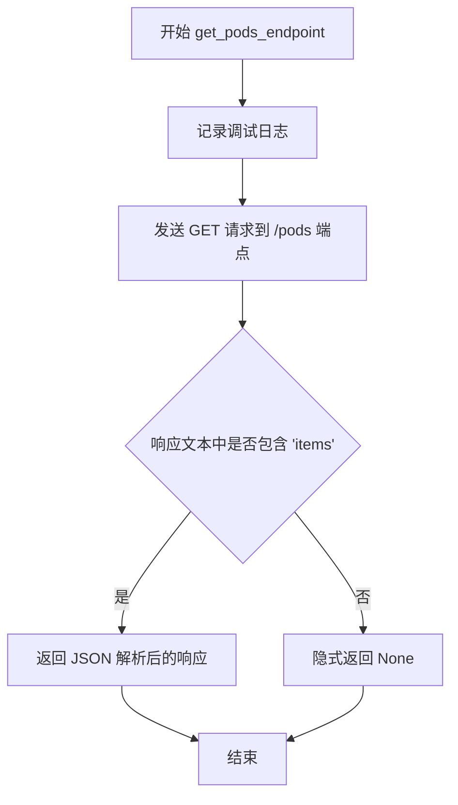

#### 带注释源码

```python
def get_pods_endpoint(self):
    """
    尝试从不安全的只读 Kubelet 端口获取 pods 端点数据
    
    该方法向 kubelet 的 /pods 端点发送 HTTP GET 请求，
    如果响应中包含 'items' 字段（表示成功获取到 pods 数据），
    则返回解析后的 JSON 字典，否则返回 None
    """
    # 记录调试日志，表明正在尝试查找 pods 端点
    logger.debug("Attempting to find pods endpoints")
    
    # 发送 GET 请求到 {self.path}/pods，其中 self.path 格式为 http://{host}:{port}
    # 使用配置的网络超时时间
    response = requests.get(f"{self.path}/pods", timeout=config.network_timeout)
    
    # 检查响应文本中是否包含 'items' 字符串
    # 'items' 是 Kubernetes API 响应中包含资源列表的标准字段
    if "items" in response.text:
        # 解析响应 JSON 并返回字典
        return response.json()
```


### `ReadOnlyKubeletPortHunter.check_healthz_endpoint`

该方法用于检查 Kubelet 的 `/healthz` 端点是否可访问，并返回健康检查的状态信息。如果端点返回 HTTP 200 状态码，则返回响应文本内容；否则返回 `False` 表示端点不可访问或健康检查失败。

参数： 无

返回值：`Union[str, bool]`，返回健康检查端点的响应文本（字符串类型），如果状态码不是 200 则返回 `False`（布尔类型）

#### 流程图

```mermaid
flowchart TD
    A[开始 check_healthz_endpoint] --> B[构造请求URL: {self.path}/healthz]
    B --> C[发送GET请求到/healthz端点]
    C --> D{响应状态码是否为200?}
    D -->|是| E[返回响应文本 r.text]
    D -->|否| F[返回 False]
    E --> G[结束]
    F --> G
```

#### 带注释源码

```python
def check_healthz_endpoint(self):
    """
    检查 Kubelet 的 /healthz 端点是否可访问
    
    该方法向 Kubelet 的健康检查端点发送 GET 请求，
    用于检测是否可以获取集群的健康状态信息。
    如果端点返回 200 状态码，说明端点暴露且未认证访问，
    将返回健康检查的响应文本；否则返回 False。
    
    Returns:
        Union[str, bool]: 返回健康检查端点的响应文本，
                         如果状态码不是 200 则返回 False
    """
    # 构造完整的健康检查端点URL，使用self.path作为基础路径
    # self.path 格式为 "http://{host}:{port}"
    r = requests.get(f"{self.path}/healthz", verify=False, timeout=config.network_timeout)
    
    # 检查HTTP响应状态码
    # 200 表示请求成功，健康检查端点可访问
    # verify=False 忽略SSL证书验证（用于HTTP或自签名证书场景）
    # timeout=config.network_timeout 设置网络请求超时时间
    return r.text if r.status_code == 200 else False
```


### `ReadOnlyKubeletPortHunter.execute`

该方法是 `ReadOnlyKubeletPortHunter` 类的核心执行函数，负责对只读Kubelet端口进行安全检测。它通过调用多个辅助方法（获取Pod端点数据、K8s版本、特权容器、健康检查端点）来收集目标Kubelet的安全信息，并将发现的各类漏洞（如K8s版本泄露、特权容器、暴露的健康端点、Pod信息泄露）以事件形式发布。

参数： 该方法无显式参数（仅包含隐式 `self` 参数）

返回值：`None`，该方法通过发布事件来传递结果，不返回任何值

#### 流程图

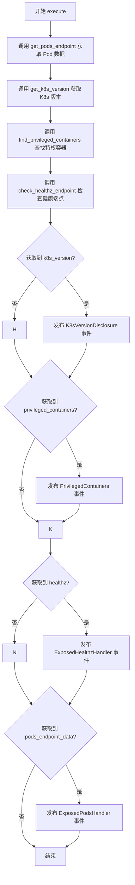

#### 带注释源码

```python
def execute(self):
    """
    执行只读Kubelet端口的安全检测主流程
    依次调用各个检测方法并发布发现的安全漏洞事件
    """
    # 1. 获取 pods 端点数据，用于后续特权容器检测和 Pod 信息泄露检测
    self.pods_endpoint_data = self.get_pods_endpoint()
    
    # 2. 从 /metrics 端点获取 Kubernetes 版本信息
    k8s_version = self.get_k8s_version()
    
    # 3. 分析 Pod 数据，查找以特权模式运行的容器
    privileged_containers = self.find_privileged_containers()
    
    # 4. 检查 /healthz 端点是否暴露集群健康状态
    healthz = self.check_healthz_endpoint()
    
    # 5. 如果获取到 K8s 版本信息，发布版本泄露事件
    if k8s_version:
        self.publish_event(
            K8sVersionDisclosure(version=k8s_version, from_endpoint="/metrics", extra_info="on Kubelet")
        )
    
    # 6. 如果发现特权容器，发布特权容器风险事件
    if privileged_containers:
        self.publish_event(PrivilegedContainers(containers=privileged_containers))
    
    # 7. 如果健康端点可访问，发布健康信息泄露事件
    if healthz:
        self.publish_event(ExposedHealthzHandler(status=healthz))
    
    # 8. 如果获取到 Pod 端点数据，发布 Pod 信息泄露事件
    if self.pods_endpoint_data:
        self.publish_event(ExposedPodsHandler(pods=self.pods_endpoint_data["items"]))
```


### `SecureKubeletPortHunter.DebugHandlers`

这是一个内部类，用于测试安全 Kubelet 端口的各种调试处理器，包括容器日志、执行、端口转发、运行容器、附加容器、日志端点和 pprof 命令行等。

参数：

- `path`：`str`，Kubelet 的基本 URL 路径
- `pod`：`dict`，包含 pod 信息的字典（namespace、name、container）
- `session`：`requests.Session`，可选的 HTTP 会话对象，默认为新创建的会话

返回值：该类本身没有返回值，主要通过其方法返回测试结果

#### 流程图

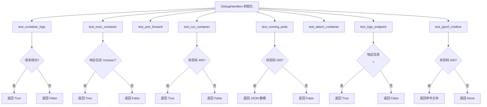

#### 带注释源码

```python
class DebugHandlers(object):
    """ all methods will return the handler name if successful """

    def __init__(self, path, pod, session=None):
        """
        初始化调试处理器
        
        参数:
            path: str - Kubelet 的基本 URL 路径 (例如 https://localhost:10250)
            pod: dict - 包含 pod 信息的字典，键包括 'namespace', 'name', 'container'
            session: requests.Session - 可选的 HTTP 会话对象，如果为 None 则创建新会话
        """
        self.path = path
        self.session = session if session else requests.Session()
        self.pod = pod

    # outputs logs from a specific container
    def test_container_logs(self):
        """
        测试容器日志端点是否可访问
        
        返回: bool - 如果返回状态码为 200 则返回 True，否则返回 False
        """
        logs_url = self.path + KubeletHandlers.CONTAINERLOGS.value.format(
            pod_namespace=self.pod["namespace"], pod_id=self.pod["name"], container_name=self.pod["container"],
        )
        return self.session.get(logs_url, verify=False, timeout=config.network_timeout).status_code == 200

    # need further investigation on websockets protocol for further implementation
    def test_exec_container(self):
        """
        测试容器执行端点是否可访问
        
        返回: bool - 如果响应文本中包含 '/cri/exec/' 则返回 True，否则返回 False
        """
        # opens a stream to connect to using a web socket
        headers = {"X-Stream-Protocol-Version": "v2.channel.k8s.io"}
        exec_url = self.path + KubeletHandlers.EXEC.value.format(
            pod_namespace=self.pod["namespace"],
            pod_id=self.pod["name"],
            container_name=self.pod["container"],
            cmd="",
        )
        return (
            "/cri/exec/"
            in self.session.get(
                exec_url, headers=headers, allow_redirects=False, verify=False, timeout=config.network_timeout,
            ).text
        )

    # need further investigation on websockets protocol for further implementation
    def test_port_forward(self):
        """
        测试端口转发端点是否可访问
        
        注意: 该方法目前未完全实现，返回值未定义
        """
        headers = {
            "Upgrade": "websocket",
            "Connection": "Upgrade",
            "Sec-Websocket-Key": "s",
            "Sec-Websocket-Version": "13",
            "Sec-Websocket-Protocol": "SPDY",
        }
        pf_url = self.path + KubeletHandlers.PORTFORWARD.value.format(
            pod_namespace=self.pod["namespace"], pod_id=self.pod["name"], port=80,
        )
        self.session.get(
            pf_url, headers=headers, verify=False, stream=True, timeout=config.network_timeout,
        ).status_code == 200
        # TODO: what to return?

    # executes one command and returns output
    def test_run_container(self):
        """
        测试容器运行端点是否可访问
        
        返回: bool - 如果返回状态码为 405 (Method Not Allowed) 则返回 True，表示需要认证
        """
        run_url = self.path + KubeletHandlers.RUN.value.format(
            pod_namespace="test", pod_id="test", container_name="test", cmd="",
        )
        # if we get a Method Not Allowed, we know we passed Authentication and Authorization.
        return self.session.get(run_url, verify=False, timeout=config.network_timeout).status_code == 405

    # returns list of currently running pods
    def test_running_pods(self):
        """
        测试运行中的 pods 端点
        
        返回: dict 或 bool - 如果状态码为 200 返回 JSON 数据，否则返回 False
        """
        pods_url = self.path + KubeletHandlers.RUNNINGPODS.value
        r = self.session.get(pods_url, verify=False, timeout=config.network_timeout)
        return r.json() if r.status_code == 200 else False

    # need further investigation on the differences between attach and exec
    def test_attach_container(self):
        """
        测试容器附加端点是否可访问
        
        返回: bool - 如果响应文本中包含 '/cri/attach/' 则返回 True，否则返回 False
        """
        # headers={"X-Stream-Protocol-Version": "v2.channel.k8s.io"}
        attach_url = self.path + KubeletHandlers.ATTACH.value.format(
            pod_namespace=self.pod["namespace"],
            pod_id=self.pod["name"],
            container_name=self.pod["container"],
            cmd="",
        )
        return (
            "/cri/attach/"
            in self.session.get(
                attach_url, allow_redirects=False, verify=False, timeout=config.network_timeout,
            ).text
        )

    # checks access to logs endpoint
    def test_logs_endpoint(self):
        """
        测试日志端点是否可访问
        
        返回: bool - 如果响应文本中包含 '<pre>' 标签则返回 True，否则返回 False
        """
        logs_url = self.session.get(
            self.path + KubeletHandlers.LOGS.value.format(path=""), timeout=config.network_timeout,
        ).text
        return "<pre>" in logs_url

    # returns the cmd line used to run the kubelet
    def test_pprof_cmdline(self):
        """
        测试 pprof cmdline 端点
        
        返回: str 或 None - 如果状态码为 200 返回命令文本，否则返回 None
        """
        cmd = self.session.get(
            self.path + KubeletHandlers.PPROF_CMDLINE.value, verify=False, timeout=config.network_timeout,
        )
        return cmd.text if cmd.status_code == 200 else None
```


### `SecureKubeletPortHunter.get_pods_endpoint`

该方法用于从安全的 Kubelet 端口（10250）获取 Pods 信息，通过向 `/pods` 端点发送 GET 请求来获取 Kubernetes 集群中 pods 的详细信息。

参数：

- 该方法无显式参数（隐式参数 `self` 表示类的实例）

返回值：`dict` 或 `None`，返回从 Kubelet 的 `/pods` 端点获取的 JSON 数据（包含 pods 列表），如果响应中不包含 "items" 字段则返回 `None`。

#### 流程图

```mermaid
flowchart TD
    A[开始 get_pods_endpoint] --> B[发送GET请求到 /pods 端点]
    B --> C{响应文本中是否包含 'items'}
    C -->|是| D[返回 response.json()]
    C -->|否| E[返回 None]
    D --> F[结束]
    E --> F
```

#### 带注释源码

```python
def get_pods_endpoint(self):
    """
    从安全的 Kubelet 端口获取 pods 信息
    使用已建立的 session 发送请求，包含认证信息
    """
    # 使用 session 发送 GET 请求到 /pods 端点
    # verify=False 跳过 SSL 证书验证（因为是自签名证书）
    # timeout=config.network_timeout 设置网络超时时间
    response = self.session.get(f"{self.path}/pods", verify=False, timeout=config.network_timeout)
    
    # 检查响应文本中是否包含 "items" 字段
    # Kubelet 的 /pods 端点返回格式为 {"items": [...]}
    if "items" in response.text:
        # 解析 JSON 响应并返回包含 pods 数据的字典
        return response.json()
    # 如果响应格式不符合预期，返回 None
```


### `SecureKubeletPortHunter.check_healthz_endpoint`

该方法用于检查 Kubelet 的 `/healthz` 端点是否可访问，并通过返回健康状态文本或 `False` 来表示端点的可用性。

参数：

- `self`：`SecureKubeletPortHunter` 实例，方法所属类的实例对象

返回值：`str` 或 `bool`，如果 HTTP 状态码为 200，则返回响应文本（健康状态信息）；否则返回 `False`

#### 流程图

```mermaid
flowchart TD
    A[开始检查 healthz 端点] --> B[发起 GET 请求到 /healthz 端点]
    B --> C{响应状态码是否为 200?}
    C -->|是| D[返回响应文本 r.text]
    C -->|否| E[返回 False]
    D --> F[结束]
    E --> F
```

#### 带注释源码

```python
def check_healthz_endpoint(self):
    """
    检查 /healthz 端点的可用性
    
    该方法向 Kubelet 的健康检查端点发送 GET 请求，
    用于判断该端点是否暴露以及获取集群的健康状态信息。
    
    返回:
        str or bool: 如果端点可访问且返回 HTTP 200，则返回响应文本；
                     否则返回 False 表示端点不可访问或未授权。
    """
    # 发起 GET 请求到 healthz 端点，verify=False 跳过 SSL 证书验证
    # 使用配置的网络超时时间
    r = requests.get(f"{self.path}/healthz", verify=False, timeout=config.network_timeout)
    
    # 如果状态码为 200，说明端点可访问，返回响应文本内容
    # 否则返回 False 表示请求失败
    return r.text if r.status_code == 200 else False
```


### SecureKubeletPortHunter.execute

该方法是Kubelet安全端口的主动猎人，用于在安全的Kubelet服务器上执行主动性安全检测，通过认证后访问各类敏感端点（如/pods、/healthz、容器日志、执行命令等），并发布发现的安全漏洞事件。

参数： 无

返回值：`None`，该方法通过发布事件来传递结果，不直接返回值

#### 流程图

```mermaid
flowchart TD
    A[开始 execute] --> B{event.anonymous_auth是否为真}
    B -->|是| C[发布 AnonymousAuthEnabled 事件]
    B -->|否| D[跳过]
    C --> D
    D --> E[调用 get_pods_endpoint 获取Pods数据]
    E --> F[调用 check_healthz_endpoint 检查健康端点]
    F --> G{pods_endpoint_data是否存在}
    G -->|是| H[发布 ExposedPodsHandler 事件]
    G -->|否| I[跳过]
    H --> I
    I --> J{healthz是否存在}
    J -->|是| K[发布 ExposedHealthzHandler 事件]
    J -->|否| L[跳过]
    K --> L
    L --> M[调用 test_handlers 测试其他处理器]
    M --> N[结束]
```

#### 带注释源码

```python
def execute(self):
    # 检查是否启用了匿名认证，如果是则发布匿名认证启用事件
    if self.event.anonymous_auth:
        self.publish_event(AnonymousAuthEnabled())

    # 获取 /pods 端点的数据，用于后续的漏洞检测
    self.pods_endpoint_data = self.get_pods_endpoint()
    
    # 检查 /healthz 端点是否暴露
    healthz = self.check_healthz_endpoint()
    
    # 如果成功获取到Pods数据，发布暴露的Pods漏洞事件
    if self.pods_endpoint_data:
        self.publish_event(ExposedPodsHandler(pods=self.pods_endpoint_data["items"]))
    
    # 如果健康检查端点可访问，发布健康信息泄露事件
    if healthz:
        self.publish_event(ExposedHealthzHandler(status=healthz))
    
    # 执行其他处理器测试，包括容器日志、执行、运行、挂载等功能
    self.test_handlers()
```


### `SecureKubeletPortHunter.test_handlers`

该方法用于测试安全 Kubelet 端口上的多个处理器端点（如运行中的 Pod、容器日志、Exec、Run、PortForward、Attach、系统日志等），以发现潜在的安全漏洞和配置问题。

参数：此方法无显式参数（除隐式 `self`）

返回值：`None`，无返回值

#### 流程图

```mermaid
flowchart TD
    A[开始 test_handlers] --> B{config.pod}
    B -- 是 --> C[pod = self.kubehunter_pod]
    B -- 否 --> D[pod = self.get_random_pod]
    C --> E{pod 存在?}
    D --> E
    E -- 否 --> F[结束]
    E -- 是 --> G[创建 DebugHandlers 实例]
    G --> H[调用 test_running_pods]
    H --> I{running_pods 存在?}
    I -- 是 --> J[发布 ExposedRunningPodsHandler 事件]
    I -- 否 --> K[调用 test_pprof_cmdline]
    J --> K
    K --> L{cmdline 存在?}
    L -- 是 --> M[发布 ExposedKubeletCmdline 事件]
    L -- 否 --> N[测试容器日志]
    M --> N
    N --> O{test_container_logs 返回 True?}
    O -- 是 --> P[发布 ExposedContainerLogsHandler]
    O -- 否 --> Q[测试 exec 容器]
    P --> Q
    Q --> R{test_exec_container 返回 True?}
    R -- 是 --> S[发布 ExposedExecHandler]
    R -- 否 --> T[测试 run 容器]
    S --> T
    T --> U{test_run_container 返回 True?}
    U -- 是 --> V[发布 ExposedRunHandler]
    U -- 否 --> W[测试 port forward]
    V --> W
    W --> X{test_port_forward 返回 True?}
    X -- 是 --> Y[发布 ExposedPortForwardHandler]
    X -- 否 --> Z[测试 attach 容器]
    Y --> Z
    Z --> AA{test_attach_container 返回 True?}
    AA -- 是 --> AB[发布 ExposedAttachHandler]
    AA -- 否 --> AC[测试日志端点]
    AB --> AC
    AC --> AD{test_logs_endpoint 返回 True?}
    AD -- 是 --> AE[发布 ExposedSystemLogs 事件]
    AD -- 否 --> AF[异常处理]
    AE --> AF
    AF --> G1[结束]
    
    style G1 fill:#f9f,stroke:#333,stroke-width:2px
    style AF fill:#ff9,stroke:#333,stroke-width:2px
```

#### 带注释源码

```python
def test_handlers(self):
    """
    测试安全 Kubelet 端口上的各种处理器端点，以发现潜在的安全漏洞。
    如果 kube-hunter 在 Pod 中运行，则使用 kube-hunter 自己的 Pod；否则随机选择一个 Pod 进行测试。
    """
    # 如果 kube-hunter 在 Pod 中运行，使用 kube-hunter 的 pod；否则获取随机 Pod
    pod = self.kubehunter_pod if config.pod else self.get_random_pod()
    
    # 如果成功获取到 Pod 信息
    if pod:
        # 创建 DebugHandlers 实例，用于测试各种处理器
        debug_handlers = self.DebugHandlers(self.path, pod, self.session)
        
        try:
            # 测试运行中的 Pods 端点
            running_pods = debug_handlers.test_running_pods()
            if running_pods:
                # 发布发现运行中 Pods 的事件
                self.publish_event(ExposedRunningPodsHandler(count=len(running_pods["items"])))
            
            # 测试 pprof cmdline 端点
            cmdline = debug_handlers.test_pprof_cmdline()
            if cmdline:
                # 发布发现 Kubelet 命令行的事件
                self.publish_event(ExposedKubeletCmdline(cmdline=cmdline))
            
            # 测试容器日志端点
            if debug_handlers.test_container_logs():
                self.publish_event(ExposedContainerLogsHandler())
            
            # 测试 exec 容器端点
            if debug_handlers.test_exec_container():
                self.publish_event(ExposedExecHandler())
            
            # 测试 run 容器端点
            if debug_handlers.test_run_container():
                self.publish_event(ExposedRunHandler())
            
            # 测试 port forward 端点
            if debug_handlers.test_port_forward():
                # 注意：PortForward 功能尚未完全实现
                self.publish_event(ExposedPortForwardHandler())  # not implemented
            
            # 测试 attach 容器端点
            if debug_handlers.test_attach_container():
                self.publish_event(ExposedAttachHandler())
            
            # 测试日志端点
            if debug_handlers.test_logs_endpoint():
                self.publish_event(ExposedSystemLogs())
        
        except Exception:
            # 记录测试调试处理器失败的信息
            logger.debug("Failed testing debug handlers", exc_info=True)
```


### `SecureKubeletPortHunter.get_random_pod`

该函数从已获取的 Pod 列表中随机选择一个处于 Running 状态的 Pod（优先选择 default 命名空间的 Pod，其次选择 kube-system 命名空间的 Pod），并返回包含该 Pod 名称、容器名称和命名空间的字典，用于后续对 Kubelet 处理器进行安全测试。

参数：
- 无（仅包含隐式参数 `self`）

返回值：`Optional[Dict[str, str]]`，返回包含 Pod 信息的字典（键为 "name"、"container"、"namespace"），如果没有符合条件的 Pod 则返回 `None`

#### 流程图

```mermaid
flowchart TD
    A[开始 get_random_pod] --> B{self.pods_endpoint_data 是否存在?}
    B -->|否| C[返回 None]
    B -->|是| D[获取 pods_data = self.pods_endpoint_data['items']]
    E[定义 is_default_pod 函数] --> F[namespace == 'default' 且 phase == 'Running']
    E1[定义 is_kubesystem_pod 函数] --> F1[namespace == 'kube-system' 且 phase == 'Running']
    D --> E
    E --> G[使用 filter 查找 default namespace 的 Running Pod]
    G --> H{找到 Pod?}
    H -->|是| I[pod_data = 找到的 Pod]
    H -->|否| J[使用 filter 查找 kube-system namespace 的 Running Pod]
    J --> K{找到 Pod?}
    K -->|是| I
    K -->|否| C
    I --> L[获取 pod_data['spec']['containers'] 的第一个容器]
    L --> M{容器存在?}
    M -->|是| N[返回字典: name, container, namespace]
    M -->|否| C
```

#### 带注释源码

```python
def get_random_pod(self):
    """尝试从 default 命名空间获取一个 Running 状态的 Pod，
    如果不存在则获取 kube-system 命名空间的 Pod
    
    Returns:
        dict: 包含 'name', 'container', 'namespace' 键的字典，
              如果没有符合条件的 Pod 则返回 None
    """
    # 检查是否已经获取了 pods 端点数据
    if self.pods_endpoint_data:
        # 从响应中提取 items 列表
        pods_data = self.pods_endpoint_data["items"]

        # 定义过滤器函数：检查 pod 是否在 default 命名空间且处于 Running 状态
        def is_default_pod(pod):
            return pod["metadata"]["namespace"] == "default" and pod["status"]["phase"] == "Running"

        # 定义过滤器函数：检查 pod 是否在 kube-system 命名空间且处于 Running 状态
        def is_kubesystem_pod(pod):
            return pod["metadata"]["namespace"] == "kube-system" and pod["status"]["phase"] == "Running"

        # 优先从 default 命名空间查找 Running 状态的 Pod
        pod_data = next(filter(is_default_pod, pods_data), None)
        
        # 如果没有找到 default 命名空间的 Pod，则尝试 kube-system 命名空间
        if not pod_data:
            pod_data = next(filter(is_kubesystem_pod, pods_data), None)

        # 如果找到了符合条件的 Pod
        if pod_data:
            # 获取该 Pod 的第一个容器
            container_data = next(pod_data["spec"]["containers"], None)
            if container_data:
                # 返回包含 Pod 关键信息的字典
                return {
                    "name": pod_data["metadata"]["name"],
                    "container": container_data["name"],
                    "namespace": pod_data["metadata"]["namespace"],
                }
```


### `SecureKubeletPortHunter.DebugHandlers.test_container_logs`

该方法用于测试 Kubelet 容器日志端点是否可访问，通过构造日志请求 URL 并发送 GET 请求，检查返回状态码是否为 200 来判断端点是否暴露。

参数：（无，除了隐含的 self）

返回值：`bool`，如果 HTTP 响应状态码为 200 则返回 True，表示容器日志端点可访问；否则返回 False

#### 流程图

```mermaid
flowchart TD
    A[开始 test_container_logs] --> B[构造日志请求URL]
    B --> C[使用session发送GET请求到logs_url]
    C --> D{检查响应状态码 == 200?}
    D -->|是| E[返回 True]
    D -->|否| F[返回 False]
    E --> G[结束]
    F --> G
```

#### 带注释源码

```python
def test_container_logs(self):
    """
    测试容器日志端点是否可访问
    通过向 Kubelet 的 /containerLogs 端点发送 GET 请求来验证
    """
    # 构造完整的日志访问 URL
    # 使用 KubeletHandlers.CONTAINERLOGS 枚举值作为路径模板
    # 替换路径参数：pod_namespace（Pod命名空间）、pod_id（Pod名称）、container_name（容器名称）
    logs_url = self.path + KubeletHandlers.CONTAINERLOGS.value.format(
        pod_namespace=self.pod["namespace"],    # 从 pod 对象中获取命名空间
        pod_id=self.pod["name"],                  # 从 pod 对象中获取 Pod 名称
        container_name=self.pod["container"],    # 从 pod 对象中获取容器名称
    )
    
    # 发送 GET 请求到日志端点
    # verify=False: 跳过 SSL 证书验证（因为是安全端口测试）
    # timeout=config.network_timeout: 使用配置的网络超时时间
    # 返回状态码是否等于 200（HTTP OK）
    return self.session.get(logs_url, verify=False, timeout=config.network_timeout).status_code == 200
```


### `SecureKubeletPortHunter.DebugHandlers.test_exec_container`

测试容器 exec 端点是否可访问，通过构造 WebSocket 升级请求并检查响应中是否包含 "/cri/exec/" 路径来判断。

参数：

- `self`：`DebugHandlers` 实例，方法所属对象，包含 path、session 和 pod 信息

返回值：`bool`，如果响应文本中包含 "/cri/exec/" 则返回 True，否则返回 False

#### 流程图

```mermaid
flowchart TD
    A[开始 test_exec_container] --> B[构建 HTTP 请求头]
    B --> C[构造 exec URL]
    C --> D[发送 GET 请求到 exec 端点]
    D --> E{响应文本中是否包含 '/cri/exec/'}
    E -->|是| F[返回 True]
    E -->|否| G[返回 False]
```

#### 带注释源码

```python
# need further investigation on websockets protocol for further implementation
def test_exec_container(self):
    """
    测试容器 exec 端点是否可访问
    通过发送带有 WebSocket 升级头的请求，检查是否返回 exec 路径
    """
    # 1. 构建 HTTP 请求头，模拟 WebSocket 升级请求
    headers = {"X-Stream-Protocol-Version": "v2.channel.k8s.io"}
    
    # 2. 构造 exec 端点 URL，使用 KubeletHandlers 枚举的 EXEC 模板
    # 格式: exec/{pod_namespace}/{pod_id}/{container_name}?command={cmd}&input=1&output=1&tty=1
    exec_url = self.path + KubeletHandlers.EXEC.value.format(
        pod_namespace=self.pod["namespace"],
        pod_id=self.pod["name"],
        container_name=self.pod["container"],
        cmd="",  # 空命令，用于检测端点是否存在
    )
    
    # 3. 发送 GET 请求到 exec 端点
    # - allow_redirects=False: 不跟随重定向
    # - verify=False: 跳过 SSL 证书验证
    # - timeout: 网络超时时间
    response = self.session.get(
        exec_url, headers=headers, allow_redirects=False, verify=False, timeout=config.network_timeout,
    )
    
    # 4. 检查响应文本中是否包含 "/cri/exec/" 路径
    # 如果包含说明 exec 端点可用，返回 True
    return (
        "/cri/exec/"
        in response.text
    )
```


### `SecureKubeletPortHunter.DebugHandlers.test_port_forward`

该方法用于测试 Kubelet 的端口转发（portForward）端点是否可访问，通过构造 WebSocket 握手请求并检查返回的状态码来判断端口转发功能是否暴露。

参数：

- `self`：`DebugHandlers` 实例，表示当前调试处理器对象本身

返回值：`bool` 或 `None`，由于代码中没有显式返回值（TODO 注释表明实现不完整），实际返回 `None`；如果修复后应返回布尔值，表示端口转发端点是否可访问（状态码 200）

#### 流程图

```mermaid
flowchart TD
    A[开始 test_port_forward] --> B[构建 WebSocket 握手请求头]
    B --> C[构造端口转发 URL]
    C --> D[发送 GET 请求到端口转发端点]
    D --> E{状态码是否为 200?}
    E -->|是| F[TODO: 应返回 True]
    E -->|否| G[TODO: 应返回 False]
    F --> H[返回 None 或 True]
    G --> H
    H[结束]
```

#### 带注释源码

```python
def test_port_forward(self):
    """
    测试端口转发端点是否可访问
    注意: 该方法实现不完整,缺少返回值
    """
    # 定义 WebSocket 升级所需的 HTTP 头
    headers = {
        "Upgrade": "websocket",                    # 升级协议为 WebSocket
        "Connection": "Upgrade",                   # 连接升级
        "Sec-Websocket-Key": "s",                  # WebSocket 握手密钥(简化值)
        "Sec-Websocket-Version": "13",             # WebSocket 协议版本
        "Sec-Websocket-Protocol": "SPDY",          # 子协议(可能用于端口转发)
    }
    
    # 使用 KubeletHandlers 枚举构造端口转发 URL
    # 格式: portForward/{pod_namespace}/{pod_id}?port={port}
    pf_url = self.path + KubeletHandlers.PORTFORWARD.value.format(
        pod_namespace=self.pod["namespace"],       # 从 pod 对象获取命名空间
        pod_id=self.pod["name"],                   # 从 pod 对象获取 Pod 名称
        port=80,                                   # 测试用的端口号
    )
    
    # 发送 GET 请求到端口转发端点
    # verify=False: 跳过 SSL 证书验证
    # stream=True: 保持流式连接(适用于 WebSocket)
    # timeout: 网络超时时间
    self.session.get(
        pf_url, headers=headers, verify=False, stream=True, timeout=config.network_timeout,
    ).status_code == 200
    
    # TODO: what to return?
    # 问题: 比较结果没有赋值给变量,也没有 return 语句
    # 修复建议: 应添加 return self.session.get(...).status_code == 200
```


### `SecureKubeletPortHunter.DebugHandlers.test_run_container`

该方法用于测试 Kubelet 的 `/run` 端点是否可访问，通过发送 GET 请求并检查是否返回 405 状态码（Method Not Allowed）来判断是否成功通过了身份认证和授权验证。如果返回 405，则说明端点存在且需要认证（未允许 GET 方法），这是一种检测安全配置的方式。

参数：无（仅使用 `self` 实例属性）

返回值：`bool`，如果返回 True 表示端点存在且需要认证（返回 405），如果返回 False 表示端点不可访问或其他状态码。

#### 流程图

```mermaid
flowchart TD
    A[开始 test_run_container] --> B[构建 run_url]
    B --> C[使用 session 发送 GET 请求到 run_url]
    C --> D{检查状态码是否为 405}
    D -->|是| E[返回 True]
    D -->|否| F[返回 False]
    E --> G[结束]
    F --> G
```

#### 带注释源码

```python
# executes one command and returns output
def test_run_container(self):
    """
    测试 /run 端点是否可访问
    通过发送 GET 请求，检查是否返回 405 状态码
    405 表示端点存在但方法不允许，这说明认证和授权已配置
    """
    # 构建运行命令的 URL，使用测试用的命名空间、Pod ID 和容器名
    run_url = self.path + KubeletHandlers.RUN.value.format(
        pod_namespace="test",     # 测试用的命名空间
        pod_id="test",           # 测试用的 Pod ID
        container_name="test",   # 测试用的容器名
        cmd="",                  # 空命令，因为只测试端点是否可访问
    )
    # 发送 GET 请求，不验证 SSL 证书，使用配置的网络超时
    # 如果返回 405 状态码，说明端点存在且需要认证（GET 方法被禁止）
    return self.session.get(run_url, verify=False, timeout=config.network_timeout).status_code == 405
```


### `SecureKubeletPortHunter.DebugHandlers.test_running_pods`

该方法用于测试 Kubelet 的 `/runningpods` 端点，尝试获取当前正在运行的 Pods 列表。如果端点可访问且返回 200 状态码，则返回 JSON 解析后的 Pods 数据；否则返回 False。

参数：

- `self`：`DebugHandlers` 实例，包含 `path`（Kubelet 基础 URL）和 `session`（HTTP 会话）等实例属性

返回值：`dict` 或 `bool`，成功时返回运行中的 Pods 列表（字典形式），失败时返回 `False`

#### 流程图

```mermaid
flowchart TD
    A[开始 test_running_pods] --> B[构造 pods_url]
    B --> C[session.get 请求 pods_url]
    C --> D{状态码 == 200?}
    D -->|是| E[返回 r.json 解析结果]
    D -->|否| F[返回 False]
    E --> G[结束]
    F --> G
```

#### 带注释源码

```python
# returns list of currently running pods
def test_running_pods(self):
    # 构造运行 pods 端点的完整 URL
    # self.path 为 https://host:10250
    # KubeletHandlers.RUNNINGPODS.value 为 "runningpods"
    pods_url = self.path + KubeletHandlers.RUNNINGPODS.value
    
    # 发送 GET 请求到 /runningpods 端点
    # verify=False: 跳过 SSL 证书验证（因为是自签名证书）
    # timeout: 使用配置的网络超时时间
    r = self.session.get(pods_url, verify=False, timeout=config.network_timeout)
    
    # 如果 HTTP 状态码为 200，说明端点可访问
    # 返回 JSON 解析后的响应内容（字典类型）
    # 否则返回 False 表示请求失败
    return r.json() if r.status_code == 200 else False
```


### `SecureKubeletPortHunter.DebugHandlers.test_attach_container`

该方法用于测试 Kubelet 的容器附加（attach）功能是否可访问。它通过构造 Attach 端点的 URL 并发送 GET 请求，检查响应文本中是否包含 "/cri/attach/" 字符串来判断 Attach 处理器是否可用。

参数：（无显式参数，依赖于类的实例属性 `self.path` 和 `self.pod`）

- `self`：类实例本身，包含以下属性：
  - `path`：String，Kubelet 服务的路径（https://{host}:10250）
  - `pod`：Dict，包含 pod 的命名空间、名称和容器名
  - `session`：requests.Session，会话对象用于发送 HTTP 请求

返回值：`bool`，如果响应文本中包含 "/cri/attach/" 则返回 True，否则返回 False

#### 流程图

```mermaid
flowchart TD
    A[开始 test_attach_container] --> B[构造 Attach URL]
    B --> C[使用 session.get 发送请求]
    C --> D{检查响应文本中是否包含 '/cri/attach/'}
    D -->|是| E[返回 True]
    D -->|否| F[返回 False]
    E --> G[结束]
    F --> G
```

#### 带注释源码

```python
# need further investigation on the differences between attach and exec
def test_attach_container(self):
    # 使用 KubeletHandlers.ATTACH 枚举值构造完整的 Attach 端点 URL
    # ATTACH 格式: attach/{pod_namespace}/{pod_id}/{container_name}?command={cmd}&input=1&output=1&tty=1
    attach_url = self.path + KubeletHandlers.ATTACH.value.format(
        pod_namespace=self.pod["namespace"],
        pod_id=self.pod["name"],
        container_name=self.pod["container"],
        cmd="",
    )
    # 发送 GET 请求到 Attach 端点，不跟随重定向，不验证 SSL 证书
    # 返回: 如果响应文本中包含 "/cri/attach/" 字符串则返回 True，否则返回 False
    # 这表明 Attach 端点可用（可能允许匿名访问或已认证访问）
    return (
        "/cri/attach/"
        in self.session.get(
            attach_url, allow_redirects=False, verify=False, timeout=config.network_timeout,
        ).text
    )
```


### `SecureKubeletPortHunter.DebugHandlers.test_logs_endpoint`

该方法用于检查 Kubelet 的日志端点（/logs）是否可访问，通过发送 GET 请求并检查返回内容是否包含 `<pre>` 标签来判断端点是否暴露了系统日志。

参数：

- `self`：`DebugHandlers` 类实例，包含了路径、会话和 Pod 信息

返回值：`bool`，返回 True 表示日志端点可访问且返回内容包含 `<pre>` 标签（表示存在信息泄露），否则返回 False

#### 流程图

```mermaid
flowchart TD
    A[开始 test_logs_endpoint] --> B[构建日志端点URL]
    B --> C[发送GET请求到 /logs 端点]
    C --> D{请求是否成功}
    D -->|成功| E[获取响应文本]
    D -->|失败| F[返回 False]
    E --> G{响应文本是否包含 '<pre>' 标签}
    G -->|是| H[返回 True]
    G -->|否| F
```

#### 带注释源码

```python
# checks access to logs endpoint
def test_logs_endpoint(self):
    """
    检查日志端点是否可访问
    通过访问 /logs 端点并检查返回内容是否包含 <pre> 标签
    来判断是否存在系统日志泄露漏洞
    """
    # 使用 session 发送 GET 请求到日志端点
    # KubeletHandlers.LOGS.value = "logs/{path}"
    # 使用空字符串作为 path 参数，访问根日志路径
    logs_url = self.session.get(
        self.path + KubeletHandlers.LOGS.value.format(path=""), 
        timeout=config.network_timeout,
    ).text
    
    # 检查返回的 HTML 内容是否包含 <pre> 标签
    # <pre> 标签通常用于格式化日志输出
    # 如果包含该标签，说明日志端点可访问且返回了格式化的日志内容
    return "<pre>" in logs_url
```


### `SecureKubeletPortHunter.DebugHandlers.test_pprof_cmdline`

该方法用于测试访问 Kubelet 的 `/debug/pprof/cmdline` 端点，获取 kubelet 启动时传递的命令行参数。如果端点可访问且返回状态码 200，则返回命令行的文本内容；否则返回 None。

参数：

- `self`：`DebugHandlers` 实例，隐式参数，包含 path、session 和 pod 信息

返回值：`Optional[str]`，返回 kubelet 命令行字符串（如果端点可访问）或 None

#### 流程图

```mermaid
flowchart TD
    A[开始 test_pprof_cmdline] --> B[构建请求URL]
    B --> C{self.path + KubeletHandlers.PPROF_CMDLINE.value}
    C --> D[发送GET请求到 /debug/pprof/cmdline]
    D --> E{检查 status_code == 200?}
    E -->|是| F[返回 cmd.text]
    E -->|否| G[返回 None]
    F --> H[结束]
    G --> H
```

#### 带注释源码

```python
# 返回 kubelet 启动命令行参数的测试方法
def test_pprof_cmdline(self):
    # 使用 session 发送 GET 请求到 pprof cmdline 端点
    # 端点 URL 由基础路径和 PPROF_CMDLINE 枚举值组成
    # verify=False 跳过 SSL 证书验证（用于 HTTPS 连接）
    # timeout=config.network_timeout 设置网络超时时间
    cmd = self.session.get(
        self.path + KubeletHandlers.PPROF_CMDLINE.value,  # "debug/pprof/cmdline"
        verify=False, 
        timeout=config.network_timeout,
    )
    # 如果响应状态码为 200，表示端点可访问，返回命令行的文本内容
    # 否则返回 None，表示端点不可访问或认证失败
    return cmd.text if cmd.status_code == 200 else None
```


### `ProveRunHandler.run`

该方法是 Kubelet Run Hunter 的核心执行函数，通过向 Kubelet 的 `/run` 端点发送 POST 请求，在指定容器的上下文中执行任意命令并返回命令输出。这是 kube-hunter 用于验证容器远程代码执行漏洞的关键 active hunter 方法。

参数：

- `command`：`str`，要在目标容器中执行的命令字符串
- `container`：`Dict[str, str]`，包含容器信息的字典，必须包含 `namespace`（命名空间）、`pod`（Pod 名称）和 `name`（容器名称）三个键

返回值：`str`，命令执行后返回的输出文本内容，通常是命令的标准输出结果

#### 流程图

```mermaid
flowchart TD
    A[开始执行 run 方法] --> B[构建 run_url]
    B --> C{格式化 KubeletHandlers.RUN.value}
    C --> D[使用 session.post 发送 POST 请求]
    D --> E[禁用 SSL 验证: verify=False]
    E --> F[使用网络超时: timeout=config.network_timeout]
    F --> G[返回响应文本 .text]
    H[结束, 返回命令输出]
    G --> H
```

#### 带注释源码

```python
def run(self, command, container):
    """
    在指定容器中执行命令并返回输出
    
    参数:
        command: 要执行的命令字符串
        container: 目标容器信息字典，包含 namespace, pod, name
    
    返回:
        命令执行后的输出文本
    """
    # 使用 KubeletHandlers 枚举的 RUN 值构建 URL 路径
    # 格式: "run/{pod_namespace}/{pod_id}/{container_name}?cmd={cmd}"
    run_url = KubeletHandlers.RUN.value.format(
        pod_namespace=container["namespace"],  # 从 container 字典提取命名空间
        pod_id=container["pod"],               # 从 container 字典提取 Pod 名称
        container_name=container["name"],      # 从 container 字典提取容器名称
        cmd=command,                           # 要执行的命令
    )
    # 通过事件中保存的 session 发送 POST 请求到 Kubelet 的 /run 端点
    # verify=False: 跳过 SSL 证书验证（因为使用自签名证书）
    # timeout=config.network_timeout: 使用配置文件中的网络超时时间
    return self.event.session.post(
        f"{self.base_path}/{run_url}", 
        verify=False, 
        timeout=config.network_timeout,
    ).text  # 返回响应体的文本内容
```


### `ProveRunHandler.execute`

该方法是Kubelet Run Hunter的核心执行逻辑，通过订阅`ExposedRunHandler`事件触发，在Kubernetes集群中随机选择一个容器并执行`uname -a`命令来验证远程代码执行漏洞，若成功获取容器内核信息则将结果记录为漏洞证据。

参数：

- `self`：隐式参数，类型为`ProveRunHandler`实例，表示当前hunter对象

返回值：`None`，该方法无返回值，通过修改`self.event.evidence`属性来记录漏洞证据

#### 流程图

```mermaid
flowchart TD
    A[开始 execute] --> B[向 /pods 端点发送 GET 请求]
    B --> C{响应中是否包含 'items'}
    C -->|否| Z[结束]
    C -->|是| D[解析 JSON 获取 pods 列表]
    D --> E[遍历每个 pod]
    E --> F[获取 pod 的第一个容器]
    F --> G{容器是否存在}
    G -->|否| E
    G -->|是| H[调用 run 方法执行 'uname -a']
    H --> I{输出是否存在且不包含 'exited with'}
    I -->|否| E
    I -->|是| J[设置 event.evidence 为 'uname -a: <output>']
    J --> K[break 跳出循环]
    K --> Z
```

#### 带注释源码

```python
def execute(self):
    """
    执行漏洞验证逻辑
    遍历集群中的 pods，随机选择容器执行 uname -a 命令验证远程代码执行
    """
    # 向 kubelet 的 /pods 端点发送 GET 请求获取集群中所有 pods 信息
    r = self.event.session.get(
        self.base_path + KubeletHandlers.PODS.value, verify=False, timeout=config.network_timeout,
    )
    
    # 检查响应中是否包含 'items' 字段（Kubernetes API 标准的 pods 列表格式）
    if "items" in r.text:
        # 解析 JSON 响应获取 pods 数据列表
        pods_data = r.json()["items"]
        
        # 遍历集群中的每个 pod
        for pod_data in pods_data:
            # 获取该 pod 的第一个容器（随机选择）
            container_data = next(pod_data["spec"]["containers"])
            
            # 确保容器存在
            if container_data:
                # 在目标容器中执行 'uname -a' 命令获取内核信息
                output = self.run(
                    "uname -a",  # 要执行的命令
                    container={
                        "namespace": pod_data["metadata"]["namespace"],  # pod 所在命名空间
                        "pod": pod_data["metadata"]["name"],              # pod 名称
                        "name": container_data["name"],                  # 容器名称
                    },
                )
                
                # 检查命令输出是否有效且成功执行
                # 'exited with' 字符串表示容器执行命令失败退出
                if output and "exited with" not in output:
                    # 将命令输出设置为事件证据，记录漏洞发现
                    self.event.evidence = "uname -a: " + output
                    # 找到第一个可成功执行的容器后退出，避免重复验证
                    break
```


### ProveContainerLogsHandler.execute

该方法是Kubelet容器日志主动探针，通过调用Kubelet的/containerLogs接口尝试获取集群中随机Pod的容器日志，以验证容器日志是否存在信息泄露风险。

参数：无（继承自ActiveHunter的execute方法，无显式参数）

返回值：`None`，通过修改`self.event.evidence`属性记录获取到的容器日志证据

#### 流程图

```mermaid
flowchart TD
    A[开始 execute] --> B[获取Pods列表]
    B --> C{响应包含items?}
    C -->|否| D[结束]
    C -->|是| E[解析JSON获取pods_data]
    E --> F[遍历每个pod_data]
    F --> G[获取第一个容器信息]
    G --> H{存在容器?}
    H -->|否| F
    H --> I[构建containerLogs请求URL]
    I --> J[发送GET请求获取日志]
    J --> K{状态码200且有内容?}
    K -->|否| F
    K -->|是| L[设置evidence为容器名:日志内容]
    L --> M[返回]
    
    style A fill:#f9f,color:#000
    style M fill:#9f9,color:#000
```

#### 带注释源码

```python
@handler.subscribe(ExposedContainerLogsHandler)
class ProveContainerLogsHandler(ActiveHunter):
    """Kubelet Container Logs Hunter
    Retrieves logs from a random container
    """

    def __init__(self, event):
        self.event = event
        # 根据端口判断使用HTTP还是HTTPS协议
        # 10250是Kubelet的安全端口，其他端口使用HTTP
        protocol = "https" if self.event.port == 10250 else "http"
        self.base_url = f"{protocol}://{self.event.host}:{self.event.port}/"

    def execute(self):
        # 1. 向Kubelet的/pods端点发送GET请求获取所有Pod信息
        pods_raw = self.event.session.get(
            self.base_url + KubeletHandlers.PODS.value, verify=False, timeout=config.network_timeout,
        ).text
        # 2. 检查响应中是否包含items字段（Pod列表）
        if "items" in pods_raw:
            # 3. 解析JSON获取Pod数据列表
            pods_data = json.loads(pods_raw)["items"]
            # 4. 遍历每个Pod，尝试获取其容器的日志
            for pod_data in pods_data:
                # 获取Pod的第一个容器信息
                container_data = next(pod_data["spec"]["containers"])
                if container_data:
                    # 提取容器名称
                    container_name = container_data["name"]
                    # 5. 构建containerLogs接口URL并请求日志
                    output = requests.get(
                        f"{self.base_url}/"
                        + KubeletHandlers.CONTAINERLOGS.value.format(
                            pod_namespace=pod_data["metadata"]["namespace"],
                            pod_id=pod_data["metadata"]["name"],
                            container_name=container_name,
                        ),
                        verify=False,
                        timeout=config.network_timeout,
                    )
                    # 6. 检查是否成功获取日志（HTTP 200且有内容）
                    if output.status_code == 200 and output.text:
                        # 7. 将容器名和日志内容设置为事件证据
                        self.event.evidence = f"{container_name}: {output.text}"
                        # 获取到第一个有效日志后即返回，避免重复探测
                        return
```


### `ProveSystemLogs.execute`

**描述**：该方法是 `ProveSystemLogs` 主动猎人（ActiveHunter）的核心执行逻辑。当系统检测到 `ExposedSystemLogs` 漏洞事件时触发此方法。它通过 Kubelet 的 `/logs/audit/audit.log` 接口获取宿主机的审计日志，利用正则表达式解析日志中十六进制编码的进程标题（proctitle），将其解码为可读命令，并将结果填充到事件证据中，以证明漏洞存在及危害程度。

**参数**：

-  `self`：`ProveSystemLogs` 实例，表示当前主动猎人对象，包含了目标 `event` (事件) 和 `base_url` (基础访问路径)。

**返回值**：`None`（无返回值）。该方法通过修改传入的 `self.event` 对象的属性（`proctitles` 和 `evidence`）来输出结果。

#### 流程图

```mermaid
flowchart TD
    A([开始执行]) --> B[构建审计日志URL]
    B --> C{发送GET请求}
    C -- 失败/超时 --> D([结束])
    C -- 成功 --> E[提取十六进制Proctitle]
    E --> F{正则匹配结果}
    F -- 无匹配 --> G[设置空证据]
    F -- 有匹配 --> H[循环解码Hex字符串]
    H --> I[替换空字节]
    I --> J[更新Event.proctitles]
    J --> K[更新Event.evidence]
    G --> K
    K --> L([结束])
```

#### 带注释源码

```python
@handler.subscribe(ExposedSystemLogs)
class ProveSystemLogs(ActiveHunter):
    """Kubelet System Logs Hunter
    Retrieves commands from host's system audit
    """

    def __init__(self, event):
        self.event = event
        # 根据端口决定协议，Kubelet 安全端口通常为 10250 (https)
        self.base_url = f"https://{self.event.host}:{self.event.port}"

    def execute(self):
        # 1. 构造审计日志的完整访问路径，使用 KubeletHandlers 枚举拼接 URL
        # 目标路径通常为 /logs/audit/audit.log
        audit_logs = self.event.session.get(
            f"{self.base_url}/" + KubeletHandlers.LOGS.value.format(path="audit/audit.log"),
            verify=False,  # 忽略 SSL 证书验证（针对私有集群）
            timeout=config.network_timeout,
        ).text
        
        # 2. 记录调试日志，仅打印前10个字符用于快速验证是否返回了内容
        logger.debug(f"Audit log of host {self.event.host}: {audit_logs[:10]}")
        
        # 3. 初始化列表用于存储解析出的进程标题
        proctitles = []
        
        # 4. 使用正则表达式查找日志中形如 proctitle=xxxx 的十六进制编码内容
        # Kubernetes 审计日志通常将命令行参数编码为十六进制以处理特殊字符
        for proctitle in re.findall(r"proctitle=(\w+)", audit_logs):
            try:
                # 5. 将十六进制字符串转换为字节，再解码为 UTF-8 字符串
                # 6. 替换字符串中的空字节 (\x00) 为空格，清理格式
                proctitles.append(bytes.fromhex(proctitle).decode("utf-8").replace("\x00", " "))
            except Exception as e:
                # 忽略解码失败的条目，防止日志中出现非法十六进制导致程序崩溃
                logger.debug(f"Failed to decode proctitle: {proctitle}")

        # 7. 将解析出的命令行列表保存到事件对象中，供后续报告使用
        self.event.proctitles = proctitles
        
        # 8. 生成人类可读的证据摘要
        self.event.evidence = f"audit log: {proctitles}"
```

## 关键组件


### KubeletHandlers 枚举类

定义了Kubelet各种HTTP端点的URL路径模板，包括pods、containerLogs、runningpods、exec、run、portForward、attach、logs和pprof/cmdline等关键端点。

### ExposedPodsHandler 漏洞类

检测通过/pods端点暴露的Pod敏感信息漏洞。

### AnonymousAuthEnabled 漏洞类

检测Kubelet未正确配置导致的匿名认证启用漏洞。

### ExposedContainerLogsHandler 漏洞类

检测通过/containerLogs端点暴露容器运行日志的漏洞。

### ExposedRunningPodsHandler 漏洞类

检测/runningpods端点暴露当前运行Pod列表及元数据的漏洞。

### ExposedExecHandler 漏洞类

检测通过/exec端点可在容器内执行任意命令的漏洞。

### ExposedRunHandler 漏洞类

检测通过/run端点可在容器内执行命令的漏洞。

### ExposedPortForwardHandler 漏洞类

检测通过portForward端点可设置Pod端口转发规则的漏洞。

### ExposedAttachHandler 漏洞类

检测通过/attach端点可连接运行中容器WebSocket的漏洞。

### ExposedHealthzHandler 漏洞类

检测通过开放/healthz端点无需认证即可获取集群健康状态的漏洞。

### PrivilegedContainers 漏洞类

检测集群中存在特权容器导致节点/集群面临未授权root操作风险的漏洞。

### ExposedSystemLogs 漏洞类

检测通过/logs端点暴露系统日志的漏洞。

### ExposedKubeletCmdline 漏洞类

检测通过pprof端点获取Kubelet启动命令行参数的漏洞。

### ReadOnlyKubeletPortHunter 猎人

针对只读模式Kubelet端口的安全猎人，检测只读Kubelet上暴露的敏感信息端点，包括Pod列表、特权容器和健康检查端点。

### SecureKubeletPortHunter 猎人

针对安全模式Kubelet端口的安全猎人，通过DebugHandlers内部类测试多个高危端点的可访问性，包括容器日志、exec、run、portForward、attach、logs和pprof等。

### ProveRunHandler 主动猎人

在检测到Run端点暴露后，实际执行uname命令验证远程代码执行漏洞。

### ProveContainerLogsHandler 主动猎人

在检测到容器日志端点暴露后，实际获取随机容器的日志内容作为漏洞证明。

### ProveSystemLogs 主动猎人

在检测到系统日志端点暴露后，获取主机审计日志并提取可执行的进程标题作为漏洞证明。


## 问题及建议


### 已知问题

-   **代码重复**：`ReadOnlyKubeletPortHunter` 和 `SecureKubeletPortHunter` 类中存在重复的 `get_pods_endpoint()` 和 `check_healthz_endpoint()` 方法，违反了 DRY 原则
-   **异常处理过于宽泛**：`test_handlers()` 方法中使用 `except Exception:` 捕获所有异常，仅记录日志而未进行适当处理，可能隐藏潜在问题
-   **不完整的实现**：`test_port_forward()` 方法缺少返回值（TODO注释），`test_exec_container()` 和 `test_attach_container()` 方法中存在 "need further investigation" 注释，表明功能未完全实现
-   **缺少空值检查**：多处直接访问字典键和列表索引，如 `containers[0]`、`pod_data["spec"]["containers"]`、`next(pod_data["spec"]["containers"])`，未进行空值检查可能导致 `KeyError` 或 `StopIteration` 异常
-   **硬编码值**：存在多个硬编码的字符串，如命名空间 "kube-hunter"/"default"/"kube-system"、命令 "uname -a" 等，降低了代码的灵活性
-   **SSL 证书验证禁用**：多处使用 `verify=False` 禁用 SSL 证书验证，在生产环境中存在安全风险
-   **TODO 待办项**：代码中提到应使用 Python 3.8 的命名表达式（named expressions），但尚未应用
-   **日志安全风险**：可能记录敏感信息到日志中（如认证令牌），且敏感数据（如 `self.event.auth_token`）被直接使用而缺乏保护
-   **资源未正确释放**：使用 `requests.Session()` 但未显式关闭，且未实现连接池复用机制
-   **方法过长**：`execute()` 和 `test_handlers()` 等方法包含过多逻辑，应该拆分以提高可读性和可维护性

### 优化建议

-   **提取公共逻辑**：将 `get_pods_endpoint()` 和 `check_healthz_endpoint()` 等重复方法提取到基类或工具类中
-   **完善异常处理**：针对特定异常类型进行处理，提供有意义的错误恢复机制或向上传递异常
-   **补充空值检查**：使用 `.get()` 方法或显式检查确保访问字典和列表前进行空值验证
-   **配置化管理**：将硬编码的命名空间、命令等提取到配置文件中
-   **安全增强**：在非测试环境启用 SSL 证书验证，或至少在代码中添加明确的安全警告注释
-   **添加类型注解**：为方法和变量添加类型提示，提高代码可读性和 IDE 支持
-   **资源管理**：使用上下文管理器（with 语句）确保 Session 对象正确关闭
-   **代码重构**：将过长的方法拆分为更小的、单一职责的子方法
-   **完善文档**：为公共方法添加详细的文档字符串，说明参数、返回值和可能的异常
-   **日志脱敏**：确保敏感信息不被记录到日志中，或在记录前进行脱敏处理


## 其它


### 设计目标与约束

**设计目标**：
- 对Kubernetes集群的Kubelet组件进行安全漏洞检测与验证
- 支持只读模式和安全模式两种Kubelet端口的检测
- 通过被动扫描发现信息泄露，通过主动验证确认漏洞可利用性

**约束**：
- 目标版本：Python 3.6+
- 依赖Kubernetes API，需网络可达Kubelet端口（10250或10255）
- 仅针对Kubelet组件，不覆盖其他Kubernetes组件

### 错误处理与异常设计

**异常捕获策略**：
- 网络请求使用try-except包裹，捕获requests异常
- 使用config.network_timeout控制请求超时
- verify=False跳过SSL证书验证（安全风险）

**关键异常处理点**：
- `test_handlers()`方法中使用空Exception捕获所有异常，仅记录debug日志
- `get_pods_endpoint()`检查响应内容中是否包含"items"
- `get_random_pod()`使用filter和next处理空列表情况

### 数据流与状态机

**事件驱动流程**：
1. 订阅ReadOnlyKubeletEvent/SecureKubeletEvent事件触发hunter
2. 执行execute()方法收集漏洞信息
3. 发布Vulnerability事件（ExposedPodsHandler等）
4. ActiveHunter订阅漏洞事件进行验证利用

**状态转换**：
- Hunter（被动检测）→ 发布漏洞事件 → ActiveHunter（主动验证）

### 外部依赖与接口契约

**核心依赖**：
- requests：HTTP请求库
- urllib3：禁用SSL警告
- kube_hunter.conf.config：全局配置对象
- kube_hunter.core.events：事件处理系统
- kube_hunter.modules.discovery.kubelet：Kubelet发现模块

**接口契约**：
- Event对象需包含host、port属性
- SecureKubeletEvent需包含secure、auth_token、anonymous_auth属性
- 漏洞事件继承Vulnerability和Event基类

### 配置管理

**全局配置项**（通过config对象）：
- config.network_timeout：网络请求超时时间
- config.pod：是否以Pod模式运行

**硬编码路径**：
- /pods、/metrics、/healthz、/logs等Kubelet端点
- /debug/pprof/cmdline等调试端点

### 安全性考虑

**安全风险**：
- verify=False跳过SSL验证，存在中间人攻击风险
- 使用匿名认证或Token进行认证
- 主动验证阶段执行任意命令（uname -a等）

**建议**：
- 添加HTTPS证书校验选项
- 限制ActiveHunter执行的操作类型
- 记录所有漏洞利用行为用于审计

### 性能优化建议

**当前性能问题**：
- 每次请求都创建新session
- test_handlers中逐个串行检测处理器
- get_random_pod使用filter遍历多次

**优化方向**：
- 复用session连接
- 并行检测多个处理器
- 优化pod筛选逻辑
- 添加请求缓存机制

### 可扩展性设计

**扩展点**：
- 新增漏洞类继承Vulnerability即可添加新漏洞类型
- 在KubeletHandlers枚举中添加新端点
- DebugHandlers类可扩展新测试方法

**模块化**：
- 漏洞类与hunter类分离，便于维护
- 使用事件驱动架构解耦各组件

### 部署与运维

**部署要求**：
- 需要网络可达目标Kubelet端口
- 建议以Kubernetes Pod形式部署进行内部测试
- 需要适当权限获取Token进行安全模式检测

**日志**：
- 使用Python logging模块
- debug级别记录检测过程
- 异常信息记录到exc_info

### 测试策略

**测试覆盖**：
- 单元测试：各Hunter类方法
- 集成测试：事件触发与漏洞发布
- 模拟测试：Mock requests响应

**测试建议**：
- 添加网络超时测试
- 测试无效响应处理
- 测试空数据边界条件

    