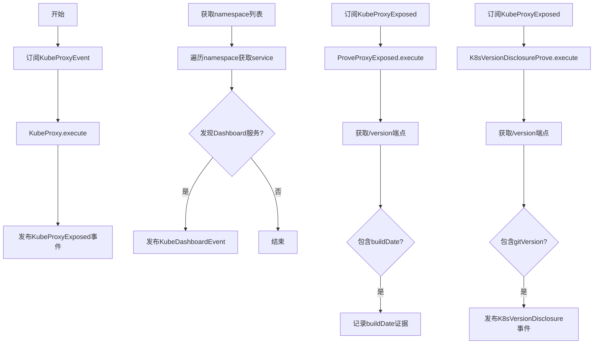
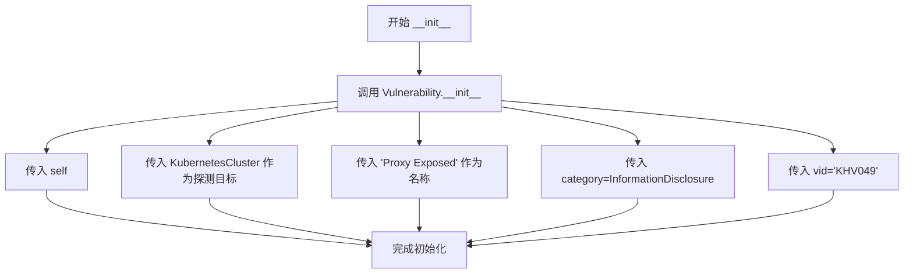
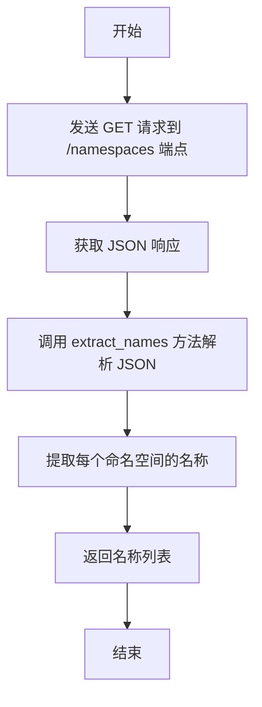
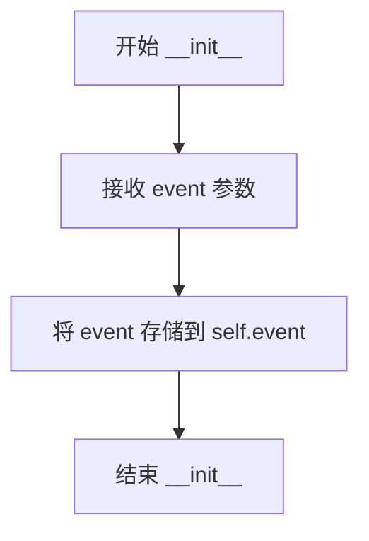
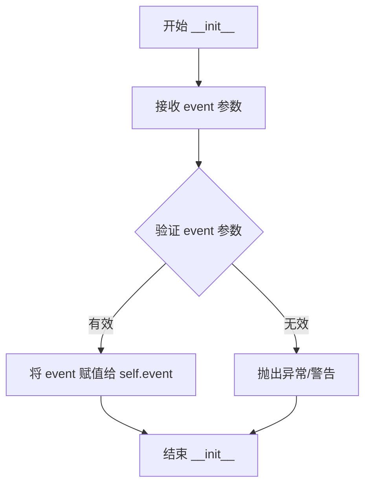

# `kubehunter\kube_hunter\modules\hunting\proxy.py` 详细设计文档

该模块是kube-hunter安全扫描工具的一部分，负责检测Kubernetes集群的API代理是否暴露，并在检测到暴露时收集版本信息（构建日期和Git版本），用于安全漏洞评估。

## 整体流程



## 类结构

```
Event (基类)
├── Vulnerability
│   └── KubeProxyExposed
Hunter (基类)
├── KubeProxy
ActiveHunter (基类)
├── ProveProxyExposed
└── K8sVersionDisclosureProve
Enum
└── Service
```

## 全局变量及字段


### `logger`
    
用于记录模块日志的日志记录器对象

类型：`logging.Logger`
    


### `KubeProxy.event`
    
接收到的事件对象，包含主机和端口信息

类型：`KubeProxyEvent`
    


### `KubeProxy.api_url`
    
Kubernetes API的URL地址

类型：`str`
    


### `KubeProxy.namespaces`
    
获取集群中所有命名空间的列表（属性）

类型：`List[str]`
    


### `KubeProxy.services`
    
映射命名空间到服务名称的字典（属性）

类型：`Dict[str, List[str]]`
    


### `ProveProxyExposed.event`
    
接收到的事件对象，包含代理暴露信息

类型：`KubeProxyExposed`
    


### `K8sVersionDisclosureProve.event`
    
接收到的事件对象，包含代理暴露信息

类型：`KubeProxyExposed`
    
    

## 全局函数及方法


### KubeProxyExposed.__init__

该方法是 `KubeProxyExposed` 类的构造函数，用于初始化漏洞类实例，继承自 `Vulnerability` 和 `Event`，设置集群代理暴露的相关元数据信息。

参数：

- `self`：无显式类型（Python 对象实例），表示类的实例本身

返回值：`None`，无返回值（`__init__` 方法不返回值）

#### 流程图



#### 带注释源码

```python
def __init__(self):
    """初始化 KubeProxyExposed 漏洞事件类
    
    该类表示 Kubernetes 集群的代理服务暴露在外部网络，
    可能导致敏感操作被未授权访问。
    """
    # 调用父类 Vulnerability 的初始化方法
    # 参数说明：
    #   self: 当前实例对象
    #   KubernetesCluster: 表示该漏洞影响的资产类型（Kubernetes 集群）
    #   "Proxy Exposed": 漏洞名称
    #   category=InformationDisclosure: 漏洞分类为信息泄露
    #   vid="KHV049": 漏洞唯一标识符
    Vulnerability.__init__(
        self, KubernetesCluster, "Proxy Exposed", category=InformationDisclosure, vid="KHV049",
    )
```


### `KubeProxy.__init__`

该方法为 KubeProxy 类的构造函数，用于初始化代理猎杀模块的实例，接收事件对象并构建 API 访问地址。

参数：

- `event`：`KubeProxyEvent`，由 `KubeProxyEvent` 事件处理器传入的事件对象，包含目标集群的主机地址和端口信息

返回值：`None`，构造函数不返回任何值（Python 中 `__init__` 方法隐式返回 `None`）

#### 流程图

```mermaid
flowchart TD
    A[开始 __init__] --> B[接收 event 参数]
    B --> C{验证 event 对象}
    C -->|有效| D[赋值 self.event = event]
    D --> E[构建 API URL: http://{host}:{port}/api/v1]
    E --> F[赋值 self.api_url]
    F --> G[结束]
    
    style A fill:#f9f,stroke:#333
    style G fill:#9f9,stroke:#333
```

#### 带注释源码

```python
def __init__(self, event):
    """
    初始化 KubeProxy 猎手类
    
    参数:
        event: KubeProxyEvent 对象，包含目标 Kubernetes 代理的主机信息
    """
    # 将传入的事件对象保存为实例属性，供后续方法使用
    self.event = event
    
    # 构建 Kubernetes API 的基础 URL，格式为 http://{host}:{port}/api/v1
    # 用于后续访问命名空间和服务资源
    self.api_url = f"http://{self.event.host}:{self.event.port}/api/v1"
```


### KubeProxy.execute

该方法用于在发现 Kubernetes Proxy 暴露时，发布代理暴露事件，并遍历集群中的命名空间和服务，检测 kubernetes-dashboard 服务的存在，一旦发现则发布仪表盘事件以进行进一步探测。

参数：

- `self`：KubeProxy 实例本身，无需外部传入

返回值：`None`，该方法通过发布事件传递结果，不直接返回值

#### 流程图

```mermaid
flowchart TD
    A[开始 execute] --> B[发布 KubeProxyExposed 事件]
    B --> C[获取 services 属性]
    C --> D{遍历 namespaces 和 services}
    D -->|每个 namespace| E{遍历该 namespace 的 services}
    E -->|每个 service| F{判断 service == 'kubernetes-dashboard'}
    F -->|是| G[记录日志: Found a dashboard service]
    G --> H[构建 proxy 路径: api/v1/namespaces/{namespace}/services/{service}/proxy]
    H --> I[发布 KubeDashboardEvent 事件]
    I --> J[继续下一轮循环]
    F -->|否| J
    E --> J
    D --> K[结束 execute]
```

#### 带注释源码

```python
def execute(self):
    """执行代理暴露检测和仪表盘发现"""
    # 发布代理暴露事件，通知其他hunter该集群的代理已暴露
    self.publish_event(KubeProxyExposed())
    
    # 遍历所有命名空间及其对应的服务列表
    for namespace, services in self.services.items():
        # 遍历当前命名空间下的所有服务
        for service in services:
            # 检查服务是否为 Kubernetes Dashboard
            if service == Service.DASHBOARD.value:
                logger.debug(f"Found a dashboard service '{service}'")
                # TODO: check if /proxy is a convention on other services
                # 构建 Dashboard 的 proxy 路径
                curr_path = f"api/v1/namespaces/{namespace}/services/{service}/proxy"
                # 发布仪表盘发现事件，包含路径和 secure=False（表示使用 HTTP）
                self.publish_event(KubeDashboardEvent(path=curr_path, secure=False))
```


### `KubeProxy.namespaces`

该属性通过调用 Kubernetes API 的 `/namespaces` 端点获取集群中所有命名空间的名称列表，并使用 `extract_names` 方法解析 JSON 响应以提取命名空间名称。

参数：  
- 该属性不接受任何额外参数（隐含 `self` 表示类实例）。

返回值：  
- `List[str]`，返回集群中所有命名空间的名称列表。

#### 流程图



#### 带注释源码

```python
@property
def namespaces(self):
    """获取集群中所有命名空间的名称列表"""
    # 构造请求 URL: http://{host}:{port}/api/v1/namespaces
    resource_json = requests.get(
        f"{self.api_url}/namespaces", 
        timeout=config.network_timeout  # 设置网络超时时间
    ).json()  # 将响应解析为 JSON 格式
    
    # 调用静态方法 extract_names 提取命名空间名称
    return self.extract_names(resource_json)
```


### `KubeProxy.services`

该属性是一个只读的计算属性，用于获取 Kubernetes 集群中所有命名空间下的服务信息。它通过遍历所有命名空间，调用 Kubernetes API 获取每个命名空间的服务列表，最终返回一个以命名空间名称为键、服务名称列表为值的字典。

参数：
- 无显式参数（通过 `self` 访问实例属性）

返回值：`dict`，键为命名空间名称（str），值为该命名空间下的服务名称列表（list）

#### 流程图

```mermaid
flowchart TD
    A[开始] --> B[创建空字典 services]
    --> C[遍历 self.namespaces]
    --> D{还有更多 namespace?}
    D -->|是| E[构造 resource_path]
    --> F[GET请求获取 services JSON]
    --> G[调用 extract_names 提取服务名]
    --> H[将服务名列表存入 services[namespace]]
    --> C
    D -->|否| I[记录日志: 枚举到的服务列表]
    --> J[返回 services 字典]
```

#### 带注释源码

```python
@property
def services(self):
    # 用于存储命名空间到服务名称的映射关系
    services = dict()
    # 遍历集群中所有的命名空间
    for namespace in self.namespaces:
        # 构造获取指定命名空间下服务的API路径
        resource_path = f"{self.api_url}/namespaces/{namespace}/services"
        # 发送HTTP GET请求获取该命名空间的服务JSON数据
        resource_json = requests.get(resource_path, timeout=config.network_timeout).json()
        # 从JSON中提取服务名称列表，并关联到对应的命名空间键下
        services[namespace] = self.extract_names(resource_json)
    # 打印调试日志，显示所有枚举到的服务信息
    logger.debug(f"Enumerated services [{' '.join(services)}]")
    # 返回完整的命名空间-服务映射字典
    return services
```


### `KubeProxy.extract_names`

该静态方法用于从 Kubernetes API 返回的 JSON 响应中提取资源名称。它接收一个包含 items 列表的字典，遍历每个 item 并提取其 metadata.name 字段，最终返回所有名称组成的列表。

**参数：**

- `resource_json`：`dict`，Kubernetes API 返回的 JSON 响应对象，包含 items 列表，每个 item 代表一个 Kubernetes 资源

**返回值：** `list`，返回资源名称的列表，例如 `["service-a", "service-b", "service-c"]`

#### 流程图

```mermaid
flowchart TD
    A[开始: extract_names] --> B[创建空列表 names]
    B --> C{遍历 resource_json['items']}
    C -->|对每个 item| D[提取 item['metadata']['name']]
    D --> E[将 name 添加到 names 列表]
    E --> C
    C -->|遍历完成| F[返回 names 列表]
    F --> G[结束]
```

#### 带注释源码

```python
@staticmethod
def extract_names(resource_json):
    """
    从 Kubernetes API 返回的 JSON 中提取资源名称
    
    参数:
        resource_json: 包含 items 列表的字典，通常是 Kubernetes API 的 JSON 响应
    
    返回:
        资源名称列表
    """
    # 初始化一个空列表用于存储名称
    names = list()
    
    # 遍历 JSON 响应中的所有 items（每个 item 代表一个 Kubernetes 资源）
    for item in resource_json["items"]:
        # 从每个 item 的 metadata 中提取 name 字段
        names.append(item["metadata"]["name"])
    
    # 返回提取到的所有名称列表
    return names
```


### `ProveProxyExposed.__init__`

初始化 `ProveProxyExposed` 类的实例，存储传入的 `KubeProxyExposed` 事件对象，以便在后续的 `execute` 方法中使用来获取 Kubernetes 代理的版本信息。

参数：

- `event`：`KubeProxyExposed`，触发此 Hunter 执行的代理暴露事件，包含了目标 Kubernetes 集群的代理信息（如主机地址和端口等）

返回值：`None`，作为构造函数不返回任何值

#### 流程图



#### 带注释源码

```python
def __init__(self, event):
    """初始化 ProveProxyExposed 实例
    
    Args:
        event: KubeProxyExposed 事件对象，包含代理的主机和端口信息
    """
    self.event = event  # 将传入的事件对象存储为实例属性，供 execute 方法使用
```


### ProveProxyExposed.execute

该方法是一个主动猎人（ActiveHunter），当代理（Proxy）暴露时触发，用于获取 Kubernetes 的构建日期（build date）信息并将其记录为事件证据。

参数：

- `self`：`ProveProxyExposed`，类实例本身
- `event`：`KubeProxyExposed`，代理暴露事件对象，包含 `host` 和 `port` 属性，用于构造访问 Kubernetes API 端点的 URL

返回值：`None`，无返回值（仅修改事件对象的 `evidence` 属性）

#### 流程图

```mermaid
flowchart TD
    A[execute 方法开始] --> B[构造版本请求URL<br/>http://{host}:{port}/version]
    B --> C[发送HTTP GET请求<br/>verify=False, timeout=config.network_timeout]
    C --> D{请求成功?}
    D -->|否| E[方法结束]
    D -->|是| F[解析JSON响应<br/>version_metadata = response.json()]
    F --> G{buildDate 字段存在?}
    G -->|否| E
    G -->|是| H[设置事件证据<br/>self.event.evidence = 'build date: {buildDate}']
    H --> E
```

#### 带注释源码

```python
def execute(self):
    """
    执行主动猎取操作
    当检测到 Kubernetes Proxy 暴露时，尝试获取集群的构建日期信息
    """
    # 构造版本信息请求的完整 URL
    # 从事件对象中获取 host 和 port，访问 /version 端点
    version_metadata = requests.get(
        f"http://{self.event.host}:{self.event.port}/version", 
        verify=False,  # 跳过 SSL 证书验证（潜在安全风险）
        timeout=config.network_timeout,  # 使用配置的网络超时时间
    ).json()  # 将响应解析为 JSON 格式
    
    # 检查响应中是否包含 buildDate 字段
    if "buildDate" in version_metadata:
        # 将构建日期设置为事件的证据
        # 用于后续报告或进一步处理
        self.event.evidence = "build date: {}".format(version_metadata["buildDate"])
```


### K8sVersionDisclosureProve.__init__

这是 K8sVersionDisclosureProve 类的构造函数，用于初始化 K8s 版本披露证明的猎人模块，接收并保存 KubeProxyExposed 事件对象。

参数：

- `event`：`KubeProxyExposed`，触发此猎人执行的代理暴露事件对象

返回值：`None`，构造函数不返回任何值

#### 流程图



#### 带注释源码

```python
@handler.subscribe(KubeProxyExposed)
class K8sVersionDisclosureProve(ActiveHunter):
    """K8s Version Hunter
    Hunts Proxy when exposed, extracts the version
    """

    def __init__(self, event):
        # 参数: event - KubeProxyExposed 事件对象，包含被暴露的 Kubernetes 代理端点信息
        # 功能: 初始化猎人实例，保存事件引用供后续 execute 方法使用
        # 返回值: 无 (None)
        
        self.event = event  # 保存事件对象到实例变量，供 execute 方法访问 host 和 port
```


### `K8sVersionDisclosureProve.execute`

该方法用于在 Kubernetes Proxy 暴露时，通过访问 `/version` 端点获取 Kubernetes 版本信息，并发布包含版本详情的 K8sVersionDisclosure 事件。

参数：

- `self`：隐式参数，`K8sVersionDisclosureProve` 实例本身

返回值：`None`，无返回值（通过发布事件传递结果）

#### 流程图

```mermaid
flowchart TD
    A[开始执行] --> B[向 {host}:{port}/version 发送 GET 请求]
    B --> C[获取 JSON 响应]
    C --> D{响应中是否包含 gitVersion?}
    D -->|是| E[构建 K8sVersionDisclosure 事件]
    E --> F[发布事件到事件处理器]
    D -->|否| G[结束执行]
    F --> G
```

#### 带注释源码

```python
def execute(self):
    """
    执行版本信息提取
    当 Kubernetes Proxy 暴露时，访问 /version 端点获取版本元数据，
    并发布 K8sVersionDisclosure 事件
    """
    # 发送 HTTP GET 请求到 /version 端点获取版本信息
    # verify=False 跳过 SSL 证书验证，timeout 使用配置的网络超时时间
    version_metadata = requests.get(
        f"http://{self.event.host}:{self.event.port}/version", 
        verify=False, 
        timeout=config.network_timeout,
    ).json()
    
    # 检查响应中是否包含 gitVersion 字段（版本号）
    if "gitVersion" in version_metadata:
        # 创建并发布 K8sVersionDisclosure 事件
        # 包含版本号、来源端点和额外信息（标记来自 kube-proxy）
        self.publish_event(
            K8sVersionDisclosure(
                version=version_metadata["gitVersion"],    # Kubernetes 版本号（如 v1.28.0）
                from_endpoint="/version",                   # 版本信息来源于 /version 端点
                extra_info="on kube-proxy",                 # 额外说明：来自 kube-proxy
            )
        )
```

## 关键组件


### KubeProxyExposed

继承自Vulnerability和Event的漏洞事件类，表示Kubernetes集群的代理暴露漏洞。

### Service (枚举)

定义Dashboard服务的枚举类型，当前只包含DASHBOARD服务。

### KubeProxy

Hunter类型的探测器类，负责通过kube-proxy查找暴露的Dashboard服务。包含namespaces和services属性用于懒加载获取命名空间和服务信息。

### ProveProxyExposed

ActiveHunter类型的主动探测器，当代理暴露时获取Kubernetes的构建日期信息。

### K8sVersionDisclosureProve

ActiveHunter类型的主动探测器，当代理暴露时获取并发布Kubernetes版本信息。

### handler.subscribe

事件订阅装饰器，用于注册事件监听器，实现事件驱动的漏洞发现机制。

### extract_names (静态方法)

从API返回的JSON资源中提取名称列表的辅助方法。


## 问题及建议


### 已知问题

-   **重复的网络请求逻辑**：ProveProxyExposed和K8sVersionDisclosureProve两个类都调用相同的`/version` endpoint并执行类似的HTTP请求，代码重复且浪费资源
-   **缺少异常处理**：所有`requests.get()`调用均未进行try-except包装，网络请求失败时会导致整个程序崩溃
-   **SSL验证被禁用**：在ProveProxyExposed和K8sVersionDisclosureProve中使用`verify=False`跳过SSL证书验证，存在安全风险
-   **硬编码的API路径**：在`__init__`方法中硬编码了`/api/v1`路径，缺乏灵活性
-   **未使用的参数**：KubeProxy类的`execute`方法中直接调用`self.publish_event(KubeProxyExposed())`但未使用其返回结果
-   **属性重复计算问题**：`namespaces`和`services`属性每次访问都会发起新的HTTP请求，缺乏缓存机制，在循环中访问会导致性能问题
-   **TODO未完成**：代码中有TODO注释关于检查其他服务的/proxy约定，但一直未实现
-   **日志信息不准确**：`logger.debug(f"Enumerated services [{' '.join(services)}]")`试图打印字典，格式会显示dict的字符串表示而非服务名列表

### 优化建议

-   提取公共的版本获取逻辑到父类或工具函数中，避免重复请求
-   为所有网络请求添加try-except异常处理，捕获requests.RequestException并记录日志
-   移除`verify=False`或在配置中明确控制SSL验证行为
-   将API路径提取为配置项或构造函数参数
-   使用`functools.cached_property`装饰器缓存`namespaces`和`services`属性结果，或在类中显式管理缓存
-   修复日志格式问题，使用正确的格式化方式打印服务信息
-   完成TODO中关于/proxy约定的检查功能，或移除该TODO注释
-   考虑将版本获取请求合并为一次，在获取版本后同时提取buildDate和gitVersion信息


## 其它


### 设计目标与约束

该模块是kube-hunter安全扫描框架的一部分，目标是检测Kubernetes集群中API Server代理的暴露情况，并进一步发现背后的Dashboard服务和其他信息泄露问题。设计遵循事件驱动架构，通过订阅-发布模式解耦各检测模块。约束方面：仅支持HTTP协议探测，使用config.network_timeout控制超时，不验证SSL证书（verify=False），依赖Kubernetes API v1接口。

### 错误处理与异常设计

代码采用静默失败模式（fail-silent）：网络请求超时或失败时，requests.get()的异常由调用方默认向上传播；JSON解析失败时（如key不存在）会导致KeyError，如第54行访问version_metadata["buildDate"]和第66行访问version_metadata["gitVersion"]，当前无try-except保护。无重试机制，无降级策略，异常信息仅通过logger.debug输出。

### 数据流与状态机

数据流为线性管道：KubeProxyEvent（代理发现事件）触发KubeProxy Hunter执行 → 通过Kubernetes API枚举namespaces和services → 发现Dashboard时发布KubeDashboardEvent → KubeProxyExposed事件触发ProveProxyExposed和K8sVersionDisclosureProve两个ActiveHunter → 分别获取版本信息并发布K8sVersionDisclosure事件。无状态机，状态由事件类型和事件属性承载。

### 外部依赖与接口契约

外部依赖包括：requests库用于HTTP通信，kube_hunter.conf.config提供配置（network_timeout），kube_hunter.core.events模块提供事件系统，kube_hunter.modules.discovery模块提供初始事件类。接口契约方面：KubeProxyEvent需包含host和port属性；KubeDashboardEvent接收path和secure参数；KubeProxyExposed需继承Vulnerability和Event基类；事件处理器需实现execute()方法。

### 安全性考虑

代码存在安全风险：verify=False禁用SSL验证，存在中间人攻击风险；无认证凭证管理，探测敏感API端口；日志输出可能泄露内部服务名称（logger.debug）；缺少输入校验，event.host和event.port未做格式验证。

### 配置管理

配置通过kube_hunter.conf.config统一管理，当前仅使用network_timeout参数控制HTTP请求超时时间。超时值需在kube-hunter主配置文件中设置，模块内无独立配置项。无重试次数、超时回退等细粒度配置。

### 性能考虑

性能瓶颈在于串行HTTP请求：namespaces属性对每个namespace串行请求services，n+1查询问题严重（第48-52行）。建议批量获取或并行请求。当前无缓存机制，每次触发都重新枚举所有namespace和service。超时配置为全局统一，无法针对不同端点差异化设置。

### 测试策略

当前代码无单元测试和集成测试。测试应覆盖：网络超时场景、JSON格式异常、事件订阅-发布机制、extract_names方法对不同响应格式的处理。建议添加mock requests的单元测试，验证枚举逻辑的正确性。

### 部署环境要求

部署环境需满足：Python 3.6+；网络可达Kubernetes API Server（默认6443端口或通过event指定）；具有对/api/v1、/api/v1/namespaces、/api/v1/namespaces/{ns}/services等端点的访问权限；运行账户需具备cluster-reader及以上权限以枚举资源。

    