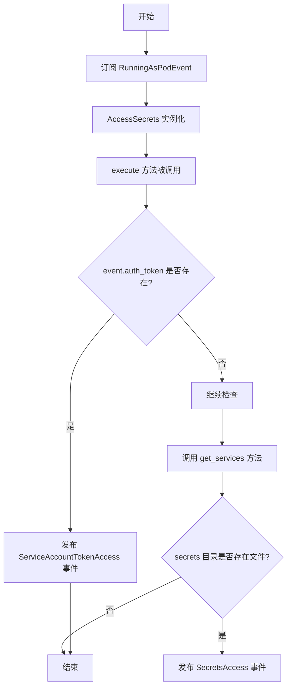
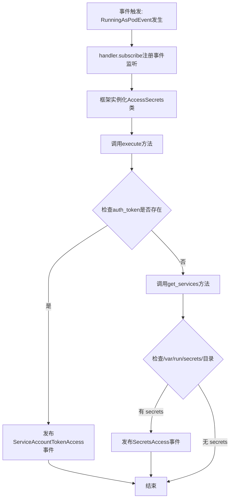
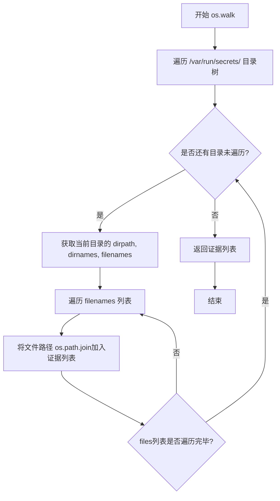
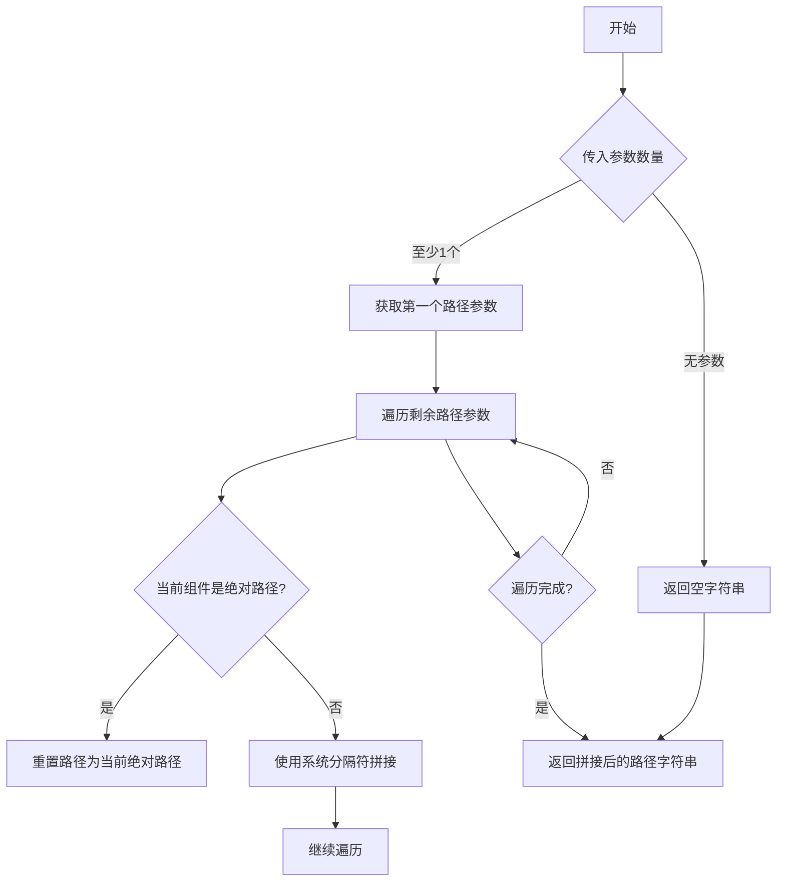
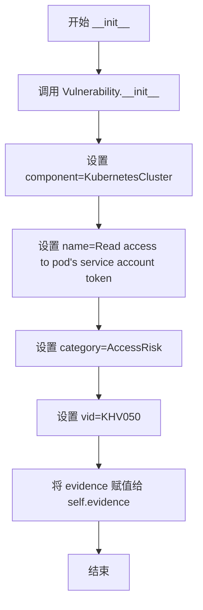
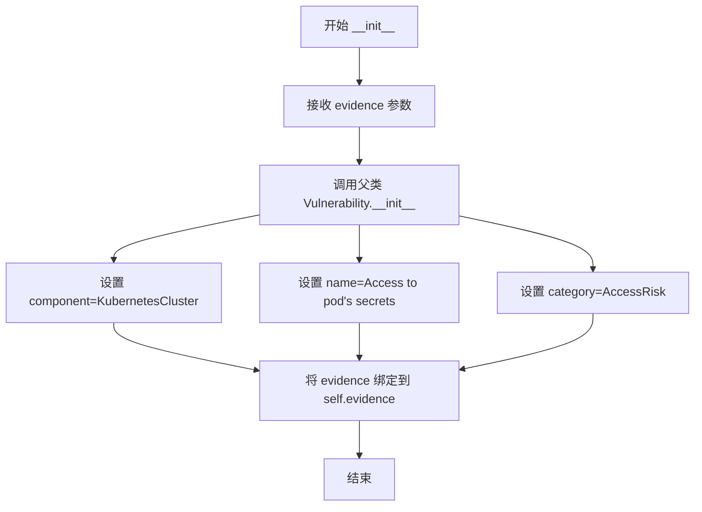
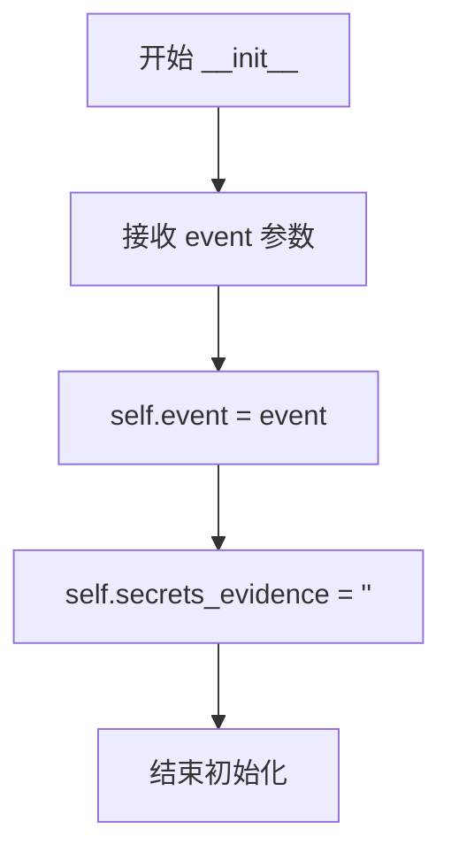
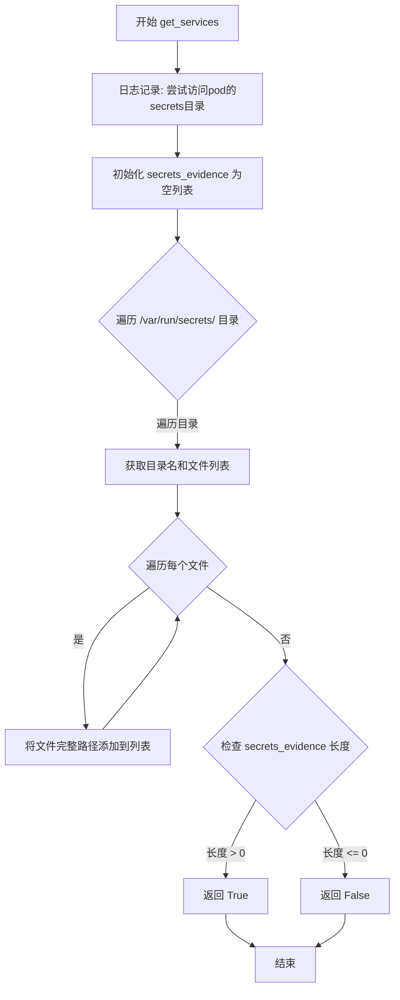
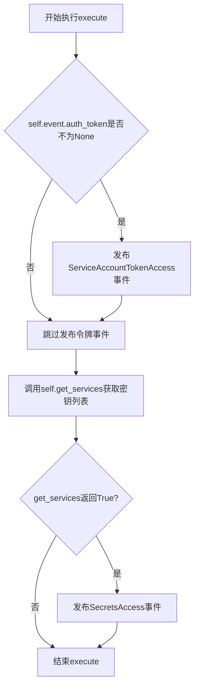

# `kubehunter\kube_hunter\modules\hunting\secrets.py` 详细设计文档

该代码是kube-hunter安全扫描框架的一个被动扫描模块，用于检测运行在Kubernetes Pod中的安全风险，主要通过访问Pod的服务账号令牌和secrets目录来识别潜在的凭证泄露和敏感信息访问风险。

## 整体流程



## 类结构

```
Event (基类)
├── Vulnerability (事件子类)
│   ├── ServiceAccountTokenAccess
│   └── SecretsAccess
└── Hunter (基类)
    └── AccessSecrets
```

## 全局变量及字段


### `logger`
    
模块级别的日志记录器，用于输出调试和信息日志

类型：`logging.Logger`
    


### `ServiceAccountTokenAccess.evidence`
    
存储Pod服务账号令牌的证据信息

类型：`str`
    


### `SecretsAccess.evidence`
    
存储从/var/run/secrets/目录遍历获取的密钥文件路径列表

类型：`list`
    


### `AccessSecrets.event`
    
当前接收到的事件对象，包含Pod运行时的上下文信息

类型：`RunningAsPodEvent`
    


### `AccessSecrets.secrets_evidence`
    
存储从Pod密钥目录遍历获取的文件路径列表，用于记录可访问的密钥证据

类型：`list`
    
    

## 全局函数及方法


### `handler.subscribe`

这是一个事件订阅方法，用于注册事件处理器。当指定的事件类型发生时，框架会自动调用被装饰的类来处理该事件。

参数：

- `event_type`：`Type[Event]` 或 `Event`，要订阅的事件类型，这里是 `RunningAsPodEvent`，表示当发现正在以 Pod 形式运行时触发

返回值：`Callable`，返回装饰器函数，用于装饰 Hunter 类的构造函数

#### 流程图



#### 带注释源码

```python
# 导入kube_hunter的事件处理器
from kube_hunter.core.events import handler
# 导入要订阅的事件类型
from kube_hunter.modules.discovery.hosts import RunningAsPodEvent

# 使用handler.subscribe装饰器注册事件监听器
# 当RunningAsPodEvent事件发生时，AccessSecrets类会被实例化并执行
@handler.subscribe(RunningAsPodEvent)
class AccessSecrets(Hunter):
    """Access Secrets
    Accessing the secrets accessible to the pod"""

    def __init__(self, event):
        self.event = event
        self.secrets_evidence = ""

    def get_services(self):
        logger.debug("Trying to access pod's secrets directory")
        # get all files and subdirectories files:
        self.secrets_evidence = []
        for dirname, _, files in os.walk("/var/run/secrets/"):
            for f in files:
                self.secrets_evidence.append(os.path.join(dirname, f))
        return True if (len(self.secrets_evidence) > 0) else False

    def execute(self):
        if self.event.auth_token is not None:
            self.publish_event(ServiceAccountTokenAccess(self.event.auth_token))
        if self.get_services():
            self.publish_event(SecretsAccess(self.secrets_evidence))
```


### `os.walk`

`os.walk` 是 Python 标准库函数，用于递归遍历目录树，生成目录树中的所有文件和子目录信息。

参数：

- `top`：`str`，要遍历的起始目录路径，代码中传入 `"/var/run/secrets/"` 用于扫描 Kubernetes Pod 的 secrets 目录
- `topdown`：可选参数，控制遍历顺序（代码中未使用）
- `onerror`：可选参数，错误处理回调（代码中未使用）
- `followlinks`：可选参数，是否跟随符号链接（代码中未使用）

返回值：`Iterator[Tuple[str, List[str], List[str]]]`，返回一个迭代器，每次迭代返回一个元组 `(dirpath, dirnames, filenames)`，其中 `dirpath` 是当前遍历的目录路径，`dirnames` 是该目录下的子目录列表，`filenames` 是该目录下的文件列表

#### 流程图



#### 带注释源码

```python
# os.walk 使用示例源码（来自 AccessSecrets.get_services 方法）

def get_services(self):
    logger.debug("Trying to access pod's secrets directory")
    # 获取所有文件及子目录文件
    self.secrets_evidence = []
    # os.walk 会递归遍历指定目录
    # 参数: top - 起始目录路径
    # 返回: (dirpath, dirnames, filenames) 元组的迭代器
    #   - dirpath: 当前遍历到的目录路径（字符串）
    #   - dirnames: 当前目录下的子目录列表（列表）
    #   - filenames: 当前目录下的文件列表（列表）
    for dirname, _, files in os.walk("/var/run/secrets/"):
        # dirname: 当前遍历的目录路径（如 /var/run/secrets/kubernetes.io/...）
        # files: 当前目录下的文件列表
        for f in files:
            # 拼接完整文件路径并添加到证据列表
            self.secrets_evidence.append(os.path.join(dirname, f))
    # 返回是否存在 secrets 的布尔值
    return True if (len(self.secrets_evidence) > 0) else False
```


### `os.path.join`

`os.path.join` 是 Python 标准库中的路径拼接函数，用于将多个路径组件智能地拼接成一个完整的文件系统路径。在该代码中用于将目录路径与文件名组合成完整的文件路径。

参数：

- `path`：`str`，第一个路径组件（目录路径）
- `*paths`：可变数量的 `str`，后续的路径组件（文件名或其他子路径）

返回值：`str`，拼接后的完整文件系统路径

#### 流程图



#### 带注释源码

```python
# os.path.join 源码实现（简化版）
def join(*paths):
    """
    将多个路径组件智能拼接成一个完整路径
    
    参数:
        *paths: 可变数量的路径字符串
    
    返回值:
        str: 拼接后的完整路径
    """
    # 如果没有传入任何参数，返回空字符串
    if not paths:
        return ""
    
    # 获取第一个非空路径作为起始路径
    path = paths[0]
    
    # 遍历剩余的路径组件
    for p in paths[1:]:
        # 如果当前组件是绝对路径，则前面的路径将被忽略
        if os.path.isabs(p):
            path = p
        else:
            # 否则，使用系统路径分隔符拼接
            path = path + os.sep + p
    
    return path


# 在 kube-hunter 代码中的实际使用示例:
for dirname, _, files in os.walk("/var/run/secrets/"):
    for f in files:
        # 使用 os.path.join 将目录名和文件名拼接成完整路径
        # dirname: 目录路径 (如 "/var/run/secrets/kubernetes.io/...")
        # f: 文件名 (如 "token")
        # 返回: 完整文件路径 (如 "/var/run/secrets/kubernetes.io/.../token")
        self.secrets_evidence.append(os.path.join(dirname, f))
```


### ServiceAccountTokenAccess.__init__

这是 `ServiceAccountTokenAccess` 类的初始化方法，用于创建一个表示"访问 Pod 服务账户令牌"漏洞的事件对象。该方法继承自 `Vulnerability` 和 `Event` 基类，接收证据数据并配置漏洞相关的元信息（名称、类别、VID等）。

参数：

- `evidence`：`任意类型`，传入的证据数据，通常是服务账户令牌信息

返回值：`None`，`__init__` 方法不返回任何值

#### 流程图



#### 带注释源码

```python
def __init__(self, evidence):
    """
    初始化 ServiceAccountTokenAccess 漏洞事件对象
    
    参数:
        evidence: 证据数据，通常是服务账户令牌内容
    """
    # 调用父类 Vulnerability 的初始化方法
    # 传入 KubernetesCluster 作为受影响的组件
    # 设置漏洞名称为 "Read access to pod's service account token"
    # 设置类别为 AccessRisk（访问风险）
    # 设置 VID（漏洞标识符）为 "KHV050"
    Vulnerability.__init__(
        self,
        KubernetesCluster,
        name="Read access to pod's service account token",
        category=AccessRisk,
        vid="KHV050",
    )
    
    # 将传入的证据数据保存为实例属性
    # 后续可用于报告或进一步分析
    self.evidence = evidence
```


### `SecretsAccess.__init__`

该方法是 `SecretsAccess` 类的构造函数，负责初始化漏洞事件对象，设置漏洞的名称、类别、所属组件等元信息，并将证据数据绑定到实例属性中。

参数：

-  `self`：`SecretsAccess` 实例本身（隐式参数），代表当前正在初始化的对象
-  `evidence`：`任意类型`，用于存储与该漏洞相关的证据数据（如 secrets 文件路径列表）

返回值：`None`，构造函数不返回值（Python 隐式返回）

#### 流程图



#### 带注释源码

```python
def __init__(self, evidence):
    """
    初始化 SecretsAccess 漏洞事件对象
    
    该构造函数继承自 Vulnerability 和 Event 基类，用于表示
    一个"访问 Pod  secrets"的漏洞事件。当攻击者能够访问 Pod
    的 secrets 目录时，会触发此漏洞事件。
    
    参数:
        evidence: 与漏洞相关的证据数据，通常是 secrets 文件路径列表
    """
    # 调用父类 Vulnerability 的构造函数，传入漏洞的元信息
    Vulnerability.__init__(
        self,                          # 将当前实例传递给父类
        component=KubernetesCluster,   # 指定该漏洞所属的组件类型为 Kubernetes 集群
        name="Access to pod's secrets", # 漏洞名称
        category=AccessRisk,           # 漏洞类别为访问风险
    )
    # 将传入的证据数据绑定到实例属性，供后续处理使用
    self.evidence = evidence
```


### `AccessSecrets.__init__`

初始化 AccessSecrets 类的实例，设置事件对象和秘密证据的初始状态。

参数：

- `event`：RunningAsPodEvent，包含在 Kubernetes Pod 中运行时的相关事件信息

返回值：`None`，无返回值（构造函数）

#### 流程图



#### 带注释源码

```python
def __init__(self, event):
    """
    初始化 AccessSecrets Hunter
    
    参数:
        event: RunningAsPodEvent 类型的事件对象，
               包含在 Kubernetes Pod 环境中运行时的上下文信息
    """
    # 将传入的事件对象存储为实例属性，供后续方法使用
    self.event = event
    
    # 初始化 secrets_evidence 为空字符串，
    # 用于后续存储从 /var/run/secrets/ 目录发现的所有秘密文件路径
    self.secrets_evidence = ""
```


### `AccessSecrets.get_services`

该方法用于检测Pod是否能够访问 secrets 目录下的文件，通过遍历 `/var/run/secrets/` 目录收集所有文件路径，并根据是否存在 secrets 文件返回布尔值。

参数：
- 该方法无显式参数（`self` 为隐式参数）

返回值：`bool`，如果 secrets 目录中存在至少一个文件则返回 `True`，否则返回 `False`

#### 流程图



#### 带注释源码

```python
def get_services(self):
    """检查并收集Pod secrets目录中的所有文件路径"""
    # 记录调试日志，表明正在尝试访问pod的secrets目录
    logger.debug("Trying to access pod's secrets directory")
    
    # 初始化一个空列表用于存储secrets文件路径
    self.secrets_evidence = []
    
    # 使用 os.walk 遍历 /var/run/secrets/ 目录及其子目录
    # os.walk 返回 (dirname, dirnames, filenames) 元组
    for dirname, _, files in os.walk("/var/run/secrets/"):
        # 遍历当前目录下的所有文件
        for f in files:
            # 拼接完整文件路径并添加到列表中
            self.secrets_evidence.append(os.path.join(dirname, f))
    
    # 如果发现至少一个 secrets 文件则返回 True，否则返回 False
    return True if (len(self.secrets_evidence) > 0) else False
```


### `AccessSecrets.execute`

该方法执行密钥访问检测逻辑，用于检查pod是否能够访问服务账户令牌和密钥目录。如果发现可访问的令牌或密钥，则发布相应的漏洞事件。

参数：

- `self`：无（隐式参数），AccessSecrets类的实例本身

返回值：`None`，无返回值（该方法通过publish_event发布事件，不返回任何值）

#### 流程图



#### 带注释源码

```python
def execute(self):
    """
    执行密钥访问检测逻辑
    
    该方法执行以下操作：
    1. 检查事件中是否存在认证令牌，如果存在则发布ServiceAccountTokenAccess漏洞事件
    2. 调用get_services方法检查是否能够访问pod的密钥目录
    3. 如果能够访问到密钥，则发布SecretsAccess漏洞事件
    """
    # 检查认证令牌是否存在
    if self.event.auth_token is not None:
        # 如果存在认证令牌，发布服务账户令牌访问漏洞事件
        self.publish_event(ServiceAccountTokenAccess(self.event.auth_token))
    
    # 调用get_services方法检查是否能访问密钥目录
    if self.get_services():
        # 如果成功获取到密钥，发布密钥访问漏洞事件
        self.publish_event(SecretsAccess(self.secrets_evidence))
```

## 关键组件


### ServiceAccountTokenAccess

表示对Pod服务账户令牌的访问漏洞，继承自Vulnerability和Event，用于发布服务账户令牌被读取的安全风险事件。

### SecretsAccess

表示对Pod Secrets的访问漏洞，继承自Vulnerability和Event，用于发布Pod Secrets被访问的安全风险事件。

### AccessSecrets

主动Hunter检测器类，订阅RunningAsPodEvent事件，用于检测运行在Pod中的服务账户令牌和Secrets访问权限。

### get_services

用于遍历/var/run/secrets/目录，获取所有Secrets文件路径列表的私有方法。

### execute

主执行方法，负责发布ServiceAccountTokenAccess和SecretsAccess漏洞事件的业务逻辑。


## 问题及建议


### 已知问题

- `SecretsAccess`类缺少`vid`参数，而`ServiceAccountTokenAccess`有`vid="KHV050"`，导致漏洞追踪不一致
- `SecretsAccess.__init__`中使用`component=KubernetesCluster`作为位置参数，但父类`Vulnerability.__init__`中可能应使用关键字参数`component=`，存在参数传递错误风险
- `get_services`方法名暗示返回服务列表，但实际返回布尔值，命名与功能不符
- `secrets_evidence`在`__init__`中初始化为`str`类型，在`get_services`中重新赋值为`list`类型，类型不一致
- `os.walk("/var/run/secrets/")`缺少异常处理，如果目录不存在会抛出`FileNotFoundError`异常导致程序中断
- `execute`方法中无try-except保护，`get_services()`异常会终止后续逻辑执行

### 优化建议

- 为`SecretsAccess`添加`vid`参数如`vid="KHV051"`以保持漏洞追踪一致性
- 修正`SecretsAccess.__init__`中`component`参数传递方式，使用关键字参数
- 将`get_services`重命名为`has_secrets`或修改返回值为实际的secret路径列表
- 统一`secrets_evidence`类型，初始化为空列表`[]`
- 在`get_services`中添加目录存在性检查和异常捕获：
  ```python
  if not os.path.exists("/var/run/secrets/"):
      return False
  ```
- 在`execute`方法中添加try-except块处理潜在异常，确保事件发布逻辑执行

## 其它


### 设计目标与约束

**设计目标**：
- 检测运行在Kubernetes Pod中的安全风险，识别未授权访问服务账户令牌和Pod secrets的漏洞
- 遵循kube-hunter的被动扫描架构，仅收集信息不进行主动攻击
- 遵循模块化设计原则，继承Hunter基类实现漏洞检测逻辑

**设计约束**：
- 仅在Pod环境（RunningAsPodEvent触发）中运行
- 依赖特定路径 `/var/run/secrets/` 存在
- 假设Pod具有读取自身secrets目录的权限

### 错误处理与异常设计

**异常处理机制**：
- `get_services()`方法使用os.walk遍历目录，当目录不存在或无权限时os.walk会抛出异常，应捕获并返回False
- 文件路径拼接使用os.path.join确保跨平台兼容性
- 事件发布使用try-except包装，确保一个事件发布失败不影响其他事件

**错误传播**：
- 事件发布失败时记录日志但继续执行
- 目录不存在时返回False而非抛出异常

### 数据流与状态机

**数据流**：
1. 事件订阅：AccessSecrets类订阅RunningAsPodEvent事件
2. 事件触发：Pod环境检测到RunningAsPodEvent时触发AccessSecrets
3. 执行流程：__init__ → get_services → execute
4. 事件发布：检测到问题时发布ServiceAccountTokenAccess和SecretsAccess事件

**状态转换**：
- 初始状态：self.secrets_evidence初始化为空列表
- 检测状态：遍历/var/run/secrets/目录收集文件列表
- 报告状态：根据检测结果发布对应的事件

### 外部依赖与接口契约

**外部依赖**：
- `kube_hunter.core.events.handler`：事件订阅和发布机制
- `kube_hunter.core.events.types`：Vulnerability和Event基类
- `kube_hunter.core.types`：Hunter、KubernetesCluster、AccessRisk类型定义
- `kube_hunter.modules.discovery.hosts`：RunningAsPodEvent事件定义
- Python标准库：logging、os

**接口契约**：
- Hunter基类：必须实现execute方法
- Event类：必须实现__init__方法初始化事件类型
- 事件订阅：使用@handler.subscribe装饰器订阅事件类型

### 安全性考虑

**安全风险**：
- 检测过程只读，不修改系统文件
- 不执行任何命令，仅遍历文件系统
- 证据收集为文件路径列表，不包含敏感内容

**权限要求**：
- 需要读取/var/run/secrets/目录的权限
- 需要访问Pod的服务账户令牌（通过event.auth_token获取）

### 性能考量

**性能特征**：
- os.walk使用生成器，内存效率较高
- 文件列表存储在内存中，大型集群可能有内存压力
- 单次执行，无缓存机制

**优化建议**：
- 可添加缓存机制避免重复检测
- 大型环境中可限制遍历深度
- 考虑异步执行避免阻塞主线程

### 测试策略

**测试场景**：
- Pod环境检测：验证RunningAsPodEvent正确触发
- Secrets检测：验证/var/run/secrets/目录存在时的检测逻辑
- 无secrets场景：验证目录不存在时的处理
- 令牌检测：验证auth_token存在时的事件发布

**边界条件**：
- 空secrets目录
- 权限不足的目录
- 嵌套目录结构

### 部署和配置

**部署方式**：
- 作为kube-hunter的插件模块部署
- 通过kube-hunter的事件系统自动加载

**配置要求**：
- 无需额外配置
- 依赖Pod运行环境的secrets挂载

### 监控和日志

**日志记录**：
- 使用Python标准logging模块
- debug级别记录检测尝试信息
- 遵循kube-hunter的统一日志格式

**可观测性**：
- 通过Vulnerability事件提供结构化检测结果
- 包含CVE/VID标识（KHV050）
- 证据信息有助于安全分析

### 兼容性考虑

**Kubernetes兼容性**：
- 适用于所有标准Kubernetes集群
- 依赖secrets挂载到/var/run/secrets/的标准行为

**环境兼容性**：
- Python 3.x环境
- Linux文件系统（依赖/var/run/secrets/路径）


    