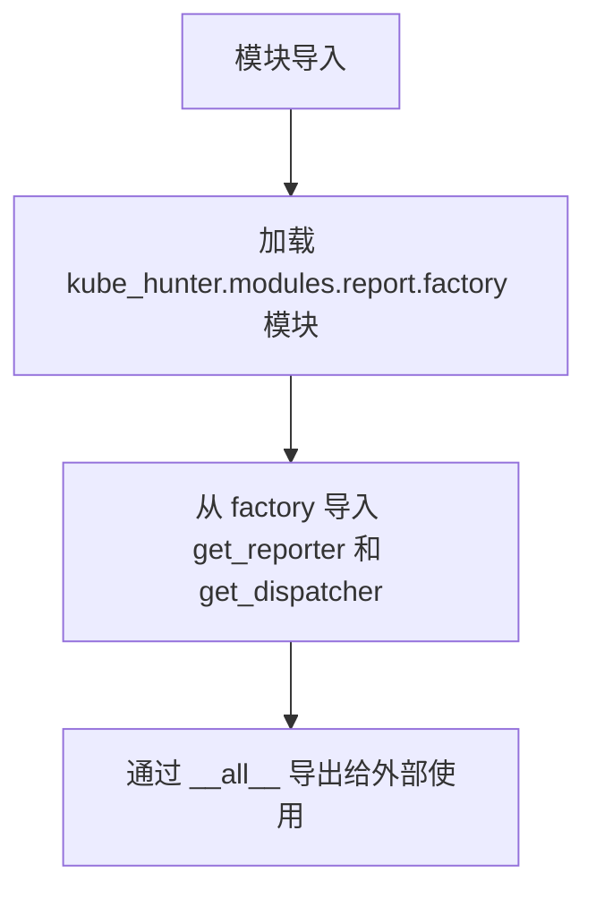
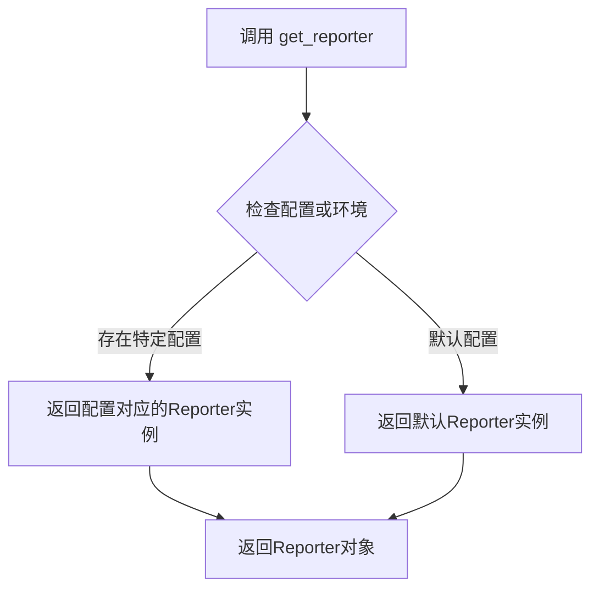
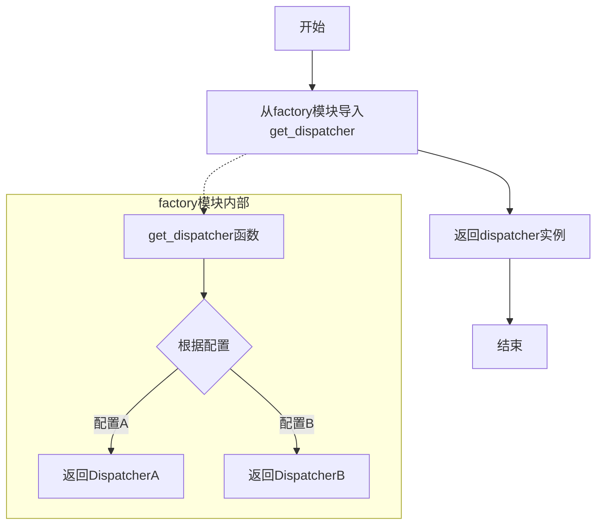

# `kubehunter\kube_hunter\modules\report\__init__.py` 详细设计文档

该文件是 kube-hunter 报告模块的入口文件，通过从 factory 模块导入并重新导出 get_reporter 和 get_dispatcher 函数，为外部提供统一的报告器和调度器获取接口。

## 整体流程



## 类结构

```
kube_hunter.modules.report 包
└── __init__.py (模块入口，仅作导入重导出)
```

## 全局变量及字段


### `__all__`
    
定义模块公开导出的符号

类型：`list`
    


    

## 全局函数及方法


### `get_reporter`

获取报告器实例的工厂函数，用于根据配置或上下文返回相应的报告器对象，以生成不同格式的安全扫描报告。

参数：

- 无显式参数（需查看实际实现以确认是否有可选参数或配置参数）

返回值：`Reporter` 或其子类实例，返回一个可用于生成安全扫描报告的报告器对象。

#### 流程图



#### 带注释源码

```
# 当前代码仅包含导入语句，未包含 get_reporter 的实际实现
from kube_hunter.modules.report.factory import get_reporter, get_dispatcher

# 导出 get_reporter 函数，使其可用于其他模块
# get_reporter 预期为一个工厂函数，根据配置返回相应的 Reporter 实例
__all__ = [get_reporter, get_dispatcher]
```

---

## 补充说明

由于提供的代码仅为导入声明，未包含 `get_reporter` 函数的实际实现，以上信息基于以下推断：

1. **函数名称推断**：`get_reporter` 作为工厂函数命名规范，通常返回相应类型的实例对象
2. **项目上下文**：在 kube-hunter（Kubernetes 安全扫描工具）中，该函数很可能用于获取报告生成器，支持多种报告格式（如 JSON、HTML、CSV 等）
3. **设计模式**：符合工厂模式（Factory Pattern）的典型用法

如需获取完整的函数签名和实现细节，请查看 `kube_hunter/modules/report/factory.py` 源文件。


### `get_dispatcher`

获取报告调度器实例的工厂函数，用于根据配置或条件返回相应的报告分发器。

参数：

- 此信息无法从给定代码中直接获取，需要查看 `kube_hunter.modules.report.factory` 模块的实现

返回值：`未知`，需要查看源代码后确定

#### 流程图



#### 带注释源码

```python
# 从kube_hunter项目的报告模块中导入报告生成器和调度器
from kube_hunter.modules.report.factory import get_reporter, get_dispatcher

# 定义模块的公共接口，导出get_reporter和get_dispatcher函数
__all__ = [get_reporter, get_dispatcher]
```

## 说明

**注意**：从提供的代码片段中只能获取以下信息：

1. **函数来源**：`get_dispatcher` 来自 `kube_hunter.modules.report.factory` 模块
2. **函数性质**：这是一个工厂函数（factory function）
3. **上下文**：与报告生成器（get_reporter）一起使用，属于 kube-hunter 项目的报告模块

**无法确定的信息**（需要查看 `kube_hunter/modules/report/factory.py` 源代码）：

- 具体的参数列表和类型
- 返回值的具体类型（可能是某种 Dispatcher 类或接口）
- 函数的具体实现逻辑
- 调度器的具体功能（如何分发报告）

要获取完整的函数详细信息，建议查看 `kube_hunter/modules/report/factory.py` 源文件。


## 关键组件


### get_reporter

从 kube_hunter.modules.report.factory 模块导入的报告器获取函数，用于创建和获取报告生成器实例。

### get_dispatcher

从 kube_hunter.modules.report.factory 模块导入的调度器获取函数，用于创建和获取事件调度器实例。

### __all__

模块的公共接口定义，明确指定了允许外部访问的函数列表，确保模块的封装性和接口一致性。


## 问题及建议


### 已知问题

-   `__all__` 列表中应该包含字符串而非函数对象本身，当前写法 `__all__ = [get_reporter, get_dispatcher]` 不会正确控制模块的公开接口
-   模块过于简单，仅作为传递层（pass-through module），未增加任何实际价值，可直接导入源模块
-   缺少模块级文档字符串（docstring），无法说明该模块的设计意图和使用场景
-   缺乏异常处理，当 `kube_hunter.modules.report.factory` 模块不存在或导入失败时，错误信息不够友好

### 优化建议

-   将 `__all__` 改为字符串列表：`__all__ = ['get_reporter', 'get_dispatcher']`
-   为模块添加文档字符串，说明该模块作为报告模块的公共入口点
-   添加类型注解提升代码可读性和 IDE 支持
-   考虑移除此包装层，直接从 `kube_hunter.modules.report.factory` 导入，减少不必要的间接层


## 其它


### 设计目标与约束

本模块作为 kube_hunter 报告模块的导出层，旨在提供统一的公共接口，隐藏内部实现细节，简化外部调用者的导入方式。设计约束包括：必须保持与 factory 模块的接口兼容性，不得引入额外的业务逻辑，仅作为转发层存在。

### 外部依赖与接口契约

本模块依赖 `kube_hunter.modules.report.factory` 模块中的 `get_reporter` 和 `get_dispatcher` 函数。接口契约明确：导入本模块后，可直接通过 `from kube_hunter.modules.report import get_reporter, get_dispatcher` 方式使用，无需关注内部模块路径变更。两个函数的签名由 factory 模块定义，本模块不改变其参数和返回值。

### 模块交互关系

本模块处于报告模块的Facade层，上游被其他模块（如主程序或插件系统）引用，下游调用 factory 模块的实际实现。这种设计遵循了依赖倒置原则，使得未来如果需要替换 report.factory 的实现（如迁移到新的报告生成机制），只需修改本模块的导入语句，对上游调用透明。

### 版本兼容性考虑

当前 `__all__` 显式导出了 `get_reporter` 和 `get_dispatcher`，这确保了只有这两个函数被公开。若未来 factory 模块新增函数，不应自动在本模块的 `__all__` 中暴露，需经过评审后再决定是否对外开放，以维持接口稳定性。

### 可测试性分析

由于本模块仅做导入转发，单元测试重点应验证：导入是否成功、`__all__` 列表内容是否正确、以及函数引用是否指向正确的 factory 模块函数。无需针对本模块编写复杂的业务逻辑测试。

    