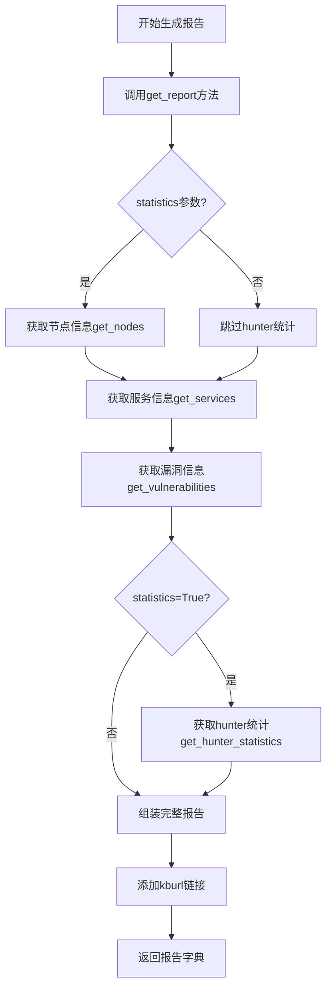
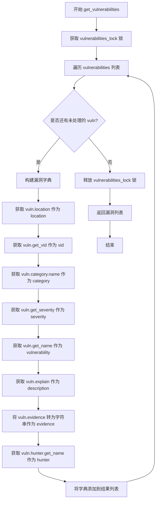
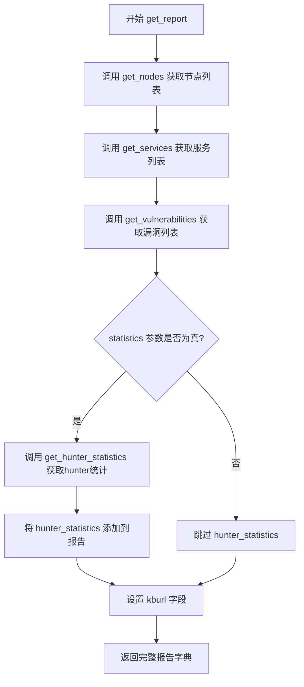
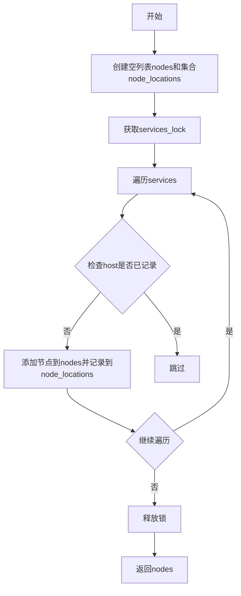
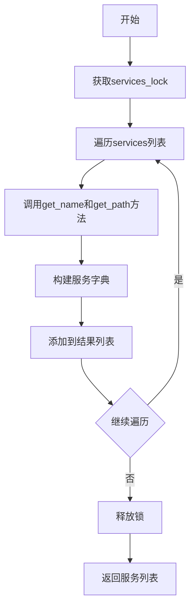
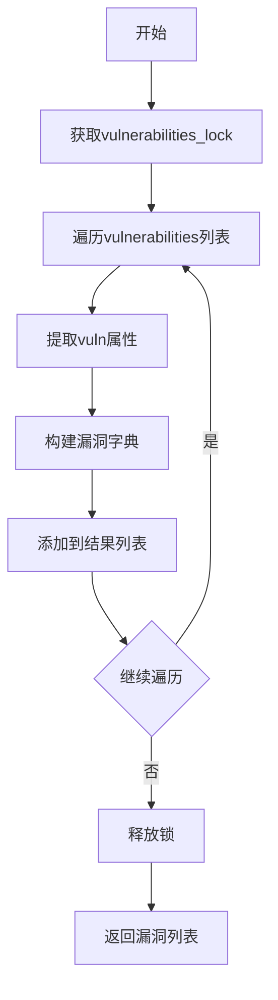
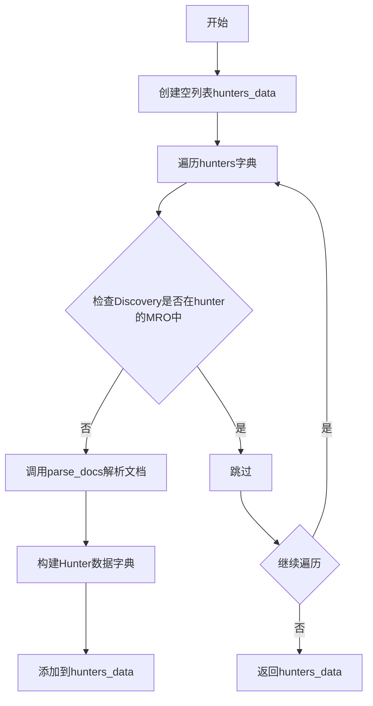
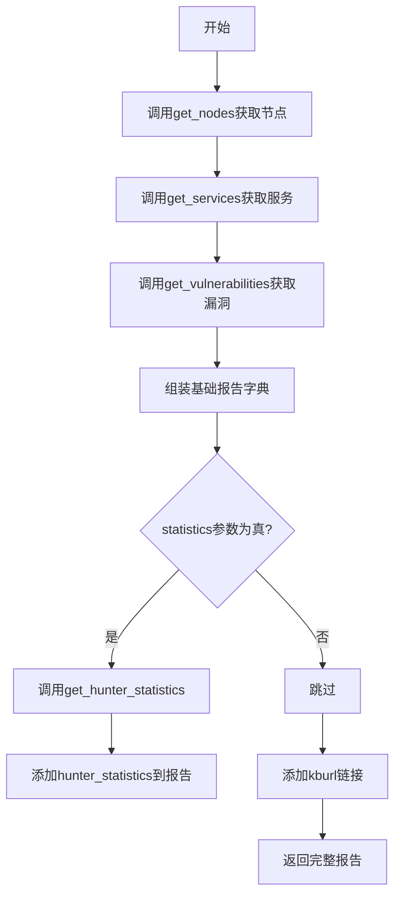

# `kubehunter\kube_hunter\modules\report\base.py` 详细设计文档

这是一个Kubernetes安全漏洞扫描工具的报告生成模块，BaseReporter类负责汇总节点、服务、漏洞和hunter统计信息，生成结构化的安全扫描报告，支持JSON格式输出，包含漏洞位置、严重程度、hunter名称等关键信息。

## 整体流程



## 类结构

```
BaseReporter (报告生成基类)
└── 负责汇总和格式化扫描结果
```

## 全局变量及字段


### `services`
    
存储所有发现的服务对象的列表，用于报告生成

类型：`list`
    


### `vulnerabilities`
    
存储所有发现的安全漏洞对象的列表，用于报告生成

类型：`list`
    


### `hunters`
    
存储hunter类及其对应文档的字典，用于追踪已注册的hunter和统计信息

类型：`dict`
    


### `services_lock`
    
用于线程安全访问services列表的锁对象

类型：`threading.Lock`
    


### `vulnerabilities_lock`
    
用于线程安全访问vulnerabilities列表的锁对象

类型：`threading.Lock`
    


    

## 全局函数及方法


### `BaseReporter.get_nodes`

该方法从服务集合中提取唯一的节点位置信息，通过遍历已发现的服务并根据主机地址去重，生成包含节点类型和位置的列表，用于构建报告的节点部分。

参数：
- 无

返回值：`list`，返回节点列表，每个节点是一个字典，包含 `type`（节点类型，固定为 "Node/Master"）和 `location`（节点位置，即服务主机地址）字段。

#### 流程图

```mermaid
flowchart TD
    A[开始 get_nodes] --> B[初始化 nodes = list()]
    B --> C[初始化 node_locations = set()]
    C --> D[获取 services_lock 锁]
    D --> E[遍历 services 集合]
    E --> F{当前遍历是否结束?}
    F -->|否| G[获取 service.host 转换为字符串]
    G --> H{node_location 是否在 node_locations 中?}
    H -->|是| I[跳过当前 service]
    H -->|否| J[创建节点字典 {'type': 'Node/Master', 'location': node_location}]
    J --> K[将节点字典添加到 nodes 列表]
    K --> L[将 node_location 添加到 node_locations 集合]
    L --> I
    I --> F
    F -->|是| M[释放 services_lock 锁]
    M --> N[返回 nodes 列表]
    N --> O[结束]
```

#### 带注释源码

```python
def get_nodes(self):
    """
    从服务集合中提取唯一的节点位置信息
    用于生成报告中的节点列表
    """
    # 初始化用于存储节点信息的列表
    nodes = list()
    # 初始化用于去重的集合，记录已处理的主机地址
    node_locations = set()
    
    # 使用线程锁保护对 services 集合的访问，确保线程安全
    with services_lock:
        # 遍历所有已发现的服务
        for service in services:
            # 将服务主机转换为字符串形式作为节点位置
            node_location = str(service.host)
            
            # 检查该位置是否已经处理过（去重）
            if node_location not in node_locations:
                # 创建节点字典，包含类型和位置信息
                nodes.append({"type": "Node/Master", "location": node_location})
                # 将该位置添加到已处理集合中
                node_locations.add(node_location)
    
    # 返回去重后的节点列表
    return nodes
```


### `BaseReporter.get_services`

该方法用于获取当前发现的所有服务列表，通过线程锁保护共享数据，遍历服务集合并提取每个服务的名称和位置信息，最终返回包含服务详细信息的字典列表。

参数：
- 该方法无参数（除隐含的 `self` 实例）

返回值：`List[Dict[str, str]]`，返回一个包含服务信息的字典列表，其中每个字典包含 `service`（服务名称）和 `location`（服务位置，格式为 `{host}:{port}{path}`）键值对。

#### 流程图

```mermaid
graph TD
    A([开始]) --> B[获取 services_lock 线程锁]
    B --> C[遍历 services 集合]
    C --> D{遍历完成?}
    D -->|否| E[获取当前 service 的名称<br>调用 get_name 方法]
    E --> F[获取当前 service 的位置信息<br>host:port + get_path]
    F --> G[构造服务字典<br>{service: name, location: location}]
    G --> C
    D -->|是| H[返回服务字典列表]
    H --> I[释放 services_lock 线程锁]
    I --> J([结束])
```

#### 带注释源码

```python
def get_services(self):
    """
    获取当前发现的所有服务列表
    
    该方法遍历已发现的服务集合，提取每个服务的名称和位置信息，
    并以字典列表的形式返回。方法使用线程锁确保在多线程环境下
    安全访问共享的 services 集合。
    
    返回:
        List[Dict[str, str]]: 服务信息列表，每个元素包含:
            - service: 服务名称 (来自 service.get_name())
            - location: 服务位置 (格式为 "host:port/path")
    """
    # 使用线程锁保护共享数据，确保多线程访问安全
    with services_lock:
        # 列表推导式遍历所有已发现的服务
        return [
            {
                # 获取服务的名称
                "service": service.get_name(),
                # 格式化服务位置信息：主机:端口+路径
                "location": f"{service.host}:{service.port}{service.get_path()}"
            }
            # 遍历 services 集合中的每个服务对象
            for service in services
        ]
```


### `BaseReporter.get_vulnerabilities`

该方法用于获取所有已发现的漏洞信息，返回一个包含漏洞位置、ID、类别、严重程度、名称、描述、证据和发现者等详细信息的列表。

参数：

- 该方法无显式参数（仅隐式接收 `self` 实例）

返回值：`List[Dict[str, Any]]`，返回一个包含所有漏洞详情的列表，每个字典包含 location（位置）、vid（漏洞ID）、category（类别）、severity（严重程度）、vulnerability（漏洞名称）、description（描述）、evidence（证据）、hunter（发现者）字段。

#### 流程图



#### 带注释源码

```python
def get_vulnerabilities(self):
    """
    获取所有已发现的漏洞信息
    
    返回格式:
    [
        {
            "location": 漏洞位置,
            "vid": 漏洞ID,
            "category": 漏洞类别,
            "severity": 严重程度,
            "vulnerability": 漏洞名称,
            "description": 漏洞描述,
            "evidence": 漏洞证据,
            "hunter": 发现该漏洞的hunter名称
        },
        ...
    ]
    """
    # 使用锁保护并发访问，确保线程安全
    with vulnerabilities_lock:
        # 列表推导式遍历所有漏洞，提取关键信息构建字典列表
        return [
            {
                "location": vuln.location(),           # 获取漏洞的发现位置
                "vid": vuln.get_vid(),                  # 获取漏洞的唯一标识符
                "category": vuln.category.name,         # 获取漏洞类别的名称
                "severity": vuln.get_severity(),        # 获取漏洞的严重程度
                "vulnerability": vuln.get_name(),       # 获取漏洞的名称
                "description": vuln.explain(),          # 获取漏洞的详细描述
                "evidence": str(vuln.evidence),         # 将证据对象转为字符串
                "hunter": vuln.hunter.get_name(),       # 获取发现该漏洞的hunter名称
            }
            for vuln in vulnerabilities  # 遍历全局 vulnerabilities 列表
        ]
```


### `BaseReporter.get_hunter_statistics`

该方法用于收集并统计所有已注册的hunter（猎人/扫描模块）的信息，包括其名称、描述以及发布的漏洞数量。它会遍历全局hunters字典，筛选出不是Discovery子类的hunter，并提取其相关元数据。

参数：

- `self`：`BaseReporter` 实例方法的标准参数，无需显式传递

返回值：`List[Dict]`，返回一个包含多个字典的列表，每个字典代表一个hunter的统计信息，结构为 `[{"name": str, "description": str, "vulnerabilities": int}, ...]`

#### 流程图

```mermaid
flowchart TD
    A[开始 get_hunter_statistics] --> B[创建空列表 hunters_data]
    B --> C[遍历全局变量 hunters.items]
    C --> D{当前 hunter 是否不在 Discovery 的 MRO 中}
    D -->|是| E[调用 hunter.parse_docs(docs) 获取 name 和 doc]
    E --> F[构建字典包含 name, description, vulnerabilities]
    F --> G[将字典添加到 hunters_data 列表]
    G --> C
    D -->|否| H[跳过当前 hunter]
    H --> C
    C --> I[遍历结束]
    I --> J[返回 hunters_data 列表]
```

#### 带注释源码

```python
def get_hunter_statistics(self):
    """
    收集并返回所有hunter的统计信息
    
    该方法遍历全局hunters字典，筛选出非Discovery类型的hunter，
    并提取其名称、描述和发布的漏洞数量信息
    """
    # 初始化结果列表，用于存储所有hunter的统计数据
    hunters_data = []
    
    # 遍历全局hunters字典（键为hunter类，值为其文档）
    for hunter, docs in hunters.items():
        # 检查当前hunter是否不在Discovery的MRO（方法解析顺序）中
        # Discovery是基础发现类，我们只关心具体的扫描hunter而非基础类
        if Discovery not in hunter.__mro__:
            # 调用hunter的parse_docs方法解析文档，获取名称和描述
            name, doc = hunter.parse_docs(docs)
            
            # 构建包含hunter基本信息的字典
            # name: hunter的名称
            # description: hunter的描述文档
            # vulnerabilities: 该hunter发布的漏洞数量
            hunters_data.append(
                {
                    "name": name, 
                    "description": doc, 
                    "vulnerabilities": hunter.publishedVulnerabilities
                }
            )
    
    # 返回收集到的所有hunter统计数据列表
    return hunters_data
```


### `BaseReporter.get_report`

该方法负责生成 kube-hunter 的安全扫描报告。它从全局服务、漏洞和hunter收集器中提取数据，组装成包含节点、服务、漏洞信息的报告字典，并根据`statistics`参数决定是否包含hunter统计数据。

参数：

- `statistics`：`bool`，控制是否在报告中包含hunter统计数据
- `**kwargs`：`dict`，接收额外的可选关键字参数（未被使用，但保持接口兼容性）

返回值：`dict`，返回包含节点、服务、漏洞信息的报告字典，键包括`nodes`、`services`、`vulnerabilities`、`hunter_statistics`（当statistics为True时）和`kburl`。

#### 流程图



#### 带注释源码

```python
def get_report(self, *, statistics, **kwargs):
    """
    生成安全扫描报告，包含节点、服务、漏洞信息及可选的hunter统计
    
    参数:
        statistics: bool - 是否包含hunter统计数据
        **kwargs: dict - 额外的可选参数（保留用于接口兼容性）
    
    返回:
        dict - 包含扫描结果的报告字典
    """
    # 初始化报告字典，包含节点和服务信息
    report = {
        "nodes": self.get_nodes(),           # 获取节点列表（去重后的主机位置）
        "services": self.get_services(),     # 获取服务列表（包含名称、位置、路径）
        "vulnerabilities": self.get_vulnerabilities(),  # 获取漏洞列表（包含位置、VID、类别、严重程度等）
    }

    # 根据statistics参数决定是否添加hunter统计数据
    if statistics:
        # 调用get_hunter_statistics获取hunter的统计信息
        report["hunter_statistics"] = self.get_hunter_statistics()

    # 设置知识库URL模板，用于生成漏洞详细信息的链接
    report["kburl"] = "https://aquasecurity.github.io/kube-hunter/kb/{vid}"

    # 返回完整的报告字典
    return report
```

## 关键组件


### 核心功能概述

BaseReporter类是kube-hunter安全扫描框架的核心报告生成器，负责收集节点、服务、漏洞和Hunter统计信息，通过线程安全的锁机制访问共享数据源，生成结构化的安全扫描报告。

### 文件运行流程

1. **初始化阶段**：导入共享数据源（services、vulnerabilities、hunters）和线程锁
2. **数据收集阶段**：通过各getter方法从共享数据源中提取信息
3. **报告组装阶段**：将节点、服务、漏洞信息组装为JSON报告
4. **统计增强阶段**（可选）：根据statistics参数添加Hunter统计信息

### 类详细信息

#### BaseReporter类

**类字段：无**

**类方法：**

##### get_nodes

- **参数**：无
- **返回类型**：List[Dict]
- **返回描述**：返回去重后的节点列表，每个节点包含类型和位置信息
- **Mermaid流程图**：

- **源码**：
```python
def get_nodes(self):
    nodes = list()
    node_locations = set()
    with services_lock:
        for service in services:
            node_location = str(service.host)
            if node_location not in node_locations:
                nodes.append({"type": "Node/Master", "location": node_location})
                node_locations.add(node_location)
    return nodes
```

##### get_services

- **参数**：无
- **返回类型**：List[Dict]
- **返回描述**：返回所有服务信息列表，包含服务名和完整位置路径
- **Mermaid流程图**：

- **源码**：
```python
def get_services(self):
    with services_lock:
        return [
            {"service": service.get_name(), "location": f"{service.host}:{service.port}{service.get_path()}"}
            for service in services
        ]
```

##### get_vulnerabilities

- **参数**：无
- **返回类型**：List[Dict]
- **返回描述**：返回所有漏洞的详细信息，包含位置、VID、类别、严重程度、名称、描述、证据和关联Hunter
- **Mermaid流程图**：

- **源码**：
```python
def get_vulnerabilities(self):
    with vulnerabilities_lock:
        return [
            {
                "location": vuln.location(),
                "vid": vuln.get_vid(),
                "category": vuln.category.name,
                "severity": vuln.get_severity(),
                "vulnerability": vuln.get_name(),
                "description": vuln.explain(),
                "evidence": str(vuln.evidence),
                "hunter": vuln.hunter.get_name(),
            }
            for vuln in vulnerabilities
        ]
```

##### get_hunter_statistics

- **参数**：无
- **返回类型**：List[Dict]
- **返回描述**：返回Hunter插件的统计信息，包含名称、描述和已发布漏洞数量
- **Mermaid流程图**：

- **源码**：
```python
def get_hunter_statistics(self):
    hunters_data = []
    for hunter, docs in hunters.items():
        if Discovery not in hunter.__mro__:
            name, doc = hunter.parse_docs(docs)
            hunters_data.append(
                {"name": name, "description": doc, "vulnerabilities": hunter.publishedVulnerabilities}
            )
    return hunters_data
```

##### get_report

- **参数**：statistics (bool, 关键字参数), **kwargs (任意关键字参数)
- **返回类型**：Dict
- **返回描述**：返回完整的扫描报告，包含节点、服务、漏洞信息和可选的Hunter统计信息
- **Mermaid流程图**：

- **源码**：
```python
def get_report(self, *, statistics, **kwargs):
    report = {
        "nodes": self.get_nodes(),
        "services": self.get_services(),
        "vulnerabilities": self.get_vulnerabilities(),
    }

    if statistics:
        report["hunter_statistics"] = self.get_hunter_statistics()

    report["kburl"] = "https://aquasecurity.github.io/kube-hunter/kb/{vid}"

    return report
```

### 全局变量

| 名称 | 类型 | 描述 |
|------|------|------|
| services | List | 扫描发现的服务列表 |
| vulnerabilities | List | 发现的安全漏洞列表 |
| hunters | Dict | Hunter插件及其文档的映射 |
| services_lock | Lock | 保护services列表的线程锁 |
| vulnerabilities_lock | Lock | 保护vulnerabilities列表的线程锁 |

### 全局函数

无独立全局函数，所有功能封装在BaseReporter类中。

### 关键组件信息

#### 节点去重机制

通过node_locations集合实现节点去重，避免重复报告同一主机节点

#### 线程安全锁机制

使用services_lock和vulnerabilities_lock保护共享数据的并发访问，确保多线程环境下的数据一致性

#### 惰性加载模式

数据通过getter方法按需获取，而非一次性加载所有数据到内存

#### Hunter统计过滤

通过MRO检查过滤掉继承自Discovery基类的抽象Hunter类，只统计具体的漏洞发现插件

### 潜在技术债务与优化空间

1. **重复锁获取**：get_report方法多次调用get_*方法时会重复获取锁，存在性能优化空间，可考虑批量获取
2. **字符串格式化**：硬编码的kburl可提取为配置常量
3. **异常处理缺失**：各方法未对空数据源或损坏对象进行异常处理
4. **类型提示缺失**：方法缺少参数和返回值的类型注解
5. **硬编码值**："Node/Master"类型字符串应定义为常量
6. **内存占用**：列表推导式在数据量大时可能占用较多内存，可考虑生成器

### 其它项目

#### 设计目标与约束

- 目标：提供统一的报告生成接口，支持可选的统计信息
- 约束：必须通过线程锁保证数据访问的线程安全性

#### 错误处理与异常设计

- 当前实现无显式异常处理，依赖调用方保证数据完整性
- 建议添加空值检查和异常捕获机制

#### 数据流与状态机

- 数据流：外部扫描模块填充services/vulnerabilities → BaseReporter读取并格式化 → 输出JSON报告
- 状态机：初始化 → 数据收集中 → 报告生成完成

#### 外部依赖与接口契约

- 依赖：kube_hunter.core.types.Discovery（类型检查）
- 依赖：collector模块中的共享数据结构和锁机制
- 接口契约：get_report接受statistics布尔参数，返回包含固定键的字典


## 问题及建议


### 已知问题

-   **全局状态依赖**：代码直接依赖模块级全局变量`services`、`vulnerabilities`、`hunters`及其对应的锁对象，违反了依赖注入原则，降低了可测试性和模块化程度
-   **并发安全问题**：`get_nodes`方法中，先获取`services_lock`锁遍历services，但set `node_locations`的操作在锁外执行，在高并发场景下可能导致重复节点问题
-   **缺少类型注解**：所有方法均未使用类型提示（Type Hints），降低了代码可读性和IDE支持
-   **硬编码URL**：`get_report`方法中的KB链接URL硬编码在返回值中，配置灵活性差
-   **异常处理缺失**：`get_hunter_statistics`方法调用`hunter.parse_docs(docs)`和访问`hunter.__mro__`时没有异常捕获，可能导致整个报告生成失败
-   **hunter_statistics无锁保护**：读取`hunters`字典时未使用锁保护，而其他读取操作都使用了锁，存在潜在竞态条件
-   **重复代码模式**：多处使用`with xxx_lock`模式封装，可以抽象减少重复

### 优化建议

-   **引入依赖注入**：将全局变量通过构造函数或方法参数传入，便于单元测试
-   **添加并发控制**：确保所有全局变量的读取都在锁的保护下执行，或使用线程安全的数据结构
-   **补充类型注解**：为所有方法参数和返回值添加明确的类型声明
-   **配置外部化**：将KB URL提取为配置参数或类属性
-   **增强异常处理**：为可能失败的外部调用（如parse_docs）添加try-except包装
-   **统一锁策略**：对所有全局资源的访问统一使用锁保护机制
-   **提取锁逻辑**：将锁的获取和释放逻辑封装为上下文管理器或装饰器


## 其它


### 设计目标与约束

该类旨在为kube-hunter提供统一的报告生成能力，将节点、服务、漏洞和猎人统计信息聚合为结构化数据。设计约束包括：1) 必须保证线程安全操作，使用了services_lock和vulnerabilities_lock两个锁；2) 返回的报告格式需保持一致性，以便后续的渲染器可以统一处理；3) statistics参数为可选，若为True则包含hunter_statistics信息。

### 错误处理与异常设计

代码中未显式包含异常处理逻辑，但存在潜在的异常场景：1) services或vulnerabilities集合在遍历时被修改可能导致RuntimeError；2) service.get_name()、service.host、service.port等方法调用可能返回None或引发AttributeError；3) vuln的各个方法（get_vid()、get_severity()、explain()等）可能返回None或抛出异常；4) hunter.parse_docs(docs)可能抛出异常。建议添加try-except块捕获可能的异常，并提供默认值或错误标记。

### 数据流与状态机

数据流如下：外部调用get_report()方法 → 并行调用get_nodes()、get_services()、get_vulnerabilities()获取基础数据 → 若statistics=True则调用get_hunter_statistics() → 汇总所有数据构建最终报告字典。状态机方面，该类本身无状态维护，依赖于全局共享的services、vulnerabilities、hunters集合，类实例的方法调用不改变自身状态，仅返回数据副本。

### 外部依赖与接口契约

依赖关系：1) kube_hunter.core.types.Discovery - 用于判断hunter类型；2) 导入的全局变量services、vulnerabilities、hunters为list/dict类型，services_lock和vulnerabilities_lock为threading.Lock类型；3) 依赖service对象具有host、port属性及get_name()、get_path()方法；4) 依赖vuln对象具有location()、get_vid()、category、get_severity()、get_name()、explain()、evidence、hunter属性；5) 依赖hunter对象具有parse_docs()、publishedVulnerabilities、__mro__属性和get_name()方法。调用方需确保传入的service和vuln对象符合上述接口契约。

### 线程安全性分析

代码中存在显式的锁保护机制：get_nodes()和get_services()使用services_lock保护，get_vulnerabilities()使用vulnerabilities_lock保护，get_hunter_statistics()未使用锁保护hunters字典的遍历，可能存在竞态条件。建议在get_hunter_statistics()方法中也添加相应的锁保护，以确保读取hunters字典时的线程安全。

### 性能考虑与优化空间

潜在的性能问题：1) get_nodes()中使用set去重，但遍历了所有service，对于大规模集群可能存在性能瓶颈；2) 每次调用方法都重新构建列表推导式，可考虑缓存结果；3) get_vulnerabilities()中vuln.explain()和str(vuln.evidence)的调用可能涉及复杂计算，建议评估是否需要惰性计算；4) 建议使用生成器替代列表推导式以减少内存占用，特别是在vulnerabilities数量较大时。

### 配置参数说明

该类接收的关键配置参数为statistics（布尔类型），用于控制是否包含hunter_statistics信息。另一配置为kwargs，允许调用方传入额外参数但当前未使用，为扩展预留接口。kburl为硬编码的常量字符串，可考虑抽取为配置项以支持自定义知识库URL。

### 扩展性与可测试性

扩展性方面：1) 可通过继承BaseReporter实现不同格式的报告（如JSON、XML、HTML）；2) get_report()方法支持传入额外kwargs，可在子类中扩展报告内容；3) 方法设计遵循单一职责，便于单独测试。可测试性方面：1) 建议为每个方法编写单元测试，mock全局变量和服务/漏洞对象；2) 可测试并发场景下的线程安全性；3) 建议添加边界条件测试，如空services、空vulnerabilities等情况。

    