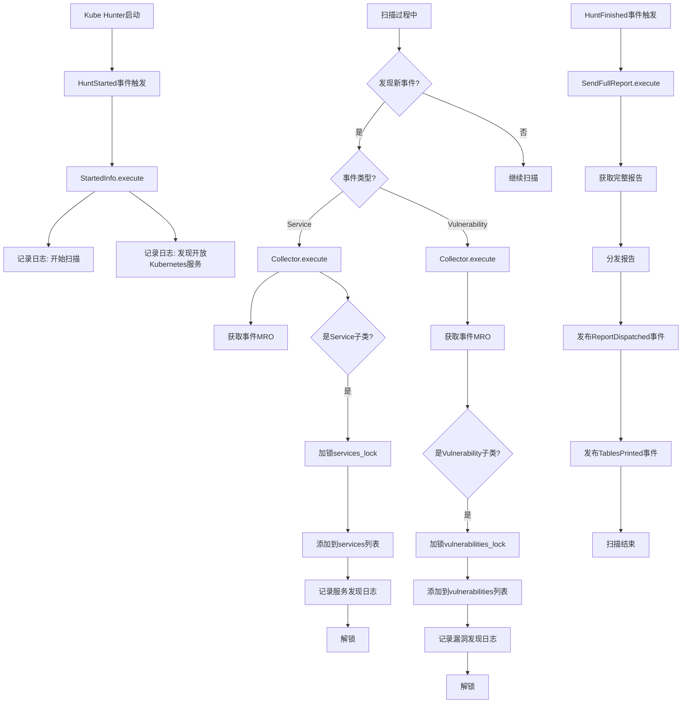
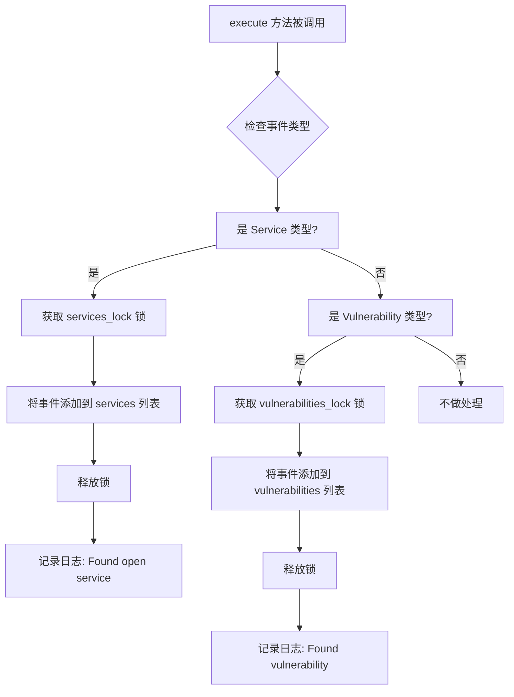
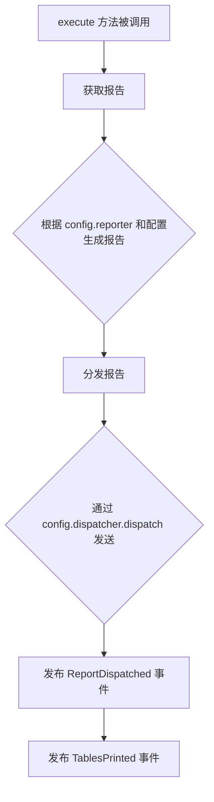
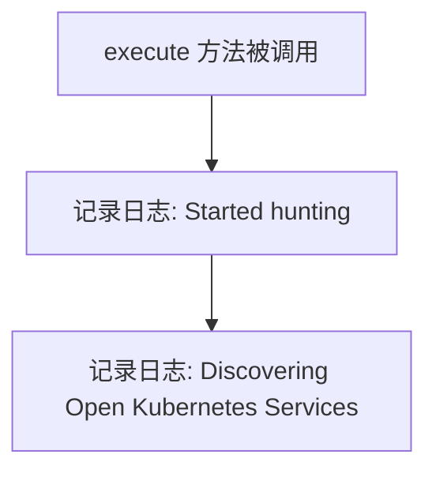
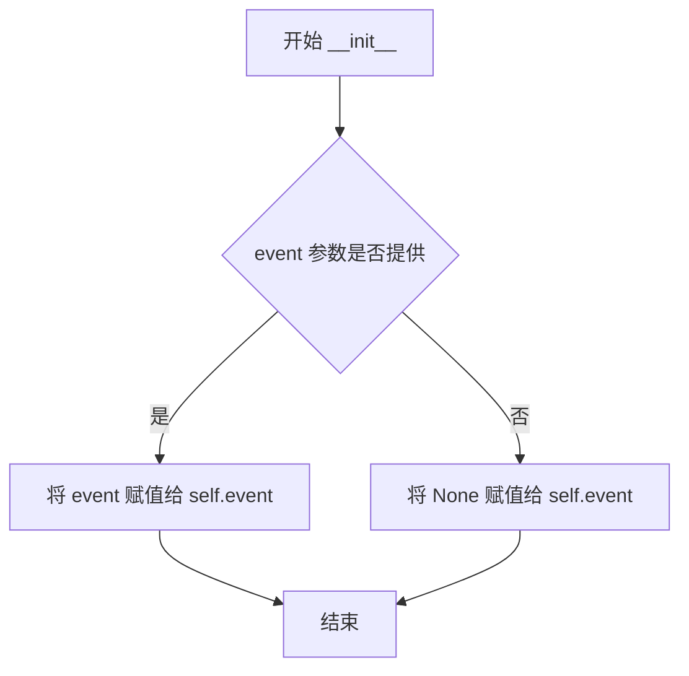
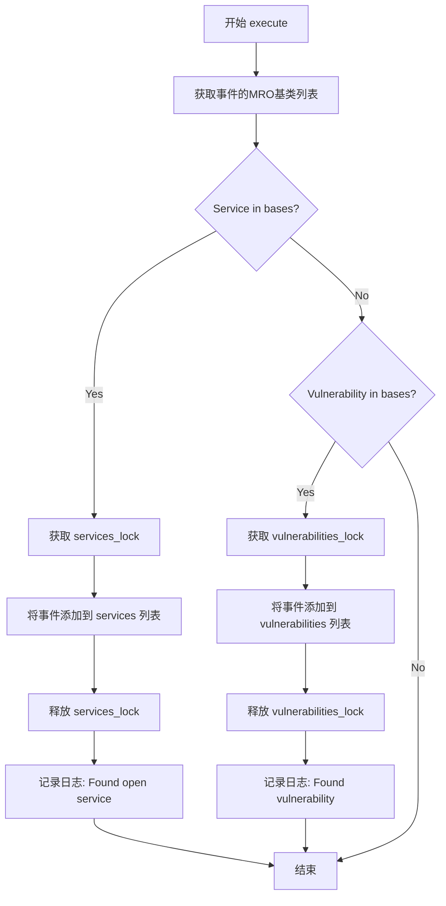
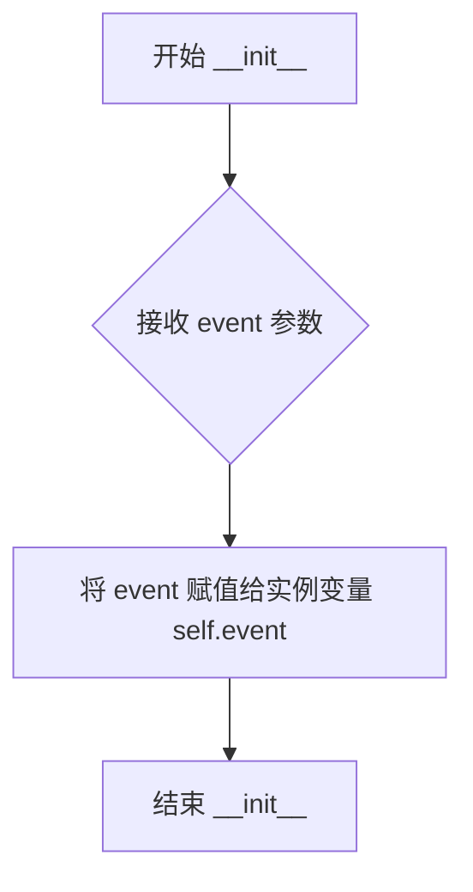
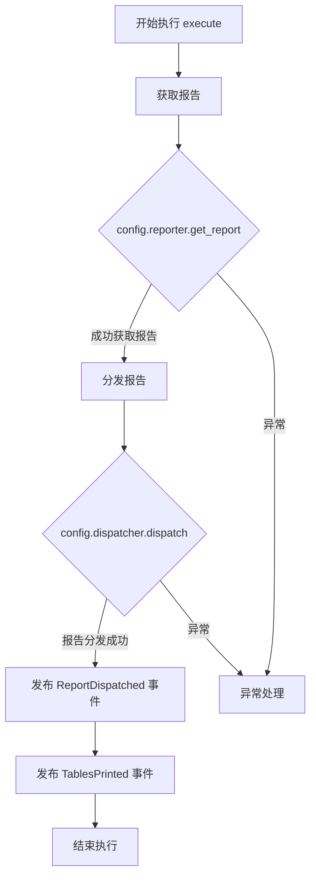
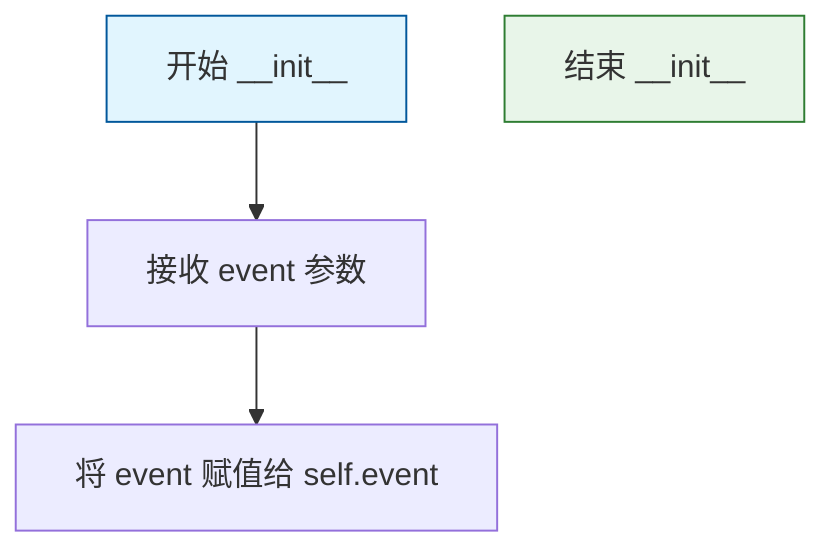
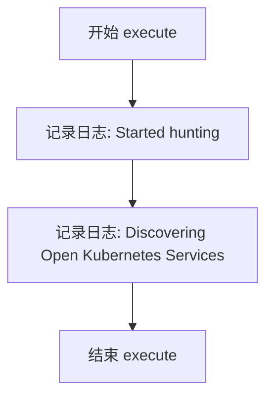

# `kubehunter\kube_hunter\modules\report\collector.py` 详细设计文档

kube-hunter的核心收集器模块，负责在Kubernetes安全扫描过程中收集发现的服务和漏洞，并通过事件订阅机制在扫描开始时记录日志，在扫描结束时生成并分发完整的安全报告。

## 整体流程



## 类结构

```
Event (抽象基类)
├── TablesPrinted
├── Service
├── Vulnerability
├── HuntStarted
├── HuntFinished
└── ReportDispatched

Event Handler订阅者类
├── Collector (订阅Service, Vulnerability)
├── SendFullReport (订阅HuntFinished)
└── StartedInfo (订阅HuntStarted)
```

## 全局变量及字段


### `services_lock`
    
用于保证services列表线程安全的锁对象

类型：`threading.Lock`
    


### `services`
    
全局列表，存储所有发现的Kubernetes服务

类型：`list`
    


### `vulnerabilities_lock`
    
用于保证vulnerabilities列表线程安全的锁对象

类型：`threading.Lock`
    


### `vulnerabilities`
    
全局列表，存储所有发现的安全漏洞

类型：`list`
    


### `hunters`
    
所有注册的hunter列表

类型：`handler.all_hunters`
    


### `Collector.event`
    
传入的事件对象，用于获取服务或漏洞信息

类型：`Event`
    


### `SendFullReport.event`
    
扫描完成时触发的事件对象

类型：`HuntFinished`
    


### `StartedInfo.event`
    
扫描开始时触发的事件对象

类型：`HuntStarted`
    
    

## 全局函数及方法


根据代码分析，我将为您生成各个类和方法的设计文档。

### Collector

Collector 是一个事件收集器类，负责订阅并收集 Kubernetes 服务和漏洞事件。它通过装饰器模式监听 Service 和 Vulnerability 事件，将发现的服务和漏洞分别存储到全局列表中。

参数：

- `event`：Event 类型，触发的事件对象，包含服务或漏洞的详细信息

返回值：`None`，该方法执行副作用（写入全局列表），不返回数据

#### 流程图



#### 带注释源码

```python
@handler.subscribe(Service)
@handler.subscribe(Vulnerability)
class Collector(object):
    """事件收集器，用于收集 Service 和 Vulnerability 事件"""
    
    def __init__(self, event=None):
        """
        初始化收集器
        
        Args:
            event: 触发的事件对象，可以是 Service 或 Vulnerability 类型
        """
        self.event = event

    def execute(self):
        """执行收集逻辑，根据事件类型将事件添加到对应列表"""
        global services
        global vulnerabilities
        # 获取事件类的 MRO（方法解析顺序）
        bases = self.event.__class__.__mro__
        
        if Service in bases:
            # 如果是 Service 类型事件
            with services_lock:  # 获取锁保证线程安全
                services.append(self.event)  # 添加到服务列表
            logger.info(f'Found open service "{self.event.get_name()}" at {self.event.location()}')
        elif Vulnerability in bases:
            # 如果是 Vulnerability 类型事件
            with vulnerabilities_lock:  # 获取锁保证线程安全
                vulnerabilities.append(self.event)  # 添加到漏洞列表
            logger.info(f'Found vulnerability "{self.event.get_name()}" in {self.event.location()}')
```

---

### SendFullReport

SendFullReport 是一个报告发送类，订阅 HuntFinished 事件。当狩猎结束时，它会生成完整的报告并通过调度器分发，同时发布额外的事件通知。

参数：

- `event`：HuntFinished 类型，狩猎结束时触发的事件对象

返回值：`None`，该方法执行副作用（发送报告），不返回数据

#### 流程图



#### 带注释源码

```python
@handler.subscribe(HuntFinished)
class SendFullReport(object):
    """报告发送器，在狩猎结束时生成并发送完整报告"""
    
    def __init__(self, event):
        """
        初始化报告发送器
        
        Args:
            event: HuntFinished 事件对象，表示狩猎过程已完成
        """
        self.event = event

    def execute(self):
        """执行报告生成和发送逻辑"""
        # 根据配置获取报告生成器，传入统计信息和映射配置
        report = config.reporter.get_report(
            statistics=config.statistics, 
            mapping=config.mapping
        )
        # 通过调度器分发报告
        config.dispatcher.dispatch(report)
        # 发布报告已发送的事件
        handler.publish_event(ReportDispatched())
        # 发布表格已打印的事件
        handler.publish_event(TablesPrinted())
```

---

### StartedInfo

StartedInfo 是一个启动信息记录类，订阅 HuntStarted 事件。当狩猎开始时，它会记录启动日志并通知用户正在发现开放的 Kubernetes 服务。

参数：

- `event`：HuntStarted 类型，狩猎开始时触发的事件对象

返回值：`None`，该方法仅执行日志记录，不返回数据

#### 流程图



#### 带注释源码

```python
@handler.subscribe(HuntStarted)
class StartedInfo(object):
    """启动信息记录器，在狩猎开始时记录日志信息"""
    
    def __init__(self, event):
        """
        初始化启动信息记录器
        
        Args:
            event: HuntStarted 事件对象，表示狩猎过程刚开始
        """
        self.event = event

    def execute(self):
        """执行日志记录逻辑"""
        logger.info("Started hunting")  # 记录狩猎开始日志
        logger.info("Discovering Open Kubernetes Services")  # 记录服务发现日志
```

---

### 全局变量

| 变量名称 | 类型 | 描述 |
|---------|------|------|
| `services_lock` | threading.Lock | 用于保护 services 列表的线程锁，确保并发安全 |
| `services` | list | 存储发现的 Kubernetes 服务事件 |
| `vulnerabilities_lock` | threading.Lock | 用于保护 vulnerabilities 列表的线程锁 |
| `vulnerabilities` | list | 存储发现的漏洞事件 |
| `hunters` | 未知 | 从 handler 获取的所有猎人（可能用于批量执行） |

---

### 关键组件信息

| 组件名称 | 描述 |
|---------|------|
| `handler` | 事件处理器，提供事件订阅（subscribe）和发布（publish_event）功能 |
| `config` | 全局配置对象，包含 reporter、dispatcher、statistics、mapping 等配置项 |
| `Event` | 事件基类，包含事件类型定义（Service、Vulnerability、HuntFinished 等） |

---

### 潜在技术债务与优化空间

1. **全局状态管理**：使用全局变量 `services` 和 `vulnerabilities` 列表，缺乏封装性，建议封装为类属性或使用单例模式
2. **线程锁粒度**：锁的作用域可以更细化，目前整个列表操作都在锁内，可考虑更细粒度的锁
3. **错误处理缺失**：execute 方法中没有异常处理机制，网络异常或数据异常可能导致程序中断
4. **硬编码日志**：日志信息硬编码在类中，建议提取为配置或常量
5. **类型提示不足**：部分参数和返回值缺少类型注解，影响代码可维护性

---

### 其它设计说明

**设计模式**：装饰器模式用于事件订阅，通过 `@handler.subscribe(EventType)` 装饰器将类注册为特定事件的监听器

**线程安全**：使用 `threading.Lock` 保护全局列表的并发访问，防止数据竞争

**事件驱动架构**：采用发布-订阅模式，组件之间通过事件进行解耦通信


### Collector.__init__

构造函数，初始化 Collector 实例，接收并存储事件对象。

参数：
- `event`：任意类型，传入的事件对象，默认为 None，用于后续execute方法中处理Service或Vulnerability事件

返回值：`None`，该方法为构造函数，不返回任何值

#### 流程图



#### 带注释源码

```python
def __init__(self, event=None):
    # 构造函数，初始化 Collector 实例
    # 参数 event: 传入的事件对象，默认为 None
    # 该事件对象将在 execute 方法中被处理，用于判断是 Service 还是 Vulnerability 事件
    self.event = event
    # 将传入的事件对象存储为实例变量，供后续方法使用
```


### `Collector.execute()`

该方法是kube-hunter框架中的核心数据收集方法，通过订阅Service和Vulnerability事件，将发现的服务或漏洞添加到全局列表中，并输出相应的日志信息。方法内部使用线程锁保证在多线程环境下的线程安全性。

参数：

- `self`：`Collector`，当前Collector类的实例，隐含参数，用于访问实例属性和全局状态

返回值：`None`，该方法没有返回值，仅执行数据收集和日志记录操作

#### 流程图



#### 带注释源码

```python
def execute(self):
    """function is called only when collecting data"""
    # 声明需要访问全局变量services和vulnerabilities
    global services
    global vulnerabilities
    
    # 获取事件类的MRO（方法解析顺序），用于判断事件类型
    # MRO包含了类的所有基类，可以判断事件是Service还是Vulnerability的实例
    bases = self.event.__class__.__mro__
    
    # 判断事件类型是否为Service或Service的子类
    if Service in bases:
        # 使用线程锁确保在多线程环境下的线程安全
        # 防止多个线程同时修改services列表导致数据不一致
        with services_lock:
            services.append(self.event)
        # 记录发现的服务信息日志
        logger.info(f'Found open service "{self.event.get_name()}" at {self.event.location()}')
    
    # 判断事件类型是否为Vulnerability或Vulnerability的子类
    elif Vulnerability in bases:
        # 使用线程锁确保在多线程环境下的线程安全
        with vulnerabilities_lock:
            vulnerabilities.append(self.event)
        # 记录发现的漏洞信息日志
        logger.info(f'Found vulnerability "{self.event.get_name()}" in {self.event.location()}')
```


### `SendFullReport.__init__`

构造函数，初始化事件对象，用于处理狩猎完成事件并准备生成完整报告。

参数：

- `event`：`HuntFinished`，表示狩猎完成事件对象，包含狩猎结果统计信息

返回值：`None`，该方法为构造函数，不返回任何值

#### 流程图



#### 带注释源码

```python
def __init__(self, event):
    """
    构造函数，初始化 SendFullReport 处理器
    
    参数:
        event: HuntFinished 类型的事件对象，表示狩猎已完成的信号
               包含本次狩猎的统计信息和结果数据
    """
    # 将传入的事件对象存储为实例变量，供 execute 方法使用
    self.event = event
```


### `SendFullReport.execute()`

该方法是kube-hunter的核心报告生成与分发执行器，在狩猎结束时被调用，负责获取检测报告、通过分发器发送报告，并向系统发布报告已分发和表格已打印的事件。

参数：

- `self`：`SendFullReport`，表示当前类的实例对象
- `event`：`HuntFinished`，触发此执行方法的狩猎完成事件，包含狩猎的统计信息和结果

返回值：`None`，该方法执行完成后不返回任何值，主要通过副作用（发布事件）完成工作

#### 流程图



#### 带注释源码

```python
@handler.subscribe(HuntFinished)
class SendFullReport(object):
    def __init__(self, event):
        """
        初始化 SendFullReport 处理器
        :param event: HuntFinished 事件对象，包含狩猎完成时的状态信息
        """
        self.event = event

    def execute(self):
        """
        执行报告生成和分发的核心方法
        该方法在 HuntFinished 事件触发时被调用，负责：
        1. 从配置中获取报告生成器生成完整报告
        2. 通过配置中的分发器将报告发送出去
        3. 向事件系统发布 ReportDispatched 事件，通知其他组件报告已发送
        4. 向事件系统发布 TablesPrinted 事件，通知其他组件表格已打印
        """
        # 使用配置中的报告器生成报告，传入统计信息和映射配置
        report = config.reporter.get_report(statistics=config.statistics, mapping=config.mapping)
        
        # 使用配置中的分发器将生成的报告发送出去
        config.dispatcher.dispatch(report)
        
        # 发布报告已分发的事件，通知订阅该事件的其他处理器
        handler.publish_event(ReportDispatched())
        
        # 发布表格已打印的事件，用于触发后续的表格输出处理
        handler.publish_event(TablesPrinted())
```


### `StartedInfo.__init__(event)`

构造函数，初始化StartedInfo对象，用于处理猎杀开始事件，记录并输出猎杀开始的日志信息。

参数：

- `event`：`HuntStarted`，由事件处理器传入的猎杀开始事件对象，包含猎杀的初始状态信息

返回值：`None`，构造函数不返回任何值，仅初始化实例属性

#### 流程图



#### 带注释源码

```python
@handler.subscribe(HuntStarted)
class StartedInfo(object):
    def __init__(self, event):
        # 参数 event: HuntStarted 类型的事件对象
        # 该事件在猎杀开始时由事件处理器发布
        # 包含猎杀的初始上下文信息
        self.event = event  # 将传入的事件保存为实例属性，供 execute 方法使用
```


### `StartedInfo.execute()`

记录扫描开始的日志信息，当收到 HuntStarted 事件时触发执行，输出开始狩猎和服务发现的日志信息。

参数：

- `self`：无（Python 类方法隐含的实例参数），当前 StartedInfo 类的实例对象

返回值：`None`，无返回值（仅执行日志记录操作）

#### 流程图



#### 带注释源码

```python
@handler.subscribe(HuntStarted)
class StartedInfo(object):
    def __init__(self, event):
        """初始化方法，接收 HuntStarted 事件对象"""
        self.event = event

    def execute(self):
        """执行方法，记录扫描开始的日志信息"""
        # 记录开始狩猎的日志
        logger.info("Started hunting")
        # 记录开始发现 Kubernetes 服务的日志
        logger.info("Discovering Open Kubernetes Services")
```

## 关键组件


### Collector

收集器类，订阅Service和Vulnerability事件，使用线程安全的锁机制将发现的服务和漏洞分别存储到全局列表中，并记录日志。

### SendFullReport

报告发送器类，订阅HuntFinished事件，在扫描结束时生成完整报告并通过调度器分发，同时发布ReportDispatched和TablesPrinted事件。

### StartedInfo

启动信息记录器类，订阅HuntStarted事件，在扫描开始时记录日志信息。

### TablesPrinted

事件标记类，继承自Event，用于标记表格打印阶段的事件。

### services_lock 和 vulnerabilities_lock

线程锁对象，用于保证对services和vulnerabilities列表的线程安全访问。

### services 和 vulnerabilities

全局列表，分别存储扫描过程中发现的服务事件和漏洞事件。

### hunter

从handler获取的所有 hunters 列表，用于执行扫描任务。


## 问题及建议


### 已知问题

-   **全局变量管理**：使用全局变量`services`和`vulnerabilities`存储数据，导致状态管理混乱，难以进行单元测试和并发控制
-   **锁的细粒度控制**：使用两个独立的锁`services_lock`和`vulnerabilities_lock`，但在遍历或批量操作时无法保证一致性
-   **未使用的实例变量**：Collector类中`self.event`在`execute`方法内未被使用，参数设计冗余
-   **空事件类**：`TablesPrinted`类仅继承Event但无任何属性或逻辑，职责不明确
-   **缺少异常处理**：对`config.reporter.get_report()`和`config.dispatcher.dispatch()`的调用缺乏try-except保护
-   **日志重复逻辑**：Service和Vulnerability的日志记录代码结构相似，未提取为通用方法
-   **类型注解缺失**：所有方法均无类型注解，降低代码可读性和IDE支持

### 优化建议

-   **引入状态管理类**：将`services`和`vulnerabilities`封装为类或使用数据类，避免全局状态
-   **使用线程安全集合**：考虑使用`queue.Queue`或`collections.deque`配合`threading.RLock`实现更安全的并发访问
-   **简化Collector逻辑**：将`self.event`作为方法参数传递而非实例变量，或重构为纯函数
-   **丰富TablesPrinted事件**：添加必要的属性或移除该类，直接复用现有事件类型
-   **添加异常捕获**：在`SendFullReport.execute()`中添加异常处理，保证程序稳定性
-   **提取公共方法**：将日志记录逻辑抽取为装饰器或工具函数
-   **补充类型注解**：为所有函数参数和返回值添加类型提示，提升代码质量

## 其它


### 设计目标与约束

该模块的核心设计目标是作为kube-hunter的事件收集器与报告生成器，负责收集扫描过程中发现的Kubernetes服务和漏洞，并在扫描结束时触发报告生成和分发。约束条件包括：必须使用线程安全的机制来存储发现的服务和漏洞，因为扫描过程可能是并发的；必须遵循事件驱动架构，通过订阅特定事件来触发相应的处理逻辑。

### 错误处理与异常设计

代码中未包含显式的错误处理和异常捕获机制。当前设计假设所有依赖组件（config、handler、reporter、dispatcher）均能正常工作。如果在执行过程中出现异常（例如锁获取失败、报告生成失败、事件发布失败），异常将直接向上传播至调用者。这种设计可能导致扫描过程因单个组件故障而中断，建议增加适当的异常捕获和处理逻辑以提高鲁棒性。

### 数据流与状态机

该模块涉及事件驱动的工作流程，数据流如下：1）当接收到Service事件时，Collector将服务信息添加至全局services列表；2）当接收到Vulnerability事件时，Collector将漏洞信息添加至全局vulnerabilities列表；3）当接收到HuntStarted事件时，StartedInfo记录扫描开始日志；4）当接收到HuntFinished事件时，SendFullReport获取统计数据并生成报告，然后分发报告并发布ReportDispatched和TablesPrinted事件。整个流程遵循事件驱动状态机模式，状态转换由事件类型决定。

### 外部依赖与接口契约

该模块依赖以下外部组件：1）kube_hunter.conf.config模块，提供reporter、dispatcher、statistics、mapping配置对象；2）kube_hunter.core.events.handler，提供事件订阅（subscribe）和发布（publish_event）功能；3）kube_hunter.core.events.types模块，定义Event、Service、Vulnerability、HuntFinished、HuntStarted、ReportDispatched等事件类型；4）Python标准库logging和threading模块。所有依赖组件必须正确初始化并注入，接口契约要求事件处理器必须实现execute方法。

### 并发控制机制

代码使用threading.Lock实现并发控制。两个全局锁services_lock和vulnerabilities_lock分别保护services和vulnerabilities列表的并发访问，确保在多线程扫描场景下数据一致性。每次修改列表时必须使用with语句获取锁，并在锁保护范围内完成操作。这种细粒度的锁设计可以减少锁竞争，但需要注意避免死锁和锁超时情况。

### 性能考虑

当前实现使用全局锁保护共享数据结构，在高并发场景下可能成为性能瓶颈。services和vulnerabilities列表采用list数据结构，随着扫描目标增多，append操作的时间复杂度为O(1)。建议如果扫描目标规模非常大，可以考虑使用线程安全队列或更高效的数据结构来提升性能。

### 日志与监控

代码使用Python标准logging模块记录关键操作日志。日志级别为info，记录内容包括：发现的开放服务名称及位置、发现的漏洞名称及位置、扫描开始提示。这些日志可用于监控扫描进度和结果，但缺乏错误级别的日志记录，建议在异常处理部分增加错误日志。

    