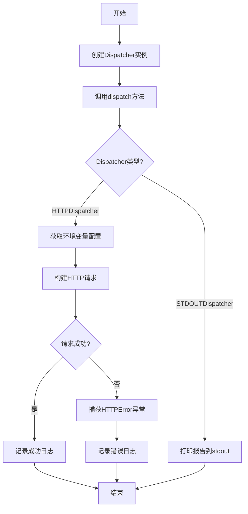
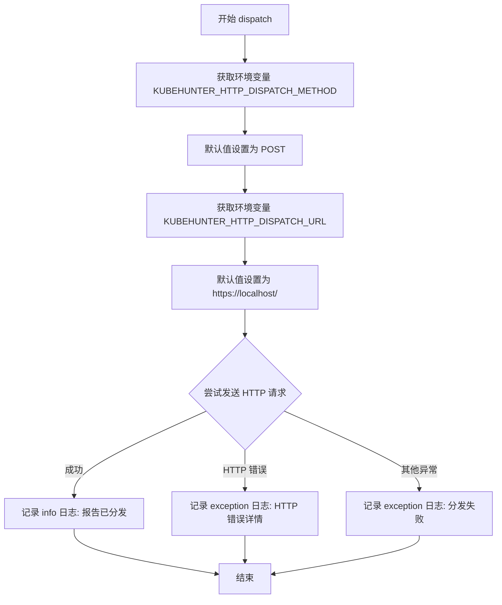

# `kubehunter\kube_hunter\modules\report\dispatchers.py` 详细设计文档

该文件实现了两种报告分发机制：HTTPDispatcher通过HTTP POST/GET请求将报告发送到指定的URL，支持自定义请求方法和端点；STDOUTDispatcher将报告打印到标准输出。两者都使用统一的dispatch接口，便于扩展和替换。

## 整体流程



## 类结构

```
object (基类)
├── HTTPDispatcher
└── STDOUTDispatcher
```

## 全局变量及字段


### `logger`
    
模块级别的日志记录器实例，通过logging.getLogger(__name__)创建，用于记录程序运行时的日志信息。

类型：`logging.Logger`
    


    

## 全局函数及方法


### `HTTPDispatcher.dispatch`

该方法负责将报告通过HTTP请求分发到指定的URL。它从环境变量读取HTTP方法和目标URL，然后使用requests库发送JSON格式的报告，并根据响应状态码记录日志。

参数：

- `report`：任意类型，要分发的报告数据，会被序列化为JSON发送到目标URL

返回值：`None`，该方法没有返回值，仅通过日志记录操作结果

#### 流程图



#### 带注释源码

```
class HTTPDispatcher(object):
    def dispatch(self, report):
        """
        分发报告到指定的 HTTP 端点
        
        参数:
            report: 要发送的报告数据，会被序列化为 JSON
        """
        # 记录调试日志，表示开始通过 HTTP 分发报告
        logger.debug("Dispatching report via HTTP")
        
        # 从环境变量获取 HTTP 方法，默认为 POST
        dispatch_method = os.environ.get("KUBEHUNTER_HTTP_DISPATCH_METHOD", "POST").upper()
        
        # 从环境变量获取目标 URL，默认为本地地址
        dispatch_url = os.environ.get("KUBEHUNTER_HTTP_DISPATCH_URL", "https://localhost/")
        
        try:
            # 使用 requests 库发送 HTTP 请求
            # 参数:
            #   - method: HTTP 方法 (GET, POST, PUT 等)
            #   - url: 目标 URL
            #   - json: 作为 JSON 体的报告数据
            #   - headers: 设置内容类型为 JSON
            r = requests.request(
                dispatch_method, dispatch_url, json=report, headers={"Content-Type": "application/json"},
            )
            
            # 检查响应状态码，如果出错则抛出异常
            r.raise_for_status()
            
            # 记录成功日志，包含目标 URL
            logger.info(f"Report was dispatched to: {dispatch_url}")
            
            # 记录调试日志，包含响应状态码和响应体
            logger.debug(f"Dispatch responded {r.status_code} with: {r.text}")

        # 捕获 HTTP 错误（如 4xx, 5xx 状态码）
        except requests.HTTPError:
            # 记录异常日志，包含 HTTP 方法、URL 和状态码
            logger.exception(f"Failed making HTTP {dispatch_method} to {dispatch_url}, " f"status code {r.status_code}")
        
        # 捕获所有其他异常（如网络连接错误、超时等）
        except Exception:
            # 记录异常日志，包含目标 URL
            logger.exception(f"Could not dispatch report to {dispatch_url}")
```

#### 关键组件信息

- **HTTPDispatcher**：负责将报告数据通过HTTP协议分发到远程端点的类
- **STDOUTDispatcher**：另一个分发器实现，将报告打印到标准输出（代码中可见但非本次分析重点）

#### 潜在技术债务与优化空间

1. **缺少超时控制**：HTTP请求没有设置超时时间，可能导致请求无限期等待
2. **重试机制缺失**：请求失败时没有重试逻辑
3. **环境变量无验证**：URL和HTTP方法没有验证格式有效性
4. **响应处理简单**：仅记录响应文本，没有对响应体进行进一步处理
5. **日志泄露风险**：异常日志可能包含敏感信息（如URL中的凭证）

#### 其他项目

- **设计目标**：提供一个可配置的HTTP报告分发机制，支持自定义HTTP方法和目标URL
- **约束**：依赖外部环境变量配置，依赖`requests`库
- **错误处理**：通过try-except捕获`requests.HTTPError`和其他通用异常，使用`logger.exception`记录完整堆栈信息
- **外部依赖**：`requests`库用于HTTP请求，`os`库用于读取环境变量，`logging`用于日志记录


### `STDOUTDispatcher.dispatch`

该方法将报告内容输出到标准输出（stdout），是 KubeHunter 报告分发器的简单实现，用于在不需要网络传输的场景下直接将报告打印到控制台。

参数：

- `report`：`Any`，要分发的报告数据，通常为字典或其他可序列化的数据结构

返回值：`None`，该方法没有返回值

#### 流程图

```mermaid
flowchart TD
    A[开始 dispatch] --> B[记录调试日志<br/>'Dispatching report via stdout']
    B --> C[打印报告到标准输出<br/>print(report)]
    C --> D[结束]
```

#### 带注释源码

```python
class STDOUTDispatcher(object):
    def dispatch(self, report):
        """
        将报告打印到标准输出
        
        参数:
            report: 要分发的报告数据，通常是字典类型
        """
        # 记录调试日志，表示即将通过 stdout 分发报告
        logger.debug("Dispatching report via stdout")
        
        # 将报告内容打印到标准输出
        print(report)
```

## 关键组件


### HTTPDispatcher

负责通过HTTP请求将报告分发到指定的URL，支持通过环境变量配置请求方法和目标地址，并包含完善的错误处理机制。

### STDOUTDispatcher

负责将报告内容直接打印到标准输出，用于调试或开发环境下的报告查看。

### 环境变量配置模块

提供对HTTP分发方法和URL的灵活配置，通过KUBEHUNTER_HTTP_DISPATCH_METHOD和KUBEHUNTER_HTTP_DISPATCH_URL环境变量控制分发行为。

### 日志记录模块

基于Python logging模块的日志基础设施，用于记录分发的调试信息、成功状态和错误异常。


## 问题及建议


### 已知问题

-   **变量未定义风险**：在HTTPDispatcher的异常处理中，如果`requests.request`抛出网络错误等异常，`r`变量可能未定义，导致在`except requests.HTTPError`块中引用`r.status_code`时引发`NameError`。
-   **缺少请求超时**：使用`requests.request`时未设置`timeout`参数，可能导致请求无限期等待，尤其在网络问题或远程服务无响应时。
-   **异常捕获过于宽泛**：`except Exception`会捕获所有异常，可能隐藏真正的错误类型，且`except requests.HTTPError`在`r`未定义时无法正确处理。
-   **日志泄露风险**：`logger.debug`中打印了完整的响应内容（`r.text`），可能包含敏感信息；URL和环境变量也可能通过日志泄露。
-   **缺少类型提示**：代码没有使用类型注解，降低了可读性和IDE支持。
-   **配置硬编码**：默认URL（`https://localhost/`）和HTTP方法（`POST`）是硬编码的，可能不适合不同环境，且环境变量键名较长不易维护。
-   **STDOUTDispatcher功能单一**：仅使用`print`直接输出，无法格式化（如JSON），且无法控制输出目标。
-   **无重试机制**：HTTP请求失败时没有重试逻辑，对于临时网络故障缺乏容错性。
-   **全局logger配置**：模块级`logger`可能未配置处理器，导致日志无法输出或输出到未知位置。

### 优化建议

-   在HTTPDispatcher中使用`finally`块或提前初始化`r = None`，并在异常处理中检查`r`是否定义后再访问其属性。
-   为`requests.request`添加`timeout`参数（如`timeout=10`），避免无限等待。
-   区分异常类型，分别捕获`requests.RequestException`（包含网络错误）和`requests.HTTPError`（状态码错误），并提供更详细的错误信息。
-   审查日志内容，避免在生产环境记录敏感数据；考虑使用日志脱敏或设置日志级别过滤。
-   添加类型注解（使用`typing`模块），如`def dispatch(self, report: dict) -> None`，明确参数和返回值类型。
-   将配置（如URL、超时、重试）提取到配置类或环境变量中，使用配置管理工具（如`python-dotenv`）集中管理。
-   改进STDOUTDispatcher，支持JSON格式化输出（如`json.dumps(report, indent=2)`），并允许指定输出流（如`sys.stdout`）。
-   实现重试机制（如使用`tenacity`库或自定义重试逻辑），或在文档中说明重试由上层调用者处理。
-   确保全局`logger`配置正确，例如在模块开头设置`logging.basicConfig()`或确保上层应用配置了日志处理器。
-   添加单元测试，覆盖成功、失败、网络异常等场景，并验证日志输出。
-   考虑使用`__all__`导出公共接口，并添加文档字符串（docstring）说明类和方法用途。


## 其它


### 设计目标与约束

本模块的设计目标是提供一种可扩展的报告分发机制，支持多种输出方式（HTTP、STDOUT），通过环境变量实现零配置部署。约束条件包括：必须保持轻量级依赖，仅依赖 requests 和标准库；HTTP 分发器必须支持常见的 HTTP 方法（GET、POST 等）；所有配置必须通过环境变量注入，不支持配置文件。

### 错误处理与异常设计

异常处理采用分层捕获策略：HTTPDispatcher 的 dispatch 方法捕获 requests.HTTPError 用于处理 HTTP 4xx/5xx 错误，捕获通用 Exception 处理网络超时、连接失败等底层异常。异常发生时记录详细日志（包括状态码、响应体），但不中断程序执行。STDOUTDispatcher 不进行异常捕获，依赖 Python 解释器默认行为。建议未来增加自定义异常类（如 DispatchError）以支持更精细的错误分类和错误码定义。

### 数据流与状态机

数据流从调用方传入 report 对象开始，dispatcher 根据配置或类型选择对应的分发策略。HTTPDispatcher 的状态流转：获取环境变量 → 构建请求参数 → 发送 HTTP 请求 → 处理响应 → 记录日志。STDOUTDispatcher 状态流转：接收 report → 调用 print 函数 → 输出到标准输出。状态机相对简单，无复杂状态转换。

### 外部依赖与接口契约

外部依赖包括：requests 库（HTTP 请求）、logging 模块（日志记录）、os 模块（环境变量读取）。接口契约方面：所有 Dispatcher 实现类必须提供 dispatch(report) 方法，report 参数应为可序列化为 JSON 的字典或对象，方法无返回值要求。HTTPDispatcher 依赖环境变量 KUBEHUNTER_HTTP_DISPATCH_METHOD（默认 POST）和 KUBEHUNTER_HTTP_DISPATCH_URL（默认 https://localhost/），若环境变量未设置或格式错误可能导致异常。

### 安全性考虑

当前版本存在安全风险：默认使用 HTTP 发送敏感报告数据；未实现证书验证跳过逻辑（requests 默认验证）；日志可能记录敏感信息（报告内容、URL）；无认证机制。建议增加：HTTPS 强制使用证书验证；支持 API Key/Bearer Token 认证；敏感字段脱敏处理；可选的数据加密传输。

### 性能考虑

当前实现为同步阻塞模式，HTTP 请求会阻塞调用方。潜在性能瓶颈：网络延迟（无超时控制）、大报告体传输。建议增加：requests 请求超时配置（建议 30 秒）；连接池复用（使用 requests.Session）；异步分发支持（asyncio）；报告压缩（gzip）。

### 配置管理

配置完全依赖环境变量：KUBEHUNTER_HTTP_DISPATCH_METHOD（HTTP 方法）、KUBEHUNTER_HTTP_DISPATCH_URL（目标 URL）。无默认值校验机制、无配置变更监听、无配置热更新能力。建议增加：配置合法性校验（URL 格式、HTTP 方法白名单）；配置变更回调；支持 YAML/JSON 配置文件作为环境变量的补充。

### 可测试性

当前代码可测试性较差：直接依赖 os.environ 和 requests 库，单元测试需要进行 monkeypatch。建议增加：依赖注入模式（将 HTTP 客户端作为构造函数参数）；抽象基类定义 Dispatcher 接口；提供 MockDispatcher 用于测试。测试覆盖建议：各种 HTTP 方法测试、超时测试、异常场景测试、STDOUT 输出测试。

### 部署架构

该模块作为 kube-hunter 项目的报告分发组件部署，通常与主程序运行在同一容器/进程中。HTTPDispatcher 适合生产环境将报告发送至集中日志系统或 SIEM；STDOUTDispatcher 适合开发调试和日志收集场景。建议部署时使用 Kubernetes Secret 管理敏感 URL 和认证信息。

### 监控与日志

日志采用 Python logging 模块，按 __name__ 创建 logger。日志级别包含：DEBUG（请求参数、响应详情）、INFO（成功分发通知）、ERROR/EXCEPTION（失败详情）。当前未集成指标收集（Prometheus 等），建议增加：分发成功/失败计数器；分发耗时 histogram；告警机制（连续失败 N 次）。

### 超时和重试策略

当前实现无超时设置和无重试机制。requests.request 默认无超时，会无限期等待响应。建议增加：请求超时配置（建议 connect timeout 5s，read timeout 30s）；自动重试机制（建议使用 urllib3 retry 或自定义实现，针对 ConnectionError、Timeout 异常重试 3 次）；指数退避策略。

### 输入验证

dispatch 方法的 report 参数缺乏验证：未校验类型、未校验必填字段、未校验数据格式。可能导致 requests 库抛出异常或生成无效请求体。建议增加：report 类型校验（需为 dict）；必填字段校验（如 report 需包含特定键）；数据大小限制（防止过大报告）；JSON 序列化预校验。


    