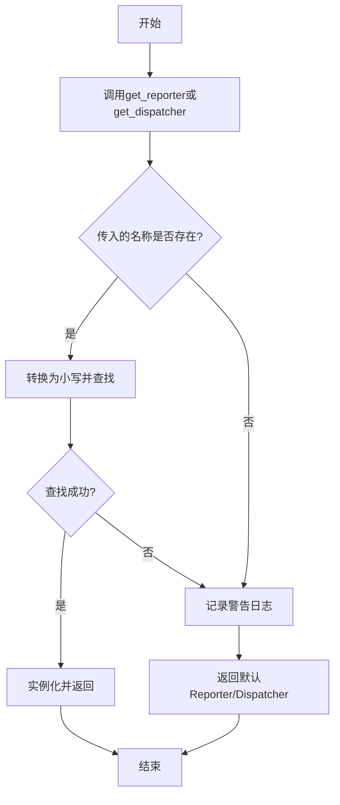
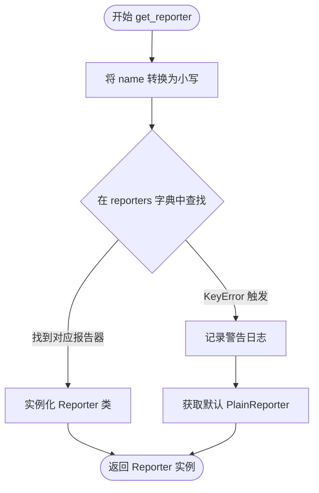

# `kubehunter\kube_hunter\modules\report\factory.py` 详细设计文档

该模块是kube-hunter报告系统的核心入口，提供报告器和分发器的工厂方法，支持根据名称动态获取Reporter和Dispatcher实例，实现报告格式（YAML/JSON/Plain）与输出方式（标准输出/HTTP）的解耦。

## 整体流程



## 类结构

```
Reporter (报告器接口)
├── JSONReporter (JSON格式报告)
├── YAMLReporter (YAML格式报告)
└── PlainReporter (纯文本格式报告)

Dispatcher (分发器接口)
├── STDOUTDispatcher (标准输出分发)
└── HTTPDispatcher (HTTP请求分发)
```

## 全局变量及字段


### `logger`
    
模块级日志记录器，用于记录模块运行过程中的警告和信息

类型：`logging.Logger`
    


### `DEFAULT_REPORTER`
    
默认报告器类型，当未指定报告器时使用，值为'plain'

类型：`str`
    


### `reporters`
    
报告器类型映射字典，键为'yaml'/'json'/'plain'，值为对应Reporter类，用于根据名称获取报告器

类型：`dict`
    


### `DEFAULT_DISPATCHER`
    
默认分发器类型，当未指定分发器时使用，值为'stdout'

类型：`str`
    


### `dispatchers`
    
分发器类型映射字典，键为'stdout'/'http'，值为对应Dispatcher类，用于根据名称获取分发器

类型：`dict`
    


    

## 全局函数及方法


### `get_reporter`

根据传入的名称获取对应的报告器（Reporter）实例，如果名称无效或不存在，则记录警告日志并返回默认的 PlainReporter 实例。

参数：

- `name`：`str`，报告器名称，用于从 reporters 字典中查找对应的报告器类

返回值：`Reporter`，返回具体类型的报告器实例（YAMLReporter、JSONReporter 或 PlainReporter）

#### 流程图



#### 带注释源码

```python
def get_reporter(name):
    """
    根据名称获取报告器实例
    
    参数:
        name: 报告器名称字符串
        
    返回:
        报告器实例，如果名称无效则返回默认的 PlainReporter
    """
    try:
        # 尝试将传入的名称转换为小写，并在 reporters 字典中查找对应的 Reporter 类
        # reporters 字典映射: {"yaml": YAMLReporter, "json": JSONReporter, "plain": PlainReporter}
        return reporters[name.lower()]()
    except KeyError:
        # 如果名称不在 reporters 字典中，捕获 KeyError 异常
        # 记录警告日志，提示用户使用了无效的报告器名称
        logger.warning(f'Unknown reporter "{name}", using f{DEFAULT_REPORTER}')
        # 返回默认的 PlainReporter 实例
        return reporters[DEFAULT_REPORTER]()
```


### `get_dispatcher`

根据传入的分发器名称获取对应的分发器实例，如果名称无效或不存在，则记录警告日志并返回默认的 STDOUTDispatcher 实例。

参数：

- `name`：`str`，要获取的分发器名称

返回值：`Dispatcher`，返回对应的分发器实例，若名称无效则返回默认的 STDOUTDispatcher 实例

#### 流程图

```mermaid
flowchart TD
    A[开始 get_dispatcher] --> B[将 name 转换为小写]
    B --> C{在 dispatchers 字典中查找}
    C -->|找到| D[调用 dispatchers[name.lower()] 构造函数]
    D --> E[返回分发器实例]
    C -->|未找到| F[记录警告日志]
    F --> G[返回默认的 dispatchers[DEFAULT_DISPATCHER] 实例]
    E --> H[结束]
    G --> H
```

#### 带注释源码

```python
def get_dispatcher(name):
    """
    根据名称获取对应的分发器实例。
    
    参数:
        name: 分发器名称字符串
        
    返回:
        对应的分发器实例，如果名称无效则返回默认的 STDOUTDispatcher
    """
    try:
        # 尝试在 dispatchers 字典中查找对应名称的分发器
        # 先将名称转换为小写以支持大小写不敏感的查找
        return dispatchers[name.lower()]()
    except KeyError:
        # 如果名称不存在于字典中，记录警告日志
        logger.warning(f'Unknown dispatcher "{name}", using {DEFAULT_DISPATCHER}')
        # 返回默认的 STDOUTDispatcher 实例
        return dispatchers[DEFAULT_DISPATCHER]()
```

#### 关键组件信息

| 名称 | 描述 |
|------|------|
| `dispatchers` | 全局字典，存储可用的分发器类，键为名称，值为对应的类 |
| `DEFAULT_DISPATCHER` | 全局常量，默认分发器名称 `"stdout"` |
| `STDOUTDispatcher` | 标准输出分发器类，当获取不到指定分发器时返回的默认实现 |

#### 潜在的技术债务或优化空间

1. **异常处理过于宽泛**：使用 `except KeyError` 捕获所有 KeyError 异常，如果后续代码在 `dispatchers[name.lower()]()` 调用时出现其他类型的异常（如构造函数抛出的异常），也会被误捕获并返回默认分发器，可能掩盖真正的错误。
2. **日志信息不完整**：警告日志中缺少对有效分发器名称的提示，用户可能不知道有哪些可用的分发器选项。
3. **缺少类型提示**：函数签名中缺少返回类型注解（应为 `-> Dispatcher`），不利于静态类型检查和代码阅读。

#### 其它项目

**设计目标与约束**：
- 支持大小写不敏感的分发器名称查找
- 保证系统始终有可用的分发器（默认回退机制）

**错误处理与异常设计**：
- 当传入无效名称时，记录警告日志但不抛出异常，平稳降级到默认分发器
- 使用 `try-except` 块处理字典查找失败的情况

**数据流与状态机**：
- 输入：分发器名称字符串
- 处理：字典查找 + 条件分支
- 输出：具体的分发器实例对象

**外部依赖与接口契约**：
- 依赖 `dispatchers` 全局字典，该字典由模块初始化时填充
- 依赖 `logger` 全局日志对象进行错误记录
- 返回的 Dispatcher 实例需支持统一的接口（如 `dispatch` 方法）

## 关键组件


### 报告器与调度器工厂模块

该模块是 kube-hunter 报告系统的核心组件，提供报告器（Reporter）和调度器（Dispatcher）的动态实例化功能，支持 YAML、JSON、Plain 三种报告格式以及 stdout、http 两种输出方式，通过工厂函数根据名称获取相应实例，并在未知类型时提供降级方案。

### 关键组件

#### 报告器注册表（reporters）

存储报告器类与名称映射的全局字典，用于根据名称动态实例化对应的报告器实现。

#### 调度器注册表（dispatchers）

存储调度器类与名称映射的全局字典，用于根据名称动态实例化对应的调度器实现。

#### get_reporter 函数

工厂函数，根据输入名称返回对应的报告器实例，支持大小写不敏感查找，具备未知报告器的降级处理能力。

#### get_dispatcher 函数

工厂函数，根据输入名称返回对应的调度器实例，支持大小写不敏感查找，具备未知调度器的降级处理能力。

### 技术债务

#### 日志格式字符串错误

第 27 行存在 f-string 语法错误：`f'Unknown reporter "{name}", using f{DEFAULT_REPORTER}'` 中的 `f{DEFAULT_REPORTER}` 多余了一个 'f' 前缀，导致 DEFAULT_REPORTER 变量不会被正确解析为变量值，应修改为 `f'Unknown reporter "{name}", using {DEFAULT_REPORTER}'`。


## 问题及建议


### 已知问题

-   **f-string 语法错误**：`get_reporter` 函数中的日志消息 `f'Unknown reporter "{name}", using f{DEFAULT_REPORTER}'` 包含多余的 `f` 前缀，导致 `f{DEFAULT_REPORTER}` 不会被正确解析为变量值
-   **缺乏空值处理**：当 `name` 参数为 `None` 时，调用 `name.lower()` 会抛出 `AttributeError`
-   **错误处理不一致**：两个函数的日志消息格式不一致，且对于未知配置使用 `warning` 级别可能不够严谨
- **缺少类型注解**：没有为函数参数和返回值添加类型提示，影响代码可读性和 IDE 支持
- **重复代码模式**：`get_reporter` 和 `get_dispatcher` 函数的结构几乎相同，存在代码重复

### 优化建议

-   修复 `get_reporter` 中的 f-string 语法错误，改为 `f'Unknown reporter "{name}", using {DEFAULT_REPORTER}'`
-   为 `get_reporter` 和 `get_dispatcher` 添加空值检查，在 `name` 为 `None` 时使用默认值
-   统一错误处理策略，考虑使用 `error` 级别日志或抛出自定义异常
-   使用 `typing` 模块添加类型注解，如 `def get_reporter(name: str) -> BaseReporter`
-   考虑提取公共逻辑到辅助函数，减少代码重复
-   考虑使用枚举类或常量类替代字符串字典的键值定义，提高类型安全性


## 其它


### 设计目标与约束

该模块的设计目标是提供一个灵活的报告和分发框架，支持多种报告格式（JSON、YAML、Plain）和多种分发方式（标准输出、HTTP），通过统一的工厂函数动态获取Reporter和Dispatcher实例。约束包括：Reporter和Dispatcher必须实现统一的接口规范，名称不区分大小写，默认Reporter为plain，默认Dispatcher为stdout。

### 错误处理与异常设计

代码中采用异常捕获机制处理未知Reporter或Dispatcher名称。当获取不存在的Reporter时，捕获KeyError并记录警告日志，同时返回默认Reporter实例；当获取不存在的Dispatcher时，同样捕获KeyError并返回默认Dispatcher实例。这种设计保证了系统的容错性，避免因配置错误导致程序中断。

### 外部依赖与接口契约

该模块依赖以下外部组件：kube_hunter.modules.report.json.JSONReporter、kube_hunter.modules.report.yaml.YAMLReporter、kube_hunter.modules.report.plain.PlainReporter（报告格式实现）、kube_hunter.modules.report.dispatchers.STDOUTDispatcher、kube_hunter.modules.report.dispatchers.HTTPDispatcher（分发器实现）、logging模块用于日志记录。Reporter和Dispatcher需提供无参构造函数以适配工厂函数模式。

### 安全性考虑

代码本身不直接处理敏感数据，但HTTPDispatcher可能涉及向外部URL发送报告数据，需要确保传输层安全性。Reporter名称和Dispatcher名称通过字符串传递，需对输入进行验证以防止注入攻击。

### 性能考虑

该模块采用字典映射的O(1)查找效率，get_reporter和get_dispatcher函数每次调用都会创建新实例，如果实例创建成本较高，可考虑引入单例模式或实例缓存机制。对于高并发场景，当前实现可能导致频繁的对象创建开销。

### 扩展性设计

代码已具备良好的扩展性，新增Reporter只需在reporters字典中添加映射，新增Dispatcher只需在dispatchers字典中添加映射，无需修改核心逻辑。符合开闭原则，可通过扩展而非修改的方式支持新的报告格式和分发方式。

### 配置管理

DEFAULT_REPORTER和DEFAULT_DISPATCHER定义了系统默认行为，reporters和dispatchers字典集中管理所有可用的Reporter和Dispatcher映射。配置硬编码于模块中，未来可考虑抽取至配置文件或环境变量以提高灵活性。

    