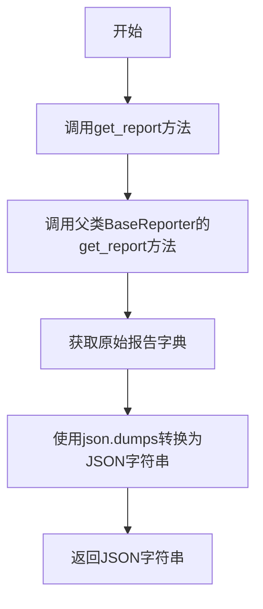
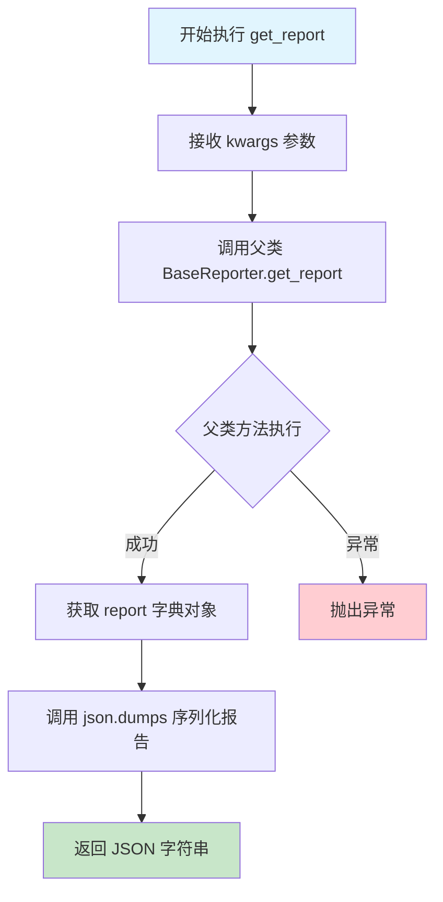

# `kubehunter\kube_hunter\modules\report\json.py` 详细设计文档

JSONReporter是一个报告生成器类，继承自BaseReporter，用于将kube-hunter的安全扫描报告转换为JSON格式输出。

## 整体流程



## 类结构

```
BaseReporter (抽象基类)
└── JSONReporter (JSON报告生成器)
```

## 全局变量及字段


    

## 全局函数及方法


### `JSONReporter.get_report`

该方法继承自 `BaseReporter`，用于获取漏洞探测报告，并以 JSON 字符串格式返回。它首先调用父类的 `get_report` 方法获取原始报告字典，然后使用 `json.dumps` 将其序列化为 JSON 格式字符串。

参数：

- `self`：实例本身（JSONReporter 类实例）
- `**kwargs`：可变关键字参数，类型为字典，用于传递可选的查询参数或过滤条件给父类方法

返回值：`str`，返回 JSON 格式的漏洞报告字符串

#### 流程图



#### 带注释源码

```python
import json
from kube_hunter.modules.report.base import BaseReporter


class JSONReporter(BaseReporter):
    """
    JSON 格式报告生成器
    继承自 BaseReporter，负责将报告转换为 JSON 格式
    """
    
    def get_report(self, **kwargs):
        """
        获取 JSON 格式的漏洞报告
        
        参数:
            **kwargs: 可变关键字参数
                     - 将传递给父类的 get_report 方法
                     - 可用于过滤、排序等报告处理选项
        
        返回:
            str: JSON 格式的报告字符串
                 - 使用 json.dumps 序列化字典为字符串
                 - 默认不进行缩进（compact 格式）
        """
        # 步骤1: 调用父类方法获取原始报告字典
        # BaseReporter.get_report 返回一个包含漏洞信息的字典
        report = super().get_report(**kwargs)
        
        # 步骤2: 使用 json.dumps 将字典序列化为 JSON 字符串
        # 返回 JSON 格式的字符串，可用于 API 响应或文件存储
        return json.dumps(report)
```


### `JSONReporter.get_report`

该方法是 `JSONReporter` 类的实例方法，负责调用父类 `BaseReporter` 的 `get_report` 方法获取原始报告数据，然后将其序列化为 JSON 格式的字符串返回。

**注意**：提供的代码中只展示了 `JSONReporter` 类继承 `BaseReporter` 并覆盖 `get_report` 方法，未包含 `BaseReporter.get_report` 的具体实现。以下信息基于代码中可见的调用关系进行推断。

参数：

- `**kwargs`：可变关键字参数，用于传递额外参数给父类方法

返回值：`str`，返回 JSON 序列化后的报告字符串

#### 流程图

```mermaid
flowchart TD
    A[开始 get_report] --> B[调用 super().get_report 获取报告]
    B --> C[调用 json.dumps 序列化为 JSON]
    C --> D[返回 JSON 字符串]
```

#### 带注释源码

```python
class JSONReporter(BaseReporter):
    def get_report(self, **kwargs):
        # 调用父类 BaseReporter 的 get_report 方法获取原始报告数据（字典或类似结构）
        report = super().get_report(**kwargs)
        # 使用 json.dumps 将报告对象序列化为 JSON 格式的字符串
        return json.dumps(report)
```

## 关键组件


### 一段话描述

JSONReporter 是 kube-hunter 框架中的一个报告生成器类，继承自 BaseReporter，负责将安全扫描报告序列化为 JSON 格式字符串输出。

### 文件的整体运行流程

1. JSONReporter 类实例化时继承 BaseReporter 的属性和方法
2. 调用 get_report 方法时，首先通过 super().get_report(**kwargs) 调用基类方法获取原始报告数据
3. 然后使用 json.dumps() 将报告字典序列化为 JSON 格式字符串并返回

### 类的详细信息

#### JSONReporter 类

- **继承关系**: 继承自 `BaseReporter`
- **类字段**:
  - 无显式类字段定义

- **类方法**:
  - **get_report**
    - 参数名称: `kwargs`
    - 参数类型: `**kwargs` (可变关键字参数)
    - 参数描述: 接收任意关键字参数传递给基类方法
    - 返回值类型: `str`
    - 返回值描述: 返回 JSON 格式的扫描报告字符串
    - mermaid 流程图:
      ```mermaid
      flowchart TD
        A[调用get_report] --> B[super.get_report获取原始报告]
        B --> C[json.dumps序列化报告]
        C --> D[返回JSON字符串]
      ```
    - 带注释源码:
      ```python
      def get_report(self, **kwargs):
          # 调用基类方法获取原始报告数据（字典或对象）
          report = super().get_report(**kwargs)
          # 使用json模块将报告序列化为JSON格式字符串
          return json.dumps(report)
      ```

### 关键组件信息

#### BaseReporter 基类

提供报告生成的基础骨架方法，get_report 方法的基类实现定义了报告数据结构

#### json 模块

Python 标准库模块，用于 Python 数据结构与 JSON 字符串之间的相互转换

#### get_report 方法

核心方法，连接基类报告生成逻辑与 JSON 序列化功能，是 JSONReporter 的主要功能入口

### 潜在的技术债务或优化空间

1. **缺乏错误处理**: json.dumps() 可能抛出异常（如遇到不可序列化的对象），缺少 try-except 包装
2. **配置能力不足**: 缺少对 JSON 序列化参数的控制（如缩进、排序等）
3. **基类依赖强耦合**: 直接依赖 BaseReporter 的内部实现细节
4. **返回值类型不一致**: 基类可能返回多种类型，但假设总是可序列化

### 其它项目

#### 设计目标与约束

- 目标：将安全扫描报告转换为 JSON 格式输出
- 约束：必须继承 BaseReporter 类

#### 错误处理与异常设计

- 当前未实现异常处理机制
- 建议添加：序列化失败时的回退策略、类型转换验证

#### 数据流与状态机

- 数据流：BaseReporter → 原始报告对象 → JSON 序列化 → JSON 字符串输出

#### 外部依赖与接口契约

- 依赖：kube_hunter.modules.report.base.BaseReporter
- 依赖：Python 标准库 json
- 接口：get_report(**kwargs) -> str


## 问题及建议


### 已知问题

-   缺少类型注解（Type Hints），无法静态类型检查，降低代码可维护性
-   缺少文档字符串（Docstring），类的功能和方法的用途不明确
-   没有错误处理机制，如果 `report` 对象包含无法 JSON 序列化的数据，`json.dumps()` 会直接抛出 `TypeError` 异常
-   缺少对父类 `BaseReporter.get_report()` 可能抛出异常的捕获和处理
-   JSON 序列化参数硬编码，不支持自定义（如 `indent`、`sort_keys`、`ensure_ascii` 等）
-   没有日志记录（Logging），无法追踪报告生成过程和调试问题

### 优化建议

-   添加类型注解，明确参数和返回值类型，例如：`def get_report(self, **kwargs) -> str:`
-   添加类和方法级别的文档字符串，描述功能和使用方式
-   添加 `try-except` 异常处理，捕获序列化异常并提供有意义的错误信息
-   考虑添加 JSON 序列化配置参数，增强灵活性，例如：`def get_report(self, **kwargs, indent=None, sort_keys=False):`
-   引入标准日志模块，添加适当的日志记录
-   考虑添加单元测试，覆盖正常流程和异常场景


## 其它


### 设计目标与约束

本模块的核心设计目标是将kube-hunter的安全扫描报告转换为JSON格式输出，便于其他系统进行解析、存储或进一步处理。设计约束包括：必须继承BaseReporter基类以保持 Reporter 体系的一致性；输出格式必须为有效的JSON字符串；转换过程不能丢失原始报告的任何字段信息。

### 错误处理与异常设计

JSONReporter 本身的错误处理主要依赖于 BaseReporter 的 get_report 方法。如果 report 对象包含无法被 JSON 序列化的数据类型（如自定义对象、循环引用等），json.dumps 将抛出 TypeError 或 ValueError。建议在调用处增加 try-except 块捕获 JSON 序列化异常，并提供有意义的错误信息。继承链中任何层级的异常都应该向上传播，由调用方统一处理。

### 数据流与状态机

数据流从外部调用 get_report 方法开始，依次经过：1) 调用父类 BaseReporter.get_report 获取原始报告字典；2) 使用 json.dumps 将字典序列化为 JSON 字符串；3) 返回 JSON 字符串给调用方。状态机相对简单，不涉及复杂的状态转换，主要处于"就绪"和"处理中"两种状态。

### 外部依赖与接口契约

主要外部依赖包括：Python 标准库 json 模块；kube_hunter.modules.report.base.BaseReporter 基类。接口契约方面：get_report 方法接受任意关键字参数 **kwargs，传递给父类方法；返回值必须是 str 类型的 JSON 字符串；方法签名必须与 BaseReporter 保持一致以实现多态。

### 性能考虑

JSON 序列化性能通常不是瓶颈，但在报告数据量极大的场景下，可以考虑使用 orjson 或 ujson 等高性能 JSON 库替代标准库 json。对于超大型报告，可以考虑流式 JSON 生成或分块输出。

### 安全考虑

输出的 JSON 数据可能包含敏感的安全扫描信息（如漏洞详情、集群配置等），需要确保传输和存储过程的安全性。如果报告通过 HTTP API 输出，应考虑添加认证和加密机制。JSON 序列化本身不涉及安全风险，但需防止序列化过程中因对象循环引用导致的无限递归。

### 测试策略

建议编写单元测试验证：1) 正常情况下返回有效的 JSON 字符串；2) 输出的 JSON 可以被正确解析为字典；3) 继承自父类的字段和方法正常工作；4) 异常情况下（如父类返回不支持的类型）的错误处理。测试数据可以使用模拟的 report 字典。

### 版本兼容性

代码使用 Python 3 标准库，兼容性取决于 BaseReporter 基类的接口定义。建议在版本更新时保持 get_report 方法签名不变以确保向后兼容。json.dumps 的默认参数在不同 Python 版本中表现一致。

### 配置管理

JSONReporter 本身不涉及额外的配置项，但可以通过 kwargs 传递配置参数给父类。JSON 输出格式（缩进、排序等）可以通过 json.dumps 的 indent 和 sort_keys 参数控制，建议在基类或配置文件中统一管理。

### 可扩展性设计

当前设计具有良好的可扩展性：可以轻松添加新的 Reporter 子类（如 XMLReporter、YAMLReporter）；可以在子类中重写 get_report 方法添加自定义处理逻辑；可以通过继承扩展报告格式选项。若需支持多种输出格式，可考虑实现 Reporter 工厂类。


    