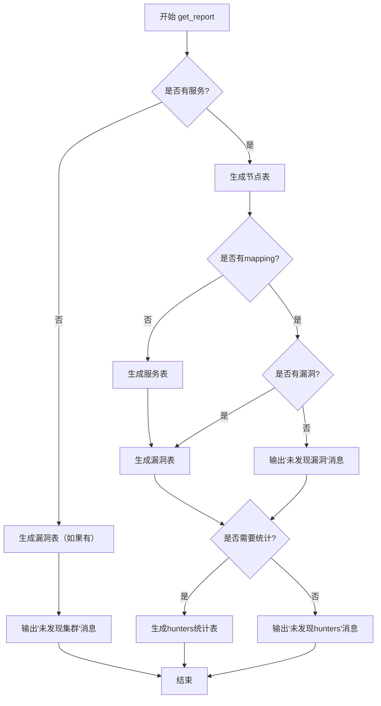
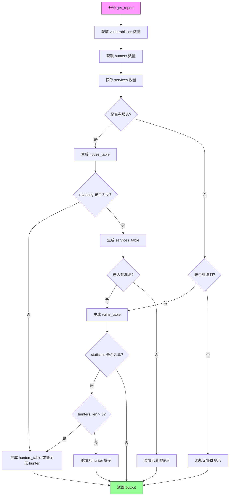
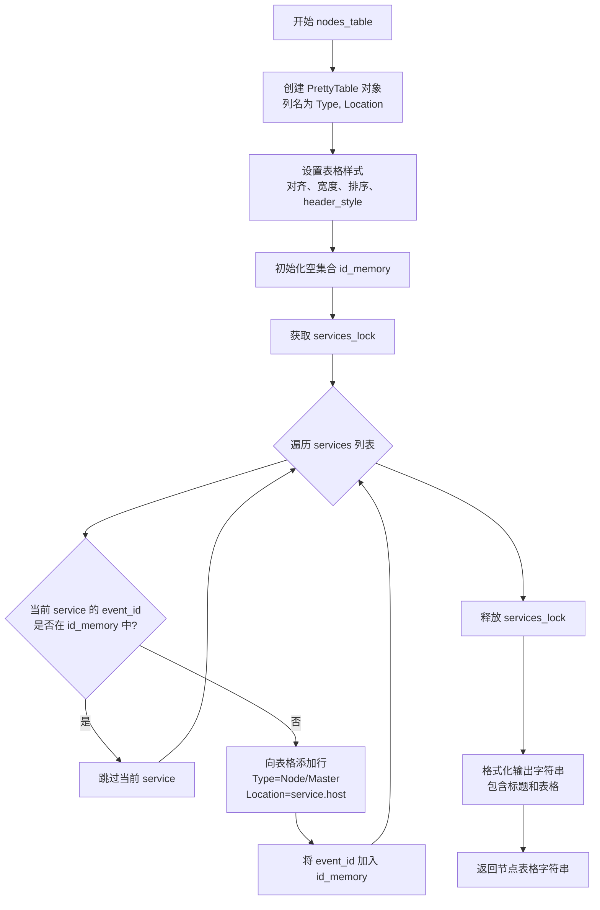
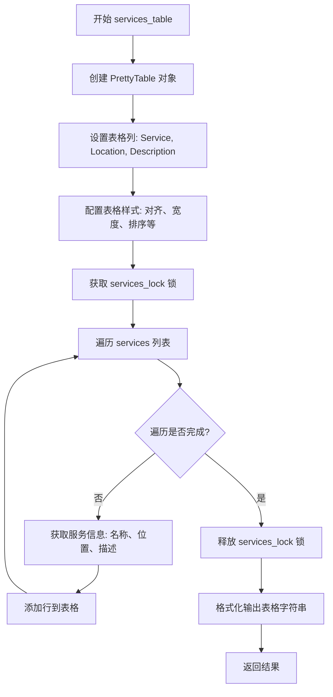
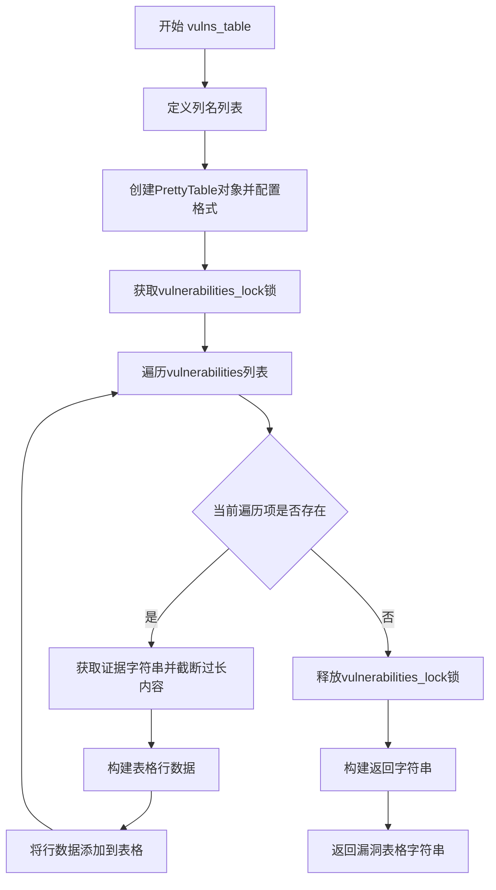
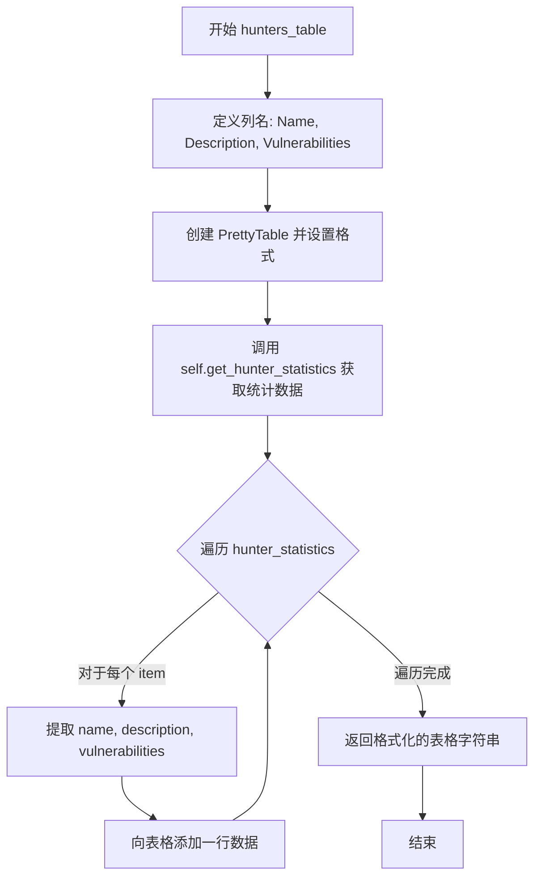
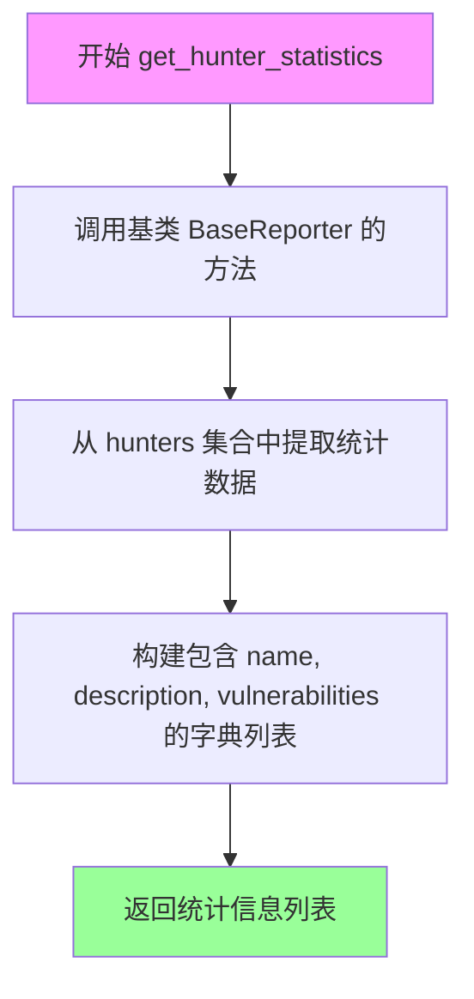

# `kubehunter\kube_hunter\modules\report\plain.py` 详细设计文档

PlainReporter是kube-hunter的报告生成模块，负责将扫描发现的服务、漏洞和hunters统计信息格式化为易读的表格形式输出，支持节点表、服务表、漏洞表和hunter统计表的生成。

## 整体流程



## 类结构

```
BaseReporter (抽象基类)
└── PlainReporter (纯文本报告生成器)
```

## 全局变量及字段


### `EVIDENCE_PREVIEW`
    
Maximum character length for evidence preview in vulnerability table

类型：`int`
    


### `MAX_TABLE_WIDTH`
    
Maximum width for PrettyTable columns

类型：`int`
    


### `KB_LINK`
    
URL link to the kube-hunter knowledge base documentation

类型：`str`
    


### `services`
    
Global list of detected services in the cluster, populated by hunters

类型：`List[Service]`
    


### `vulnerabilities`
    
Global list of discovered vulnerabilities during scanning

类型：`List[Vulnerability]`
    


### `hunters`
    
Global dictionary of registered hunters with their metadata and statistics

类型：`Dict[str, Any]`
    


### `services_lock`
    
Thread lock for synchronizing access to the services list

类型：`threading.Lock`
    


### `vulnerabilities_lock`
    
Thread lock for synchronizing access to the vulnerabilities list

类型：`threading.Lock`
    


    

## 全局函数及方法


### `PlainReporter.get_report`

该方法 `get_report` 是 kube-hunter 项目中 `PlainReporter` 类的核心方法，负责生成纯文本格式的安全检测报告。它根据当前收集的服务、漏洞和 hunter 统计数据，动态构建包含节点信息、服务列表、漏洞详情和 hunter 统计信息的报告字符串。

参数：

- `statistics`：`bool`，可选参数，控制是否显示 hunter 统计信息表格，默认为 `None`
- `mapping`：`bool`，可选参数，控制是否仅显示节点映射信息（不显示服务详情），默认为 `None`
- `**kwargs`：字典，接收其他可选关键字参数，用于未来扩展

返回值：`str`，返回格式化的纯文本报告字符串，包含所有检测到的节点、服务、漏洞和hunter统计信息

#### 流程图



#### 带注释源码

```python
def get_report(self, *, statistics=None, mapping=None, **kwargs):
    """
    generates report tables
    
    该方法根据当前系统中的服务、漏洞和hunter统计数据，
    动态生成包含不同信息板块的纯文本报告
    """
    # 初始化输出字符串
    output = ""

    # 使用锁保护，获取当前记录的漏洞数量
    # vulnerabilities_lock 确保在多线程环境下安全读取
    with vulnerabilities_lock:
        vulnerabilities_len = len(vulnerabilities)

    # 获取 hunter（主动探测模块）的数量
    # items() 返回字典的所有键值对
    hunters_len = len(hunters.items())

    # 使用锁保护，获取当前记录的活跃服务数量
    with services_lock:
        services_len = len(services)

    # 判断是否存在检测到的服务
    if services_len:
        # 首先添加节点表格（总是显示）
        output += self.nodes_table()
        
        # 如果没有传入 mapping 参数，则显示完整服务信息
        if not mapping:
            output += self.services_table()
            
            # 根据漏洞数量决定显示内容
            if vulnerabilities_len:
                output += self.vulns_table()
            else:
                output += "\nNo vulnerabilities were found"
            
            # 如果请求了统计数据
            if statistics:
                if hunters_len:
                    output += self.hunters_table()
                else:
                    output += "\nNo hunters were found"
    else:
        # 没有检测到服务的情况
        # 即使没有服务，如果之前发现了漏洞仍显示
        if vulnerabilities_len:
            output += self.vulns_table()
        
        # 输出提示信息，建议用户尝试主动模式
        output += "\nKube Hunter couldn't find any clusters"
        # 注释掉的代码：原本会根据 config.active 显示额外提示
        # print("\nKube Hunter couldn't find any clusters. {}".format(
        #     "Maybe try with --active?" if not config.active else ""))

    # 返回完整的报告字符串
    return output
```


### `PlainReporter.nodes_table`

该方法生成一个包含发现节点（Node/Master）信息的表格，通过遍历服务列表去重后，以 PrettyTable 格式输出节点的类型和位置信息。

参数：该方法无显式参数（仅包含隐式 `self` 参数）

返回值：`str`，返回格式化的节点表格字符串

#### 流程图



#### 带注释源码

```
def nodes_table(self):
    # 创建一个 PrettyTable 对象，设置列名为 "Type" 和 "Location"
    # hrules=ALL 表示在所有行之间显示水平线
    nodes_table = PrettyTable(["Type", "Location"], hrules=ALL)
    
    # 设置表格左对齐
    nodes_table.align = "l"
    
    # 设置单元格最大宽度为 MAX_TABLE_WIDTH (20)
    nodes_table.max_width = MAX_TABLE_WIDTH
    
    # 设置单元格内边距宽度为 1
    nodes_table.padding_width = 1
    
    # 设置按 "Type" 列排序
    nodes_table.sortby = "Type"
    
    # 设置降序排序
    nodes_table.reversesort = True
    
    # 设置表头样式为大写
    nodes_table.header_style = "upper"
    
    # 初始化一个集合，用于存储已处理的事件 ID，实现去重
    id_memory = set()
    
    # 获取服务锁，确保线程安全地访问 services 列表
    services_lock.acquire()
    
    # 遍历所有服务
    for service in services:
        # 如果当前服务的事件 ID 不在 id_memory 中
        if service.event_id not in id_memory:
            # 向表格添加一行：类型为 "Node/Master"，位置为服务主机地址
            nodes_table.add_row(["Node/Master", service.host])
            # 将该事件 ID 加入 id_memory，避免重复添加
            id_memory.add(service.event_id)
    
    # 格式化结果字符串，包含标题 "Nodes" 和表格内容
    nodes_ret = "\nNodes\n{}\n".format(nodes_table)
    
    # 释放服务锁
    services_lock.release()
    
    # 返回格式化的节点表格字符串
    return nodes_ret
```


### `PlainReporter.services_table`

该方法用于生成检测到的Kubernetes服务的表格报告，遍历所有服务并以格式化的表格形式展示服务名称、位置和描述信息。

参数： 无

返回值：`str`，返回包含检测到的服务信息的表格字符串

#### 流程图



#### 带注释源码

```python
def services_table(self):
    """
    生成检测到的服务表格
    返回格式化的服务列表报告
    """
    # 创建 PrettyTable 对象，设置列标题为 Service, Location, Description
    # hrules=ALL 表示显示所有水平规则线
    services_table = PrettyTable(["Service", "Location", "Description"], hrules=ALL)
    
    # 设置表格对齐方式为左对齐
    services_table.align = "l"
    
    # 设置表格最大宽度为 20 个字符
    services_table.max_width = MAX_TABLE_WIDTH
    
    # 设置单元格内边距宽度为 1
    services_table.padding_width = 1
    
    # 设置按 Service 列排序
    services_table.sortby = "Service"
    
    # 设置为降序排序
    services_table.reversesort = True
    
    # 设置表头样式为大写
    services_table.header_style = "upper"
    
    # 使用线程锁保护 services 列表的访问，确保线程安全
    with services_lock:
        # 遍历所有检测到的服务
        for service in services:
            # 获取服务名称
            name = service.get_name()
            # 格式化位置信息：主机:端口+路径
            location = f"{service.host}:{service.port}{service.get_path()}"
            # 获取服务描述
            description = service.explain()
            # 将服务信息添加到表格的一行
            services_table.add_row([name, location, description])
        
        # 格式化最终输出字符串，添加标题"Detected Services"
        detected_services_ret = f"\nDetected Services\n{services_table}\n"
    
    # 返回格式化的服务表格字符串
    return detected_services_ret
```


### `PlainReporter.vulns_table`

该方法负责生成漏洞信息表格，遍历全局漏洞集合，提取每个漏洞的ID、位置、类别、名称、描述和证据信息，并使用PrettyTable库格式化为可读性强的表格字符串返回。

参数：无（仅包含self参数）

返回值：`str`，返回一个包含漏洞表格的字符串，格式为标题行、KB链接以及漏洞详细信息表格

#### 流程图



#### 带注释源码

```python
def vulns_table(self):
    # 定义漏洞表格的列名，包含ID、位置、类别、漏洞名称、描述和证据
    column_names = [
        "ID",
        "Location",
        "Category",
        "Vulnerability",
        "Description",
        "Evidence",
    ]
    # 创建PrettyTable对象，hrules=ALL表示显示所有水平规则线
    vuln_table = PrettyTable(column_names, hrules=ALL)
    # 设置表格对齐方式为左对齐
    vuln_table.align = "l"
    # 设置最大宽度为全局常量MAX_TABLE_WIDTH
    vuln_table.max_width = MAX_TABLE_WIDTH
    # 设置按Category列排序
    vuln_table.sortby = "Category"
    # 设置降序排序
    vuln_table.reversesort = True
    # 设置单元格内边距宽度为1
    vuln_table.padding_width = 1
    # 设置表头样式为大写
    vuln_table.header_style = "upper"

    # 使用线程锁保护vulnerabilities集合的访问，确保线程安全
    with vulnerabilities_lock:
        # 遍历所有漏洞对象
        for vuln in vulnerabilities:
            # 将漏洞证据转换为字符串
            evidence = str(vuln.evidence)
            # 如果证据长度超过预览阈值，则截断并添加省略号
            if len(evidence) > EVIDENCE_PREVIEW:
                evidence = evidence[:EVIDENCE_PREVIEW] + "..."
            # 构建表格行数据，包含漏洞ID、位置、类别名称、名称、描述和证据
            row = [
                vuln.get_vid(),
                vuln.location(),
                vuln.category.name,
                vuln.get_name(),
                vuln.explain(),
                evidence,
            ]
            # 将行数据添加到表格中
            vuln_table.add_row(row)
    
    # 返回格式化的漏洞表格字符串，包含标题、KB链接和表格内容
    return (
        "\nVulnerabilities\n"
        "For further information about a vulnerability, search its ID in: \n"
        f"{KB_LINK}\n{vuln_table}\n"
    )
```


### PlainReporter.hunters_table

该方法用于生成Hunter（猎人/探测模块）的统计信息表格，以PrettyTable格式展示每个Hunter的名称、描述及其发现的漏洞数量。

参数：
- 无显式参数（仅包含self）

返回值：`str`，返回格式化的Hunter统计表格字符串，包含表头"Hunter Statistics"和对应的数据表格。

#### 流程图



#### 带注释源码

```python
def hunters_table(self):
    # 定义表格列名：包含名称、描述、漏洞数量
    column_names = ["Name", "Description", "Vulnerabilities"]
    
    # 创建 PrettyTable 实例并设置列名
    hunters_table = PrettyTable(column_names, hrules=ALL)
    
    # 设置表格对齐方式为左对齐
    hunters_table.align = "l"
    
    # 设置表格最大宽度为常量 MAX_TABLE_WIDTH (20)
    hunters_table.max_width = MAX_TABLE_WIDTH
    
    # 设置按 Name 列排序
    hunters_table.sortby = "Name"
    
    # 设置降序排列
    hunters_table.reversesort = True
    
    # 设置单元格内边距宽度为 1
    hunters_table.padding_width = 1
    
    # 设置表头样式为大写
    hunters_table.header_style = "upper"

    # 获取 hunter 统计数据（返回包含 name, description, vulnerabilities 的字典列表）
    hunter_statistics = self.get_hunter_statistics()
    
    # 遍历每个 hunter 的统计数据
    for item in hunter_statistics:
        # 提取各项数据并添加到表格行
        hunters_table.add_row([
            item.get("name"),           # Hunter 名称
            item.get("description"),    # Hunter 描述
            item.get("vulnerabilities") # 发现的漏洞数量
        ])
    
    # 返回格式化的表格字符串，包含表头 "Hunter Statistics"
    return f"\nHunter Statistics\n{hunters_table}\n"
```


### `PlainReporter.get_hunter_statistics`

此方法是 `PlainReporter` 类的一个方法（继承自 `BaseReporter` 基类），用于获取所有已执行的 Hunter（猎人）统计信息，包括每个 Hunter 的名称、描述及其发现的漏洞数量，以便在报告中展示。

参数：

- （无参数）

返回值：`List[Dict]`，返回一个包含字典的列表，每个字典包含以下键值对：
- `name`（str）：Hunter 的名称
- `description`（str）：Hunter 的描述信息
- `vulnerabilities`（int 或 str）：该 Hunter 发现的漏洞数量

#### 流程图



#### 带注释源码

```python
def get_hunter_statistics(self):
    """获取所有 Hunter 的统计信息
    
    该方法继承自 BaseReporter 基类，用于收集和返回所有已执行的 Hunter 的统计信息。
    返回的数据将用于在报告中展示每个 Hunter 的名称、描述及其发现的漏洞数量。
    
    Returns:
        list: 包含多个字典的列表，每个字典包含以下键:
            - name (str): Hunter 的名称
            - description (str): Hunter 的描述信息
            - vulnerabilities (int or str): 该 Hunter 发现的漏洞数量
    """
    # 注意：此方法的实际实现位于 BaseReporter 基类中
    # 从 hunters 字典集合中获取每个 hunter 的统计信息
    # 并将其转换为适合 PrettyTable 展示的字典列表格式
    
    # 调用父类方法获取统计数据
    hunter_statistics = super().get_hunter_statistics()
    
    # 返回的统计数据格式示例：
    # [
    #     {"name": "HunterName1", "description": "Description1", "vulnerabilities": 5},
    #     {"name": "HunterName2", "description": "Description2", "vulnerabilities": 0}
    # ]
    
    return hunter_statistics
```

**注意**：由于 `get_hunter_statistics` 方法的实际实现位于 `BaseReporter` 基类中，而用户提供的代码片段未包含该基类的完整定义，以上源码是基于 `hunters_table` 方法中的调用方式推断得出的。该方法在 `hunters_table` 方法中的使用方式如下：

```python
def hunters_table(self):
    # ... 表格初始化代码 ...
    
    hunter_statistics = self.get_hunter_statistics()  # 调用基类方法获取数据
    for item in hunter_statistics:
        hunters_table.add_row([
            item.get("name"),           # Hunter 名称
            item.get("description"),    # Hunter 描述
            item.get("vulnerabilities") # 发现的漏洞数量
        ])
    
    return f"\nHunter Statistics\n{hunters_table}\n"
```

## 关键组件


### PlainReporter

负责生成kube-hunter扫描结果的纯文本格式报告，包含节点、服务、漏洞和 hunter 统计信息的表格输出。

### nodes_table

生成节点信息表格，显示发现的主节点或工作节点的类型和位置，使用锁保证线程安全。

### services_table

生成检测到的服务表格，展示服务名称、位置路径和描述信息，遍历所有服务并格式化显示。

### vulns_table

生成漏洞信息表格，展示漏洞ID、位置、类别、名称、描述和证据，对证据进行长度限制（40字符）处理。

### hunters_table

生成hunter统计信息表格，展示hunter名称、描述和发现的漏洞数量。

### 锁机制（vulnerabilities_lock, services_lock）

使用线程锁保护共享数据结构（vulnerabilities 和 services）的并发访问，确保数据一致性。

### 数据收集器接口

从 `kube_hunter.modules.report.collector` 导入的共享数据结构，包括 `services`、`vulnerabilities`、`hunters` 及其对应的锁对象。

## 问题及建议


### 已知问题

- **线程锁资源泄漏风险**：在 `nodes_table` 方法中使用了手动的 `acquire()`/`release()` 而非上下文管理器，如果 `add_row` 或后续代码抛出异常，锁将不会被释放，导致死锁风险。其他方法（`services_table`、`vulns_table`）正确使用了 `with` 语句。
- **字符串拼接效率低下**：在 `get_report` 方法中使用 `+=` 进行字符串拼接，每次拼接都会创建新的字符串对象，在多次拼接时性能较差，应使用列表或 `io.StringIO` 替代。
- **魔法数字缺乏解释**：`EVIDENCE_PREVIEW = 40` 和 `MAX_TABLE_WIDTH = 20` 作为硬编码数值缺乏业务语义注释，可提取为类常量或配置参数。
- **重复的表格初始化代码**：`nodes_table`、`services_table`、`vulns_table`、`hunters_table` 四个方法中均存在重复的 PrettyTable 初始化代码（设置 align、max_width、padding_width、sortby、reversesort、header_style），违反了 DRY 原则。
- **id_memory 去重逻辑不严谨**：`nodes_table` 中使用 `id_memory` 基于 `event_id` 去重，但仅记录了 `event_id`，未考虑同一节点可能对应多个服务或多个 IP 的情况，可能导致节点信息展示不完整。
- **未使用的参数**：`get_report` 方法接收 `mapping` 参数但仅用于条件判断，未传递给下游方法使用，参数语义不明确。
- **注释代码残留**：在 `get_report` 方法末尾存在被注释的打印语句 `# print("\nKube Hunter couldn't find any clusters...`，虽未激活但仍存在于代码库中。

### 优化建议

- 将 `nodes_table` 中的锁操作改为 `with services_lock:` 上下文管理器，确保异常情况下锁正确释放。
- 使用列表收集各部分输出，最后通过 `''.join()` 或使用 `io.StringIO` 拼接所有报告内容，提升字符串拼接性能。
- 将重复的表格初始化逻辑抽取为私有方法（如 `_init_table()`），接收列名列表作为参数，减少代码冗余。
- 为 `id_memory` 补充更完整的去重逻辑，例如同时记录 `event_id` 和 `host` 组合，或考虑使用服务对象的哈希值。
- 清理注释掉的代码，保持代码库整洁；如需保留可考虑使用日志.debug 或条件编译。
- 评估 `mapping` 参数的实际用途，如果仅用于判断逻辑，可考虑重命名或重构为更明确的控制标志。

## 其它


### 设计目标与约束

PlainReporter的设计目标是生成kube-hunter的纯文本格式漏洞报告，以表格形式展示节点、服务、漏洞和hunter统计信息。约束条件包括：1）必须继承BaseReporter基类；2）输出格式为纯文本，使用PrettyTable进行格式化；3）需要支持统计信息（statistics）和映射（mapping）参数；4）需要处理并发访问vulnerabilities、services和hunters等共享数据结构。

### 错误处理与异常设计

代码中主要通过锁（services_lock、vulnerabilities_lock）来保证线程安全，避免并发访问共享数据时的竞态条件。未显式捕获异常，异常将向上传播至调用者。可能的异常情况包括：1）获取锁时的阻塞；2）vulnerabilities或services集合在遍历过程中被修改；3）vuln对象的方法调用（get_vid、location、explain等）可能抛出异常。

### 数据流与状态机

数据流：调用get_report() → 获取vulnerabilities、services、hunters的长度 → 根据是否有services决定输出内容 → 依次调用nodes_table()、services_table()、vulns_table()、hunters_table()生成各部分表格 → 拼接并返回完整报告。无复杂状态机，仅根据数据存在性决定输出哪些表格。

### 外部依赖与接口契约

外部依赖：1）prettytable库（ALL、PrettyTable）用于生成表格；2）kube_hunter.modules.report.base.BaseReporter基类；3）collector模块中的services、vulnerabilities、hunters及相关的锁对象。接口契约：get_report()方法接受statistics和mapping关键字参数，返回字符串类型的报告内容；其他方法为内部私有方法。

### 性能考虑

使用锁保护共享数据访问，但锁的粒度较大（遍历整个集合），可能影响并发性能。EVIDENCE_PREVIEW常量限制证据字段预览长度（40字符），避免过长输出。id_memory集合用于去重，避免重复显示相同节点。

### 安全性考虑

代码本身不直接处理敏感数据，但报告内容可能包含漏洞的证据信息（evidence），这些信息可能包含敏感内容。未对输出内容进行脱敏处理，依赖上层调用者控制。

### 配置与参数说明

EVIDENCE_PREVIEW = 40：漏洞证据预览的最大字符数。MAX_TABLE_WIDTH = 20：表格列的最大宽度。KB_LINK：指向kube-hunter文档的链接基础路径。get_report()方法的statistics参数控制是否显示hunter统计信息，mapping参数控制是否显示服务表。

### 并发与线程安全

代码使用services_lock和vulnerabilities_lock两个锁来保护共享数据访问。nodes_table()方法中手动获取和释放锁，而services_table()和vulns_table()方法使用with语句确保锁正确释放。hunter统计信息通过get_hunter_statistics()方法获取，未使用锁保护。

### 扩展性设计

PlainReporter继承自BaseReporter，便于实现不同的报告格式（如JSON、HTML等）。各个表格生成方法独立，便于单独修改或扩展。vulns_table()中的KB_LINK链接可配置，便于文档结构变化时更新。

### 测试策略

应测试的场景包括：1）无服务、无漏洞时的输出；2）有服务但无漏洞时的输出；3）有漏洞但无服务时的输出；4）statistics=True/False时的输出；5）mapping参数对输出的影响；6）并发场景下的线程安全性；7）证据字段长度超过EVIDENCE_PREVIEW时的截断行为。

### 使用示例

```python
reporter = PlainReporter()
# 生成完整报告
report = reporter.get_report(statistics=True, mapping=None)
# 生成不含统计信息的报告
report = reporter.get_report(statistics=False)
# 生成映射模式报告
report = reporter.get_report(statistics=True, mapping=True)
print(report)
```

    