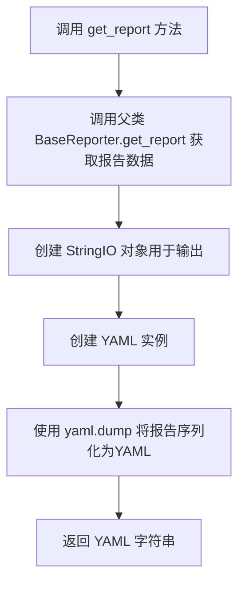
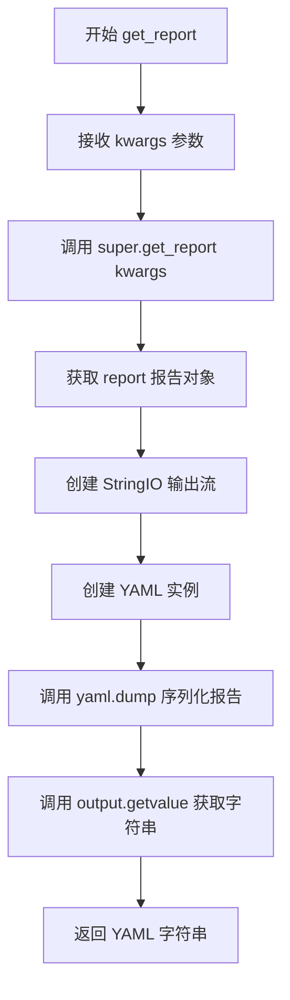

# `kubehunter\kube_hunter\modules\report\yaml.py` 详细设计文档

这是一个YAML格式的报告生成器类，继承自BaseReporter抽象基类，通过ruamel.yaml库将报告对象序列化为YAML格式的字符串输出。

## 整体流程



## 类结构

```
BaseReporter (抽象基类/父类)
└── YAMLReporter (具体报告生成器)
```

## 全局变量及字段


### `StringIO`
    
用于在内存中创建字符流缓冲区的类

类型：`class`
    


### `YAML`
    
ruamel.yaml库的YAML解析器和序列化器类

类型：`class`
    


### `BaseReporter`
    
kube_hunter报告器的基类，定义报告生成的抽象接口

类型：`class`
    


    

## 全局函数及方法


### `YAMLReporter.get_report`

该方法负责将安全扫描报告转换为 YAML 格式输出。它首先调用父类方法获取原始报告数据，然后使用 ruamel.yaml 库将报告序列化为 YAML 字符串并返回。

参数：

- `**kwargs`：可变关键字参数，用于接收父类 `get_report` 方法所需的参数（如报告数据、配置等）

返回值：`str`，返回格式化后的 YAML 报告字符串

#### 流程图

```mermaid
flowchart TD
    A[开始 get_report] --> B[调用 super().get_report获取原始报告]
    B --> C[创建 StringIO 输出缓冲区]
    C --> D[实例化 YAML 编码器]
    D --> E[使用 yaml.dump 将报告写入缓冲区]
    E --> F[调用 output.getvalue 获取字符串]
    F --> G[返回 YAML 格式字符串]
    
    style A fill:#e1f5fe
    style G fill:#e8f5e8
```

#### 带注释源码

```python
def get_report(self, **kwargs):
    """
    获取 YAML 格式的安全扫描报告
    
    参数:
        **kwargs: 可变关键字参数，传递给父类 get_report 方法
        
    返回:
        str: YAML 格式的报告字符串
    """
    # Step 1: 调用父类 BaseReporter 的 get_report 方法
    #         获取原始的报告数据（字典或对象形式）
    report = super().get_report(**kwargs)
    
    # Step 2: 创建 StringIO 对象作为内存缓冲区
    #         用于存储 YAML 输出内容
    output = StringIO()
    
    # Step 3: 实例化 ruamel.yaml 的 YAML 编码器
    #         ruamel.yaml 支持更完整的 YAML 1.2 规范
    yaml = YAML()
    
    # Step 4: 将报告数据序列化为 YAML 格式
    #         并写入到 StringIO 缓冲区中
    yaml.dump(report, output)
    
    # Step 5: 从缓冲区提取最终的 YAML 字符串并返回
    #         返回值类型为 str
    return output.getvalue()
```


### `YAMLReporter.get_report`

该方法继承自 BaseReporter 的 get_report，用于生成 YAML 格式的安全扫描报告。它首先调用父类方法获取原始报告对象，然后使用 ruamel.yaml 库将报告序列化为 YAML 格式的字符串输出。

参数：

- `**kwargs`：可变关键字参数，传递给父类 BaseReporter.get_report 的参数，用于生成报告时使用（如扫描选项、目标信息等）

返回值：`str`，返回 YAML 格式的字符串，表示安全扫描报告内容

#### 流程图



#### 带注释源码

```python
from io import StringIO
from ruamel.yaml import YAML

from kube_hunter.modules.report.base import BaseReporter


class YAMLReporter(BaseReporter):
    def get_report(self, **kwargs):
        # 调用父类 BaseReporter 的 get_report 方法获取原始报告对象
        # 该报告对象包含漏洞扫描结果、节点信息等数据
        report = super().get_report(**kwargs)
        
        # 创建一个 StringIO 对象用于存储 YAML 输出
        # StringIO 提供类似文件的字符串操作接口
        output = StringIO()
        
        # 创建 ruamel.yaml 解析器实例
        # ruamel.yaml 支持 YAML 1.1 规范并保留注释格式
        yaml = YAML()
        
        # 将 report 对象序列化为 YAML 格式并写入 output 流
        # yaml.dump 会自动处理 Python 对象的 YAML 转换
        yaml.dump(report, output)
        
        # 从 StringIO 获取序列化后的 YAML 字符串
        # 返回值为多行字符串，包含完整的 YAML 格式报告
        return output.getvalue()
```

#### 补充说明

**关键组件信息：**

- `StringIO`：Python 内置的字符串缓冲区，用于模拟文件操作
- `ruamel.yaml`：第三方 YAML 处理库，支持 YAML 1.1/1.2 规范
- `BaseReporter`：父类，提供基础报告生成逻辑

**潜在技术债务或优化空间：**

1. 错误处理缺失：未对 `yaml.dump` 可能抛出的异常进行处理
2. 未指定 YAML 流程样式：可以显式设置 `yaml.default_flow_style = False` 以获得更好的可读性
3. StringIO 资源未显式关闭：虽然 Python GC 会回收，但使用上下文管理器更佳
4. 父类实现未知：无法确认 BaseReporter.get_report 的具体实现和返回值结构

**设计约束：**

- 该方法依赖于父类 BaseReporter.get_report 的正确实现
- 输出格式受限于 ruamel.yaml 的序列化能力
- 返回的字符串可能较大（大型集群扫描结果），需考虑内存使用


## 关键组件


### YAMLReporter 类

负责将安全扫描报告转换为YAML格式的类，继承自BaseReporter。

### get_report 方法

重写父类方法，将报告对象序列化为YAML格式字符串返回。

### YAML 序列化模块

使用ruamel.yaml库进行YAML格式的序列化和格式化操作。

### StringIO 缓冲区

用于在内存中构建YAML输出字符串的缓冲区。

### BaseReporter 父类

提供报告数据的基础 Reporter 抽象类，get_report 方法定义在父类中。


## 问题及建议


### 已知问题

-   **缺少异常处理**：yaml.dump() 和 StringIO() 操作未捕获可能的异常（如序列化错误、内存不足等）
-   **资源未显式释放**：StringIO 对象使用后未显式关闭，可能导致资源泄露
-   **YAML 实例重复创建**：每次调用 get_report() 都创建新的 YAML() 实例，未复用可能存在的配置
-   **缺少类型注解**：方法参数和返回值缺少类型提示，影响代码可维护性和 IDE 支持
-   **文档缺失**：类和方法缺少 docstring 文档说明
-   **配置不可定制**：YAML 输出格式（如 flow_style、indent 等）硬编码，无法根据需求调整

### 优化建议

-   添加异常处理机制，捕获并妥善处理可能的 YAML 序列化异常和 IO 异常
-   使用上下文管理器（with 语句）确保 StringIO 资源正确释放，或直接返回 StringIO 对象由调用方管理
-   将 YAML 实例作为类属性或通过依赖注入方式复用，减少对象创建开销
-   为方法添加类型注解（kwargs 类型、返回值类型 str），提升代码可读性和类型安全
-   为类和方法添加 docstring，说明功能、参数和返回值含义
-   允许通过初始化参数或配置方式自定义 YAML 输出格式（如缩进、样式等）
-   考虑添加单元测试，验证不同报告结构的 YAML 序列化正确性


## 其它


### 设计目标与约束

YAMLReporter的设计目标是提供一种将安全漏洞报告序列化为YAML格式的能力，支持与外部系统的数据交换。约束包括：依赖ruamel.yaml库进行序列化，输出必须符合YAML 1.1规范，必须继承BaseReporter基类以保持报告生成的一致性。

### 错误处理与异常设计

代码中未显式处理异常。主要潜在异常包括：ruamel.yaml库可能抛出的YAML解析异常、StringIO的IO异常、super().get_report()可能抛出的基类异常。建议增加异常捕获机制，处理YAML序列化失败、报告数据为空或格式错误等情况。

### 数据流与状态机

数据流：调用get_report() → 触发父类get_report()获取原始报告数据 → 创建StringIO缓冲区 → 使用YAML()创建序列化器 → 调用dump()将报告序列化为YAML格式 → 通过getvalue()获取字符串结果 → 返回调用方。无复杂状态机，流程为线性转换过程。

### 外部依赖与接口契约

外部依赖：ruamel.yaml库（YAML序列化）、io.StringIO（字符串缓冲区）、kube_hunter.modules.report.base.BaseReporter（基类）。接口契约：get_report(**kwargs)方法接收任意关键字参数，返回YAML格式的字符串，调用方需处理返回的字符串内容。

### 性能考虑

StringIO在内存中操作，适合中小规模报告数据。大规模报告可能导致内存占用较高，可考虑使用文件流替代StringIO。YAML序列化性能取决于报告数据复杂度，嵌套层级过深可能影响性能。

### 安全性考虑

代码本身不直接处理用户输入，安全性取决于传入的报告数据。YAML库默认支持一些Python对象序列化，可能存在代码执行风险，建议配置安全的YAML加载器。

### 测试策略

建议测试场景：正常报告数据序列化、YAML格式正确性验证、空报告处理、大报告性能测试、特殊字符转义测试、继承关系验证。

### 配置管理

当前无配置项。YAML序列化器可配置项包括：默认流风格（flow style）、缩进宽度、是否保留注释等，可通过yaml对象属性进行配置。

### 版本兼容性

依赖ruamel.yaml库的版本兼容性，需确认使用的ruamel.yaml版本。Python版本要求取决于kube_hunter项目本身的Python版本要求。

### 部署要求

运行时需要安装ruamel.yaml包：pip install ruamel.yaml。项目部署时需确保kube_hunter主模块和base模块可用。

    