# `kubehunter\setup.py` 详细设计文档

这是一个Python项目构建配置文件，通过setuptools定义了两个自定义命令：ListDependenciesCommand用于从setup.cfg读取并打印项目依赖列表，PyInstallerCommand用于调用PyInstaller构建独立的可执行文件，并自动添加所有依赖作为隐藏导入模块。

## 整体流程

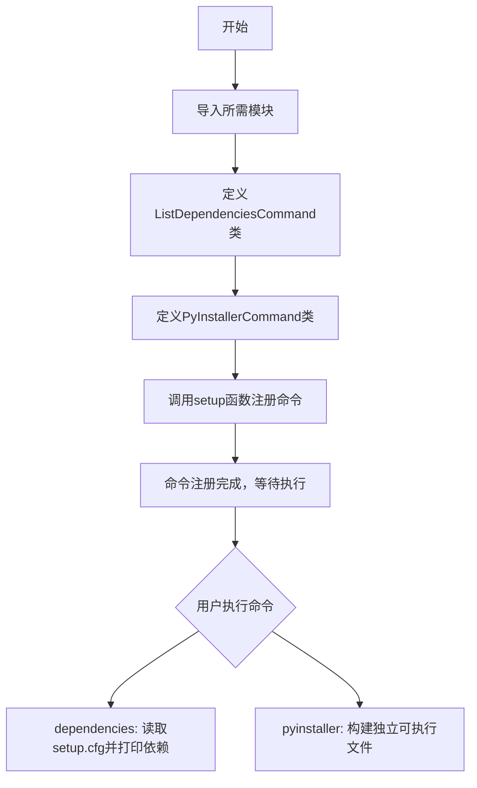

## 类结构

```
Command (setuptools基类)
├── ListDependenciesCommand
└── PyInstallerCommand
```

## 全局变量及字段


### `check_call`
    
用于执行外部命令

类型：`函数`
    


### `parse_requirements`
    
用于解析依赖requirements字符串

类型：`函数`
    


### `ConfigParser`
    
用于读取配置文件

类型：`类`
    


### `setup`
    
用于配置setuptools构建项目

类型：`函数`
    


### `Command`
    
setuptools自定义命令基类

类型：`类`
    


### `ListDependenciesCommand.description`
    
命令描述为'list package dependencies'

类型：`字符串`
    


### `ListDependenciesCommand.user_options`
    
命令选项为空列表

类型：`列表`
    


### `PyInstallerCommand.description`
    
命令描述为'run PyInstaller on kube-hunter entrypoint'

类型：`字符串`
    


### `PyInstallerCommand.user_options`
    
命令选项为空列表

类型：`列表`
    
    

## 全局函数及方法


### `ListDependenciesCommand.initialize_options`

该方法是一个空实现，用于满足 setuptools 命令框架的接口要求，作为初始化命令选项的钩子方法在选项处理之前被调用。

参数：

- `self`：`ListDependenciesCommand`，方法的隐式参数，代表命令类实例本身

返回值：`None`，无返回值（方法体为空，仅执行 pass 语句）

#### 流程图

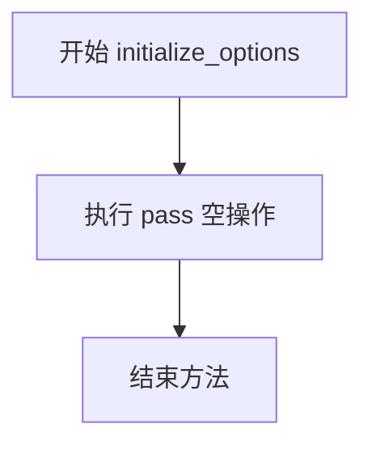

#### 带注释源码

```python
def initialize_options(self):
    """初始化命令选项
    
    这是 setuptools Command 框架的钩子方法，在选项处理之前被调用。
    用于将所有选项设置为默认值。
    
    由于此类没有定义任何自定义选项（user_options 为空列表），
    此方法保持为空实现，满足框架接口要求。
    """
    pass
```


### `ListDependenciesCommand.finalize_options`

该方法是 setuptools 自定义命令类的生命周期方法之一，用于在 `initialize_options` 之后完成选项的最终处理和验证。在当前实现中为空操作（pass），仅作为 setuptools 命令框架的占位方法存在。

参数：

- `self`：实例方法隐式参数，类型为 `ListDependenciesCommand` 实例，表示命令对象本身

返回值：无返回值（`None`），该方法没有显式的 return 语句，在 Python 中默认为返回 `None`

#### 流程图

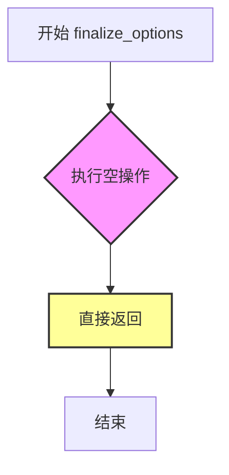

#### 带注释源码

```python
def finalize_options(self):
    """
    完成命令选项的最终处理。
    
    这是 setuptools Command 生命周期中的标准方法，在 initialize_options 之后调用。
    用于处理和验证命令行选项、设置默认值等。
    
    当前实现为空操作，因为该命令不需要处理任何自定义选项。
    """
    pass  # 空操作，该命令不执行任何选项处理逻辑
```


### `ListDependenciesCommand.run`

该方法实现了列出项目依赖的功能，通过读取 `setup.cfg` 配置文件，解析 `[options]` 部分的 `install_requires` 字段，并将依赖项输出到标准输出。

参数：

- `self`：当前类的实例对象，无额外参数

返回值：`None`，该方法无返回值，执行完成后自动结束

#### 流程图

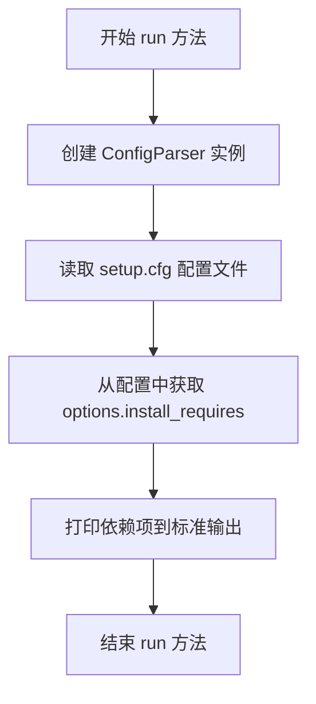

#### 带注释源码

```python
def run(self):
    """执行命令逻辑，打印项目依赖列表"""
    # 步骤1: 创建配置解析器对象
    cfg = ConfigParser()
    
    # 步骤2: 读取 setup.cfg 配置文件
    # 该文件通常位于项目根目录，包含 setuptools 配置
    cfg.read("setup.cfg")
    
    # 步骤3: 从配置中提取 install_requires 字段
    # 这是一个字符串，包含所有项目依赖，格式如 "package1>=1.0; package2==2.0"
    requirements = cfg["options"]["install_requires"]
    
    # 步骤4: 打印依赖项到标准输出
    # 用户可在终端查看所有依赖
    print(requirements)
```


### `PyInstallerCommand.initialize_options`

该方法是 setuptools 自定义命令类 PyInstallerCommand 的初始化选项方法，用于在命令执行前设置或初始化命令的选项参数。在此实现中，该方法为空实现（pass），因为 user_options 已定义为空列表，无需额外初始化操作。

参数：

- `self`：隐式参数，表示命令类实例本身

返回值：`None`，无返回值

#### 流程图

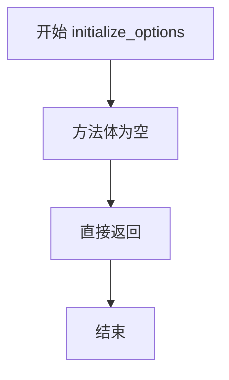

#### 带注释源码

```python
def initialize_options(self):
    """
    初始化命令选项。
    
    在 setuptools 命令生命周期中，此方法在命令执行初期被调用，
    用于设置或初始化命令的各项选项参数。
    
    当前实现为空，因为 user_options 已定义为空列表，
    不需要额外的初始化操作。
    """
    pass  # 空实现，无需初始化任何选项
```


### `PyInstallerCommand.finalize_options`

该方法是 `PyInstallerCommand` 类的标准生命周期方法，用于在命令行参数解析完成后进行选项的最终处理。在当前实现中为空方法（pass），未执行任何实际操作，这是 setuptools 命令类的标准占位实现。

参数：

- `self`：`PyInstallerCommand`，方法所属的类实例

返回值：`None`，该方法没有返回值

#### 流程图

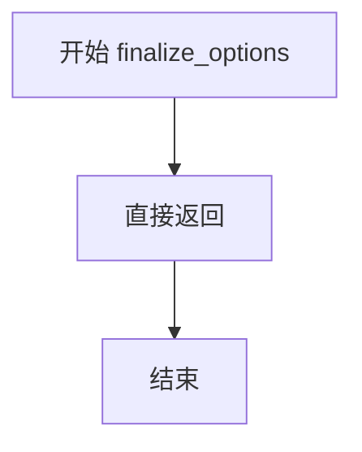

#### 带注释源码

```python
def finalize_options(self):
    """
    在命令行选项解析完成后调用，用于处理和验证选项。
    当前实现为空方法，作为 setuptools Command 类的标准占位实现，
    不执行任何操作。
    """
    pass
```


### `PyInstallerCommand.run`

该方法是 PyInstallerCommand 类的核心执行方法，负责读取项目配置文件以获取依赖信息，并构造 PyInstaller 命令行参数来构建名为 "kube-hunter" 的单文件可执行程序。

参数：

- 无

返回值：`None`，无返回值描述

#### 流程图

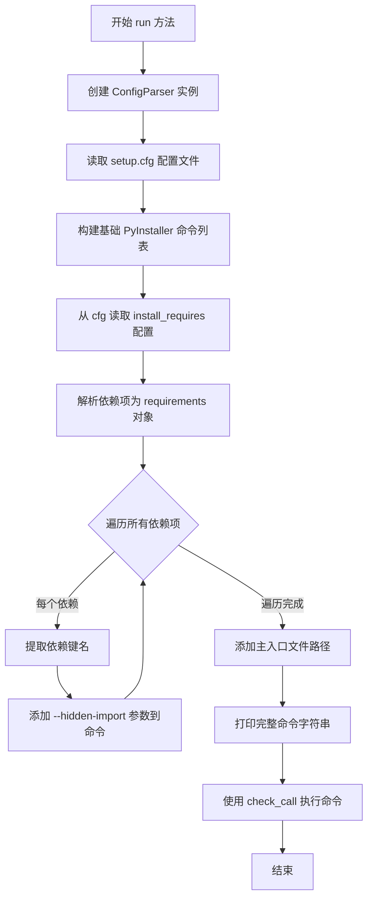

#### 带注释源码

```
def run(self):
    """
    执行 PyInstaller 命令来构建单文件可执行程序。
    该方法完成以下步骤：
    1. 读取 setup.cfg 配置文件
    2. 获取所有依赖项并添加为隐藏导入
    3. 构建完整的 pyinstaller 命令
    4. 执行命令进行打包
    """
    
    # 创建配置解析器对象，用于读取 .ini 风格的配置文件
    cfg = ConfigParser()
    
    # 读取项目根目录下的 setup.cfg 配置文件
    cfg.read("setup.cfg")
    
    # 定义 PyInstaller 的基础命令参数：
    # --clean: 清理临时文件和缓存
    # --onefile: 生成单个独立的可执行文件
    # --name: 指定输出的可执行文件名称
    command = [
        "pyinstaller",
        "--clean",
        "--onefile",
        "--name",
        "kube-hunter",
    ]
    
    # 从配置文件中读取 install_requires 选项（项目依赖列表）
    setup_cfg = cfg["options"]["install_requires"]
    
    # 使用 pkg_resources 解析依赖项字符串为可迭代的 Requirement 对象
    requirements = parse_requirements(setup_cfg)
    
    # 遍历每个依赖项，将它们添加为 PyInstaller 的隐藏导入
    # 这是为了确保打包时能正确包含所有依赖模块
    for r in requirements:
        # r.key 是依赖包的名称（如 'requests', 'flask' 等）
        command.extend(["--hidden-import", r.key])
    
    # 添加要打包的 Python 入口文件路径
    command.append("kube_hunter/__main__.py")
    
    # 打印最终生成的完整命令，便于调试和查看
    print(" ".join(command))
    
    # 使用 subprocess.check_call 执行命令
    # 该函数会等待命令完成后返回，失败时抛出异常
    check_call(command)
```


### `ListDependenciesCommand.initialize_options`

该方法是 setuptools 的 Command 类中的一个钩子方法，用于初始化命令选项。在此实现中，它是一个空操作（pass），因为 ListDependenciesCommand 不需要自定义选项。

参数：
- 无参数（仅包含隐式 self 参数）

返回值：`None`，无返回值

#### 流程图

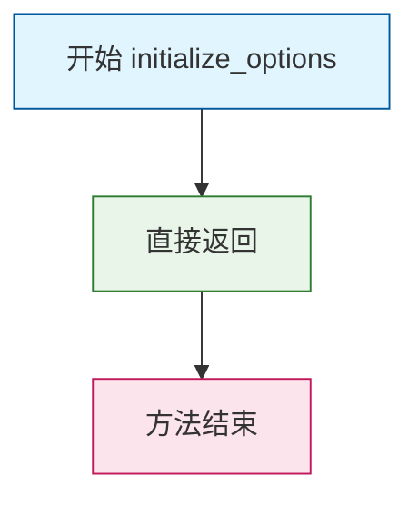

#### 带注释源码

```python
def initialize_options(self):
    """
    初始化命令选项的钩子方法。
    
    在 setuptools Command 框架中，此方法用于定义和初始化
    命令的自定义选项。在 ListDependenciesCommand 中，
    由于没有自定义选项需要定义，因此使用 pass 语句空实现。
    
    此方法通常与 finalize_options() 配对使用：
    - initialize_options(): 在命令开始时设置默认值
    - finalize_options(): 在运行前验证和处理选项值
    """
    pass  # 无自定义选项需要初始化，保持为空操作
```


### `ListDependenciesCommand.finalize_options`

完成选项方法，该方法在命令行选项解析完成后被调用，由于 `ListDependenciesCommand` 没有自定义选项，因此不执行任何操作。

参数：无

返回值：`None`，无返回值

#### 流程图

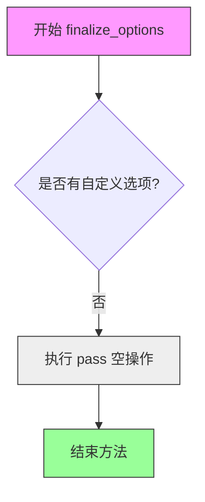

#### 带注释源码

```python
def finalize_options(self):
    """Finalize options for the command.
    
    This method is called by setuptools after all command-line options
    have been parsed. It is used to perform any necessary validation
    or initialization of option values.
    
    Since ListDependenciesCommand defines user_options as an empty list,
    there are no custom options to finalize, so this method is a no-op
    (pass).
    
    Args:
        None
        
    Returns:
        None
    """
    pass  # No-op: no custom options to finalize
```


### `ListDependenciesCommand.run`

该方法是 `ListDependenciesCommand` 类的核心执行方法，用于读取项目根目录下的 `setup.cfg` 配置文件，解析 `[options]` 段中的 `install_requires` 字段，并将依赖项字符串直接打印到标准输出。这是一个自定义的 setuptools 命令实现，继承自 `Command` 基类，用于在包安装过程中列出项目的依赖声明。

参数：

- 该方法无参数（仅包含 `self` 参数，代表类实例本身）

返回值：`None`，该方法无返回值，执行完成后直接结束

#### 流程图

```mermaid
flowchart TD
    A[开始执行 run 方法] --> B[创建 ConfigParser 实例]
    B --> C[读取 setup.cfg 配置文件]
    C --> D[从 cfg['options'] 获取 install_requires 字符串]
    D --> E{读取成功?}
    E -->|是| F[打印 requirements 字符串到标准输出]
    E -->|否| G[抛出 KeyError 异常]
    F --> H[方法结束]
    G --> H
```

#### 带注释源码

```python
def run(self):
    """
    执行命令的核心方法，读取配置并打印依赖列表
    """
    # 创建 ConfigParser 对象用于解析 INI 风格的配置文件
    cfg = ConfigParser()
    
    # 读取项目根目录下的 setup.cfg 配置文件
    cfg.read("setup.cfg")
    
    # 从配置文件中获取 [options] 段下的 install_requires 字段值
    # 该字段包含项目所有运行时依赖，以逗号或换行分隔
    requirements = cfg["options"]["install_requires"]
    
    # 将依赖字符串直接打印到标准输出
    # 格式为原始字符串，未做任何解析或格式化
    print(requirements)
```


### `PyInstallerCommand.initialize_options`

该方法是 `PyInstallerCommand` 类的初始化选项方法，用于在命令执行前设置选项的默认值。在此实现中，由于该命令不接收任何用户选项，因此方法体为空，直接pass。

参数：

- 无参数

返回值：`None`，无返回值描述（方法体为空，主要用于满足 setuptools Command 类的接口要求）

#### 流程图

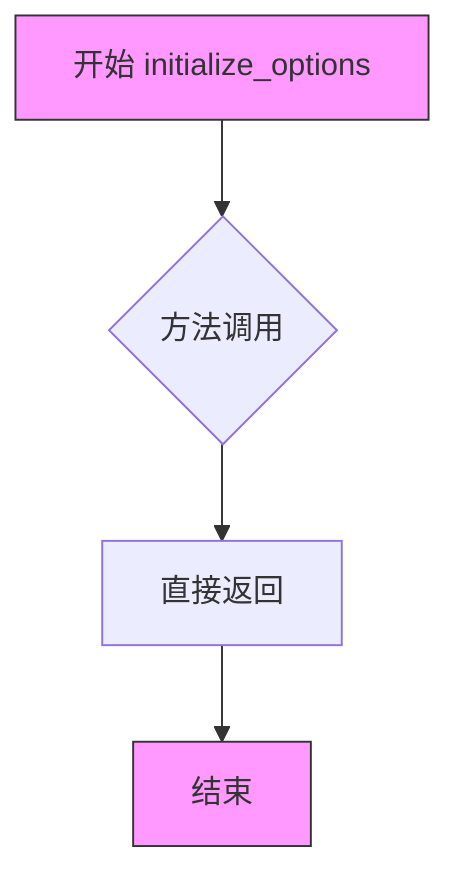

#### 带注释源码

```python
def initialize_options(self):
    """
    初始化命令选项的默认值。
    
    在 setuptools Command 框架中，此方法在命令执行初期被调用，
    用于设置或初始化命令选项的默认值。
    
    由于 PyInstallerCommand 类定义的 user_options 为空列表 [],
    表示该命令不接收任何用户自定义选项，因此此处无需进行任何初始化操作。
    
    参数:
        self: PyInstallerCommand 实例本身
    
    返回值:
        无 (None)
    """
    pass  # 该命令无用户选项需要初始化，方法体为空
```


### `PyInstallerCommand.finalize_options`

该方法是 `PyInstallerCommand` 类的一个空实现，用于完成选项配置（在 setuptools 框架中通常用于处理命令行参数后的最终配置），但当前版本未实现任何逻辑，仅作为占位符存在。

参数：

- 无

返回值：`None`，无返回值

#### 流程图

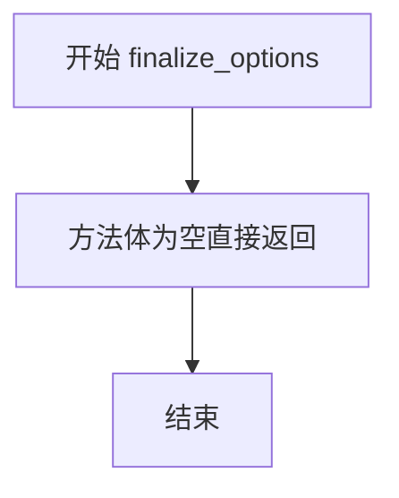

#### 带注释源码

```python
def finalize_options(self):
    """
    完成选项配置方法。
    
    在 setuptools 的 Command 框架中，此方法在命令行选项解析完成后被调用，
    通常用于设置最终的配置值或验证选项的有效性。
    
    当前实现为空（pass），表示该命令不需要执行任何选项完成逻辑。
    """
    pass
```


### `PyInstallerCommand.run`

该方法是 PyInstallerCommand 类的核心执行方法，用于从 setup.cfg 读取配置，构建 PyInstaller 命令行参数（包括从 install_requires 解析依赖并添加隐藏导入），然后通过 subprocess.check_call 执行 PyInstaller 构建独立的 kube-hunter 可执行文件。

参数：无显式参数（self 为隐式参数）

返回值：`None`，该方法直接执行系统命令，不返回任何值

#### 流程图

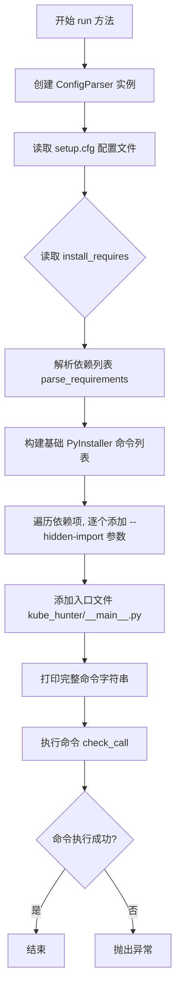

#### 带注释源码

```python
def run(self):
    """执行 PyInstaller 命令构建独立可执行文件"""
    
    # 创建配置解析器实例，用于读取 .ini 格式的配置文件
    cfg = ConfigParser()
    
    # 读取项目根目录下的 setup.cfg 配置文件
    # setup.cfg 包含项目的元数据和依赖信息
    cfg.read("setup.cfg")
    
    # 构建 PyInstaller 命令的基础参数列表
    # --clean: 清理临时构建文件
    # --onefile: 生成单个独立的可执行文件
    # --name: 指定输出可执行文件的名称
    command = [
        "pyinstaller",
        "--clean",
        "--onefile",
        "--name",
        "kube-hunter",
    ]
    
    # 从 setup.cfg 的 [options] 节读取 install_requires 字段
    # 该字段包含项目运行所需的依赖列表，格式为 pip requirements 字符串
    setup_cfg = cfg["options"]["install_requires"]
    
    # 使用 pkg_resources 解析依赖字符串为可迭代的 Requirement 对象
    # parse_requirements 会处理版本约束、 extras 等复杂依赖声明
    requirements = parse_requirements(setup_cfg)
    
    # 遍历每个解析后的依赖项
    # 为每个依赖添加 --hidden-import 参数，使 PyInstaller 能够
    # 识别并打包这些动态导入的模块
    for r in requirements:
        # r.key 是依赖包的名称（不含版本号）
        command.extend(["--hidden-import", r.key])
    
    # 添加要打包的入口 Python 文件路径
    # kube_hunter/__main__.py 是 kube-hunter 项目的标准入口点
    command.append("kube_hunter/__main__.py")
    
    # 打印完整的命令字符串，便于调试和查看实际执行的命令
    # 输出格式示例: pyinstaller --clean --onefile --name kube-hunter ...
    print(" ".join(command))
    
    # 使用 subprocess.check_call 执行构建命令
    # check_call 会阻塞直到命令执行完成
    # 若命令返回非零退出码，会抛出 CalledProcessError 异常
    check_call(command)
```

## 关键组件


### ListDependenciesCommand

一个自定义的 setuptools 命令类，用于从 setup.cfg 配置文件中读取并打印 install_requires 依赖列表。

### PyInstallerCommand

一个自定义的 setuptools 命令类，用于使用 PyInstaller 将 kube-hunter 项目构建为单文件可执行程序，并自动添加所有依赖作为隐藏导入。

### ConfigParser 解析器

使用 ConfigParser 读取 setup.cfg 配置文件，提取 options 部分的 install_requires 字段内容。

### 依赖解析模块

使用 pkg_resources.parse_requirements 解析 setup.cfg 中的依赖字符串为可迭代的需求对象，提取每个依赖的 key 属性。

### 命令执行模块

使用 subprocess.check_call 执行构建命令，将命令列表转换为字符串并打印后执行。

### setuptools 集成

使用 setup() 函数注册两个自定义命令类到 cmdclass 字典中，使它们可以通过 `python setup.py dependencies` 和 `python setup.py pyinstaller` 调用。


## 问题及建议


### 已知问题

-   **硬编码路径问题**：文件路径 "setup.cfg" 和 "kube_hunter/__main__.py" 被硬编码，缺乏灵活性和可配置性
-   **ConfigParser 缺乏错误处理**：直接访问 `cfg["options"]["install_requires"]` 未检查 section 或 key 是否存在，可能导致 KeyError 异常
-   **使用废弃的 pkg_resources**：代码使用 `pkg_resources.parse_requirements()`，该模块在 Python 3.8+ 已废弃，应改用 `importlib.metadata`
-   **缺少异常处理**：subprocess.check_call() 未捕获异常，parse_requirements() 可能抛出异常
-   **空的父类方法调用**：initialize_options() 和 finalize_options() 方法体为空（只有 pass），应调用父类方法 super().initialize_options() 和 super().finalize_options()
-   **user_options 未正确初始化**：user_options 为空列表，但作为 setuptools Command 子类应定义具体的选项配置
-   **缺少类型注解**：所有方法和变量都缺乏类型注解，降低了代码可维护性和 IDE 支持
-   **print 语句用于用户输出**：应使用 logging 模块替代 print 以支持日志级别控制
-   **PyInstaller 命令覆盖构建**：--onefile 模式下每次运行会覆盖之前构建的输出

### 优化建议

-   将文件路径提取为配置项或环境变量，支持自定义配置路径
-   使用 ConfigParser 的 get() 方法并提供默认值，或先检查 key 是否存在：使用 `cfg.has_option()` 和 `cfg.get()`
-   将 pkg_resources 替换为 importlib.metadata.version() 或 packaging.requirements.Requirement
-   为关键操作添加 try-except 异常处理，特别是文件读取、子进程调用和依赖解析
-   在 initialize_options 和 finalize_options 中调用父类方法，确保基类初始化逻辑执行
-   为 user_options 添加适当的选项定义，或明确注释为何不需要选项
-   添加类型注解（typing），提升代码可读性和静态分析能力
-   引入 logging 模块替代 print，支持更灵活的日志管理
-   考虑添加 --output-dir 参数或时间戳来避免覆盖之前的构建产物
-   添加命令行参数验证，确保必需的配置项存在
-   将命令构建逻辑提取为独立方法，提高代码复用性和可测试性


## 其它


### 设计目标与约束

本代码的设计目标是为kube-hunter项目提供自定义的setuptools命令，实现两个核心功能：1) 列出项目依赖供其他工具使用；2) 使用PyInstaller构建单文件可执行程序。设计约束包括：依赖setuptools框架、需要预先配置setup.cfg、使用pkg_resources解析依赖版本。

### 错误处理与异常设计

代码中使用了subprocess.check_call()，该方法在命令返回非零退出码时会抛出CalledProcessError异常。ConfigParser读取文件失败时可能抛出NoSectionError或NoOptionError。parse_requirements()解析失败时抛出ParseError。建议增加try-except捕获FileNotFoundError、NoSectionError、CalledProcessError等异常，并提供友好的错误提示。

### 数据流与状态机

数据流为：读取setup.cfg配置文件 -> 解析install_requires字段 -> 根据不同命令执行不同操作（打印依赖或构建可执行文件）。状态机主要包括：初始化选项 -> 验证配置 -> 执行命令 -> 输出结果。

### 外部依赖与接口契约

外部依赖包括：subprocess模块（命令执行）、pkg_resources（依赖解析）、configparser（配置读取）、setuptools（构建框架）、pyinstaller（打包工具）。接口契约：ListDependenciesCommand输出依赖字符串到stdout，PyInstallerCommand执行pyinstaller命令并生成kube-hunter可执行文件。

### 性能考虑

当前实现每次运行都会重新读取配置文件和解析依赖，对于大型依赖列表可能存在性能瓶颈。建议缓存解析结果或增加配置变更检测机制。PyInstaller构建过程本身较为耗时，属于正常开销。

### 安全性考虑

代码直接使用check_call()执行外部命令，存在命令注入风险。建议对从配置文件读取的参数进行严格验证，特别是--hidden-import参数。配置文件路径"setup.cfg"硬编码，缺乏灵活性。

### 可维护性与扩展性

类方法实现中initialize_options()和finalize_options()均为空实现，可考虑增加参数验证逻辑。当前仅支持单一入口文件kube_hunter/__main__.py，扩展性受限。command列表构建逻辑可提取为独立方法以提高可读性。

### 平台支持

代码使用了跨平台的subprocess和configparser模块，但PyInstaller命令中的参数（如--onefile）在不同操作系统上行为可能略有差异。建议增加平台检测逻辑或明确支持的平台要求。

### 版本兼容性

代码使用了pkg_resources.parse_requirements()，该模块在setuptools 58.0.0+版本中被标记为deprecated，建议迁移到packaging库。Python版本支持应根据setup.py的其他配置确定，当前代码未指定python_requires。

### 配置文件格式

依赖读取自setup.cfg的[options]段落的install_requires字段，期望格式为标准requirements.txt格式（每行一个依赖，可带版本约束）。配置文件必须存在且包含所需段落，否则程序将崩溃。

### 测试策略建议

建议增加单元测试覆盖：测试ConfigParser模拟读取、测试依赖解析逻辑、测试命令构建逻辑、测试异常处理路径。可使用unittest.mock模拟文件读取和子进程执行。

### 日志与输出规范

当前代码使用print()输出信息，缺乏统一的日志级别管理。建议引入logging模块区分info、warning、error级别输出。PyInstaller命令打印构建命令到stdout便于调试，但生产环境应考虑减少详细输出。

### 部署相关

该setup.py作为项目打包入口，使用python setup.py pyinstaller或python setup.py dependencies命令调用。生成的kube-hunter可执行文件应部署到目标服务器的PATH中。依赖项安装_requires需与构建产物一致。

    