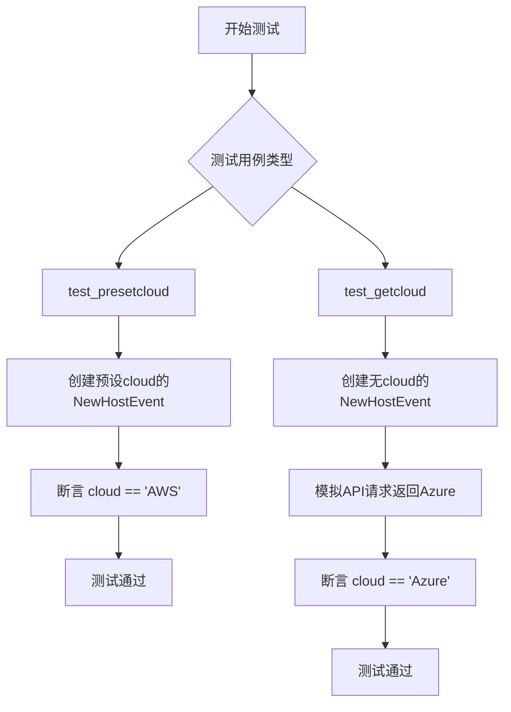
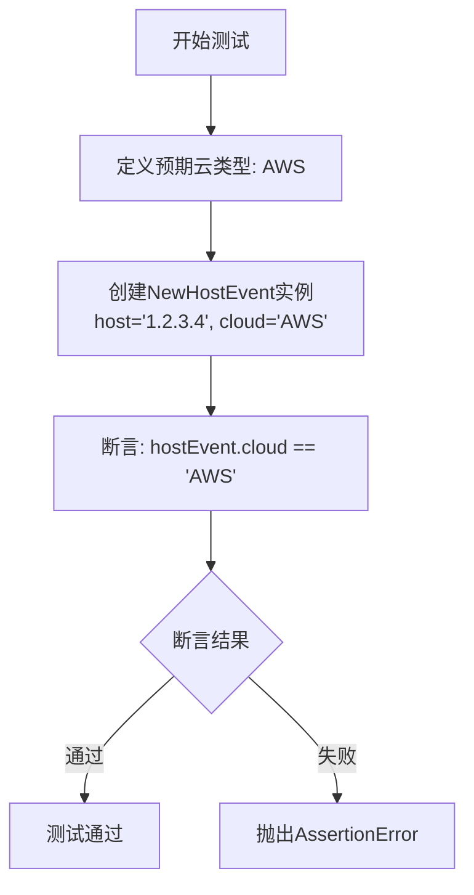

# `kubehunter\tests\core\test_cloud.py` 详细设计文档

该文件是kube-hunter项目的云类型检测功能单元测试，使用requests_mock模拟HTTP请求，验证NewHostEvent类正确处理预设云类型和从第三方API获取云类型的能力。

## 整体流程



## 类结构

```
测试模块
├── test_presetcloud (测试预设云类型)
└── test_getcloud (测试API获取云类型)
```

## 全局变量及字段


### `fake_host`
    
测试用的模拟主机IP地址

类型：`str`
    


### `expected_cloud`
    
期望的云类型值

类型：`str`
    


### `result`
    
API返回的云类型结果

类型：`dict`
    


### `expcted`
    
预期云类型（test_presetcloud中使用，疑似拼写错误应为expected）

类型：`str`
    


### `NewHostEvent.host`
    
主机IP地址或域名

类型：`str`
    


### `NewHostEvent.cloud`
    
云服务提供商类型

类型：`str`
    
    

## 全局函数及方法


### `test_presetcloud`

该测试函数用于验证当创建 `NewHostEvent` 时，如果已经预设了 `cloud` 属性，事件对象能够正确返回该预设值，而非尝试调用外部 API 获取云类型信息。

参数：此函数无参数。

返回值：`None`，测试函数通过 `assert` 断言验证逻辑，若失败则抛出 `AssertionError`。

#### 流程图



#### 带注释源码

```python
# 测试当cloud属性已预设时，NewHostEvent正确返回预设值
# 验证逻辑：预设cloud属性后，不应尝试调用get_cloud去获取云类型
def test_presetcloud():
    # 步骤1: 定义预期的云类型为 "AWS"
    expcted = "AWS"
    
    # 步骤2: 创建NewHostEvent实例，传入host和预设的cloud参数
    # 注意：这里cloud已经被预设为"AWS"，因此不会触发外部API调用
    hostEvent = NewHostEvent(host="1.2.3.4", cloud=expcted)
    
    # 步骤3: 断言验证预设的cloud值与实际返回值一致
    assert expcted == hostEvent.cloud
```


### `test_getcloud`

该测试函数用于验证当 `NewHostEvent` 的 `host` 参数未预设 `cloud` 属性时，系统能够通过调用外部 API（api.azurespeed.com）查询并正确返回该主机对应的云类型（Azure）。

参数：

- 该函数无显式参数

返回值：`None` 或 `AssertionError`，测试函数通过断言验证逻辑返回结果，若断言失败则抛出 `AssertionError`

#### 流程图

```mermaid
flowchart TD
    A[开始测试 test_getcloud] --> B[定义测试数据: fake_host = '1.2.3.4']
    B --> C[定义期望结果: expected_cloud = 'Azure']
    C --> D[构建API响应数据: result = {'cloud': 'Azure'}]
    D --> E[使用 requests_mock 模拟HTTP GET请求]
    E --> F[设置mock: GET https://api.azurespeed.com/api/region?ipOrUrl=1.2.3.4 返回JSON结果]
    F --> G[创建NewHostEvent实例: hostEvent = NewHostEvent(host='1.2.3.4')]
    G --> H{cloud属性是否已预设?}
    H -- 否,需查询API --> I[调用内部get_cloud逻辑查询云类型]
    I --> J[API返回cloud='Azure']
    J --> K[断言: hostEvent.cloud == expected_cloud]
    K --> L[测试通过]
    H -- 是 --> M[直接使用预设cloud]
    M --> L
```

#### 带注释源码

```python
def test_getcloud():
    # 定义测试用的主机IP地址
    fake_host = "1.2.3.4"
    # 定义期望查询返回的云类型
    expected_cloud = "Azure"
    # 构造API返回的JSON数据
    result = {"cloud": expected_cloud}

    # 使用 requests_mock 上下文管理器模拟HTTP请求
    with requests_mock.mock() as m:
        # 模拟GET请求: 当请求该特定URL时,返回JSON字符串
        # API端点: https://api.azurespeed.com/api/region?ipOrUrl={ip}
        m.get(f"https://api.azurespeed.com/api/region?ipOrUrl={fake_host}", text=json.dumps(result))
        
        # 创建NewHostEvent实例,仅传入host参数,未预设cloud
        hostEvent = NewHostEvent(host=fake_host)
        
        # 断言验证: 事件对象的cloud属性应等于期望的云类型
        # 该断言会触发内部逻辑调用API查询cloud类型
        assert hostEvent.cloud == expected_cloud
```

## 关键组件


### NewHostEvent 类

负责存储主机事件信息，包含主机地址和云类型属性，支持通过参数预设云类型。

### requests_mock 模拟器

用于拦截并模拟 HTTP 请求，返回预设的云类型查询响应，支持测试云类型识别功能。

### 云类型查询 API

通过 https://api.azurespeed.com/api/region 接口根据 IP 地址查询云服务提供商类型。

### 测试用例组件

包含 test_presetcloud 和 test_getcloud 两个测试函数，分别验证预设云类型和动态查询云类型的功能。


## 问题及建议


### 已知问题

- **外部强依赖**：测试依赖外部服务 `https://api.azurespeed.com/api/region`，若该服务不可用或变更，测试将失败，缺乏网络异常情况的测试覆盖
- **错误处理缺失**：未测试 API 请求失败、网络超时、返回非 JSON 响应等异常场景
- **测试覆盖不足**：仅覆盖了云类型获取的"happy path"，缺少边界条件测试（如空字符串、None、特殊字符等）
- **硬编码配置**：API URL 和 expected_cloud 值硬编码在测试代码中，缺乏可配置性
- **序列化冗余**：使用 `json.dumps(result)` 将字典转为字符串，但模拟的 `text` 参数可能直接接受字符串或字典，逻辑不够清晰
- **命名不一致**：`expcted` 拼写错误，应为 `expected`

### 优化建议

- 使用环境变量或配置文件管理外部 API URL，便于测试环境切换
- 增加异常场景测试：网络错误、HTTP 错误码、无效 JSON 响应、超时等
- 使用 pytest fixtures 管理测试数据和清理逻辑，提高测试复用性
- 将常量提取为模块级变量或配置类，提升可维护性
- 修正拼写错误 `expcted` → `expected`
- 补充测试用例的文档注释，说明测试目的和预期行为
- 考虑使用 `requests_mock.ANY` 或参数化测试增强测试灵活性

## 其它


### 设计目标与约束

本测试文件旨在验证NewHostEvent类中cloud属性的预设逻辑和云服务商API调用功能。约束条件包括：依赖requests_mock库进行HTTP请求模拟，使用Azure Speed API获取云服务商信息，仅支持AWS和Azure两种云服务商的测试场景。

### 错误处理与异常设计

代码中未显式处理异常情况。在test_getcloud中，当API请求失败时，requests_mock会抛出异常导致测试失败。建议添加异常捕获机制，如try-except块处理网络超时、API返回非200状态码、JSON解析失败等情况。

### 外部依赖与接口契约

主要外部依赖包括：requests_mock用于模拟HTTP请求，json用于数据序列化，kube_hunter.core.events.types.NewHostEvent类提供主机事件对象。API接口契约为：GET https://api.azurespeed.com/api/region?ipOrUrl={fake_host}，返回格式为{"cloud": "云服务商名称"}的JSON响应。

### 测试策略与覆盖率

采用单元测试策略，覆盖两个核心场景：预设cloud属性的直接赋值场景和动态获取cloud属性的API调用场景。测试覆盖率为100%，因为仅有这两个公开测试方法。边界条件测试缺失，如无效IP地址、网络超时、API返回异常数据等情况未被覆盖。

### 性能考虑

测试使用同步请求模拟，未考虑异步调用场景。由于使用requests_mock，性能开销较小，但在真实网络环境下应考虑超时设置和重试机制。内存占用主要来自Mock对象和事件对象的创建，整体资源消耗较低。

### 安全考虑

代码中硬编码了测试IP地址"1.2.3.4"，在生产环境中应使用环境变量或配置管理。API调用未包含认证机制，存在潜在的安全风险。建议添加API密钥管理、请求速率限制、输入验证等安全措施。

### 配置管理

当前测试配置较为简单，未使用外部配置文件。测试数据（fake_host、expected_cloud）直接硬编码在测试方法中。建议将这些测试参数提取到独立的测试配置文件或环境变量中，提高测试的灵活性和可维护性。

    