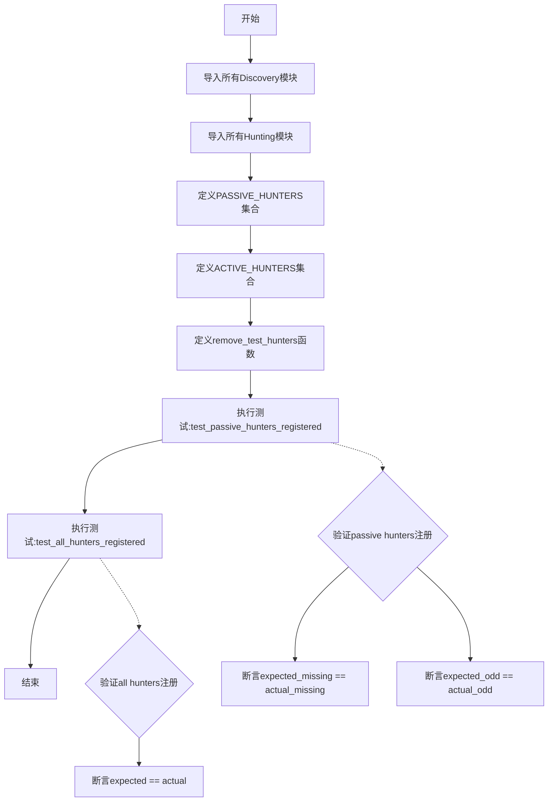
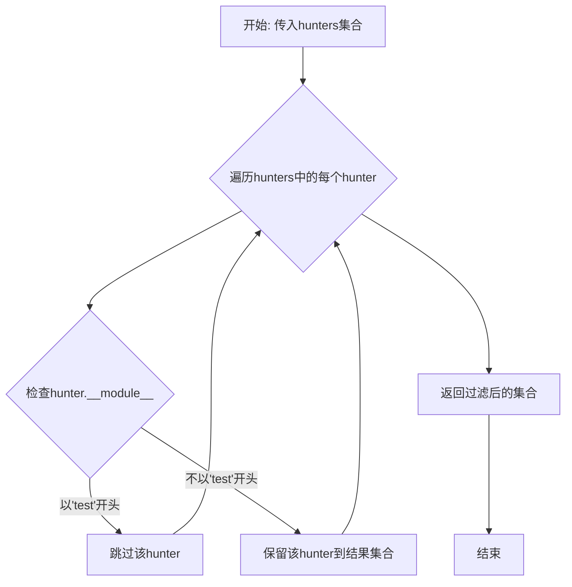
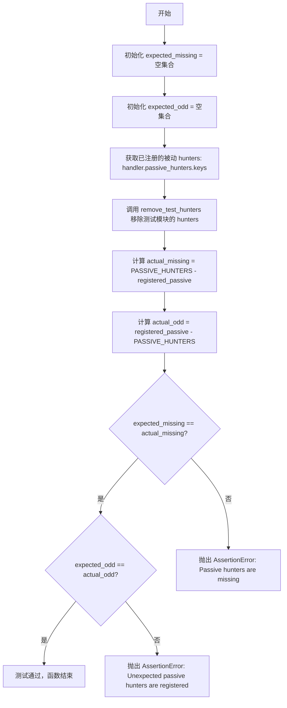
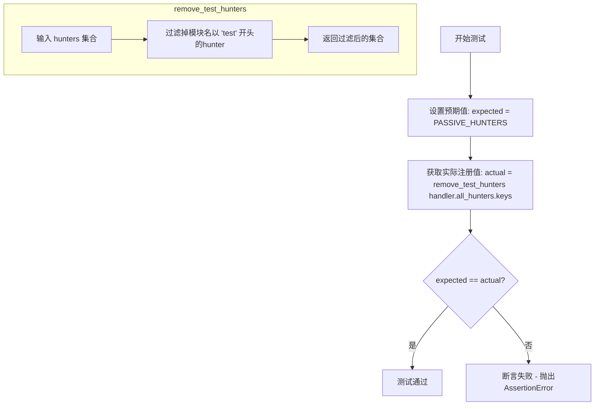

# `kubehunter\tests\core\test_handler.py` 详细设计文档

该文件是kube-hunter的安全猎人注册中心,用于管理和验证Kubernetes集群安全漏洞发现模块的注册状态,包括被动发现(无需交互)和主动探测(需主动交互)两类 hunters,并提供测试函数确保所有 hunters 正确注册到事件处理器中。

## 整体流程



## 类结构

```
模块级结构
├── PASSIVE_HUNTERS (集合)
├── ACTIVE_HUNTERS (集合)
├── remove_test_hunters (函数)
├── test_passive_hunters_registered (测试函数)
└── test_all_hunters_registered (测试函数)
```

## 全局变量及字段


### `PASSIVE_HUNTERS`
    
包含所有被动hunter类的集合，用于测试验证

类型：`set`
    


### `ACTIVE_HUNTERS`
    
包含所有主动hunter类的集合，用于测试验证

类型：`set`
    


### `expected_missing`
    
测试中预期缺失的hunter集合，初始化为空

类型：`set`
    


### `expected_odd`
    
测试中预期额外注册的hunter集合，初始化为空

类型：`set`
    


### `registered_passive`
    
从handler中获取的实际注册的被动hunter集合

类型：`set`
    


### `actual_missing`
    
实际缺失的hunter集合，通过PASSIVE_HUNTERS与registered_passive差集计算

类型：`set`
    


### `actual_odd`
    
实际额外注册的hunter集合，通过registered_passive与PASSIVE_HUNTERS差集计算

类型：`set`
    


### `expected`
    
test_all_hunters_registered中预期的所有hunter集合

类型：`set`
    


### `actual`
    
test_all_hunters_registered中从handler获取的实际所有hunter集合

类型：`set`
    


    

## 全局函数及方法


### `remove_test_hunters`

该函数用于从给定的猎人（hunter）集合中过滤掉所有来自测试模块（模块名以"test"开头）的猎人，确保只保留正式环境中的猎人组件。

参数：

- `hunters`：`Set[Type]`（集合），需要过滤的猎人对象集合，这些猎人对象具有 `__module__` 属性用于检查其所属模块

返回值：`Set[Type]`，返回一个新的集合，包含所有模块名不以 "test" 开头的猎人对象

#### 流程图



#### 带注释源码

```python
def remove_test_hunters(hunters):
    """
    从猎人集合中移除测试模块的猎人
    
    参数:
        hunters: 包含猎人对象的集合，每个猎人对象应有 __module__ 属性
        
    返回:
        只包含非测试模块猎人的新集合
    """
    # 使用集合推导式过滤猎人
    # 条件: not hunter.__module__.startswith("test")
    # 即保留模块名不以 'test' 开头的猎人
    return {hunter for hunter in hunters if not hunter.__module__.startswith("test")}
```


### `test_passive_hunters_registered`

该函数是一个测试函数，用于验证所有被动 hunters（猎人/扫描器）是否正确注册到事件处理器中，确保没有遗漏或意外添加的 hunter。

参数：

- （无参数）

返回值：`None`，该函数通过断言验证，不返回任何值；若验证失败则抛出 `AssertionError` 异常

#### 流程图



#### 带注释源码

```python
def test_passive_hunters_registered():
    """
    测试函数：验证被动 hunters 是否正确注册
    
    该函数检查 PASSIVE_HUNTERS 集合中的所有 hunter 类是否已注册到
    handler.passive_hunters 中，确保没有遗漏或意外添加的 hunter。
    """
    # 期望缺失的 hunters 集合（此处为空，表示所有 PASSIVE_HUNTERS 都应被注册）
    expected_missing = set()
    # 期望额外的 hunters 集合（此处为空，表示不应有未预期的 hunter 被注册）
    expected_odd = set()

    # 从 handler.passive_hunters.keys() 获取已注册的被动 hunters
    # 并通过 remove_test_hunters 函数过滤掉测试模块中的 hunter
    registered_passive = remove_test_hunters(handler.passive_hunters.keys())
    
    # 计算期望但未注册的 hunters 集合
    actual_missing = PASSIVE_HUNTERS - registered_passive
    
    # 计算已注册但不在期望列表中的 hunters 集合
    actual_odd = registered_passive - PASSIVE_HUNTERS

    # 断言：验证没有缺失的被动 hunters
    assert expected_missing == actual_missing, "Passive hunters are missing"
    
    # 断言：验证没有意外注册的被动 hunters
    assert expected_odd == actual_odd, "Unexpected passive hunters are registered"
```


### `test_all_hunters_registered`

该函数用于验证所有已注册的 hunter（被动扫描器）是否与预期的 PASSIVE_HUNTERS 集合完全匹配，确保没有遗漏或多余的 hunter 被注册。

参数： 无

返回值：`None`，该函数通过 assert 断言进行测试验证，不返回具体数值

#### 流程图



#### 带注释源码

```python
def test_all_hunters_registered():
    # TODO: Enable active hunting mode in testing
    # 注释说明：当前只测试被动hunter，因为主动hunter的注册需要 config.active 被设置
    # 预期值：使用 PASSIVE_HUNTERS 集合（已定义的被动hunter列表）
    expected = PASSIVE_HUNTERS
    
    # 实际值：从 handler 中获取所有已注册的 hunters
    # 调用 remove_test_hunters 函数过滤掉来自测试模块的 hunters
    actual = remove_test_hunters(handler.all_hunters.keys())

    # 断言：验证预期集合与实际集合完全相等
    # 如果不相等，会抛出 AssertionError 并显示详细的差异信息
    assert expected == actual
```

## 关键组件


### PASSIVE_HUNTERS

存储被动安全 hunter 类的集合，用于收集 Kubernetes 集群信息而不产生主动探测行为

### ACTIVE_HUNTERS

存储主动安全 hunter 类的集合，用于对 Kubernetes 集群进行主动探测和漏洞验证

### remove_test_hunters

从 hunters 集合中移除测试模块的 hunter，返回仅包含生产环境 hunter 的集合

### test_passive_hunters_registered

验证所有被动 hunter 类已正确注册到事件处理器中，检查缺失和意外的 hunter

### test_all_hunters_registered

验证所有被动 hunter 类已在事件处理器中注册，确保注册列表与预期一致

### ApiServiceDiscovery

Kubernetes API Server 服务发现模块

### KubeDashboardDiscovery

Kubernetes Dashboard 发现模块

### EtcdRemoteAccessDiscovery

Etcd 远程访问发现模块

### FromPodHostDiscovery

从 Pod 内部发现主机模块

### HostDiscovery

主机发现模块

### KubectlClientDiscovery

Kubectl 客户端发现模块

### KubeletDiscovery

Kubelet 节点发现模块

### PortDiscovery

端口扫描发现模块

### KubeProxyDiscovery

Kube Proxy 发现模块

### AzureSpnHunter

Azure 服务主体名称（SPN）暴露检测 hunter

### AccessApiServer

API Server 访问权限检测模块

### AccessApiServerWithToken

使用 Token 访问 API Server 检测模块

### ApiVersionHunter

API 版本信息收集模块

### PodCapabilitiesHunter

Pod 能力（Capabilities）检测模块

### CertificateDiscovery

证书信息发现模块

### K8sClusterCveHunter

Kubernetes 集群 CVE 漏洞检测模块

### KubectlCVEHunter

Kubectl 客户端 CVE 漏洞检测模块

### KubeDashboard

Kubernetes Dashboard 安全检测模块

### EtcdRemoteAccess

Etcd 远程访问安全检测模块

### ReadOnlyKubeletPortHunter

只读 Kubelet 端口检测模块

### SecureKubeletPortHunter

安全 Kubelet 端口检测模块

### VarLogMountHunter

VarLog 挂载点检测模块

### KubeProxy

Kube Proxy 安全检测模块

### AccessSecrets

密钥（Secrets）访问检测模块

### ProveAzureSpnExposure

Azure SPN 暴露验证模块（主动）

### AccessApiServerActive

API Server 主动访问检测模块

### ArpSpoofHunter

ARP 欺骗攻击检测模块

### DnsSpoofHunter

DNS 欺骗攻击检测模块

### EtcdRemoteAccessActive

Etcd 主动访问检测模块

### ProveRunHandler

容器运行处理器验证模块

### ProveContainerLogsHandler

容器日志访问验证模块

### ProveSystemLogs

系统日志访问验证模块

### ProveVarLogMount

VarLog 挂载验证模块

### ProveProxyExposed

Kube Proxy 暴露验证模块

### K8sVersionDisclosureProve

Kubernetes 版本泄露验证模块


## 问题及建议


### 已知问题

-   **硬编码Hunter集合**：PASSIVE_HUNTERS和ACTIVE_HUNTERS采用硬编码方式定义，新增hunter需要手动添加到集合中，容易因遗漏导致注册失败
-   **Active Hunters测试被禁用**：test_active_hunters_registered函数被完全注释掉，test_all_hunters_registered中也注释了ACTIVE_HUNTERS，导致active模式的hunter注册无法验证
-   **测试过滤逻辑脆弱**：remove_test_hunters使用hunter.__module__.startswith("test")判断是否为测试模块，逻辑不够严谨，可能误判或漏判
-   **缺乏动态发现机制**：代码未实现动态注册机制，依赖手动维护集合，随着hunter数量增长维护成本增加
-   **集合无序性**：使用Python set存储hunter，顺序不确定，可能导致执行结果不稳定
-   **导入冗余**：大量hunter类在文件头部集中导入，与PASSIVE_HUNTERS/ACTIVE_HUNTERS集合定义分离，查看某个hunter的引用需要跨区域查找
-   **TODO长期未完成**：存在多个TODO注释标记的问题（如#334）长期未解决

### 优化建议

-   实现基于装饰器或配置文件的动态注册机制，自动扫描并注册hunter类，减少手动维护工作
-   修复并启用active hunters的测试验证，确保两种模式的hunter都能正确注册
-   改进测试过滤逻辑，使用更可靠的模块路径匹配或专门的测试标记
-   考虑使用有序集合（如列表或OrderedDict）替代set，保证hunter执行顺序的可预测性
-   将hunter集合定义与导入语句就近放置，或采用枚举/常量类的方式集中管理
-   清理TODO注释，为每个待办事项创建issue跟踪，确保技术债务得到妥善管理

## 其它


### 设计目标与约束

该代码的设计目标是验证kube-hunter框架中的hunters（发现者和狩猎者）是否正确注册到事件处理器中。被动hunters在模块加载时自动注册，而主动hunters需要配置active模式。核心约束包括：(1) 被动hunters集合必须与PASSIVE_HUNTERS预定义集合完全匹配；(2) 测试函数需要过滤掉以"test"开头的模块；(3) 主动hunters的测试由于依赖config.active配置而被注释禁用。

### 错误处理与异常设计

代码采用断言(assert)机制进行错误检测与报告。当被动hunters缺失或有多余时，会触发AssertionError并显示对应的错误信息（如"Passive hunters are missing"）。expected_missing和expected_odd用于定义预期的偏差情况，当前均为空集表示不允许任何偏差。对于主动hunters的测试问题，通过注释和TODO标记说明，而非运行时异常处理。

### 数据流与状态机

数据流从导入的hunters类开始流经remove_test_hunters过滤函数，该函数基于hunter.__module__属性判断是否属于测试模块。过滤后的结果与预期集合进行集合运算（差集）得到actual_missing和actual_odd。状态转换表现为：注册状态（handler.passive_hunters.keys()）→过滤状态（remove_test_hunters）→比对状态（集合差运算）→验证状态（断言）。

### 外部依赖与接口契约

核心外部依赖包括：(1) kube_hunter.core.events.handler模块的handler单例，提供passive_hunters和active_hunters字典属性；(2) 来自modules.discovery和modules.hunting子包的12+个hunters类。所有hunters类需实现统一的注册接口，通常包含__module__属性用于过滤。PASSIVE_HUNTERS和ACTIVE_HUNTERS作为常量集合定义了预期的hunters清单，任何新增hunter需同步更新这两个集合。

### 配置与初始化

代码在模块导入时触发hunters的自动注册机制。PASSIVE_HUNTERS和ACTIVE_HUNTERS作为模块级常量在导入时立即创建。test_passive_hunters_registered函数可独立运行进行验证，而test_all_hunters_registered使用PASSIVE_HUNTERS作为基准（因active模式在测试环境未启用）。remove_test_hunters作为工具函数在每个测试函数中被调用。

### 扩展性考虑

代码设计支持灵活的hunter扩展：(1) 新增hunter只需导入并添加到对应集合；(2) remove_test_hunters函数可扩展支持更复杂的过滤逻辑；(3) TODO注释(#334)表明未来将支持active hunters的测试验证。当前架构的潜在扩展点包括：增加hunter优先级配置、支持hunter分类元数据、以及引入配置驱动的动态hunter加载机制。

    