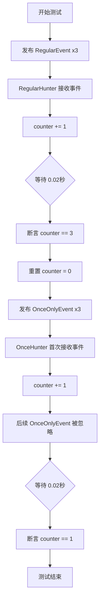
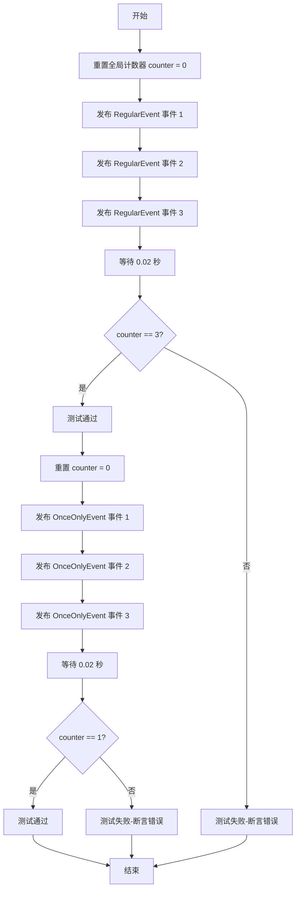
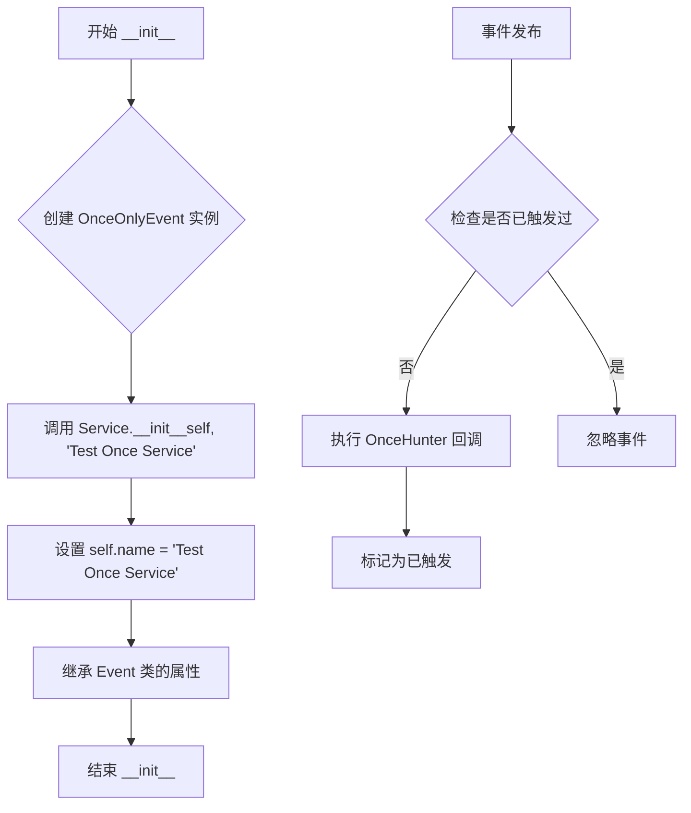
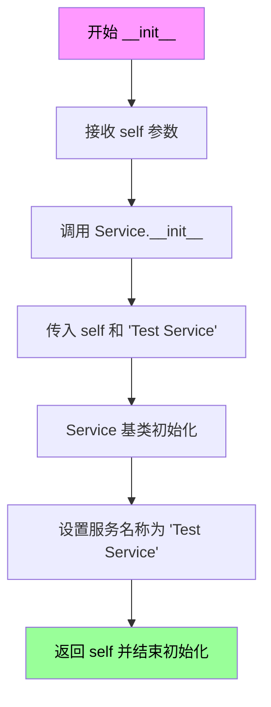
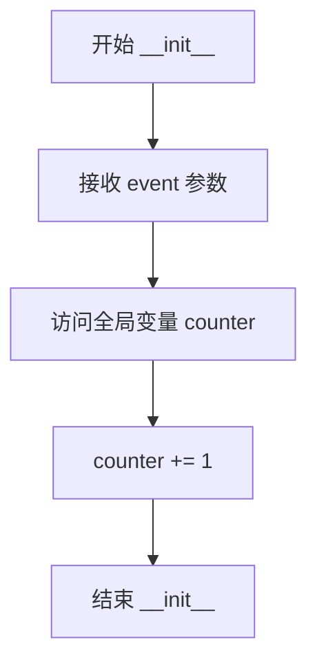
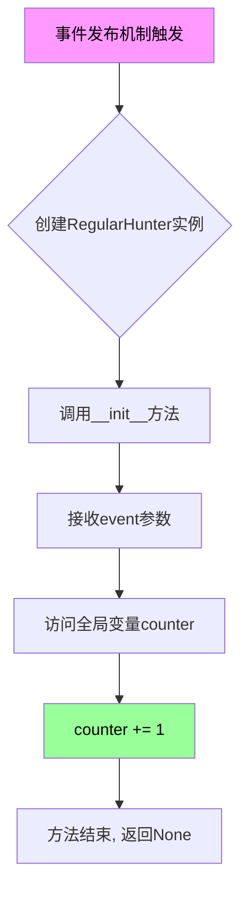
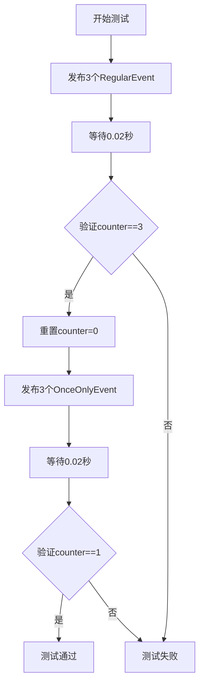

# `kubehunter\tests\core\test_subscribe.py` 详细设计文档

This code is a test module for kube-hunter's event subscription mechanism, demonstrating the difference between regular event handlers that trigger on every event publication and 'once-only' handlers that only trigger once even when the same event is published multiple times.

## 整体流程



## 类结构

```
Hunter (抽象基类)
├── OnceHunter (OnceOnlyEvent 订阅者)
└── RegularHunter (RegularEvent 订阅者)

Event (事件基类)
├── Service (服务基类)
│   ├── OnceOnlyEvent (一次性事件)
│   └── RegularEvent (常规事件)
```

## 全局变量及字段


### `counter`
    
全局计数器，用于记录事件处理的总次数

类型：`int`
    


### `OnceHunter.event`
    
OnceHunter类的事件字段，存储传入的OnceOnlyEvent类型事件对象

类型：`OnceOnlyEvent`
    


### `RegularHunter.event`
    
RegularHunter类的事件字段，存储传入的RegularEvent类型事件对象

类型：`RegularEvent`
    
    

## 全局函数及方法


### `test_subscribe_mechanism`

该函数用于测试 kube-hunter 事件订阅机制的核心功能，验证普通订阅（`subscribe`）与一次性订阅（`subscribe_once`）的行为差异，确保事件发布后对应的 Hunter 处理器能够正确触发。

参数： 无

返回值：`None`，无返回值

#### 流程图



#### 带注释源码

```python
def test_subscribe_mechanism():
    """
    测试事件订阅机制的核心功能
    验证普通订阅（subscribe）与一次性订阅（subscribe_once）的行为差异
    """
    global counter  # 引用全局计数器，用于记录事件触发次数

    # ---------- 测试普通订阅机制 ----------
    # 发布 3 次 RegularEvent 事件
    # 每次发布都会触发所有订阅了该事件的 Handler（RegularHunter）
    handler.publish_event(RegularEvent())  # 第 1 次发布，触发 RegularHunter，counter +1
    handler.publish_event(RegularEvent())  # 第 2 次发布，触发 RegularHunter，counter +1
    handler.publish_event(RegularEvent())  # 第 3 次发布，触发 RegularHunter，counter +1

    time.sleep(0.02)  # 等待异步事件处理完成（0.02秒）
    assert counter == 3  # 验证普通订阅每次发布都会触发，counter 应为 3
    counter = 0  # 重置计数器，为下一次测试做准备

    # ---------- 测试一次性订阅机制 ----------
    # subscribe_once 装饰器确保 Handler 只会被触发一次，后续发布不再触发
    handler.publish_event(OnceOnlyEvent())  # 第 1 次发布，触发 OnceHunter，counter +1
    handler.publish_event(OnceOnlyEvent())  # 第 2 次发布，不触发（已订阅一次）
    handler.publish_event(OnceOnlyEvent())  # 第 3 次发布，不触发（已订阅一次）

    time.sleep(0.02)  # 等待异步事件处理完成
    # 一次性订阅只触发一次，所以 counter 应该等于 1
    assert counter == 1
```


### OnceOnlyEvent.__init__

这是`OnceOnlyEvent`类的构造函数，用于初始化一个一次性事件对象。该类继承自`Service`和`Event`，通过调用父类`Service`的初始化方法设置服务名称为"Test Once Service"，并利用事件处理器的`subscribe_once`装饰器实现事件仅被触发一次的功能。

参数：

- `self`：对象实例，Python自动传递的隐含参数，表示当前创建的`OnceOnlyEvent`实例本身

返回值：`None`，构造函数不返回任何值，仅完成对象初始化

#### 流程图



#### 带注释源码

```python
class OnceOnlyEvent(Service, Event):
    """
    OnceOnlyEvent类：一次性事件类
    继承自Service和Event，用于测试subscribe_once机制
    该事件类型的处理器只会执行一次，即使事件被发布多次
    """
    
    def __init__(self):
        """
        构造函数：初始化OnceOnlyEvent实例
        调用父类Service的初始化方法，设置服务名称
        """
        # 调用多重继承中Service类的__init__方法
        # 传入self和事件名称"Test Once Service"
        # Service.__init__会设置self.name属性
        Service.__init__(self, "Test Once Service")
        
        # Event类的初始化由Python的MRO机制自动处理
        # 该事件对象会被事件处理器监听
        # 由于使用了@subscribe_once装饰器，处理器只会执行一次
```


### `RegularEvent.__init__`

该方法是`RegularEvent`类的构造函数，用于初始化测试用的事件对象。它继承自`Service`和`Event`类，在初始化时设置服务的名称为"Test Service"，作为kube-hunter框架中用于测试普通订阅发布机制的事件类型。

参数：

- `self`：`RegularEvent`，类的实例本身，代表当前创建的事件对象

返回值：`None`，`__init__`方法不返回值，用于初始化对象状态

#### 流程图



#### 带注释源码

```python
class RegularEvent(Service, Event):
    """测试用的事件类，继承自Service和Event多重继承"""
    
    def __init__(self):
        """
        RegularEvent类的构造函数
        
        初始化过程：
        1. 调用Service基类的初始化方法
        2. 设置服务名称为 'Test Service'
        3. 使事件对象具备Service和Event的所有特性
        """
        # 调用Service类的__init__方法，传入实例self和服务名称"Test Service"
        # Service类负责设置事件的_service_name属性
        Service.__init__(self, "Test Service")
        
        # Event基类的__init__会由多重继承机制自动调用
        # 此处未显式调用Event.__init__，因为MRO会处理
```

#### 设计说明

| 项目 | 说明 |
|------|------|
| **设计目标** | 创建一个可被订阅的测试事件类，用于验证kube-hunter的事件发布/订阅机制 |
| **继承结构** | 采用多重继承（Service + Event），Service提供服务标识，Event提供事件基类能力 |
| **使用场景** | 在`test_subscribe_mechanism()`函数中与`RegularHunter`配合，测试普通订阅机制（可多次触发） |
| **对比类** | `OnceOnlyEvent`使用`@handler.subscribe_once`装饰器，只触发一次；`RegularEvent`使用`@handler.subscribe`，每次发布都触发 |


### `OnceHunter.__init__`

该方法是 `OnceHunter` 类的构造函数，用于初始化一次性事件订阅者。当 `OnceHunter` 被实例化时，会将全局计数器 `counter` 加 1，用于记录该Hunter类被触发的次数。由于使用了 `@handler.subscribe_once` 装饰器，无论发布多少次 `OnceOnlyEvent` 事件，该Hunter仅会被实例化一次。

参数：

- `event`：`Any`（具体类型取决于事件系统），传入的事件对象，触发该Hunter订阅的事件实例

返回值：`None`，无返回值（构造函数）

#### 流程图



#### 带注释源码

```python
@handler.subscribe_once(OnceOnlyEvent)  # 装饰器：声明该类只订阅一次OnceOnlyEvent事件
class OnceHunter(Hunter):  # 继承自Hunter基类
    def __init__(self, event):
        """
        OnceHunter的构造函数
        
        参数:
            event: 触发该Hunter的事件对象，此处为OnceOnlyEvent实例
        """
        global counter  # 声明使用全局变量counter
        counter += 1   # 全局计数器加1，记录该Hunter被实例化的次数
```


### `RegularHunter.__init__`

该方法是 `RegularHunter` 类的构造函数，用于初始化定期订阅者。当事件被发布时，事件处理器会创建 `RegularHunter` 实例并调用此方法，将全局计数器递增以记录事件触发的次数。

参数：

- `event`：`RegularEvent`，由事件发布机制传递的事件对象，用于触发该Hunter的执行

返回值：`None`，Python 构造函数不返回任何值

#### 流程图



#### 带注释源码

```python
@handler.subscribe(RegularEvent)  # 装饰器：订阅RegularEvent事件
class RegularHunter(Hunter):       # 继承自Hunter基类
    def __init__(self, event):     # 初始化方法，接收event参数
        """
        RegularHunter的构造函数
        
        参数:
            event: RegularEvent实例，由事件发布机制传递
        """
        global counter              # 声明使用全局变量counter
        counter += 1               # 全局计数器加1，记录事件触发次数
        # 该Hunter每次收到RegularEvent都会被实例化并执行
        # 因此counter会累加，反映事件被触发的总次数
```

## 关键组件


### counter
全局计数器，用于记录事件处理器被触发的次数。

### OnceOnlyEvent
一次性事件类，继承自Service和Event，发布后只触发一次对应的处理器。

### RegularEvent
常规事件类，继承自Service和Event，每次发布都会触发对应的处理器。

### OnceHunter
一次性 hunter 类，通过 @handler.subscribe_once 装饰器订阅 OnceOnlyEvent，确保只执行一次。

### RegularHunter
常规 hunter 类，通过 @handler.subscribe 装饰器订阅 RegularEvent，每次事件发布都会执行。

### handler
事件管理器，负责事件的发布、订阅以及触发对应的处理器。

### test_subscribe_mechanism
测试函数，用于验证 subscribe 和 subscribe_once 装饰器的事件订阅机制是否正常工作。


## 问题及建议


### 已知问题

-   **全局变量状态管理**：使用全局变量 `counter` 跟踪事件处理次数，在多线程或并发场景下存在竞态条件风险，且难以进行单元测试隔离
-   **硬编码等待时间**：使用 `time.sleep(0.02)` 等待异步事件处理完成，时间值依赖经验估计，在不同性能环境下可能导致测试不稳定
-   **缺少类型注解**：所有类方法和函数均未提供类型提示，降低了代码的可读性和 IDE 辅助能力
-   **测试函数副作用**：测试函数直接修改全局 `counter` 变量，虽然有重置逻辑，但未考虑测试间的状态污染问题
-   **缺乏错误处理**：事件发布和处理流程中未实现异常捕获与错误日志记录机制
-   **subscribe_once 机制不透明**：装饰器的内部实现逻辑未在代码中体现，可能存在内存泄漏或状态残留风险

### 优化建议

-   **状态管理重构**：将 counter 封装为测试类的实例属性或使用独立的测试辅助类，避免全局状态
-   **同步机制替代**：使用事件循环的回调机制、Future 或 asyncio.Event 替代 sleep 轮询
-   **添加类型注解**：为所有方法参数和返回值添加类型提示，如 `def __init__(self, event: OnceOnlyEvent) -> None`
-   **测试隔离**：使用 pytest fixture 或 setUp/tearDown 方法管理测试状态生命周期
-   **增强错误处理**：为事件发布和处理添加 try-except 块，并记录详细错误日志
-   **补充边界测试**：增加并发事件、异常事件、重复订阅等边界场景的测试覆盖

## 其它


### 设计目标与约束

本测试代码旨在验证kube-hunter事件订阅机制中普通订阅（subscribe）与一次性订阅（subscribe_once）的行为差异。设计目标包括：1）确认普通订阅在每次事件发布时都会被触发；2）验证一次性订阅仅在首次事件发布时触发，后续发布不触发处理逻辑；3）通过全局计数器验证触发次数的正确性。约束条件：依赖kube-hunter框架的事件处理系统，需要在事件循环中执行测试。

### 错误处理与异常设计

代码中主要使用assert语句进行断言验证。当counter值与预期不符时，会抛出AssertionError异常，表明订阅机制未按预期工作。在实际测试中，如果subscribe_once机制失效，counter将等于3而非1，测试会失败并提示订阅机制存在问题。异常信息会明确指出是订阅次数不正确，帮助快速定位问题。

### 数据流与状态机

数据流：handler.publish_event()发布事件 -> 事件分发至对应订阅者 -> OnceHunter或RegularHunter的__init__方法执行 -> counter全局变量递增。状态机主要涉及事件处理状态：RegularEvent处理无状态限制，每次发布都触发；OnceOnlyEvent处理存在内部状态标记，首次处理后标记为已处理，后续事件被过滤。

### 外部依赖与接口契约

外部依赖：1）kube_hunter.core.types.Hunter：猎人基类，所有Hunter需继承此类；2）kube_hunter.core.events.types.Event和Service：事件类型，Service继承自Event；3）kube_hunter.core.events.handler：事件处理器，提供publish_event()发布方法和subscribe()/subscribe_once()订阅方法。接口契约：subscribe(event_class)接受事件类参数，返回订阅器对象；subscribe_once(event_class)同样接受事件类参数，返回一次性订阅器；publish_event(event_instance)接受事件实例，触发对应订阅者的回调执行。

### 核心逻辑流程图



### 测试场景覆盖

本测试覆盖两个核心场景：1）普通订阅场景：验证多次发布同一事件类型时，订阅者方法会被多次调用，用于测试重复事件处理能力；2）一次性订阅场景：验证多次发布同一事件类型时，订阅者方法仅在首次发布时被调用，用于测试事件去重或单次触发机制。两个场景共同验证了订阅机制的正确性和可靠性。

### 性能考量

代码中使用time.sleep(0.02)等待事件处理完成，这是必要的同步机制，因为事件处理可能是异步的。0.02秒的等待时间在测试环境中是合理的，既能保证事件处理完成，又不会显著影响测试执行速度。性能优化建议：可考虑使用事件处理的回调机制或Promise模式替代固定时间等待，提高测试效率和准确性。

### 并发安全性

当前实现使用全局变量counter进行计数，存在潜在的并发安全问题。在多线程或异步环境下，多个Hunter同时执行可能导致counter值不准确。改进建议：1）使用线程锁保护counter的读写操作；2）使用原子操作或线程安全的数据结构；3）在测试框架中提供线程安全的计数器工具类。

### 框架集成说明

本代码作为kube-hunter框架的集成测试，需要在框架运行环境下执行。测试通过说明框架的事件发布-订阅机制正常工作，包括：1）事件类型的正确注册和识别；2）订阅关系的正确建立和维护；3）事件分发到对应订阅者的正确路由；4）一次性订阅的内部状态管理机制正常工作。

    