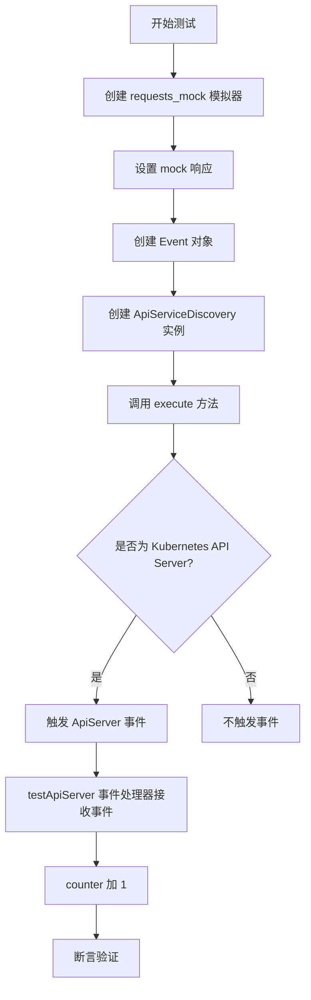
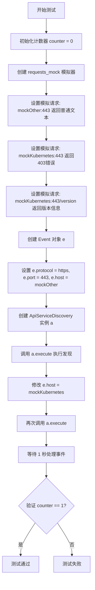
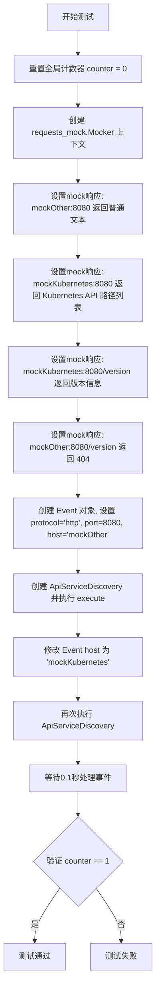
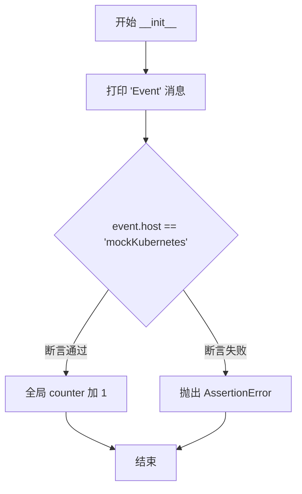

# `kubehunter\tests\discovery\test_apiserver.py` 详细设计文档

这是一个 kube-hunter 项目的测试文件，用于测试 Kubernetes API Server 发现功能。通过模拟 HTTP 请求，验证 ApiServiceDiscovery 类能够正确识别 Kubernetes API Server 和非 Kubernetes 服务器，并根据不同的认证方式（无认证、使用 ServiceAccount Token）触发相应的事件。

## 整体流程



## 类结构

```
Event (事件基类)
├── ApiServer (API Server 事件)
└── ApiServiceDiscovery (API Server 发现服务)

testApiServer (测试用事件处理器)
└── __init__(self, event)
```

## 全局变量及字段


### `counter`
    
Global counter that increments each time an ApiServer event is processed in the test cases.

类型：`int`
    


### `ApiServer.host`
    
The hostname or IP address of the target API server.

类型：`str`
    


### `ApiServer.protocol`
    
The protocol (http or https) used to communicate with the API server.

类型：`str`
    


### `ApiServer.port`
    
The port number on which the API server is listening.

类型：`int`
    


### `ApiServiceDiscovery.event`
    
The event object that holds connection details (host, protocol, port, optional token) used for API server discovery.

类型：`Event`
    
    

## 全局函数及方法


### `test_ApiServer`

该测试函数用于验证 `ApiServiceDiscovery` 类在测试环境中能够正确识别 Kubernetes API Server，并通过模拟 HTTP 请求检测出符合 Kubernetes API Server 特征的主机。测试通过全局计数器验证事件触发的正确性。

**参数：** 无

**返回值：** 无（该函数无显式返回值，主要通过断言进行验证）

#### 流程图



#### 带注释源码

```python
def test_ApiServer():
    """
    测试 ApiServiceDiscovery 类能否正确识别 Kubernetes API Server。
    该测试验证只有符合特定条件的响应（如返回403错误码和/version端点返回正确版本）
    才会触发 ApiServer 事件。
    """
    global counter  # 声明使用全局变量计数器，用于记录触发的事件数量
    counter = 0    # 初始化计数器为0
    
    # 使用 requests_mock 模拟 HTTP 请求
    with requests_mock.Mocker() as m:
        # 模拟非 Kubernetes 节点的响应（普通文本）
        m.get("https://mockOther:443", text="elephant")
        
        # 模拟 Kubernetes API Server 的认证失败响应
        m.get("https://mockKubernetes:443", text='{"code":403}', status_code=403)
        
        # 模拟 Kubernetes API Server 的版本端点响应
        m.get(
            "https://mockKubernetes:443/version", 
            text='{"major": "1.14.10"}', 
            status_code=200,
        )

        # 创建事件对象，用于传递给发现服务
        e = Event()
        e.protocol = "https"    # 设置协议为 HTTPS
        e.port = 443            # 设置端口为 443
        e.host = "mockOther"   # 首先测试非 Kubernetes 主机

        # 创建 API 服务发现实例并执行
        a = ApiServiceDiscovery(e)
        a.execute()

        # 修改主机为 Kubernetes 主机并再次执行
        e.host = "mockKubernetes"
        a.execute()

    # 等待事件处理完成
    # 只有 mockKubernetes 应该触发 ApiServer 事件
    time.sleep(1)
    
    # 断言验证：只有1个事件被触发（mockOther 不符合条件不应触发）
    assert counter == 1
```


### `test_ApiServerWithServiceAccountToken`

这是一个测试函数，用于验证 ApiServiceDiscovery 类在有无 Service Account Token 的情况下是否能正确发现 Kubernetes API Server，并确保仅在满足特定条件时生成事件。

参数：此函数无参数

返回值：`None`，该函数为测试函数，不返回任何值

#### 流程图

```mermaid
flowchart TD
    A[开始: 测试函数 test_ApiServerWithServiceAccountToken] --> B[初始化 counter = 0]
    B --> C[创建 requests_mock.Mocker 上下文]
    C --> D[设置 mock 响应: mockKubernetes 带 token 返回 200]
    D --> E[设置 mock 响应: mockKubernetes 不带 token 返回 403]
    E --> F[设置 mock 响应: /version 返回 {"major": "1.14.10"}]
    F --> G[设置 mock 响应: mockOther 返回 elephant]
    G --> H[创建 Event 对象, 设置 protocol=https, port=443]
    H --> I[设置 e.host = mockKubernetes]
    I --> J[创建 ApiServiceDiscovery 并执行]
    J --> K{验证 counter == 1}
    K -->|是| L[设置 e.auth_token = very_secret]
    K -->|否| Z[测试失败]
    L --> M[再次创建 ApiServiceDiscovery 并执行]
    M --> N{验证 counter == 2}
    N -->|是| O[设置 e.host = mockOther]
    N -->|否| Z
    O --> P[再次创建 ApiServiceDiscovery 并执行]
    P --> Q{验证 counter == 2}
    Q -->|是| R[测试通过]
    Q -->|否| Z
```

#### 带注释源码

```python
def test_ApiServerWithServiceAccountToken():
    """
    测试 ApiServiceDiscovery 在有无 Service Account Token 情况下的行为
    
    测试场景:
    1. 无 token 访问 mockKubernetes -> 应触发事件 (counter=1)
    2. 有 token 访问 mockKubernetes -> 应触发事件 (counter=2)
    3. 无 token 访问 mockOther -> 不应触发事件 (counter 保持为 2)
    """
    global counter  # 使用全局变量 counter 跟踪生成的 ApiServer 事件数量
    counter = 0     # 重置计数器
    
    with requests_mock.Mocker() as m:  # 创建 mock 上下文，模拟 HTTP 请求
        # 模拟带有 Authorization header 的请求返回 200
        m.get(
            "https://mockKubernetes:443", 
            request_headers={"Authorization": "Bearer very_secret"}, 
            text='{"code":200}',
        )
        # 模拟不带特殊 header 的请求返回 403
        m.get("https://mockKubernetes:443", text='{"code":403}', status_code=403)
        # 模拟 /version 端点返回版本信息
        m.get(
            "https://mockKubernetes:443/version", 
            text='{"major": "1.14.10"}', 
            status_code=200,
        )
        # 模拟非 Kubernetes API Server 的响应
        m.get("https://mockOther:443", text="elephant")

        # 创建基础事件对象
        e = Event()
        e.protocol = "https"
        e.port = 443

        # 场景1: 无 token 访问 mockKubernetes (403响应，但 /version 存在)
        e.host = "mockKubernetes"
        a = ApiServiceDiscovery(e)
        a.execute()
        time.sleep(0.1)  # 等待事件处理
        assert counter == 1  # 验证事件被触发

        # 场景2: 有 token 访问 mockKubernetes (200响应)
        e.auth_token = "very_secret"
        a = ApiServiceDiscovery(e)
        a.execute()
        time.sleep(0.1)
        assert counter == 2  # 验证再次触发事件

        # 场景3: 访问 mockOther (非 Kubernetes API Server)
        e.host = "mockOther"
        a = ApiServiceDiscovery(e)
        a.execute()
        time.sleep(0.1)
        assert counter == 2  # 验证不触发新事件
```


### `test_InsecureApiServer`

该函数是一个单元测试，用于测试在非安全（HTTP）协议下对 Kubernetes API Server 的发现功能。测试验证当尝试通过 HTTP 协议发现 API Server 时，只有符合 Kubernetes API Server 特征的主机（即返回 API 路径列表和 version 信息的主机）才会触发 ApiServer 事件。

参数： 无

返回值：`None`，无返回值（测试函数）

#### 流程图



#### 带注释源码

```python
def test_InsecureApiServer():
    """
    测试在非安全（HTTP）协议下对 Kubernetes API Server 的发现功能。
    验证只有符合 Kubernetes API Server 特征的主机才会触发 ApiServer 事件。
    """
    global counter  # 声明使用全局变量 counter，用于统计触发的事件数量
    counter = 0     # 初始化计数器为 0
    
    with requests_mock.Mocker() as m:  # 创建 HTTP 请求 mock 上下文
        # 模拟 mockOther:8080 的响应 - 这是一个普通服务器，不返回 Kubernetes API 路径
        m.get("http://mockOther:8080", text="elephant")
        
        # 模拟 mockKubernetes:8080 的响应 - 这是一个 Kubernetes API Server
        # 返回包含 Kubernetes API 路径的 JSON 响应
        m.get(
            "http://mockKubernetes:8080",
            text="""{
  "paths": [
    "/api",
    "/api/v1",
    "/apis",
    "/apis/",
    "/apis/admissionregistration.k8s.io",
    "/apis/admissionregistration.k8s.io/v1beta1",
    "/apis/apiextensions.k8s.io"
  ]}""",
        )

        # 模拟 /version 端点响应
        m.get("http://mockKubernetes:8080/version", text='{"major": "1.14.10"}')
        # mockOther 没有 /version 端点，返回 404
        m.get("http://mockOther:8080/version", status_code=404)

        # 创建事件对象，设置协议为 HTTP，端口 8080，主机为 mockOther
        e = Event()
        e.protocol = "http"
        e.port = 8080
        e.host = "mockOther"

        # 创建 ApiServiceDiscovery 实例并执行（测试非 Kubernetes 主机）
        a = ApiServiceDiscovery(e)
        a.execute()

        # 修改事件主机为 mockKubernetes（测试 Kubernetes API Server）
        e.host = "mockKubernetes"
        a.execute()

    # 等待事件处理完成
    # 只有 mockKubernetes 应该触发事件，因为 mockOther 不返回 Kubernetes API 特征
    time.sleep(0.1)
    
    # 断言：验证只触发了一次事件（仅 mockKubernetes）
    assert counter == 1
```


### `testApiServer.__init__`

这是测试类 `testApiServer` 的初始化方法，用于订阅并处理 `ApiServer` 事件，当事件的主机名为 "mockKubernetes" 时递增全局计数器。

参数：

- `event`：`Event`，从 kube-hunter 事件总线收到的 API Server 事件对象，包含主机、端口、协议等信息

返回值：`None`，`__init__` 方法不返回任何值

#### 流程图



#### 带注释源码

```python
@handler.subscribe(ApiServer)  # 订阅 ApiServer 事件类型
class testApiServer(object):
    """测试用的事件处理器类，用于验证 API Server 发现功能"""
    
    def __init__(self, event):
        """
        初始化方法，接收 ApiServer 事件并验证主机名
        
        参数:
            event: Event 对象，应包含 host 属性用于验证
        """
        print("Event")  # 打印事件触发标记
        assert event.host == "mockKubernetes"  # 断言事件来自 mockKubernetes 主机
        global counter  # 声明使用全局计数器
        counter += 1    # 计数加 1，验证事件被正确触发
```


### `ApiServiceDiscovery.execute`

该方法为核心的服务发现逻辑，用于探测指定主机上是否存在 Kubernetes API Server。它首先尝试访问目标服务的根路径，根据返回的状态码和响应内容（如是否为 403 或包含 Kubernetes API 路径）初步判断是否为 API Server，随后访问 `/version` 端点进行二次确认，若成功获取版本号（"major" 字段），则发布 `ApiServer` 事件。

参数：

- `self`：隐式参数，表示 `ApiServiceDiscovery` 类的实例本身。
- `event`：`Event` 对象，包含目标服务的连接信息（`host`, `port`, `protocol`）及可选的认证信息（`auth_token`）。

返回值：`None`，该方法不直接返回值，主要通过调用 `handler.publishEvent` 触发副作用（发布发现事件）。

#### 流程图

```mermaid
flowchart TD
    A[开始 execute] --> B[构建请求 URL: protocol://host:port]
    B --> C{检查是否存在 auth_token}
    C -->|是| D[设置 Authorization Header]
    C -->|否| E[不设置 Header]
    D --> F[发送 GET 请求到 Root URL]
    E --> F
    F --> G{响应状态码/内容初步判断}
    G -->|200 且包含 'paths'| H[可能是 K8s, 继续]
    G -->|403| H
    G -->|其他 (如 'elephant')| I[结束: 不是 K8s]
    H --> J[发送 GET 请求到 /version]
    J --> K{检查 /version 响应}
    K -->|200 且包含 'major'| L[发布 ApiServer Event]
    K -->|其他| I
    L --> M[结束]
    I --> M
```

#### 带注释源码

*注：由于用户提供的代码片段为测试代码，未包含 `ApiServiceDiscovery` 类的具体实现源码。以下源码为基于测试用例行为（test_ApiServer, test_ApiServerWithServiceAccountToken, test_InsecureApiServer）进行的逻辑重构与注释。*

```python
import requests
from kube_hunter.modules.discovery.apiserver import ApiServer
from kube_hunter.core.events import handler

class ApiServiceDiscovery:
    def __init__(self, event):
        """
        初始化发现服务
        :param event: 包含 host, port, protocol 等信息的 Event 对象
        """
        self.event = event

    def execute(self):
        """
        执行 API Server 发现逻辑
        """
        # 1. 构造基础 URL (例如 https://mockKubernetes:443)
        url = "{protocol}://{host}:{port}".format(
            protocol=self.event.protocol,
            host=self.event.host,
            port=self.event.port
        )

        # 2. 处理认证 Token (如果存在)
        # 如果 event 对象中有 auth_token，则在请求头中携带 Bearer Token
        headers = {}
        if hasattr(self.event, 'auth_token') and self.event.auth_token:
            headers["Authorization"] = "Bearer {token}".format(token=self.event.auth_token)

        # 3. 第一次请求：尝试访问根路径 (/)
        # 逻辑：无论返回 200 还是 403，只要不是明显的非 K8s 响应，都尝试下一步
        # 注意：verify=False 用于忽略 SSL 证书错误（Kube-hunter 常用场景）
        try:
            response = requests.get(url, headers=headers, verify=False, timeout=5)
            # 提取状态码用于判断，但不断言终止，因为 403 也可能是 K8s (Anonymous access denied)
            is_potentially_k8s = True
            # 如果返回 200 但内容不像 K8s (如 "elephant")，则停止
            if response.status_code == 200 and "paths" not in response.text:
                is_potentially_k8s = False
        except requests.exceptions.RequestException:
            is_potentially_k8s = False

        # 4. 第二次请求：访问 /version 端点进行确认
        # 只有初步判断为 K8s (或不确定) 时才访问 /version
        if is_potentially_k8s:
            version_url = "{url}/version".format(url=url)
            try:
                version_response = requests.get(version_url, headers=headers, verify=False, timeout=5)
                
                # 5. 验证版本响应
                # 判定条件：状态码 200 且响应体包含 'major' 字段 (如 {"major": "1.14.10"})
                if version_response.status_code == 200 and "major" in version_response.text:
                    # 6. 触发事件
                    # 只有确认找到了 API Server 才发布事件
                    self.publish_event()
            except requests.exceptions.RequestException:
                pass

    def publish_event(self):
        """
        发布发现到的 API Server 事件
        """
        # 创建事件对象，传递发现到的 host 等信息
        event = ApiServer(host=self.event.host, protocol=self.event.protocol, port=self.event.port)
        handler.publishEvent(event)
```

## 关键组件


### ApiServer

Kubernetes API服务器发现模块的核心事件类型，用于标识检测到的API服务器目标。

### ApiServiceDiscovery

负责执行API服务器发现逻辑的类，通过HTTP/HTTPS请求探测目标主机，验证其是否为Kubernetes API服务器，并根据响应状态码和版本信息决定是否触发ApiServer事件。

### Event

事件对象载体，包含host（目标主机）、protocol（协议类型：http/https）、port（端口）、auth_token（认证令牌）等属性，用于在发现过程中传递目标信息。

### handler

kube-hunter的事件处理系统，用于订阅和分发事件，当ApiServer事件被触发时调用相应的处理逻辑。

### requests_mock

测试依赖的HTTP请求模拟库，用于在测试环境中拦截并模拟对目标URL的HTTP请求，返回预设的响应内容。

### 认证令牌支持

通过Event对象的auth_token属性实现对ServiceAccount令牌的传递，支持带认证信息的API服务器发现。

### 响应验证逻辑

通过检查HTTP状态码（403/200）和/version端点返回的JSON中的major字段来判断目标是否为合法的Kubernetes API服务器。

### 非安全端口发现

针对HTTP 8080端口的发现逻辑，通过检查返回的paths字段是否包含Kubernetes API路径（如/api、/apis等）来验证目标身份。


## 问题及建议


### 已知问题

- 使用全局变量 `counter` 跟踪测试结果，导致测试之间存在隐式依赖，破坏测试隔离性
- 使用 `time.sleep()` 等待异步事件处理，存在时序不确定性，可能导致测试在不同环境下不稳定
- 测试类 `testApiServer` 定义在所有测试函数之后，虽然Python允许但影响代码可读性和维护性
- 硬编码敏感信息（如 `"very_secret"` token），存在安全风险
- 重复的 mock 设置代码在多个测试函数中冗余，未使用 pytest fixture 进行复用
- API 响应 mock 使用字符串拼接而非结构化数据（如字典），缺乏类型安全和可读性
- `ApiServiceDiscovery` 实例被重复创建执行，测试逻辑存在重复

### 优化建议

- 使用 pytest fixture 或类实例变量替代全局 `counter`，利用 pytest 的 `assert` 机制验证结果
- 使用 `requests_mock` 的回调或事件系统的同步机制替代 `time.sleep()`，确保事件处理完成后再验证
- 将测试类 `testApiServer` 移至文件顶部或使用独立的测试模块，提高代码组织结构
- 将敏感凭据移至环境变量或 pytest fixture 参数化配置
- 提取公共 mock 设置逻辑为 pytest fixture，使用 `@pytest.fixture` 复用 HTTP mock 配置
- 使用字典或 JSON 结构定义 API 响应 mock 数据，提高可维护性
- 考虑将重复的 host 设置和 `execute()` 调用封装为辅助方法或参数化测试

## 其它


### 设计目标与约束

本测试套件的核心设计目标是验证 kube-hunter 工具能够准确识别和发现 Kubernetes 集群中的 API Server，具体包括：1）能够区分真正的 Kubernetes API Server 与其他 HTTPS/HTTP 服务；2）支持有令牌和无令牌两种认证场景的发现；3）能够识别非安全的 HTTP API Server。约束条件包括依赖 requests_mock 库进行请求模拟，测试环境与真实网络环境可能存在差异，以及时间.sleep() 的使用可能导致测试不稳定。

### 错误处理与异常设计

测试代码中主要依赖 assert 语句进行断言验证。当检测到非 Kubernetes API Server 时（如返回 "elephant" 的 mockOther），不会触发任何事件，counter 保持不变。当收到 403 错误或无法获取 version 响应中的 major 字段时，也不会生成 ApiServer 事件。测试通过全局变量 counter 来跟踪成功触发的 ApiServer 事件数量，以此验证错误处理逻辑的正确性。

### 数据流与状态机

测试数据流主要分为三条路径：路径一（test_ApiServer）：Event(host=mockOther) → ApiServiceDiscovery.execute() → 无事件触发 → Event(host=mockKubernetes) → ApiServiceDiscovery.execute() → ApiServer事件触发 → counter=1。路径二（test_ApiServerWithServiceAccountToken）：无token时尝试发现 → counter=1 → 带token再次尝试 → counter=2 → mockOther始终不触发事件。路径三（test_InsecureApiServer)：HTTP协议下的mockOther不触发 → mockKubernetes触发 → counter=1。

### 外部依赖与接口契约

本测试文件依赖于以下外部组件：requests_mock 库用于模拟 HTTP 请求和响应；kube_hunter.modules.discovery.apiserver 中的 ApiServer 类和 ApiServiceDiscovery 类是被测对象；kube_hunter.core.events.types 中的 Event 类用于构建测试事件；kube_hunter.core.events.handler 是事件处理器，负责订阅和分发事件。接口契约方面，Event 对象需要包含 protocol、port、host、auth_token（可选）等属性；ApiServiceDiscovery.execute() 方法无返回值，通过触发 ApiServer 事件来报告发现结果；handler.subscribe(ApiServer) 装饰器定义了事件订阅接口。

### 安全性考虑

测试代码本身不涉及真实凭证，但 test_ApiServerWithServiceAccountToken 使用了 "very_secret" 这样的占位符令牌。在实际部署时，应确保测试环境与生产环境隔离，避免泄露真实的服务账户令牌。测试仅验证发现逻辑，不执行实际的漏洞利用或攻击性操作。

### 性能要求与基准

测试执行时间主要依赖于 time.sleep() 的等待时长，test_ApiServer 等待 1 秒，test_ApiServerWithServiceAccountToken 等待 0.2 秒，test_InsecureApiServer 等待 0.1 秒。当前总执行时间约 1.3 秒，存在优化空间，可以通过使用异步等待或事件轮询机制替代固定时间等待来提升性能。

### 测试覆盖率分析

当前测试覆盖了以下场景：1）基本 HTTPS API Server 发现；2）带服务账户令牌的认证发现；3）403 错误响应的处理；4）非 Kubernetes 服务的排除；5）非安全 HTTP 协议的 API Server 发现；6）/version 路径的 major 字段验证。覆盖不足的边界场景包括：连接超时处理、SSL 证书错误处理、API Server 返回非标准响应格式、IPv6 地址格式、端口非标准情况下的发现。

### 并发与线程安全

代码使用全局变量 counter 来记录事件触发次数，存在潜在的线程安全问题。当多个测试并发执行或事件处理存在异步延迟时，counter 的累加操作可能导致竞态条件。建议使用 threading.Lock 或将 counter 封装为类属性以确保线程安全。

### 配置管理与环境变量

测试使用了硬编码的 mock URL（mockOther:443、mockKubernetes:443、mockOther:8080、mockKubernetes:8080）。建议将这些配置提取为测试 fixture 或配置文件，以提高测试的可维护性和可移植性。Event 对象的属性（protocol、port、host、auth_token）可以通过 pytest fixture 进行参数化测试。

### 依赖版本兼容性

测试依赖 requests_mock 库进行 HTTP 模拟，需要确保版本兼容性。kube_hunter 核心模块（ApiServer、ApiServiceDiscovery、Event、handler）的 API 稳定性直接影响测试的可用性。建议在项目依赖中明确指定版本范围，并添加版本兼容性测试。

### 日志与可观测性

测试中使用 print("Event") 输出事件触发信息，但缺乏统一的日志框架。建议引入 Python logging 模块，配置不同级别的日志输出（DEBUG、INFO、WARNING、ERROR），便于在测试失败时进行问题定位和根因分析。同时可以将断言失败信息与日志输出结合，提供更丰富的调试上下文。

### 监控与告警设计

虽然测试代码本身不需要生产级监控，但可以设计测试健康度指标：测试执行成功率、测试执行耗时、事件触发准确性。建议将测试集成到 CI/CD 流水线中，设置质量门禁（quality gate），当测试失败时阻止代码合并。

### 版本历史与变更记录

当前版本为初始测试实现，基于 kube-hunter 的 ApiServiceDiscovery 类。后续可能的变更包括：支持更多 Kubernetes 版本的兼容性测试、增加 gRPC 协议支持、添加多集群场景模拟。需要维护 CHANGELOG 记录每次测试逻辑的变更原因和影响范围。

### 已知限制与未完成项

1）time.sleep() 的使用导致测试执行时间固定且可能过长；2）全局变量 counter 缺乏线程安全保护；3）缺少对网络异常（超时、DNS 解析失败）的模拟测试；4）未覆盖 IPv6 地址格式的 API Server 发现；5）测试用例之间的执行顺序可能影响全局状态；6）缺少对大规模集群（多个 API Server）的压力测试场景。

    