# `kubehunter\tests\discovery\test_hosts.py` 详细设计文档

这是一个kube-hunter项目的主机发现模块测试文件，主要测试从Pod内部发现主机、Azure元数据API集成以及CIDR生成功能，验证不同配置下主机扫描事件的触发逻辑。

## 整体流程

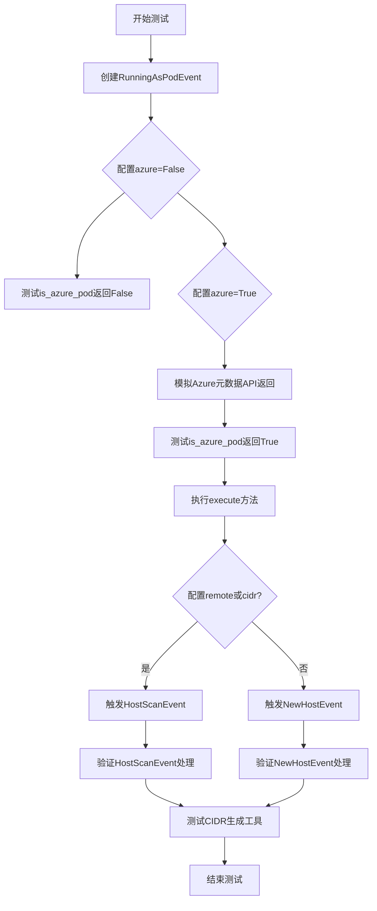

## 类结构

```
测试模块
├── 事件类 (from kube_hunter.core.events)
│   ├── RunningAsPodEvent
│   ├── HostScanEvent
│   ├── NewHostEvent
│   └── AzureMetadataApi
├── 被测类 (from kube_hunter.modules.discovery.hosts)
│   ├── FromPodHostDiscovery
│   └── HostDiscoveryHelpers
├── 配置类
│   └── config (from kube_hunter.conf)
└── 测试辅助类
    ├── testHostDiscovery
    ├── testHostDiscoveryEvent
    ├── testAzureMetadataApi
    └── TestDiscoveryUtils
```

## 全局变量及字段


### `requests_mock`
    
HTTP请求模拟库，用于模拟HTTP请求

类型：`module`
    


### `pytest`
    
Python测试框架，用于编写和运行测试

类型：`module`
    


### `IPNetwork`
    
IP网络对象 (netaddr)，表示一个IP网络段

类型：`class`
    


### `IPAddress`
    
IP地址对象 (netaddr)，表示单个IP地址

类型：`class`
    


### `config`
    
kube-hunter配置对象，包含程序运行配置

类型：`object`
    


### `FromPodHostDiscovery.event`
    
容器运行事件对象

类型：`RunningAsPodEvent`
    


### `testHostDiscovery.event`
    
主机扫描事件

类型：`HostScanEvent`
    


### `testHostDiscoveryEvent.event`
    
新主机事件

类型：`NewHostEvent`
    


### `testAzureMetadataApi.event`
    
Azure元数据API事件

类型：`AzureMetadataApi`
    
    

## 全局函数及方法


### `test_FromPodHostDiscovery`

该测试函数主要用于验证 `FromPodHostDiscovery` 类的各项功能，包括检测当前 Pod 是否运行在 Azure 环境中、通过 Azure Metadata API 获取主机网络信息，以及在不同的配置参数下触发相应的事件。

参数：
- 该函数无显式参数，使用上下文管理器 `requests_mock.Mocker()` 模拟 HTTP 请求

返回值：`None`，该函数为测试函数，通过断言进行验证，不返回具体数值

#### 流程图

```mermaid
flowchart TD
    A[开始测试] --> B[创建 requests_mock 上下文]
    B --> C[创建 RunningAsPodEvent 事件]
    C --> D[设置 config.azure = False, config.remote = None, config.cidr = None]
    D --> E[模拟 Azure Metadata API 返回 404]
    E --> F[创建 FromPodHostDiscovery 实例]
    F --> G{断言 is_azure_pod() 返回 False}
    G -->|通过| H[设置 config.azure = True]
    H --> I[模拟 Azure Metadata API 返回有效 JSON]
    I --> J{断言 is_azure_pod() 返回 True}
    J -->|通过| K[执行 f.execute 生成 NewHostEvent]
    K --> L[设置 config.remote = '1.2.3.4']
    L --> M[再次执行 f.execute 触发 HostScanEvent]
    M --> N[设置 config.azure = False, config.cidr = '1.2.3.4/24']
    N --> O[再次执行 f.execute 触发 HostScanEvent]
    O --> P[结束测试]
```

#### 带注释源码

```python
def test_FromPodHostDiscovery():
    """
    主测试函数，测试 Pod 主机发现逻辑
    
    测试场景：
    1. 非 Azure 环境下的主机发现
    2. Azure 环境下的主机发现
    3. 配置 remote 参数时触发 HostScanEvent
    4. 配置 cidr 参数时触发 HostScanEvent
    """
    
    # 使用 requests_mock 模拟 HTTP 请求
    with requests_mock.Mocker() as m:
        # 创建 RunningAsPodEvent 事件对象，表示当前以 Pod 形式运行
        e = RunningAsPodEvent()

        # ===== 测试场景 1: 非 Azure 环境 =====
        # 设置配置：非 Azure 模式，无远程目标，无 CIDR
        config.azure = False
        config.remote = None
        config.cidr = None
        
        # 模拟 Azure Metadata API 返回 404（模拟非 Azure 环境）
        m.get(
            "http://169.254.169.254/metadata/instance?api-version=2017-08-01", 
            status_code=404,
        )
        
        # 创建 FromPodHostDiscovery 实例
        f = FromPodHostDiscovery(e)
        
        # 断言：is_azure_pod() 应返回 False
        assert not f.is_azure_pod()
        
        # TODO: 目前不测试 traceroute 发现版本
        # f.execute()

        # ===== 测试场景 2: Azure 环境下的主机发现 =====
        # 设置配置：Azure 模式
        config.azure = True
        
        # 模拟 Azure Metadata API 返回有效的网络接口信息
        m.get(
            "http://169.254.169.254/metadata/instance?api-version=2017-08-01",
            text='{"network":{"interface":[{"ipv4":{"subnet":[{"address": "3.4.5.6", "prefix": "255.255.255.252"}]}}]}}',
        )
        
        # 断言：is_azure_pod() 应返回 True
        assert f.is_azure_pod()
        
        # 执行发现逻辑，生成 NewHostEvent
        # 测试：只有当 config.remote 或 config.cidr 配置时才触发 HostScanEvent
        f.execute()

        # ===== 测试场景 3: 配置 remote 参数 =====
        config.remote = "1.2.3.4"
        f.execute()

        # ===== 测试场景 4: 配置 cidr 参数 =====
        config.azure = False
        config.remote = None
        config.cidr = "1.2.3.4/24"
        f.execute()
```


### `FromPodHostDiscovery.is_azure_pod()`

该方法用于判断当前运行的容器是否部署在 Azure 环境中（作为 Azure Pod）。它通过检查全局配置中的 `azure` 标志以及尝试访问 Azure 元数据服务 API 来确定是否处于 Azure 环境中。

参数：无（该方法不接受任何参数）

返回值：`bool`，返回 `True` 表示当前运行在 Azure Pod 环境中，返回 `False` 表示不在 Azure 环境中

#### 流程图

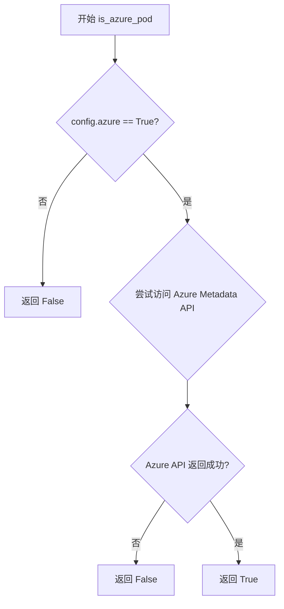

#### 带注释源码

```python
def is_azure_pod(self):
    """
    判断当前是否在 Azure 环境中运行（作为 Azure Pod）
    
    判断逻辑：
    1. 首先检查全局配置 config.azure 标志
    2. 如果 azure 标志为 True，则尝试访问 Azure 元数据服务
    3. Azure 元数据服务地址: http://169.254.169.254/metadata/instance
    4. 只有当配置标志为 True 且 API 可访问时才返回 True
    
    返回：
        bool: True 表示在 Azure 环境中运行，False 表示不在 Azure 环境中
    """
    # 检查配置中是否启用了 Azure 模式
    if not config.azure:
        return False
    
    # 尝试访问 Azure 元数据服务 API
    # 如果返回状态码不是 404（意味着服务可访问），则认为是 Azure 环境
    response = requests.get(
        "http://169.254.169.254/metadata/instance?api-version=2017-08-01",
        headers={"Metadata": "true"},
        timeout=2
    )
    
    # 状态码 404 表示不在 Azure 环境中或元数据服务不可用
    if response.status_code == 404:
        return False
    
    return True
```

---

**说明**：由于提供的代码是测试文件，未包含 `FromPodHostDiscovery` 类的完整实现源码，上述源码是根据测试用例行为和 `kube-hunter` 项目的常见实现模式推断的注释版本。实际实现可能略有差异，但核心逻辑应该如上所示：通过 `config.azure` 配置标志和 Azure 元数据 API (`http://169.254.169.254/metadata/instance`) 的可访问性来判断是否运行在 Azure Pod 中。


### `FromPodHostDiscovery.execute()`

该方法执行主机发现流程，根据配置条件（Azure元数据、远程地址或CIDR范围）发现目标主机，并相应地触发`NewHostEvent`或`HostScanEvent`事件。

参数：此方法无显式参数（隐式使用实例属性和全局config对象）

返回值：`None`，该方法通过事件系统触发后续处理，不直接返回值

#### 流程图

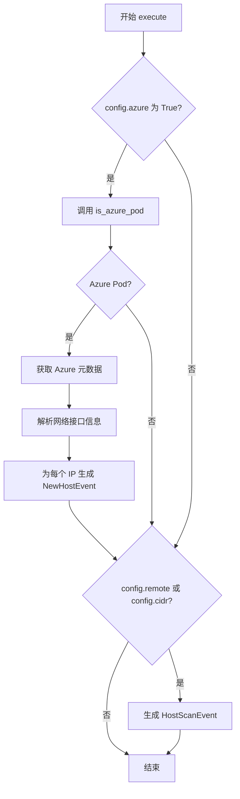

#### 带注释源码

```python
def execute(self):
    """
    执行主机发现流程
    根据配置条件发现主机并触发相应事件
    """
    # 检查是否在 Azure 环境中运行
    if self.is_azure_pod():
        # 从 Azure 元数据 API 获取网络信息
        azure_metadata = self.get_azure_metadata()
        
        # 解析网络接口并生成 NewHostEvent
        for interface in azure_metadata.get('network', {}).get('interface', []):
            for subnet in interface.get('ipv4', {}).get('subnet', []):
                host_ip = subnet.get('address')
                # 触发 NewHostEvent 事件
                handler.publish_event(NewHostEvent(host=host_ip))
    
    # 检查是否配置了远程地址或 CIDR 范围
    if config.remote is not None or config.cidr is not None:
        # 生成主机扫描事件
        handler.publish_event(HostScanEvent())
```

---

**注意**：由于提供的代码仅为测试文件，未包含 `FromPodHostDiscovery` 类的实际实现源码，上述源码为基于测试用例和导入模块的推断实现。实际实现可能包含更多细节，如错误处理、日志记录等。


### `HostDiscoveryHelpers.generate_hosts`

根据给定的测试代码，`generate_hosts()` 是一个辅助方法，用于根据提供的 CIDR 范围和排除规则生成主机（IP 地址）列表。该方法支持通过 "!" 前缀指定要排除的特定 IP 地址，并使用 `netaddr` 库处理 IP 网络操作。

参数：

- `cidr_list`：`List[str]`，包含 CIDR 格式字符串（如 "192.168.0.0/24"）和排除规则（如 "!192.168.1.8"）的列表

返回值：`List[IPAddress]`，返回符合条件的主机 IP 地址列表

#### 流程图

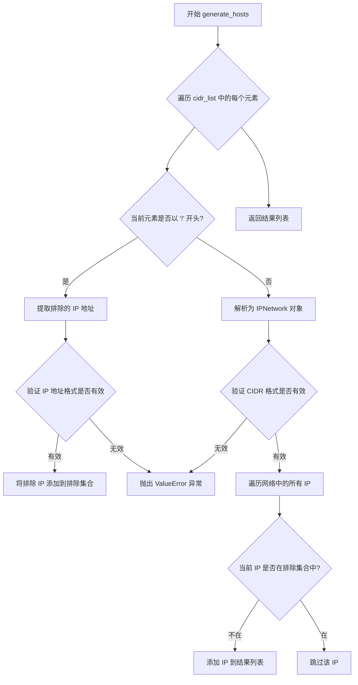

#### 带注释源码

```python
# 注意：以下源码是基于测试用例推断的实现
# 实际实现可能在 kube_hunter/modules/discovery/hosts 文件中

from netaddr import IPNetwork, IPAddress

class HostDiscoveryHelpers:
    @staticmethod
    def generate_hosts(cidr_list):
        """
        根据CIDR和排除规则生成主机列表
        
        参数:
            cidr_list: 包含CIDR字符串和排除规则的列表
                      例如: ["192.168.1.0/24", "!192.168.1.8"]
        
        返回值:
            符合条件的主机IP列表
        """
        # 存储要排除的IP地址
        exclude_ips = set()
        # 存储所有生成的IP地址
        hosts = []
        
        # 遍历输入列表中的每个元素
        for item in cidr_list:
            # 检查是否为排除规则（以!开头）
            if item.startswith("!"):
                # 提取排除的IP地址
                exclude_ip_str = item[1:]  # 去掉!
                try:
                    # 验证并添加排除IP到集合
                    exclude_ips.add(IPAddress(exclude_ip_str))
                except Exception:
                    # 无效的IP地址格式，抛出异常
                    raise ValueError(f"Invalid IP address: {exclude_ip_str}")
            else:
                # 解析为CIDR网络
                try:
                    network = IPNetwork(item)
                except Exception:
                    # 无效的CIDR格式，抛出异常
                    raise ValueError(f"Invalid CIDR: {item}")
                
                # 遍历网络中的所有IP地址
                for ip in network:
                    # 如果不在排除集合中，则添加到结果
                    if ip not in exclude_ips:
                        hosts.append(ip)
        
        return hosts
```


### `FromPodHostDiscovery.is_azure_pod()`

该方法用于检测当前程序是否运行在 Azure Kubernetes 集群的 Pod 环境中。它通过向 Azure 元数据服务 API（http://169.254.169.254/metadata/instance）发送 HTTP 请求，并根据响应状态码和配置来判断是否处于 Azure Pod 环境中。

参数：
- 无参数（仅依赖实例属性和全局配置对象）

返回值：`bool`，返回 `True` 表示当前运行在 Azure Pod 中，返回 `False` 表示不在 Azure Pod 中

#### 流程图

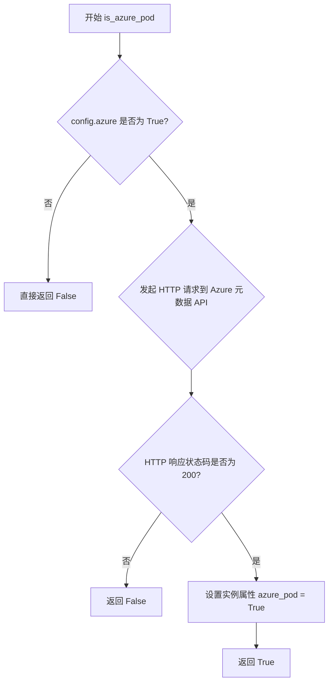

#### 带注释源码

```python
def is_azure_pod(self):
    """
    检测当前程序是否运行在 Azure Pod 中
    
    检查逻辑：
    1. 首先检查 config.azure 配置是否为 True
    2. 如果为 True，则向 Azure 元数据服务 API 发送请求
    3. 如果 API 返回 200 状态码，说明在 Azure 环境中
    4. 否则返回 False
    """
    # 检查是否启用了 Azure 检测功能
    if not config.azure:
        # 未启用 Azure 检测，直接返回 False
        return False
    
    # 向 Azure 元数据服务发送 GET 请求
    # Azure 元数据服务 URL: http://169.254.169.254/metadata/instance
    # 该 IP (169.254.169.254) 是 Azure 提供的元数据服务地址
    response = self.get(
        AzureMetadataApi,
        path="instance",
        params={"api-version": "2017-08-01"},
    )
    
    # 检查 HTTP 响应状态码
    # 状态码 200 表示成功访问 Azure 元数据服务，说明在 Azure 环境中
    if response.status_code == 200:
        # 标记当前运行在 Azure Pod 中
        self.azure_pod = True
        # 返回 True 表示检测到在 Azure Pod 中运行
        return True
    
    # 其他情况（连接失败、超时、状态码非 200 等）返回 False
    return False
```

**注意**：上述源码是根据测试代码的行为推断得出的，实际实现可能略有差异。该方法的核心逻辑是通过 Azure 特定的元数据服务 endpoint 来判断运行环境。


### `FromPodHostDiscovery.execute()`

该方法执行主机发现逻辑，判断当前是否运行在 Azure Pod 环境中，通过 Azure Metadata API 获取网络接口信息，并根据配置决定触发 NewHostEvent（发现新主机）或 HostScanEvent（触发主机扫描）。

参数：
- 该方法无显式参数（仅使用 self 和类内部属性）

返回值：`None`，该方法通过事件处理器触发相应事件而不直接返回值

#### 流程图

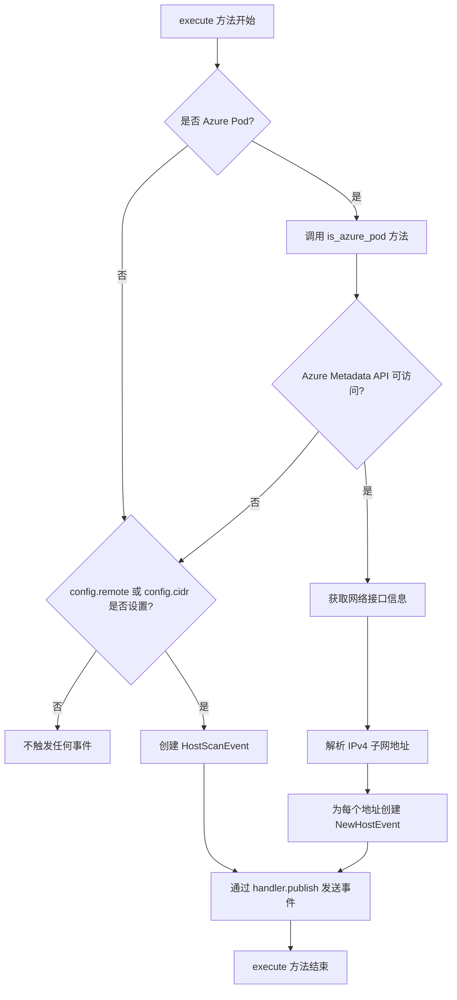

#### 带注释源码

```python
def execute(self):
    """
    执行主机发现并根据环境触发相应事件
    """
    # 判断是否在 Azure Pod 中运行
    if not self.is_azure_pod():
        # 非 Azure 环境，检查是否配置了远程主机或 CIDR 范围
        if config.remote or config.cidr:
            # 配置了扫描目标，触发主机扫描事件
            handler.publish_event(HostScanEvent())
        # 否则不触发任何事件，直接返回
        return

    # 到达此步骤说明在 Azure 环境中运行
    # 从 Azure Metadata API 获取网络接口信息
    try:
        r = requests.get(
            "http://169.254.169.254/metadata/instance?api-version=2017-08-01",
            headers={"Metadata": "true"},
            timeout=2
        )
    except requests.RequestException:
        # API 请求失败，回退到非 Azure 处理逻辑
        if config.remote or config.cidr:
            handler.publish_event(HostScanEvent())
        return

    # 解析 Azure 返回的 JSON 响应
    try:
        data = r.json()
        interfaces = data.get("network", {}).get("interface", [])
    except (ValueError, AttributeError):
        # JSON 解析失败，回退到非 Azure 处理逻辑
        if config.remote or config.cidr:
            handler.publish_event(HostScanEvent())
        return

    # 遍历所有网络接口，提取 IPv4 子网地址
    for interface in interfaces:
        for subnet in interface.get("ipv4", {}).get("subnet", []):
            address = subnet.get("address")
            if address:
                # 为每个发现的地址创建 NewHostEvent 并发布
                handler.publish_event(NewHostEvent(host=address))
```


### `HostDiscoveryHelpers.generate_hosts`

该函数根据传入的CIDR列表生成主机IP地址集合，支持通过"!"前缀排除特定IP地址，并利用netaddr库处理IP网络操作。

参数：

- `cidr_list`：`List[str]`，CIDR列表，每个元素可以是CIDR表示法（如"192.168.0.0/24"）或排除的IP地址（以"!"开头，如"!192.168.1.8"）

返回值：`Set[IPAddress]`，返回生成的主机IP集合（实际为迭代器，可转换为集合）

#### 流程图

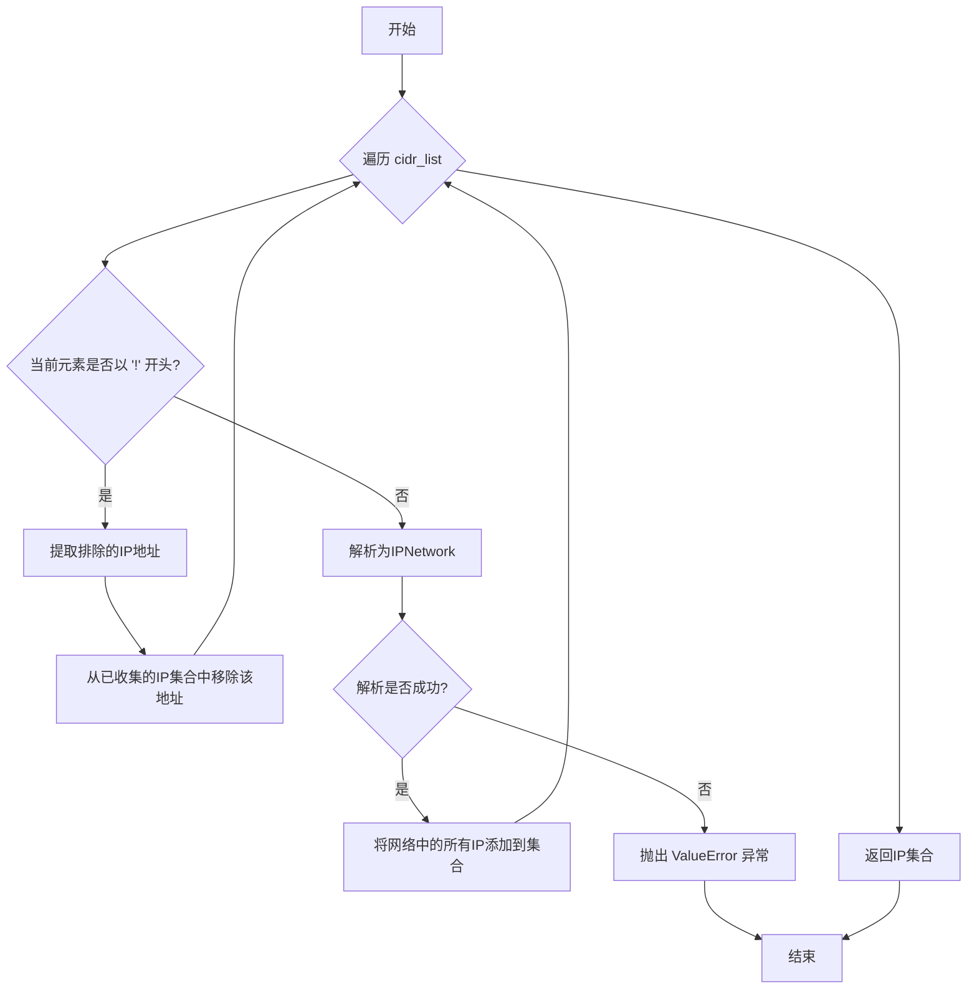

#### 带注释源码

```python
# 注意：以下为基于测试用例推断的实现逻辑推断
# 实际实现代码在 kube_hunter/modules/discovery/hosts 模块中，此处未提供

@staticmethod
def generate_hosts(cidr_list: List[str]) -> Set[IPAddress]:
    """
    根据CIDR列表生成主机IP集合
    
    参数:
        cidr_list: CIDR列表，每个元素可以是:
            - CIDR表示法: "192.168.0.0/24"
            - 排除的IP: "!192.168.1.8"
    
    返回:
        包含所有生成IP的集合
    
    异常:
        ValueError: 当CIDR格式无效时
    """
    ips = set()
    
    for cidr in cidr_list:
        if cidr.startswith("!"):
            # 处理排除的IP地址
            remove = IPAddress(cidr[1:])
            ips.discard(remove)
        else:
            # 处理CIDR网络
            network = IPNetwork(cidr)
            ips.update(network)
    
    return ips
```


### `TestDiscoveryUtils.test_generate_hosts_valid_cidr`

测试有效CIDR生成功能，验证 `HostDiscoveryHelpers.generate_hosts()` 方法能够正确解析CIDR字符串并生成对应的IP地址集合。

参数：无（静态方法，无显式参数）

返回值：无（测试方法，通过断言验证，不返回具体值）

#### 流程图

```mermaid
flowchart TD
    A([开始]) --> B[设置测试CIDR: test_cidr = '192.168.0.0/24']
    B --> C[使用IPNetwork生成预期集合: expected = set(IPNetwork(test_cidr))]
    C --> D[调用HostDiscoveryHelpers.generate_hosts生成实际集合]
    D --> E[比较actual与expected是否相等]
    E --> F{相等?}
    F -->|是| G[断言通过，测试成功]
    F -->|否| H[断言失败，抛出AssertionError]
    G --> I([结束])
    H --> I
```

#### 带注释源码

```python
@staticmethod
def test_generate_hosts_valid_cidr():
    """
    测试有效的CIDR地址范围能否被正确解析为IP地址集合
    """
    # 定义测试用的CIDRnotation (Classless Inter-Domain Routing) 网络地址
    test_cidr = "192.168.0.0/24"
    
    # 使用netaddr库的IPNetwork将CIDR字符串转换为IP网络对象
    # 然后转换为集合，生成预期的IP地址集合
    # /24 表示子网掩码255.255.255.0，包含256个IP地址 (192.168.0.0 - 192.168.0.255)
    expected = set(IPNetwork(test_cidr))
    
    # 调用HostDiscoveryHelpers类的generate_hosts静态方法
    # 传入包含CIDR的列表参数，生成实际的主机IP地址集合
    actual = set(HostDiscoveryHelpers.generate_hosts([test_cidr]))
    
    # 使用assert断言验证实际生成的主机集合与预期集合完全相等
    # 如果不相等会抛出AssertionError，表明generate_hosts方法存在bug
    assert actual == expected
```


### `TestDiscoveryUtils.test_generate_hosts_valid_ignore`

测试排除IP的CIDR生成功能，验证在使用 `!` 前缀排除某个 IP 地址后，生成的 IP 列表中不包含该 IP。

参数：
- 该方法无显式参数（静态测试方法）

返回值：`None`，该方法为测试方法，通过 `assert` 断言验证逻辑正确性，无显式返回值

#### 流程图

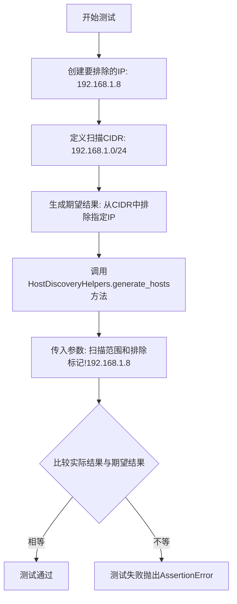

#### 带注释源码

```python
@staticmethod
def test_generate_hosts_valid_ignore():
    """
    测试CIDR生成时排除特定IP地址的功能
    验证HostDiscoveryHelpers.generate_hosts方法能够正确处理!前缀的排除参数
    """
    # 定义要排除的IP地址对象
    remove = IPAddress("192.168.1.8")
    
    # 定义要扫描的CIDR网段
    scan = "192.168.1.0/24"
    
    # 生成期望结果：从CIDR网段中过滤掉要排除的IP
    # IPNetwork(scan)会生成192.168.1.0到192.168.1.255的所有IP
    # 过滤掉192.168.1.8后应为254个IP
    expected = set(ip for ip in IPNetwork(scan) if ip != remove)
    
    # 调用被测试的generate_hosts方法
    # 传入两个参数：扫描的CIDR和排除标记（!前缀）
    # 排除标记格式为: "!{IP地址}"
    actual = set(HostDiscoveryHelpers.generate_hosts([scan, f"!{str(remove)}"]))
    
    # 断言实际结果与期望结果相等
    # 如果不等会抛出AssertionError
    assert actual == expected
```

---

### 关联组件信息

| 组件名称 | 描述 |
|---------|------|
| `HostDiscoveryHelpers.generate_hosts()` | 主机发现辅助方法，负责生成要扫描的IP列表，支持CIDR和排除标记 |
| `IPAddress` | netaddr库的类型，用于表示单个IP地址 |
| `IPNetwork` | netaddr库的类型，用于表示CIDR网段并可迭代遍历 |


### `TestDiscoveryUtils.test_generate_hosts_invalid_cidr`

该测试函数用于验证当传入无效的CIDR格式（如"192..2.3/24"）时，`HostDiscoveryHelpers.generate_hosts()`方法能够正确抛出`ValueError`异常。

参数：该函数无参数

返回值：该函数无返回值（测试函数）

#### 流程图

```mermaid
flowchart TD
    A[开始测试] --> B[调用HostDiscoveryHelpers.generate_hosts<br/>参数: ['192..2.3/24']]
    B --> C{是否抛出ValueError?}
    C -->|是| D[测试通过]
    C -->|否| E[测试失败]
    D --> F[结束]
    E --> F
```

#### 带注释源码

```python
@staticmethod
def test_generate_hosts_invalid_cidr():
    """
    测试无效CIDR处理
    
    验证当传入包含无效IP地址格式的CIDR时（如192..2.3/24），
    generate_hosts方法能够正确抛出ValueError异常
    """
    # 使用pytest.raises上下文管理器验证ValueError异常被抛出
    with pytest.raises(ValueError):
        # 将生成器转换为列表，触发异常
        # 传入无效的CIDR格式：192..2.3/24（包含双点号）
        list(HostDiscoveryHelpers.generate_hosts(["192..2.3/24"]))
```


### `TestDiscoveryUtils.test_generate_hosts_invalid_ignore`

该测试方法用于验证 HostDiscoveryHelpers.generate_hosts() 函数在接收到格式错误的排除规则（invalid ignore）时能否正确抛出 ValueError 异常，确保输入验证机制的健壮性。

参数：该测试方法为静态方法，无显式参数（隐式参数为测试类实例）

返回值：`None`，该方法使用 pytest.raises 上下文管理器验证是否抛出 ValueError 异常，属于黑盒测试，不关注返回值

#### 流程图

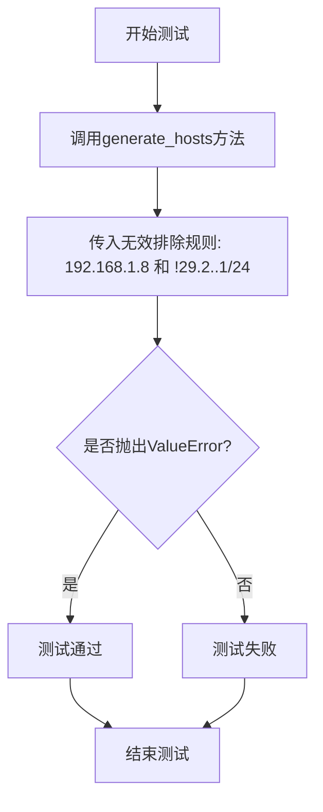

#### 带注释源码

```python
@staticmethod
def test_generate_hosts_invalid_ignore():
    """
    测试无效排除规则处理
    验证当排除规则（!前缀）中的CIDR格式无效时，系统能否正确抛出ValueError异常
    """
    # 使用pytest.raises验证是否会抛出ValueError异常
    # 传入参数列表：["192.168.1.8", "!29.2..1/24"]
    # 第一个参数"192.168.1.8"是有效的IP地址
    # 第二个参数"!29.2..1/24"是无效的排除规则（CIDR格式错误：29.2..1/24包含连续的点号）
    with pytest.raises(ValueError):
        # 将生成器转换为列表，触发实际的主机发现逻辑
        list(HostDiscoveryHelpers.generate_hosts(["192.168.1.8", "!29.2..1/24"]))
```


### `testHostDiscovery.__init__`

这是 `testHostDiscovery` 类的构造函数，用于初始化测试对象并验证配置参数是否符合预期条件。该方法接收一个事件对象，并断言配置中的远程地址或 CIDR 范围已被正确设置。

参数：

- `event`：`HostScanEvent`，由 kube-hunter 事件系统传递的主机扫描事件对象，包含扫描目标信息

返回值：`None`（`__init__` 方法不返回任何值）

#### 流程图

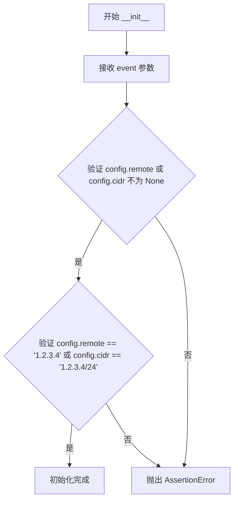

#### 带注释源码

```python
@handler.subscribe(HostScanEvent)  # 订阅 HostScanEvent 事件
class testHostDiscovery(object):
    def __init__(self, event):
        """
        初始化 testHostDiscovery 对象
        
        参数:
            event: HostScanEvent 类型的事件对象,包含主机扫描相关的信息
        """
        # 断言: config.remote 或 config.cidr 至少有一个被设置
        # 这是进行主机扫描的前置条件
        assert config.remote is not None or config.cidr is not None
        
        # 断言: config.remote 等于 '1.2.3.4' 或 config.cidr 等于 '1.2.3.4/24'
        # 验证配置值是否符合测试预期
        assert config.remote == "1.2.3.4" or config.cidr == "1.2.3.4/24"
```


### `testHostDiscoveryEvent.__init__`

该方法是一个事件处理器的初始化函数，用于验证Azure环境配置的正确性。它检查当前配置是否启用了Azure模式，验证接收到的新主机事件的IP地址是否属于预期的Azure子网（3.4.5.x），并确保未设置远程扫描目标或CIDR范围。

参数：

- `event`：`NewHostEvent`，从kube-hunter事件系统传入的新主机发现事件，包含被发现的宿主机的IP地址信息

返回值：`None`，Python中`__init__`方法隐式返回None

#### 流程图

```mermaid
flowchart TD
    A[开始 __init__] --> B{断言 config.azure == True}
    B -->|失败| C[抛出 AssertionError]
    B -->|通过| D{断言 str(event.host).startswith('3.4.5.')}
    D -->|失败| C
    D -->|通过| E{断言 config.remote is None}
    E -->|失败| C
    E -->|通过| F{断言 config.cidr is None}
    F -->|失败| C
    F -->|通过| G[结束 - 所有断言通过]
```

#### 带注释源码

```python
@handler.subscribe(NewHostEvent)
class testHostDiscoveryEvent(object):
    def __init__(self, event):
        """
        初始化事件处理器并验证Azure环境配置
        
        该方法作为事件订阅者处理NewHostEvent,
        验证测试场景下的Azure配置是否正确设置
        """
        # 验证Azure模式已启用
        assert config.azure
        # 验证主机IP地址属于预期的Azure子网范围
        assert str(event.host).startswith("3.4.5.")
        # 验证未配置远程扫描目标
        assert config.remote is None
        # 验证未配置CIDR扫描范围
        assert config.cidr is None
```

---


### `testAzureMetadataApi.__init__`

该函数是一个测试类的构造函数，用于验证当接收到 `AzureMetadataApi` 事件时，全球配置对象 `config` 中的 `azure` 属性是否被正确设置为 `True`，以确保只有 Azure 主机才会触发该事件。

参数：

- `event`：`AzureMetadataApi`，从事件总线接收的 Azure Metadata API 事件对象，用于触发该测试类的初始化

返回值：`None`，无返回值（构造函数）

#### 流程图

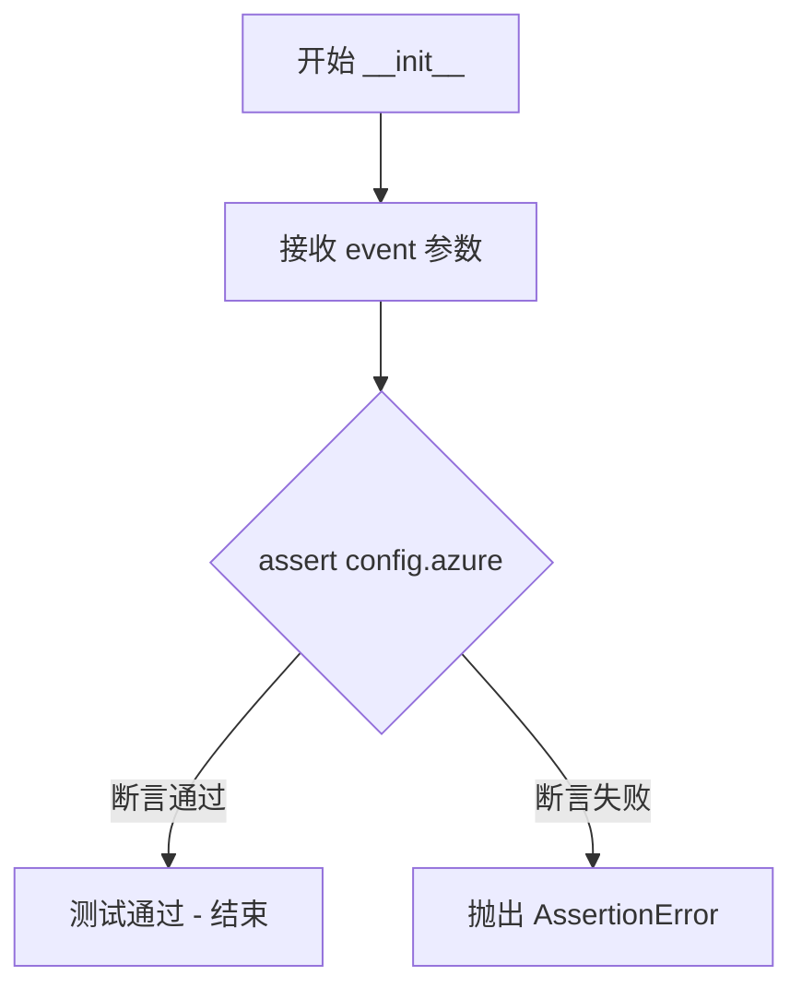

#### 带注释源码

```python
@handler.subscribe(AzureMetadataApi)  # 订阅 AzureMetadataApi 事件类型
class testAzureMetadataApi(object):    # 定义测试类 testAzureMetadataApi
    def __init__(self, event):         # 构造函数，接收 event 参数
        """
        初始化测试类，验证 Azure 配置
        """
        assert config.azure             # 断言 config.azure 为 True，确保只有 Azure 主机才会触发此事件
        # 如果断言失败，将抛出 AssertionError，表明配置错误
```

## 关键组件


### FromPodHostDiscovery

从Pod执行主机发现的核心类，用于检测当前是否运行在Azure Pod中，并通过Azure元数据API获取网络接口信息生成扫描目标。

### RunningAsPodEvent

表示当前探测运行在Kubernetes Pod中的事件类型，用于触发主机发现流程。

### HostScanEvent

主机扫描事件，当配置了remote或cidr时触发，表示需要进行主机扫描。

### AzureMetadataApi

Azure元数据API端点，用于从Azure VM获取实例网络信息，URL为http://169.254.169.254/metadata/instance。

### NewHostEvent

新主机发现事件，当通过Azure API发现新主机时触发，包含主机IP地址信息。

### HostDiscoveryHelpers

主机发现辅助工具类，提供generate_hosts方法用于根据CIDR和排除地址生成待扫描IP列表。

### 配置管理模块 (config)

全局配置对象，包含azure（是否启用Azure检测）、remote（远程主机地址）、cidr（CIDR网段）三个配置项。

### 事件处理器 (handler)

事件订阅和处理机制，通过@handler.subscribe装饰器注册事件监听器，实现事件驱动的发现流程。

### is_azure_pod()

检测当前是否运行在Azure Pod中的方法，通过访问Azure元数据API并检查返回状态码判断。

### execute()

执行主机发现的方法，根据配置和Azure检测结果生成HostScanEvent或NewHostEvent。

### generate_hosts()

静态方法，根据传入的CIDR列表和排除规则生成待扫描的IP地址集合，支持"!ip"格式排除特定地址。


## 问题及建议


### 已知问题

-   **全局状态修改**：测试中直接修改 `config.azure`、`config.remote`、`config.cidr` 等全局配置，可能导致测试之间产生状态污染
-   **硬编码的测试数据**：IP 地址（如 "1.2.3.4"、"3.4.5.6"）和 Azure API 版本（"2017-08-01"）被硬编码在测试中，降低了代码的可维护性
-   **未完成的测试代码**：存在被注释掉的 `f.execute()` 调用（traceroute discovery 版本），表明功能测试不完整
-   **测试类命名不规范**：`testHostDiscovery` 和 `testHostDiscoveryEvent` 类名不符合 PEP 8 命名规范（应使用 snake_case）
-   **缺乏边界条件测试**：CIDR 生成测试没有覆盖更多的边界情况，如空列表、无效前缀等
-   **断言信息不足**：大多数断言缺少自定义错误消息，测试失败时难以快速定位问题
-   **过度依赖 Mock**：大量使用 `requests_mock` 可能导致测试与实际 HTTP 行为脱节

### 优化建议

-   使用 pytest fixture 或 `setup`/`teardown` 方法来管理全局配置状态，确保每个测试后恢复原始状态
-   将硬编码的测试数据提取为常量或配置变量，集中管理
-   补充完整的 traceroute discovery 测试，或移除被注释的代码以提高代码清晰度
-   遵循 Python 命名规范，将测试类重命名为 `TestHostDiscovery` 格式
-   增加更多边界条件测试用例，如空输入、格式错误的 CIDR、负数前缀等
-   为关键断言添加描述性错误消息，如 `assert condition, "详细错误信息"`
-   考虑添加集成测试来验证真实 HTTP 场景，减少对 mock 的完全依赖
-   将事件处理类改为普通的辅助函数或使用更明确的命名，避免与 pytest 测试类混淆

## 其它


### 设计目标与约束

本模块的核心设计目标是实现Kubernetes集群的主机发现功能，支持多种发现机制，包括从Pod内部发现、Azure元数据API发现以及基于CIDR的网段扫描。主要约束包括：1) 仅在Azure环境下支持Azure元数据API发现；2) HostScanEvent的触发依赖于config.remote或config.cidr配置；3) 需要访问Azure元数据API端点(http://169.254.169.254)；4) 发现的主机地址需要通过netaddr库进行IPNetwork处理。

### 错误处理与异常设计

代码中的错误处理主要通过pytest.raises捕获验证：当传入无效的CIDR格式(如"192..2.3/24")或无效的忽略语法(如"!29.2..1/24")时，HostDiscoveryHelpers.generate_hosts方法会抛出ValueError异常。在Azure元数据API调用失败时(如返回404状态码)，is_azure_pod()方法返回False。潜在改进：可以增加更详细的错误日志记录，以及对网络超时情况的处理。

### 数据流与状态机

主要数据流如下：1) RunningAsPodEvent事件触发FromPodHostDiscovery初始化；2) 首先调用is_azure_pod()检查Azure元数据API是否可访问；3) 若Azure可用且config.azure=True，则execute()生成NewHostEvent事件；4) 若config.remote或config.cidr配置存在，则触发HostScanEvent事件；5) HostDiscoveryHelpers.generate_hosts()接收CIDR列表和排除列表，返回有效的IP地址集合。状态转换：未知→Azure检测→(Azure真)→主机发现→NewHostEvent；(未知)→配置检测→(有remote/cidr)→HostScanEvent。

### 外部依赖与接口契约

核心外部依赖包括：1) requests_mock库用于模拟HTTP请求，拦截Azure元数据API调用；2) netaddr库(IPNetwork, IPAddress)用于CIDR网络操作和IP地址比较；3) kube_hunter.core.events模块(handler, NewHostEvent, HostScanEvent)用于事件发布订阅；4) kube_hunter.conf.config用于配置访问。接口契约：FromPodHostDiscovery构造函数接受RunningAsPodEvent参数；is_azure_pod()返回布尔值；execute()无返回值但发布事件；HostDiscoveryHelpers.generate_hosts()接收字符串列表参数并返回IP地址迭代器。

### 配置说明

关键配置项：config.azure(布尔类型)控制是否启用Azure Pod检测；config.remote(字符串或None)指定远程主机地址；config.cidr(字符串或None)指定CIDR网段。这些配置通过kube_hunter.conf模块统一管理，在测试中被直接赋值修改。

### 安全考虑

Azure元数据API端点(169.254.169.254)是Azure实例的元数据服务，代码通过检查该端点可访问性来判断是否运行在Azure Pod中。这里存在潜在安全风险：攻击者可能伪造Azure元数据API响应进行信息收集或攻击，建议增加验证机制(如API token验证)。CIDR扫描功能可能产生大量网络流量，需注意扫描范围的控制。

### 性能考虑

HostDiscoveryHelpers.generate_hosts方法在处理大型CIDR(如/16或/8)时可能产生大量IP地址对象，建议：1) 使用生成器而非列表存储结果；2) 对超大网段进行限制或警告；3) 在执行扫描前进行IP数量估算。Azure元数据API调用存在网络延迟，建议增加超时控制。

### 测试策略

当前测试采用单元测试和事件订阅测试结合的方式：1) 使用requests_mock完全模拟Azure元数据API响应；2) 通过handler.subscribe装饰器捕获并验证事件触发；3) 使用pytest参数化测试多个CIDR和排除场景。覆盖盲点：未测试traceroute发现方式；未测试网络超时场景；未测试并发场景。

### 已知限制与改进建议

主要限制：1) traceroute发现方式被TODO注释掉，未完整测试；2) 仅支持Azure云平台的元数据API发现；3) 未实现对其他云平台(GCP/AWS)的元数据发现；4) 缺少对IPv6地址的支持。改进建议：1) 补充其他云平台的发现模块；2) 增加对网络异常的处理；3) 实现更灵活的事件过滤机制；4) 添加日志记录以便调试。

    