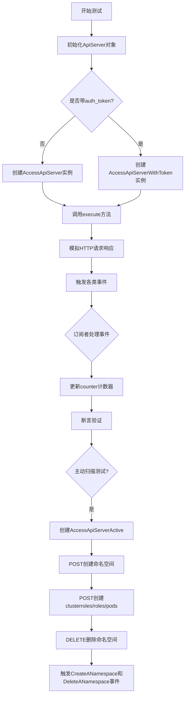
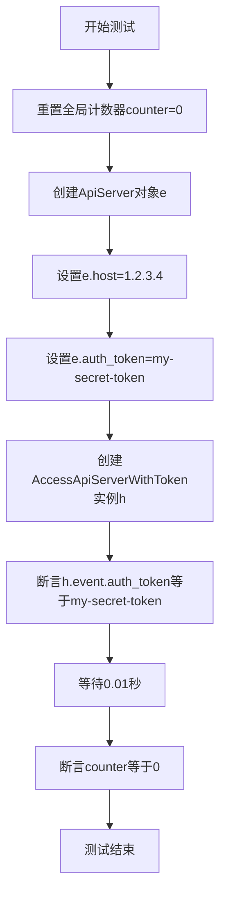
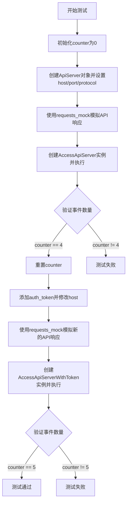
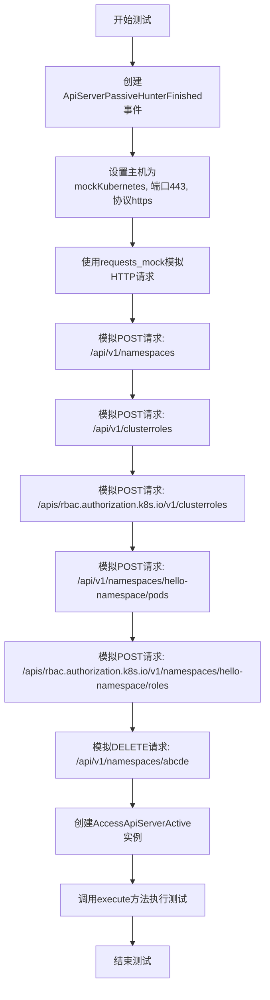
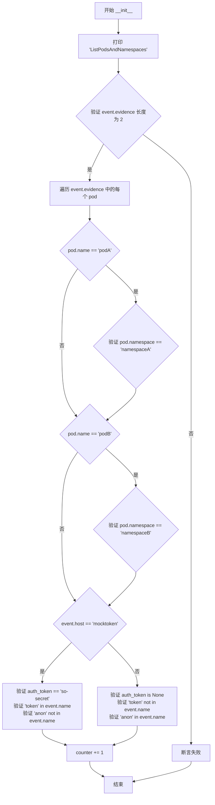
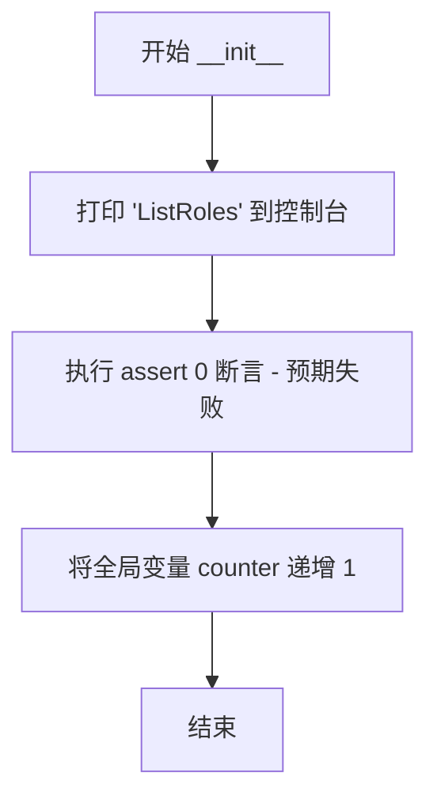
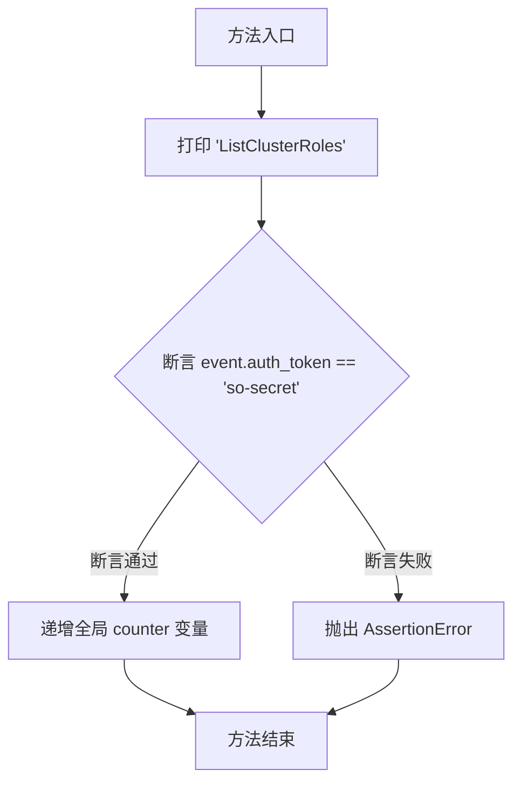
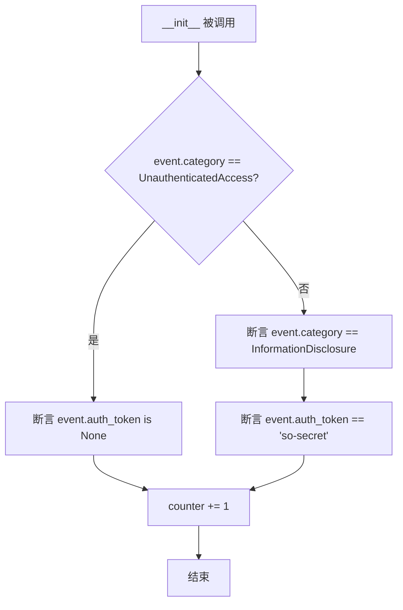
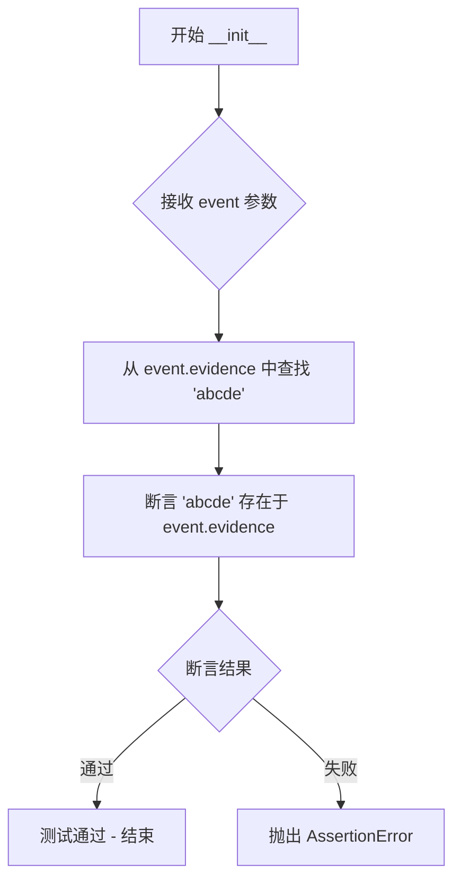
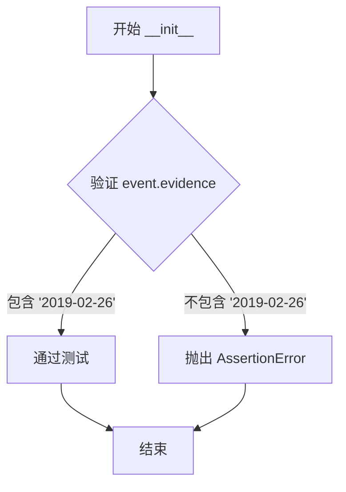

# `kubehunter\tests\hunting\test_apiserver_hunter.py` 详细设计文档

这是kube-hunter项目的API Server模块测试文件，用于测试对Kubernetes API Server的被动扫描（获取命名空间、Pod、角色信息）和主动扫描（创建/删除命名空间）功能，验证事件传递和认证机制的正确性。

## 整体流程



## 类结构

```
测试模块 (test_apiserver.py)
├── 测试函数
│   ├── test_ApiServerToken
│   ├── test_AccessApiServer
│   └── test_AccessApiServerActive
└── 事件订阅类 (Test Classes)
    ├── test_ListNamespaces (订阅ListNamespaces)
    ├── test_ListPodsAndNamespaces (订阅ListPodsAndNamespaces)
    ├── test_ListRoles (订阅ListRoles)
    ├── test_ListClusterRoles (订阅ListClusterRoles)
    ├── test_ServerApiAccess (订阅ServerApiAccess)
    ├── test_PassiveHunterFinished (订阅ApiServerPassiveHunterFinished)
    ├── test_CreateANamespace (订阅CreateANamespace)
    └── test_DeleteANamespace (订阅DeleteANamespace)
```

## 全局变量及字段


### `counter`
    
全局计数器，用于跟踪测试过程中接收到的事件数量

类型：`int`
    


### `test_ListNamespaces.event`
    
ListNamespaces事件对象，包含namespace列表证据、主机地址和认证令牌

类型：`ListNamespaces`
    


### `test_ListPodsAndNamespaces.event`
    
ListPodsAndNamespaces事件对象，包含pod和namespace列表证据、主机地址和认证令牌

类型：`ListPodsAndNamespaces`
    


### `test_ListRoles.event`
    
ListRoles事件对象，用于测试角色列表事件（测试中不应触发）

类型：`ListRoles`
    


### `test_ListClusterRoles.event`
    
ListClusterRoles事件对象，包含集群角色列表证据和认证令牌

类型：`ListClusterRoles`
    


### `test_ServerApiAccess.event`
    
ServerApiAccess事件对象，包含API访问类别（未认证访问或信息泄露）和认证令牌

类型：`ServerApiAccess`
    


### `test_PassiveHunterFinished.event`
    
ApiServerPassiveHunterFinished事件对象，包含发现的namespace列表

类型：`ApiServerPassiveHunterFinished`
    


### `test_CreateANamespace.event`
    
CreateANamespace事件对象，包含新创建的namespace名称证据

类型：`CreateANamespace`
    


### `test_DeleteANamespace.event`
    
DeleteANamespace事件对象，包含被删除的namespace时间戳证据

类型：`DeleteANamespace`
    
    

## 全局函数及方法


### test_ApiServerToken

这是一个测试函数，用于验证在创建`AccessApiServerWithToken`实例时，API Server的认证令牌能够正确传递到事件对象中。

参数： 无

返回值：`None`，无返回值（测试函数）

#### 流程图



#### 带注释源码

```python
def test_ApiServerToken():
    """
    测试函数：验证ApiServer的认证令牌能正确传递到AccessApiServerWithToken事件中
    
    测试目的：
    1. 确保AccessApiServerWithToken能够正确接收并保存ApiServer的auth_token
    2. 验证该测试不会触发任何事件（counter保持为0）
    """
    global counter  # 引用全局变量counter，用于跟踪生成的事件数量
    counter = 0    # 初始化计数器为0

    # 创建ApiServer对象并设置测试所需的属性
    e = ApiServer()              # 实例化ApiServer对象
    e.host = "1.2.3.4"           # 设置目标Kubernetes API Server的IP地址
    e.auth_token = "my-secret-token"  # 设置用于认证的令牌

    # 测试核心：验证token是否正确传递到事件中
    # 创建AccessApiServerWithToken hunter实例，传入配置好的事件对象
    h = AccessApiServerWithToken(e)
    # 断言：验证h对象的event属性中包含正确的auth_token
    assert h.event.auth_token == "my-secret-token"

    # 等待一小段时间确保异步事件处理完成
    time.sleep(0.01)
    # 断言：由于此测试只是验证token传递，不应生成任何事件
    assert counter == 0
```


### `test_AccessApiServer`

这是一个单元测试函数，用于测试 kube-hunter 项目中的 `AccessApiServer` 和 `AccessApiServerWithToken` 类的功能，验证对 Kubernetes API Server 的无认证和有认证访问能否正确触发相应的事件。

参数：该函数无参数

返回值：`None`，该函数为测试函数，使用 assert 语句进行断言验证，不返回任何值。

#### 流程图



#### 带注释源码

```python
def test_AccessApiServer():
    """测试AccessApiServer和AccessApiServerWithToken类的功能"""
    global counter
    counter = 0  # 重置全局计数器，用于跟踪触发的事件数量

    # 创建ApiServer对象并配置基础连接信息
    e = ApiServer()
    e.host = "mockKubernetes"
    e.port = 443
    e.protocol = "https"

    # 使用requests_mock模拟HTTP请求响应
    with requests_mock.Mocker() as m:
        # 模拟API根路径返回空JSON
        m.get("https://mockKubernetes:443/api", text="{}")
        # 模拟获取namespace列表，返回包含"hello" namespace的响应
        m.get(
            "https://mockKubernetes:443/api/v1/namespaces", 
            text='{"items":[{"metadata":{"name":"hello"}}]}',
        )
        # 模拟获取pods列表，返回两个pod的详细信息
        m.get(
            "https://mockKubernetes:443/api/v1/pods",
            text='{"items":[{"metadata":{"name":"podA", "namespace":"namespaceA"}}, \
                            {"metadata":{"name":"podB", "namespace":"namespaceB"}}]}',
        )
        # 模拟获取roles，返回403禁止访问
        m.get(
            "https://mockkubernetes:443/apis/rbac.authorization.k8s.io/v1/roles", 
            status_code=403,
        )
        # 模拟获取clusterroles，返回空items
        m.get(
            "https://mockkubernetes:443/apis/rbac.authorization.k8s.io/v1/clusterroles", 
            text='{"items":[]}',
        )
        # 模拟获取version信息
        m.get(
            "https://mockkubernetes:443/version",
            text='{"major": "1","minor": "13+", "gitVersion": "v1.13.6-gke.13", \
                   "gitCommit": "fcbc1d20b6bca1936c0317743055ac75aef608ce", \
                   "gitTreeState": "clean", "buildDate": "2019-06-19T20:50:07Z", \
                   "goVersion": "go1.11.5b4", "compiler": "gc", \
                   "platform": "linux/amd64"}',
        )

        # 创建无认证的AccessApiServer hunter并执行
        h = AccessApiServer(e)
        h.execute()

        # 等待异步事件处理完成，验证触发的事件数量
        # 预期4个事件：ServerApiAccess, ListNamespaces, ListPodsAndNamespaces, ApiServerPassiveHunterFinished
        time.sleep(0.01)
        assert counter == 4

    # 第二部分：测试带认证token的API访问
    counter = 0
    with requests_mock.Mocker() as m:
        # 模拟带token的API请求响应
        m.get("https://mocktoken:443/api", text="{}")
        m.get(
            "https://mocktoken:443/api/v1/namespaces", 
            text='{"items":[{"metadata":{"name":"hello"}}]}',
        )
        m.get(
            "https://mocktoken:443/api/v1/pods",
            text='{"items":[{"metadata":{"name":"podA", "namespace":"namespaceA"}}, \
                            {"metadata":{"name":"podB", "namespace":"namespaceB"}}]}',
        )
        m.get(
            "https://mocktoken:443/apis/rbac.authorization.k8s.io/v1/roles", 
            status_code=403,
        )
        # 模拟clusterroles返回包含一个角色的列表（与无token时不同）
        m.get(
            "https://mocktoken:443/apis/rbac.authorization.k8s.io/v1/clusterroles",
            text='{"items":[{"metadata":{"name":"my-role"}}]}',
        )

        # 设置认证token并修改host
        e.auth_token = "so-secret"
        e.host = "mocktoken"
        # 创建带token的AccessApiServerWithToken hunter并执行
        h = AccessApiServerWithToken(e)
        h.execute()

        # 验证触发的事件数量为5（比无token时多一个ListClusterRoles事件）
        time.sleep(0.01)
        assert counter == 5
```


### `test_AccessApiServerActive`

这是一个测试函数，用于验证 `AccessApiServerActive` 类的功能。该测试模拟了 Kubernetes API Server 的各种 API 调用，包括创建命名空间、创建集群角色、创建角色、创建 Pod 以及删除命名空间等操作，以测试主动猎捕模块对 API Server 的攻击性检测能力。

参数：该函数没有参数。

返回值：`None`，该函数为测试函数，不返回任何值。

#### 流程图



#### 带注释源码

```python
def test_AccessApiServerActive():
    # 创建一个ApiServerPassiveHunterFinished事件对象，初始命名空间为hello-namespace
    # 这个事件对象模拟了被动猎捕阶段已完成的状

    e = ApiServerPassiveHunterFinished(namespaces=["hello-namespace"])
    
    # 设置目标API Server的连接信息
    e.host = "mockKubernetes"  # 模拟的Kubernetes API Server主机地址
    e.port = 443               # HTTPS端口
    e.protocol = "https"       # 使用HTTPS协议

    # 使用requests_mock库来模拟HTTP请求和响应
    with requests_mock.Mocker() as m:
        # 模拟创建命名空间的POST请求
        # 当向/api/v1/namespaces发送POST请求时，返回一个已创建的命名空间响应
        m.post(
            "https://mockKubernetes:443/api/v1/namespaces",
            text="""
{
  "kind": "Namespace",
  "apiVersion": "v1",
  "metadata": {
    "name": "abcde",
    "selfLink": "/api/v1/namespaces/abcde",
    "uid": "4a7aa47c-39ba-11e9-ab46-08002781145e",
    "resourceVersion": "694180",
    "creationTimestamp": "2019-02-26T11:33:08Z"
  },
  "spec": {
    "finalizers": [
      "kubernetes"
    ]
  },
  "status": {
    "phase": "Active"
  }
}
""",
        )
        
        # 模拟创建集群角色的POST请求
        m.post("https://mockKubernetes:443/api/v1/clusterroles", text="{}")
        
        # 模拟通过RBAC API创建集群角色的POST请求
        m.post(
            "https://mockkubernetes:443/apis/rbac.authorization.k8s.io/v1/clusterroles", text="{}",
        )
        
        # 模拟在特定命名空间中创建Pod的POST请求
        m.post(
            "https://mockkubernetes:443/api/v1/namespaces/hello-namespace/pods", text="{}",
        )
        
        # 模拟在特定命名空间中创建角色的POST请求
        m.post(
            "https://mockkubernetes:443" "/apis/rbac.authorization.k8s.io/v1/namespaces/hello-namespace/roles",
            text="{}",
        )

        # 模拟删除命名空间的DELETE请求
        # 返回一个处于Terminating状态的命名空间响应
        m.delete(
            "https://mockKubernetes:443/api/v1/namespaces/abcde",
            text="""
{
  "kind": "Namespace",
  "apiVersion": "v1",
  "metadata": {
    "name": "abcde",
    "selfLink": "/api/v1/namespaces/abcde",
    "uid": "4a7aa47c-39ba-11e9-ab46-08002781145e",
    "resourceVersion": "694780",
    "creationTimestamp": "2019-02-26T11:33:08Z",
    "deletionTimestamp": "2019-02-26T11:40:58Z"
  },
  "spec": {
    "finalizers": [
      "kubernetes"
    ]
  },
  "status": {
    "phase": "Terminating"
  }
}
        """,
        )

        # 创建AccessApiServerActive实例并传入事件对象
        h = AccessApiServerActive(e)
        
        # 执行主动猎捕测试
        # 该方法会尝试执行各种API操作来检测API Server的漏洞
        h.execute()
```


### `test_ListNamespaces.__init__`

这是 `test_ListNamespaces` 类的构造函数，用于测试 `ListNamespaces` 事件处理器。它接收一个事件对象，验证事件的证据（evidence）、主机（host）和认证令牌（auth_token），并在每次调用时递增全局计数器。

参数：

- `event`：`ListNamespaces` 事件对象，包含事件的所有信息（如 evidence、host、auth_token 等）

返回值：`None`，无返回值（构造函数）

#### 流程图

```mermaid
flowchart TD
    A([开始]) --> B[打印 "ListNamespaces"]
    B --> C{验证 event.evidence == ["hello"]}
    C --> D{event.host == "mocktoken"}
    D -->|是| E[验证 event.auth_token == "so-secret"]
    D -->|否| F[验证 event.auth_token is None]
    E --> G[global counter += 1]
    F --> G
    G --> H([结束])
```

#### 带注释源码

```python
@handler.subscribe(ListNamespaces)  # 订阅 ListNamespaces 事件
class test_ListNamespaces(object):
    def __init__(self, event):
        """
        测试 ListNamespaces 事件处理器的初始化方法
        
        参数:
            event: ListNamespaces 事件对象，包含 evidence、host、auth_token 等属性
        """
        print("ListNamespaces")  # 打印调试信息
        
        # 验证事件中的证据（evidence）是否为 ["hello"]
        assert event.evidence == ["hello"]
        
        # 根据主机名判断是否应该包含认证令牌
        if event.host == "mocktoken":
            # 如果主机是 mocktoken，验证认证令牌为 "so-secret"
            assert event.auth_token == "so-secret"
        else:
            # 否则，验证认证令牌为 None（未认证）
            assert event.auth_token is None
        
        # 递增全局计数器，记录该事件被处理的次数
        global counter
        counter += 1
```


### test_ListPodsAndNamespaces.__init__

这是一个测试类的初始化方法，用于验证 `ListPodsAndNamespaces` 事件的属性是否正确，包括事件证据（pod列表）、主机地址、认证令牌和事件名称等。

参数：

- `event`：`Any`，传入的事件对象，包含 evidence（pod列表）、host（主机地址）、auth_token（认证令牌）和 name（事件名称）等属性

返回值：`None`，该方法没有返回值，仅执行断言验证和计数器递增

#### 流程图



#### 带注释源码

```python
@handler.subscribe(ListPodsAndNamespaces)  # 订阅 ListPodsAndNamespaces 事件
class test_ListPodsAndNamespaces(object):
    def __init__(self, event):
        """
        测试类初始化方法，验证 ListPodsAndNamespaces 事件的属性
        
        参数:
            event: 包含 evidence, host, auth_token, name 等属性的事件对象
        """
        print("ListPodsAndNamespaces")
        
        # 验证事件证据（pod列表）长度为2
        assert len(event.evidence) == 2
        
        # 遍历证据中的每个pod，验证pod名称和命名空间映射正确
        for pod in event.evidence:
            if pod["name"] == "podA":
                assert pod["namespace"] == "namespaceA"
            if pod["name"] == "podB":
                assert pod["namespace"] == "namespaceB"
        
        # 根据主机名判断是否有认证令牌，并验证相应的属性
        if event.host == "mocktoken":
            # 有认证令牌的情况
            assert event.auth_token == "so-secret"
            assert "token" in event.name
            assert "anon" not in event.name
        else:
            # 无认证令牌的情况
            assert event.auth_token is None
            assert "token" not in event.name
            assert "anon" in event.name
        
        # 全局计数器加1，记录已处理的事件数量
        global counter
        counter += 1
```


### test_ListRoles.__init__

这是一个测试类的构造函数，用于验证接收到 ListRoles 事件时的行为，打印调试信息并将全局计数器递增。

参数：

- `event`：`ListRoles` 事件对象，包含从 Kubernetes API 获取的角色信息（如命名空间、角色详情等）

返回值：`None`，因为 `__init__` 方法不返回任何值

#### 流程图



#### 带注释源码

```python
@handler.subscribe(ListRoles)  # 订阅 ListRoles 事件类型
class test_ListRoles(object):   # 定义测试类 test_ListRoles
    def __init__(self, event):  # 构造函数，接收 event 参数
        print("ListRoles")      # 打印调试信息，表明该方法被调用
        assert 0                # 主动失败断言，因为测试中 API 返回 403 状态码，不应触发此事件
        global counter          # 声明使用全局变量 counter
        counter += 1            # 全局计数器递增，统计接收到的事件数量
```


### `test_ListClusterRoles.__init__`

这是一个测试类的初始化方法，用于验证接收到 `ListClusterRoles` 事件时的认证令牌是否正确，并通过全局计数器记录测试执行次数。

参数：

- `event`：`ListClusterRoles` 事件对象，包含从 API 服务器获取的集群角色信息及认证令牌

返回值：`None`，`__init__` 方法隐式返回 `None`

#### 流程图



#### 带注释源码

```python
@handler.subscribe(ListClusterRoles)  # 订阅 ListClusterRoles 事件
class test_ListClusterRoles(object):
    def __init__(self, event):
        """
        测试类初始化方法，验证 ListClusterRoles 事件属性
        
        参数:
            event: ListClusterRoles 事件对象，包含从 API 服务器获取的集群角色信息
        """
        print("ListClusterRoles")  # 打印调试信息，标识该处理器被触发
        
        # 断言验证事件中的认证令牌是否为预期值
        # 该测试仅在有认证令牌的情况下触发（无令牌时返回空列表）
        assert event.auth_token == "so-secret"
        
        # 使用全局计数器记录成功接收到的事件数量
        global counter
        counter += 1
```


### `test_ServerApiServer.__init__`

该方法是测试类 `test_ServerApiServer` 的初始化方法，用于验证 `ServerApiAccess` 事件的类别（是未认证访问还是信息泄露）以及对应的认证令牌是否正确，同时递增全局计数器。

参数：

- `self`：无，Python 实例方法的隐含参数
- `event`：`ServerApiAccess`，接收到的事件对象，包含类别（category）和认证令牌（auth_token）等属性

返回值：`None`，无返回值

#### 流程图



#### 带注释源码

```python
@handler.subscribe(ServerApiServer)  # 订阅 ServerApiServer 事件
class test_ServerApiServer(object):
    def __init__(self, event):
        """
        初始化测试类，验证 ServerApiAccess 事件的属性
        
        参数:
            event: ServerApiServer事件对象，包含category和auth_token等属性
        """
        print("ServerApiServer")  # 打印调试信息
        
        # 判断事件类别
        if event.category == UnauthenticatedAccess:
            # 未认证访问类别下，auth_token 应为 None
            assert event.auth_token is None
        else:
            # 其它类别应为 InformationDisclosure（信息泄露）
            assert event.category == InformationDisclosure
            # 信息泄露类别下，auth_token 应为 'so-secret'
            assert event.auth_token == "so-secret"
        
        # 递增全局计数器，记录该事件被处理
        global counter
        counter += 1
```


### `test_PassiveHunterFinished.__init__`

这是一个测试类的构造函数，用于验证`ApiServerPassiveHunterFinished`事件的处理是否正确。测试类通过订阅`ApiServerPassiveHunterFinished`事件来检查事件中的`namespaces`属性是否符合预期，并增加全局计数器以验证事件被正确触发。

参数：

- `self`：隐式参数，类型为`test_PassiveHunterFinished`实例，表示类的实例本身
- `event`：类型为`ApiServerPassiveHunterFinished`，从事件处理器接收的事件对象，包含hunter执行完成后的相关信息（如命名空间列表等）

返回值：`None`，该方法没有返回值，仅执行测试逻辑

#### 流程图

```mermaid
graph TD
    A[__init__方法被调用] --> B[接收event参数]
    B --> C[打印'PassiveHunterFinished']
    C --> D{验证event.namespaces == ['hello']}
    D -->|验证通过| E[全局计数器counter加1]
    D -->|验证失败| F[抛出AssertionError]
    E --> G[方法结束]
```

#### 带注释源码

```python
@handler.subscribe(ApiServerPassiveHunterFinished)  # 订阅ApiServerPassiveHunterFinished事件
class test_PassiveHunterFinished(object):
    def __init__(self, event):
        """
        测试类的构造函数，验证被动hunter完成事件的内容
        
        参数:
            event: ApiServerPassiveHunterFinished类型的事件对象，包含命名空间等信息
        """
        print("PassiveHunterFinished")  # 打印调试信息，表明该handler被触发
        
        # 断言验证事件中的命名空间列表是否为预期值["hello"]
        assert event.namespaces == ["hello"]
        
        # 声明使用全局变量counter，用于记录触发的事件数量
        global counter
        counter += 1  # 每当该事件被正确处理时，计数器加1
```


### `test_CreateANamespace.__init__`

这是一个测试类的初始化方法，用于验证创建命名空间事件是否正确触发，并检查事件中的证据是否包含创建的命名空间名称。

参数：

- `event`：对象，事件对象，包含创建命名空间的证据信息

返回值：`None`，无返回值（构造函数）

#### 流程图



#### 带注释源码

```python
@handler.subscribe(CreateANamespace)
class test_CreateANamespace(object):
    def __init__(self, event):
        """
        测试类的初始化方法，用于验证 CreateANamespace 事件
        """
        # 断言创建的命名空间名称 'abcde' 存在于事件证据中
        # AccessApiServerActive hunter 会创建命名空间并发布 CreateANamespace 事件
        # 然后此测试类订阅该事件并验证事件证据是否正确
        assert "abcde" in event.evidence
```


### `test_DeleteANamespace.__init__`

这是一个测试订阅器方法，用于验证 `DeleteANamespace` 事件中的 `evidence` 字段是否包含特定的日期字符串。

参数：

- `event`：`object`，表示从 `DeleteANamespace` 事件接收的事件对象，包含 `evidence` 属性

返回值：`None`，无返回值（构造函数）

#### 流程图



#### 带注释源码

```python
@handler.subscribe(DeleteANamespace)  # 订阅 DeleteANamespace 事件
class test_DeleteANamespace(object):
    def __init__(self, event):
        # 断言事件中的证据(evidence)包含特定的日期字符串 '2019-02-26'
        # 用于验证 DeleteANamespace 事件是否正确携带了命名空间删除的时间戳信息
        assert "2019-02-26" in event.evidence
```

## 关键组件


### 事件订阅处理器

订阅并验证 ListNamespaces 事件，验证命名空间列表和认证令牌

### 事件订阅处理器

订阅并验证 ListPodsAndNamespaces 事件，验证 Pod 和命名空间列表及认证信息

### 事件订阅处理器

订阅 ListRoles 事件（测试中返回 403 状态码，不应触发）

### 事件订阅处理器

订阅并验证 ListClusterRoles 事件，仅在有认证令牌时触发并验证

### 事件订阅处理器

订阅并验证 ServerApiAccess 事件，验证访问类别（UnauthenticatedAccess 或 InformationDisclosure）和认证令牌

### 事件订阅处理器

订阅并验证 ApiServerPassiveHunterFinished 事件，验证命名空间列表

### 事件订阅处理器

订阅并验证 CreateANamespace 事件，验证创建的命名空间名称

### 事件订阅处理器

订阅并验证 DeleteANamespace 事件，验证删除的命名空间时间戳

### 测试夹具

模拟 Kubernetes API 响应，用于测试被动和主动 hunter 的行为

### 测试函数

测试 AccessApiServerWithToken 类的认证令牌传递功能

### 测试函数

测试 AccessApiServer 类的命名空间、Pod 和角色列表获取功能，包括有 token 和无 token 两种场景

### 测试函数

测试 AccessApiServerActive 类的主动探测功能，包括创建和删除命名空间等操作

### 全局计数器

用于跟踪测试中触发的事件数量，验证事件发布是否正确

## 问题及建议


### 已知问题

- **全局变量污染**：使用全局变量`counter`在多个测试函数间共享状态，容易导致测试顺序依赖和竞态条件，破坏测试隔离性。
- **Magic Numbers和硬编码等待**：`time.sleep(0.01)`是硬编码的等待时间，稳定性不足，不同环境可能导致时序相关的测试失败。
- **测试类命名不规范**：事件订阅类（如`test_ListNamespaces`）以`test_`前缀命名，容易与pytest测试框架混淆，且这些是事件处理器而非测试用例。
- **重复代码块**：多个测试中重复定义相似的`requests_mock`响应，违反了DRY原则。
- **TODO注释未完成**：代码中存在`# TODO check that these responses reflect what Kubernetes does`和`# TODO more tests here with real responses`标记，表示测试覆盖不完整。
- **缺少异常处理**：测试代码未考虑网络错误、API响应异常等边界情况，只测试了正常流程。
- **断言过于具体**：对事件名称的断言（如`assert "token" in event.name`）耦合了实现细节，降低了测试的健壮性。
- **Mock数据不真实**：部分API响应的数据格式与真实Kubernetes API不完全一致，可能掩盖潜在的兼容性问题。
- **测试函数与事件处理器混放**：将测试逻辑（test_*函数）和事件订阅处理器放在同一文件，降低了代码可维护性。

### 优化建议

- **消除全局状态**：使用类级别的`setUp/tearDown`方法或pytest的fixture来管理测试状态，避免全局变量。
- **使用显式同步机制**：用`handler.events_empty.wait()`或类似的同步原语替代`time.sleep()`，确保事件完全处理。
- **抽取公共mock逻辑**：创建fixture或辅助函数来生成重复的mock响应，减少代码冗余。
- **重构事件处理器命名**：将事件订阅类重命名为描述其功能的名称（如`NamespaceListHandler`），避免与测试函数混淆。
- **完善测试覆盖**：补充异常场景测试，包括网络超时、认证失败、权限不足等情况的处理。
- **分离关注点**：将测试代码与事件处理器分离到不同模块，提高代码组织结构清晰度。
- **使用参数化测试**：对于类似的测试场景，使用pytest的参数化功能减少重复代码。
- **补充文档注释**：为关键测试函数和事件处理器添加文档字符串，说明测试目的和预期行为。

## 其它


### 设计目标与约束

验证kube-hunter对Kubernetes API Server的被动和主动探测能力，确保无认证访问、Token认证访问、命名空间列举、Pod列举、角色列举、集群角色列举以及命名空间创建和删除等功能正常工作。

### 错误处理与异常设计

使用assert语句进行断言验证，包括：验证auth_token传递正确性、验证evidence数据结构正确性（如命名空间名称、Pod名称和命名空间映射）、验证事件category分类正确性（UnauthenticatedAccess或InformationDisclosure）、验证事件名称包含特定关键字（token/anon）。对于返回403状态码的API调用，预期不产生ListRoles事件。

### 数据流与状态机

数据流分为两条路径：被动探测路径（AccessApiServer/AccessApiServerWithToken -> execute() -> 触发ServerApiAccess -> ListNamespaces -> ListPodsAndNamespaces -> ListRoles/ListClusterRoles -> ApiServerPassiveHunterFinished）和主动探测路径（AccessApiServerActive -> execute() -> POST创建命名空间 -> POST集群角色 -> POST角色 -> POST Pods -> DELETE命名空间）。状态转换通过事件订阅机制实现，counter计数器跟踪事件触发数量。

### 外部依赖与接口契约

依赖requests_mock库模拟HTTP请求，依赖kube_hunter.modules.hunting.apiserver中的各种Hunter类，依赖kube_hunter.modules.discovery.apiserver中的ApiServer类，依赖kube_hunter.core.events中的handler进行事件订阅。API接口契约包括：/api（基础API检查）、/api/v1/namespaces（列举命名空间）、/api/v1/pods（列举Pod）、/apis/rbac.authorization.k8s.io/v1/roles（列举角色）、/apis/rbac.authorization.k8s.io/v1/clusterroles（列举集群角色）、/api/v1/namespaces（POST创建命名空间）、/api/v1/clusterroles（POST集群角色）、/apis/rbac.authorization.k8s.io/v1/clusterroles（POST集群角色）、/api/v1/namespaces/{ns}/pods（POST Pod）、/apis/rbac.authorization.k8s.io/v1/namespaces/{ns}/roles（POST角色）、/api/v1/namespaces/{name}（DELETE命名空间）。

### 安全性考虑

测试验证了未授权访问（auth_token为None）和授权访问（携带token）的不同行为，确保安全工具能正确识别和报告不同级别的访问权限。

### 测试覆盖范围

覆盖无认证Token场景、有认证Token场景、被动探测流程、主动探测流程、命名空间操作（创建/删除）、角色和集群角色列举、HTTP状态码处理（200和403）。

### 性能考虑

使用time.sleep(0.01)确保事件异步处理完成后再进行断言，避免竞态条件。

### 并发和线程安全性

使用global counter记录事件触发数量，在多事件并发场景下存在竞态风险，但测试场景为串行执行故未加锁保护。

### 配置和参数说明

ApiServer配置参数包括host（字符串，API Server地址）、port（整数，端口号）、protocol（字符串，协议类型http/https）、auth_token（字符串，认证Token）。事件evidence参数类型为列表（list），存储发现的信息如命名空间名称、Pod元数据等。

### 模块间交互

discovery模块的ApiServer提供目标发现，hunting模块的各类Hunter负责探测执行，core.events的handler负责事件订阅和分发，core.types定义事件类别（UnauthenticatedAccess、InformationDisclosure）。

### 命名规范和代码风格

测试类以test_开头，事件订阅类以小写字母开头并描述所订阅的事件类型，使用下划线命名法，符合Python社区约定。

### 已知限制和TODO

代码中存在TODO注释标记：1) check that these responses reflect what Kubernetes does（验证模拟响应与真实Kubernetes行为一致性）、2) more tests here with real responses（需要更多真实响应测试）。


    