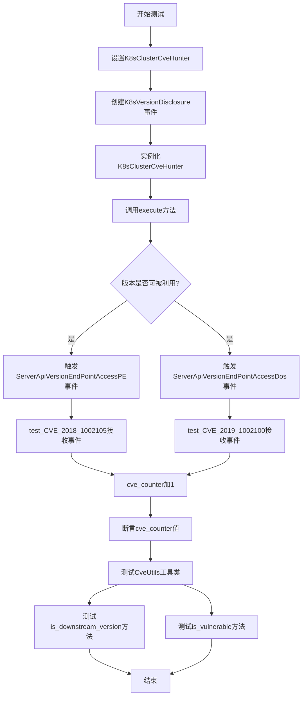
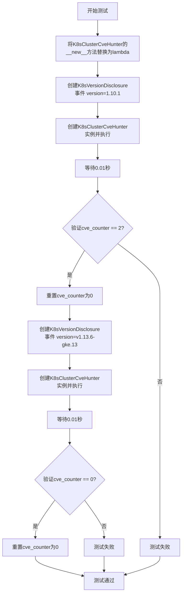
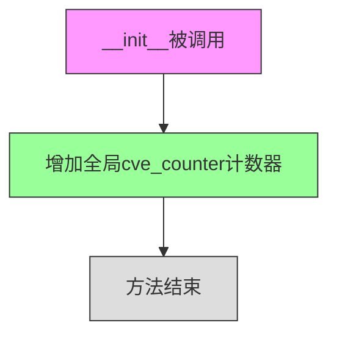
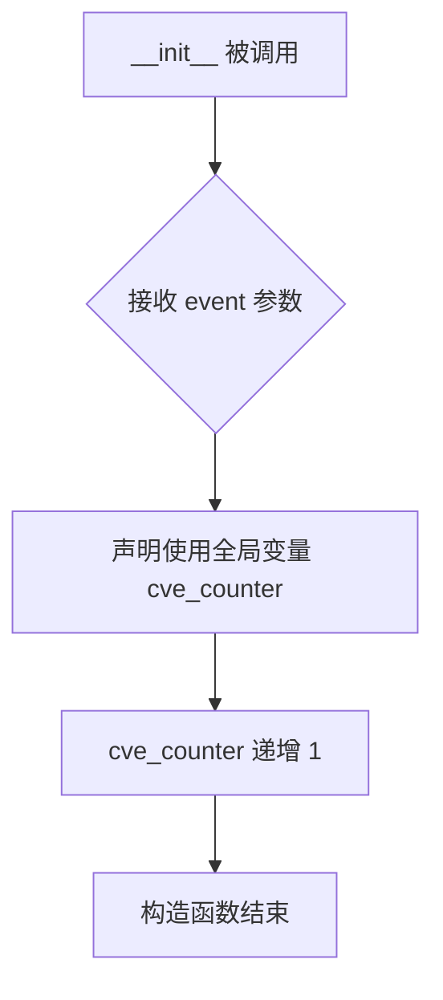
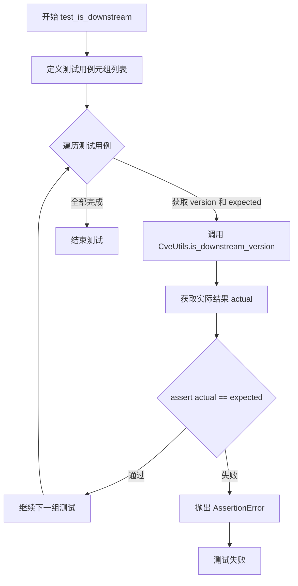
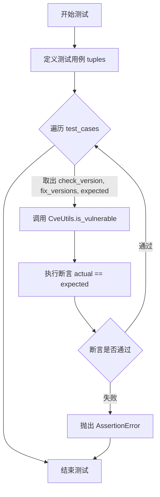

# `kubehunter\tests\hunting\test_cvehunting.py` 详细设计文档

这是kube-hunter项目的CVEs（通用漏洞披露）模块的测试文件，用于测试Kubernetes集群CVE漏洞检测功能，包括版本解析、漏洞判断和事件处理流程。

## 整体流程



## 类结构

```
TestCveUtils (测试工具类)
├── test_is_downstream (测试方法)
└── test_ignore_downstream (测试方法)
test_CVE_2018_1002105 (事件处理类)
└── __init__ (初始化方法)
test_CVE_2019_1002100 (事件处理类)
└── __init__ (初始化方法)
```

## 全局变量及字段


### `cve_counter`
    
全局计数器，用于记录触发的CVE事件数量

类型：`int`
    


    

## 全局函数及方法


### `test_K8sCveHunter`

该函数是K8sClusterCveHunter类的集成测试函数，用于验证CVE猎人能否正确识别和报告Kubernetes集群中的已知安全漏洞。测试通过模拟不同版本的K8s版本披露事件，验证系统对易受攻击版本（1.10.1）和已修补版本（v1.13.6-gke.13）的正确处理。

参数：
- 无参数

返回值：`None`，无返回值（测试函数）

#### 流程图



#### 带注释源码

```python
def test_K8sCveHunter():
    """
    测试K8sClusterCveHunter类的功能
    验证能够正确识别易受攻击的K8s版本并触发相应的CVE事件
    """
    global cve_counter  # 声明使用全局变量cve_counter来跟踪CVE事件数量
    
    # 因为hunter会注销自己，这里手动移除这个选项，以便能够测试它
    # 通过替换__new__方法绕过单例模式，使其能够创建多个实例
    K8sClusterCveHunter.__new__ = lambda self, cls: object.__new__(self)

    # 测试场景1：易受攻击的版本1.10.1
    # 创建K8sVersionDisclosure事件，模拟从/version端点获取到的版本信息
    e = K8sVersionDisclosure(version="1.10.1", from_endpoint="/version")
    # 创建CVE猎人实例并执行检测
    h = K8sClusterCveHunter(e)
    h.execute()

    # 等待0.01秒以确保事件处理完成
    time.sleep(0.01)
    # 验证对于1.10.1版本，应触发2个CVE事件（CVE-2018-1002105和CVE-2019-1002100）
    assert cve_counter == 2
    # 重置计数器，为下一个测试做准备
    cve_counter = 0

    # 测试场景2：已修补的版本v1.13.6-gke.13（GKE提供的安全版本）
    e = K8sVersionDisclosure(version="v1.13.6-gke.13", from_endpoint="/version")
    h = K8sClusterCveHunter(e)
    h.execute()

    # 等待0.01秒以确保事件处理完成
    time.sleep(0.01)
    # 验证对于已修补版本，不应触发任何CVE事件
    assert cve_counter == 0
    # 重置计数器
    cve_counter = 0
```


### `test_CVE_2018_1002105.__init__`

该方法是CVE-2018-1002105漏洞测试类的构造函数，通过订阅`ServerApiVersionEndPointAccessPE`事件来检测Kubernetes集群中的特权端点访问漏洞，并在每次检测到相关事件时增加全局CVE计数器。

参数：

- `self`：`object`，类的实例本身
- `event`：`ServerApiVersionEndPointAccessPE`（或通用Event类型），从事件订阅传入的事件对象，表示检测到的API服务器版本端点访问事件

返回值：`None`，`__init__`方法不返回任何值

#### 流程图



#### 带注释源码

```python
@handler.subscribe(ServerApiVersionEndPointAccessPE)
class test_CVE_2018_1002105(object):
    def __init__(self, event):
        """
        CVE-2018-1002105测试类的初始化方法
        
        参数:
            event: 订阅的事件对象,由ServerApiVersionEndPointAccessPE事件触发
        """
        global cve_counter  # 声明使用全局变量cve_counter
        cve_counter += 1    # 每次事件触发时计数器加1,用于验证漏洞检测逻辑
```


### `test_CVE_2019_1002100.__init__`

这是一个 CVE 漏洞测试类的构造函数，用于处理 `ServerApiVersionEndPointAccessDos` 类型的事件。当事件被触发时，该方法会递增全局计数器以记录 CVE 漏洞检测次数。

参数：

- `self`：`test_CVE_2019_1002100`，类的实例对象本身
- `event`：`ServerApiVersionEndPointAccessDos`（或基类类型），传入的事件对象，用于触发漏洞检测

返回值：`None`，无返回值

#### 流程图



#### 带注释源码

```python
@handler.subscribe(ServerApiVersionEndPointAccessDos)  # 订阅 ServerApiVersionEndPointAccessDos 事件类型
class test_CVE_2019_1002100:  # 定义测试 CVE_2019_1002100 的类
    def __init__(self, event):  # 构造函数，接收事件对象作为参数
        global cve_counter  # 声明使用全局变量 cve_counter，用于统计 CVE 检测次数
        cve_counter += 1  # 全局计数器加 1，记录该漏洞被触发一次
```


### `TestCveUtils.test_is_downstream`

该方法用于测试 `CveUtils.is_downstream_version` 方法是否能正确识别 Kubernetes 版本字符串是否为下游版本（包含如 `-`、`+`、`~` 等后缀符号表示构建元数据或预发布版本）。

参数：

- `self`：`TestCveUtils`，测试类的实例方法隐式参数，代表当前测试类实例

返回值：`None`，该方法为测试方法，通过 assert 断言验证预期结果，不返回任何值

#### 流程图



#### 带注释源码

```python
def test_is_downstream(self):
    # 定义测试用例列表，每个元素为(版本字符串, 预期结果)的元组
    # 预期结果 False 表示主版本/次版本，True 表示下游版本（含构建元数据）
    test_cases = (
        ("1", False),                      # 主版本号，无后缀
        ("1.2", False),                    # 主.次版本号，无后缀
        ("1.2-3", True),                   # 包含预发布号后缀
        ("1.2-r3", True),                  # 包含修订版本后缀
        ("1.2+3", True),                   # 包含构建元数据后缀
        ("1.2~3", True),                   # 包含tilde后缀
        ("1.2+a3f5cb2", True),             # 包含git commit hash后缀
        ("1.2-9287543", True),             # 包含数字后缀
        ("v1", False),                     # 带v前缀的主版本
        ("v1.2", False),                   # 带v前缀的次版本
        ("v1.2-3", True),                  # 带v前缀且有后缀
        ("v1.2-r3", True),                 # 带v前缀且有r后缀
        ("v1.2+3", True),                  # 带v前缀且有+后缀
        ("v1.2~3", True),                  # 带v前缀且有~后缀
        ("v1.2+a3f5cb2", True),            # 带v前缀且有git hash后缀
        ("v1.2-9287543", True),            # 带v前缀且有数字后缀
        ("v1.13.9-gke.3", True),           # GKE特有版本格式
    )

    # 遍历所有测试用例进行验证
    for version, expected in test_cases:
        # 调用被测试的静态方法
        actual = CveUtils.is_downstream_version(version)
        # 断言实际结果与预期结果一致
        assert actual == expected
```


### `TestCveUtils.test_ignore_downstream`

该方法是一个测试用例，用于验证 `CveUtils.is_vulnerable` 函数在忽略下游版本场景下的正确性，通过多组测试数据验证版本比较逻辑是否符合预期。

参数：

- `self`：`TestCveUtils`，测试类实例本身，用于访问类属性和方法

返回值：`None`，无返回值，该方法为测试用例，执行断言验证

#### 流程图



#### 带注释源码

```python
def test_ignore_downstream(self):
    # 定义测试用例元组：检查版本、修复版本列表、预期结果（是否易感）
    test_cases = (
        ("v2.2-abcd", ["v1.1", "v2.3"], False),      # 测试下游版本不在修复版本中
        ("v2.2-abcd", ["v1.1", "v2.2"], False),      # 测试下游版本匹配修复版本
        ("v1.13.9-gke.3", ["v1.14.8"], False),       # 测试GKE版本格式
    )

    # 遍历每个测试用例进行验证
    for check_version, fix_versions, expected in test_cases:
        # 调用 CveUtils.is_vulnerable 方法，第三个参数 True 表示忽略下游版本
        actual = CveUtils.is_vulnerable(fix_versions, check_version, True)
        # 断言实际结果与预期结果一致
        assert actual == expected
```

## 关键组件


### K8sClusterCveHunter

用于检测Kubernetes集群CVE漏洞的hunter类，接收K8sVersionDisclosure事件并根据版本信息判断是否存在已知CVE漏洞。

### CveUtils

提供CVE版本检测的工具类，包含判断下游版本和检测漏洞版本的方法。

### K8sVersionDisclosure

表示Kubernetes版本信息披露的事件类，包含版本号和端点信息。

### ServerApiVersionEndPointAccessPE

代表Server API版本端点访问权限提升（Privilege Escalation）的事件类型。

### ServerApiVersionEndPointAccessDos

代表Server API版本端点拒绝服务（Denial of Service）攻击的事件类型。

### cve_counter

全局计数器，用于记录CVE事件触发次数，辅助测试验证。

### test_K8sCveHunter

测试函数，验证K8sClusterCveHunter对不同版本K8s的CVE检测逻辑，包括已知漏洞版本1.10.1和已修复版本v1.13.6-gke.13。

### test_CVE_2018_1002105

订阅ServerApiVersionEndPointAccessPE事件的测试类，用于模拟CVE-2018-1002105漏洞检测场景。

### test_CVE_2019_1002100

订阅ServerApiVersionEndPointAccessDos事件的测试类，用于模拟CVE-2019-1002100漏洞检测场景。

### TestCueUtils

测试CveUtils工具类的测试类，验证is_downstream_version和is_vulnerable方法的正确性。


## 问题及建议


### 已知问题

-   **全局变量滥用**：使用全局变量`cve_counter`来追踪CVE计数，这种方式在并发测试环境中不安全，且不符合良好的测试实践
-   **依赖sleep的异步等待**：`time.sleep(0.01)`用于等待异步操作，这种方式不可靠，可能导致 flaky tests，且缺乏对实际完成状态的检测
-   **修改类属性**：通过`K8sClusterCveHunter.__new__ = lambda self, cls: object.__new__(self)`修改类属性是一种hack方式，可能影响其他测试，且cleanup不完整
-   **魔法数字**：断言`cve_counter == 2`使用硬编码数字，没有注释说明为什么是2，降低了代码可读性
-   **测试类命名不一致**：`test_CVE_2018_1002105`继承`object`的写法与`test_CVE_2019_1002100`不统一（后者没有括号）
-   **缺少proper的teardown**：测试后的状态重置`cve_counter = 0`分散在各处，没有使用标准的setUp/teardown机制
-   **事件订阅未cleanup**：使用装饰器订阅事件后没有对应的unsubscribe机制，测试之间可能产生相互影响

### 优化建议

-   **消除全局状态**：将`cve_counter`改为实例变量或通过返回值传递，使用类级别的计数器而非全局变量，或使用mock对象验证事件发布
-   **移除sleep依赖**：使用事件系统的回调机制或等待标志来确认异步操作完成，而非固定时间的sleep
-   **移除类属性修改**：通过依赖注入或mock的方式测试，而非修改类的`__new__`方法
-   **添加常量定义**：为`cve_counter`的期望值定义常量，并添加注释说明其含义
-   **统一类继承语法**：确保所有类继承语法一致
-   **使用setUp/teardown**：利用pytest的setUp/teardown机制进行状态初始化和清理
-   **添加cleanup机制**：在测试后取消事件订阅，或使用fixture管理事件处理器的生命周期
-   **增强错误处理**：添加try-except捕获潜在异常，提供更清晰的错误信息

## 其它


### 设计目标与约束

验证kube-hunter对Kubernetes CVE的检测能力，确保版本判断逻辑准确，测试CVEhunter模块的正确性。

### 错误处理与异常设计

测试代码使用assert进行断言验证，未使用try-except捕获异常，假设所有依赖模块正常加载。

### 数据流与状态机

测试流程：初始化K8sVersionDisclosure事件 → 传递给K8sClusterCveHunter → execute()执行 → 触发订阅的CVE事件 → 计数器验证。

### 外部依赖与接口契约

依赖kube_hunter.core.events.handler的事件订阅机制，依赖kube_hunter.core.events.types.K8sVersionDisclosure事件类型，依赖kube_hunter.modules.hunting.cves中的CVE类。

### 安全性考虑

测试未涉及敏感数据处理，使用全局计数器cve_counter进行状态验证。

### 性能考量

使用time.sleep(0.01)等待异步事件处理完成。

### 测试覆盖范围

覆盖版本判断逻辑、漏洞检测逻辑、下游版本识别、CVE事件触发等多个方面。

### 版本兼容性

测试覆盖v1.10.1和v1.13.6-gke.13等不同版本格式。

### 配置管理

测试使用硬编码版本号进行测试用例验证。

### 日志与监控

测试代码无日志输出，仅通过断言验证功能正确性。

    