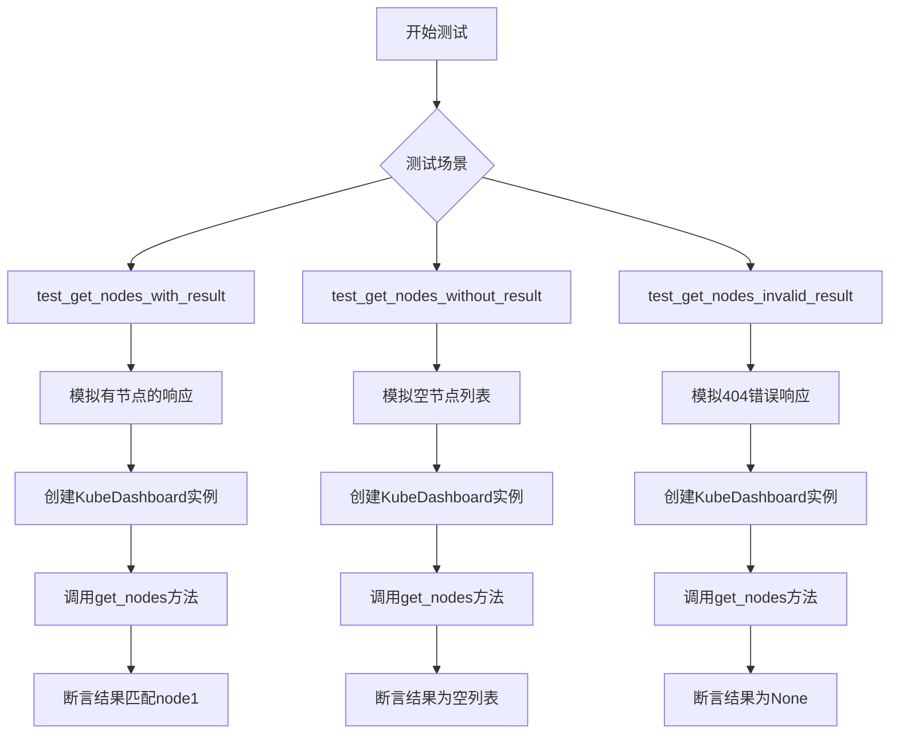
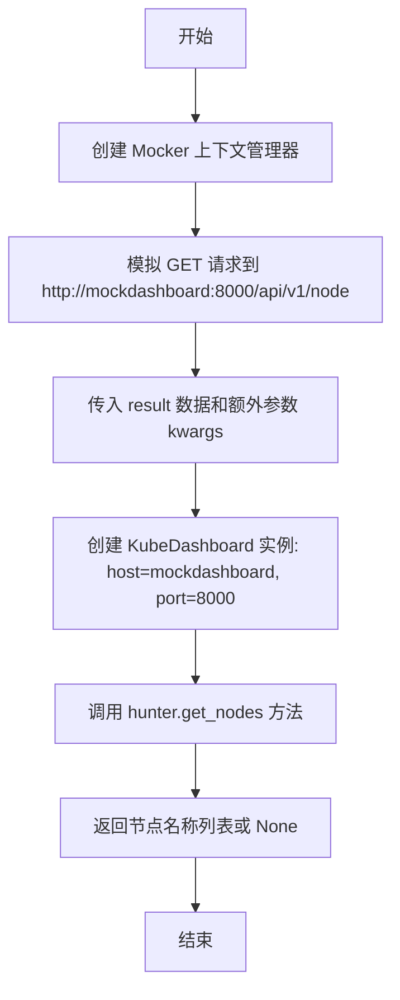

# `kubehunter\tests\hunting\test_dashboard.py` 详细设计文档

这是一个针对KubeDashboard类的单元测试文件，主要测试其获取Kubernetes集群节点的功能，验证在不同场景下（正常返回、空结果、请求失败）get_nodes方法的正确性。

## 整体流程



## 类结构

```
TestKubeDashboard (测试类)
└── 静态方法
    ├── get_nodes_mock
    ├── test_get_nodes_with_result
    ├── test_get_nodes_without_result
    └── test_get_nodes_invalid_result
```

## 全局变量及字段


### `result`
    
模拟的API响应结果，包含节点数据

类型：`dict`
    


### `kwargs`
    
可变关键字参数，用于传递给Mocker的额外配置

类型：`**kwargs`
    


### `m`
    
requests_mock的上下文管理器，用于模拟HTTP请求

类型：`Mocker`
    


### `hunter`
    
被测试的KubeDashboard实例

类型：`KubeDashboard`
    


### `nodes`
    
模拟的节点数据字典，包含nodes列表

类型：`dict`
    


### `expected`
    
测试期望的节点名称列表或None

类型：`list | None`
    


### `actual`
    
实际从get_nodes方法返回的节点名称列表或None

类型：`list | None`
    


    

## 全局函数及方法


### `TestKubeDashboard.get_nodes_mock`

这是一个静态方法，用于在测试环境中模拟 KubeDashboard 的 `get_nodes` 方法调用，通过 requests_mock 库拦截 HTTP 请求并返回预设的节点数据。

参数：

- `result`：`dict`，模拟 API 返回的节点数据字典，包含节点信息
- `**kwargs`：可变关键字参数，用于传递额外的 mock 配置（如 status_code 等）

返回值：`list` 或 `None`，返回节点名称列表或无结果时返回 None

#### 流程图



#### 带注释源码

```python
@staticmethod
def get_nodes_mock(result: dict, **kwargs):
    """
    模拟 KubeDashboard.get_nodes() 方法的测试辅助函数
    
    参数:
        result: dict - 模拟 API 返回的节点数据，如 {"nodes": [{"objectMeta": {"name": "node1"}}]}
        **kwargs: 可变关键字参数，用于传递额外参数如 status_code=404
    
    返回:
        list 或 None - 节点名称列表，失败时返回 None
    """
    # 使用 requests_mock 创建模拟上下文
    with Mocker() as m:
        # 模拟 GET 请求到 Kubernetes Dashboard 的 node 端点
        # text=json.dumps(result): 将字典序列化为 JSON 字符串作为响应体
        # **kwargs: 传递额外参数（如状态码、请求头等）
        m.get("http://mockdashboard:8000/api/v1/node", text=json.dumps(result), **kwargs)
        
        # 创建 KubeDashboard 实例，指定 mock 服务器的主机和端口
        hunter = KubeDashboard(SimpleNamespace(host="mockdashboard", port=8000))
        
        # 调用实际方法获取节点数据
        return hunter.get_nodes()
```


### `TestKubeDashboard.test_get_nodes_with_result`

这是一个单元测试方法，用于验证当 Kubernetes Dashboard API 返回节点列表时，`KubeDashboard.get_nodes()` 方法能够正确解析并返回节点名称列表。

参数：此方法没有显式参数（静态方法）

返回值：无显式返回值（测试方法通过断言验证逻辑）

#### 流程图

```mermaid
flowchart TD
    A[开始测试 test_get_nodes_with_result] --> B[定义测试数据: nodes字典包含一个节点node1]
    C[定义期望结果: expected = ['node1']] --> D[调用get_nodes_mock方法]
    B --> D
    D --> E[get_nodes_mock内部: 创建Mocker模拟HTTP请求]
    E --> F[模拟GET请求 http://mockdashboard:8000/api/v1/node]
    F --> G[创建KubeDashboard实例 host=mockdashboard port=8000]
    G --> H[调用hunter.get_nodes方法]
    H --> I[解析API返回的JSON数据]
    I --> J[提取节点名称列表]
    J --> K[返回actual = ['node1']]
    K --> L[执行断言: expected == actual]
    L --> M{断言结果}
    M -->|通过| N[测试通过]
    M -->|失败| O[测试失败抛出AssertionError]
```

#### 带注释源码

```python
@staticmethod
def test_get_nodes_with_result():
    """
    测试当API返回节点列表时，get_nodes方法能否正确解析并返回节点名称
    
    测试场景：
    - Mock API返回包含一个节点的JSON数据
    - 验证返回的节点名称列表与预期一致
    """
    # 定义模拟的API返回数据，包含一个名为node1的节点
    nodes = {"nodes": [{"objectMeta": {"name": "node1"}}]}
    
    # 定义期望的测试结果：应该返回包含node1的列表
    expected = ["node1"]
    
    # 调用get_nodes_mock方法获取实际结果
    # 该方法内部会：
    # 1. 启动requests_mock模拟HTTP请求
    # 2. 模拟GET /api/v1/node接口返回指定的nodes数据
    # 3. 创建KubeDashboard实例并调用get_nodes方法
    # 4. 返回解析后的节点名称列表
    actual = TestKubeDashboard.get_nodes_mock(nodes)
    
    # 使用断言验证实际结果是否与期望结果一致
    # 如果不一致会抛出AssertionError导致测试失败
    assert expected == actual
```

#### 关联方法信息

**调用链中的关键方法：**

| 方法名 | 类型 | 描述 |
|--------|------|------|
| `TestKubeDashboard.get_nodes_mock` | 静态方法 | 辅助方法，用于创建Mock环境并调用KubeDashboard.get_nodes() |
| `KubeDashboard.get_nodes` | 实例方法 | 实际被测试的KubeDashboard类方法，负责从API获取并解析节点数据 |

#### 技术债务与优化建议

1. **测试数据硬编码**：节点数据结构硬编码在测试方法中，建议提取为测试fixture或参数化
2. **Mock URL硬编码**：API路径 `"http://mockdashboard:8000/api/v1/node"` 硬编码在辅助方法中，缺乏灵活性
3. **错误消息不明确**：断言失败时只能看到布尔结果，建议添加自定义错误消息 `assert expected == actual, f"Expected {expected}, got {actual}"`
4. **缺乏边界测试**：仅测试了单节点场景，建议增加多节点、节点属性为空等边界情况


### `TestKubeDashboard.test_get_nodes_without_result`

该方法是一个单元测试，用于测试当 Kubernetes Dashboard API 返回空节点列表时，`get_nodes()` 方法是否能正确处理并返回空列表。

参数：

- （无）

返回值：`list`，返回从 Kubernetes Dashboard 获取的节点名称列表，此处应为空列表。

#### 流程图

```mermaid
flowchart TD
    A[开始测试] --> B[定义空节点数据: nodes = {'nodes': []}]
    B --> C[定义期望结果: expected = []]
    C --> D[调用get_nodes_mock方法]
    D --> E[创建Mocker上下文]
    E --> F[模拟GET请求: http://mockdashboard:8000/api/v1/node]
    F --> G[返回空列表]
    G --> H[断言: expected == actual]
    H --> I[测试通过/失败]
```

#### 带注释源码

```python
@staticmethod
def test_get_nodes_without_result():
    """
    测试当API返回空节点列表时的处理逻辑
    """
    # 定义模拟的空节点数据，结构为包含nodes键的字典
    nodes = {"nodes": []}
    
    # 期望结果为空列表
    expected = []
    
    # 调用get_nodes_mock方法，传入空节点数据
    # 该方法会创建一个模拟的HTTP响应并调用KubeDashboard.get_nodes()
    actual = TestKubeDashboard.get_nodes_mock(nodes)
    
    # 断言期望值与实际返回值相等
    # 验证get_nodes方法在无节点情况下返回空列表
    assert expected == actual
```


### `TestKubeDashboard.test_get_nodes_invalid_result`

该静态测试方法用于验证当 Kubernetes Dashboard 的 `/api/v1/node` 接口返回 HTTP 404 错误（或其他无效响应）时，`KubeDashboard.get_nodes()` 能够正确地返回 `None`，而不是抛出异常或返回错误数据。

参数：

- （该方法没有显式参数）

返回值：`None`，本测试方法的返回值为 `None`（Python 默认返回），仅用于执行断言。

#### 流程图

```mermaid
graph TD
    Start(开始 test_get_nodes_invalid_result) --> CallMock[调用 get_nodes_mock(dict(), status_code=404)]
    CallMock --> MockContext[进入 Mocker 上下文]
    MockContext --> MockGet[模拟 GET 请求返回 404 状态码]
    MockGet --> Instantiate[实例化 KubeDashboard(host=&quot;mockdashboard&quot;, port=8000)]
    Instantiate --> CallGetNodes[调用 hunter.get_nodes()]
    CallGetNodes --> ReturnActual[返回 actual 结果]
    ReturnActual --> Assert[断言 expected == actual]
    Assert --> End(结束测试)
```

#### 带注释源码

```python
@staticmethod
def test_get_nodes_invalid_result():
    # 期望在接收到 404 错误时，get_nodes 返回 None
    expected = None

    # 调用辅助函数 get_nodes_mock，传入空字典并强制返回 HTTP 404
    # 该函数内部会创建 Mocker、模拟请求、实例化 KubeDashboard 并调用 get_nodes()
    actual = TestKubeDashboard.get_nodes_mock(dict(), status_code=404)

    # 断言实际返回值与期望的 None 相等
    assert expected == actual
```

## 关键组件


### TestKubeDashboard

测试类，用于验证 KubeDashboard 的 get_nodes 方法功能

### get_nodes_mock 静态方法

模拟 HTTP 请求并调用 KubeDashboard.get_nodes() 方法的辅助方法

### test_get_nodes_with_result 测试用例

验证正常返回节点列表的场景

### test_get_nodes_without_result 测试用例

验证节点列表为空的场景

### test_get_nodes_invalid_result 测试用例

验证请求失败的场景

### requests_mock.Mocker

用于模拟 HTTP 响应的上下文管理器

### KubeDashboard 类

被测试的目标类，从 kube_hunter.modules.hunting.dashboard 导入


## 问题及建议


### 已知问题

- **硬编码的Mock URL**：URL "http://mockdashboard:8000/api/v1/node" 被硬编码在测试中，如果实际接口地址改变需要同步修改测试代码
- **缺少边界条件测试**：未测试空字符串、超长数据、特殊字符等边界情况
- **异常场景覆盖不足**：仅测试了404状态码，缺少网络超时、连接失败、JSON解析错误等异常场景
- **静态方法设计**：使用静态方法封装测试逻辑不符合pytest最佳实践，难以利用fixture和参数化
- **测试隔离性差**：mock URL固定，可能与其他测试产生冲突或覆盖
- **断言信息不明确**：使用默认断言，失败时缺乏有意义的错误提示信息
- **代码重复**：expected和actual变量在每个测试方法中重复定义

### 优化建议

- 使用pytest的`@pytest.mark.parametrize`装饰器参数化测试用例，减少重复代码
- 使用pytest fixture管理mock对象，提高测试隔离性和可维护性
- 增加异常场景测试：网络超时、连接拒绝、无效JSON响应等
- 添加边界条件测试：空字符串、超长节点名、特殊字符等
- 使用自定义断言消息，如`assert expected == actual, f"Expected {expected}, got {actual}"`
- 考虑将mock URL提取为常量或通过fixture参数化传入
- 添加请求验证测试，检查请求头、认证信息等是否正确发送
- 考虑集成测试与单元测试分离，使用真实mock服务器测试更完整的场景

## 其它


### 设计目标与约束

该测试类旨在验证 KubeDashboard 类的 get_nodes 方法在不同场景下的行为，包括正常返回结果、空结果和错误响应的情况。测试使用 requests_mock 库模拟 HTTP 请求，不依赖真实的 Kubernetes 集群环境。

### 错误处理与异常设计

测试覆盖了三种场景：正常返回节点列表（返回节点名称列表）、空节点列表（返回空列表）、无效响应（返回 None）。当 HTTP 请求返回 404 状态码时，get_nodes 方法应返回 None 而不是抛出异常。

### 数据流与状态机

测试数据流：调用 get_nodes_mock 方法 → 创建 Mocker 上下文 → 注册 mock URL 和响应 → 实例化 KubeDashboard → 调用 get_nodes 方法 → 返回节点名称列表或 None。

### 外部依赖与接口契约

依赖 requests_mock 库进行 HTTP 请求模拟，依赖 KubeDashboard 类的 get_nodes 方法。接口契约：get_nodes 方法接收无参数，返回节点名称列表（List[str]）或 None。

### 测试覆盖率分析

测试覆盖了三种场景：成功获取节点列表、节点列表为空、API 返回错误（404）。建议增加异常情况测试，如网络超时、连接失败、JSON 解析错误等。

### 性能考虑

使用 Mocker 上下文管理器确保 mock 资源正确释放。测试执行速度取决于 requests_mock 的模拟速度，通常很快。

### 安全考虑

测试使用虚拟的 mock URL（http://mockdashboard:8000），不会泄露真实的 Kubernetes 集群信息。建议在测试中验证异常情况下的日志记录行为。

### 集成点

该测试类与 KubeDashboard 类紧密集成，属于 kube-hunter 项目的测试套件一部分。测试需要与 hunting 模块中的 dashboard 模块正确导入和交互。

### 配置管理

测试使用硬编码的 mock URL（mockdashboard:8000）和 API 路径（/api/v1/node）。建议将这些配置提取为测试 fixture 或配置常量，以便于维护和修改。

### 版本兼容性

代码使用 Python 3 类型注解（dict, **kwargs），需要 Python 3.5+。requests_mock 库需要与项目其他依赖版本兼容。

### 边界条件与极限值

测试了空节点列表的情况，但未测试节点数量非常大的场景（极限值测试）。建议添加大规模节点列表的测试，以验证性能表现。

    