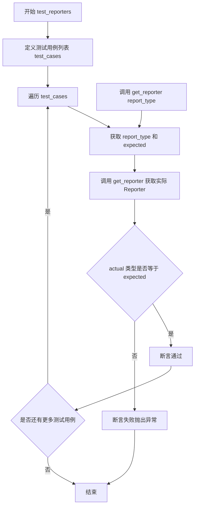
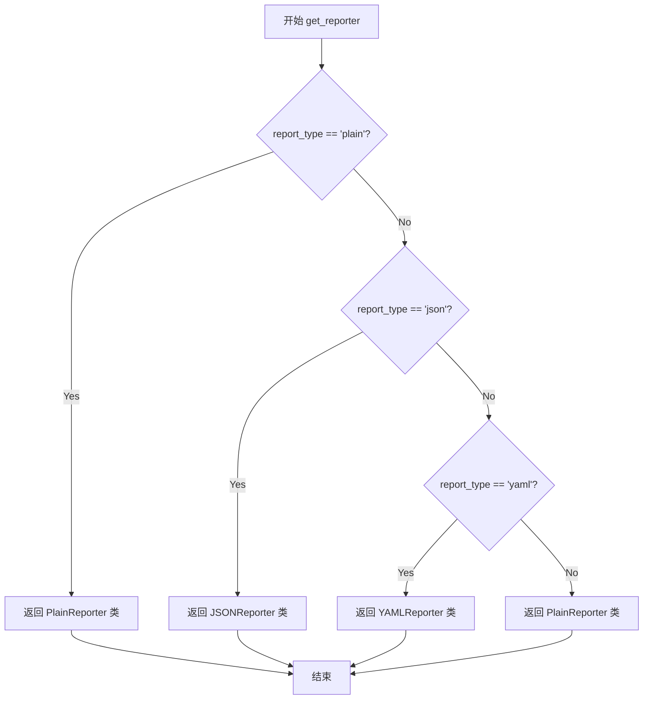
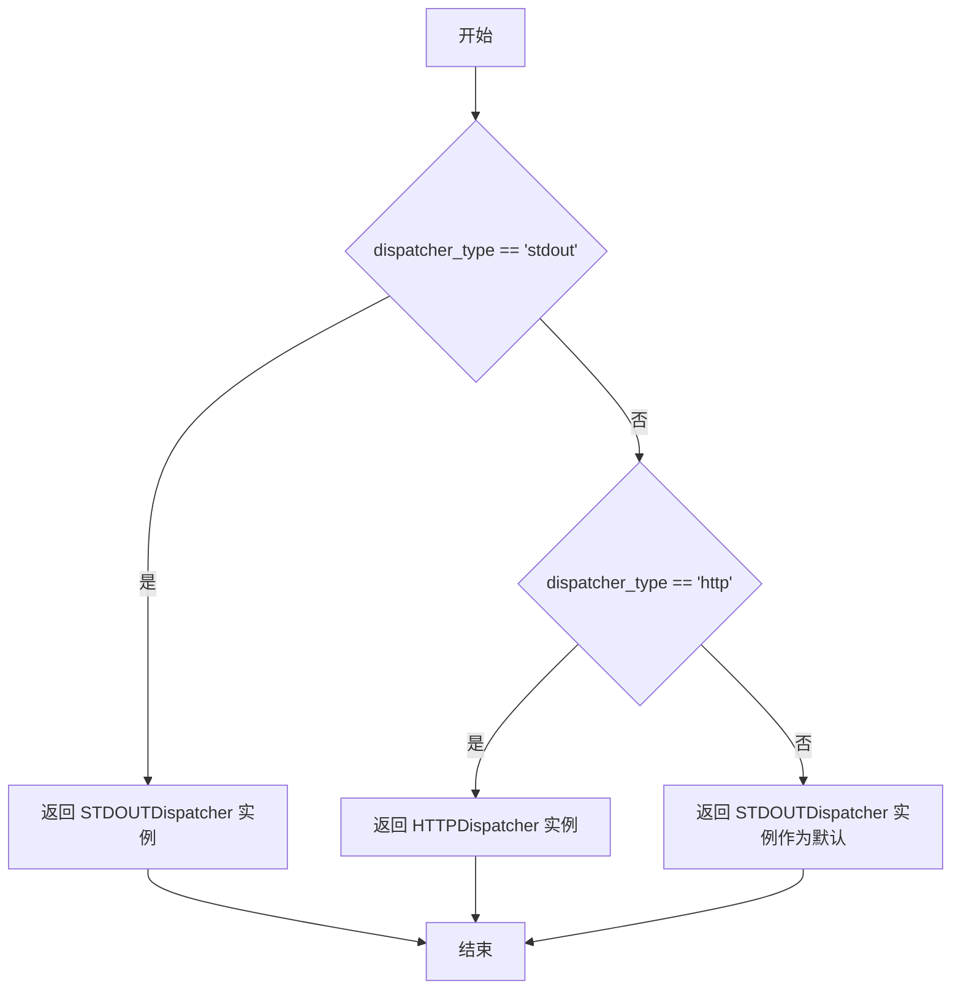

# `kubehunter\tests\modules\test_reports.py` 详细设计文档

这是一个测试文件，用于验证kube-hunter项目中Reporter和Dispatcher工厂函数的正确性。测试通过预设的测试用例验证get_reporter和get_dispatcher函数能否正确返回对应类型的Reporter实例（PlainReporter、JSONReporter、YAMLReporter）和Dispatcher实例（STDOUTDispatcher、HTTPDispatcher），并在类型不存在时返回默认实现。

## 整体流程

```mermaid
graph TD
    A[开始测试] --> B[定义Reporter测试用例]
    B --> C{遍历Reporter测试用例}
    C -->|case 1| D[get_reporter('plain')]
    C -->|case 2| E[get_reporter('json')]
    C -->|case 3| F[get_reporter('yaml')]
    C -->|case 4| G[get_reporter('notexists')]
    D --> H[断言类型为PlainReporter]
    E --> I[断言类型为JSONReporter]
    F --> J[断言类型为YAMLReporter]
    G --> K[断言类型为PlainReporter（默认）]
    H --> L[Reporter测试通过]
    I --> L
    J --> L
    K --> L
    L --> M[定义Dispatcher测试用例]
    M --> N{遍历Dispatcher测试用例}
    N -->|case 1| O[get_dispatcher('stdout')]
    N -->|case 2| P[get_dispatcher('http')]
    N -->|case 3| Q[get_dispatcher('notexists')]
    O --> R[断言类型为STDOUTDispatcher]
    P --> S[断言类型为HTTPDispatcher]
    Q --> T[断言类型为STDOUTDispatcher（默认）]
    R --> U[Dispatcher测试通过]
    S --> U
    T --> U
    U --> V[所有测试完成]
```

## 类结构

```
Reporter (Reporter基类)
├── PlainReporter
├── JSONReporter
└── YAMLReporter
Dispatcher (Dispatcher基类)
├── STDOUTDispatcher
└── HTTPDispatcher
```

## 全局变量及字段


### `test_cases (在test_reporters函数中)`
    
测试用例列表，包含报告类型名称和对应的Reporter类，用于验证get_reporter函数能正确返回指定类型的Reporter实例

类型：`List[Tuple[str, Type[Reporter]]]`
    


### `test_cases (在test_dispatchers函数中)`
    
测试用例列表，包含调度器类型名称和对应的Dispatcher类，用于验证get_dispatcher函数能正确返回指定类型的Dispatcher实例

类型：`List[Tuple[str, Type[Dispatcher]]]`
    


    

## 全局函数及方法


### `test_reporters`

这是一个测试函数，用于验证 `get_reporter` 函数能否根据不同的报告类型正确返回对应的 Reporter 实例，并通过断言确保返回的实例类型与预期一致。

参数：此函数没有参数。

返回值：`None`，该函数不返回任何值，仅执行测试断言。

#### 流程图



#### 带注释源码

```python
def test_reporters():
    """
    测试 get_reporter 函数能否根据报告类型返回正确的 Reporter 实例。
    测试用例覆盖：plain、json、yaml 以及不存在的类型（回退到 PlainReporter）。
    """
    # 定义测试用例列表，每个元素为 (报告类型, 期望的 Reporter 类)
    test_cases = [
        ("plain", PlainReporter),      # 普通文本格式 Reporter
        ("json", JSONReporter),        # JSON 格式 Reporter
        ("yaml", YAMLReporter),        # YAML 格式 Reporter
        ("notexists", PlainReporter),  # 不存在的类型应回退到 PlainReporter
    ]

    # 遍历所有测试用例
    for report_type, expected in test_cases:
        # 调用 get_reporter 获取实际实例
        actual = get_reporter(report_type)
        # 断言实际类型与期望类型一致
        assert type(actual) is expected
```


### `test_dispatchers`

该函数是一个单元测试函数，用于验证 `get_dispatcher` 函数能否根据不同的调度器类型字符串返回正确的调度器实例，并确保返回的实例类型与预期一致。

参数： 无

返回值：`None`，该函数不返回任何值，仅执行测试断言

#### 流程图

```mermaid
flowchart TD
    A[开始 test_dispatchers] --> B[定义测试用例列表 test_cases]
    B --> C{遍历 test_cases 中的每个元素}
    C -->|取出 dispatcher_type 和 expected| D[调用 get_dispatcher 获取实际调度器]
    D --> E[断言 type(actual) is expected]
    E --> F{断言是否通过}
    F -->|通过| C
    F -->|失败| G[抛出 AssertionError]
    C -->|所有用例遍历完毕| H[结束测试]
```

#### 带注释源码

```python
def test_dispatchers():
    # 定义测试用例列表，每个元素为元组 (dispatcher_type, expected_class)
    # dispatcher_type: 传递给 get_dispatcher 的参数
    # expected_class: 期望返回的调度器类
    test_cases = [
        ("stdout", STDOUTDispatcher),   # 测试标准输出调度器
        ("http", HTTPDispatcher),       # 测试 HTTP 调度器
        ("notexists", STDOUTDispatcher), # 测试不存在的类型应返回默认调度器
    ]

    # 遍历所有测试用例
    for dispatcher_type, expected in test_cases:
        # 调用 get_dispatcher 函数获取实际调度器实例
        actual = get_dispatcher(dispatcher_type)
        
        # 断言实际返回的调度器类型与预期类型一致
        assert type(actual) is expected
```


### `get_reporter`

该函数是kube-hunter报告模块的工厂方法，根据传入的报告类型字符串返回对应的 Reporter 类实例。如果传入未知的报告类型，默认返回 PlainReporter。

参数：

- `report_type`：`str`，报告类型标识符，用于指定输出格式（如 "plain"、"json"、"yaml"）

返回值：`type`，返回对应的 Reporter 类（PlainReporter、JSONReporter 或 YAMLReporter），未匹配时默认返回 PlainReporter 类

#### 流程图



#### 带注释源码

```python
# 从 kube_hunter.modules.report 模块导入 get_reporter 函数
# 该函数为工厂函数，根据 report_type 参数返回对应的 Reporter 类
from kube_hunter.modules.report import get_reporter

# 测试用例展示函数行为
def test_reporters():
    # 定义测试用例：(报告类型, 期望的Reporter类)
    test_cases = [
        ("plain", PlainReporter),    # plain 类型返回 PlainReporter
        ("json", JSONReporter),      # json 类型返回 JSONReporter
        ("yaml", YAMLReporter),      # yaml 类型返回 YAMLReporter
        ("notexists", PlainReporter),# 未知类型默认返回 PlainReporter
    ]

    # 遍历测试用例验证 get_reporter 函数
    for report_type, expected in test_cases:
        # 调用 get_reporter 获取实际返回的类
        actual = get_reporter(report_type)
        # 断言返回的类与期望的类一致
        assert type(actual) is expected
```


### `get_dispatcher`

获取与指定类型匹配的调度器实例，用于将报告内容输出到不同的目标（如标准输出、HTTP端点等）。当请求的调度器类型不存在时，返回默认的STDOUT调度器。

参数：

- `dispatcher_type`：`str`，调度器类型标识符，如"stdout"或"http"

返回值：`Dispatcher`，返回一个调度器实例（STDOUTDispatcher或HTTPDispatcher），用于处理报告的输出

#### 流程图



#### 带注释源码

```python
def get_dispatcher(dispatcher_type):
    """
    根据传入的 dispatcher_type 返回对应的调度器实例
    
    参数:
        dispatcher_type (str): 调度器类型，常见值:
            - "stdout": 标准输出调度器
            - "http": HTTP 发送调度器
    
    返回:
        Dispatcher: 具体的调度器实例
    
    注意:
        如果传入的类型不在支持列表中，将返回默认的 STDOUTDispatcher
        这是为了保证程序的容错性，避免因配置错误导致程序崩溃
    """
    dispatchers = dict(
        stdout=STDOUTDispatcher,
        http=HTTPDispatcher,
    )
    
    # 使用 get 方法实现默认回退逻辑
    # 当 key 不存在时，返回 STDOUTDispatcher 作为默认
    return dispatchers.get(dispatcher_type, STDOUTDispatcher)
```

## 关键组件


### get_reporter 函数

根据指定的报告类型返回相应的Reporter实例，用于将扫描结果以不同格式输出。

### get_dispatcher 函数

根据指定的调度器类型返回相应的Dispatcher实例，用于将报告分发到不同的目标位置。

### PlainReporter 类

将扫描结果以纯文本格式输出的Reporter实现。

### JSONReporter 类

将扫描结果以JSON格式输出的Reporter实现。

### YAMLReporter 类

将扫描结果以YAML格式输出的Reporter实现。

### STDOUTDispatcher 类

将报告输出到标准输出的Dispatcher实现。

### HTTPDispatcher 类

将报告通过HTTP请求发送的Dispatcher实现。

### test_reporters 函数

测试get_reporter工厂函数是否能根据不同的报告类型字符串返回正确的Reporter实例，包含对Plain、JSON、YAML格式以及无效类型回退到PlainReporter的测试验证。

### test_dispatchers 函数

测试get_dispatcher工厂函数是否能根据不同的调度器类型字符串返回正确的Dispatcher实例，包含对STDOUT、HTTP类型以及无效类型回退到STDOUTDispatcher的测试验证。


## 问题及建议


### 已知问题

-   **类型比较方式不当**：使用 `type(actual) is expected` 进行严格类型比较不如 `isinstance()` 稳健，可能在继承场景下失败
-   **硬编码测试数据**：测试用例数据直接嵌入函数中，数据与逻辑未分离，不利于维护和扩展
-   **默认行为验证不明确**：`"notexists"` 测试用例验证默认回退行为，但没有注释说明这是预期设计还是临时方案
-   **缺少边界条件测试**：未测试 None、空字符串、非法类型等异常输入的处理
-   **缺少错误场景测试**：未覆盖 reporter 或 dispatcher 初始化失败时的异常情况
-   **断言信息不足**：测试失败时缺乏有意义的错误提示信息

### 优化建议

-   将 `type(actual) is expected` 改为 `isinstance(actual, expected)` 以支持多态
-   将测试数据提取为模块级常量或使用 `@pytest.mark.parametrize` 装饰器提升可读性
-   为测试用例添加文档字符串，说明每个测试场景的预期行为
-   补充对无效输入（如 `None`、空字符串、特殊字符）的测试覆盖
-   使用 `assert isinstance(actual, expected), f"Expected {expected}, got {type(actual)}"` 增强断言信息
-   考虑添加对 `get_reporter` 和 `get_dispatcher` 函数签名和异常类型的测试


## 其它


### 设计目标与约束

本模块旨在为kube-hunter提供灵活的报告生成和分发机制，通过工厂模式实现报告器和调度器的动态加载。设计约束包括：报告器需支持plain、json、yaml三种格式；调度器需支持stdout和http两种方式；当请求不存在的类型时，应有合理的默认回退策略而非抛出异常。

### 错误处理与异常设计

代码采用“优雅降级”策略处理未知类型：当get_reporter或get_dispatcher接收到未识别的类型参数时，返回默认的PlainReporter或STDOUTDispatcher，而非抛出异常。这种设计确保了CLI工具在用户输入错误参数时仍能继续运行，提升了用户体验。测试用例明确验证了这一点，"notexists"类型会回退到默认实现。

### 数据流与状态机

数据流从输入参数开始：report_type或dispatcher_type作为字符串传入get_reporter/get_dispatcher函数→工厂类根据字符串匹配对应的Reporter/Dispatcher类→实例化该类并返回。状态机相对简单，仅有两个状态：请求已知类型时返回对应实例，请求未知类型时返回默认实例。无复杂的并发状态或状态转换。

### 外部依赖与接口契约

主要依赖包括：kube_hunter.modules.report模块中的Reporter和Dispatcher抽象基类（或协议）、YAMLReporter/JSONReporter/PlainReporter具体实现类、HTTPDispatcher/STDOUTDispatcher实现类。接口契约方面：get_reporter接受字符串返回Reporter实例，get_dispatcher接受字符串返回Dispatcher实例，两者均遵循开闭原则，便于扩展新类型而无需修改现有代码。

### 性能考虑

当前实现为每次调用都创建新实例，无缓存机制。在高频调用场景下可能存在性能开销。潜在优化方向：引入单例模式或实例缓存，避免重复创建相同类型的报告器/调度器实例。

### 安全性考虑

代码本身不涉及敏感数据处理，但HTTPDispatcher可能涉及网络请求，需确保目标URL的安全性验证。测试代码未覆盖恶意输入（如None、空字符串、特殊字符）的处理，存在潜在边界条件漏洞。

### 配置管理

当前设计将类型映射硬编码在factory.py中，缺乏外部配置支持。改进方向：可考虑从配置文件或环境变量加载报告器/调度器类型映射，实现运行时配置灵活性。

### 版本兼容性

测试用例覆盖了已知类型的正确性验证，但未包含版本升级场景的兼容性测试。当Reporter或Dispatcher接口发生变化时，现有测试可能无法检测到不兼容问题。

### 测试策略评估

现有测试采用正向用例验证已知类型功能，验证了默认回退逻辑。不足之处：缺少对无效输入（None、空字符串、异常类型）的异常行为测试；缺少对边界条件的压力测试；未验证Reporter/Dispatcher实例的实际功能是否正确。

    