# `KubiScan\KubiScan.py` 详细设计文档

KubiScan是一款Kubernetes安全扫描工具，用于检测集群中的风险角色(Roles/ClusterRoles)、角色绑定(RoleBindings/ClusterRoleBindings)、高风险用户、Pod/容器以及CVE漏洞信息，帮助安全审计人员识别权限配置错误和潜在安全风险。

## 整体流程

```mermaid
graph TD
    A[开始] --> B[解析命令行参数]
B --> C{是否静默模式?}
C -- 否 --> D[打印Logo]
C -- 是 --> E[初始化API客户端]
E --> F{是否静态扫描?}
F -- 是 --> G[使用静态文件API客户端]
F -- 否 --> H[使用Kubernetes API客户端]
G --> I[处理各类扫描请求]
H --> I
I --> J{请求类型}
J -- CVE扫描 --> K[print_cve]
J -- 风险角色 --> L[print_risky_roles/print_risky_clusterroles]
J -- 风险绑定 --> M[print_risky_rolebindings]
J -- 风险主体 --> N[print_all_risky_subjects]
J -- 风险Pod --> O[print_all_risky_containers]
J -- CVE扫描 --> K
J -- 特权Pod --> P[print_privileged_containers]
J -- JoinToken --> Q[print_join_token]
J -- Secret访问 --> R[print_pods_with_access_secret]
K --> S[输出结果表格]
L --> S
M --> S
N --> S
O --> S
P --> S
Q --> S
R --> S
S --> T{是否导出JSON?}
T -- 是 --> U[export_to_json]
T -- 否 --> V[直接打印表格]
U --> V
V --> W[结束]
```

## 类结构

```
KubiScan (主模块)
├── 全局变量
│   ├── json_filename
│   ├── output_file
│   ├── no_color
│   └── curr_header
├── 工具函数
│   ├── 颜色/优先级处理
│   ├── 对象过滤
│   ├── 日期处理
│   ├── CVE处理
│   ├── 版本比较
规则格式化
├── 打印函数
风险角色打印
风险绑定打印
风险主体打印
Pod/容器打印
关联关系打印
表格输出
└── 主函数 (main)
```

## 全局变量及字段


### `json_filename`
    
存储JSON导出文件名，用于将表格数据导出到JSON文件

类型：`str`
    


### `output_file`
    
存储输出文件路径，用于将标准输出重定向到指定文件

类型：`str`
    


### `no_color`
    
控制是否禁用彩色输出，True表示禁用颜色，False表示启用颜色

类型：`bool`
    


### `curr_header`
    
存储当前打印的表头内容，用于JSON导出时记录表格标题

类型：`str`
    


    

## 全局函数及方法


### `get_color_by_priority(priority)`

根据优先级返回对应的颜色值，用于在终端输出中以颜色区分不同优先级的内容。

参数：

- `priority`：`Priority`，优先级枚举值，用于判断应返回哪种颜色

返回值：`str`，返回对应的颜色常量（RED、LIGHTYELLOW 或 WHITE）

#### 流程图

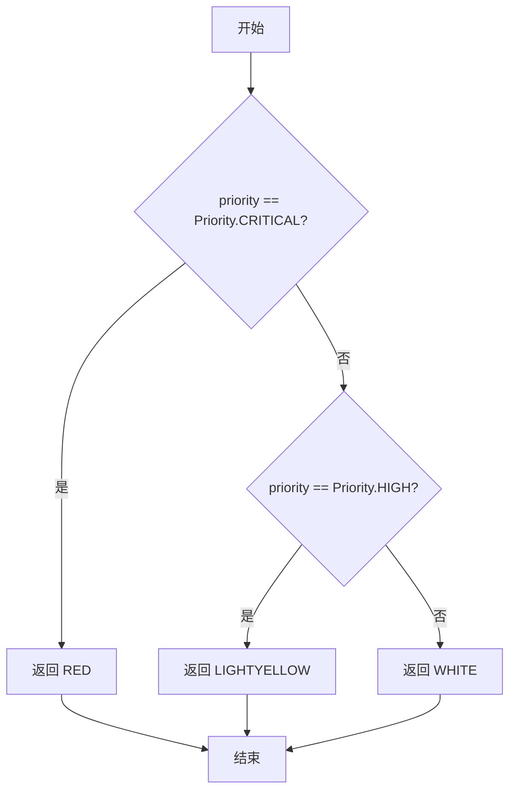

#### 带注释源码

```python
def get_color_by_priority(priority):
    """
    根据优先级返回对应颜色
    
    参数:
        priority: Priority枚举值，表示对象的优先级
    
    返回:
        str: 对应的颜色常量，用于终端彩色输出
    """
    # 默认颜色为白色
    color = WHITE
    
    # 如果优先级为严重(CRITICAL)，返回红色
    if priority == Priority.CRITICAL:
        color = RED
    # 如果优先级为高(HIGH)，返回浅黄色
    elif priority == Priority.HIGH:
        color = LIGHTYELLOW

    # 返回最终确定的颜色
    return color
```


### `filter_objects_less_than_days(days, objects)`

该函数用于过滤出在指定天数内创建的对象。它接收一个天数阈值和一个对象列表作为参数，遍历对象列表并根据对象的 `time` 属性判断其创建时间是否在指定天数内，返回满足条件的新建对象列表。

参数：

- `days`：`int`，表示时间阈值，用于过滤指定天数内创建的对象
- `objects`：`list`，待过滤的对象列表，这些对象应具有 `time` 属性来表示创建时间

返回值：`list`，返回满足条件的新建对象列表

#### 流程图

```mermaid
flowchart TD
    A[开始] --> B[获取当前日期时间 current_datetime]
    B --> C[初始化空列表 filtered_objects]
    C --> D{遍历 objects 中的每个 object}
    D -->|是| E{object.time 是否存在}
    E -->|否| D
    E -->|是| F[计算天数差: (current_datetime.date() - object.time.date()).days]
    F --> G{天数差 < days?}
    G -->|是| H[将 object 添加到 filtered_objects]
    G -->|否| D
    H --> D
    D -->|遍历完成| I[将 filtered_objects 赋值给 objects]
    I --> J[返回 objects]
    J --> K[结束]
```

#### 带注释源码

```python
def filter_objects_less_than_days(days, objects):
    """过滤出在指定天数内创建的对象
    
    参数:
        days: int, 指定的天数阈值
        objects: list, 包含对象的列表，每个对象应有 time 属性表示创建时间
    
    返回:
        list: 在指定天数内创建的对象列表
    """
    filtered_objects = []  # 初始化过滤后的对象列表
    current_datetime = datetime.datetime.now()  # 获取当前日期时间
    
    # 遍历所有传入的对象
    for object in objects:
        # 检查对象是否有创建时间属性
        if object.time:
            # 计算当前日期与对象创建日期的天数差
            # 如果天数差小于指定的天数，则保留该对象
            if (current_datetime.date() - object.time.date()).days < days:
                filtered_objects.append(object)

    # 将过滤后的对象列表赋值给 objects 变量
    objects = filtered_objects
    return objects  # 返回过滤后的对象列表
```


### `filter_objects_by_priority`

该函数用于根据指定的优先级（priority）从对象列表中筛选出匹配优先级的对象，返回过滤后的对象列表。

**参数：**

- `priority`：`str`，需要过滤的优先级级别（如 "CRITICAL"、"HIGH"、"LOW" 等字符串）
- `objects`：`list`，待过滤的对象列表，每个对象应具有 `priority` 属性且该属性包含 `name` 属性

**返回值：** `list`，返回过滤后包含指定优先级的对象列表

#### 流程图

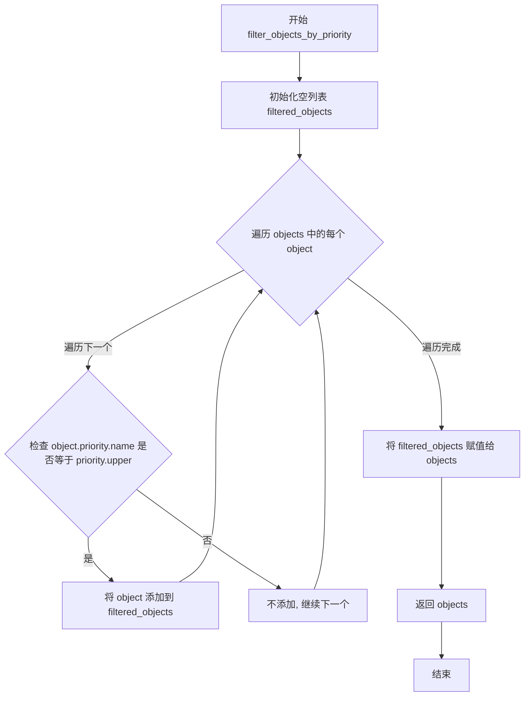

#### 带注释源码

```python
def filter_objects_by_priority(priority, objects):
    """
    按优先级过滤对象列表
    
    参数:
        priority: str, 优先级字符串 (如 "CRITICAL", "HIGH", "LOW")
        objects: list, 待过滤的对象列表
    
    返回:
        list: 过滤后的对象列表
    """
    # 初始化用于存储过滤后对象的空列表
    filtered_objects = []
    
    # 遍历传入的每个对象
    for object in objects:
        # 检查对象的优先级名称是否与指定的优先级匹配（不区分大小写）
        if object.priority.name == priority.upper():
            # 如果匹配，将该对象添加到过滤后的列表中
            filtered_objects.append(object)
    
    # 将过滤后的列表重新赋值给 objects 变量
    objects = filtered_objects
    
    # 返回过滤后的对象列表
    return objects
```


### `get_delta_days_from_now(date)`

该函数用于计算给定日期与当前日期之间的天数差，常用于筛选在指定天数内创建或修改的Kubernetes资源对象。

**参数：**

- `date`：`datetime.datetime`，需要计算天数差的日期对象

**返回值：** `int`，返回当前日期与给定日期之间的天数差（当前日期减去给定日期的天数）

#### 流程图

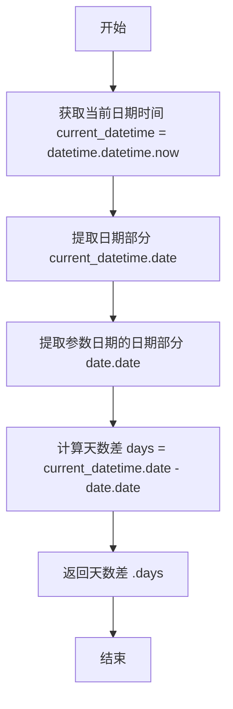

#### 带注释源码

```python
def get_delta_days_from_now(date):
    """
    计算给定日期与当前日期的天数差
    
    参数:
        date: datetime.datetime 对象，需要计算天数差的日期
    
    返回:
        int: 当前日期与给定日期之间的天数差
             正数表示给定日期在当前日期之前
             负数表示给定日期在当前日期之后
    """
    # 获取当前的日期时间对象
    current_datetime = datetime.datetime.now()
    
    # 计算当前日期与给定日期的天数差
    # 使用 .date() 方法提取日期部分，忽略时间
    # .days 属性返回两个日期之间的天数差（timedelta 类型）
    return (current_datetime.date() - date.date()).days
```


### `print_all_risky_roles`

该函数用于打印所有风险角色（Roles）和集群角色（ClusterRoles），支持按创建天数和优先级进行过滤，并可选择显示规则详情。

参数：

- `show_rules`：`bool`，是否显示规则详情
- `days`：`int` 或 `None`，过滤创建时间小于指定天数的对象
- `priority`：`str` 或 `None`，按优先级过滤（如 "CRITICAL", "HIGH", "LOW"）
- `namespace`：`str` 或 `None`，命名空间（此参数会被忽略，该函数不支持 namespace 过滤）

返回值：`None`，该函数无返回值，仅执行打印操作

#### 流程图

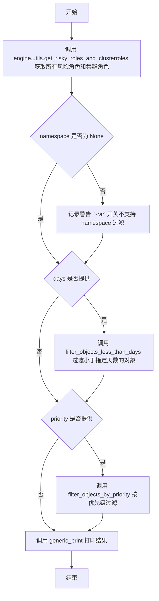

#### 带注释源码

```python
def print_all_risky_roles(show_rules=False, days=None, priority=None, namespace=None):
    """
    打印所有风险角色（Roles）和集群角色（ClusterRoles）
    
    参数:
        show_rules: 是否显示规则详情
        days: 过滤创建时间小于指定天数的对象
        priority: 按优先级过滤
        namespace: 命名空间（此参数会被忽略）
    """
    # 调用引擎工具函数获取所有风险角色和集群角色
    risky_any_roles = engine.utils.get_risky_roles_and_clusterroles()
    
    # 如果提供了 namespace 参数，记录警告（因为该函数不支持 namespace 过滤）
    if namespace is not None:
        logging.warning("'-rar' switch does not expect namespace ('-ns')\n")
    
    # 如果提供了 days 参数，按创建时间过滤
    if days:
        risky_any_roles = filter_objects_less_than_days(int(days), risky_any_roles)
    
    # 如果提供了 priority 参数，按优先级过滤
    if priority:
        risky_any_roles = filter_objects_by_priority(priority, risky_any_roles)
    
    # 调用通用打印函数输出结果
    generic_print('|Risky Roles and ClusterRoles|', risky_any_roles, show_rules)
```


### `print_risky_roles`

该函数用于获取并打印Kubernetes中的风险角色（Risky Roles），支持按创建时间天数、优先级和命名空间进行过滤，并根据`show_rules`参数决定是否显示角色的规则。

参数：

- `show_rules`：`bool`，是否显示角色的规则，默认为`False`
- `days`：`int` 或 `None`，过滤对象创建时间少于指定天数的角色
- `priority`：`str` 或 `None`，按优先级过滤角色（如CRITICAL、HIGH、LOW）
- `namespace`：`str` 或 `None`，按命名空间过滤角色，若为`None`则显示所有命名空间的角色

返回值：`None`，该函数仅执行打印操作，无返回值

#### 流程图

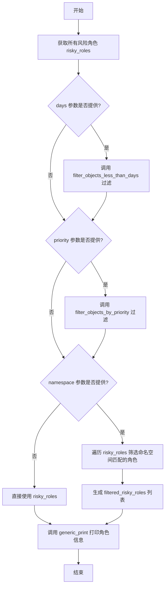

#### 带注释源码

```python
def print_risky_roles(show_rules=False, days=None, priority=None, namespace=None):
    """
    打印风险角色信息，支持按天数、优先级和命名空间过滤
    
    参数:
        show_rules: bool, 是否显示角色的规则详情
        days: int or None, 仅显示创建时间少于指定天数的角色
        priority: str or None, 按优先级过滤 (CRITICAL/HIGH/LOW)
        namespace: str or None, 按命名空间过滤，None表示所有命名空间
    """
    
    # 步骤1: 从引擎工具获取所有风险角色列表
    risky_roles = engine.utils.get_risky_roles()

    # 步骤2: 如果提供了days参数，按创建时间过滤
    if days:
        risky_roles = filter_objects_less_than_days(int(days), risky_roles)
    
    # 步骤3: 如果提供了priority参数，按优先级过滤
    if priority:
        risky_roles = filter_objects_by_priority(priority, risky_roles)

    # 步骤4: 根据namespace参数决定过滤方式
    filtered_risky_roles = []
    if namespace is None:
        # 未指定命名空间，直接打印所有风险角色
        generic_print('|Risky Roles |', risky_roles, show_rules)
    else:
        # 指定了命名空间，遍历并筛选出命名空间匹配的角色
        for risky_role in risky_roles:
            if risky_role.namespace == namespace:
                filtered_risky_roles.append(risky_role)
        # 打印过滤后的风险角色
        generic_print('|Risky Roles |', filtered_risky_roles, show_rules)
```


### `print_cve`

该函数用于获取当前Kubernetes集群版本，并根据版本信息从CVE数据库中检索所有受该版本影响的CVE漏洞，最后以表格形式打印输出。

参数：

- `certificate_authority_file`：`str`，证书颁发机构(CA)文件路径，用于API服务器通信验证（可选）
- `client_certificate_file`：`str`，客户端证书文件路径，用于客户端身份验证（可选）
- `client_key_file`：`str`，客户端密钥文件路径，用于客户端身份验证（可选）
- `host`：`str`，Kubernetes API服务器主机地址，格式如`IP:PORT`（可选）

返回值：`None`，该函数不返回任何值，结果直接打印到标准输出

#### 流程图

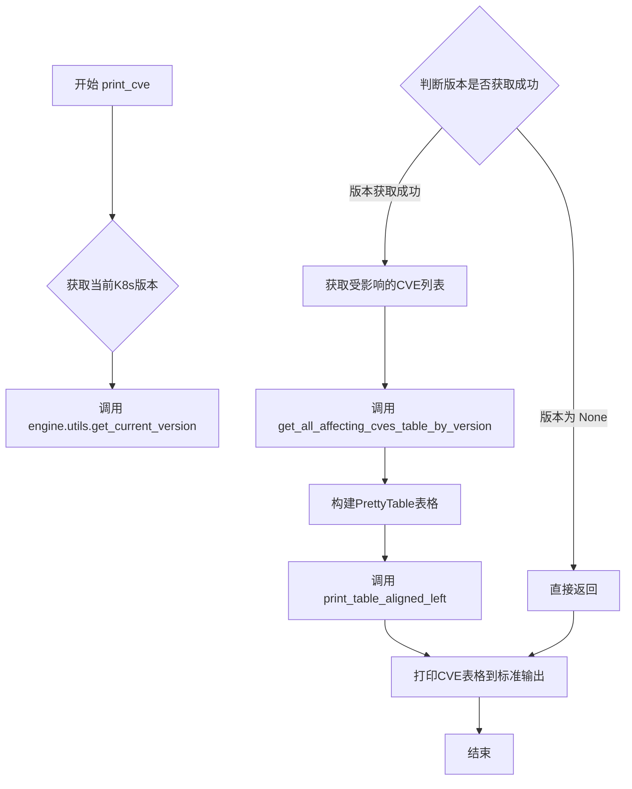

#### 带注释源码

```python
def print_cve(certificate_authority_file=None, client_certificate_file=None, client_key_file=None, host=None):
    """
    打印与当前Kubernetes版本相关的CVE信息
    
    参数:
        certificate_authority_file: CA证书文件路径，用于API认证
        client_certificate_file: 客户端证书文件路径
        client_key_file: 客户端密钥文件路径
        host: Kubernetes API服务器地址
    
    返回:
        None: 直接打印CVE表格到标准输出
    """
    # 调用engine.utils模块获取当前Kubernetes集群版本
    # 传递认证所需的证书和主机信息
    current_k8s_version = engine.utils.get_current_version(
        certificate_authority_file, 
        client_certificate_file, 
        client_key_file, 
        host
    )
    
    # 如果无法获取到版本（例如API连接失败），则直接返回
    if current_k8s_version is None:
        return
    
    # 根据获取到的版本号，查询所有影响该版本的CVE
    # 返回一个PrettyTable对象
    cve_table = get_all_affecting_cves_table_by_version(current_k8s_version)
    
    # 调用打印函数，将CVE表格左对齐打印到标准输出
    # 该函数还支持JSON导出（通过全局变量json_filename控制）
    print_table_aligned_left(cve_table)
```


### `get_all_affecting_cves_table_by_version`

该函数接收当前Kubernetes版本号，从本地CVE.json文件中加载CVE数据，遍历所有CVE并筛选出影响当前版本的CVE记录，然后构建并返回一个包含CVE详情的PrettyTable表格对象，按CVE等级降序排列。

**参数：**

- `current_k8s_version`：`str`，当前Kubernetes集群的版本号，用于与CVE的修复版本进行对比，判断是否受影响。

**返回值：** `PrettyTable`，返回一个包含所有影响当前Kubernetes版本的CVE信息的表格对象，表格列包括Severity（严重级别）、CVE Grade（CVE等级）、CVE（CVE编号）、Description（描述）和FixedVersions（修复版本），按CVE Grade降序排序。

#### 流程图

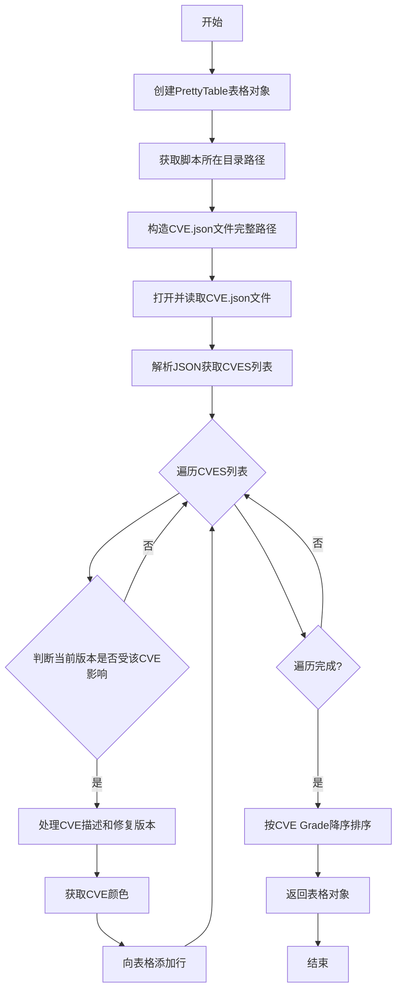

#### 带注释源码

```python
def get_all_affecting_cves_table_by_version(current_k8s_version):
    # 创建一个PrettyTable对象，定义表格列：Severity（严重级别）、CVE Grade（CVE等级）、CVE（CVE编号）、Description（描述）、FixedVersions（修复版本）
    cve_table = PrettyTable(['Severity', 'CVE Grade', 'CVE', 'Description', 'FixedVersions'])
    # 设置表格水平规则为ALL，显示所有水平线
    cve_table.hrules = ALL
    # 获取当前脚本所在的目录路径
    script_dir = os.path.dirname(__file__)
    # 拼接CVE.json文件的完整路径
    cve_file = os.path.join(script_dir, 'CVE.json')
    # 打开CVE.json文件并读取内容
    with open(cve_file, 'r') as f:
        # 解析JSON数据
        data = json.load(f)
    # 获取CVES列表
    cves = data['CVES']
    # 遍历所有CVE记录
    for cve in cves:
        # 判断当前Kubernetes版本是否受该CVE影响
        if curr_version_is_affected(cve, current_k8s_version):
            # 处理CVE描述，将其分割成多行以便于显示
            cve_description = split_cve_description(cve['Description'])
            # 获取该CVE的修复版本列表
            fixed_version_list = get_fixed_versions_of_cve(cve["FixedVersions"])
            # 根据CVE严重级别获取对应的颜色
            cve_color = get_cve_color(cve['Severity'])
            # 向表格添加一行数据，包含颜色、CVE等级、编号、描述和修复版本
            cve_table.add_row([cve_color + cve['Severity'] + WHITE, cve['Grade'], cve['CVENumber'], cve_description,
                       fixed_version_list])
    # 设置排序依据为CVE Grade列
    cve_table.sortby = "CVE Grade"
    # 设置为降序排序
    cve_table.reversesort = True
    # 返回构建好的表格对象
    return cve_table
```


### `get_cve_color`

该函数根据传入的CVE严重级别（字符串）返回对应的颜色代码，用于在终端输出中以不同颜色展示CVE的严重等级，从而帮助用户快速区分漏洞的危险程度。

参数：

- `cve_severity`：`str`，CVE的严重级别，值为"Low"、"Medium"、"High"或"Critical"之一

返回值：`str`，返回对应的颜色代码（WHITE、LIGHTYELLOW或RED）

#### 流程图

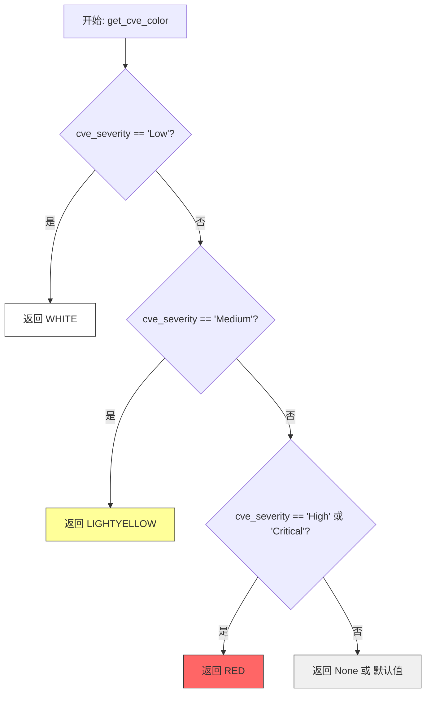

#### 带注释源码

```python
def get_cve_color(cve_severity):
    """
    根据CVE严重级别返回对应的颜色代码
    
    参数:
        cve_severity (str): CVE严重级别，可选值为 "Low", "Medium", "High", "Critical"
    
    返回:
        str: 对应的颜色代码
            - "Low" -> WHITE (白色)
            - "Medium" -> LIGHTYELLOW (浅黄色)
            - "High" 或 "Critical" -> RED (红色)
            - 其他情况 -> None (隐式返回)
    """
    # 如果严重级别为"Low"，返回白色
    if cve_severity == "Low":
        return WHITE
    # 如果严重级别为"Medium"，返回浅黄色
    elif cve_severity == "Medium":
        return LIGHTYELLOW
    # 如果严重级别为"High"或"Critical"，返回红色
    # 注意：这里使用or连接两个条件，表示这两种严重级别都返回红色
    elif cve_severity == "High" or cve_severity == "Critical":
        return RED
    # 如果不匹配上述任何情况，隐式返回None
```

#### 关键组件信息

| 组件名称 | 描述 |
|---------|------|
| `WHITE` | 从`misc.colours`模块导入的颜色常量，表示白色，用于低严重级别 |
| `LIGHTYELLOW` | 从`misc.colours`模块导入的颜色常量，表示浅黄色，用于中等严重级别 |
| `RED` | 从`misc.colours`模块导入的颜色常量，表示红色，用于高和严重级别 |

#### 潜在的技术债务或优化空间

1. **缺少默认返回值处理**：当`cve_severity`为未知值时，函数隐式返回`None`，可能导致调用方出现意外行为。建议显式处理未知严重级别并返回默认值或抛出警告。

2. **硬编码的字符串比较**：严重级别使用硬编码的字符串进行比较（如`"Low"`, `"Medium"`），如果未来需要支持本地化或配置化，需要较大改动。建议使用枚举或常量类来管理严重级别。

3. **使用or连接多个条件**：在最后一个条件中使用`or`连接两个字符串比较，虽然功能正确，但可读性略差。可以考虑拆分为独立判断或使用`in`操作符（如`cve_severity in ("High", "Critical")`）。

#### 其它项目

**调用位置与上下文：**

该函数在`get_all_affecting_cves_table_by_version`函数中被调用，用于为CVE表格的每一行设置对应的严重级别颜色：

```python
cve_color = get_cve_color(cve['Severity'])
cve_table.add_row([cve_color + cve['Severity'] + WHITE, ...])
```

**错误处理与异常设计：**

- 该函数没有显式的错误处理机制
- 如果传入非字符串类型或`None`，可能抛出`TypeError`
- 建议添加类型检查或使用`try-except`包裹调用

**数据流说明：**

```
用户输入/命令行参数 
    ↓
print_cve() 函数被调用
    ↓
get_all_affecting_cves_table_by_version() 读取CVE.json文件
    ↓
遍历CVE列表，对每个CVE调用 get_cve_color(cve['Severity'])
    ↓
返回颜色代码并拼接字符串用于终端彩色输出
    ↓
PrettyTable 渲染带颜色的表格
```


### `get_fixed_versions_of_cve`

该函数用于将CVE的修复版本列表（包含字典结构的数据）提取并格式化为字符串形式，每个版本之间用换行符分隔。

参数：

- `cve_fixed_versions`：`list[dict]`，CVE的修复版本列表，每个元素为一个包含"Raw"键的字典

返回值：`str`，格式化后的修复版本字符串（各版本用换行符分隔，去除末尾多余换行符）

#### 流程图

```mermaid
flowchart TD
    A[开始] --> B[初始化空字符串 fixed_version_list]
    --> C{遍历 cve_fixed_versions}
    C -->|每次迭代| D[获取 fixed_version['Raw']]
    --> E[将 Raw 值追加到 fixed_version_list 并加换行符]
    --> C
    C -->|遍历完成| F[返回 fixed_version_list 去除末尾字符]
    --> G[结束]
```

#### 带注释源码

```python
def get_fixed_versions_of_cve(cve_fixed_versions):
    """
    获取CVE的修复版本列表，并格式化为字符串形式
    
    参数:
        cve_fixed_versions (list): CVE的修复版本列表，每个元素为包含'Raw'键的字典
    
    返回:
        str: 格式化后的修复版本字符串，各版本用换行符分隔
    """
    # 初始化空字符串用于拼接版本列表
    fixed_version_list = ""
    
    # 遍历每个修复版本字典
    for fixed_version in cve_fixed_versions:
        # 提取"Raw"字段的值（版本号字符串）并拼接，每个版本后加换行符
        fixed_version_list += fixed_version["Raw"] + "\n"
    
    # 去除末尾多余的换行符后返回
    return fixed_version_list[:-1]
```


### `split_cve_description`

该函数用于将CVE描述文本进行格式化处理，每10个单词换行一次，以便在表格中显示时保持良好的可读性。

参数：

- `cve_description`：`str`，需要格式化的CVE描述文本

返回值：`str`，格式化后的描述文本，每10个单词换行

#### 流程图

```mermaid
flowchart TD
    A[开始] --> B[将cve_description按空格分割成单词列表]
    B --> C[初始化变量: words_in_row = 10, res_description = '']
    C --> D{遍历单词列表}
    D -->|i % words_in_row == 0 且 i != 0| E[添加换行符 \n]
    D -->|其他情况| F[添加空格]
    E --> G[添加当前单词和空格]
    F --> G
    G --> H{是否还有下一个单词}
    H -->|是| D
    H -->|否| I[返回 res_description[:-1] 去掉末尾空格]
    I --> J[结束]
```

#### 带注释源码

```python
def split_cve_description(cve_description):
    """
    格式化CVE描述，每10个单词换行
    
    参数:
        cve_description (str): 原始CVE描述文本
    
    返回:
        str: 格式化后的描述，每10个单词换行
    """
    # 将描述按空格分割成单词列表
    words = cve_description.split()
    
    # 初始化结果字符串
    res_description = ""
    
    # 每行显示的单词数
    words_in_row = 10
    
    # 遍历所有单词
    for i, word in enumerate(words):
        # 当索引是10的倍数且不是第一个单词时，添加换行符
        if i % words_in_row == 0 and i != 0:
            res_description += "\n"
        
        # 添加当前单词和空格
        res_description += word + " "
    
    # 去掉末尾多余的空格并返回
    return res_description[:-1]
```

#### 详细说明

该函数的主要目的是将过长的CVE描述文本进行格式化，使其在控制台表格中显示时不会超出列宽。实现逻辑如下：

1. **输入处理**：将输入的字符串按空格分割成单词列表
2. **遍历构建**：遍历每个单词，每10个单词插入一个换行符
3. **输出处理**：去掉末尾多余的空格后返回

**使用场景**：该函数在 `get_all_affecting_cves_table_by_version` 函数中被调用，用于格式化CVE表格中的描述列，使其更易阅读。

**潜在优化点**：
- 硬编码的 `words_in_row = 10` 可以考虑提取为配置参数
- 可以添加对空字符串或None输入的处理
- 当前实现会在每行末尾保留一个空格，最后通过切片去掉，但逻辑可以更清晰


### `curr_version_is_affected`

该函数用于判断当前 Kubernetes 版本是否受指定 CVE 漏洞影响。它通过比较当前版本与 CVE 的修复版本范围来确定是否存在漏洞。

参数：

- `cve`：`dict`，CVE 对象，包含 CVE 编号、严重等级、描述以及修复版本列表（FixedVersions）
- `current_k8s_version`：`str`，当前 Kubernetes 版本号（例如 "1.20.5"）

返回值：`bool`，如果当前版本受该 CVE 影响返回 `True`，否则返回 `False`

#### 流程图

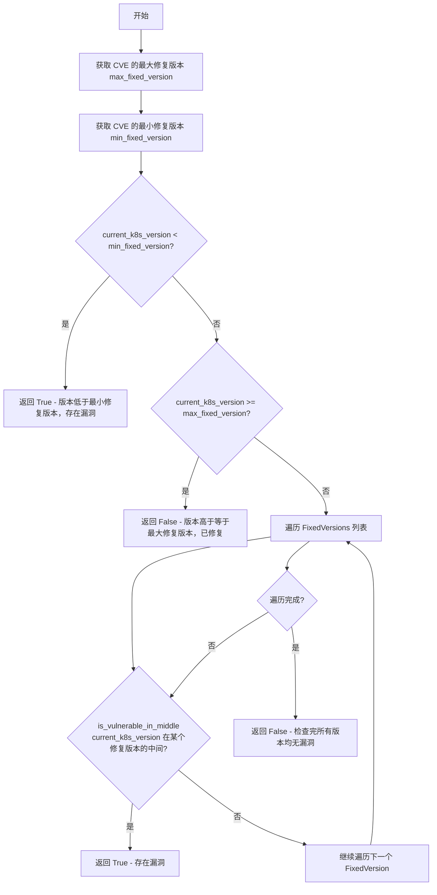

#### 带注释源码

```python
def curr_version_is_affected(cve, current_k8s_version):
    """
    判断当前 Kubernetes 版本是否受指定 CVE 影响
    
    参数:
        cve: CVE 对象，包含 FixedVersions 字段列出所有修复版本
        current_k8s_version: 当前 Kubernetes 版本
    
    返回:
        bool: True 表示存在漏洞，False 表示已修复
    """
    # 获取 CVE 修复版本列表中的最大版本号
    max_fixed_version = find_max_fixed_version(cve)
    # 获取 CVE 修复版本列表中的最小版本号
    min_fixed_version = find_min_fixed_version(cve)
    
    # 如果当前版本小于最小修复版本，说明存在漏洞
    # current_k8s_version < min_fixed_version
    if compare_versions(current_k8s_version, min_fixed_version) == -1:
        return True
    
    # 如果当前版本大于等于最大修复版本，说明已修复
    # current_k8s_version >= max_fixed_version
    if compare_versions(current_k8s_version, max_fixed_version) >= 0:
        return False
    
    # 当版本处于最小和最大修复版本之间时，需要逐个检查
    # 检查是否存在某个修复版本恰好在当前版本之后一个次版本
    for fixed_version in cve['FixedVersions']:
        # 检查当前版本是否处于某个修复版本的中间位置（存在漏洞）
        if is_vulnerable_in_middle(current_k8s_version, fixed_version['Raw']):
            return True
    
    # 所有检查均通过，说明已修复
    return False
```


### `is_vulnerable_in_middle`

该函数用于判断当前 Kubernetes 版本是否处于 CVE 漏洞区间内（即当前版本小于修复版本但大于等于最小修复版本），通过比较版本号的主版本、次版本和补丁版本来判断是否存在漏洞。

参数：

- `current_k8s_version`：`str`，当前运行的 Kubernetes 版本号（如 "1.15.2"）
- `cve_fixed_version`：`str`，CVE 修复版本号（如 "1.16.0"）

返回值：`bool`，如果当前版本在漏洞区间内返回 `True`，否则返回 `False`

#### 流程图

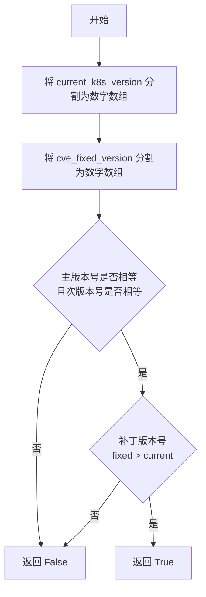

#### 带注释源码

```python
def is_vulnerable_in_middle(current_k8s_version, cve_fixed_version):
    """
    判断当前 K8s 版本是否在漏洞区间内
    漏洞区间定义：当前版本 >= 最小修复版本 且 当前版本 < 某个修复版本
    
    参数:
        current_k8s_version: str, 当前运行的 Kubernetes 版本（如 "1.15.2"）
        cve_fixed_version: str, CVE 修复版本（如 "1.16.0"）
    
    返回:
        bool, 在漏洞区间内返回 True，否则返回 False
    """
    
    # 示例: "1.15.2" -> [1, 15, 2]
    # 将当前版本字符串按点分割，并转换为整数列表
    current_k8s_version_nums = [int(num) for num in current_k8s_version.split('.')]
    
    # 将固定版本字符串按点分割，并转换为整数列表
    fixed_version_nums = [int(num) for num in cve_fixed_version.split('.')]
    
    # 判断主版本号和次版本号是否相等
    # 只有当主版本和次版本相同时，才可能在同一个大版本内存在漏洞
    if fixed_version_nums[0] == current_k8s_version_nums[0] and fixed_version_nums[1] == current_k8s_version_nums[1]:
        # 判断补丁版本号：如果修复版本的补丁号大于当前版本号，说明当前版本尚未修复
        if fixed_version_nums[2] > current_k8s_version_nums[2]:
            return True
    
    # 不满足漏洞区间条件，返回 False
    return False
```


### `sanitize_version`

清理版本字符串，移除非数字后缀，用于标准化Kubernetes版本格式以便后续比较。

参数：
- `version`：`str`，Kubernetes版本字符串（如 "v1.21.0-alpha-1"）

返回值：`str`，清理后的版本字符串（如 "v1.21.0"）

#### 流程图

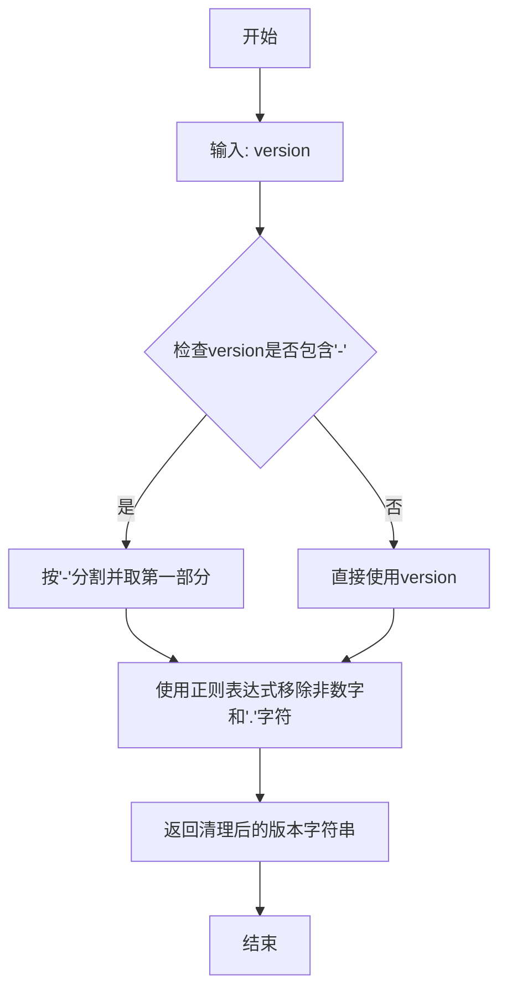

#### 带注释源码

```python
def sanitize_version(version):
    """
    清理Kubernetes版本字符串，移除非数字后缀。
    
    参数:
        version: Kubernetes版本字符串，格式如 "v1.21.0-alpha-1" 或 "1.21.0"
    
    返回:
        清理后的版本字符串，仅包含数字和点号，如 "v1.21.0" 或 "1.21.0"
    
    示例:
        >>> sanitize_version("v1.21.0-alpha-1")
        'v1.21.0'
        >>> sanitize_version("1.21.0")
        '1.21.0'
    """
    # 步骤1: 按'-'分割版本字符串，取第一部分以移除后缀（如alpha、beta等）
    # 步骤2: 使用正则表达式移除非数字和'.'的字符，只保留版本号
    return re.sub(r'[^0-9\.]', '', version.split('-')[0])
```


### `compare_versions`

该函数用于比较两个 Kubernetes 版本号的大小，返回 1 表示第一个版本大于第二个版本，-1 表示第一个版本小于第二个版本，0 表示两个版本相等。

参数：

- `version1`：`str`，要比较的第一个版本号字符串
- `version2`：`str`，要比较的第二个版本号字符串

返回值：`int`，比较结果：1（version1 > version2）、-1（version1 < version2）、0（version1 = version2）

#### 流程图

```mermaid
flowchart TD
    A[开始比较版本] --> B[调用 sanitize_version 清理 version1]
    B --> C[调用 sanitize_version 清理 version2]
    C --> D[将 version1 分割为数字列表 version1_nums]
    D --> E[将 version2 分割为数字列表 version2_nums]
    E --> F{遍历 version2_nums 中的每个元素}
    F -->|当前元素| G{version2_nums[i] > version1_nums[i]?}
    G -->|是| H[返回 -1]
    G -->|否| I{version2_nums[i] < version1_nums[i]?}
    I -->|是| J[返回 1]
    I -->|否| K[继续下一次循环]
    K --> F
    F -->|循环结束| L[返回 0]
```

#### 带注释源码

```python
# version1 > version2 return 1
# version1 < version2 return -1
# version1 = version2 return 0

def sanitize_version(version):
    """Remove non-numeric suffixes from Kubernetes version strings."""
    return re.sub(r'[^0-9\.]', '', version.split('-')[0])

def compare_versions(version1, version2):
    """
    比较两个版本号的大小
    
    参数:
        version1: 第一个版本号字符串
        version2: 第二个版本号字符串
    
    返回:
        1: version1 > version2
        -1: version1 < version2
        0: version1 == version2
    """
    # 清理版本号，移除非数字后缀（如 "v1.20.0-alpha.1" 中的 "-alpha.1"）
    version1 = sanitize_version(version1)
    version2 = sanitize_version(version2)
    
    # 将版本号字符串分割成数字列表，例如 "1.20.0" -> [1, 20, 0]
    version1_nums = [int(num) for num in version1.split('.')]
    version2_nums = [int(num) for num in version2.split('.')]
    
    # 逐位比较版本号数字
    for i in range(len(version2_nums)):
        if version2_nums[i] > version1_nums[i]:
            return -1
        elif version2_nums[i] < version1_nums[i]:
            return 1
    else:
        # 所有位都比较完毕且相等
        return 0
```


### `find_max_fixed_version`

该函数用于从CVE（公共漏洞披露）的修复版本列表中查找并返回版本号最大的固定修复版本。通过遍历CVE对象中的所有固定版本，使用版本号数值比较找出最高版本。

#### 参数

- `cve`：`dict`，CVE对象，包含 `FixedVersions` 键，值为一个字典列表，每个字典包含 `Raw` 字段表示版本字符串

#### 返回值

- `max_version`：`str`，返回所有固定版本中版本号最大的版本字符串

#### 流程图

```mermaid
flowchart TD
    A[开始] --> B[创建空列表 versions]
    B --> C[遍历 cve['FixedVersions']]
    C --> D[将每个 fixed_version['Raw'] 添加到 versions 列表]
    D --> E[使用 max 函数配合 lambda 排序]
    E --> F[lambda 函数将版本字符串按 '.' 分割成整数列表进行比较]
    F --> G[返回最大版本]
    G --> H[结束]
```

#### 带注释源码

```python
def find_max_fixed_version(cve):
    """
    查找CVE的最大修复版本
    
    参数:
        cve: CVE对象，包含FixedVersions列表，每个版本有Raw字段
    
    返回:
        字符串形式的最高版本号
    """
    versions = []
    # 遍历CVE中所有已修复的版本
    for fixed_version in cve['FixedVersions']:
        # 提取版本字符串（如 "1.20.5"）
        versions.append(fixed_version['Raw'])
    
    # 使用max函数配合自定义key来比较版本号
    # lambda x: [int(num) for num in x.split('.')] 将版本字符串转换为整数列表
    # 例如 "1.20.5" -> [1, 20, 5]，这样可以正确比较版本大小
    max_version = max(versions, key=lambda x: [int(num) for num in x.split('.')])
    
    return max_version
```

---

**补充说明**：

- 该函数依赖于版本号格式为 `主版本.次版本.修订号`（如 `1.20.5`）
- 比较逻辑通过将版本字符串按 `.` 分割并转换为整数列表实现，确保 `1.20.5` 大于 `1.19.10`
- 该函数通常与 `find_min_fixed_version` 配合使用，用于判断当前Kubernetes版本是否受该CVE影响
- 潜在的优化方向：可添加版本格式校验、处理预发布版本（如 `1.20.0-alpha`）的逻辑


### `find_min_fixed_version`

该函数用于从CVE（公共漏洞披露）的修复版本列表中查找并返回最小的修复版本号。它通过解析版本号字符串并将其转换为数值进行比较，从而确定哪个版本是最早的修复版本。

参数：

- `cve`：`dict`，CVE对象，包含`FixedVersions`字段，其中存储了所有可用修复版本的信息

返回值：`str`，返回最小（最早）的修复版本号

#### 流程图

```mermaid
flowchart TD
    A[开始] --> B[初始化空列表 versions]
    B --> C{遍历 cve['FixedVersions']}
    C -->|每次迭代| D[提取 fixed_version['Raw'] 到 versions 列表]
    D --> C
    C --> E[使用 min 函数配合 key=lambda 比较版本]
    E --> F[返回最小版本号]
    F --> G[结束]
```

#### 带注释源码

```python
def find_min_fixed_version(cve):
    """
    查找CVE的最小修复版本
    
    参数:
        cve: dict, CVE对象，包含'FixedVersions'字段
        
    返回:
        str, 最小修复版本号
    """
    # 用于存储所有修复版本号的列表
    versions = []
    
    # 遍历CVE中的所有修复版本
    for fixed_version in cve['FixedVersions']:
        # 提取版本号字符串（如 "v1.20.0"）并添加到列表
        versions.append(fixed_version['Raw'])
    
    # 使用min函数配合lambda作为key来找到最小版本
    # lambda将版本字符串（如 "1.20.0"）分割成数值列表 [1, 20, 0]
    # 这样可以正确比较版本号大小
    min_version = min(versions, key=lambda x: [int(num) for num in x.split('.')])
    
    # 返回最小版本号
    return min_version
```


### `print_risky_clusterroles`

该函数用于获取并打印具有风险权限的 Kubernetes ClusterRole（集群角色），支持按创建时间和优先级进行过滤，并在控制台输出格式化的表格信息。

参数：

- `show_rules`：`bool`，是否显示 ClusterRole 的详细规则信息
- `days`：`int` 或 `None`，筛选创建时间小于指定天数的 ClusterRole
- `priority`：`str` 或 `None`，按优先级（CRITICAL/HIGH/LOW）筛选 ClusterRole
- `namespace`：`str` 或 `None`，命名空间参数（该函数不支持，若传入会输出警告）

返回值：`None`，该函数无返回值，仅执行打印操作

#### 流程图

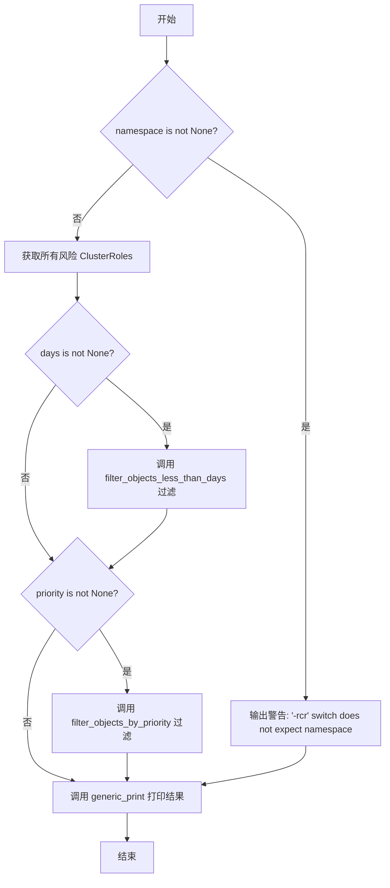

#### 带注释源码

```python
def print_risky_clusterroles(show_rules=False, days=None, priority=None, namespace=None):
    """
    打印具有风险权限的 ClusterRole（集群角色）信息
    
    参数:
        show_rules: bool, 是否显示规则详情，默认为 False
        days: int 或 None, 筛选创建时间小于指定天数的对象
        priority: str 或 None, 按优先级筛选 (CRITICAL/HIGH/LOW)
        namespace: str 或 None, 命名空间（该功能不支持此参数）
    """
    
    # 如果传入了 namespace 参数，输出警告信息
    # 因为 ClusterRole 是集群级别的资源，不受命名空间限制
    if namespace is not None:
        logging.warning("'-rcr' switch does not expect namespace ('-ns')\n")
    
    # 从 engine.utils 模块获取所有具有风险权限的 ClusterRole
    risky_clusterroles = engine.utils.get_risky_clusterroles()
    
    # 如果指定了 days 参数，则筛选创建时间小于指定天数的 ClusterRole
    if days:
        risky_clusterroles = filter_objects_less_than_days(int(days), risky_clusterroles)
    
    # 如果指定了 priority 参数，则按优先级进行筛选
    if priority:
        risky_clusterroles = filter_objects_by_priority(priority, risky_clusterroles)
    
    # 调用通用打印函数，以表格形式输出 ClusterRole 信息
    # 包含表头、风险 ClusterRole 列表和是否显示规则
    generic_print('|Risky ClusterRoles |', risky_clusterroles, show_rules)
```


### `print_all_risky_rolebindings`

打印所有风险角色绑定（RoleBindings 和 ClusterRoleBindings），支持按创建天数和优先级进行过滤，并将结果输出到控制台。

参数：

- `days`：`Optional[int]`，可选参数，用于过滤在指定天数内创建的角色绑定。如果指定，则只显示创建时间距今小于该天数的对象。
- `priority`：`Optional[str]`，可选参数，用于按优先级过滤角色绑定。支持的值包括 CRITICAL、HIGH、LOW 等。
- `namespace`：`Optional[str]`，可选参数，该函数不支持 namespace 过滤（因为 RoleBindings 和 ClusterRoleBindings 可能是集群级别的），如果传入会打印警告信息。

返回值：`None`，该函数没有返回值，结果直接通过 `generic_print` 函数输出到控制台。

#### 流程图

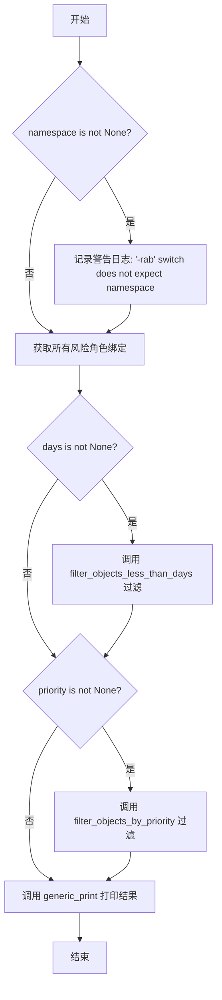

#### 带注释源码

```python
def print_all_risky_rolebindings(days=None, priority=None, namespace=None):
    """
    打印所有风险角色绑定（RoleBindings 和 ClusterRoleBindings）
    
    参数:
        days: 可选的整数，用于过滤创建时间小于指定天数的对象
        priority: 可选的字符串，用于按优先级过滤结果
        namespace: 可选的字符串，该参数会被忽略并记录警告
    """
    
    # 检查是否传入了 namespace 参数，如果是则记录警告
    # 因为 RoleBindings 和 ClusterRoleBindings 可能是集群级别的
    if namespace is not None:
        logging.warning("'-rab' switch does not expect namespace ('-ns')\n")
    
    # 从 engine.utils 获取所有风险角色绑定（RoleBinding 和 ClusterRoleBinding）
    risky_any_rolebindings = engine.utils.get_all_risky_rolebinding()
    
    # 如果指定了 days 参数，则按创建时间过滤
    # filter_objects_less_than_days 会过滤出创建时间距今天数小于指定值的对象
    if days:
        risky_any_rolebindings = filter_objects_less_than_days(int(days), risky_any_rolebindings)
    
    # 如果指定了 priority 参数，则按优先级过滤
    # filter_objects_by_priority 会过滤出优先级匹配的对象
    if priority:
        risky_any_rolebindings = filter_objects_by_priority(priority, risky_any_rolebindings)
    
    # 调用通用打印函数输出结果
    # 会打印一个包含所有风险角色绑定的表格
    generic_print('|Risky RoleBindings and ClusterRoleBindings|', risky_any_rolebindings)
```


### `print_risky_rolebindings`

该函数用于获取并打印具有风险的角色绑定（RoleBindings），支持按创建天数、优先级和命名空间进行过滤。

参数：

- `days`：`int` 或 `str`，可选参数，用于过滤指定天数内创建的风险角色绑定
- `priority`：`str`，可选参数，用于按优先级（CRITICAL/HIGH/LOW）过滤风险角色绑定
- `namespace`：`str`，可选参数，用于过滤特定命名空间下的风险角色绑定

返回值：`None`，该函数无返回值，直接打印结果到控制台

#### 流程图

```mermaid
flowchart TD
    A[开始] --> B[调用 engine.utils.get_risky_rolebindings 获取所有风险角色绑定]
    B --> C{参数 days 是否存在?}
    C -->|是| D[调用 filter_objects_less_than_days 过滤]
    C -->|否| E{参数 priority 是否存在?}
    D --> E
    E -->|是| F[调用 filter_objects_by_priority 过滤]
    E -->|否| G{参数 namespace 是否为 None?}
    F --> G
    G -->|是| H[直接使用所有 risky_roles]
    G -->|否| I[遍历并筛选匹配 namespace 的角色绑定]
    H --> J[调用 generic_print 打印结果]
    I --> J
    J --> K[结束]
```

#### 带注释源码

```python
def print_risky_rolebindings(days=None, priority=None, namespace=None):
    """
    打印风险 RoleBindings（角色绑定）信息
    
    参数:
        days: 可选，整型或字符串，过滤指定天数内创建的绑定
        priority: 可选，字符串，按优先级过滤 (CRITICAL/HIGH/LOW)
        namespace: 可选，字符串，按命名空间过滤
    
    返回:
        无返回值，直接打印到控制台
    """
    # 步骤1: 获取所有风险角色绑定
    risky_rolebindings = engine.utils.get_risky_rolebindings()

    # 步骤2: 如果指定了 days 参数，则按创建时间过滤
    if days:
        # 将 days 转换为整型并调用过滤函数
        risky_rolebindings = filter_objects_less_than_days(int(days), risky_rolebindings)
    
    # 步骤3: 如果指定了 priority 参数，则按优先级过滤
    if priority:
        risky_rolebindings = filter_objects_by_priority(priority, risky_rolebindings)

    # 步骤4: 根据 namespace 参数决定过滤方式
    if namespace is None:
        # 未指定命名空间，打印所有风险角色绑定
        generic_print('|Risky RoleBindings|', risky_rolebindings)
    else:
        # 指定了命名空间，筛选匹配的角色绑定
        filtered_risky_rolebindings = []
        for risky_rolebinding in risky_rolebindings:
            # 比较角色绑定的命名空间属性
            if risky_rolebinding.namespace == namespace:
                filtered_risky_rolebindings.append(risky_rolebinding)
        
        # 打印过滤后的结果
        generic_print('|Risky RoleBindings|', filtered_risky_rolebindings)
```


### `print_risky_clusterrolebindings`

该函数用于获取并打印具有风险性的 ClusterRoleBinding 资源，支持按创建时间和优先级进行过滤，最终将结果以表格形式输出。

参数：

- `days`：`int` 或 `None`，可选参数，用于过滤在指定天数内创建的 ClusterRoleBinding（如果提供）
- `priority`：`str` 或 `None`，可选参数，用于按优先级（如 CRITICAL、HIGH、LOW）过滤结果
- `namespace`：`str` 或 `None`，可选参数，但该函数不支持 namespace 过滤（传入时会输出警告）

返回值：`None`，该函数直接打印结果，不返回任何值

#### 流程图

```mermaid
flowchart TD
    A[开始] --> B{namespace is not None?}
    B -->|是| C[输出警告: '-rcb' 不支持 namespace]
    B -->|否| D[调用 engine.utils.get_risky_clusterrolebindings 获取风险 ClusterRoleBindings]
    D --> E{days is not None?}
    E -->|是| F[调用 filter_objects_less_than_days 过滤]
    E -->|否| G{priority is not None?}
    F --> G
    G -->|是| H[调用 filter_objects_by_priority 按优先级过滤]
    G -->|否| I[调用 generic_print 打印表格]
    H --> I
    I --> J[结束]
```

#### 带注释源码

```python
def print_risky_clusterrolebindings(days=None, priority=None, namespace=None):
    """
    打印风险 ClusterRoleBinding 列表
    
    参数:
        days: 可选，整数类型，用于过滤指定天数内创建的对象
        priority: 可选，字符串类型，用于按优先级过滤 (CRITICAL/HIGH/LOW)
        namespace: 可选，字符串类型，但该函数不支持（传入会警告）
    """
    # 检查 namespace 参数，由于 ClusterRoleBinding 是集群级别资源，不应指定 namespace
    if namespace is not None:
        logging.warning("'-rcb' switch does not expect namespace ('-ns')\n")
    
    # 获取所有风险的 ClusterRoleBinding 对象
    risky_clusterrolebindings = engine.utils.get_risky_clusterrolebindings()
    
    # 如果指定了 days 参数，则过滤掉创建时间超过指定天数的对象
    if days:
        risky_clusterrolebindings = filter_objects_less_than_days(int(days), risky_clusterrolebindings)
    
    # 如果指定了 priority 参数，则按优先级过滤
    if priority:
        risky_clusterrolebindings = filter_objects_by_priority(priority, risky_clusterrolebindings)
    
    # 调用通用打印函数，以表格形式输出风险 ClusterRoleBinding 信息
    generic_print('|Risky ClusterRoleBindings|', risky_clusterrolebindings)
```


### `generic_print`

通用的表格打印函数，用于将具有优先级、类型、命名空间、名称、创建时间和规则（可选）的对象以格式化的 PrettyTable 形式打印到控制台。

#### 参数

- `header`：`str`，表格的标题信息，通常为带竖线的格式，如 `"|Risky Roles and ClusterRoles|"`
- `objects`：`list`，要打印的对象列表，每个对象应包含 `priority`、`kind`、`namespace`、`name`、`time` 和 `rules` 属性
- `show_rules`：`bool`，可选参数（默认值为 `False`），是否在表格中显示对象的规则信息

#### 返回值

`None`，该函数仅执行打印操作，无返回值

#### 流程图

```mermaid
flowchart TD
    A[开始 generic_print] --> B[构建表格顶部边界 roof]
    B --> C[设置全局变量 curr_header = header]
    C --> D[打印顶部边界 roof]
    D --> E[打印表头 header]
    E --> F{show_rules 是否为 True?}
    F -->|是| G[创建包含 'Rules' 列的表格]
    F -->|否| H[创建不包含 'Rules' 列的表格]
    G --> I[遍历 objects 列表]
    H --> I
    I --> J{当前对象的 time 是否为 None?}
    J -->|是| K[添加行: 优先级、类型、命名空间、名称、'No creation time']
    J -->|否| L[添加行: 优先级、类型、命名paces、名称、时间+天数]
    K --> M{show_rules 是否为 True?}
    L --> M
    M -->|是| N[调用 get_pretty_rules 获取规则并添加]
    M -->|否| O[继续下一对象]
    N --> O
    O --> P{是否还有更多对象?}
    P -->|是| I
    P -->|否| Q[调用 print_table_aligned_left 打印表格]
    Q --> R[结束]
```

#### 带注释源码

```python
def generic_print(header, objects, show_rules=False):
    """
    通用的表格打印函数，用于打印风险对象列表
    
    参数:
        header: 表格标题
        objects: 要打印的对象列表
        show_rules: 是否显示规则详情
    """
    # 构建表格顶部边界，使用加号和减号绘制，类似：+----------------+
    roof = '+' + ('-' * (len(header)-2)) + '+'
    
    # 使用全局变量存储当前表头，供其他函数使用（如 export_to_json）
    global curr_header
    curr_header = header
    
    # 打印表格顶部和标题
    print(roof)
    print(header)
    
    # 根据 show_rules 参数决定表格结构
    if show_rules:
        # 如果需要显示规则，包含 'Rules' 列
        t = PrettyTable(['Priority', 'Kind', 'Namespace', 'Name', 'Creation Time', 'Rules'])
        for o in objects:
            if o.time is None:
                # 处理没有创建时间的对象
                t.add_row([
                    get_color_by_priority(o.priority) + o.priority.name + WHITE,  # 优先级（带颜色）
                    o.kind,           # 类型
                    o.namespace,      # 命名空间
                    o.name,           # 名称
                    'No creation time',  # 无创建时间
                    get_pretty_rules(o.rules)  # 格式化规则
                ])
            else:
                # 处理有创建时间的对象，计算自创建以来的天数
                t.add_row([
                    get_color_by_priority(o.priority) + o.priority.name + WHITE,
                    o.kind,
                    o.namespace,
                    o.name,
                    o.time.ctime() + " (" + str(get_delta_days_from_now(o.time)) + " days)",  # 时间+天数
                    get_pretty_rules(o.rules)
                ])
    else:
        # 不显示规则列的简化表格
        t = PrettyTable(['Priority', 'Kind', 'Namespace', 'Name', 'Creation Time'])
        for o in objects:
            if o.time is None:
                t.add_row([
                    get_color_by_priority(o.priority) + o.priority.name + WHITE,
                    o.kind,
                    o.namespace,
                    o.name,
                    'No creation time'
                ])
            else:
                t.add_row([
                    get_color_by_priority(o.priority) + o.priority.name + WHITE,
                    o.kind,
                    o.namespace,
                    o.name,
                    o.time.ctime() + " (" + str(get_delta_days_from_now(o.time)) + " days)"
                ])
    
    # 调用辅助函数打印左对齐的表格
    print_table_aligned_left(t)
```


### `print_all_risky_containers`

该函数用于从 Kubernetes 集群中获取所有存在安全风险的容器，并以表格形式打印输出相关信息，包括容器优先级、Pod 名称、命名空间、容器名称、服务账户命名空间和服务账户名称。支持通过优先级和命名空间进行过滤，并可选择是否从容器中读取 token 信息。

参数：

- `priority`：`Optional[Priority]`，可选参数，用于按优先级过滤容器，支持 CRITICAL、HIGH、LOW 级别
- `namespace`：`Optional[str]`，可选参数，用于指定命名空间，仅返回指定命名空间内的风险容器
- `read_token_from_container`：`bool`，可选参数，默认为 False，当设置为 True 时会尝试从运行中的容器获取 token 信息

返回值：`None`，该函数不返回任何值，结果直接输出到控制台

#### 流程图

```mermaid
flowchart TD
    A[开始执行 print_all_risky_containers] --> B[调用 engine.utils.get_risky_pods 获取风险 Pod 列表]
    B --> C[设置全局变量 curr_header = '|Risky Containers|']
    C --> D[打印表头边框和标题]
    D --> E[创建 PrettyTable 表对象]
    E --> F{遍历 pods 列表}
    F -->|是| G{priority 参数是否提供}
    G -->|是| H[调用 filter_objects_by_priority 过滤容器]
    H --> I[遍历每个容器的 service_accounts_name_set]
    I --> J[拼接所有服务账户名称]
    J --> K[构建表格行数据]
    K --> L[调用 get_color_by_priority 获取优先级颜色]
    L --> M[添加行到表格]
    M --> F
    G -->|否| I
    F -->|否| N[调用 print_table_aligned_left 打印表格]
    N --> O[结束]
```

#### 带注释源码

```python
def print_all_risky_containers(priority=None, namespace=None, read_token_from_container=False):
    """
    打印所有风险容器信息
    
    该函数从 Kubernetes 集群中获取具有安全风险的容器，并按照表格形式输出。
    支持按优先级和命名空间进行过滤，可选择是否从容器中读取 token。
    
    Args:
        priority: 可选的优先级过滤参数，用于筛选特定优先级的容器
        namespace: 可选的命名空间过滤参数，用于筛选特定命名空间内的容器
        read_token_from_container: 是否尝试从运行中的容器读取 token，默认为 False
    
    Returns:
        None: 结果直接打印到标准输出，不返回任何值
    """
    
    # 调用 engine.utils 模块的 get_risky_pods 方法获取所有风险 Pod
    # 参数 namespace 用于过滤特定命名空间，read_token_from_container 用于控制是否读取容器 token
    pods = engine.utils.get_risky_pods(namespace, read_token_from_container)
    
    # 设置全局变量 curr_header，用于后续 JSON 导出时的表头标识
    global curr_header
    curr_header = "|Risky Containers|"

    # 打印表格的边框和标题栏
    print("+----------------+")
    print("|Risky Containers|")
    
    # 创建 PrettyTable 对象，定义列名：优先级、Pod名称、命名空间、容器名、服务账户命名空间、服务账户名称
    t = PrettyTable(['Priority', 'PodName', 'Namespace', 'ContainerName', 'ServiceAccountNamespace', 'ServiceAccountName'])
    
    # 遍历获取到的所有 Pod
    for pod in pods:
        # 如果提供了优先级参数，则对该 Pod 的容器进行优先级过滤
        if priority:
            pod.containers = filter_objects_by_priority(priority, pod.containers)
        
        # 遍历该 Pod 中的所有容器
        for container in pod.containers:
            # 初始化服务账户字符串
            all_service_account = ''
            
            # 遍历容器关联的所有服务账户，拼接用户名称
            for service_account in container.service_accounts_name_set:
                all_service_account += service_account.user_info.name + ", "
            
            # 移除末尾多余的逗号和空格
            all_service_account = all_service_account[:-2]
            
            # 调用 get_color_by_priority 获取优先级对应的颜色代码
            # 优先级颜色：CRITICAL=RED, HIGH=LIGHTYELLOW, 其他=WHITE
            # 拼接颜色代码 + 优先级名称 + 白色重置代码
            priority_color = get_color_by_priority(container.priority) + container.priority.name + WHITE
            
            # 将一行数据添加到表格中，包含优先级(带颜色)、Pod名称、命名空间、容器名、服务账户命名空间、服务账户名称
            t.add_row([
                priority_color,
                pod.name, 
                pod.namespace, 
                container.name, 
                container.service_account_namespace, 
                all_service_account
            ])

    # 调用 print_table_aligned_left 函数打印左对齐格式的表格
    # 该函数还会处理 JSON 导出和颜色去除等逻辑
    print_table_aligned_left(t)
```


### `get_rules_by_namespace(namespace)`

根据命名空间获取风险角色规则。如果找到匹配命名空间的风险角色，则返回该角色对象；否则返回 None。

参数：

- `namespace`：`str | None`，要匹配的角色命名空间

返回值：`Role | None`，返回匹配命名空间的风险角色对象，如果未找到则返回 None

#### 流程图

```mermaid
flowchart TD
    A[开始 get_rules_by_namespace] --> B[调用 engine.utils.get_risky_roles 获取所有风险角色]
    B --> C[初始化空列表 namespace_risky_roles]
    C --> D{遍历 risky_roles 中的每个 role}
    D --> E{role.namespace == namespace?}
    E -->|是| F[返回匹配的 role 对象]
    E -->|否| G[继续遍历]
    D -->|遍历完成| H[返回 None]
```

#### 带注释源码

```python
def get_rules_by_namespace(namespace=None):
    """
    根据命名空间获取风险角色规则
    
    参数:
        namespace: 要匹配的角色命名空间，默认为 None
        
    返回:
        匹配命名空间的风险角色对象，如果未找到则返回 None
    """
    # 初始化空列表（虽然后续未使用，但保留用于存储命名空间匹配的角色）
    namespace_risky_roles = []
    # 获取所有风险角色
    risky_roles = engine.utils.get_risky_roles()
    # 遍历所有风险角色，查找匹配命名空间的角色
    for role in risky_roles:
        # 检查当前角色的命名空间是否与给定命名空间匹配
        if role.namespace == namespace:
            # 找到匹配的角色，直接返回第一个匹配项
            return role
    # 遍历完成未找到匹配角色，返回 None
    return None
```


### `print_all_risky_subjects`

该函数用于打印所有风险主体（包括用户、组和服务账号），支持按优先级和命名空间过滤，并可选择显示关联的规则信息。

参数：

- `show_rules`：`bool`，可选参数，默认为 `False`。当设置为 `True` 时，会在输出表格中显示每个风险主体关联的规则信息。
- `priority`：`str`，可选参数，默认为 `None`。用于按优先级过滤风险主体，支持的值包括 "CRITICAL"、"HIGH"、"LOW" 等。
- `namespace`：`str`，可选参数，默认为 `None`。用于按命名空间过滤风险主体，如果为 `None` 则显示所有命名空间的风险主体。

返回值：`None`，该函数直接在控制台输出风险主体的表格信息，无返回值。

#### 流程图

```mermaid
flowchart TD
    A[开始 print_all_risky_subjects] --> B[获取所有风险主体 subjects = engine.utils.get_all_risky_subjects]
    B --> C{priority 是否为 None?}
    C -->|否| D[按优先级过滤对象 subjects = filter_objects_by_priority]
    C -->|是| E[设置 curr_header = '|Risky Users|']
    D --> E
    E --> F[打印表头 '+-----------+' 和 '|Risky Users|']
    F --> G{show_rules 是否为 True?}
    G -->|是| H[创建包含 Rules 列的 PrettyTable]
    G -->|否| I[创建不包含 Rules 列的 PrettyTable]
    H --> J[遍历 subjects]
    I --> J
    J --> K{subject.user_info.namespace == namespace 或 namespace 为 None?}
    K -->|否| L[跳过当前 subject]
    K -->|是| M{show_rules 为 True?}
    M -->|是| N[获取 subject_role = get_rules_by_namespace]
    M -->|否| O[添加行到表格 不含 Rules]
    N --> P[获取 rules = subject_role.rules 或 None]
    P --> Q[添加行到表格 包含 Rules]
    O --> R[表格是否还有更多 subject?]
    Q --> R
    R -->|是| J
    R -->|否| S[调用 print_table_aligned_left 输出表格]
    L --> R
    S --> T[结束]
```

#### 带注释源码

```python
def print_all_risky_subjects(show_rules=False, priority=None, namespace=None):
    """
    打印所有风险主体（用户、组、服务账号）的信息。
    
    参数:
        show_rules: bool, 是否显示关联的规则信息，默认为 False
        priority: str, 按优先级过滤，默认为 None（显示所有优先级）
        namespace: str, 按命名空间过滤，默认为 None（显示所有命名空间）
    
    返回值:
        None, 直接输出到控制台
    """
    # 从引擎工具获取所有风险主体对象
    subjects = engine.utils.get_all_risky_subjects()
    
    # 如果指定了优先级，则按优先级过滤风险主体
    if priority:
        subjects = filter_objects_by_priority(priority, subjects)
    
    # 设置全局表头变量，用于 JSON 导出功能
    global curr_header
    curr_header = "|Risky Users|"
    
    # 打印表头边框和标题
    print("+-----------+")
    print("|Risky Users|")
    
    # 根据 show_rules 参数决定表格列
    if show_rules:
        # 创建包含规则列的表格
        t = PrettyTable(['Priority', 'Kind', 'Namespace', 'Name', 'Rules'])
        for subject in subjects:
            # 检查命名空间是否匹配（如果指定了命名空间）
            if subject.user_info.namespace == namespace or namespace is None:
                # 获取该用户关联的角色规则
                subject_role = get_rules_by_namespace(subject.user_info.namespace)
                # 获取规则内容，如果角色不存在则为 None
                rules = subject_role.rules if subject_role else None
                # 添加行数据，包括优先级颜色编码
                t.add_row([
                    get_color_by_priority(subject.priority) + subject.priority.name + WHITE,
                    subject.user_info.kind,
                    subject.user_info.namespace,
                    subject.user_info.name,
                    get_pretty_rules(rules)
                ])
    else:
        # 创建不包含规则列的表格
        t = PrettyTable(['Priority', 'Kind', 'Namespace', 'Name'])
        for subject in subjects:
            # 检查命名空间是否匹配
            if subject.user_info.namespace == namespace or namespace is None:
                # 添加行数据，不包含规则列
                t.add_row([
                    get_color_by_priority(subject.priority) + subject.priority.name + WHITE,
                    subject.user_info.kind,
                    subject.user_info.namespace,
                    subject.user_info.name
                ])
    
    # 调用通用打印函数输出表格（支持左对齐和 JSON 导出）
    print_table_aligned_left(t)
```


### `print_all`

该函数是一个聚合输出函数，用于一次性打印所有风险信息（风险角色、风险角色绑定、风险主体和风险容器），支持按天数和优先级进行过滤。

参数：

- `days`：`int` 或 `None`，用于过滤指定天数内创建的风险对象
- `priority`：`str` 或 `None`，用于按优先级（CRITICAL/HIGH/LOW）过滤风险对象
- `read_token_from_container`：`bool`，控制是否从运行的容器中读取令牌（该参数在函数内部未使用，传入的值固定为 False）

返回值：`None`，该函数无返回值，直接输出到标准输出

#### 流程图

```mermaid
flowchart TD
    A[开始 print_all] --> B{参数 days 是否为 None}
    B -->|否| C[调用 print_all_risky_roles]
    B -->|是| D[调用 print_all_risky_roles]
    C -->|传入 days 和 priority| E[调用 print_all_risky_rolebindings]
    D -->|传入 days 和 priority| E
    E -->|传入 days 和 priority| F[调用 print_all_risky_subjects]
    F -->|仅传入 priority| G[调用 print_all_risky_containers]
    G -->|priority 和 read_token_from_container=False| H[结束]

    style A fill:#f9f,color:#000
    style H fill:#9f9,color:#000
```

#### 带注释源码

```python
def print_all(days=None, priority=None, read_token_from_container=False):
    """
    聚合打印所有风险信息（角色、角色绑定、主体、容器）
    
    参数:
        days: 整数值，用于过滤特定天数内创建的风险对象
        priority: 字符串优先级值（CRITICAL/HIGH/LOW）
        read_token_from_container: 布尔值，是否从容器读取令牌（当前版本未使用）
    """
    
    # 打印所有风险 Roles 和 ClusterRoles
    # 传入 days 和 priority 参数进行过滤
    print_all_risky_roles(days=days, priority=priority)
    
    # 打印所有风险 RoleBindings 和 ClusterRoleBindings
    # 传入 days 和 priority 参数进行过滤
    print_all_risky_rolebindings(days=days, priority=priority)
    
    # 打印所有风险 Subjects（用户、组、服务账户）
    # 仅传入 priority 参数进行过滤（不支持 days 过滤）
    print_all_risky_subjects(priority=priority)
    
    # 打印所有风险 Containers/Pods
    # 注意：read_token_from_container 参数固定传入 False，未使用传入的值
    print_all_risky_containers(priority=priority, read_token_from_container=False)
```


### `print_associated_rolebindings_to_role`

该函数用于打印与指定角色（Role）关联的所有 RoleBinding 对象。它通过调用 `engine.utils.get_rolebindings_associated_to_role` 获取关联的 RoleBinding 列表，并使用 PrettyTable 库以表格形式输出关联的 RoleBinding 的种类、名称和命名空间信息。

参数：

- `role_name`：`str`，角色的名称，用于查询与该角色关联的 RoleBinding
- `namespace`：`str`，可选参数，角色所在的命名空间，如果为 None 则表示在所有命名空间中查找

返回值：`None`，该函数没有返回值，仅执行打印操作

#### 流程图

```mermaid
flowchart TD
    A[开始] --> B[调用 engine.utils.get_rolebindings_associated_to_role 获取关联的 RoleBinding]
    B --> C[打印表头: Associated Rolebindings to Role 'role_name']
    C --> D[创建 PrettyTable, 列名为 Kind, Name, Namespace]
    D --> E{遍历 associated_rolebindings}
    E -->|是| F[向表格添加一行: RoleBinding, metadata.name, metadata.namespace]
    F --> E
    E -->|否| G[调用 print_table_aligned_left 打印表格]
    G --> H[结束]
```

#### 带注释源码

```python
def print_associated_rolebindings_to_role(role_name, namespace=None):
    """
    打印与指定角色关联的所有 RoleBinding
    
    参数:
        role_name: 角色的名称
        namespace: 角色所在的命名空间，默认为 None（所有命名空间）
    
    返回:
        无返回值，直接打印结果到控制台
    """
    # 调用引擎工具函数获取与指定角色关联的 RoleBinding 列表
    # 如果指定了 namespace，则在指定命名空间中查找
    # 如果未指定 namespace，则在所有命名空间中查找
    associated_rolebindings = engine.utils.get_rolebindings_associated_to_role(
        role_name=role_name, 
        namespace=namespace
    )

    # 打印表头信息，显示关联到哪个角色
    print("Associated Rolebindings to Role \"{0}\":".format(role_name))
    
    # 创建 PrettyTable 对象，设置列标题
    t = PrettyTable(['Kind', 'Name', 'Namespace'])

    # 遍历所有关联的 RoleBinding
    # TODO: 合并处理当 rolebinding.kind 字段不为 None 时的情况
    for rolebinding in associated_rolebindings:
        # 将每个 RoleBinding 的信息添加到表格中
        # Kind 列固定为 'RoleBinding'
        # Name 取自 rolebinding 的 metadata.name
        # Namespace 取自 rolebinding 的 metadata.namespace
        t.add_row([
            'RoleBinding', 
            rolebinding.metadata.name, 
            rolebinding.metadata.namespace
        ])

    # 调用辅助函数以左对齐方式打印表格
    # 该函数还会处理 JSON 导出和无颜色输出等选项
    print_table_aligned_left(t)
```


### `print_associated_any_rolebindings_to_clusterrole`

该函数用于根据指定的集群角色（ClusterRole）名称，查询所有关联的 RoleBinding 和 ClusterRoleBinding，并将结果以格式化的表格形式打印输出。

参数：

- `clusterrole_name`：`str`，需要查询关联绑定的集群角色的名称。

返回值：`None`，该函数无返回值，直接输出结果到控制台。

#### 流程图

```mermaid
graph TD
    A([开始]) --> B[调用 engine.utils.get_rolebindings_and_clusterrolebindings_associated_to_clusterrole]
    B --> C[获取关联的 RoleBinding 和 ClusterRoleBinding 列表]
    C --> D[打印表头信息]
    D --> E[初始化 PrettyTable, 列包括 Kind, Name, Namespace]
    E --> F{遍历 RoleBinding 列表}
    F -->|是| G[提取元数据 name 和 namespace]
    G --> H[向表格添加一行: RoleBinding, name, namespace]
    H --> F
    F -->|否| I{遍历 ClusterRoleBinding 列表}
    I -->|是| J[提取元数据 name 和 namespace]
    J --> K[向表格添加一行: ClusterRoleBinding, name, namespace]
    K --> I
    I -->|否| L[调用 print_table_aligned_left 打印表格]
    L --> M([结束])
```

#### 带注释源码

```python
def print_associated_any_rolebindings_to_clusterrole(clusterrole_name):
    # 调用引擎工具函数，根据角色名获取关联的 RoleBinding 和 ClusterRoleBinding
    # 返回两个列表：associated_rolebindings (命名空间级别) 和 associated_clusterrolebindings (集群级别)
    associated_rolebindings, associated_clusterrolebindings = engine.utils.get_rolebindings_and_clusterrolebindings_associated_to_clusterrole(role_name=clusterrole_name)

    # 打印表头，说明正在查询的 ClusterRole 名称
    print("Associated Rolebindings\ClusterRoleBinding to ClusterRole \"{0}\":".format(clusterrole_name))
    
    # 初始化 PrettyTable 对象，设置列标题
    t = PrettyTable(['Kind', 'Name', 'Namespace'])

    # 遍历并添加命名空间级别的 RoleBinding 信息
    for rolebinding in associated_rolebindings:
        # 从 metadata 对象中获取 name 和 namespace
        t.add_row(['RoleBinding', rolebinding.metadata.name, rolebinding.metadata.namespace])

    # 遍历并添加集群级别的 ClusterRoleBinding 信息
    for clusterrolebinding in associated_clusterrolebindings:
        t.add_row(['ClusterRoleBinding', clusterrolebinding.metadata.name, clusterrolebinding.metadata.namespace])

    # 调用辅助函数，按照左对齐方式打印表格，并处理 JSON 导出或颜色格式
    print_table_aligned_left(t)
```


### `print_associated_rolebindings_and_clusterrolebindings_to_subject`

打印与指定主体（用户、组或服务账户）关联的所有 RoleBinding 和 ClusterRoleBinding，并以表格形式输出。

参数：

- `subject_name`：`str`，主体的名称（如用户名、组名或服务账户名）
- `kind`：`str`，主体的类型（如 "User"、"Group" 或 "ServiceAccount"）
- `namespace`：`str`，可选参数，指定命名空间，用于过滤特定命名空间内的绑定

返回值：`None`，该函数直接打印结果到标准输出，不返回任何值

#### 流程图

```mermaid
flowchart TD
    A[开始] --> B[调用 engine.utils.get_rolebindings_and_clusterrolebindings_associated_to_subject]
    B --> C[获取关联的 RoleBinding 和 ClusterRoleBinding 列表]
    C --> D[打印表头: Associated Rolebindings\ClusterRoleBindings to subject]
    D --> E[创建 PrettyTable 表, 列: Kind, Name, Namespace]
    E --> F{遍历 RoleBinding 列表}
    F -->|有更多| G[添加 RoleBinding 行到表格]
    G --> F
    F -->|遍历完成| H{遍历 ClusterRoleBinding 列表}
    H -->|有更多| I[添加 ClusterRoleBinding 行到表格]
    I --> H
    H -->|遍历完成| J[调用 print_table_aligned_left 打印表格]
    J --> K[结束]
```

#### 带注释源码

```python
def print_associated_rolebindings_and_clusterrolebindings_to_subject(subject_name, kind, namespace=None):
    """
    打印与指定主体关联的所有 RoleBinding 和 ClusterRoleBinding。
    
    参数:
        subject_name: 主体的名称 (User, Group 或 ServiceAccount)
        kind: 主体的类型 (如 'User', 'Group', 'ServiceAccount')
        namespace: 可选的命名空间，用于过滤绑定
    
    返回:
        None: 直接打印到标准输出
    """
    # 调用引擎工具函数获取与主体关联的 RoleBinding 和 ClusterRoleBinding
    associated_rolebindings, associated_clusterrolebindings = engine.utils.get_rolebindings_and_clusterrolebindings_associated_to_subject(subject_name, kind, namespace)

    # 打印表头信息
    print("Associated Rolebindings\ClusterRoleBindings to subject \"{0}\":".format(subject_name))
    
    # 创建 PrettyTable 表格，设置列标题
    t = PrettyTable(['Kind', 'Name', 'Namespace'])

    # 遍历所有 RoleBinding 并添加到表格
    for rolebinding in associated_rolebindings:
        t.add_row(['RoleBinding', rolebinding.metadata.name, rolebinding.metadata.namespace])

    # 遍历所有 ClusterRoleBinding 并添加到表格
    for clusterrolebinding in associated_clusterrolebindings:
        t.add_row(['ClusterRoleBinding', clusterrolebinding.metadata.name, clusterrolebinding.metadata.namespace])

    # 打印对齐的表格
    print_table_aligned_left(t)
```


### `desrialize_token(token)`

该函数用于将Pod令牌（字典类型）反序列化为格式化的字符串表示形式，以便于显示和输出。

参数：

- `token`：`dict`，Pod令牌字典，包含键值对形式的认证信息

返回值：`str`，反序列化后的令牌字符串，格式为每行 "key: value\n"

#### 流程图

```mermaid
flowchart TD
    A[开始] --> B[初始化空字符串 desirialized_token]
    B --> C{遍历 token 的所有键}
    C -->|是| D[拼接 key + ': ' + token[key] + '\n']
    D --> C
    C -->|否| E[返回 desirialized_token]
    E --> F[结束]
```

#### 带注释源码

```python
def desrialize_token(token):
    """
    反序列化Pod令牌为格式化字符串
    
    参数:
        token (dict): 包含令牌信息的字典，键为字符串类型，值也为字符串类型
        
    返回:
        str: 格式化后的令牌字符串，每个键值对占一行，格式为 "key: value\n"
    """
    # 初始化空字符串用于存储反序列化后的令牌
    desirialized_token = ''
    
    # 遍历令牌字典中的所有键
    for key in token.keys():
        # 拼接键名、冒号、空格、键值，最后换行
        desirialized_token += key + ': ' + token[key]
        desirialized_token += '\n'
    
    # 返回反序列化后的字符串
    return desirialized_token
```


### `dump_tokens_from_pods`

该函数用于从Kubernetes Pod中导出（dump）服务账号令牌（tokens）。它支持针对特定Pod名称和命名空间进行查询，也支持查询所有命名空间或指定命名空间下的所有Pod。该函数首先通过调用engine.utils中的相应方法获取Pod令牌，然后使用PrettyTable以表格形式展示Pod名称、命名空间、容器名称和解码后的令牌。

参数：

- `pod_name`：`str | None`，可选参数，指定要导出令牌的Pod名称。如果为`None`，则导出所有（或指定命名空间下）Pod的令牌
- `namespace`：`str | None`，可选参数，指定目标命名空间。如果为`None`且未指定pod_name，则导出所有命名空间的Pod令牌
- `read_token_from_container`：`bool`，可选参数，指定是否直接从运行中的容器读取令牌（深度扫描）。默认为`False`，此时从ETCD中读取Pod挂载的服务账号密钥，速度更快但可能不太准确

返回值：`None`，该函数无返回值，结果直接打印到标准输出

#### 流程图

```mermaid
flowchart TD
    A[开始 dump_tokens_from_pods] --> B{pod_name is not None?}
    B -->|Yes| C[调用 engine.utils.dump_pod_tokens<br/>获取指定Pod的令牌]
    B -->|No| D[调用 engine.utils.dump_all_pods_tokens_or_by_namespace<br/>获取所有或指定命名空间的Pod令牌]
    C --> E[创建 PrettyTable 表头<br/>PodName, Namespace, ContainerName, Decoded Token]
    D --> E
    E --> F[遍历 pods_with_tokens]
    F --> G[遍历每个pod的containers]
    G --> H[调用 desrialize_token<br/>反序列化容器令牌]
    H --> I[向表格添加行]
    I --> G
    G --> J{容器遍历完成?}
    J -->|No| G
    J -->|Yes| F
    F --> K{ Pod遍历完成?}
    K -->|No| F
    K -->|Yes| L[调用 print_table_aligned_left<br/>打印表格]
    L --> M[结束]
```

#### 带注释源码

```python
def dump_tokens_from_pods(pod_name=None, namespace=None, read_token_from_container=False):
    """
    从Kubernetes Pod中导出服务账号令牌
    
    参数:
        pod_name: 可选的Pod名称，如果指定则只导出该Pod的令牌
        namespace: 可选的命名空间，如果指定则只在当前命名空间查找
        read_token_from_container: 是否直接从运行中的容器读取令牌（深度扫描）
    
    返回:
        无返回值，结果直接打印到标准输出
    """
    # 根据是否指定pod_name调用不同的方法获取Pod令牌
    if pod_name is not None:
        # 如果指定了具体的Pod名称，调用dump_pod_tokens获取该Pod的令牌
        pods_with_tokens = engine.utils.dump_pod_tokens(pod_name, namespace, read_token_from_container)
    else:
        # 如果未指定Pod名称，则获取所有命名空间或指定命名空间的所有Pod令牌
        pods_with_tokens = engine.utils.dump_all_pods_tokens_or_by_namespace(namespace, read_token_from_container)

    # 创建PrettyTable用于展示结果，设置列名为PodName, Namespace, ContainerName, Decoded Token
    t = PrettyTable(['PodName',  'Namespace', 'ContainerName', 'Decoded Token'])
    
    # 遍历获取到的所有Pod及其容器
    for pod in pods_with_tokens:
        for container in pod.containers:
            # 调用desrialize_token函数将令牌从字典格式解码为可读字符串
            new_token = desrialize_token(container.token)
            # 将每条记录添加到表格中
            t.add_row([pod.name, pod.namespace, container.name, new_token])

    # 调用print_table_aligned_left函数将表格左对齐打印到控制台
    print_table_aligned_left(t)
```


### `print_subjects_by_kind(kind)`

该函数根据指定的主体类型（kind）从所有 RoleBindings 中获取对应的主体信息，并以表格形式打印输出，同时显示主体总数。

参数：

- `kind`：`str`，要查询的主体类型（如 User、Group、ServiceAccount）

返回值：`None`，该函数无返回值，仅执行打印操作

#### 流程图

```mermaid
flowchart TD
    A[开始] --> B[调用engine.utils.get_subjects_by_kind获取主体列表]
    B --> C[打印标题: Subjects (kind: {kind}) from all rolebindings:]
    C --> D[创建PrettyTable表格, 列包括Kind, Namespace, Name]
    D --> E{遍历subjects中的每个主体}
    E -->|是| F[将主体的kind, namespace, name添加到表格]
    F --> E
    E -->|否| G[调用print_table_aligned_left打印表格]
    G --> H[打印主体总数: Total number: {len(subjects)}]
    H --> I[结束]
```

#### 带注释源码

```python
def print_subjects_by_kind(kind):
    """
    根据指定的主体类型打印所有相关主体信息
    
    参数:
        kind: 主体类型 (如 'User', 'Group', 'ServiceAccount')
    """
    # 从引擎工具获取指定类型的主体列表
    subjects = engine.utils.get_subjects_by_kind(kind)
    
    # 打印表头信息，显示查询的主体类型
    print('Subjects (kind: {0}) from all rolebindings:'.format(kind))
    
    # 创建PrettyTable表格对象，设置列标题
    t = PrettyTable(['Kind', 'Namespace', 'Name'])
    
    # 遍历所有主体，将每条记录添加到表格中
    for subject in subjects:
        t.add_row([subject.kind, subject.namespace, subject.name])

    # 调用辅助函数打印左对齐的表格
    print_table_aligned_left(t)
    
    # 打印主体总数统计
    print('Total number: %s' % len(subjects))
```


### `get_pretty_rules(rules)`

该函数用于将 Kubernetes 的规则对象列表格式化为可读的字符串表示，转换动词（verbs）和资源（resources）为易于查看的格式。

**参数：**

- `rules`：`list`，Kubernetes 规则对象列表，每个对象包含 `verbs` 和 `resources` 属性

**返回值：**`str`，格式化后的规则字符串，格式为 `(verb1,verb2,...)->(resource1,resource2,...)\n`

#### 流程图

```mermaid
flowchart TD
    A[开始 get_pretty_rules] --> B{检查 rules 是否为 None}
    B -->|是| C[返回空字符串 '']
    B -->|否| D[初始化 pretty 变量为空字符串]
    D --> E[遍历 rules 列表中的每个 rule]
    E --> F[构建 verbs_string: '(' + verb1 + ',' + verb2 + ... + ')->']
    G{检查 rule.resources 是否为 None}
    G -->|是| H[添加 'None' 到 resources_string]
    G -->|否| I[遍历 resources 添加到 resources_string]
    I --> J[去除末尾逗号并添加 ')']
    J --> K[添加换行符 '\n']
    K --> L[将 verbs_string + resources_string 添加到 pretty]
    L --> E
    E --> M[返回 pretty 字符串]
```

#### 带注释源码

```python
def get_pretty_rules(rules):
    """将 Kubernetes 规则对象格式化为可读的字符串表示
    
    参数:
        rules: 规则对象列表，每个对象包含 verbs 和 resources 属性
        
    返回:
        格式化后的字符串，格式如: (get,list)->(pods,secrets)
    """
    pretty = ''  # 初始化返回字符串
    if rules is not None:  # 检查规则列表是否为空
        for rule in rules:  # 遍历每个规则对象
            # 构建动词字符串: (verb1,verb2,...)->
            verbs_string = '('
            for verb in rule.verbs:
                verbs_string += verb + ','
            verbs_string = verbs_string[:-1]  # 移除最后一个逗号
            verbs_string += ')->'  # 添加结束括号和箭头
            
            # 构建资源字符串: (resource1,resource2,...)
            resources_string = '('
            if rule.resources is None:  # 处理资源为空的情况
                resources_string += 'None'
            else:
                for resource in rule.resources:
                    resources_string += resource + ','
                resources_string = resources_string[:-1]  # 移除最后一个逗号
            resources_string += ')\n'  # 添加结束括号和换行符
            
            # 拼接完整格式: (verbs)->(resources)\n
            pretty += verbs_string + resources_string
    return pretty  # 返回格式化后的字符串
```


### `print_rolebinding_rules`

该函数用于根据给定的角色绑定名称和命名空间，获取并打印该角色绑定所关联的角色（Role 或 ClusterRole）的规则信息。

参数：

- `rolebinding_name`：`str`，角色绑定的名称
- `namespace`：`str`，角色绑定所在的命名空间

返回值：`None`，无返回值，仅打印结果到控制台

#### 流程图

```mermaid
flowchart TD
    A[开始] --> B[调用 engine.utils.get_rolebinding_role 获取关联角色]
    B --> C[打印标题: RoleBinding '{namespace}\{rolebinding_name}' rules:]
    D[创建 PrettyTable 表头: Kind, Namespace, Name, Rules] --> E[调用 get_pretty_rules 格式化规则]
    E --> F[添加行数据: role.kind, role.metadata.namespace, role.metadata.name, 格式化后的规则]
    F --> G[调用 print_table_aligned_left 打印表格]
    G --> H[结束]
```

#### 带注释源码

```python
def print_rolebinding_rules(rolebinding_name, namespace):
    """
    打印指定角色绑定关联的角色规则
    
    参数:
        rolebinding_name: 角色绑定的名称
        namespace: 角色绑定所在的命名空间
    """
    # 通过 engine.utils 获取该角色绑定所关联的 Role 或 ClusterRole 对象
    role = engine.utils.get_rolebinding_role(rolebinding_name, namespace)
    
    # 打印标题信息，显示角色绑定的命名空间和名称
    print("RoleBinding '{0}\{1}' rules:".format(namespace, rolebinding_name))
    
    # 创建 PrettyTable 表格，设置列标题
    t = PrettyTable(['Kind', 'Namespace', 'Name', 'Rules'])
    
    # 调用 get_pretty_rules 函数将规则对象格式化为可读字符串
    # 表格行包含: 角色类型、命名空间、名称、格式化后的规则
    t.add_row([role.kind, role.metadata.namespace, role.metadata.name, get_pretty_rules(role.rules)])
    
    # 调用 print_table_aligned_left 打印左对齐的表格到控制台
    print_table_aligned_left(t)
```


### `print_clusterrolebinding_rules`

该函数用于打印指定集群角色绑定（ClusterRoleBinding）的规则信息。它通过调用 `engine.utils.get_clusterrolebinding_role` 获取与该集群角色绑定关联的集群角色，然后使用 PrettyTable 格式打印出角色的类型、命名空间、名称和规则。

参数：

- `cluster_rolebinding_name`：`str`，集群角色绑定的名称，用于查询其关联的规则信息

返回值：`None`，该函数仅执行打印操作，无返回值

#### 流程图

```mermaid
flowchart TD
    A[开始] --> B[调用 engine.utils.get_clusterrolebinding_role 获取关联的集群角色]
    B --> C[打印标题: ClusterRoleBinding 'xxx' rules]
    D[创建 PrettyTable, 列: Kind, Namespace, Name, Rules]
    D --> E[调用 get_pretty_rules 格式化规则]
    E --> F[向表格添加一行数据]
    F --> G[调用 print_table_aligned_left 打印表格]
    G --> H[结束]
```

#### 带注释源码

```python
def print_clusterrolebinding_rules(cluster_rolebinding_name):
    """
    打印指定集群角色绑定的规则信息
    
    参数:
        cluster_rolebinding_name: 集群角色绑定的名称
    
    返回:
        无返回值，直接打印结果到控制台
    """
    # 通过工具函数获取与该ClusterRoleBinding关联的ClusterRole对象
    cluster_role = engine.utils.get_clusterrolebinding_role(cluster_rolebinding_name)
    
    # 打印标题信息，显示ClusterRoleBinding的名称
    print("ClusterRoleBinding '{0}' rules:".format(cluster_rolebinding_name))
    
    # 创建PrettyTable对象，设置列标题
    t = PrettyTable(['Kind', 'Namespace', 'Name', 'Rules'])
    
    # 格式化规则为可读字符串
    # 获取角色的类型、命名空间、名称以及格式化后的规则
    t.add_row([cluster_role.kind, 
               cluster_role.metadata.namespace, 
               cluster_role.metadata.name, 
               get_pretty_rules(cluster_role.rules)])
    
    # 调用通用打印函数，将表格左对齐输出
    print_table_aligned_left(t)
```


### `print_rules_associated_to_subject`

该函数用于检索并打印与指定主体（用户、组或服务账户）关联的所有角色（Role 或 ClusterRole），以格式化的表格形式展示结果。

参数：

- `name`：`str`，主体的名称（用户、组或服务账户的名称）
- `kind`：`str`，主体的类型（如 User、Group、ServiceAccount）
- `namespace`：`str`（可选），主体所在的命名空间（ServiceAccount 类型必须指定）

返回值：`None`，该函数直接打印结果到控制台，不返回任何值

#### 流程图

```mermaid
flowchart TD
    A[开始] --> B[调用 engine.utils.get_roles_associated_to_subject]
    B --> C[获取与主体关联的角色列表]
    C --> D[打印表头: Roles associated to Subject '{name}']
    D --> E[创建 PrettyTable 表头: Kind, Namespace, Name, Rules]
    E --> F{遍历角色列表}
    F -->|是| G[提取角色的 kind, namespace, name, rules]
    G --> H[调用 get_pretty_rules 格式化规则]
    H --> I[向表格添加一行]
    I --> F
    F -->|否| J[调用 print_table_aligned_left 打印表格]
    J --> K[结束]
```

#### 带注释源码

```python
def print_rules_associated_to_subject(name, kind, namespace=None):
    """
    打印与指定主体关联的角色信息
    
    参数:
        name: 主体的名称 (用户、组或服务账户)
        kind: 主体的类型 (User, Group, ServiceAccount)
        namespace: 命名空间 (ServiceAccount 类型必须提供)
    """
    # 调用引擎工具函数获取与该主体关联的所有角色
    roles = engine.utils.get_roles_associated_to_subject(name, kind, namespace)
    
    # 打印表头信息
    print("Roles associated to Subject '{0}':".format(name))
    
    # 创建 PrettyTable 对象，设置列标题
    t = PrettyTable(['Kind', 'Namespace', 'Name', 'Rules'])
    
    # 遍历所有关联的角色
    for role in roles:
        # 提取角色的基本信息并格式化规则
        # role.kind: 角色类型 (Role 或 ClusterRole)
        # role.metadata.namespace: 角色所属命名空间
        # role.metadata.name: 角色名称
        # get_pretty_rules(role.rules): 将规则对象转换为可读字符串格式
        t.add_row([
            role.kind, 
            role.metadata.namespace, 
            role.metadata.name, 
            get_pretty_rules(role.rules)
        ])
    
    # 打印对齐后的表格
    print_table_aligned_left(t)
```


### `print_pods_with_access_secret_via_volumes`

该函数用于扫描 Kubernetes 集群中所有通过 Volume 挂载方式访问 Secret 的 Pod，并将结果以格式化的表格形式输出。它遍历指定命名空间（或所有命名空间）的 Pod，检查每个容器是否有 Volume 挂载了 Secret，最后使用 PrettyTable 展示包含 Pod 名称、命名空间、容器名称和挂载的 Secret 信息的表格。

参数：

- `namespace`：`str` 或 `None`，可选参数，指定要扫描的命名空间。如果为 `None`，则扫描所有命名空间。

返回值：`None`，该函数直接打印结果到标准输出，不返回任何值。

#### 流程图

```mermaid
flowchart TD
    A[开始] --> B[获取 Pod 列表]
    B --> C{指定 namespace?}
    C -->|是| D[调用 list_pods_for_all_namespaces_or_one_namspace 获取指定命名空间的 Pod]
    C -->|否| E[调用 list_pods_for_all_namespaces_or_one_namspace 获取所有命名空间的 Pod]
    D --> F[创建 PrettyTable 表头]
    E --> F
    F --> G[遍历每个 Pod]
    G --> H[遍历每个 Pod 的容器]
    H --> I{容器是否有 volume_mounts?}
    I -->|否| J[继续下一个容器]
    I -->|是| K[遍历每个 volume_mount]
    K --> L[遍历每个 Pod 的 volume]
    L --> M{volume 是 Secret 类型且名称匹配?}
    M -->|否| L
    M -->|是| N[构建挂载信息字符串]
    N --> L
    K --> O{该容器有挂载的 Secret?}
    O -->|否| J
    O -->|是| P[将 Pod 信息添加到表格]
    P --> J
    J --> Q{还有更多 Pod?}
    Q -->|是| G
    Q -->|否| R[打印表格]
    R --> S[结束]
```

#### 带注释源码

```python
# https://kubernetes.io/docs/tasks/inject-data-application/distribute-credentials-secure/#create-a-pod-that-has-access-to-the-secret-data-through-a-volume
def print_pods_with_access_secret_via_volumes(namespace=None):
    # 获取 Pod 列表，传入 namespace 参数筛选特定命名空间的 Pod
    pods = engine.utils.list_pods_for_all_namespaces_or_one_namspace(namespace)

    # 打印表头说明
    print("Pods with access to secret data through volumes:")
    # 创建 PrettyTable 对象，定义列名
    t = PrettyTable(['Pod Name', 'Namespace', 'Container Name', 'Volume Mounted Secrets'])
    
    # 遍历所有 Pod（items 是 Pod 列表）
    for pod in pods.items:
        # 遍历每个 Pod 的所有容器
        for container in pod.spec.containers:
            mount_info = ''  # 初始化挂载信息字符串
            secrets_num = 1  # 用于编号显示多个 Secret
            
            # 检查容器是否有卷挂载
            if container.volume_mounts is not None:
                # 遍历容器的每个卷挂载
                for volume_mount in container.volume_mounts:
                    # 遍历 Pod 的所有卷
                    for volume in pod.spec.volumes:
                        # 检查卷是否为 Secret 类型且名称匹配
                        if volume.secret is not None and volume.name == volume_mount.name:
                            # 构建挂载信息：包含序号、挂载路径和 Secret 名称
                            # format: {序号}. Mounted path: {挂载路径}
                            #         Secret name: {Secret名称}
                            mount_info += '{2}. Mounted path: {0}\n   Secret name: {1}\n'.format(
                                volume_mount.mount_path, 
                                volume.secret.secret_name, 
                                secrets_num
                            )
                            secrets_num += 1
                
                # 如果该容器有挂载的 Secret，则将信息添加到表格
                if mount_info != '':
                    t.add_row([pod.metadata.name, pod.metadata.namespace, container.name, mount_info])

    # 打印左对齐的表格
    print_table_aligned_left(t)
```


### `print_pods_with_access_secret_via_environment`

该函数用于扫描 Kubernetes 集群中通过环境变量引用 Secret 的 Pod，并以表格形式展示这些 Pod 的名称、命名空间、容器名称以及对应的环境变量和 Secret 名称信息。

参数：

- `namespace`：`str` 或 `None`，可选参数，指定要扫描的命名空间。如果为 `None`，则扫描所有命名空间。

返回值：`None`，该函数直接打印结果到标准输出，不返回任何值。

#### 流程图

```mermaid
flowchart TD
    A[开始] --> B[调用 engine.utils.list_pods_for_all_namespaces_or_one_namspace 获取 Pod 列表]
    B --> C[创建 PrettyTable 表头: Pod Name, Namespace, Container Name, Environment Mounted Secrets]
    C --> D[遍历每个 Pod]
    D --> E[遍历每个 Pod 的容器]
    E --> F{container.env 是否不为空?}
    F -->|是| G[遍历容器的环境变量]
    F -->|否| H[跳过该容器]
    G --> I{env.value_from 和 env.value_from.secret_key_ref 是否存在?}
    I -->|是| J[构建环境变量信息字符串]
    I -->|否| K[跳过该环境变量]
    J --> L[secrets_num 递增]
    L --> K
    K --> M{是否还有更多环境变量?}
    M -->|是| G
    M -->|否| N{mount_info 是否不为空?}
    N -->|是| O[将 Pod 信息添加到表格]
    N -->|否| P[跳过该容器]
    O --> P
    P --> Q{是否还有更多容器?}
    Q -->|是| E
    Q -->|否| R{是否还有更多 Pod?}
    R -->|是| D
    R -->|否| S[调用 print_table_aligned_left 打印表格]
    S --> T[结束]
```

#### 带注释源码

```python
# https://kubernetes.io/docs/tasks/inject-data-application/distribute-credentials-secure/#create-a-pod-that-has-access-to-the-secret-data-through-environment-variables
def print_pods_with_access_secret_via_environment(namespace=None):
    # 获取 Pod 列表，支持指定命名空间或获取所有命名空间的 Pod
    pods = engine.utils.list_pods_for_all_namespaces_or_one_namspace(namespace)

    # 打印表头说明
    print("Pods with access to secret data through environment:")
    
    # 创建 PrettyTable 对象，设置列标题
    t = PrettyTable(['Pod Name', 'Namespace', 'Container Name', 'Environment Mounted Secrets'])
    
    # 遍历集群中的所有 Pod
    for pod in pods.items:
        # 遍历每个 Pod 中的所有容器
        for container in pod.spec.containers:
            mount_info = ''  # 初始化环境变量信息字符串
            secrets_num = 1  # 初始化 Secret 编号
            
            # 检查容器是否定义了环境变量
            if container.env is not None:
                # 遍历容器的所有环境变量
                for env in container.env:
                    # 检查环境变量是否从 Secret 引用值
                    if env.value_from is not None and env.value_from.secret_key_ref is not None:
                        # 格式化环境变量和 Secret 的信息
                        mount_info += '{2}. Environment variable name: {0}\n   Secret name: {1}\n'.format(
                            env.name,  # 环境变量名称
                            env.value_from.secret_key_ref.name,  # 引用的 Secret 名称
                            secrets_num  # 编号
                        )
                        secrets_num += 1  # 编号递增
                
                # 如果找到了通过环境变量访问的 Secret，则将该 Pod 信息添加到表格
                if mount_info != '':
                    t.add_row([pod.metadata.name, pod.metadata.namespace, container.name, mount_info])

    # 打印对齐的表格结果
    print_table_aligned_left(t)
```


### `parse_security_context`

该函数用于解析 Kubernetes 安全上下文（SecurityContext）对象，将其转换为格式化的字符串表示形式，便于打印和显示。

参数：
- `security_context`：对象，表示 Kubernetes 的安全上下文（可以是容器或 Pod 级别的安全上下文），包含 `to_dict()` 方法用于转换为字典

返回值：`str`，返回格式化的安全上下文字符串，如果安全上下文为空或所有字段为 None，则返回空字符串

#### 流程图

```mermaid
flowchart TD
    A[开始 parse_security_context] --> B{security_context 是否存在}
    B -->|否| C[返回空字符串 '']
    B -->|是| D[调用 security_context.to_dict 转为字典]
    D --> E[遍历字典的键值对]
    E --> F{当前键值对的值是否为 None}
    F -->|是| G[跳过当前键值对, 继续下一个]
    F -->|否| H{是否已设置标题头}
    H -->|否| I[添加 'SecurityContext:\n' 并标记标题已设置]
    H -->|是| J[添加格式化的键值对 '  key: value\n']
    I --> J
    J --> K{是否还有更多键值对}
    K -->|是| E
    K -->|否| L[返回格式化字符串 context]
```

#### 带注释源码

```python
def parse_security_context(security_context):
    """
    解析安全上下文对象并格式化为字符串
    
    参数:
        security_context: Kubernetes安全上下文对象(具有to_dict()方法)
        
    返回:
        str: 格式化的安全上下文字符串
    """
    is_header_set = False  # 标记是否已添加标题头
    context = ''  # 初始化返回的字符串
    
    # 检查安全上下文是否存在
    if security_context:
        # 将安全上下文对象转换为字典
        dict =  security_context.to_dict()
        
        # 遍历字典中的所有键值对
        for key in dict.keys():
            # 只处理非 None 的值
            if dict[key] is not None:
                # 首次遇到有效值时,添加标题头
                if not is_header_set:
                    context += "SecurityContext:\n"
                    is_header_set = True
                    
                # 格式化键值对并添加到结果字符串
                # 格式: '  key: value\n'
                context += '  {0}: {1}\n'.format(key, dict[key])
    
    # 返回格式化后的字符串
    return context
```


### `parse_container_spec`

解析传入的容器规格对象，提取其端口映射（特别是涉及宿主机端口的情况）和安全上下文信息，并将这些信息格式化为字符串返回。

参数：
- `container_spec`：容器规格对象（通常为 Kubernetes V1Container 实例），包含容器的端口、环境变量、安全上下文等定义。

返回值：`str`，包含容器端口映射（若有）和安全上下文的格式化字符串。

#### 流程图

```mermaid
graph TD
    A([开始 parse_container_spec]) --> B[初始化 spec = '']
    B --> C[将 container_spec 转为字典 dict]
    C --> D{遍历 dict 的 key}
    D -->|key == 'ports'| E{遍历 ports 列表}
    E --> F{检查 port_obj 是否有 'host_port'}
    F -->|是| G[格式化端口信息到 spec]
    G --> H[跳出循环 break]
    F -->|否| E
    H --> I[调用 parse_security_context 解析安全上下文]
    I --> J[拼接安全上下文到 spec]
    J --> K([返回 spec])
    D -->|其他 key| D
```

#### 带注释源码

```python
def parse_container_spec(container_spec):
    """
    解析容器规格，提取端口映射和安全上下文信息。
    :param container_spec: 容器对象 (V1Container)
    :return: 格式化的字符串规格说明
    """
    spec = '' # 初始化结果字符串
    # 将对象转换为字典，以便通过键遍历属性
    dict = container_spec.to_dict()
    is_ports_header_set = False # 标记是否已添加 'Ports:' 标题

    # 遍历容器规格字典中的所有键
    for key in dict.keys():
        # 只处理非空属性
        if dict[key] is not None:
            # 特别处理 'ports' (端口) 列表
            if key == 'ports':
                if not is_ports_header_set:
                    spec += "Ports:\n"
                    is_ports_header_set = True
                
                # 遍历每个端口对象
                for port_obj in dict[key]:
                    # 检查该端口是否映射了宿主机端口 (host_port)
                    if 'host_port' in port_obj:
                        # 添加容器端口和宿主机端口的映射详情
                        spec += '  {0}: {1}\n'.format('container_port', port_obj['container_port'])
                        spec += '  {0}: {1}\n'.format('host_port', port_obj['host_port'])
                        # 注意：这里使用 break 意味着如果存在多个端口映射，
                        # 我们通常只取第一个包含 host_port 的配置进行展示。
                        break 

    # 调用专门的函数解析并拼接 SecurityContext 信息
    spec += parse_security_context(container_spec.security_context)
    return spec
```


### `parse_pod_spec`

该函数负责解析 Kubernetes Pod 的规格对象（`pod_spec`）和对应的容器对象（`container`），从中提取与安全相关的关键配置信息。这些信息包括：是否共享主机 PID/IPC/网络命名空间、通过 HostPath 挂载的卷详情以及安全上下文设置。最终，该函数将提取的信息格式化为易于阅读的字符串，用于在控制台输出特权容器或 Pod 的具体配置。

参数：

- `pod_spec`：`dict` 或 Kubernetes 对象（通常为 `V1PodSpec`），Pod 的规格定义，包含了卷定义、主机网络模式等关键配置。
- `container`：`dict` 或 Kubernetes 对象（通常为 `V1Container`），Pod 中的某个容器定义，用于查找该容器所挂载的卷信息。

返回值：`str`，返回格式化的字符串，内容包含主机命名空间配置、卷信息（名称、主机路径、容器挂载路径）以及安全上下文详情。

#### 流程图

```mermaid
flowchart TD
    A([开始解析 parse_pod_spec]) --> B[初始化空字符串 spec]
    B --> C[将 pod_spec 转换为字典 dict]
    C --> D{遍历 dict 中的键 key}
    D -->|key 属于 'host_pid', 'host_ipc', 'host_network'| E[将键值对格式化为字符串并追加到 spec]
    D -->|key == 'volumes' 且 container 有 volume_mounts| F{遍历 volumes 列表}
    F -->|volume 中包含 'host_path'| G{遍历 container 的 volume_mounts}
    G -->|volume name 与 volume_mount name 匹配| H[添加卷详细信息到 spec]
    G -->|不匹配| I[继续下一个 volume_mount]
    F -->|无 host_path 或无 volume_mounts| J[跳过]
    E --> D
    H --> D
    I --> D
    J --> D
    K([遍历结束]) --> L[调用 parse_security_context 解析安全上下文]
    L --> M[将安全上下文字符串追加到 spec]
    M --> N([返回 spec 字符串])
```

#### 带注释源码

```python
def parse_pod_spec(pod_spec, container):
    """
    解析 Pod 规格和容器信息，提取安全相关的配置详情。
    
    参数:
        pod_spec (dict/Object): Kubernetes Pod 的 spec 对象（已转换为字典）。
        container (dict/Object): Kubernetes Container 对象，用于关联卷挂载。
    
    返回:
        str: 格式化后的安全配置字符串。
    """
    spec = ''  # 初始化结果字符串
    # 将 Pod 规格对象转换为字典，以便遍历其属性
    dict = pod_spec.to_dict()
    is_volumes_header_set = False  # 标记 "Volumes:" 标题是否已添加

    # 遍历 Pod Spec 字典中的所有键
    for key in dict.keys():
        if dict[key] is not None:
            # 1. 检查主机命名空间共享配置 (host_pid, host_ipc, host_network)
            if key == 'host_pid' or key == 'host_ipc' or key == 'host_network':
                spec += '{0}: {1}\n'.format(key, dict[key])

            # 2. 检查卷配置 (volumes)，并确保容器有挂载点
            if key == 'volumes' and container.volume_mounts is not None:
                # 遍历 Pod 定义中的所有卷
                for volume_obj in dict[key]:
                    # 检查卷是否为 host_path 类型
                    if 'host_path' in volume_obj:
                        if volume_obj['host_path']:
                            # 遍历容器的卷挂载，寻找匹配的卷
                            for volume_mount in container.volume_mounts:
                                if volume_obj['name'] == volume_mount.name:
                                    # 首次匹配时添加 Volumes 标题
                                    if not is_volumes_header_set:
                                        spec += "Volumes:\n"
                                        is_volumes_header_set = True
                                    
                                    # 格式化输出卷的详细信息
                                    spec += '  -{0}: {1}\n'.format('name', volume_obj['name'])
                                    spec += '   host_path:\n'
                                    spec += '     {0}: {1}\n'.format('path', volume_obj['host_path']['path'])
                                    spec += '     {0}: {1}\n'.format('type', volume_obj['host_path']['type'])
                                    spec += '     {0}: {1}\n'.format('container_path', volume_mount.mount_path)

    # 3. 解析并添加安全上下文 (Security Context) 信息
    spec += parse_security_context(pod_spec.security_context)
    return spec
```


### `print_privileged_containers(namespace)`

该函数用于打印 Kubernetes 集群中的特权容器（Privileged Containers）。它通过调用 `engine.privleged_containers.get_privileged_containers(namespace)` 获取指定命名空间（或全部命名空间）的特权容器 Pod，然后遍历每个 Pod 和容器，解析并展示 Pod 规格和容器信息，最终以格式化的表格形式输出。

#### 参数

- `namespace`：`str` 或 `None`，可选参数，用于过滤特定命名空间的特权容器。如果为 `None`，则获取所有命名空间的特权容器。

#### 返回值

`None`，该函数无返回值，仅执行打印操作。

#### 流程图

```mermaid
flowchart TD
    A[开始] --> B[设置全局变量 curr_header = '|Privileged Containers|']
    B --> C[打印表头: +---------------------+]
    C --> D[打印表头: |Privileged Containers|]
    D --> E[创建 PrettyTable 表头: Pod, Namespace, Pod Spec, Container, Container info]
    E --> F[调用 engine.privleged_containers.get_privileged_containers 获取特权容器 Pods]
    F --> G{遍历每个 Pod}
    G --> H{遍历 Pod 中的每个 Container}
    H --> I[调用 parse_pod_spec 解析 Pod 规格]
    H --> J[调用 parse_container_spec 解析容器信息]
    I --> K[将 Pod 名称、命名空间、解析后的 Pod 规格、容器名称、容器信息添加到表格]
    J --> K
    H --> L{是否还有更多容器}
    L -->|是| H
    L -->|否| M
    M --> N{是否还有更多 Pod}
    N -->|是| G
    N -->|否| O[调用 print_table_aligned_left 打印表格]
    O --> P[结束]
```

#### 带注释源码

```python
def print_privileged_containers(namespace=None):
    """
    打印特权容器的信息
    
    参数:
        namespace: 可选的命名空间过滤参数。如果为 None，则获取所有命名空间的特权容器。
    """
    # 设置全局变量，用于后续可能的 JSON 导出功能
    global curr_header
    curr_header = "|Privileged Containers|"
    
    # 打印表格的顶部边框和标题
    print("+---------------------+")
    print("|Privileged Containers|")
    
    # 创建 PrettyTable 对象，设置列标题
    t = PrettyTable(['Pod', 'Namespace', 'Pod Spec', 'Container', 'Container info'])
    
    # 调用 engine 模块获取特权容器列表
    # 注意: 这里 module 名称为 privleged_containers (可能是拼写错误，应为 privileged)
    pods = engine.privleged_containers.get_privileged_containers(namespace)
    
    # 遍历每个 Pod
    for pod in pods:
        # 遍历 Pod 中的每个容器
        for container in pod.spec.containers:
            # 解析 Pod 规格信息（包括 host_pid, host_ipc, host_network, volumes 等）
            pod_spec_info = parse_pod_spec(pod.spec, container)
            
            # 解析容器信息（包括端口、安全上下文等）
            container_info = parse_container_spec(container)
            
            # 将一行数据添加到表格中：Pod 名称、命名空间、Pod 规格、容器名称、容器信息
            t.add_row([pod.metadata.name, pod.metadata.namespace, pod_spec_info, container.name, container_info])
    
    # 调用函数以左对齐方式打印表格（支持 JSON 导出和颜色处理）
    print_table_aligned_left(t)
```


### `print_join_token()`

该函数用于获取并打印 Kubernetes 集群的加入令牌（Join Token），以便将新节点加入到集群中。它通过读取 Kubernetes 配置获取 Master IP 和端口，检查并定位 CA 证书路径，然后调用 `engine.utils.list_boostrap_tokens_decoded()` 获取引导令牌，最后为每个令牌生成并执行相应的加入命令。

参数：

- 该函数无显式参数，但依赖于以下上下文：
  - `Configuration().host`：从 Kubernetes 客户端配置获取 API Server 地址
  - `os.path.exists(ca_cert)`：检查 CA 证书文件是否存在
  - `running_in_container()`：判断是否在容器内运行（来自外部导入）
  - `os.getenv('KUBISCAN_VOLUME_PATH', '/tmp')`：获取容器卷路径环境变量
  - `engine.utils.list_boostrap_tokens_decoded()`：获取解码后的引导令牌（来自外部模块）

返回值：`None`，该函数通过 `print` 语句输出结果，并通过 `os.system()` 执行 shell 命令

#### 流程图

```mermaid
flowchart TD
    A[开始] --> B[获取 Kubernetes Configuration]
    B --> C[从 host 提取 master_ip 和 master_port]
    C --> D{检查 CA 证书路径 /etc/kubernetes/pki/ca.crt}
    D -->|存在| E[使用 ca.crt]
    D -->|不存在| F[使用 /etc/kubernetes/ca.crt]
    E --> G{是否在容器内运行}
    F --> G
    G -->|是| H[拼接 KUBISCAN_VOLUME_PATH 环境变量到 CA 证书路径]
    G -->|否| I[保持原路径]
    H --> J[构造 join_token.sh 脚本路径]
    I --> J
    J --> K[调用 list_boostrap_tokens_decoded 获取令牌列表]
    K --> L{令牌列表是否为空}
    L -->|是| M[打印 'No bootstrap tokens exist']
    L -->|否| N[遍历每个 token]
    N --> O[拼接完整 join 命令: sh join_token.sh master_ip master_port ca_cert token]
    O --> P[打印要执行的命令]
    P --> Q[通过 os.system 执行命令]
    Q --> R{是否还有更多 token}
    R -->|是| N
    R -->|否| S[结束]
    M --> S
```

#### 带注释源码

```python
def print_join_token():
    import os
    # 从 Kubernetes 客户端配置获取 API Server 的主机地址
    from kubernetes.client import Configuration
    # 从 Configuration().host 提取 Master IP，格式如 "https://10.0.0.1:6443"
    # split(':')[1] 获取 "//10.0.0.1"，再 [2:] 去掉前两个字符 "//" 得到 "10.0.0.1"
    master_ip = Configuration().host.split(':')[1][2:]
    # split(':')[2] 获取端口号 "6443"
    master_port = Configuration().host.split(':')[2]

    # 优先尝试使用 Kubernetes PKI 目录下的 CA 证书
    ca_cert = '/etc/kubernetes/pki/ca.crt'
    # 如果该路径不存在，则回退到备用路径
    if not os.path.exists(ca_cert):
        ca_cert = '/etc/kubernetes/ca.crt'

    # 判断当前是否运行在容器内部
    if running_in_container():
        # 在容器内需要拼接 KUBISCAN_VOLUME_PATH 环境变量（默认为 /tmp）
        # 因为 CA 证书可能挂载在不同的卷路径下
        ca_cert = os.getenv('KUBISCAN_VOLUME_PATH', '/tmp') + ca_cert

    # 获取 join_token.sh 脚本的完整路径（位于当前文件所在目录的 engine 子目录下）
    join_token_path = os.path.dirname(os.path.realpath(__file__)) + '/engine/join_token.sh'
    
    # 调用 engine.utils 模块获取已解码的 Bootstrap Tokens 列表
    tokens = engine.utils.list_boostrap_tokens_decoded()

    # 如果没有找到任何 Bootstrap Token，输出提示信息
    if not tokens:
        print("No bootstrap tokens exist")
    else:
        # 遍历每个 token，为其生成完整的 join 命令并执行
        for token in tokens:
            # 构建完整的 shell 命令：sh <脚本路径> <master_ip> <master_port> <ca_cert> <token>
            command = 'sh ' + join_token_path + ' ' + ' '.join([master_ip, master_port, ca_cert, token])
            # 打印即将执行的命令供用户查看
            print('\nExecute: %s' % command)
            # 执行生成的命令
            os.system(command)
```


### `print_logo`

该函数用于在程序启动时打印包含 KubiScan ASCII 艺术图案、版本号（1.7）及作者（Eviatar Gerzi）的 Logo 信息到标准输出。

参数：
- 无

返回值：`None`，无返回值，仅执行打印操作。

#### 流程图

```mermaid
graph TD
    A([开始]) --> B{定义 Logo 字符串}
    B --> C[打印 Logo 到控制台]
    C --> D([结束])
```

#### 带注释源码

```python
def print_logo():
    # 定义一个多行字符串变量 logo，包含了 ASCII 艺术图案以及程序版本和作者信息
    logo = '''
                   `-/osso/-`                    
                `-/osssssssssso/-`                
            .:+ssssssssssssssssssss+:.            
        .:+ssssssssssssssssssssssssssss+:.        
     :osssssssssssssssssssssssssssssssssssso:     
    /sssssssssssss+::osssssso::+sssssssssssss+    
   `sssssssssso:--..-`+ssss+ -..--:ossssssssss`   
   /sssssssss:.+ssss/ /ssss/ /ssss+.:sssssssss/   
  `ssssssss:.+sssssss./ssss/`sssssss+.:ssssssss`  
  :ssssss/`-///+oss+/`-////-`/+sso+///-`/ssssss/  
  sssss+.`.-:-:-..:/`-++++++-`/:..-:-:-.`.+sssss` 
 :ssso..://:-`:://:.. osssso ..://::`-://:..osss: 
 osss`-/-.`-- :.`.-/. /ssss/ ./-.`-: --`.-/-`osso 
-sss:`//..-`` .`-`-//`.----. //-`-`. ``-..//.:sss-
osss:.::`...`- ..`.:/`+ssss+`/:``.. -`...`::.:ssso
+ssso`:/:`--`:`--`/:-`ssssss`-//`--`:`--`:/:`osss+
 :sss+`-//.`...`-//..osssssso..//-`...`.//-`+sss: 
  `+sss/...::/::..-+ssssssssss+-..::/::.../sss+`  
    -ossss+/:::/+ssssssssssssssss+/:::/+sssso-    
      :ssssssssssssssssssssssssssssssssssss/      
       `+ssssssssssssssssssssssssssssssss+`       
         -osssssssssssssssssssssssssssss-         
          `/ssssssssssssssssssssssssss/`       
    
               KubiScan version 1.7
               Author: Eviatar Gerzi
    '''
    # 使用 print 函数将定义好的 logo 字符串输出到标准输出
    print(logo)
```


### `print_examples`

该函数用于打印使用示例，读取并输出项目中的示例文件内容。

参数：该函数没有参数。

返回值：`None`，该函数没有返回值，只是打印文件内容。

#### 流程图

```mermaid
flowchart TD
    A([开始]) --> B[打开examples/examples.txt文件]
    B --> C[读取文件内容]
    C --> D[打印文件内容到标准输出]
    D --> E([结束])
```

#### 带注释源码

```python
def print_examples():
    """
    打印使用示例。
    读取examples/examples.txt文件并将其内容打印到标准输出。
    """
    import os  # 导入os模块（虽然外部已导入，此处冗余）
    # 拼接当前文件目录与examples.txt的路径
    file_path = os.path.dirname(os.path.realpath(__file__)) + '/examples/examples.txt'
    # 以只读模式打开文件
    with open(file_path, 'r') as f:
        # 读取文件全部内容并打印
        print(f.read())
```


### `main()`

`main()` 是 KubiScan 工具的主入口函数，负责解析命令行参数、初始化 API 客户端、根据用户指定的选项调用相应的扫描功能，以输出 Kubernetes 集群中的风险信息（如风险角色、角色绑定、容器、CVE 等）。

#### 参数

无参数（通过 `sys.argv` 和 `ArgumentParser` 解析命令行参数）

#### 返回值

`None`，该函数不返回值，仅执行扫描逻辑并输出结果

#### 流程图

```mermaid
graph TD
    A[main 开始] --> B[创建 ArgumentParser 并定义所有命令行参数]
    B --> C[parse_args 解析命令行参数]
    C --> D{args.no_color 是否为真?}
    D -->|是| E[设置全局变量 no_color = True]
    D -->|否| F{args.json 是否存在?}
    E --> F
    F -->|是| G[设置全局变量 json_filename]
    F -->|否| H{args.output_file 是否存在?}
    H -->|是| I[重定向 sys.stdout 到输出文件]
    H -->|否| J{args.quiet 是否为真?}
    J -->|否| K[调用 print_logo 打印 Logo]
    J -->|是| L{args.examples 是否为真?}
    K --> L
    L -->|是| M[调用 print_examples 并 exit]
    L -->|否| N{args.file 是否存在?}
    N -->|是| O[使用静态 API 客户端]
    N -->|否| P[初始化 API 客户端]
    O --> Q[设置 API 客户端]
    P --> Q
    Q --> R{根据 args 调用对应扫描函数}
    R -->|args.cve| S[调用 print_cve]
    R -->|args.risky_roles| T[调用 print_risky_roles]
    R -->|args.risky_clusterroles| U[调用 print_risky_clusterroles]
    R -->|args.risky_any_roles| V[调用 print_all_risky_roles]
    R -->|args.risky_rolebindings| W[调用 print_risky_rolebindings]
    R -->|args.risky_clusterrolebindings| X[调用 print_risky_clusterrolebindings]
    R -->|args.risky_any_rolebindings| Y[调用 print_all_risky_rolebindings]
    R -->|args.risky_subjects| Z[调用 print_all_risky_subjects]
    R -->|args.risky_pods| AA[调用 print_all_risky_containers]
    R -->|args.all| AB[调用 print_all]
    R -->|args.privleged_pods| AC[调用 print_privileged_containers]
    R -->|args.join_token| AD[调用 print_join_token]
    R -->|args.pods_secrets_volume| AE[调用 print_pods_with_access_secret_via_volumes]
    R -->|args.pods_secrets_env| AF[调用 print_pods_with_access_secret_via_environment]
    R -->|args.associated_any_rolebindings_role| AG[调用 print_associated_rolebindings_to_role]
    R -->|args.associated_any_rolebindings_clusterrole| AH[调用 print_associated_any_rolebindings_to_clusterrole]
    R -->|args.associated_any_rolebindings_subject| AI[调用 print_associated_rolebindings_and_clusterrolebindings_to_subject]
    R -->|args.associated_any_roles_subject| AJ[调用 print_rules_associated_to_subject]
    R -->|args.dump_tokens| AK[调用 dump_tokens_from_pods]
    R -->|args.subject_users| AL[调用 print_subjects_by_kind USER_KIND]
    R -->|args.subject_groups| AM[调用 print_subjects_by_kind GROUP_KIND]
    R -->|args.subject_serviceaccounts| AN[调用 print_subjects_by_kind SERVICEACCOUNT_KIND]
    R -->|args.rolebinding_rules| AO[调用 print_rolebinding_rules]
    R -->|args.clusterrolebinding_rules| AP[调用 print_clusterrolebinding_rules]
    S --> Z[结束]
```

#### 带注释源码

```python
def main():
    # 创建命令行参数解析器，定义工具用途和使用说明
    opt = ArgumentParser(description='KubiScan.py - script used to get information on risky permissions on Kubernetes', usage="""KubiScan.py [options...]

This tool can get information about risky roles\clusterroles, rolebindings\clusterrolebindings, users and pods.
Use "KubiScan.py -h" for help or "KubiScan.py -e" to see examples.
Requirements:
    - Python 3
    - Kubernetes python client (https://github.com/kubernetes-client/python) 
      Can be installed:
            From source:
                git clone --recursive https://github.com/kubernetes-client/python.git
                cd python
                python setup.py install
            From PyPi directly:
                pip3 install kubernetes
    - Prettytable
        pip3 install PTable
    """)
    
    # ========== 主要功能开关参数 ==========
    opt.add_argument('-f', '--file', type=str, help='File path for static API client. Providing this will automatically use a static scan.')
    
    # 风险角色相关参数
    opt.add_argument('-rr', '--risky-roles', action='store_true', help='Get all risky Roles (can be used with -r to view rules)', required=False)
    opt.add_argument('-rcr', '--risky-clusterroles', action='store_true', help='Get all risky ClusterRoles (can be used with -r to view rules)',required=False)
    opt.add_argument('-rar', '--risky-any-roles', action='store_true', help='Get all risky Roles and ClusterRoles', required=False)
    
    # 风险角色绑定相关参数
    opt.add_argument('-rb', '--risky-rolebindings', action='store_true', help='Get all risky RoleBindings', required=False)
    opt.add_argument('-rcb', '--risky-clusterrolebindings', action='store_true',help='Get all risky ClusterRoleBindings', required=False)
    opt.add_argument('-rab', '--risky-any-rolebindings', action='store_true', help='Get all risky RoleBindings and ClusterRoleBindings', required=False)
    
    # 风险主体、Pod和容器相关参数
    opt.add_argument('-rs', '--risky-subjects', action='store_true',help='Get all risky Subjects (Users, Groups or Service Accounts)', required=False)
    opt.add_argument('-rp', '--risky-pods', action='store_true', help='Get all risky Pods\Containers.\n'
                                                                      'Use the -d\--deep switch to read the tokens from the current running containers', required=False)
    opt.add_argument('-d', '--deep', action='store_true', help='Works only with -rp\--risky-pods switch. If this is specified, it will execute each pod to get its token.\n'
                                                               'Without it, it will read the pod mounted service account secret from the ETCD, it less reliable but much faster.', required=False)
    opt.add_argument('-pp', '--privleged-pods', action='store_true', help='Get all privileged Pods\Containers.',  required=False)
    opt.add_argument('-a', '--all', action='store_true',help='Get all risky Roles\ClusterRoles, RoleBindings\ClusterRoleBindings, users and pods\containers', required=False)
    opt.add_argument('-cve', '--cve', action='store_true', help=f"Scan of CVE's", required=False)
    opt.add_argument('-jt', '--join-token', action='store_true', help='Get join token for the cluster. OpenSsl must be installed + kubeadm', required=False)
    opt.add_argument('-psv', '--pods-secrets-volume', action='store_true', help='Show all pods with access to secret data throught a Volume', required=False)
    opt.add_argument('-pse', '--pods-secrets-env', action='store_true', help='Show all pods with access to secret data throught a environment variables', required=False)
    opt.add_argument('-ctx', '--context', action='store', help='Context to run. If none, it will run in the current context.', required=False)
    opt.add_argument('-p', '--priority', action='store', help='Filter by priority (CRITICAL\HIGH\LOW)', required=False)
    
    # ========== 辅助参数组 ==========
    helper_switches = opt.add_argument_group('Helper switches')
    helper_switches.add_argument('-lt', '--less-than', action='store', metavar='NUMBER', help='Used to filter object exist less than X days.\nSupported on Roles\ClusterRoles and RoleBindings\ClusterRoleBindings.'
                                                                                              'IMPORTANT: If object does not have creation time (usually in ClusterRoleBindings), omit this switch to see it.', required=False)
    helper_switches.add_argument('-ns', '--namespace', action='store', help='If present, the namespace scope that will be used', required=False)
    helper_switches.add_argument('-k', '--kind', action='store', help='Kind of the object', required=False)
    helper_switches.add_argument('-r', '--rules', action='store_true', help='Show rules. Supported only on pinrting risky Roles\ClusterRoles.', required=False)
    helper_switches.add_argument('-e', '--examples', action='store_true', help='Show examples.', required=False)
    helper_switches.add_argument('-n', '--name', action='store', help='Name', required=False)
    
    # Token 导出参数组
    dumping_tokens = opt.add_argument_group('Dumping tokens', description='Use the switches: name (-n\--name) or namespace (-ns\ --namespace)')
    dumping_tokens.add_argument('-dt', '--dump-tokens', action='store_true', help='Dump tokens from pod\pods\n'
                                                                                  'Example: -dt OR -dt -ns "kube-system"\n'
                                                                                  '-dt -n "nginx1" -ns "default"', required=False)
    
    # ========== 远程连接参数组 ==========
    helper_switches = opt.add_argument_group('Remote switches')
    helper_switches.add_argument('-ho', '--host', action='store', metavar='<MASTER_IP>:<PORT>', help='Host contain the master ip and port.\n'
                                                                                                     'For example: 10.0.0.1:6443', required=False)
    helper_switches.add_argument('-c', '--cert-filename', action='store', metavar='CA_FILENAME', help='Certificate authority path (\'/../ca.crt\'). If not specified it will try without SSL verification.\n'
                                                                            'Inside Pods the default location is \'/var/run/secrets/kubernetes.io/serviceaccount/ca.crt\''
                                                                            'Or \'/run/secrets/kubernetes.io/serviceaccount/ca.crt\'.', required=False)
    helper_switches.add_argument('-cc', '--client-certificate', action='store', metavar='CA_FILENAME',
                                 help='Path to client key file', required=False)
    helper_switches.add_argument('-ck', '--client-key', action='store', metavar='CA_FILENAME',
                                 help='Path to client certificate file', required=False)
    helper_switches.add_argument('-co', '--kube-config', action='store', metavar='KUBE_CONFIG_FILENAME',
                                 help='The kube config file.\n'
                                      'For example: ~/.kube/config', required=False)
    helper_switches.add_argument('-t', '--token-filename', action='store', metavar='TOKEN_FILENAME',
                                 help='A bearer token. If this token does not have the required permissions for this application,'
                                      'the application will faill to get some of the information.\n'
                                      'Minimum required permissions:\n'
                                      '- resources: ["roles", "clusterroles", "rolebindings", "clusterrolebindings", "pods", "secrets"]\n'
                                      '  verbs: ["get", "list"]\n'
                                      '- resources: ["pods/exec"]\n'
                                      '  verbs: ["create"]')
    helper_switches.add_argument('-o', '--output-file', metavar='OUTPUT_FILENAME', help='Path to output file')
    helper_switches.add_argument('-q', '--quiet', action='store_true', help='Hide the banner')
    helper_switches.add_argument('-j', '--json', metavar='JSON_FILENAME', help='Export to json')
    helper_switches.add_argument('-nc', '--no-color', action='store_true', help='Print without color')
    
    # ========== 关联查询参数组 ==========
    associated_rb_crb_to_role = opt.add_argument_group('Associated RoleBindings\ClusterRoleBindings to Role', description='Use the switch: namespace (-ns\--namespace).')
    associated_rb_crb_to_role.add_argument('-aarbr', '--associated-any-rolebindings-role', action='store', metavar='ROLE_NAME',
                                           help='Get associated RoleBindings\ClusterRoleBindings to a specific role\n'
                                                'Example: -aarbr "read-secrets-role" -ns "default"', required=False)
    
    associated_rb_crb_to_clusterrole = opt.add_argument_group('Associated RoleBindings\ClusterRoleBindings to ClusterRole')
    associated_rb_crb_to_clusterrole.add_argument('-aarbcr', '--associated-any-rolebindings-clusterrole', action='store', metavar='CLUSTERROLE_NAME',
                                                  help='Get associated RoleBindings\ClusterRoleBindings to a specific role\n'
                                                       'Example:  -aarbcr "read-secrets-clusterrole"', required=False)
    
    associated_rb_crb_to_subject = opt.add_argument_group('Associated RoleBindings\ClusterRoleBindings to Subject (user, group or service account)',
                                                           description='Use the switches: namespace (-ns\--namespace) and kind (-k\--kind).\n')
    associated_rb_crb_to_subject.add_argument('-aarbs', '--associated-any-rolebindings-subject', action='store', metavar='SUBJECT_NAME',
                                              help='Get associated Rolebindings\ClusterRoleBindings to a specific Subject (user, group or service account)\n'
                                                   'Example: -aarbs "system:masters" -k "Group"', required=False)
    
    associated_rb_crb_to_subject = opt.add_argument_group('Associated Roles\ClusterRoles to Subject (user, group or service account)',
                                                           description='Use the switches: namespace (-ns\--namespace) and kind (-k\--kind).\n')
    associated_rb_crb_to_subject.add_argument('-aars', '--associated-any-roles-subject', action='store', metavar='SUBJECT_NAME',
                                              help='Get associated Roles\ClusterRoles to a specific Subject (user, group or service account)\n'
                                                   'Example: -aars "generic-garbage-collector" -k "ServiceAccount" -ns "kube-system"', required=False)
    
    # ========== 列出主体参数组 ==========
    list_subjects = opt.add_argument_group('List Subjects')
    list_subjects.add_argument('-su', '--subject-users', action='store_true', help='Get Subjects with User kind', required=False)
    list_subjects.add_argument('-sg', '--subject-groups', action='store_true', help='Get Subjects with Group kind', required=False)
    list_subjects.add_argument('-ss', '--subject-serviceaccounts', action='store_true', help='Get Subjects with ServiceAccount kind', required=False)
    
    # ========== 列出规则参数组 ==========
    list_rules = opt.add_argument_group('List rules of RoleBinding\ClusterRoleBinding')
    list_rules.add_argument('-rru', '--rolebinding-rules', action='store', metavar='ROLEBINDING_NAME', help='Get rules of RoleBinding', required=False)
    list_rules.add_argument('-crru', '--clusterrolebinding-rules', action='store', metavar='CLUSTERROLEBINDING_NAME',  help='Get rules of ClusterRoleBinding',required=False)
    
    # 解析命令行参数
    args = opt.parse_args()
    
    # 处理 no-color 选项
    if args.no_color:
        global no_color
        no_color = True
    
    # 处理 JSON 输出选项
    if args.json:
        global json_filename
        json_filename = args.json
    
    # 处理输出文件重定向
    if args.output_file:
        f = open(args.output_file, 'w')
        sys.stdout = f
    
    # 打印 Logo（除非 quiet 模式）
    if not args.quiet:
        print_logo()
    
    # 打印示例并退出
    if args.examples:
        print_examples()
        exit()
    
    # 初始化 API 客户端
    if args.file:
        # 静态扫描模式：从文件读取
        api_client = ApiClientFactory.get_client(use_static=True, input_file=args.file)
    else:
        # 动态扫描模式：连接 Kubernetes 集群
        api_client = ApiClientFactory.get_client(use_static=False)
        api_init(kube_config_file=args.kube_config, host=args.host, token_filename=args.token_filename, cert_filename=args.cert_filename, context=args.context)
    
    set_api_client(api_client)
    
    # ========== 根据参数调用对应的扫描功能 ==========
    if args.cve:
        print_cve(args.cert_filename, args.client_certificate, args.client_key, args.host)
    if args.risky_roles:
        print_risky_roles(show_rules=args.rules, days=args.less_than, priority=args.priority, namespace=args.namespace)
    if args.risky_clusterroles:
        print_risky_clusterroles(show_rules=args.rules, days=args.less_than, priority=args.priority, namespace=args.namespace)
    if args.risky_any_roles:
        print_all_risky_roles(show_rules=args.rules, days=args.less_than, priority=args.priority, namespace=args.namespace)
    if args.risky_rolebindings:
        print_risky_rolebindings(days=args.less_than, priority=args.priority, namespace=args.namespace)
    if args.risky_clusterrolebindings:
        print_risky_clusterrolebindings(days=args.less_than, priority=args.priority, namespace=args.namespace)
    if args.risky_any_rolebindings:
        print_all_risky_rolebindings(days=args.less_than, priority=args.priority, namespace=args.namespace)
    if args.risky_subjects:
        print_all_risky_subjects(show_rules=args.rules,priority=args.priority, namespace=args.namespace)
    if args.risky_pods:
        if args.deep and args.file:
            print('Cannot access pods token in a static scan. In static scan use -rp only.')
        else:
            print_all_risky_containers(priority=args.priority, namespace=args.namespace, read_token_from_container=args.deep)
    if args.all:
        print_all(days=args.less_than, priority=args.priority, read_token_from_container=args.deep)
    elif args.privleged_pods:
        print_privileged_containers(namespace=args.namespace)
    elif args.join_token:
        print_join_token()
    elif args.pods_secrets_volume:
        if args.namespace:
            print_pods_with_access_secret_via_volumes(namespace=args.namespace)
        else:
            print_pods_with_access_secret_via_volumes()
    elif args.pods_secrets_env:
        if args.namespace:
            print_pods_with_access_secret_via_environment(namespace=args.namespace)
        else:
            print_pods_with_access_secret_via_environment()
    elif args.associated_any_rolebindings_role:
        if args.namespace:
            print_associated_rolebindings_to_role(args.associated_any_rolebindings_role, args.namespace)
    elif args.associated_any_rolebindings_clusterrole:
        print_associated_any_rolebindings_to_clusterrole(args.associated_any_rolebindings_clusterrole)
    elif args.associated_any_rolebindings_subject:
        if args.kind:
            if args.kind == constants.SERVICEACCOUNT_KIND:
                if args.namespace:
                    print_associated_rolebindings_and_clusterrolebindings_to_subject(args.associated_any_rolebindings_subject, args.kind, args.namespace)
                else:
                    print('For ServiceAccount kind specify namespace (-ns, --namespace)')
            else:
                print_associated_rolebindings_and_clusterrolebindings_to_subject(args.associated_any_rolebindings_subject, args.kind)
        else:
            print('Subject namespace (-ns, --namespace) or kind (-k, --kind) was not specificed')
    elif args.associated_any_roles_subject:
        if args.kind:
            if args.kind == constants.SERVICEACCOUNT_KIND:
                if args.namespace:
                    print_rules_associated_to_subject(args.associated_any_roles_subject, args.kind, args.namespace)
                else:
                    print('For ServiceAccount kind specify namespace (-ns, --namespace)')
            else:
                print_rules_associated_to_subject(args.associated_any_roles_subject, args.kind)
        else:
            print("Please specify kind (-k, --kind).")
    elif args.dump_tokens:
        if args.name:
            if args.namespace:
                dump_tokens_from_pods(pod_name=args.name, namespace=args.namespace, read_token_from_container=args.deep)
            else:
                print('When specificing Pod name, need also namespace')
        elif args.namespace:
            dump_tokens_from_pods(namespace=args.namespace, read_token_from_container=args.deep)
        else:
            dump_tokens_from_pods(read_token_from_container=args.deep)
    elif args.subject_users:
        print_subjects_by_kind(constants.USER_KIND)
    elif args.subject_groups:
        print_subjects_by_kind(constants.GROUP_KIND)
    elif args.subject_serviceaccounts:
        print_subjects_by_kind(constants.SERVICEACCOUNT_KIND)
    elif args.rolebinding_rules:
        if args.namespace:
            print_rolebinding_rules(args.rolebinding_rules, args.namespace)
        else:
            print("Namespace was not specified")
    elif args.clusterrolebinding_rules:
        print_clusterrolebinding_rules(args.clusterrolebinding_rules)
```


### `print_table_aligned_left`

该函数是 KubiScan 工具中的表格打印核心函数，负责将 PrettyTable 对象左对齐输出到控制台，同时支持 JSON 导出和 ANSI 颜色码移除功能。根据全局变量 `json_filename` 和 `no_color` 的状态，动态决定是否执行 JSON 导出或颜色剥离操作。

参数：

-  `table`：`PrettyTable`，需要打印的表格对象，包含行数据、字段名等属性

返回值：`None`，该函数无返回值，仅执行打印和导出操作

#### 流程图

```mermaid
flowchart TD
    A[开始 print_table_aligned_left] --> B{json_filename 是否为空?}
    B -->|否| C[调用 export_to_json 导出表格到 JSON 文件]
    B -->|是| D{no_color 是否为 True?}
    C --> D
    D -->|是| E[创建 ANSI 转义序列正则表达式]
    E --> F[遍历表格所有行]
    F --> G[移除第一列中的 ANSI 颜色码]
    D -->|否| H[设置表格对齐方式为左对齐 'l']
    G --> H
    H --> I[打印表格对象]
    I --> J[打印换行符]
    J --> K[结束]
```

#### 带注释源码

```python
def print_table_aligned_left(table):
    """
    将表格左对齐打印到控制台，支持 JSON 导出和颜色移除
    
    参数:
        table: PrettyTable 对象，包含待打印的表格数据
        
    返回值:
        None: 该函数无返回值，仅执行副作用（打印/导出）
    """
    # 访问全局变量 json_filename，用于判断是否需要导出到 JSON 文件
    global json_filename
    
    # 判断是否需要执行 JSON 导出
    if json_filename != "":
        # 调用 export_to_json 函数将表格内容导出为 JSON 格式
        # 传递当前表格对象和目标文件名
        export_to_json(table, json_filename)
    
    # 访问全局变量 output_file（虽然代码中未实际使用，但声明了全局访问）
    global output_file
    
    # 判断是否需要移除 ANSI 颜色码（no_color 由命令行参数 -nc/--no-color 控制）
    if no_color:
        # 编译正则表达式用于匹配 ANSI 转义序列
        # \x1B 是 ESC 字符，后面跟着 [@-Z\\-_] 或 [0-?]*[ -/]*[@-~] 组合
        ansi_escape = re.compile(r'\x1B(?:[@-Z\\-_]|\[[0-?]*[ -/]*[@-~])')
        
        # 遍历表格的所有行对象（_rows 是 PrettyTable 的内部属性）
        for row in table._rows:
            # 移除第一列（索引 0，存储 Priority 优先级信息）中的 ANSI 颜色码
            # 例如将 "REDHIGH" 转换为 "HIGH"
            row[0] = ansi_escape.sub('', row[0])

    # 设置表格的对齐方式为左对齐（'l' 表示 left）
    # PrettyTable 默认居中对齐，此处改为左对齐以提高可读性
    table.align = 'l'
    
    # 打印表格对象到标准输出（自动调用 __str__ 方法格式化输出）
    print(table)
    
    # 打印额外的换行符，使输出与后续内容分隔
    print('\n')
```


### `export_to_json`

该函数用于将 PrettyTable 表格数据导出为 JSON 格式，支持追加模式，并处理 ANSI 颜色码的移除。

**参数：**

- `table`：`PrettyTable`，需要导出的表格对象
- `json_filename`：`str`，目标 JSON 文件的路径

**返回值：** `None`，该函数不返回任何值，直接将数据写入文件

#### 流程图

```mermaid
flowchart TD
    A[开始 export_to_json] --> B[获取当前表头 curr_header]
    B --> C[编译 ANSI 转义码正则表达式]
    C --> D[获取表格字段名 headers]
    D --> E[清理表头中的管道符 |]
    E --> F[尝试读取现有 JSON 文件内容]
    F --> G{文件是否存在且有内容?}
    G -->|是| H[解析现有 JSON 内容为列表]
    G -->|否| I[初始化空列表]
    H --> J
    I --> J[打开目标文件用于写入]
    J --> K[遍历表格的每一行]
    K --> L{还有更多行?}
    L -->|是| M[初始化当前行字典]
    M --> N[遍历当前行的每个单元格]
    N --> O{当前列是 Priority?}
    O -->|是| P[移除 ANSI 颜色码]
    O -->|否| Q[保留原值]
    P --> R
    Q --> R[将键值对存入当前行字典]
    N --> S{单元格遍历完成?}
    S -->|否| N
    S -->|是| T[将当前行字典添加到数据列表]
    K --> U
    L -->|否| U[将数据追加到结果列表]
    U --> V[将结果写入 JSON 文件]
    V --> W[刷新文件缓冲区]
    W --> X[关闭文件]
    X --> Y[结束]
```

#### 带注释源码

```python
def export_to_json(table, json_filename):
    """导出表格数据到JSON文件"""
    global curr_header  # 引用全局变量，当前表头
    
    # 编译ANSI转义码正则表达式，用于去除颜色代码
    ansi_escape = re.compile(r'\x1B(?:[@-Z\\-_]|\[[0-?]*[ -/]*[@-~])')
    
    # 获取表格的字段名（列标题）
    headers = table.field_names
    
    # 清理表头，移除管道符
    curr_header = curr_header.replace("|", "")
    
    # 初始化数据结构
    data = {curr_header: []}
    
    # 尝试读取现有的JSON文件内容
    try:
        with open(json_filename, "r") as json_file:
            json_file_content = json_file.read()
    except:
        # 文件不存在或读取失败时设为空字符串
        json_file_content = ""

    # 如果文件有内容则解析为列表，否则初始化空列表
    res = [] if json_file_content == "" else json.loads(json_file_content)
    
    # 打开目标文件用于写入
    json_file = open(json_filename, "w+")
    
    # 遍历表格的每一行
    for row_index, row in enumerate(table._rows):
        curr_item = {}  # 当前行的数据字典
        
        # 遍历当前行的每个单元格
        for i, entity in enumerate(row):
            # Priority列需要移除ANSI颜色码，其他列保持原值
            entity_without_color = ansi_escape.sub('', entity) if headers[i] == 'Priority' else entity
            # 将列名和值存入字典
            curr_item[headers[i]] = entity_without_color

        # 将当前行数据添加到数据列表中
        data[curr_header].append(curr_item)
    
    # 将新数据追加到结果列表
    res.append(data)
    
    # 写入JSON文件（带缩进格式化）
    json_file.write(json.dumps(res, indent=2))
    
    # 刷新缓冲区
    json_file.flush()
    
    # 关闭文件
    json_file.close()
```

## 关键组件


# Kubernetes安全扫描工具 (KubiScan) 关键组件识别

根据提供的源代码，以下是本项目的关键组件识别：

### 风险角色与集群角色扫描引擎

负责从Kubernetes集群中获取具有潜在危险权限的Role和ClusterRole资源，支持按时间、优先级和命名空间进行过滤。

### 风险绑定扫描引擎

提供RoleBinding和ClusterRoleBinding的风险评估功能，能够识别与高风险角色相关联的绑定配置，支持跨命名空间查询。

### CVE漏洞数据库管理

维护Kubernetes版本的CVE漏洞信息库，提供版本比较和漏洞影响范围判定逻辑，支持按严重程度分类展示。

### 容器特权检测模块

检测运行中的特权容器和具有敏感安全上下文的Pod，分析容器安全上下文配置，识别hostPID、hostNetwork、hostIPC等特权配置。

### 敏感数据访问审计

追踪通过Volume挂载和环境变量两种方式访问Secret的Pod，提供详细的挂载路径和密钥名称信息，支持命名空间级别过滤。

### Token提取与解码

支持从Pod服务账号中提取并解码JWT Token，可选择从运行中的容器实时获取或从ETCD中读取挂载的Secret。

### 主程序与参数解析

实现命令行参数解析框架，支持多种扫描模式（角色、绑定、容器、CVE等），提供JSON导出和彩色输出控制功能。

### 表格渲染与输出

使用PrettyTable库格式化输出结果，支持左对齐排列，包含ANSI颜色代码处理和JSON导出功能。

## 问题及建议


### 已知问题

-   拼写错误：`privleged_containers` 应为 `privileged`，`desrialize_token`/`desirialized_token` 应为 `deserialize_token`/`deserialized_token`，`namspace` 应为 `namespace`（出现在 `list_pods_for_all_namespaces_or_one_namspace`），`curr_header` 等变量命名不一致。
-   过度使用全局变量：`json_filename`、`output_file`、`no_color`、`curr_header` 等全局变量贯穿代码，导致状态管理混乱，难以追踪和调试，增加了并发执行的风险。
-   代码重复：过滤逻辑（`filter_objects_less_than_days`、`filter_objects_by_priority`）、颜色获取（`get_color_by_priority`）、规则格式化（`get_pretty_rules`）等在多个函数中重复出现，未提取为通用模块。
-   错误处理不足：文件读取（如 `open(cve_file, 'r')`）、API 调用、JSON 导出等操作缺乏异常捕获，可能导致程序崩溃且错误信息不明确。
-   安全风险：`print_join_token` 中使用 `os.system(command)` 存在命令注入风险；`dump_tokens_from_pods` 直接打印 token 敏感信息，未做脱敏处理。
-   性能问题：`get_all_affecting_cves_table_by_version` 每次调用都重新读取 CVE.json 文件，未使用缓存；`find_max_fixed_version` 和 `find_min_fixed_version` 使用低效的键函数；`print_all` 调用多个 Kubernetes API 时未批量处理或异步化。
-   代码结构缺陷：所有代码（约 650 行）集中在单一文件，难以维护和扩展；缺乏模块化设计，所有功能混在一起。
-   资源管理不当：`sys.stdout = f` 重定向后未在程序退出或异常时恢复，且 `output_file` 文件句柄未显式关闭，可能导致输出流损坏。
-   硬编码与配置缺失：文件路径（如 CVE.json、join_token.sh）、颜色值、API 参数等硬编码，缺乏配置管理机制，打包或部署时易出问题。
-   日志与输出混乱：混用 `logging.warning` 和 `print`，日志级别不统一，难以集中管理和分析。
-   缺乏测试：代码中无任何单元测试或集成测试，无法保证功能正确性和回归测试。
-   文档缺失：所有函数和类均无 docstrings，代码可读性差，依赖注释理解逻辑，且注释多为实现细节，缺少架构说明。
-   类型注解缺失：未使用 Python 类型提示，降低了静态检查工具（如 mypy）的有效性，运行时错误风险高。
-   参数处理不一致：`print_all_risky_containers` 中 `read_token_from_container=False` 硬编码，忽略了传入参数；`args.output_file` 处理时未考虑异常情况。
-   内部 import 随意：`print_join_token`、`print_logo` 等函数内部 import 模块，应统一在文件顶部导入。
-   JSON 导出效率低：`export_to_json` 每次都读取整个文件内容再重写，对于大文件或频繁调用性能极差，应使用追加模式或流式写入。
-   版本比较逻辑脆弱：`compare_versions` 未处理版本号长度不一致的情况（如 [1,0] vs [1,0,0]），可能产生错误结果。
-   TODO 未完成：代码中存在 TODO 注释（如 `# TODO: merge them once the rolebinding.kind field won't be None`），表明功能不完整。

### 优化建议

-   重构代码结构，按功能拆分为多个模块（如 `engine/`、`api/`、`utils/`、`models/`），将通用逻辑移至工具类或基类。
-   消除全局变量，使用配置类或依赖注入管理状态，例如创建 `Config` 类或使用上下文管理器。
-   提取重复代码为通用函数或装饰器，例如将过滤逻辑封装为高阶函数，颜色和规则格式化移至专门的 `Formatter` 类。
-   添加全面的异常处理，使用 try-except-finally 块，确保文件、网络和资源正确释放，并提供有意义的错误信息。
-   使用 `subprocess.run` 替代 `os.system`，并对 token 等敏感信息进行脱敏或加密处理，避免泄露。
-   引入缓存机制（如 `functools.lru_cache` 或 Redis）存储 CVE 数据，优化版本比较逻辑，使用生成器或异步库提升 API 调用效率。
-   使用 context manager（如 `with open(...)`）正确管理文件资源，确保 `sys.stdout` 在 finally 块中恢复。
-   将硬编码值抽离到配置文件（YAML/JSON）或环境变量，支持多环境部署。
-   统一日志管理，使用 Python `logging` 模块配置全局日志策略，替代 print 输出。
-   编写单元测试和集成测试，使用 pytest 框架，覆盖核心函数和边界情况。
-   为所有公共函数、类和模块添加 docstrings，说明功能、参数、返回值和异常。
-   引入类型注解，使用 mypy 进行静态类型检查，提高代码可靠性和可维护性。
-   清理 TODO 注释，完成标记的功能或移除未使用的代码。
-   统一 import 语句顺序（标准库、第三方库、本地库），将延迟 import 移至顶部。
-   优化 JSON 导出逻辑，使用追加模式或分块写入，避免重复读取和写入整个文件。
-   修复版本比较函数，处理版本号长度差异，确保比较逻辑健壮。

## 其它


### 设计目标与约束

**设计目标**：
KubiScan是一个Kubernetes安全扫描工具，旨在帮助安全运维人员识别集群中的风险权限配置。主要目标包括：检测具有风险的角色（Roles/ClusterRoles）和角色绑定（RoleBindings/ClusterRoleBindings）、识别风险主体（用户、组、服务账户）、发现特权容器、以及扫描CVE影响范围。

**设计约束**：
1. 必须使用Python 3运行
2. 需要Kubernetes Python客户端库
3. 需要配置适当的RBAC权限才能完整运行（至少需要get、list权限访问roles、clusterroles、rolebindings、clusterrolebindings、pods、secrets资源，以及pods/exec的create权限）
4. 工具支持静态扫描（通过-f参数指定JSON文件）和动态扫描（连接实际集群）两种模式

### 错误处理与异常设计

**当前实现**：
代码主要依赖logging模块进行错误记录，使用logging.warning()输出警告信息。对于可能导致程序中断的情况（如文件不存在、CVE文件解析失败等），采用了基本的异常处理机制。

**改进建议**：
1. 缺少对Kubernetes API连接失败的系统性异常处理，应添加重试机制和友好的错误提示
2. API调用返回值（如get_risky_roles()等）缺乏空值检查，可能导致后续操作失败
3. 文件读写操作（JSON文件、CVE.json）缺少异常捕获
4. 应为不同类型的错误定义自定义异常类，便于调用方精确处理

### 数据流与状态机

**主要数据流**：
1. **启动流程**：main()函数作为入口，解析命令行参数，初始化API客户端
2. **扫描流程**：根据参数调用engine.utils中的各个获取函数，获取风险对象列表
3. **过滤流程**：可选地通过filter_objects_less_than_days()和filter_objects_by_priority()进行数据过滤
4. **渲染流程**：通过generic_print()等函数将数据格式化为PrettyTable并输出
5. **导出流程**：可选地将结果导出为JSON格式

**状态管理**：
程序使用全局变量json_filename、output_file、no_color、curr_header记录当前状态。由于缺乏状态机设计，状态的改变分散在各处，难以追踪。

### 外部依赖与接口契约

**直接依赖**：
- kubernetes: Kubernetes Python客户端，用于与集群API交互
- prettytable: 表格渲染库
- argparse: 命令行参数解析
- json、logging、os、re、sys、datetime: Python标准库

**内部依赖模块**：
- engine.utils: 提供get_risky_roles()、get_risky_clusterroles()等核心数据获取函数
- engine.privleged_containers: 提供get_privileged_containers()函数
- api.api_client: 提供api_init()、running_in_container()等API初始化函数
- api.client_factory: 提供ApiClientFactory.get_client()工厂方法
- api.config: 提供set_api_client()配置函数
- engine.priority: 提供Priority枚举类
- misc.colours: 提供颜色常量（WHITE、RED、LIGHTYELLOW等）
- misc.constants: 提供常量定义（如SERVICEACCOUNT_KIND等）

**接口契约说明**：
engine.utils模块中的函数返回对象应包含priority、name、namespace、kind、time、rules等属性。Priority枚举应包含CRITICAL、HIGH、LOW等值。容器对象应包含priority、name、containers、service_accounts_name_set等属性。

### 性能考虑与优化空间

**当前性能问题**：
1. 多次遍历对象列表进行过滤操作（filter_objects_less_than_days和filter_objects_by_priority），可合并为单次遍历
2. get_all_affecting_cves_table_by_version()每次调用都重新读取CVE.json文件，应缓存数据
3. compare_versions()函数实现效率较低，可使用packaging.version进行比较
4. print_all_risky_containers()中对每个pod的每个container都进行过滤和字符串拼接，效率较低

**优化建议**：
1. 实现数据缓存机制，避免重复读取静态文件
2. 合并多次遍历为单次遍历
3. 使用专业的版本比较库替代自定义实现
4. 对于大规模集群，考虑添加分页处理和并发获取机制

### 配置管理与环境适配

**配置项**：
1. Kubernetes API连接配置：支持通过kubeconfig文件、主机地址+端口、证书文件、令牌文件等多种方式认证
2. 静态扫描配置：通过-f参数指定包含集群数据的JSON文件路径
3. 输出配置：支持彩色输出、JSON导出、文件输出等

**环境适配**：
代码包含对容器内运行的检测（running_in_container()），并据此调整证书路径（使用KUBISCAN_VOLUME_PATH环境变量）。但在某些边界情况（如多集群配置、代理环境、网络分区等）下的处理不够完善。

### 安全性考虑

**当前安全措施**：
1. 支持通过令牌文件进行认证
2. 支持SSL证书验证
3. 提供静默模式（-q参数）减少信息泄露

**安全改进建议**：
1. 命令行中直接传递令牌存在泄露风险，应优先使用kubeconfig
2. 敏感信息（如令牌）在日志中不应出现
3. 缺少对输出文件的权限检查，可能导致信息泄露
4. 静态扫描模式下缺乏对输入文件的合法性校验

### 可维护性与扩展性

**当前架构问题**：
1. 全局变量使用过多（json_filename、output_file、no_color、curr_header），影响代码可测试性
2. 函数职责不够单一，部分函数同时承担获取、过滤、格式化、输出等多个职责
3. 缺少单元测试，当前难以对核心逻辑进行回归测试
4. 代码注释较少，特别是复杂逻辑（如curr_version_is_affected）缺乏解释性注释

**扩展性建议**：
1. 将全局变量封装为配置类
2. 采用更清晰的分层架构（数据获取层、过滤层、渲染层）
3. 添加插件机制支持自定义扫描规则
4. 支持自定义CVE数据源

    