# `KubiScan\api\api_client.py` 详细设计文档

这是一个Kubernetes API客户端初始化和管理模块，支持多种认证方式（kubeconfig文件、Bearer Token、容器内运行），并封装了CoreV1Api和RbacAuthorizationV1Api用于访问Kubernetes集群的Pod和RBAC资源。

## 整体流程

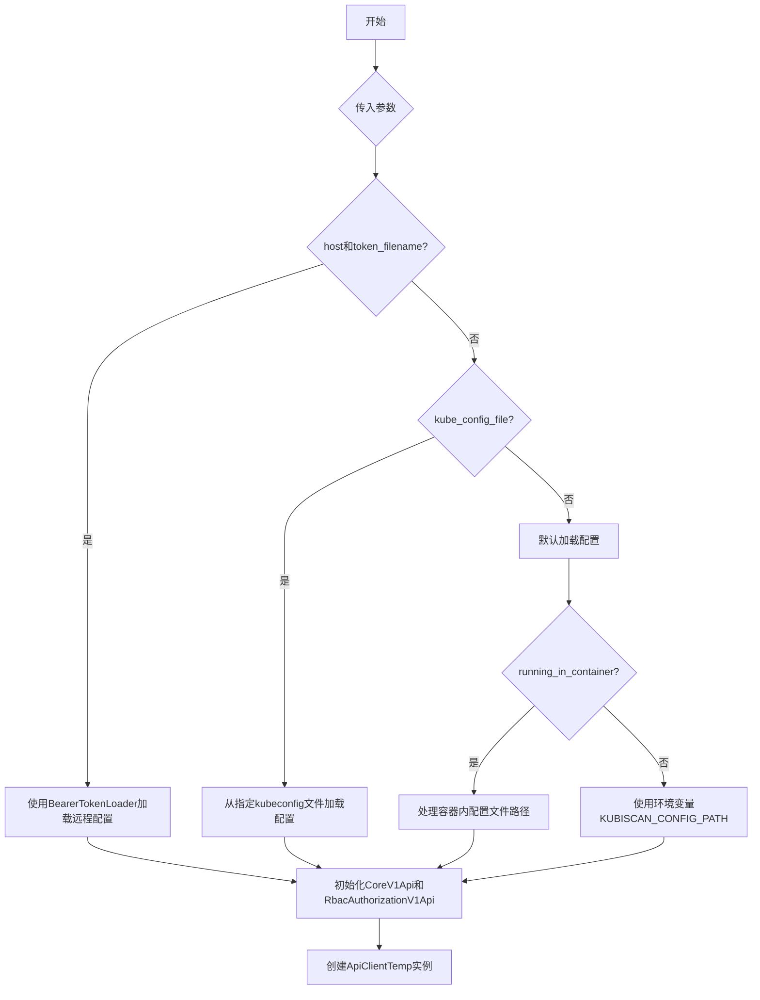

## 类结构

```
BaseApiClient (抽象基类)
└── RegularApiClient

BearerTokenLoader (独立工具类)
```

## 全局变量及字段


### `api_temp`
    
临时API客户端实例

类型：`ApiClientTemp`
    


### `CoreV1Api`
    
Kubernetes Core API实例

类型：`CoreV1Api`
    


### `RbacAuthorizationV1Api`
    
Kubernetes RBAC API实例

类型：`RbacAuthorizationV1Api`
    


### `configuration`
    
Kubernetes配置对象

类型：`Configuration`
    


### `api_version`
    
Kubernetes API版本信息

类型：`VersionApi`
    


### `BearerTokenLoader._token_filename`
    
Bearer token文件路径

类型：`str`
    


### `BearerTokenLoader._cert_filename`
    
SSL证书文件路径

类型：`str`
    


### `BearerTokenLoader._host`
    
Kubernetes API服务器主机地址

类型：`str`
    


### `BearerTokenLoader._verify_ssl`
    
是否验证SSL证书

类型：`bool`
    


### `BearerTokenLoader.token`
    
读取到的token值

类型：`str`
    


### `BearerTokenLoader.ssl_ca_cert`
    
SSL CA证书路径

类型：`str`
    
    

## 全局函数及方法


### `running_in_container`

该函数用于判断当前程序是否在容器环境中运行。它通过检查环境变量 `RUNNING_IN_A_CONTAINER` 的值来确定，如果该环境变量存在且值为 `'true'`，则返回 `True`，否则返回 `False`。

参数： 无

返回值：`bool`，返回 `True` 表示程序运行在容器中，返回 `False` 表示未运行在容器中

#### 流程图

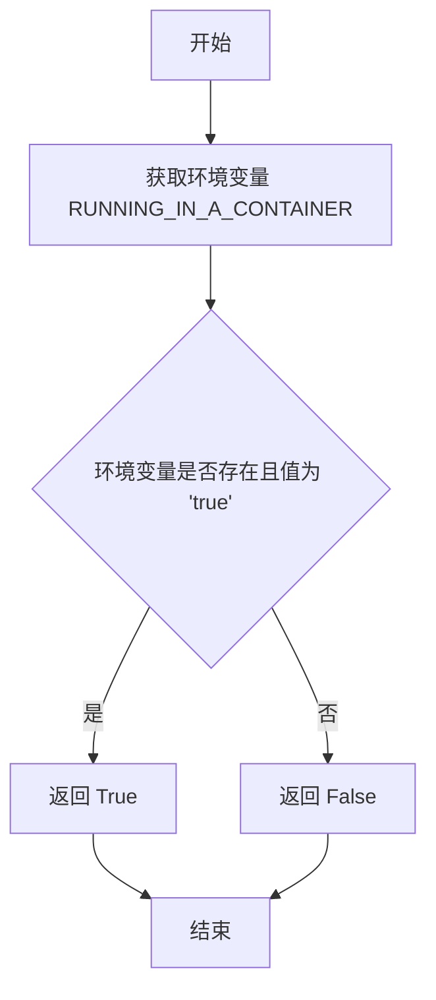

#### 带注释源码

```python
def running_in_container():
    """
    判断程序是否在容器中运行
    
    通过检查环境变量 'RUNNING_IN_A_CONTAINER' 来确定程序是否在容器环境中运行。
    该环境变量通常在容器镜像构建或启动时设置。
    
    返回:
        bool: 如果环境变量存在且值为 'true'，返回 True；否则返回 False
    """
    # 获取环境变量 'RUNNING_IN_A_CONTAINER' 的值
    running_in_a_container = os.getenv('RUNNING_IN_A_CONTAINER')
    
    # 检查环境变量是否存在且值等于 'true'
    if running_in_a_container is not None and running_in_a_container == 'true':
        # 环境变量存在且值为 'true'，返回 True
        return True
    
    # 环境变量不存在或值不是 'true'，返回 False
    return False
```


### `replace`

该函数用于替换指定文件中的字符串内容，通过创建临时文件的方式进行原子性替换，先读取原文件并对匹配的行进行替换，然后删除原文件并移动临时文件到原位置。

参数：

- `file_path`：`str`，要替换的文件路径
- `pattern`：`str`，要在文件中查找的字符串模式
- `subst`：`str`，用于替换的字符串

返回值：`None`，该函数执行文件替换操作，不返回任何值

#### 流程图

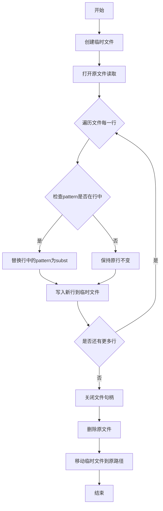

#### 带注释源码

```
def replace(file_path, pattern, subst):
    # 创建临时文件，返回文件句柄fh和临时文件绝对路径abs_path
    fh, abs_path = mkstemp()
    
    # 以写入模式打开临时文件
    with os.fdopen(fh,'w') as new_file:
        # 以读取模式打开原文件
        with open(file_path) as old_file:
            # 遍历原文件的每一行
            for line in old_file:
                # 检查pattern是否在该行中
                if pattern in line:
                    # 替换行中的pattern为subst后写入临时文件
                    new_file.write(line.replace(pattern, subst))
                else:
                    # 原行保持不变写入临时文件
                    new_file.write(line)
    
    # 删除原文件
    os.remove(file_path)
    
    # 将临时文件移动到原文件路径（原子性替换）
    move(abs_path, file_path)
```


### `api_init`

该函数是初始化Kubernetes API连接的主入口函数，支持三种连接方式：使用token和host进行远程连接、使用kubeconfig文件、或使用默认配置（可从环境变量或容器卷读取）。

参数：

- `kube_config_file`：`str`，kubeconfig文件路径，用于本地kubeconfig认证
- `host`：`str`，Kubernetes API服务器主机地址，用于远程认证
- `token_filename`：`str`，认证token文件路径，与host配合使用
- `cert_filename`：`str`，SSL证书文件路径，用于验证远程连接
- `context`：`str`，kubeconfig中的context名称，指定使用的集群上下文

返回值：`None`，该函数通过设置全局变量（CoreV1Api、RbacAuthorizationV1Api、api_temp、configuration、api_version）来初始化API连接

#### 流程图

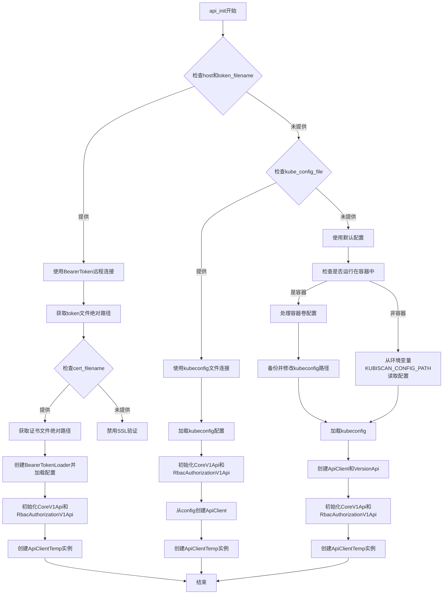

#### 带注释源码

```python
def api_init(kube_config_file=None, host=None, token_filename=None, cert_filename=None, context=None):
    """
    初始化Kubernetes API连接，支持多种认证方式
    
    参数:
        kube_config_file: kubeconfig文件路径
        host: Kubernetes API服务器主机地址
        token_filename: 认证token文件路径
        cert_filename: SSL证书文件路径
        context: kubeconfig中的context名称
    """
    # 声明全局变量，用于存储API客户端实例
    global CoreV1Api
    global RbacAuthorizationV1Api
    global api_temp
    global configuration
    global api_version
    
    # 方式1: 使用token和host进行远程连接
    if host and token_filename:
        print("Using token from " + token_filename + " on ip address " + host)
        
        # 将token文件路径转换为绝对路径
        token_filename = os.path.abspath(token_filename)
        
        # 如果提供了证书文件，也转换为绝对路径
        if cert_filename:
            cert_filename = os.path.abspath(cert_filename)
        
        # 使用BearerTokenLoader加载配置并初始化API客户端
        configuration = BearerTokenLoader(
            host=host, 
            token_filename=token_filename, 
            cert_filename=cert_filename
        ).load_and_set()

        # 初始化CoreV1Api和RbacAuthorizationV1Api客户端
        CoreV1Api = client.CoreV1Api()
        RbacAuthorizationV1Api = client.RbacAuthorizationV1Api()
        
        # 创建临时API客户端实例
        api_temp = ApiClientTemp(configuration=configuration)

    # 方式2: 使用kubeconfig文件
    elif kube_config_file:
        print("Using kube config file.")
        
        # 加载kubeconfig配置
        config.load_kube_config(os.path.abspath(kube_config_file))
        
        # 初始化API客户端
        CoreV1Api = client.CoreV1Api()
        RbacAuthorizationV1Api = client.RbacAuthorizationV1Api()
        
        # 从配置文件创建API客户端并获取配置
        api_from_config = config.new_client_from_config(kube_config_file)
        api_temp = ApiClientTemp(configuration=api_from_config.configuration)

    # 方式3: 使用默认配置（环境变量或容器配置）
    else:
        print("Using kube config file.")
        
        # 创建默认配置对象
        configuration = Configuration()
        
        # 从环境变量获取kubeconfig路径
        kubeconfig_path = os.getenv('KUBISCAN_CONFIG_PATH')
        
        # 检查是否运行在容器中
        if running_in_container() and kubeconfig_path is None:
            # 容器环境配置处理逻辑
            container_volume_prefix = os.getenv('KUBISCAN_VOLUME_PATH', '/tmp')
            kube_config_bak_path = os.getenv('KUBISCAN_CONFIG_BACKUP_PATH', '/opt/kubiscan/config_bak')
            
            # 如果备份文件不存在，则创建备份并修改路径
            if not os.path.isfile(kube_config_bak_path):
                copyfile(container_volume_prefix + os.path.expandvars('$CONF_PATH'), kube_config_bak_path)
                replace(kube_config_bak_path, ': /', f': {container_volume_prefix}/')

            # 使用修改后的配置加载kubeconfig
            config.load_kube_config(kube_config_bak_path, context=context, client_configuration=configuration)
        else:
            # 从环境变量指定的配置文件加载
            config.load_kube_config(config_file=kubeconfig_path, context=context, client_configuration=configuration)

        # 创建API客户端和版本API
        api_client = ApiClient(configuration=configuration)
        api_version = client.VersionApi(api_client=api_client)
        
        # 初始化CoreV1Api和RbacAuthorizationV1Api
        CoreV1Api = client.CoreV1Api(api_client=api_client)
        RbacAuthorizationV1Api = client.RbacAuthorizationV1Api(api_client=api_client)
        
        # 创建临时API客户端实例
        api_temp = ApiClientTemp(configuration=configuration)
```


### `BearerTokenLoader.__init__`

初始化BearerTokenLoader实例，用于加载Kubernetes Bearer Token认证配置。

参数：

- `host`：`str`，Kubernetes API服务器的主机地址
- `token_filename`：`str`，包含Bearer Token的文件路径
- `cert_filename`：`str`（可选，默认为None），SSL证书文件路径，用于验证服务器证书

返回值：`None`，该方法为构造函数，不返回任何值，仅初始化实例属性

#### 流程图

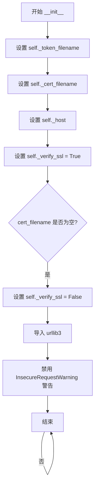

#### 带注释源码

```python
def __init__(self, host, token_filename, cert_filename=None):
    # 存储token文件路径到实例变量
    self._token_filename = token_filename
    # 存储证书文件路径到实例变量（可选参数）
    self._cert_filename = cert_filename
    # 存储Kubernetes API主机地址
    self._host = host
    # 默认启用SSL验证
    self._verify_ssl = True

    # 如果未提供证书文件，则禁用SSL验证
    if not self._cert_filename:
        self._verify_ssl = False
        # 导入urllib3用于禁用不安全请求警告
        import urllib3
        # 禁用InsecureRequestWarning警告，因为禁用了SSL验证
        urllib3.disable_warnings(urllib3.exceptions.InsecureRequestWarning)
```


### `BearerTokenLoader.load_and_set`

该方法是BearerTokenLoader类的核心方法，负责加载Bearer Token认证所需的配置文件（主机地址、Token文件、证书文件），并将其设置为Kubernetes Python客户端的默认配置，返回配置对象供后续API调用使用。

**参数：** 无（仅包含self隐式参数）

**返回值：** `kubernetes.client.configuration.Configuration`，返回配置对象，包含主机地址、SSL证书设置、认证Token等信息，供Kubernetes API客户端使用。

#### 流程图

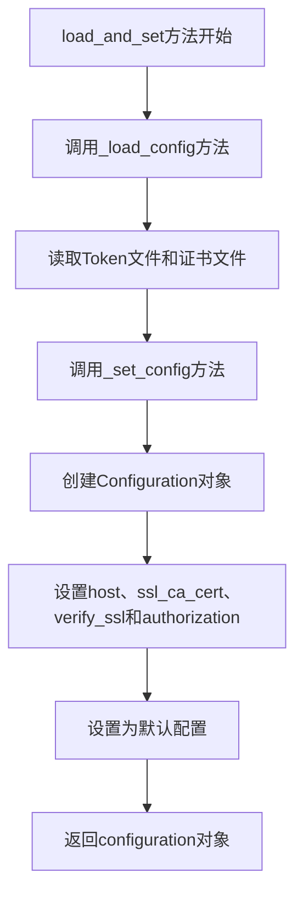

#### 带注释源码

```python
def load_and_set(self):
    """
    加载配置并设置Bearer Token认证
    依次调用私有方法加载配置和设置配置，最后返回configuration对象
    """
    # 步骤1：加载配置（读取host、token、cert文件）
    self._load_config()
    
    # 步骤2：设置配置（创建Configuration对象并填充参数）
    configuration = self._set_config()
    
    # 步骤3：返回配置对象供外部使用
    return configuration


def _load_config(self):
    """
    私有方法：加载配置文件
    1. 处理主机地址，添加https://前缀
    2. 读取Token文件内容并验证
    3. 读取证书文件内容并验证（可选）
    """
    # 处理主机地址，添加https://前缀
    self._host = "https://" + self._host

    # 验证Token文件是否存在
    if not os.path.isfile(self._token_filename):
        raise Exception("Service token file does not exists.")

    # 读取Token文件内容
    with open(self._token_filename) as f:
        self.token = f.read().rstrip('\n')
        if not self.token:
            raise Exception("Token file exists but empty.")

    # 如果提供了证书文件，验证并读取
    if self._cert_filename:
        if not os.path.isfile(self._cert_filename):
            raise Exception(
                "Service certification file does not exists.")

        with open(self._cert_filename) as f:
            if not f.read().rstrip('\n'):
                raise Exception("Cert file exists but empty.")

    # 保存证书文件路径
    self.ssl_ca_cert = self._cert_filename


def _set_config(self):
    """
    私有方法：设置Kubernetes客户端配置
    1. 创建Configuration对象
    2. 设置主机地址、SSL证书、验证选项和认证Token
    3. 设置为全局默认配置
    4. 返回配置对象
    """
    # 创建新的Configuration对象
    configuration = client.Configuration()
    
    # 设置主机地址
    configuration.host = self._host
    
    # 设置SSL证书路径
    configuration.ssl_ca_cert = self.ssl_ca_cert
    
    # 设置是否验证SSL（无证书时为False）
    configuration.verify_ssl = self._verify_ssl
    
    # 设置认证头，使用Bearer Token方式
    configuration.api_key['authorization'] = "bearer " + self.token
    
    # 将此配置设置为全局默认配置
    client.Configuration.set_default(configuration)
    
    # 返回配置对象供外部使用
    return configuration
```


### `BearerTokenLoader._load_config`

这是 `BearerTokenLoader` 类的内部方法，负责加载和验证用于 Kubernetes API 访问的令牌文件和证书文件。它读取文件系统中的 token 和证书内容，并进行基本的存在性和非空性验证，为后续的 API 配置设置做准备。

参数：
- `self`：`BearerTokenLoader` 类的实例，隐式参数

返回值：无（`None`），该方法通过直接修改实例属性（`self.token`、`self.ssl_ca_cert`、`self._host`）来存储加载的配置数据

#### 流程图

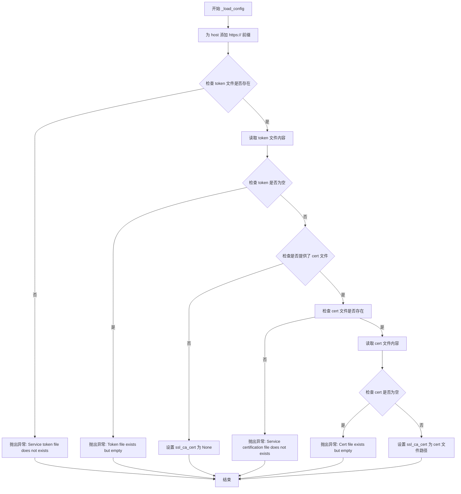

#### 带注释源码

```python
def _load_config(self):
    """
    内部方法：加载 token 和证书文件
    该方法执行以下操作：
    1. 确保 host 以 https:// 开头
    2. 读取并验证 token 文件存在且非空
    3. 如果提供了证书文件，则验证其存在且非空
    4. 将加载的内容存储到实例属性中
    """
    # Step 1: 确保 host 使用 HTTPS 协议
    # 如果 host 已经包含协议前缀，这里会形成重复的 https://，但代码中没有处理这种情况
    self._host = "https://" + self._host

    # Step 2: 检查 token 文件是否存在
    # 使用 os.path.isfile 进行文件存在性验证
    if not os.path.isfile(self._token_filename):
        raise Exception("Service token file does not exists.")

    # Step 3: 读取 token 文件内容
    # 使用 with 语句确保文件正确关闭
    # .rstrip('\n') 移除末尾的换行符
    with open(self._token_filename) as f:
        self.token = f.read().rstrip('\n')
        # 验证 token 不为空
        if not self.token:
            raise Exception("Token file exists but empty.")

    # Step 4: 如果提供了证书文件，则验证证书
    if self._cert_filename:
        # 检查证书文件是否存在
        if not os.path.isfile(self._cert_filename):
            raise Exception(
                "Service certification file does not exists.")

        # 读取证书文件内容并验证非空
        # 注意：这里读取了内容但没有存储到变量中，仅用于验证非空
        with open(self._cert_filename) as f:
            if not f.read().rstrip('\n'):
                raise Exception("Cert file exists but empty.")

        # 将证书文件路径存储到实例属性
        self.ssl_ca_cert = self._cert_filename
```


### `BearerTokenLoader._set_config`

内部方法，用于设置Kubernetes配置，创建并配置一个包含主机地址、SSL证书、验证选项和Bearer令牌的Configuration对象。

参数：
- 此方法为实例方法，隐含参数 `self`（`BearerTokenLoader` 实例），无需额外参数

返回值：`client.Configuration`，返回配置好的Kubernetes客户端配置对象

#### 流程图

```mermaid
flowchart TD
    A[开始 _set_config] --> B[创建 client.Configuration 实例]
    B --> C[设置 configuration.host = self._host]
    C --> D[设置 configuration.ssl_ca_cert = self.ssl_ca_cert]
    D --> E[设置 configuration.verify_ssl = self._verify_ssl]
    E --> F[设置 configuration.api_key['authorization'] = 'bearer ' + self.token]
    F --> G[调用 client.Configuration.set_default 设置为默认配置]
    G --> H[返回 configuration 对象]
```

#### 带注释源码

```python
def _set_config(self):
    # 创建一个新的 Kubernetes 客户端配置对象
    configuration = client.Configuration()
    
    # 设置 API 服务器的主机地址（包含协议前缀）
    configuration.host = self._host
    
    # 设置 SSL CA 证书文件路径
    configuration.ssl_ca_cert = self.ssl_ca_cert
    
    # 设置是否验证 SSL 证书（若未提供证书则默认为 False）
    configuration.verify_ssl = self._verify_ssl
    
    # 设置 Authorization 头为 Bearer Token 认证方式
    # 格式: "bearer " + token 值
    configuration.api_key['authorization'] = "bearer " + self.token
    
    # 将此配置对象设置为 Kubernetes 客户端的全局默认配置
    client.Configuration.set_default(configuration)
    
    # 返回配置好的配置对象，供调用者使用
    return configuration
```


### `RegularApiClient.__init__`

该方法用于初始化 `RegularApiClient` 类的实例，通过调用 Kubernetes 配置加载函数 `config.load_kube_config()` 来加载默认的 kubeconfig 文件，从而为后续与 Kubernetes API 交互准备好认证和连接配置。

参数：

- 该方法无显式参数（仅包含隐式参数 `self`）

返回值：`None`，该方法不返回任何值，仅执行初始化操作

#### 流程图

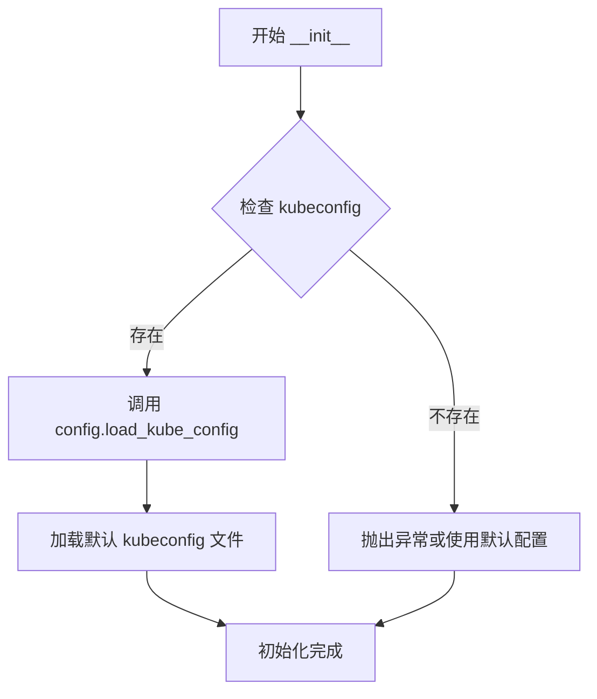

#### 带注释源码

```python
class RegularApiClient(BaseApiClient):
    """
    RegularApiClient 类，继承自 BaseApiClient
    用于通过标准的 kubeconfig 文件与 Kubernetes API 进行交互
    """
    
    def __init__(self):
        """
        初始化 RegularApiClient 实例
        加载默认的 kubeconfig 配置（通常位于 ~/.kube/config）
        """
        # 调用 kubernetes python client 的配置加载函数
        # 该函数会自动读取默认位置的 kubeconfig 文件
        # 包括集群信息、用户凭证、上下文等配置
        config.load_kube_config()
```


### `RegularApiClient.list_roles_for_all_namespaces`

获取所有命名空间中的Role资源，返回包含所有命名空间Role列表的V1RoleList对象。

参数：

- 无（仅包含`self`隐式参数）

返回值：`V1RoleList`，返回Kubernetes集群中所有命名空间的Role资源列表

#### 流程图

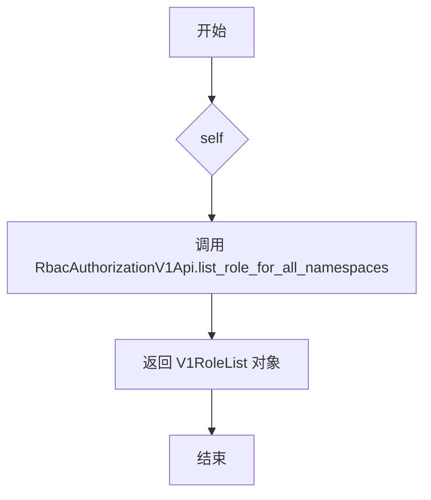

#### 带注释源码

```python
def list_roles_for_all_namespaces(self):
    """
    获取所有命名空间中的Role资源
    
    该方法调用Kubernetes RBAC API的list_role_for_all_namespaces接口，
    返回集群中所有命名空间的Role列表
    
    参数:
        无（仅包含self隐式参数）
    
    返回值:
        V1RoleList: 包含所有命名空间Role资源的列表对象
    """
    return RbacAuthorizationV1Api.list_role_for_all_namespaces()
```


### `RegularApiClient.list_cluster_role`

获取所有Kubernetes ClusterRole资源。该方法通过ApiClientTemp实例调用Kubernetes RBAC API的list_cluster_role接口，返回集群中所有的ClusterRole对象列表。

参数：

- 该方法无显式参数（仅包含隐式参数`self`）

返回值：`任意类型`，返回Kubernetes集群中所有的ClusterRole对象列表，具体类型取决于`ApiClientTemp.list_cluster_role()`的返回值，通常为`V1ClusterRoleList`或类似的Kubernetes API响应对象。

#### 流程图

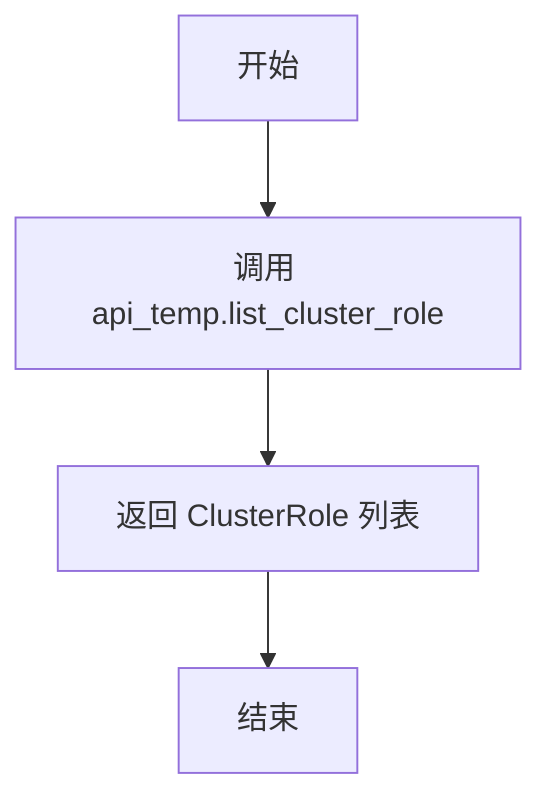

#### 带注释源码

```python
def list_cluster_role(self):
    """
    获取所有ClusterRole资源
    
    该方法委托给api_temp对象的list_cluster_role方法，
    用于从Kubernetes集群中检索所有的ClusterRole定义。
    
    Returns:
        V1ClusterRoleList: 包含所有ClusterRole对象的列表响应
    """
    return api_temp.list_cluster_role()
```


### `RegularApiClient.list_role_binding_for_all_namespaces`

获取所有命名空间的 RoleBinding 资源列表。

参数：无需参数（仅包含 `self`）

返回值：`V1RoleBindingList`，返回 Kubernetes 集群中所有命名空间的 RoleBinding 对象列表

#### 流程图

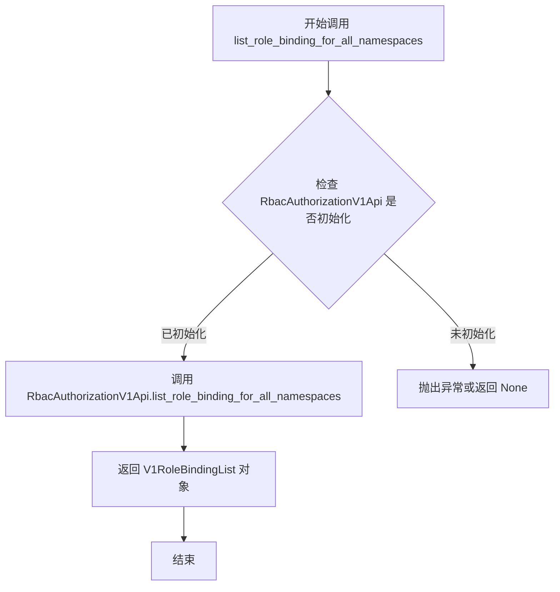

#### 带注释源码

```python
def list_role_binding_for_all_namespaces(self):
    """
    获取所有命名空间的 RoleBinding 列表
    
    该方法调用 Kubernetes RBAC API 的 list_role_binding_for_all_namespaces 接口，
    返回集群中所有命名空间的 RoleBinding 资源。
    
    参数：
        无（仅包含 self 隐式参数）
    
    返回值：
        V1RoleBindingList: 包含所有命名空间中 RoleBinding 对象的列表
    """
    return RbacAuthorizationV1Api.list_role_binding_for_all_namespaces()
```

---

### 补充说明

**全局变量依赖：**
- `RbacAuthorizationV1Api`：需要在 `api_init()` 函数中初始化的全局变量，用于调用 Kubernetes RBAC API

**潜在问题与优化空间：**
1. **缺少错误处理**：该方法没有异常处理机制，如果 API 调用失败会直接抛出异常
2. **全局状态依赖**：方法依赖全局变量 `RbacAuthorizationV1Api`，如果未初始化会导致 `NameError`
3. **无参数灵活性**：相比原生的 Kubernetes API，该方法缺少 `watch`、`field_selector`、`label_selector` 等常用参数
4. **设计问题**：直接返回原始 API 响应对象，调用方需要了解 `V1RoleBindingList` 的结构

**调用链：**
```
用户代码 
    → RegularApiClient.list_role_binding_for_all_namespaces()
        → RbacAuthorizationV1Api.list_role_binding_for_all_namespaces()
            → Kubernetes API Server
```


### `RegularApiClient.list_cluster_role_binding`

获取所有 ClusterRoleBinding 资源列表。

参数：
- （无 explicit 参数，仅包含隐式参数 `self`）

返回值：`V1ClusterRoleBindingList`，返回 Kubernetes 集群中的 ClusterRoleBinding 对象列表。

#### 流程图

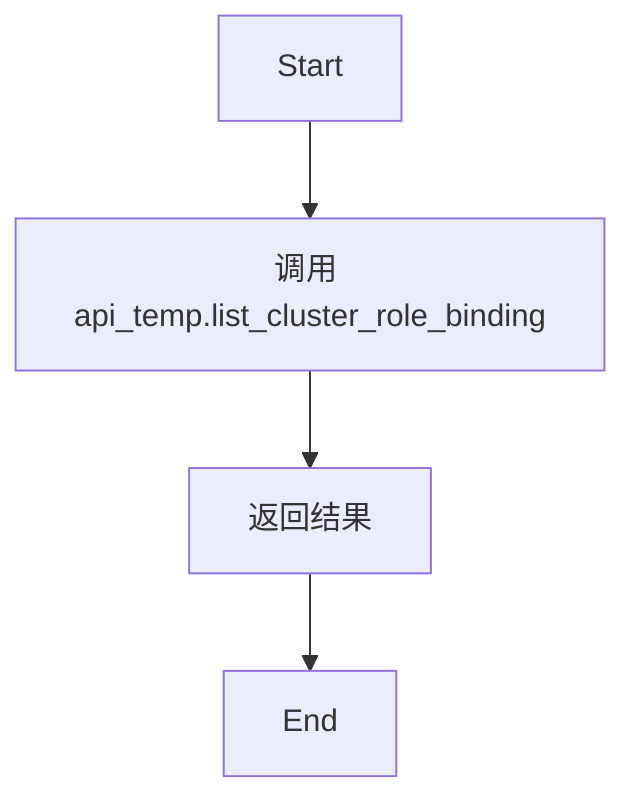

#### 带注释源码

```python
def list_cluster_role_binding(self):
    """
    获取所有 ClusterRoleBinding 列表。
    
    依赖于全局变量 api_temp，该变量通常在系统初始化阶段通过 api_init 函数创建。
    此方法是对 api_temp 实例方法的简单封装。
    """
    # 调用 api_temp 实例的 list_cluster_role_binding 方法并返回结果
    return api_temp.list_cluster_role_binding()
```


### `RegularApiClient.read_namespaced_role_binding`

该方法是 Kubernetes RBAC 客户端的一部分，用于通过 REST API 调用读取指定命名空间（namespace）下的 RoleBinding 资源对象。它封装了 `RbacAuthorizationV1Api.read_namespaced_role_binding` 方法，提供了对 Kubernetes 集群中 RBAC 角色绑定信息的查询能力。

参数：

- `rolebinding_name`：`str`，要读取的 RoleBinding 资源的名称
- `namespace`：`str`，RoleBinding 所在的 Kubernetes 命名空间

返回值：`V1RoleBinding`（来自 `kubernetes.client.models`），返回指定命名空间中对应名称的 RoleBinding 资源对象，包含了该角色绑定的元数据、主体和角色引用信息

#### 流程图

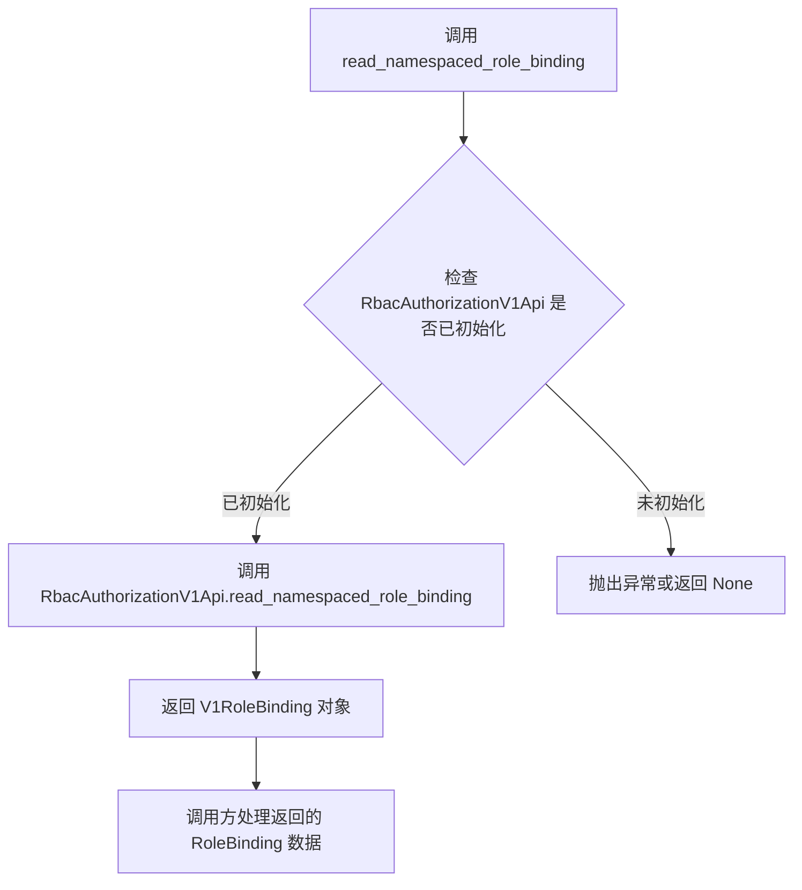

#### 带注释源码

```python
def read_namespaced_role_binding(self, rolebinding_name, namespace):
    """
    读取指定命名空间下的 RoleBinding 资源
    
    参数:
        rolebinding_name: str - RoleBinding 资源的名称
        namespace: str - Kubernetes 命名空间名称
    
    返回:
        V1RoleBinding - 包含 RoleBinding 完整信息的对象
    """
    # 直接调用 RbacAuthorizationV1Api 的同名方法
    # 该方法会向 Kubernetes API Server 发送 GET 请求
    # 请求路径: /apis/rbac.authorization.k8s.io/v1/namespaces/{namespace}/rolebindings/{rolebinding_name}
    return RbacAuthorizationV1Api.read_namespaced_role_binding(rolebinding_name, namespace)
```


### `RegularApiClient.read_namespaced_role`

该方法是 `RegularApiClient` 类的一个实例方法，用于通过 Kubernetes RbacAuthorizationV1Api 从指定命名空间中读取特定的 Role 资源。它封装了对 Kubernetes API 服务的调用，将 role 名称和命名空间作为参数传递给底层 API 并返回结果。

#### 参数

- `role_name`：`str`，要读取的 Role 资源的名称
- `namespace`：`str`，Role 所在的 Kubernetes 命名空间

#### 流程图

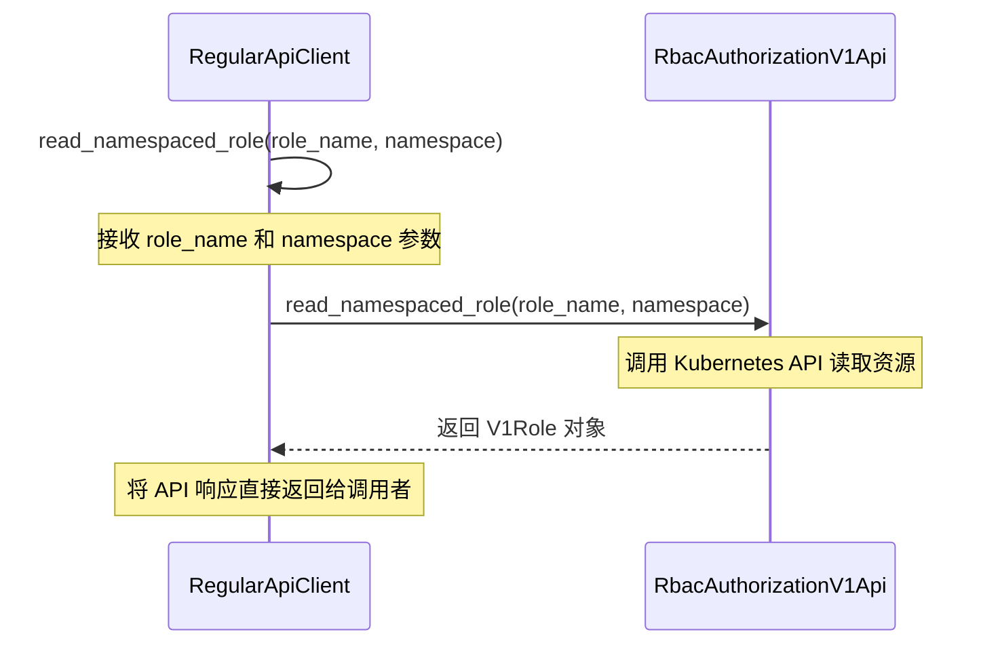

#### 带注释源码

```python
def read_namespaced_role(self, role_name, namespace):
    """
    读取指定命名空间中的 Role 资源
    
    参数:
        role_name: str - Role 资源的名称
        namespace: str - Role 所在的命名空间
    
    返回:
        V1Role 对象 - 包含 Role 的完整信息
    """
    return RbacAuthorizationV1Api.read_namespaced_role(role_name, namespace)
    # 直接调用 kubernetes 客户端的 API 方法
    # 返回 kubernetes.client.models.v1_role.V1Role 对象
    # 如果资源不存在或无权限，会抛出 ApiException
```


### `RegularApiClient.read_cluster_role`

该方法封装了对 Kubernetes RBAC API 的调用，用于获取集群级别（ClusterRole）的角色资源详细信息。它接收角色名称作为参数，并委托给全局初始化的 `RbacAuthorizationV1Api` 客户端去 API Server 获取数据。

参数：

- `role_name`：`str`，要读取的 ClusterRole 的名称（Name）。

返回值：`kubernetes.client.V1ClusterRole`，返回目标 ClusterRole 的完整对象，包含其元数据（metadata）、规则（rules）等信息。如果角色不存在，底层 Kubernetes API 会抛出 `ApiException`。

#### 流程图

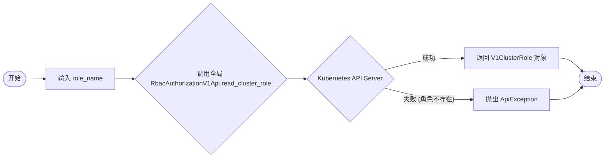

#### 带注释源码

```python
def read_cluster_role(self, role_name):
    """
    读取指定名称的 ClusterRole。

    参数:
        role_name (str): ClusterRole 的名称。

    返回:
        V1ClusterRole: 包含角色详细信息的对象。
    """
    # 调用全局变量 RbacAuthorizationV1Api 的 read_cluster_role 方法
    # 该方法是同步调用，会阻塞直到收到 API Server 的响应或超时
    return RbacAuthorizationV1Api.read_cluster_role(role_name)
```


### `RegularApiClient.list_pod_for_all_namespaces`

获取所有命名空间中的Pod列表，支持是否开启Watch模式。

参数：

- `watch`：`bool`，是否开启Watch模式以保持长连接，持续监听Pod变化

返回值：`V1PodList`，返回包含所有命名空间Pod的列表对象，包含Pod的元数据、状态、容器信息等

#### 流程图

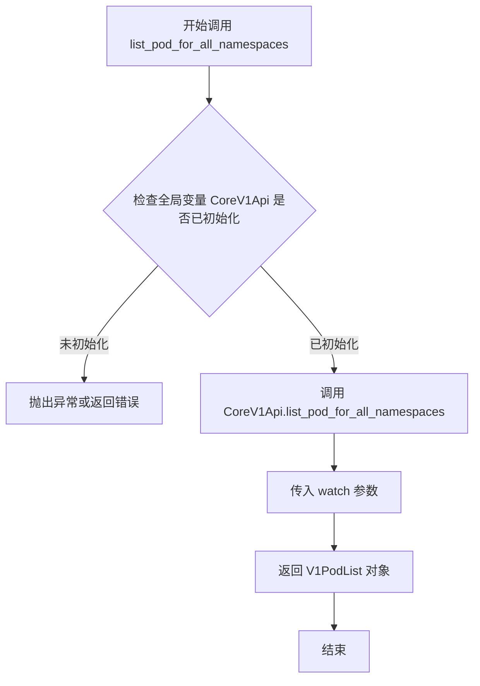

#### 带注释源码

```python
def list_pod_for_all_namespaces(self, watch):
    """
    获取所有命名空间中的Pod列表
    
    参数:
        watch: 布尔值，True表示开启Watch模式持续监听，False表示一次性返回
    
    返回:
        V1PodList对象，包含所有命名空间的Pod列表
    """
    # 调用Kubernetes CoreV1Api的list_pod_for_all_namespaces方法
    # 参数watch控制是否开启流式监听模式
    return CoreV1Api.list_pod_for_all_namespaces(watch=watch)
```

#### 关联信息

| 元素 | 类型 | 描述 |
|------|------|------|
| `RegularApiClient` | 类 | 继承自BaseApiClient的常规API客户端，提供Kubernetes核心资源查询能力 |
| `CoreV1Api` | 全局变量 | kubernetes.client.CoreV1Api实例，用于操作Core V1 API资源 |
| `BaseApiClient` | 基类 | API客户端基类，定义通用接口规范 |
| `watch` | 参数 | 布尔类型，控制是否启用Watch机制持续监听资源变化 |


### `RegularApiClient.list_namespaced_pod`

获取指定Kubernetes命名空间下的所有Pod列表。

参数：

- `namespace`：`str`，Kubernetes命名空间的名称，用于指定要查询的命名空间

返回值：`V1PodList`，返回指定命名空间下的Pod列表对象，包含所有Pod的元数据信息

#### 流程图

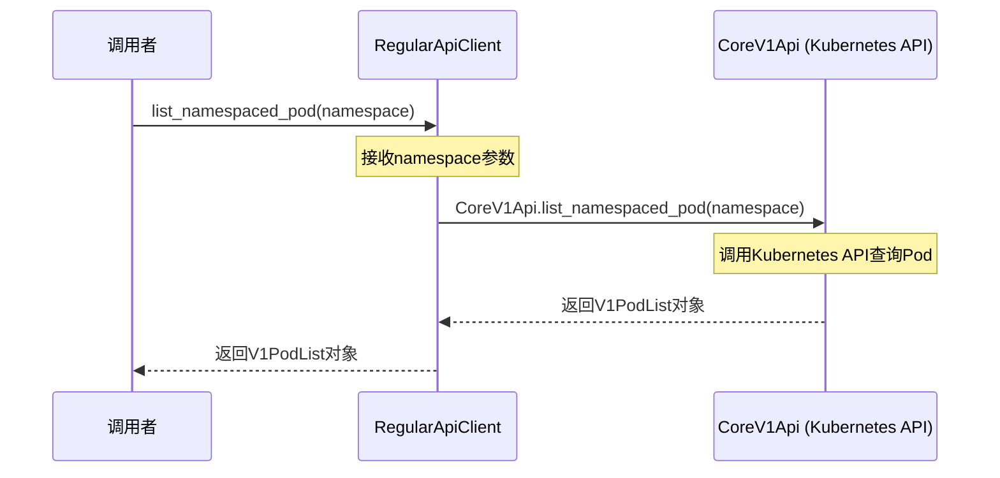

#### 带注释源码

```python
def list_namespaced_pod(self, namespace):
    """
    获取指定命名空间下的所有Pod列表
    
    参数:
        namespace (str): Kubernetes命名空间名称
        
    返回:
        V1PodList: 包含指定命名空间中所有Pod的列表对象
    """
    return CoreV1Api.list_namespaced_pod(namespace)
```

## 关键组件


### BearerTokenLoader

负责通过Bearer Token方式认证Kubernetes API的类，支持SSL证书验证和 insecure 模式

### api_init

Kubernetes API初始化函数，支持三种配置方式：token+host远程连接、kubeconfig文件加载、默认配置自动检测（容器内或本地）

### RegularApiClient

提供Kubernetes RBAC和Pod资源查询的客户端类，封装了CoreV1Api和RbacAuthorizationV1Api的常用方法

### running_in_container

检测当前代码是否运行在Kubernetes容器环境中的工具函数，通过环境变量判断

### replace

文件内容替换工具函数，创建临时文件进行原子性替换操作

### 全局API客户端变量

CoreV1Api、RbacAuthorizationV1Api、api_temp等全局变量用于缓存Kubernetes API实例，避免重复创建

### ApiClientTemp

自定义的临时API客户端实现，用于处理特定的集群操作（需配合base_client_api和api_client_temp模块使用）


## 问题及建议


### 已知问题

-   **全局变量状态管理混乱**：`CoreV1Api`、`RbacAuthorizationV1Api`、`api_temp`等全局变量在多处被重新赋值，缺乏线程安全性和状态一致性保障，测试困难
-   **重复代码**：`CoreV1Api`和`RbacAuthorizationV1Api`在`api_init`函数中被重复初始化多次（远程、kubeconfig文件、默认配置三种路径），违反DRY原则
-   **硬编码路径**：`/tmp`、`/opt/kubiscan/config_bak`等路径硬编码在代码中，降低了可移植性
-   **临时解决方案未清理**：`ApiClientTemp`是从外部导入的临时修复方案，代码中存在TODO注释说明但长期未解决，存在技术债务
-   **注释掉的死代码**：存在大段注释掉的代码（api_temp初始化和相关API客户端），既不美观也不便于维护
-   **资源泄漏风险**：`replace`函数创建临时文件后移动，但如果移动失败会导致临时文件残留；文件操作未使用上下文管理器
-   **错误处理不完善**：`BearerTokenLoader`有异常处理，但`api_init`和`RegularApiClient`中缺乏适当的异常捕获和传播机制
-   **配置管理不安全**：token和证书路径直接暴露在代码中，缺乏加密存储和敏感信息保护机制

### 优化建议

-   **消除全局变量**：使用单例模式或依赖注入方式管理API客户端状态，将全局变量封装到配置类或客户端类中
-   **提取公共初始化逻辑**：将API客户端初始化逻辑抽取为私有方法或工厂类，减少代码重复
-   **配置外部化**：将硬编码路径迁移到配置文件或环境变量中，使用`os.getenv`配合默认值
-   **清理技术债务**：制定计划解决`ApiClientTemp`依赖问题，或寻找长期替代方案
-   **删除死代码**：移除注释掉的代码块，或使用版本控制保留历史记录
-   **改进文件操作**：使用`tempfile.NamedTemporaryFile`并结合异常处理确保资源正确释放
-   **完善错误处理**：在`api_init`和`RegularApiClient`中添加适当的try-except块和自定义异常类
-   **增加日志记录**：将`print`语句替换为Python的`logging`模块，便于生产环境调试
-   **添加类型提示**：为函数参数和返回值添加类型注解，提高代码可读性和IDE支持


## 其它


### 设计目标与约束

本模块旨在提供一个统一的Kubernetes API客户端抽象层，支持多种认证方式（kubeconfig、token认证、in-cluster配置），以便扫描和获取Kubernetes集群中的RBAC资源（角色、角色绑定、集群角色、集群角色绑定）和Pod信息。约束包括：必须与kubernetes Python客户端库配合使用，支持Python 3.x环境，需要有效的Kubernetes集群访问权限。

### 错误处理与异常设计

代码中的异常处理主要包括：1）文件不存在异常，当token文件或证书文件不存在时抛出Exception；2）文件为空异常，当token文件或证书文件存在但内容为空时抛出Exception；3）环境变量未设置异常，当KUBISCAN_CONFIG_PATH未设置且不在容器中运行时可能引发KeyError。建议增加：1）网络连接超时处理；2）API调用重试机制；3）更细粒度的异常分类（认证失败、权限不足、资源不存在等）。

### 数据流与状态机

程序的数据流主要包括：1）初始化阶段根据参数（kube_config_file、host+token、默认配置）选择认证方式；2）配置加载阶段通过config.load_kube_config或BearerTokenLoader加载配置；3）API客户端创建阶段实例化CoreV1Api、RbacAuthorizationV1Api和ApiClientTemp；4）资源查询阶段通过各种list_和read_方法获取集群资源。状态转换：未初始化 -> 配置加载中 -> API客户端就绪 -> 资源查询中。

### 外部依赖与接口契约

主要外部依赖包括：1）kubernetes Python客户端库（client、config模块）；2）urllib3（用于禁用SSL警告）；3）shutil、os、tempfile（标准库）。接口契约：api_init()函数接受kube_config_file、host、token_filename、cert_filename、context参数；BearerTokenLoader类提供load_and_set()方法返回Configuration对象；RegularApiClient类提供多个list_和read_方法返回kubernetes API响应对象。

### 安全性考虑

代码存在以下安全考量：1）token和证书文件通过os.path.abspath()转换为绝对路径进行验证；2）默认禁用SSL验证（当未提供cert_filename时）；3）使用环境变量RUNNING_IN_A_CONTAINER判断容器运行环境；4）kubeconfig备份文件包含敏感凭证，需要适当保护。建议增加：1）凭证文件的权限检查；2）敏感信息日志脱敏；3）TLS证书验证增强。

### 性能考量

潜在性能问题：1）list_role_for_all_namespaces和list_pod_for_all_namespaces返回全量数据，可能导致内存压力；2）每次API调用都创建新的ApiClient实例；3）容器环境配置加载涉及文件复制和内容替换操作。建议优化：1）实现分页获取；2）连接池和客户端实例缓存；3）配置文件预处理。

### 配置管理

配置管理涉及以下方面：1）KUBISCAN_CONFIG_PATH：kubeconfig文件路径；2）KUBISCAN_CONFIG_BACKUP_PATH：备份配置文件路径；3）KUBISCAN_VOLUME_PATH：容器卷路径前缀；4）RUNNING_IN_A_CONTAINER：标记是否在容器中运行；5）$CONF_PATH：配置路径环境变量（需在容器中预先设置）。配置优先级：host+token参数 > kube_config_file参数 > 环境变量配置 > 默认kubeconfig。

### 兼容性考虑

当前代码与kubernetes Python客户端库的版本兼容性需要注意：1）ApiClientTemp来自自定义模块api_client_temp，可能是为了解决特定版本的bug；2）部分API方法（如list_role_for_all_namespaces）可能在不同版本中有细微差别；3）代码中注释掉的全局初始化是因为与kubiscan -h命令冲突，建议确认kubernetes客户端版本并进行相应适配。

### 使用示例

```python
# 示例1：使用kubeconfig文件
api_init(kube_config_file='/path/to/config')

# 示例2：使用token和host
api_init(host='https://kubernetes.example.com', token_filename='/var/run/secrets/kubernetes.io/serviceaccount/token', cert_filename='/var/run/secrets/kubernetes.io/serviceaccount/ca.crt')

# 示例3：获取所有命名空间的角色
client = RegularApiClient()
roles = client.list_roles_for_all_namespaces()

# 示例4：获取特定命名空间的Pod
pods = client.list_namespaced_pod('default')
```

    