# `KubiScan\api\api_client_temp.py` 详细设计文档

这是一个临时的 Kubernetes API 客户端实现，用于绕过 kubernetes-client/python 的 bug #577，主要提供 list_cluster_role_binding() 和 list_cluster_role() 方法来获取 RBAC 相关的集群角色绑定和集群角色信息。

## 整体流程

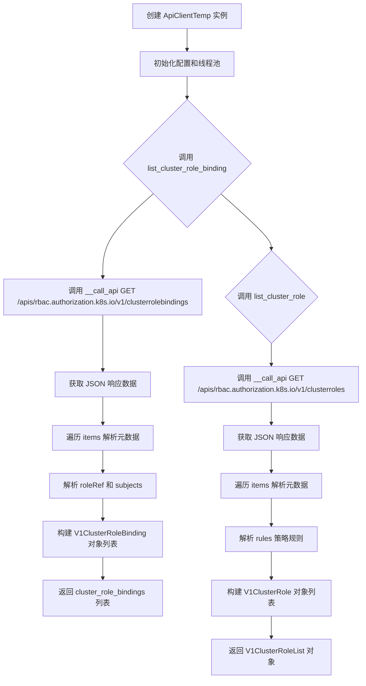

## 类结构

```
ApiClientTemp (Kubernetes 临时 API 客户端)
└── 主要方法:
    ├── list_cluster_role_binding() - 获取集群角色绑定列表
    └── list_cluster_role() - 获取集群角色列表
```

## 全局变量及字段


### `PRIMITIVE_TYPES`
    
基本类型列表，包含 float, bool, bytes, text_type 和 integer_types

类型：`tuple`
    


### `NATIVE_TYPES_MAPPING`
    
Python 类型映射表，用于将 OpenAPI 类型映射到 Python 原生类型

类型：`dict`
    


### `ApiClientTemp.configuration`
    
API 客户端配置对象，包含服务器主机地址、认证信息等配置

类型：`Configuration`
    


### `ApiClientTemp.pool`
    
线程池，用于异步执行 API 请求

类型：`ThreadPool`
    


### `ApiClientTemp.rest_client`
    
REST 客户端实例，负责实际发起 HTTP 请求

类型：`RESTClientObject`
    


### `ApiClientTemp.default_headers`
    
默认请求头字典，包含 User-Agent 等默认 HTTP 头信息

类型：`dict`
    


### `ApiClientTemp.cookie`
    
Cookie 信息，用于维护会话状态

类型：`str`
    


### `ApiClientTemp.user_agent`
    
用户代理字符串，标识客户端类型和版本

类型：`str`
    


### `ApiClientTemp.last_response`
    
最后一次 API 响应的数据对象

类型：`RESTResponse`
    
    

## 全局函数及方法


### `quote`

该函数是 `six.moves.urllib.parse` 模块提供的 URL 编码函数。在代码中用于将路径参数（Path Parameters）中的字符串转换为安全的 URL 格式（替换特殊字符为 `%XX`），以确保它们可以正确地包含在 REST API 请求的 URI 中。

参数：
-  `string`：`str`，需要进行 URL 编码的字符串。在代码中对应 `str(v)`，即将路径参数的值转为字符串。
-  `safe`：`str`，不需要被编码的安全字符集。在代码中对应 `config.safe_chars_for_path_param`（默认通常包含 `/` 等路径分隔符）。
-  `encoding`：`str` (可选)，指定字符串的编码方式（默认为 'utf-8'）。
-  `errors`：`str` (可选)，编码错误处理策略（默认为 'strict'）。

返回值：`str`，返回 URL 编码后的字符串。

#### 流程图

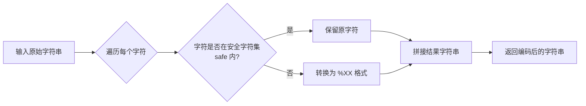

#### 带注释源码

```python
# 导入 URL 编码函数，来自 six 兼容性库，兼容 Python 2 和 3
from six.moves.urllib.parse import quote

# ... (在 ApiClientTemp 类的 __call_api 方法中)

# 遍历路径参数，将 URL 模板中的占位符 {key} 替换为实际的值
# 关键调用点：使用 quote 函数确保路径参数值（如资源名称）被正确编码
# 参数1: str(v) -> 将参数值转为字符串
# 参数2: safe=config.safe_chars_for_path_param -> 保留配置文件指定的安全字符（如斜杠）
resource_path = resource_path.replace(
    '{%s}' % k, quote(str(v), safe=config.safe_chars_for_path_param))
```


### `ApiClientTemp.deserialize` 中调用的 `json.loads`

`json.loads` 是 Python 标准库中的 JSON 解析函数，用于将 JSON 格式的字符串或字节序列转换为 Python 对象（字典、列表等）。在 `ApiClientTemp` 类的 `deserialize` 方法中，它被用于将 REST API 响应的数据部分反序列化为 Python 数据结构。

#### 参数

- `s`：`str` 或 `bytes`，要解析的 JSON 字符串或字节序列。在当前代码中为 `response.data`，即 REST API 返回的响应体数据。

#### 返回值

- `object`：返回解析后的 Python 对象，通常是字典（dict）或列表（list），具体类型取决于 JSON 数据的结构。

#### 流程图

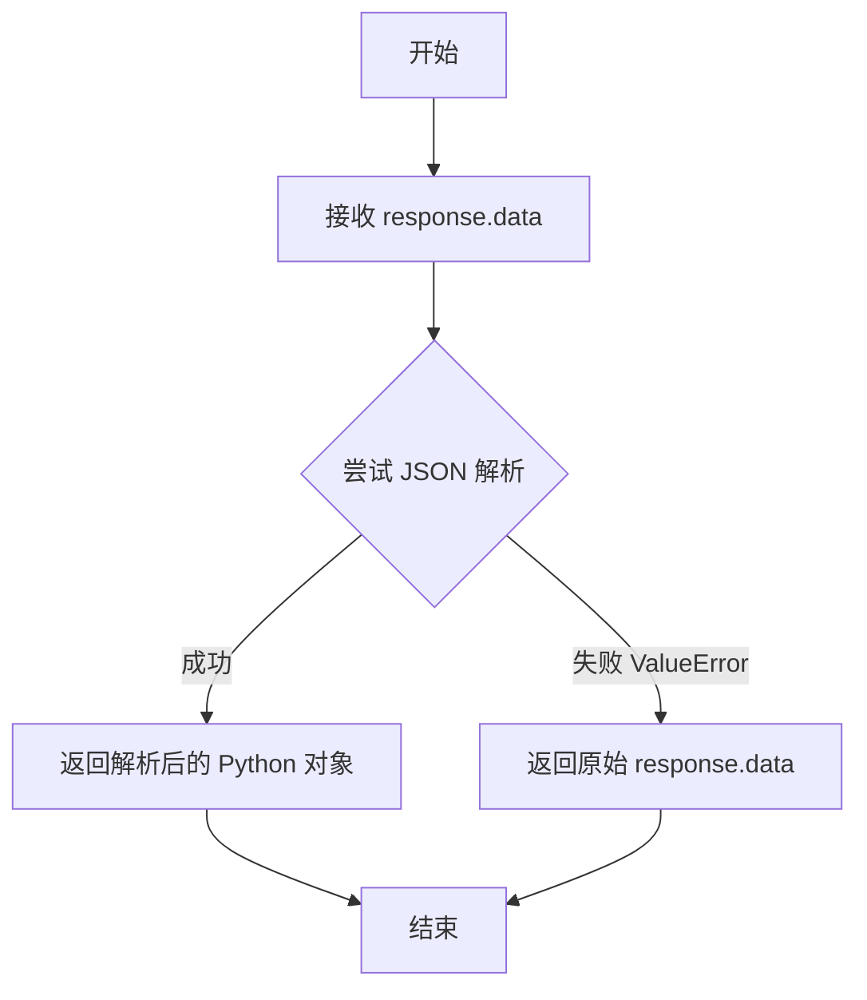

#### 带注释源码

```python
def deserialize(self, response, response_type):
    """
    Deserializes response into an object.

    :param response: RESTResponse object to be deserialized.
    :param response_type: class literal for
        deserialized object, or string of class name.

    :return: deserialized object.
    """
    # 处理文件下载场景
    # 将响应体保存到临时文件并返回文件实例
    if response_type == "file":
        return self.__deserialize_file(response)

    # 从响应对象中获取数据
    try:
        # 使用 json.loads 将 JSON 字符串解析为 Python 对象
        # response.data 是 REST API 返回的响应体（字符串或字节）
        # 解析成功则返回 dict/list 等 Python 数据结构
        data = json.loads(response.data)
    except ValueError:
        # 如果 JSON 解析失败（如响应不是有效 JSON）
        # 则返回原始的响应数据（可能是字符串或字节）
        data = response.data

    return data
    # return self.__deserialize(data, response_type)
```


### `tempfile.mkstemp`

该函数是 Python 标准库 `tempfile` 模块中的函数，在 `ApiClientTemp` 类的 `__deserialize_file` 方法中被调用，用于在临时文件夹中创建临时文件，以便将响应数据保存到文件中。

参数：

- `dir`： `str`，可选，指定临时文件存放的目录。若不指定，则使用系统默认的临时文件目录。
- `suffix`： `str`，可选，临时文件名的后缀。
- `prefix`： `str`，可选，临时文件名的前缀。
- `text`： `bool`，可选，指定以文本模式还是二进制模式打开文件，默认为 `False`（二进制模式）。

返回值： `tuple`，返回一个元组，包含文件描述符 `fd` 和文件路径 `path`。

#### 流程图

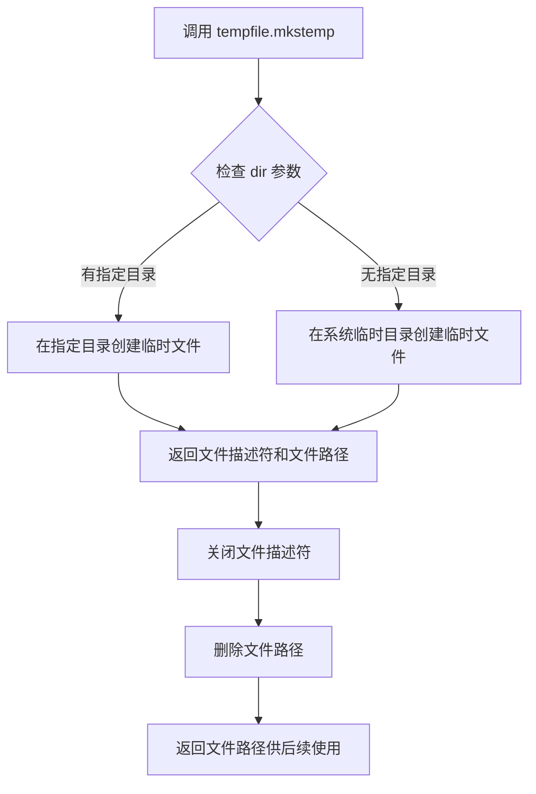

#### 带注释源码

```python
def __deserialize_file(self, response):
    """
    Saves response body into a file in a temporary folder,
    using the filename from the `Content-Disposition` header if provided.

    :param response:  RESTResponse.
    :return: file path.
    """
    # 使用 tempfile.mkstemp 在临时文件夹中创建临时文件
    # dir 参数指定了临时文件存放的目录，来自配置中的 temp_folder_path
    # 返回一个元组 (fd, path)，fd 是文件描述符，path 是文件路径
    fd, path = tempfile.mkstemp(dir=self.configuration.temp_folder_path)
    
    # 关闭文件描述符，因为后续只需要文件路径来写入数据
    os.close(fd)
    
    # 删除临时文件，因为后续会根据 Content-Disposition 头重新创建文件
    os.remove(path)

    # 从响应头中获取 Content-Disposition 来确定文件名
    content_disposition = response.getheader("Content-Disposition")
    if content_disposition:
        # 使用正则表达式从 Content-Disposition 中提取文件名
        filename = re. \
            search(r'filename=[\'"]?([^\'"\s]+)[\'"]?', content_disposition). \
            group(1)
        # 将文件名与临时文件的目录路径结合
        path = os.path.join(os.path.dirname(path), filename)

    # 以写入模式打开文件，并将响应数据写入文件
    with open(path, "w") as f:
        f.write(response.data)

    # 返回文件路径，调用者可以使用该路径访问下载的文件
    return path
```


### `mimetypes.guess_type`

根据文件名或 URL 猜测 MIME 类型和编码，返回一个包含 MIME 类型和编码的元组。如果无法确定类型，则返回 None。

参数：

- `url`：`str`，文件名或 URL，用于推断 MIME 类型
- `strict`：`bool`，是否严格匹配（可选，默认为 True），True 表示只匹配已知的 MIME 类型，False 表示还包括一些额外的非标准类型

返回值：`(str | None, str | None)`，返回一个元组 (type, encoding)，其中 type 是 MIME 类型字符串（如 'text/plain'），encoding 是编码类型（如 'gzip'），如果无法确定则返回 None

#### 流程图

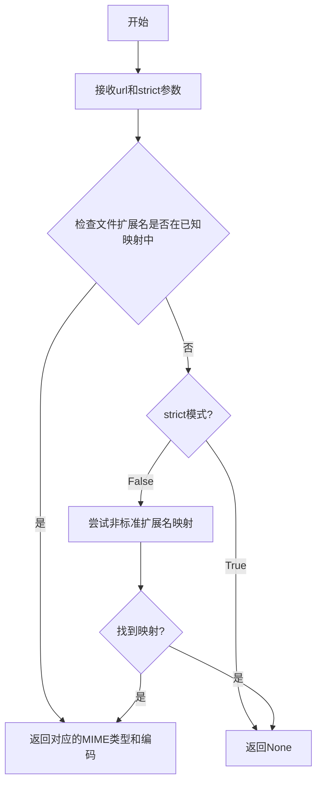

#### 带注释源码

```python
# 使用示例（来自 ApiClientTemp.prepare_post_parameters 方法）
# 根据文件名推断 MIME 类型
mimetype = mimetypes.guess_type(filename)[0] or 'application/octet-stream'

# 详细说明：
# 1. mimetypes.guess_type() 是 Python 标准库函数
# 2. 参数 filename 是要检查的文件名
# 3. 返回值是一个元组 (type, encoding)
# 4. [0] 获取第一个元素即 MIME 类型
# 5. 如果返回 None，则使用默认的 'application/octet-stream'

# 函数原型：
# mimetypes.guess_type(url, strict=True)
# 
# 参数：
#   url: str - 文件路径或 URL
#   strict: bool - 是否严格匹配（默认True）
# 
# 返回：
#   (str | None, str | None) - (MIME类型, 编码)
#
# 示例：
# >>> mimetypes.guess_type('test.txt')
# ('text/plain', None)
# >>> mimetypes.guess_type('test.gz')
# (None, 'gzip')
# >>> mimetypes.guess_type('test.unknown')
# (None, None)
```


### `dateutil.parser.parse`

该函数是 dateutil 库中的日期时间解析函数，用于将字符串解析为 Python 的 datetime 或 date 对象。在代码中被 `__deserialize_date` 和 `__deserialize_datatime` 方法调用，用于将 Kubernetes API 返回的日期时间字符串反序列化为 Python 对象。

参数：

- `string`：`str`，需要解析的日期时间字符串

返回值：`datetime`，解析后的 datetime 对象

#### 流程图

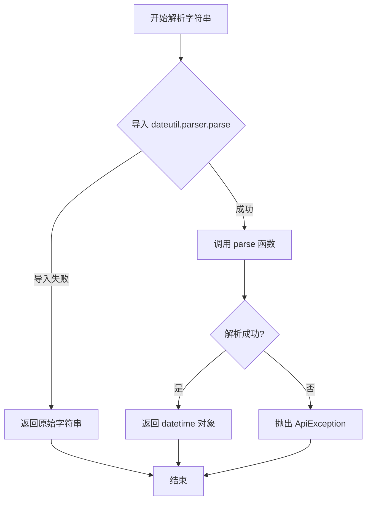

#### 带注释源码

```python
def __deserialize_datatime(self, string):
    """
    Deserializes string to datetime.

    The string should be in iso8601 datetime format.

    :param string: str.
    :return: datetime.
    """
    try:
        # 尝试导入 dateutil 库的 parser 模块
        from dateutil.parser import parse
        # 使用 parse 函数将字符串解析为 datetime 对象
        return parse(string)
    except ImportError:
        # 如果导入失败（未安装 dateutil），返回原始字符串
        return string
    except ValueError:
        # 如果解析失败，抛出 ApiException 异常
        raise ApiException(
            status=0,
            reason=(
                "Failed to parse `{0}` into a datetime object"
                    .format(string)
            )
        )
```


### `ApiClientTemp.__init__`

初始化 ApiClientTemp 实例，设置配置对象、线程池、REST 客户端、默认请求头（User-Agent）和 Cookie。

参数：

- `configuration`：`Configuration` 或 `None`，Kubernetes 客户端配置对象，如果为 `None` 则创建默认 Configuration 实例
- `header_name`：`str` 或 `None`，自定义请求头名称，用于设置默认请求头
- `header_value`：`str` 或 `None`，自定义请求头值，与 header_name 配合使用
- `cookie`：`str` 或 `None`，用于 API 请求的 Cookie 值

返回值：`None`，构造方法不返回值

#### 流程图

```mermaid
flowchart TD
    A[开始 __init__] --> B{configuration 是否为 None}
    B -->|是| C[创建新 Configuration 实例]
    B -->|否| D[使用传入的 configuration]
    C --> E[设置 self.configuration]
    D --> E
    E --> F[创建 ThreadPool 并赋值给 self.pool]
    F --> G[创建 RESTClientObject 赋值给 self.rest_client]
    G --> H[初始化空字典 self.default_headers]
    H --> I{header_name 是否为 None}
    I -->|否| J[设置 self.default_headers[header_name] = header_value]
    I -->|是| K[跳过]
    J --> L[设置 self.cookie]
    K --> L
    L --> M[设置默认 User-Agent 为 'Swagger-Codegen/6.0.0/python']
    M --> N[结束]
```

#### 带注释源码

```python
def __init__(self, configuration=None, header_name=None, header_value=None, cookie=None):
    """
    初始化 ApiClientTemp 实例。
    
    :param configuration: Kubernetes 客户端配置对象，默认为 None
    :param header_name: 自定义请求头名称，默认为 None
    :param header_value: 自定义请求头值，默认为 None
    :param cookie: Cookie 字符串，默认为 None
    """
    # 如果没有提供配置对象，则创建默认的 Configuration 实例
    if configuration is None:
        configuration = Configuration()
    self.configuration = configuration

    # 初始化线程池，用于异步 API 调用
    self.pool = ThreadPool()
    # 创建 REST 客户端对象，用于执行 HTTP 请求
    self.rest_client = RESTClientObject(configuration)
    # 初始化默认请求头字典
    self.default_headers = {}
    # 如果提供了自定义请求头名称和值，则添加到默认请求头中
    if header_name is not None:
        self.default_headers[header_name] = header_value
    # 设置 Cookie（如果有）
    self.cookie = cookie
    # 设置默认 User-Agent
    self.user_agent = 'Swagger-Codegen/6.0.0/python'
```


### `ApiClientTemp.__del__`

析构函数，在对象生命周期结束时自动调用，用于关闭线程池以释放资源。

参数：

- （无参数，仅有隐式的 `self` 参数）

返回值：`None`，无返回值，用于对象清理操作。

#### 流程图

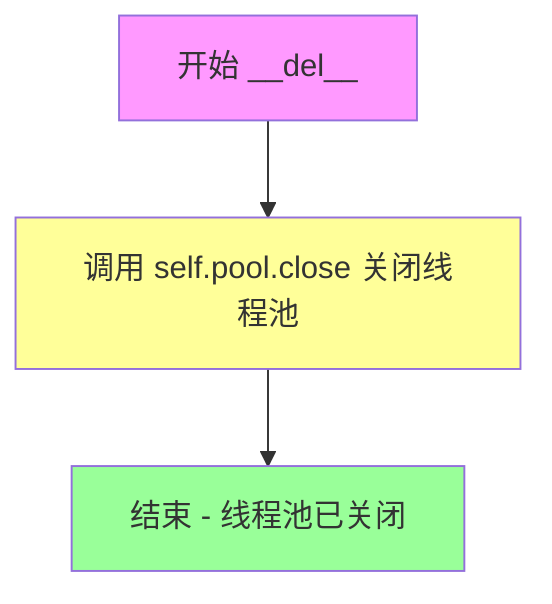

#### 带注释源码

```python
def __del__(self):
    """
    析构函数，当对象被垃圾回收时自动调用。
    用于清理资源，特别是关闭线程池以避免资源泄漏。
    """
    # 关闭线程池，停止接受新任务并关闭工作线程
    self.pool.close()
    
    # 注意：join() 方法在某些环境下会导致挂起，因此被注释掉
    # 如果取消注释，会等待所有已提交的任务完成
    # self.pool.join()
```


### `ApiClientTemp.user_agent` (getter/setter)

获取或设置 Kubernetes API 客户端的用户代理（User-Agent）头部信息，用于标识客户端请求的来源和版本。

参数：

- `value`：`str`，仅在 setter 中使用，要设置的用户代理字符串值

返回值：

- getter：`str`，返回当前设置的 User-Agent 头部值
- setter：`None`，无返回值，仅执行设置操作

#### 流程图

```mermaid
flowchart TD
    A[开始] --> B{判断是 getter 还是 setter}
    
    %% Getter 分支
    B -->|Getter| C[读取 self.default_headers['User-Agent']]
    C --> D[返回 User-Agent 字符串]
    D --> E[结束]
    
    %% Setter 分支
    B -->|Setter| F[接收 value 参数]
    F --> G[设置 self.default_headers['User-Agent'] = value]
    G --> H[结束]
```

#### 带注释源码

```python
@property
def user_agent(self):
    """
    Gets user agent.
    获取用户代理字符串。
    :return: str, 当前设置的 User-Agent 头部值
    """
    return self.default_headers['User-Agent']

@user_agent.setter
def user_agent(self, value):
    """
    Sets user agent.
    设置用户代理字符串。
    :param value: str, 要设置的 User-Agent 值
    """
    self.default_headers['User-Agent'] = value
```


### `ApiClientTemp.set_default_header`

设置默认请求头的方法，用于在发起 HTTP 请求时添加默认的 HTTP 头信息。

参数：

- `header_name`：`str`，要设置的 HTTP 头名称（如 "Authorization"、"Content-Type" 等）
- `header_value`：`str`，要设置的 HTTP 头值

返回值：`None`，无返回值，该方法直接修改实例的 `default_headers` 字典属性

#### 流程图

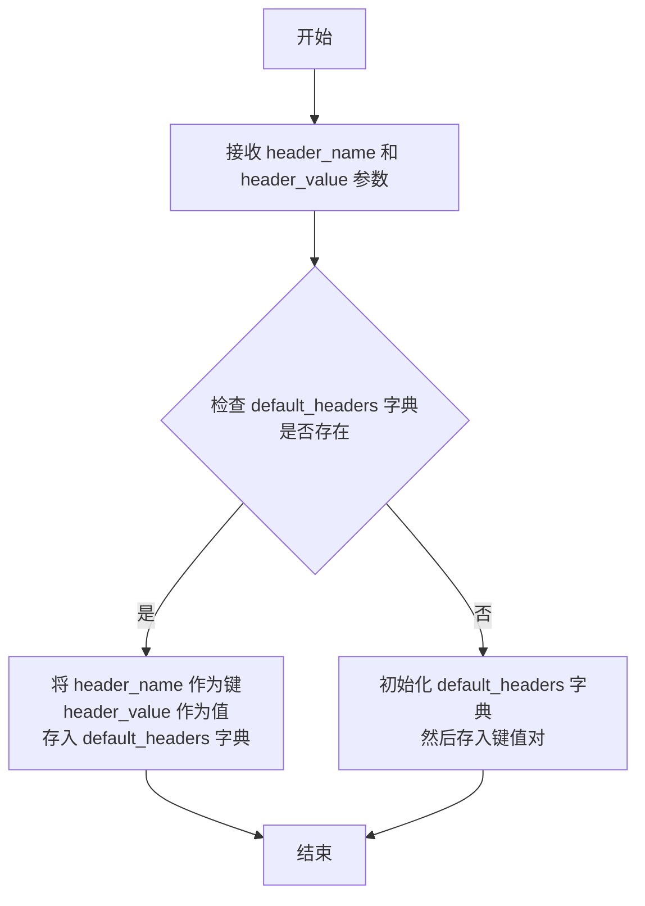

#### 带注释源码

```python
def set_default_header(self, header_name, header_value):
    """
    设置默认请求头。
    
    该方法用于向 API 客户端的默认请求头字典中添加或更新一个 HTTP 头字段。
    设置的默认头信息会在后续所有 API 调用中自动附加到请求头中。
    
    :param header_name: 要设置的 HTTP 头名称（key），如 'Authorization'、'Content-Type' 等
    :param header_value: 要设置的 HTTP 头名称对应的值（value）
    :return: None，无返回值，直接修改实例的 default_headers 属性
    """
    # 将传入的 header_name 作为字典键，header_value 作为值
    # 直接添加到 self.default_headers 字典中
    # 如果键已存在，则会覆盖原有的值
    self.default_headers[header_name] = header_value
```


### `ApiClientTemp.__call_api`

内部调用 API 的核心方法，负责处理所有 API 请求的底层逻辑，包括参数处理、URL 构造、HTTP 请求执行、响应数据反序列化等。

参数：

- `resource_path`：`str`，请求的资源路径
- `method`：`str`，HTTP 方法（如 GET、POST 等）
- `path_params`：`dict`，URL 路径参数
- `query_params`：`dict`，URL 查询参数
- `header_params`：`dict`，HTTP 请求头参数
- `body`：`object`，请求体数据
- `post_params`：`dict`，POST 表单参数
- `files`：`dict`，文件上传参数
- `response_type`：`str`，响应数据类型
- `auth_settings`：`list`，认证设置名称列表
- `_return_http_data_only`：`bool`，是否仅返回数据（不含状态码和响应头）
- `collection_formats`：`dict`，参数集合格式
- `_preload_content`：`bool`，是否预加载响应内容
- `_request_timeout`：`int/tuple`，请求超时设置

返回值：`tuple`，当 `_return_http_data_only` 为 `True` 时返回 `(return_data)`；否则返回 `(return_data, response_data.status, response_data.getheaders())`

#### 流程图

```mermaid
flowchart TD
    A[开始 __call_api] --> B[获取 configuration]
    B --> C[处理 header_params<br/>合并默认请求头和 Cookie]
    C --> D[处理 path_params<br/>序列化并替换 URL 中的占位符]
    D --> E[处理 query_params<br/>序列化并转换为元组列表]
    E --> F[处理 post_params 和 files<br/>准备表单参数]
    F --> G[更新认证参数<br/>调用 update_params_for_auth]
    G --> H[序列化请求体 body]
    H --> I[构造完整请求 URL<br/>config.host + resource_path]
    I --> J[调用 request 方法执行 HTTP 请求]
    J --> K{_preload_content?}
    K -->|True| L[反序列化响应数据<br/>deserialize]
    K -->|False| M[设置 return_data 为 None]
    L --> N{_return_http_data_only?}
    M --> N
    N -->|True| O[返回 return_data]
    N -->|False| P[返回 (return_data, status, headers)]
    O --> Q[结束]
    P --> Q
```

#### 带注释源码

```python
def __call_api(self, resource_path, method,
               path_params=None, query_params=None, header_params=None,
               body=None, post_params=None, files=None,
               response_type=None, auth_settings=None,
               _return_http_data_only=None, collection_formats=None, _preload_content=True,
               _request_timeout=None):
    """
    内部 API 调用核心方法，处理所有 HTTP 请求的底层逻辑
    
    参数:
        resource_path: API 端点路径
        method: HTTP 方法 (GET, POST, PUT, DELETE, etc.)
        path_params: URL 路径参数
        query_params: URL 查询参数
        header_params: 请求头参数
        body: 请求体数据
        post_params: POST 表单参数
        files: 上传文件参数
        response_type: 响应数据类型，用于反序列化
        auth_settings: 认证设置列表
        _return_http_data_only: 是否仅返回数据部分
        collection_formats: 集合参数格式
        _preload_content: 是否预加载响应内容
        _request_timeout: 请求超时时间
    """
    
    # 获取配置对象
    config = self.configuration

    # ====== 1. 处理请求头参数 ======
    header_params = header_params or {}
    # 合并默认请求头（如 User-Agent）
    header_params.update(self.default_headers)
    # 添加 Cookie（如果存在）
    if self.cookie:
        header_params['Cookie'] = self.cookie
    # 序列化请求头并转换为元组列表
    if header_params:
        header_params = self.sanitize_for_serialization(header_params)
        header_params = dict(self.parameters_to_tuples(header_params,
                                                       collection_formats))

    # ====== 2. 处理路径参数 ======
    if path_params:
        # 序列化路径参数
        path_params = self.sanitize_for_serialization(path_params)
        path_params = self.parameters_to_tuples(path_params,
                                                collection_formats)
        # 替换 URL 中的占位符 {k} 为实际值
        for k, v in path_params:
            # 使用安全的字符集编码
            resource_path = resource_path.replace(
                '{%s}' % k, quote(str(v), safe=config.safe_chars_for_path_param))

    # ====== 3. 处理查询参数 ======
    if query_params:
        # 序列化查询参数
        query_params = self.sanitize_for_serialization(query_params)
        # 转换为元组列表
        query_params = self.parameters_to_tuples(query_params,
                                                 collection_formats)

    # ====== 4. 处理 POST 参数和文件 ======
    if post_params or files:
        # 准备 POST 参数（包含文件上传）
        post_params = self.prepare_post_parameters(post_params, files)
        # 序列化参数
        post_params = self.sanitize_for_serialization(post_params)
        # 转换为元组列表
        post_params = self.parameters_to_tuples(post_params,
                                                collection_formats)

    # ====== 5. 处理认证设置 ======
    # 根据认证设置更新请求头和查询参数
    self.update_params_for_auth(header_params, query_params, auth_settings)

    # ====== 6. 处理请求体 ======
    if body:
        # 序列化为 JSON 格式
        body = self.sanitize_for_serialization(body)

    # ====== 7. 构造请求 URL ======
    # 完整 URL = 主机地址 + 资源路径
    url = self.configuration.host + resource_path

    # ====== 8. 执行 HTTP 请求 ======
    # 调用 request 方法执行实际的 HTTP 请求
    response_data = self.request(method, url,
                                 query_params=query_params,
                                 headers=header_params,
                                 post_params=post_params, body=body,
                                 _preload_content=_preload_content,
                                 _request_timeout=_request_timeout)

    # 保存最后响应对象供后续使用
    self.last_response = response_data

    # ====== 9. 处理响应数据 ======
    return_data = response_data
    if _preload_content:
        # 如果需要预加载内容，进行反序列化
        if response_type:
            # 根据 response_type 反序列化响应数据
            return_data = self.deserialize(response_data, response_type)
        else:
            return_data = None

    # ====== 10. 返回结果 ======
    if _return_http_data_only:
        # 仅返回数据部分
        return (return_data)
    else:
        # 返回 (数据, 状态码, 响应头) 元组
        return (return_data, response_data.status, response_data.getheaders())
```


### `ApiClientTemp.sanitize_for_serialization`

该方法用于将传入的对象序列化为适合JSON请求的格式。它递归处理各种数据类型（包括None、原始类型、列表、元组、日期时间、字典和Swagger模型），将其转换为可序列化的字典格式，用于构建HTTP请求的请求体或参数。

参数：

- `obj`：`任意类型`，要序列化的数据，可以是None、原始类型（str、int、float、bool、bytes）、列表、元组、日期时间、字典或Swagger模型对象

返回值：`任意类型`，返回序列化后的数据形式。如果是None返回None，原始类型直接返回，列表/元组返回相应类型的序列化结果，日期时间返回ISO 8601格式字符串，字典返回递归序列化后的字典

#### 流程图

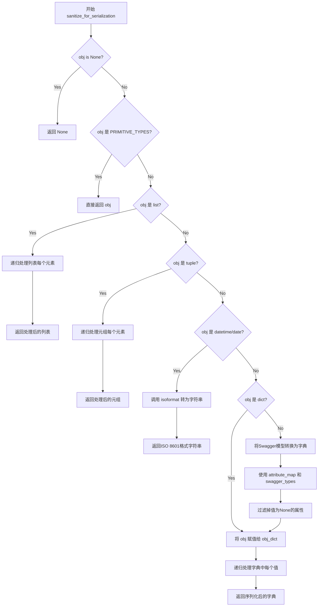

#### 带注释源码

```python
def sanitize_for_serialization(self, obj):
    """
    Builds a JSON POST object.

    If obj is None, return None.
    If obj is str, int, long, float, bool, return directly.
    If obj is datetime.datetime, datetime.date
        convert to string in iso8601 format.
    If obj is list, sanitize each element in the list.
    If obj is dict, return the dict.
    If obj is swagger model, return the properties dict.

    :param obj: The data to serialize.
    :return: The serialized form of data.
    """
    # 处理None值，直接返回None
    if obj is None:
        return None
    # 处理原始类型（float, bool, bytes, str, int, long），直接返回
    elif isinstance(obj, self.PRIMITIVE_TYPES):
        return obj
    # 处理列表类型，递归序列化每个子元素
    elif isinstance(obj, list):
        return [self.sanitize_for_serialization(sub_obj)
                for sub_obj in obj]
    # 处理元组类型，递归序列化每个子元素并转为元组
    elif isinstance(obj, tuple):
        return tuple(self.sanitize_for_serialization(sub_obj)
                     for sub_obj in obj)
    # 处理日期时间类型，转换为ISO 8601格式字符串
    elif isinstance(obj, (datetime, date)):
        return obj.isoformat()

    # 如果是字典类型，直接使用
    if isinstance(obj, dict):
        obj_dict = obj
    else:
        # 将Swagger模型对象转换为字典
        # 排除 swagger_types, attribute_map 属性
        # 排除值为None的属性
        # 将属性名转换为JSON键（使用attribute_map映射）
        obj_dict = {obj.attribute_map[attr]: getattr(obj, attr)
                    for attr, _ in iteritems(obj.swagger_types)
                    if getattr(obj, attr) is not None}

    # 递归处理字典中的每个值，返回序列化后的字典
    return {key: self.sanitize_for_serialization(val)
            for key, val in iteritems(obj_dict)}
```


### ApiClientTemp.deserialize

反序列化响应数据，将 RESTResponse 对象转换为 Python 对象。

参数：

- `self`：隐式参数，ApiClientTemp 实例本身
- `response`：`RESTResponse` 对象，要反序列化的响应
- `response_type`：字符串或类字面量，反序列化对象的类型

返回值：`object`，反序列化后的对象

#### 流程图

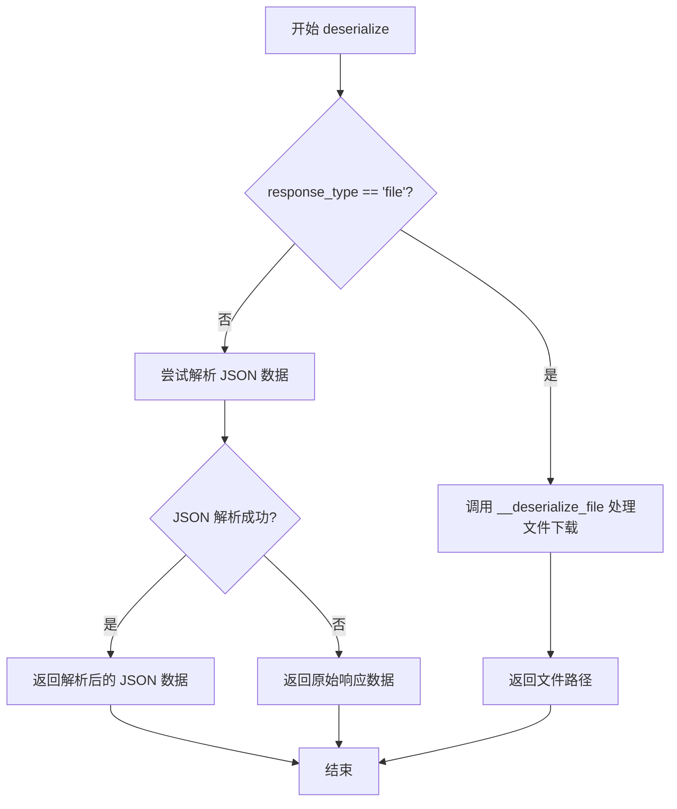

#### 带注释源码

```python
def deserialize(self, response, response_type):
    """
    反序列化响应为对象。

    :param response: RESTResponse 对象，要被反序列化。
    :param response_type: 反序列化对象的类字面量，或类名字符串。

    :return: 反序列化后的对象。
    """
    # 处理文件下载场景
    # 将响应体保存到临时文件并返回实例
    if response_type == "file":
        return self.__deserialize_file(response)

    # 从响应对象获取数据
    try:
        # 尝试将响应数据解析为 JSON
        data = json.loads(response.data)
    except ValueError:
        # JSON 解析失败时，返回原始响应数据
        data = response.data

    return data
    # 注释掉的部分：原本完整的反序列化实现
    # return self.__deserialize(data, response_type)
```


### `ApiClientTemp.__deserialize`

该方法是 `ApiClientTemp` 类的内部私有方法，负责将字典、列表、字符串等原始数据反序列化为 Python 对象（可以是原生类型、日期时间对象或自定义模型实例）。它是整个反序列化流程的核心逻辑，根据传入的 `klass` 类型选择相应的反序列化策略。

参数：

- `data`：任意类型，需要反序列化的数据（dict、list、str 或其他）
- `klass`：class literal 或 string，目标类类型（类字面量或类名字符串，如 "list[V1ClusterRoleBinding]"）

返回值：任意类型，反序列化后的 Python 对象

#### 流程图

```mermaid
flowchart TD
    A[__deserialize 开始] --> B{data 是否为 None}
    B -->|是| C[返回 None]
    B -->|否| D{klass 是否为字符串}
    
    D -->|是| E{klass 是否以 'list[' 开头}
    E -->|是| F[提取子类型 sub_kls]
    F --> G[递归反序列化列表每个元素]
    G --> H[返回反序列化后的列表]
    
    E -->|否| I{klass 是否以 'dict(' 开头}
    I -->|是| J[提取值类型 sub_kls]
    J --> K[遍历字典, 递归反序列化每个值]
    K --> L[返回反序列化后的字典]
    
    I -->|否| M{klass 在 NATIVE_TYPES_MAPPING 中}
    M -->|是| N[转换为对应原生类型]
    M -->|否| O[从 models 模块获取类]
    N --> P
    O --> P
    
    D -->|否| P{klass 类型判断}
    P -->|在 PRIMITIVE_TYPES 中| Q[调用 __deserialize_primitive]
    Q --> R[返回原始类型值]
    
    P -->|等于 object| S[调用 __deserialize_object]
    S --> T[返回原始值]
    
    P -->|等于 date| U[调用 __deserialize_date]
    U --> V[返回 date 对象]
    
    P -->|等于 datetime| W[调用 __deserialize_datatime]
    W --> X[返回 datetime 对象]
    
    P -->|其他情况| Y[调用 __deserialize_model]
    Y --> Z[返回模型对象]
    
    H --> AA[结束]
    L --> AA
    R --> AA
    T --> AA
    V --> AA
    X --> AA
    Z --> AA
    C --> AA
```

#### 带注释源码

```python
def __deserialize(self, data, klass):
    """
    反序列化方法：将字典、列表、字符串反序列化为对象
    
    :param data: dict, list or str. 需要反序列化的原始数据
    :param klass: class literal, or string of class name. 目标类类型
    :return: object. 反序列化后的对象
    """
    # 如果数据为空，直接返回 None
    if data is None:
        return None

    # 如果 klass 是字符串类型（类名字符串）
    if type(klass) == str:
        # 处理列表类型，例如 "list[V1ClusterRoleBinding]"
        if klass.startswith('list['):
            # 使用正则表达式提取列表元素的类型
            sub_kls = re.match('list\[(.*)\]', klass).group(1)
            # 递归反序列化列表中的每个元素
            return [self.__deserialize(sub_data, sub_kls)
                    for sub_data in data]

        # 处理字典类型，例如 "dict(str, V1ClusterRole)"
        if klass.startswith('dict('):
            # 提取字典值的类型
            sub_kls = re.match('dict\(([^,]*), (.*)\)', klass).group(2)
            # 遍历字典，递归反序列化每个值
            return {k: self.__deserialize(v, sub_kls)
                    for k, v in iteritems(data)}

        # 将字符串类名转换为实际类对象
        # 首先检查是否是原生类型映射中的类型
        if klass in self.NATIVE_TYPES_MAPPING:
            klass = self.NATIVE_TYPES_MAPPING[klass]
        else:
            # 从 kubernetes.client.models 模块获取类
            klass = getattr(models, klass)

    # 根据 klass 类型选择相应的反序列化策略
    # 1. 原生原始类型（int, float, bool, str, bytes）
    if klass in self.PRIMITIVE_TYPES:
        return self.__deserialize_primitive(data, klass)
    # 2. 通用对象类型
    elif klass == object:
        return self.__deserialize_object(data)
    # 3. 日期类型
    elif klass == date:
        return self.__deserialize_date(data)
    # 4. 日期时间类型
    elif klass == datetime:
        return self.__deserialize_datatime(data)
    # 5. 自定义模型类型
    else:
        return self.__deserialize_model(data, klass)
```


### ApiClientTemp.call_api

该方法是 Kubernetes API 客户端的公共调用入口，支持同步和异步两种请求模式，负责组装请求参数、调用内部私有方法执行 HTTP 请求，并对响应数据进行反序列化处理后返回。

参数：

- `resource_path`：`str`，请求的资源路径，例如 `/apis/rbac.authorization.k8s.io/v1/clusterrolebindings`
- `method`：`str`，HTTP 方法，支持 GET、POST、PUT、PATCH、DELETE、HEAD、OPTIONS
- `path_params`：`dict`，路径参数，用于替换 URL 中的占位符
- `query_params`：`dict`，查询参数，附加在 URL 后的键值对
- `header_params`：`dict`，请求头参数，如 Content-Type、Accept 等
- `body`：`any`，请求体数据，用于 POST/PUT/PATCH 请求
- `post_params`：`dict`，表单提交参数，用于 application/x-www-form-urlencoded 或 multipart/form-data
- `files`：`dict`，文件参数，键为字段名，值为文件路径列表
- `response_type`：`str`，期望的响应数据类型，用于反序列化
- `auth_settings`：`list`，认证设置名称列表
- `async_req`：`bool`，是否异步执行请求，True 为异步，False 为同步
- `_return_http_data_only`：`bool`，是否仅返回响应数据，不包含状态码和响应头
- `collection_formats`：`dict`，集合参数格式，如 {'ids': 'csv', 'tags': 'multi'}
- `_preload_content`：`bool`，是否预加载响应内容，默认 True
- `_request_timeout`：`int` 或 `tuple`，请求超时设置，可以是单个值或 (连接超时, 读取超时) 元组

返回值：根据 `async_req` 参数而定。若 `async_req` 为 False（同步模式），返回反序列化后的数据（当 `_return_http_data_only` 为 True 时）或返回 (数据, 状态码, 响应头) 元组（当 `_return_http_data_only` 为 False 时）。若 `async_req` 为 True（异步模式），返回 `ThreadPool.apply_async` 的线程对象。

#### 流程图

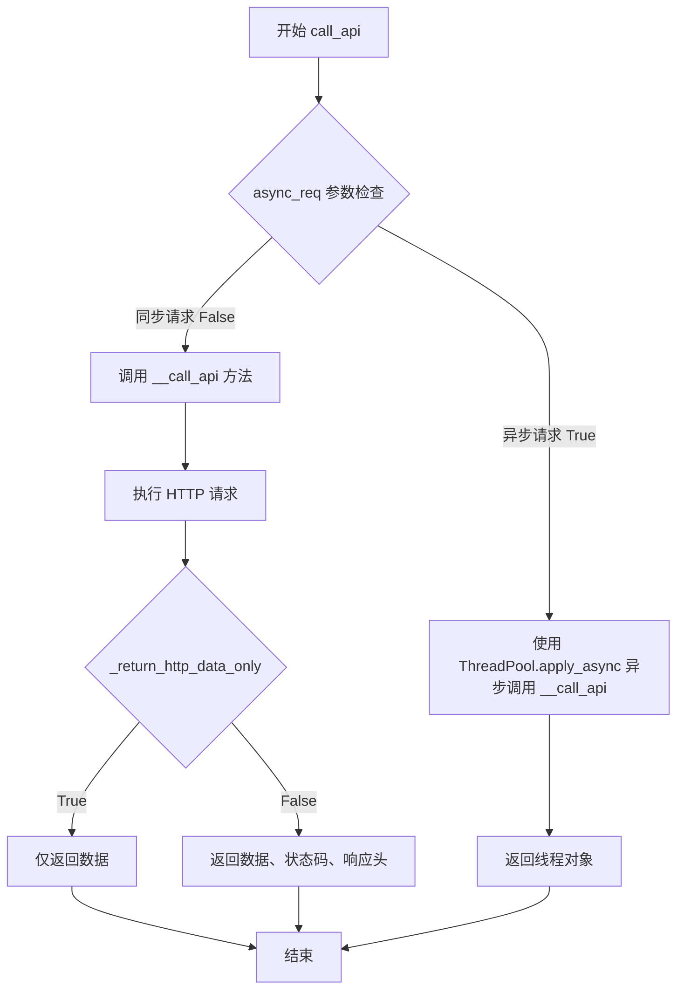

#### 带注释源码

```python
def call_api(self, resource_path, method,
             path_params=None, query_params=None, header_params=None,
             body=None, post_params=None, files=None,
             response_type=None, auth_settings=None, async_req=None,
             _return_http_data_only=None, collection_formats=None, _preload_content=True,
             _request_timeout=None):
    """
    Makes the HTTP request (synchronous) and return the deserialized data.
    To make an async_req request, set the async_req parameter.

    :param resource_path: Path to method endpoint.
    :param method: Method to call.
    :param path_params: Path parameters in the url.
    :param query_params: Query parameters in the url.
    :param header_params: Header parameters to be
        placed in the request header.
    :param body: Request body.
    :param post_params dict: Request post form parameters,
        for `application/x-www-form-urlencoded`, `multipart/form-data`.
    :param auth_settings list: Auth Settings names for the request.
    :param response: Response data type.
    :param files dict: key -> filename, value -> filepath,
        for `multipart/form-data`.
    :param async_req bool: execute request asynchronously
    :param _return_http_data_only: response data without head status code and headers
    :param collection_formats: dict of collection formats for path, query,
        header, and post parameters.
    :param _preload_content: if False, the urllib3.HTTPResponse object will be returned without
                             reading/decoding response data. Default is True.
    :param _request_timeout: timeout setting for this request. If one number provided, it will be total request
                             timeout. It can also be a pair (tuple) of (connection, read) timeouts.
    :return:
        If async_req parameter is True,
        the request will be called asynchronously.
        The method will return the request thread.
        If parameter async_req is False or missing,
        then the method will return the response directly.
    """
    # 同步模式：直接调用私有方法 __call_api 执行请求
    if not async_req:
        return self.__call_api(resource_path, method,
                               path_params, query_params, header_params,
                               body, post_params, files,
                               response_type, auth_settings,
                               _return_http_data_only, collection_formats, _preload_content, _request_timeout)
    else:
        # 异步模式：使用线程池异步执行请求
        thread = self.pool.apply_async(self.__call_api, (resource_path, method,
                                                         path_params, query_params,
                                                         header_params, body,
                                                         post_params, files,
                                                         response_type, auth_settings,
                                                         _return_http_data_only,
                                                         collection_formats, _preload_content, _request_timeout))
    return thread
```


### ApiClientTemp.request

该方法是 `ApiClientTemp` 类的核心 HTTP 请求方法，负责通过 RESTClient 发起各种 HTTP 请求（GET、POST、PUT、PATCH、DELETE、HEAD、OPTIONS），并根据请求方法类型调用相应的 REST 客户端方法返回响应数据。

参数：

- `self`：`ApiClientTemp`，隐式参数，当前类的实例
- `method`：`str`，HTTP 请求方法，支持 GET、HEAD、OPTIONS、POST、PATCH、PUT、DELETE
- `url`：`str`，请求的目标 URL 地址
- `query_params`：`dict`，可选，URL 查询参数，默认为 None
- `headers`：`dict`，可选，请求头信息，默认为 None
- `post_params`：`dict`，可选，POST 表单参数，默认为 None
- `body`：`any`，可选，请求体数据，默认为 None
- `_preload_content`：`bool`，可选，是否预加载响应内容，默认为 True
- `_request_timeout`：`int/tuple`，可选，请求超时时间设置，可以是单个数值或 (连接超时, 读取超时) 元组，默认为 None

返回值：`RESTClientObject`，返回 REST 客户端的响应对象，具体类型取决于 HTTP 方法和 _preload_content 参数的设置

#### 流程图

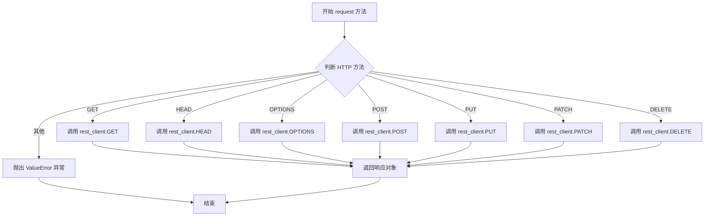

#### 带注释源码

```python
def request(self, method, url, query_params=None, headers=None,
            post_params=None, body=None, _preload_content=True, _request_timeout=None):
    """
    Makes the HTTP request using RESTClient.
    
    该方法是 HTTP 请求的入口点，根据不同的 HTTP 方法调用 RESTClientObject
    的相应方法。RESTClientObject 是底层 urllib3 的封装，负责实际的网络请求。
    
    参数:
        method: HTTP 方法字符串，如 'GET', 'POST', 'PUT', 'DELETE' 等
        url: 完整的请求 URL，通常由 configuration.host + resource_path 组成
        query_params: URL 查询参数，以字典形式传递，会被编码到 URL 中
        headers: HTTP 请求头字典
        post_params: POST 请求的表单参数
        body: 请求体数据，通常用于 POST/PUT/PATCH 请求的 JSON 数据
        _preload_content: 布尔值，控制是否立即读取响应内容。
                          若为 True（默认），响应数据会被立即下载；
                          若为 False，返回原始 urllib3.HTTPResponse 对象
        _request_timeout: 请求超时设置。可以是单个数字（总超时），
                         也可以是 (连接超时, 读取超时) 元组
    
    返回:
        RESTClientObject: 根据 HTTP 方法和 _preload_content 返回不同的响应对象
    """
    # 根据 HTTP 方法类型分发到不同的 REST 客户端方法
    if method == "GET":
        # GET 请求用于获取资源
        # query_params: 查询字符串参数
        # _preload_content: 是否预加载响应内容
        # _request_timeout: 超时设置
        # headers: 请求头
        return self.rest_client.GET(url,
                                    query_params=query_params,
                                    _preload_content=_preload_content,
                                    _request_timeout=_request_timeout,
                                    headers=headers)
    elif method == "HEAD":
        # HEAD 请求类似于 GET，但只返回响应头，不返回响应体
        return self.rest_client.HEAD(url,
                                     query_params=query_params,
                                     _preload_content=_preload_content,
                                     _request_timeout=_request_timeout,
                                     headers=headers)
    elif method == "OPTIONS":
        # OPTIONS 请求用于获取服务器支持的 HTTP 方法
        # 支持在请求体中传递参数
        return self.rest_client.OPTIONS(url,
                                        query_params=query_params,
                                        headers=headers,
                                        post_params=post_params,
                                        _preload_content=_preload_content,
                                        _request_timeout=_request_timeout,
                                        body=body)
    elif method == "POST":
        # POST 请求用于创建资源
        # post_params: 表单参数
        # body: 请求体数据
        return self.rest_client.POST(url,
                                     query_params=query_params,
                                     headers=headers,
                                     post_params=post_params,
                                     _preload_content=_preload_content,
                                     _request_timeout=_request_timeout,
                                     body=body)
    elif method == "PUT":
        # PUT 请求用于完整替换资源
        return self.rest_client.PUT(url,
                                    query_params=query_params,
                                    headers=headers,
                                    post_params=post_params,
                                    _preload_content=_preload_content,
                                    _request_timeout=_request_timeout,
                                    body=body)
    elif method == "PATCH":
        # PATCH 请求用于部分更新资源
        return self.rest_client.PATCH(url,
                                      query_params=query_params,
                                      headers=headers,
                                      post_params=post_params,
                                      _preload_content=_preload_content,
                                      _request_timeout=_request_timeout,
                                      body=body)
    elif method == "DELETE":
        # DELETE 请求用于删除资源
        # DELETE 请求也可以有请求体（在 HTTP 规范中是允许的）
        return self.rest_client.DELETE(url,
                                       query_params=query_params,
                                       _preload_content=_preload_content,
                                       _request_timeout=_request_timeout,
                                       body=body)
    else:
        # 如果传入不支持的 HTTP 方法，抛出 ValueError 异常
        raise ValueError(
            "http method must be `GET`, `HEAD`, `OPTIONS`,"
            " `POST`, `PATCH`, `PUT` or `DELETE`."
        )
```


### `ApiClientTemp.parameters_to_tuples`

将输入的参数字典或列表转换为键值对元组列表，并根据提供的格式化规则对集合类型（如列表）的值进行特定格式（如 CSV、SSV、Multi）处理。

参数：
- `params`：`dict` 或 `list`，需要转换的参数，支持字典形式或键值对列表形式。
- `collection_formats`：`dict`，参数格式化规则字典，键为参数名，值为格式化类型字符串（如 'multi', 'csv', 'ssv', 'tsv', 'pipes'）。

返回值：`list`，返回处理后的键值对元组列表 `[(key1, value1), (key2, value2), ...]`。

#### 流程图

```mermaid
graph TD
    A([开始]) --> B{collection_formats is None?}
    B -- 是 --> C[collection_formats = {}]
    B -- 否 --> D[使用传入的 collection_formats]
    C --> E[遍历 params]
    D --> E
    E --> F{遍历每一对 k, v}
    F --> G{k in collection_formats?}
    G -- 是 --> H[获取 collection_format]
    H --> I{collection_format == 'multi'?}
    I -- 是 --> J[遍历 v 中每个 value<br/>new_params.extend((k, value))]
    I -- 否 --> K{判断分隔符}
    K -->|ssv| L[delimiter = ' ']
    K -->|tsv| M[delimiter = '\t']
    K -->|pipes| N[delimiter = '|']
    K -->|其他/CSV| O[delimiter = ',']
    L --> P[v 转换为字符串并用 delimiter 连接]
    M --> P
    N --> P
    O --> P
    P --> Q[new_params.append((k, 连接后的字符串))]
    G -- 否 --> R[new_params.append((k, v))]
    J --> S{遍历结束?}
    Q --> S
    R --> S
    S -- 是 --> T([返回 new_params])
    S -- 否 --> F
```

#### 带注释源码

```python
def parameters_to_tuples(self, params, collection_formats):
    """
    Get parameters as list of tuples, formatting collections.

    :param params: Parameters as dict or list of two-tuples
    :param dict collection_formats: Parameter collection formats
    :return: Parameters as list of tuples, collections formatted
    """
    new_params = []
    # 如果未提供格式化规则，初始化为空字典
    if collection_formats is None:
        collection_formats = {}
    
    # 遍历参数，支持字典或列表输入
    for k, v in iteritems(params) if isinstance(params, dict) else params:
        # 检查当前参数是否需要特殊格式化
        if k in collection_formats:
            collection_format = collection_formats[k]
            
            # 如果是 'multi' 格式，则展开为多个键值对
            if collection_format == 'multi':
                new_params.extend((k, value) for value in v)
            else:
                # 根据格式类型选择分隔符
                if collection_format == 'ssv':
                    delimiter = ' '
                elif collection_format == 'tsv':
                    delimiter = '\t'
                elif collection_format == 'pipes':
                    delimiter = '|'
                else:  # csv is the default
                    delimiter = ','
                
                # 将集合类型的值转换为字符串并用分隔符连接
                new_params.append(
                    (k, delimiter.join(str(value) for value in v)))
        else:
            # 常规参数直接追加
            new_params.append((k, v))
    return new_params
```


### `ApiClientTemp.prepare_post_parameters`

该方法用于构建 HTTP POST 请求所需的表单参数。它将普通的表单键值对 (`post_params`) 与待上传文件的信息 (`files`) 合并，并按照 REST API 要求的格式（文件名、二进制内容、MIME 类型）组织成元组列表，以便后续发送给 Kubernetes API。

参数：

-  `post_params`：字典或列表，普通表单参数（用于 `application/x-www-form-urlencoded`）。
-  `files`：字典，文件参数（键为字段名，值为文件路径列表或单个路径），用于 `multipart/form-data`。

返回值：`list`，返回整合后的表单参数列表。每个元素通常为 `(key, value)` 元组，其中 value 对于文件上传为 `(filename, filedata, mimetype)` 的嵌套元组。

#### 流程图

```mermaid
graph TD
    A([开始 prepare_post_parameters]) --> B[初始化空列表 params]
    B --> C{post_params 是否存在?}
    C -- 是 --> D[将 post_params 赋值给 params]
    C -- 否 --> E{files 是否存在?}
    D --> E
    E -- 否 --> F[返回 params]
    E -- 是 --> G[遍历 files 字典]
    G --> H{文件路径 v 是否为空?}
    H -- 是 --> G
    H -- 否 --> I[规范化文件名为列表]
    I --> J[遍历每个文件名 n]
    J --> K[打开文件 n, 读取二进制数据 filedata]
    K --> L[获取文件名 filename 和 MIME 类型 mimetype]
    L --> M[组装参数: params.append<br>(k, tuple([filename, filedata, mimetype]))]
    M --> J
    J --> G
    G --> F
    F --> Z([结束])
```

#### 带注释源码

```python
def prepare_post_parameters(self, post_params=None, files=None):
    """
    Builds form parameters.

    :param post_params: Normal form parameters.
    :param files: File parameters.
    :return: Form parameters with files.
    """
    # 初始化参数列表
    params = []

    # 1. 处理普通表单参数
    if post_params:
        params = post_params

    # 2. 处理文件上传参数
    if files:
        # 遍历文件字典 (k: 字段名, v: 文件路径)
        for k, v in iteritems(files):
            # 如果文件路径为空，则跳过
            if not v:
                continue
            # 支持单个文件路径或文件路径列表
            file_names = v if type(v) is list else [v]
            # 遍历每一个文件
            for n in file_names:
                # 以二进制只读模式打开文件
                with open(n, 'rb') as f:
                    # 获取文件名（不含路径）
                    filename = os.path.basename(f.name)
                    # 读取文件的二进制内容
                    filedata = f.read()
                    # 猜测文件的 MIME 类型，若猜测失败则使用默认流类型
                    mimetype = mimetypes.guess_type(filename)[0] or 'application/octet-stream'
                    # 将文件参数添加到列表中
                    # 格式: (字段名, (文件名, 文件二进制内容, MIME类型))
                    params.append(tuple([k, tuple([filename, filedata, mimetype])]))

    return params
```


### `ApiClientTemp.select_header_accept`

该方法用于根据客户端支持的 Accept 头列表，选择最合适的 HTTP Accept 头部值，优先选择 `application/json`，以确保 API 响应能够返回 JSON 格式数据。

参数：

- `accepts`：`List[str]`，客户端支持的 Accept 头列表（如 `['application/json', 'application/xml']`）

返回值：`Optional[str]`，返回选中的 Accept 头字符串，如果输入为空则返回 `None`

#### 流程图

```mermaid
flowchart TD
    A[开始 select_header_accept] --> B{accepts 是否为空?}
    B -->|是| C[返回 None]
    B -->|否| D[将 accepts 中所有元素转换为小写]
    D --> E{是否存在 'application/json'?}
    E -->|是| F[返回 'application/json']
    E -->|否| G[返回 ', '.join(accepts)]
    F --> H[结束]
    G --> H
    C --> H
```

#### 带注释源码

```python
def select_header_accept(self, accepts):
    """
    根据提供的 Accept 头列表，返回最合适的 Accept 头值。
    优先选择 'application/json'，以确保返回 JSON 格式数据。

    :param accepts: List[str]，客户端支持的 Accept 头列表
    :return: Optional[str]，选中的 Accept 头，如果输入为空则返回 None
    """
    # 如果 accepts 为空或 None，直接返回 None
    if not accepts:
        return

    # 将所有 Accept 头转换为小写，以便进行不区分大小写的比较
    accepts = [x.lower() for x in accepts]

    # 如果列表中包含 'application/json'，优先返回该类型
    if 'application/json' in accepts:
        return 'application/json'
    # 否则返回所有 Accept 头的逗号分隔字符串
    else:
        return ', '.join(accepts)
```


### `ApiClientTemp.select_header_content_type`

该方法用于根据提供的可用内容类型列表选择最合适的 Content-Type 头。它优先返回 `application/json`，如果列表中没有 JSON 或通配符，则返回列表中的第一个内容类型。

参数：

- `content_types`：`list`，可用内容类型的列表（如 `['application/json', 'application/xml']`）

返回值：`str`，选中的 Content-Type 值（例如 `application/json`）

#### 流程图

```mermaid
flowchart TD
    A[开始] --> B{content_types 是否为空}
    B -->|是| C[返回 'application/json']
    B -->|否| D[将 content_types 转换为小写]
    D --> E{列表中包含 'application/json' 或 '*/*'?}
    E -->|是| C
    E -->|否| F[返回 content_types[0]]
    C --> G[结束]
    F --> G
```

#### 带注释源码

```python
def select_header_content_type(self, content_types):
    """
    Returns `Content-Type` based on an array of content_types provided.

    :param content_types: List of content-types.
    :return: Content-Type (e.g. application/json).
    """
    # 如果没有提供内容类型列表，默认返回 application/json
    if not content_types:
        return 'application/json'

    # 将所有内容类型转换为小写，实现大小写不敏感匹配
    content_types = [x.lower() for x in content_types]

    # 优先选择 application/json，如果列表中包含 JSON 类型或通配符 */*
    if 'application/json' in content_types or '*/*' in content_types:
        return 'application/json'
    else:
        # 如果没有 JSON 或通配符，返回列表中的第一个内容类型
        return content_types[0]
```


### ApiClientTemp.update_params_for_auth

该方法用于根据认证设置更新HTTP请求的头部参数和查询参数，根据认证配置将认证令牌添加到请求头或查询参数中。

参数：

- `self`：ApiClientTemp 实例本身（隐式参数）
- `headers`：`dict`，头部参数字典，用于存储更新后的HTTP头部信息
- `querys`：`list`，查询参数元组列表，用于追加认证查询参数
- `auth_settings`：`list`，认证设置标识符列表，指定需要应用的认证方式

返回值：`None`，该方法直接修改传入的 headers 和 querys 字典/列表，不返回任何值

#### 流程图

```mermaid
flowchart TD
    A[开始 update_params_for_auth] --> B{auth_settings 是否为空?}
    B -->|是| C[直接返回]
    B -->|否| D[遍历 auth_settings]
    D --> E[获取当前 auth 的认证设置]
    E --> F{认证设置是否存在?}
    F -->|否| D
    F -->|是| G{认证值是否为空?}
    G -->|是| D
    G -->|否| H{认证位置在哪里?}
    H -->|header| I[将认证密钥和值加入 headers 字典]
    H -->|query| J[将认证密钥和值作为元组加入 querys 列表]
    H -->|其他| K[抛出 ValueError 异常]
    I --> D
    J --> D
    K --> L[结束]
    D --> M{遍历完成?}
    M -->|否| D
    M -->|是| C
```

#### 带注释源码

```python
def update_params_for_auth(self, headers, querys, auth_settings):
    """
    Updates header and query params based on authentication setting.

    :param headers: Header parameters dict to be updated.
    :param querys: Query parameters tuple list to be updated.
    :param auth_settings: Authentication setting identifiers list.
    """
    # 如果没有认证设置，直接返回，不进行任何操作
    if not auth_settings:
        return

    # 遍历所有需要应用的认证设置
    for auth in auth_settings:
        # 从配置中获取当前认证方式的具体设置
        auth_setting = self.configuration.auth_settings().get(auth)
        
        # 如果成功获取到认证设置
        if auth_setting:
            # 如果认证值为空，跳过当前认证设置
            if not auth_setting['value']:
                continue
            # 根据认证设置的位置（header 或 query）进行相应处理
            elif auth_setting['in'] == 'header':
                # 将认证信息添加到头部参数字典中
                headers[auth_setting['key']] = auth_setting['value']
            elif auth_setting['in'] == 'query':
                # 将认证信息作为元组追加到查询参数列表中
                querys.append((auth_setting['key'], auth_setting['value']))
            else:
                # 如果认证位置既不是 header 也不是 query，抛出异常
                raise ValueError(
                    'Authentication token must be in `query` or `header`'
                )
```


### `ApiClientTemp.__deserialize_file`

该方法用于将REST响应体保存到临时文件夹中的文件里，如果响应头中包含`Content-Disposition`，则使用其中的文件名。

参数：

- `response`：`RESTResponse`，Kubernetes API返回的REST响应对象，包含响应头和响应体数据

返回值：`str`，返回保存的文件路径

#### 流程图

```mermaid
flowchart TD
    A[开始] --> B[创建临时文件]
    B --> C{检查Content-Disposition响应头}
    C -->|存在| D[提取文件名]
    C -->|不存在| E[使用临时路径]
    D --> F[拼接完整文件路径]
    E --> F
    F --> G[以写入模式打开文件]
    G --> H[写入response.data到文件]
    H --> I[关闭文件]
    I --> J[返回文件路径]
```

#### 带注释源码

```python
def __deserialize_file(self, response):
    """
    Saves response body into a file in a temporary folder,
    using the filename from the `Content-Disposition` header if provided.

    :param response:  RESTResponse.
    :return: file path.
    """
    # 使用tempfile.mkstemp在配置指定的临时文件夹目录下创建临时文件
    # mkstemp返回文件描述符fd和文件路径path
    fd, path = tempfile.mkstemp(dir=self.configuration.temp_folder_path)
    # 关闭文件描述符，因为后续只需要文件路径
    os.close(fd)
    # 删除临时文件，后续会重新创建或重命名
    os.remove(path)

    # 从响应头中获取Content-Disposition字段
    content_disposition = response.getheader("Content-Disposition")
    # 如果存在Content-Disposition头，尝试从中提取文件名
    if content_disposition:
        # 使用正则表达式匹配filename="xxx"或filename='xxx'或filename=xxx格式
        filename = re. \
            search(r'filename=[\'"]?([^\'"\s]+)[\'"]?', content_disposition). \
            group(1)
        # 将临时文件所在的目录与提取的文件名组合成新路径
        path = os.path.join(os.path.dirname(path), filename)

    # 以写入模式打开文件路径
    with open(path, "w") as f:
        # 将响应体的二进制数据写入文件
        f.write(response.data)

    # 返回最终的文件保存路径
    return path
```


### `ApiClientTemp.__deserialize_primitive`

将字符串数据反序列化为Python原始类型（如int、float、bool、str等）。

参数：

- `data`：`str`，需要反序列化的字符串数据
- `klass`：`class literal`，目标类型类（例如int、float、str、bool等）

返回值：`primitive type`，返回转换后的原始类型值（int、long、float、str、bool之一），如果转换失败则返回原始数据

#### 流程图

```mermaid
flowchart TD
    A[开始 __deserialize_primitive] --> B{尝试执行 klass data}
    B --> C[成功转换] --> D[返回转换后的值]
    B --> E{捕获异常}
    E --> F{UnicodeEncodeError} --> G[返回 unicode data]
    E --> H{TypeError} --> I[返回原始data]
    D --> J[结束]
    G --> J
    I --> J
```

#### 带注释源码

```python
def __deserialize_primitive(self, data, klass):
    """
    Deserializes string to primitive type.
    将字符串反序列化为原始类型

    :param data: str. 需要反序列化的字符串数据
    :param klass: class literal. 目标类型类（如int、float、str、bool等）

    :return: int, long, float, str, bool. 返回转换后的原始类型值
    """
    try:
        # 尝试将data作为klass类型的构造函数参数进行转换
        # 例如：int("123") -> 123, float("1.5") -> 1.5, bool("true") -> True
        return klass(data)
    except UnicodeEncodeError:
        # 如果遇到Unicode编码错误，返回unicode类型的data（Python 2兼容）
        return unicode(data)
    except TypeError:
        # 如果类型不匹配（如klass不接受字符串参数），返回原始数据
        return data
```


### `ApiClientTemp.__deserialize_object`

反序列化对象方法，用于在反序列化过程中直接返回原始值，不进行任何转换处理。

参数：

- `self`：ApiClientTemp 实例，当前对象本身
- `value`：任意类型（object），需要返回的原始值

返回值：`object`，直接返回传入的原始值，不做任何处理

#### 流程图

```mermaid
flowchart TD
    A[开始 __deserialize_object] --> B{接收 value 参数}
    B --> C[直接返回 value]
    C --> D[结束方法]
```

#### 带注释源码

```python
def __deserialize_object(self, value):
    """
    Return a original value.

    :return: object.
    """
    return value
```


### `ApiClientTemp.__deserialize_date`

将 ISO 格式的字符串反序列化为 Python 的 `date` 对象，处理解析失败时的异常情况。

参数：

- `string`：`str`，待反序列化的日期字符串

返回值：`date`，反序列化后的日期对象

#### 流程图

```mermaid
flowchart TD
    A[开始 __deserialize_date] --> B{尝试导入 dateutil.parser}
    B -->|成功| C[调用 parse 解析字符串]
    B -->|ImportError 失败| D[返回原始字符串]
    C --> E{解析是否成功}
    E -->|成功| F[返回 .date 对象]
    E -->|ValueError| G[抛出 ApiException]
    F --> H[结束]
    D --> H
    G --> H
```

#### 带注释源码

```python
def __deserialize_date(self, string):
    """
    Deserializes string to date.
    将字符串反序列化为日期对象

    :param string: str. 待反序列化的日期字符串
    :return: date. 反序列化后的日期对象
    """
    try:
        # 尝试导入 dateutil.parser，如果失败则返回原始字符串
        from dateutil.parser import parse
        # 使用 dateutil 解析 ISO 格式日期字符串并提取 date 部分
        return parse(string).date()
    except ImportError:
        # 如果没有安装 dateutil 库，返回原始字符串作为降级方案
        return string
    except ValueError:
        # 解析失败时抛出 API 异常
        raise ApiException(
            status=0,
            reason="Failed to parse `{0}` into a date object".format(string)
        )
```


### `ApiClientTemp.__deserialize_datatime`

该方法用于将ISO 8601格式的字符串反序列化为Python的datetime对象，是Kubernetes API客户端处理时间戳字段的核心反序列化方法。

参数：

- `self`：ApiClientTemp，当前API客户端实例
- `string`：str，需要反序列化的ISO 8601格式的时间字符串

返回值：`datetime`，成功时返回解析后的datetime对象；若dateutil库导入失败则返回原始字符串；解析失败时抛出ApiException异常。

#### 流程图

```mermaid
flowchart TD
    A[开始 __deserialize_datatime] --> B{尝试导入dateutil.parser}
    B -->|成功| C[调用parse函数解析字符串]
    B -->|导入失败| D[返回原始字符串]
    C --> E{解析是否成功}
    E -->|成功| F[返回datetime对象]
    E -->|解析失败| G[抛出ApiException]
    D --> H[结束]
    F --> H
    G --> H
```

#### 带注释源码

```python
def __deserialize_datatime(self, string):
    """
    Deserializes string to datetime.

    The string should be in iso8601 datetime format.

    :param string: str.
    :return: datetime.
    """
    # 尝试导入dateutil库的parse函数进行ISO 8601格式解析
    try:
        from dateutil.parser import parse
        # 使用dateutil解析ISO 8601格式的字符串为datetime对象
        return parse(string)
    except ImportError:
        # 如果dateutil库未安装，返回原始字符串作为降级方案
        return string
    except ValueError:
        # 如果字符串格式不符合ISO 8601标准，抛出API异常
        raise ApiException(
            status=0,
            reason=(
                "Failed to parse `{0}` into a datetime object"
                    .format(string)
            )
        )
```


### `ApiClientTemp.__deserialize_model`

该方法用于将字典或列表数据反序列化为Kubernetes模型对象，支持复杂嵌套结构的反序列化，并处理Swagger模型的多态特性。

参数：

- `self`：`ApiClientTemp`，当前API客户端实例
- `data`：`dict` 或 `list`，需要反序列化的数据，通常是API返回的JSON响应数据
- `klass`：`class`，目标模型类的字面量（如V1ClusterRoleBinding、V1ObjectMeta等Swagger生成的模型类）

返回值：`object`，反序列化后的模型对象。如果klass没有swagger_types属性且没有get_real_child_model方法，则直接返回原始data。

#### 流程图

```mermaid
flowchart TD
    A[开始 __deserialize_model] --> B{klass是否有swagger_types<br/>或get_real_child_model?}
    B -->|否| C[直接返回原始data]
    B -->|是| D{klass.swagger_types<br/>是否为空?}
    D -->|是| E[创建空kwargs字典]
    D -->|否| F[遍历klass.swagger_types<br/>获取属性名和类型]
    F --> G{data中是否存在<br/>klass.attribute_map[attr]?}
    G -->|否| H[继续下一个属性]
    G -->|是| I[从data中获取值]
    I --> J[递归调用__deserialize<br/>反序列化嵌套值]
    J --> K[将反序列化结果存入kwargs]
    K --> H
    H --> L{swagger_types遍历完成?}
    L -->|否| F
    L -->|是| M[使用kwargs实例化klass<br/>创建模型对象]
    M --> N{instance是否有<br/>get_real_child_model方法?}
    N -->|否| O[返回instance]
    N -->|是| P[调用get_real_child_model<br/>获取真实子类名]
    P --> Q{klass_name存在?}
    Q -->|否| O
    Q -->|是| R[再次调用__deserialize<br/>反序列化真实子类]
    R --> O
```

#### 带注释源码

```python
def __deserialize_model(self, data, klass):
    """
    Deserializes list or dict to model.
    将列表或字典反序列化为模型对象

    :param data: dict, list. 要反序列化的数据，通常是API返回的JSON字典或列表
    :param klass: class literal. 目标模型类，如V1ObjectMeta、V1ClusterRoleBinding等
    :return: model object. 反序列化后的模型实例
    """

    # 如果klass既没有swagger_types属性，也没有get_real_child_model方法
    # 说明该类不是Swagger模型，直接返回原始数据
    if not klass.swagger_types and not hasattr(klass, 'get_real_child_model'):
        return data

    # 初始化kwargs字典，用于存储反序列化后的属性值
    kwargs = {}
    
    # 如果klass有swagger_types定义，则遍历每个属性进行反序列化
    if klass.swagger_types is not None:
        # iteritems遍历swagger_types字典，attr为属性名，attr_type为属性类型
        for attr, attr_type in iteritems(klass.swagger_types):
            # 检查数据是否存在且包含该属性
            # klass.attribute_map[attr]将属性名转换为JSON键名
            if data is not None \
                    and klass.attribute_map[attr] in data \
                    and isinstance(data, (list, dict)):
                # 从data中获取对应的值
                value = data[klass.attribute_map[attr]]
                # 递归调用__deserialize处理嵌套类型
                # 可能是基础类型、列表、字典或其他模型
                kwargs[attr] = self.__deserialize(value, attr_type)

    # 使用反序列化后的属性字典实例化模型类
    # 类似于调用 V1ObjectMeta(name='xxx', namespace='yyy')
    instance = klass(**kwargs)

    # 检查实例是否有get_real_child_model方法（用于处理多态/继承情况）
    # 某些Kubernetes模型有多种子类型，需要根据数据内容确定具体类型
    if hasattr(instance, 'get_real_child_model'):
        # 根据data内容获取真实的子类名
        klass_name = instance.get_real_child_model(data)
        if klass_name:
            # 如果确定是子类，重新反序列化为子类实例
            instance = self.__deserialize(data, klass_name)
    
    return instance
```


### `ApiClientTemp.list_cluster_role_binding`

该方法是一个临时解决方案，用于通过 Kubernetes API 获取集群角色绑定（ClusterRoleBinding）列表。它向 Kubernetes RBAC API 发送 GET 请求，解析返回的 JSON 响应，并将原始数据转换为 Kubernetes 客户端模型对象（V1ClusterRoleBinding）。

参数：

- 该方法没有参数

返回值：`List[V1ClusterRoleBinding]`，返回从 Kubernetes API 获取的集群角色绑定列表，转换为 V1ClusterRoleBinding 模型对象列表

#### 流程图

```mermaid
flowchart TD
    A[开始调用 list_cluster_role_binding] --> B[调用 __call_api 方法]
    B --> C[向 /apis/rbac.authorization.k8s.io/v1/clusterrolebindings 发送 GET 请求]
    C --> D[接收 JSON 格式的响应数据]
    D --> E{解析响应数据}
    E -->|成功| F[遍历响应中的 items 列表]
    F --> G[提取 metadata 信息并创建 V1ObjectMeta]
    G --> H[提取 roleRef 信息并创建 V1RoleRef]
    H --> I{检查 subjects 是否存在}
    I -->|存在| J[遍历 subjects 创建 V1Subject 对象列表]
    I -->|不存在| K[将 subjects 设为空列表]
    J --> L[创建 V1ClusterRoleBinding 对象]
    K --> L
    L --> M[将对象添加到 cluster_role_bindings 列表]
    M --> N{是否还有更多 items}
    N -->|是| F
    N -->|否| O[返回 cluster_role_bindings 列表]
    E -->|失败| P[抛出异常]
```

#### 带注释源码

```python
def list_cluster_role_binding(self):
    """
    获取集群角色绑定列表（临时解决方案）
    
    该方法绕过 kubernetes-client-python 的 bug #577，
    直接调用 API 获取集群角色绑定列表并转换为模型对象
    
    返回:
        List[V1ClusterRoleBinding]: 集群角色绑定对象列表
    """
    # 调用私有方法 __call_api 向 Kubernetes API 发送 GET 请求
    # 请求路径: /apis/rbac.authorization.k8s.io/v1/clusterrolebindings
    # 认证方式: BearerToken
    # 响应类型: V1ClusterRoleBindingList (JSON 格式)
    json_data = self.__call_api(
        resource_path='/apis/rbac.authorization.k8s.io/v1/clusterrolebindings',  # API 资源路径
        method='GET',  # HTTP 方法
        path_params={},  # 路径参数
        query_params=[],  # 查询参数
        header_params={  # 请求头
            'Content-Type': 'application/json',  # 内容类型
            'Accept': 'application/json'  # 接受的响应类型
        },
        body=None,  # 请求体（GET 请求无需 body）
        post_params=[],  # POST 参数
        files={},  # 文件参数
        response_type='V1ClusterRoleBindingList',  # 响应数据类型
        auth_settings=['BearerToken'],  # 认证设置
        _return_http_data_only=None,  # 是否只返回数据
        collection_formats={},  # 集合格式
        _preload_content=True,  # 是否预加载内容
        _request_timeout=None  # 请求超时时间
    )
    
    # 初始化存储集群角色绑定的列表
    cluster_role_bindings = []
    
    # 遍历返回 JSON 数据中的 items 列表
    for i in json_data[0]['items']:
        # 从 JSON 数据中提取 metadata 信息
        # 包括: name (名称) 和 creationTimestamp (创建时间)
        metadata = V1ObjectMeta(
            name=i['metadata']['name'],  # 绑定名称
            # 将 ISO 8601 格式的时间字符串转换为 datetime 对象
            creation_timestamp=self._ApiClientTemp__deserialize_datatime(
                i['metadata']['creationTimestamp']
            )
        )
        
        # 从 JSON 数据中提取 roleRef 信息
        # roleRef 指向被引用的角色（ClusterRole 或 Role）
        role_ref = V1RoleRef(
            api_group=i['roleRef']['apiGroup'],  # API 组 (如 rbac.authorization.k8s.io)
            name=i['roleRef']['name'],  # 角色名称
            kind=i['roleRef']['kind']  # 角色类型 (ClusterRole 或 Role)
        )
        
        # 初始化 subjects 列表
        # subjects 定义了绑定应用到哪些主体（用户、组或服务账户）
        subjects = []
        
        # 检查是否存在 subjects 字段且不为 None
        if 'subjects' in i and i['subjects'] is not None:
            # 遍历每个 subject
            for s in i['subjects']:
                # 提取 namespace（可能不存在）
                namespace = None
                if 'namespace' in s.keys():
                    namespace = s['namespace']
                
                # 创建 V1Subject 对象
                # subject 定义了绑定目标：User、Group 或 ServiceAccount
                subjects.append(V1Subject(
                    kind=s['kind'],  # 类型: User, Group, 或 ServiceAccount
                    name=s['name'],  # 主体名称
                    namespace=namespace  # 命名空间（ServiceAccount 需要）
                ))
        
        # 创建 V1ClusterRoleBinding 对象
        # 包含 metadata、role_ref 和 subjects 三个核心属性
        cluster_role_binding = V1ClusterRoleBinding(
            metadata=metadata,  # 元数据
            role_ref=role_ref,  # 引用的角色
            subjects=subjects  # 绑定的主体列表
        )
        
        # 将创建的集群角色绑定对象添加到列表中
        cluster_role_bindings.append(cluster_role_binding)
    
    # 返回所有集群角色绑定对象列表
    return cluster_role_bindings
```


### `ApiClientTemp.list_cluster_role`

该方法用于从Kubernetes API服务器获取集群中所有的ClusterRole（集群角色）信息，并将原始JSON数据转换为Kubernetes SDK的V1ClusterRoleList对象返回。

参数：无

返回值：`V1ClusterRoleList`，返回集群中所有的ClusterRole列表对象

#### 流程图

```mermaid
flowchart TD
    A[开始] --> B[调用__call_api发送GET请求]
    B --> C[请求路径: /apis/rbac.authorization.k8s.io/v1/clusterroles]
    C --> D[解析返回的JSON数据]
    D --> E{遍历items数组}
    E -->|每个item| F[提取metadata信息]
    F --> G[创建V1ObjectMeta对象]
    G --> H{检查rules是否存在}
    H -->|是| I[遍历rules数组]
    H -->|否| L[创建V1ClusterRole对象]
    I --> J[提取resources和verbs]
    J --> K[创建V1PolicyRule对象]
    K --> L
    L --> M[将V1ClusterRole添加到列表]
    M --> N{是否还有更多items?}
    N -->|是| E
    N -->|否| O[创建V1ClusterRoleList对象]
    O --> P[返回V1ClusterRoleList]
```

#### 带注释源码

```python
def list_cluster_role(self):
    """
    获取集群角色列表
    
    该方法调用Kubernetes RBAC API获取所有ClusterRole资源，
    并将其转换为Python对象返回。
    
    返回:
        V1ClusterRoleList: 包含所有集群角色的列表对象
    """
    # 调用私有方法__call_api向Kubernetes API发送GET请求
    # resource_path: API端点路径
    # method: HTTP方法
    # response_type: 期望返回的数据类型
    # auth_settings: 认证方式为BearerToken
    json_data = self.__call_api(
        '/apis/rbac.authorization.k8s.io/v1/clusterroles',  # RBAC API路径
        'GET',                                                 # HTTP GET方法
        path_params={},                                       # 路径参数为空
        query_params=[],                                      # 查询参数为空
        header_params={'Content-Type': 'application/json',   # 请求头
                       'Accept': 'application/json'},
        body=None,                                            # 请求体为空
        post_params=[],                                       # POST参数为空
        files={},                                             # 文件参数为空
        response_type='V1ClusterRoleList',                    # 期望返回V1ClusterRoleList类型
        auth_settings=['BearerToken'],                       # 使用Bearer Token认证
        _return_http_data_only=None,
        collection_formats={},
        _preload_content=True,
        _request_timeout=None
    )
    
    # 初始化用于存储集群角色的列表
    cluster_roles = []
    
    # 遍历返回的JSON数据中的items数组
    # json_data[0]包含响应体数据，['items']包含所有角色对象
    for i in json_data[0]['items']:
        # 从每个item中提取metadata信息
        # 包括：name（名称）和creationTimestamp（创建时间）
        metadata = V1ObjectMeta(
            name=i['metadata']['name'],
            # 调用私有方法将ISO8601时间字符串转换为datetime对象
            creation_timestamp=self._ApiClientTemp__deserialize_datatime(
                i['metadata']['creationTimestamp']
            )
        )
        
        # 初始化规则列表
        rules = []
        
        # 检查当前角色是否包含rules规则
        if i['rules'] is not None:
            # 遍历所有规则
            for rule in i['rules']:
                # 提取resources（资源类型）
                resources = None
                if 'resources' in rule.keys():
                    resources = rule['resources']
                
                # 提取verbs（操作动词）
                verbs = None
                if 'verbs' in rule.keys():
                    verbs = rule['verbs']
                
                # 创建V1PolicyRule对象（策略规则）
                rules.append(V1PolicyRule(
                    resources=resources,  # 可访问的资源类型
                    verbs=verbs            # 允许的操作
                ))
        
        # 创建V1ClusterRole对象（集群角色）
        cluster_role = V1ClusterRole(
            kind='ClusterRole',      # 资源类型
            metadata=metadata,       # 元数据
            rules=rules              # 权限规则
        )
        
        # 将当前角色添加到列表中
        cluster_roles.append(cluster_role)
    
    # 创建V1ClusterRoleList对象并返回
    # 该对象包含所有获取到的ClusterRole
    return V1ClusterRoleList(items=cluster_roles)
```

## 关键组件


### ApiClientTemp 类

通用的 Swagger API 客户端，用于与 Kubernetes API 服务器通信，处理请求构建、序列化、认证、HTTP 请求执行和响应反序列化等核心功能。

### list_cluster_role_binding 方法

调用 Kubernetes RBAC API 获取所有 ClusterRoleBinding 资源，并将原始 JSON 数据转换为 V1ClusterRoleBinding 对象列表。

### list_cluster_role 方法

调用 Kubernetes RBAC API 获取所有 ClusterRole 资源，并将原始 JSON 数据转换为 V1ClusterRoleList 对象。

### __call_api 私有方法

负责构建完整的 HTTP 请求，包括路径参数处理、查询参数格式化、请求头设置、认证参数更新、请求体序列化，以及调用 request 方法执行请求并处理响应。

### sanitize_for_serialization 方法

将 Python 对象序列化为 JSON 兼容格式，处理基本类型、列表、元组、字典、日期时间对象以及 Swagger 模型对象的转换。

### deserialize 方法

将 HTTP 响应数据反序列化为 Python 对象，支持文件下载和 JSON 数据解析。

### request 方法

使用 RESTClient 执行实际的 HTTP 请求，支持 GET、HEAD、OPTIONS、POST、PUT、PATCH、DELETE 等方法。

### 参数处理相关方法

包括 parameters_to_tuples（将参数转换为元组列表并格式化集合）、prepare_post_parameters（构建表单参数）、select_header_accept 和 select_header_content_type（选择合适的 Accept 和 Content-Type 头）。

### 认证处理方法

update_params_for_auth 根据认证设置更新请求头和查询参数，支持 header 和 query 两种认证方式。

### 反序列化辅助方法

包括 __deserialize（通用反序列化）、__deserialize_file（文件下载）、__deserialize_primitive（基本类型）、__deserialize_object（原始对象）、__deserialize_date（日期）、__deserialize_datatime（日期时间）和 __deserialize_model（模型对象）。


## 问题及建议


### 已知问题

- **临时解决方案未标记为废弃**：代码注释说明这是临时解决方案用于绕过bug，但没有设置明确的废弃标记或TODO注释，导致未来清理困难
- **字典键访问缺乏防御性检查**：在`list_cluster_role_binding`和`list_cluster_role`方法中直接使用`i['metadata']['name']`等嵌套访问，若API响应结构变化会导致KeyError异常
- **错误处理缺失**：API调用方法`__call_api`有异常处理，但`list_cluster_role_binding`和`list_cluster_role`方法直接使用返回值而没有任何try-except保护
- **重复代码**：两个列表方法包含大量重复的API调用和响应解析逻辑，应该抽取公共方法
- **硬编码的API路径和版本**：`/apis/rbac.authorization.k8s.io/v1/`等路径直接写在代码中，缺乏配置化和参数化
- **私有方法名称引用错误**：使用`self._ApiClientTemp__deserialize_datatime`访问私有方法，这是Python名称改编的结果，代码脆弱且不可维护
- **ThreadPool资源管理不完整**：`__del__`方法中`pool.join()`被注释掉，可能导致某些环境下的资源泄漏或挂起
- **Python2兼容代码残留**：使用`six`库进行Python2/3兼容处理，但Python2已停止支持，这些兼容性代码已过时
- **认证机制未实现**：代码中声明使用`auth_settings=['BearerToken']`但未实际设置或管理Token
- **返回值结构依赖内部实现**：`json_data[0]['items']`的访问方式依赖于`__call_api`方法返回值的具体结构，脆弱且不易维护

### 优化建议

- **添加废弃标记和清理计划**：使用`@deprecated`装饰器或明确的TODO注释标记为临时方案，并记录原始issue链接以便后续清理
- **添加防御性编程**：在访问字典键前使用`.get()`方法或添加存在性检查，例如`i.get('metadata', {}).get('name')`
- **封装通用列表查询逻辑**：创建私有方法如`_list_resources`接收API路径和响应类型参数，消除重复代码
- **外部化配置**：将API路径、版本号等配置抽取为类属性或初始化参数
- **统一私有方法访问**：将`__deserialize_datatime`改为非私有方法或使用正确的名称引用
- **完善资源清理**：在类中添加`close()`或`__exit__`方法显式管理ThreadPool生命周期
- **移除Python2兼容代码**：清理`six`库的导入和使用，简化代码
- **添加异常处理**：在列表方法中添加try-except块处理ApiException，提供有意义的错误信息
- **添加请求超时默认值**：设置合理的默认超时时间，避免请求无限期挂起

## 其它


### 设计目标与约束

本模块作为临时解决方案，用于绕过 kubernetes-client/python 的 bug #577（该 bug 导致 list_cluster_role_binding() API 调用异常）。设计目标包括：（1）提供对 Kubernetes RBAC API 的直接调用能力；（2）支持获取 ClusterRoleBinding 和 ClusterRole 资源列表。技术约束包括：仅支持 GET 请求方法、使用 BearerToken 认证、目标 API 版本为 rbac.authorization.k8s.io/v1、响应数据格式为 JSON。当官方 bug 修复后，此模块应被移除并恢复使用原始 utils.py 中的 API 调用。

### 错误处理与异常设计

代码中的错误处理主要体现在以下几个方面：1）request() 方法对无效 HTTP 方法抛出 ValueError；2）update_params_for_auth() 对无效认证位置抛出 ValueError；3）反序列化方法 __deserialize_date() 和 __deserialize_datatime() 对解析失败抛出 ApiException；4）list_cluster_role_binding() 和 list_cluster_role() 假设 API 返回的数据结构完整，未进行空值或异常数据校验。潜在改进空间：添加网络超时异常捕获、HTTP 状态码非 200 的错误处理、API 返回数据格式不匹配时的容错机制。

### 外部依赖与接口契约

本模块依赖以下外部组件：1）kubernetes.client 包提供的模型类（V1ObjectMeta、V1RoleRef、V1Subject、V1ClusterRoleBinding、V1ClusterRole、V1ClusterRoleList、V1ClusterRoleBindingList、V1PolicyRule）和 Configuration、RESTClientObject、ApiException；2）Python 标准库（os、re、json、mimetypes、tempfile、multiprocessing.pool.ThreadPool、datetime、six）；3）可选依赖 dateutil（用于日期时间解析，不存在时回退为字符串）。接口契约方面：list_cluster_role_binding() 无参数输入，返回 V1ClusterRoleBinding 对象列表；list_cluster_role() 无参数输入，返回 V1ClusterRoleList 对象。

### 性能考虑

当前实现采用同步调用模式，通过 ThreadPool 实现异步请求支持（call_api 方法中 async_req 参数）。性能相关设计包括：1）使用 ThreadPool 线程池处理并发请求，默认大小未显式指定；2）RESTClientObject 支持预加载内容控制（_preload_content 参数）；3）支持请求超时配置（_request_timeout 参数）。潜在优化点：可考虑添加连接池复用、批量请求合并、响应缓存机制。

### 安全性考虑

代码涉及的安全性因素包括：1）认证机制支持 BearerToken，通过 auth_settings 参数传递；2）用户代理字符串默认设置为 'Swagger-Codegen/6.0.0/python'；3）支持自定义请求头和 Cookie；4）文件上传功能中文件内容会被加载到内存。安全建议：应避免在日志中记录敏感认证信息、敏感数据应加密存储、文件上传功能需验证文件类型和大小限制。

### 测试策略建议

针对本模块建议的测试策略包括：1）单元测试覆盖各方法的基本功能，特别是 sanitize_for_serialization()、deserialize()、parameters_to_tuples() 等工具方法；2）集成测试模拟 Kubernetes API Server 响应，验证 list_cluster_role_binding() 和 list_cluster_role() 的正确解析；3）异常场景测试包括网络超时、认证失败、API 返回错误状态码、数据格式异常等情况；4）可使用 mock 库模拟 kubernetes.client 的模型类进行测试。

### 版本兼容性说明

本模块代码注释表明为 Swagger Codegen 自动生成，版本为 6.0.0/python。兼容性考虑：1）使用 six 库确保 Python 2 和 Python 3 兼容性（PY3 判断、integer_types、text_type 等）；2）NATIVE_TYPES_MAPPING 处理不同 Python 版本的类型映射（如 long 类型）；3）目标 Kubernetes API 版本为 v1.10.1（根据 Swagger 文档注释）。随着 Kubernetes 和 Python 版本演进，需关注 API 废弃情况和类型注解的现代化。

    