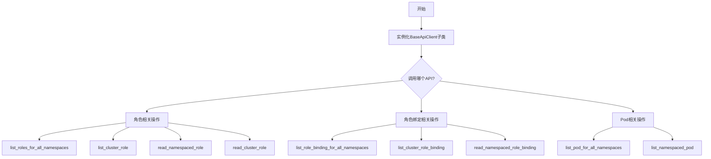
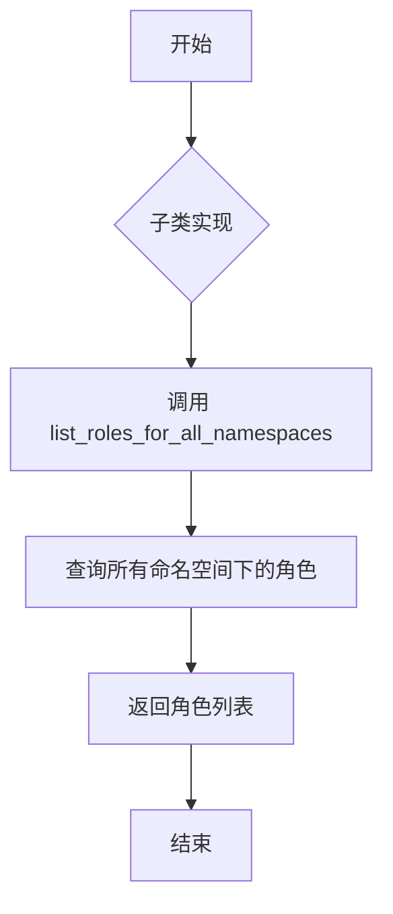
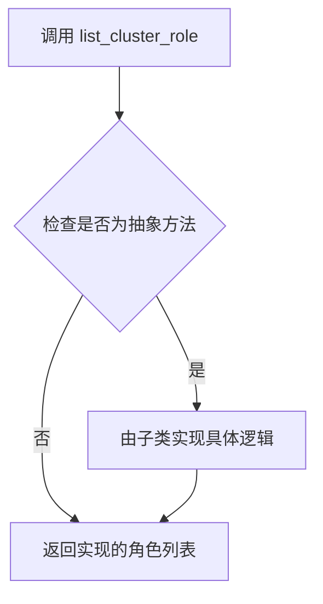
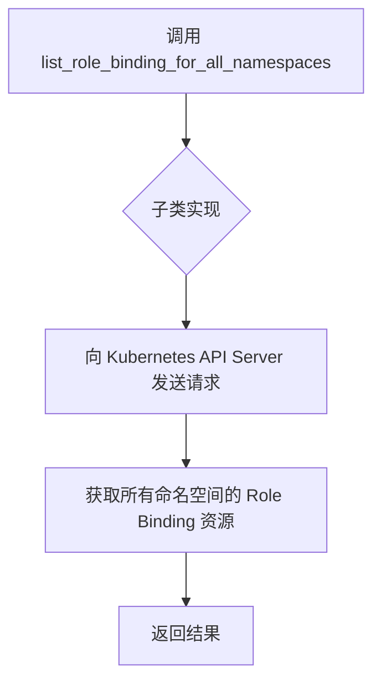
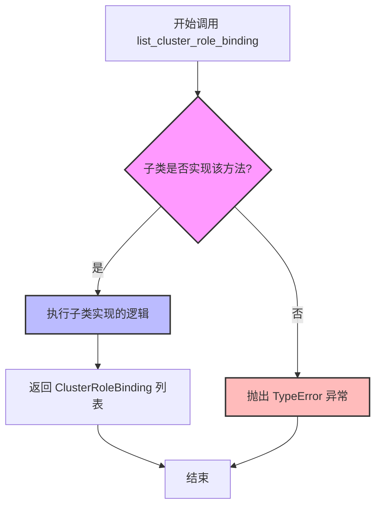
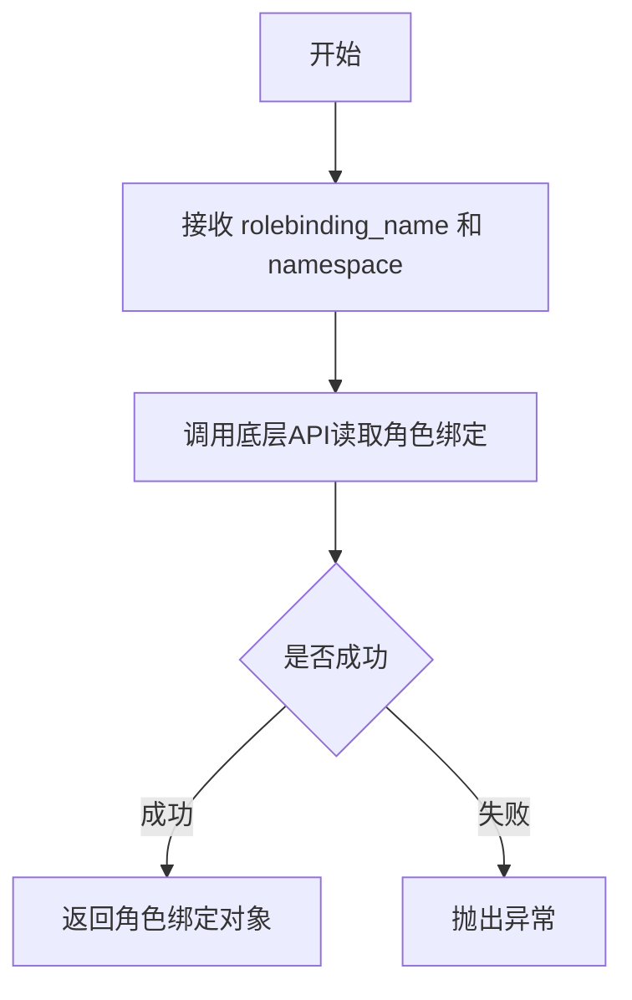
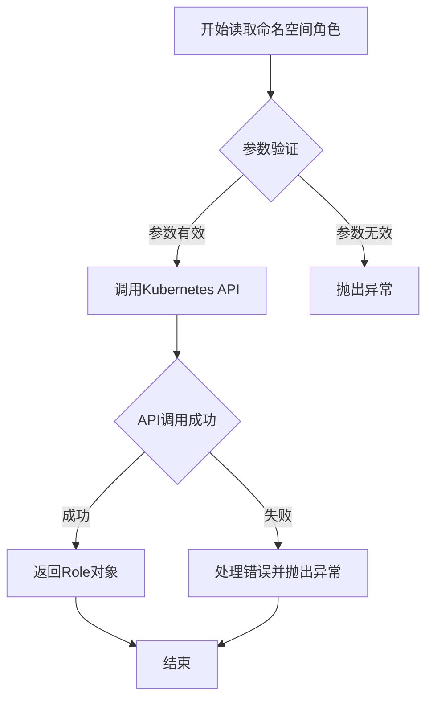
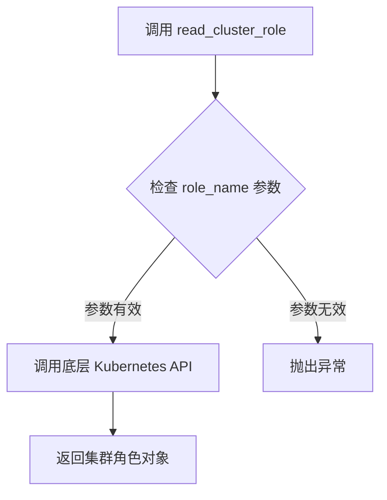
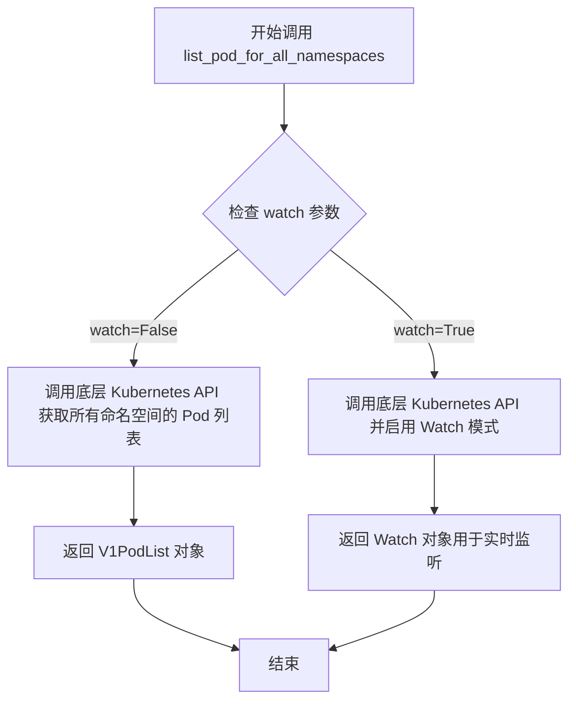
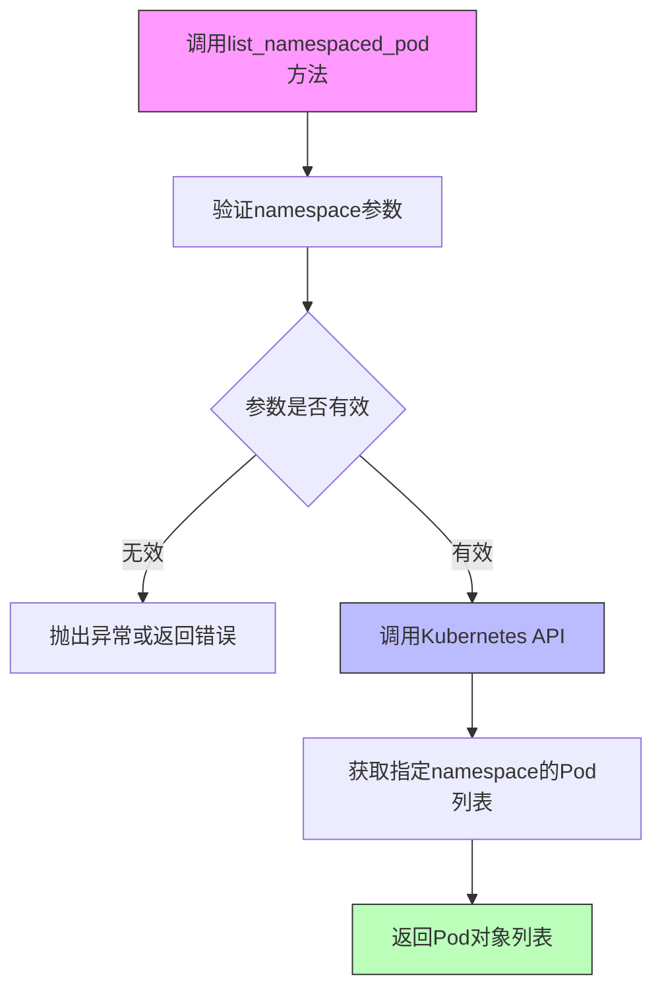

# `KubiScan\api\base_client_api.py` 详细设计文档

这是一个Kubernetes API客户端的抽象基类，定义了与Kubernetes RBAC（角色基于访问控制）和Pod资源交互的接口规范，包括角色、角色绑定、集群角色、集群角色绑定以及Pod的列举和读取操作。

## 整体流程



## 类结构

```
ABC (Python内置抽象基类)
└── BaseApiClient (Kubernetes API客户端抽象基类)
```

## 全局变量及字段


    

## 全局函数及方法


### `BaseApiClient.list_roles_for_all_namespaces`

该方法是一个抽象方法，用于列出所有命名空间中的角色（Role）。具体实现由子类完成。

参数：

- `self`：`BaseApiClient` 实例，调用该方法的类实例本身

返回值：`List[Dict]` 或具体的 Role 对象列表，返回所有命名空间中的角色信息

#### 流程图



#### 带注释源码

```python
class BaseApiClient(ABC):
    """
    API客户端抽象基类，定义了与Kubernetes API交互的接口规范
    """
    
    @abstractmethod
    def list_roles_for_all_namespaces(self):
        """
        列出所有命名空间中的角色（Role）
        
        这是一个抽象方法，由具体实现类实现。
        用于获取集群中所有命名空间下的Role资源列表。
        
        Args:
            self: BaseApiClient实例
            
        Returns:
            List[Dict]: 包含所有命名空间中Role的列表，每个元素为字典类型
                       具体的返回格式由子类实现决定
        """
        pass  # 子类必须实现此方法
    
    # ... 其他抽象方法
```


### `BaseApiClient.list_cluster_role`

该方法是一个抽象方法，用于列出所有集群级别的角色（ClusterRole），具体实现由子类提供。

参数：
无（仅包含 self 参数，但在抽象方法定义中不计入参数列表）

返回值：`None`，因为是抽象方法声明，具体返回值由子类实现决定

#### 流程图



#### 带注释源码

```python
@abstractmethod
def list_cluster_role(self):
    """
    抽象方法：列出所有集群角色（ClusterRole）
    
    该方法由子类实现具体逻辑，用于获取Kubernetes集群中
    所有ClusterRole资源的信息。
    
    注意：
    - 这是一个抽象方法，子类必须实现
    - 返回类型取决于具体实现，通常是Kubernetes Role列表或类似数据结构
    - 可能抛出异常，如权限不足或API调用失败
    """
    pass
```


### `BaseApiClient.list_role_binding_for_all_namespaces`

这是一个抽象方法，用于列出 Kubernetes 集群中所有命名空间下的 Role Binding 资源。该方法定义了与 Kubernetes API 服务器交互的接口规范，具体实现由子类完成，用于获取跨所有命名空间的角色绑定信息。

参数： 无

返回值：`Any`，由子类具体实现决定，通常为 Role Binding 资源列表或包含相关数据的响应对象

#### 流程图



#### 带注释源码

```python
@abstractmethod
def list_role_binding_for_all_namespaces(self):
    """
    列出所有命名空间中的 Role Binding 资源
    
    这是一个抽象方法，定义了列出集群范围内所有命名空间下
    Role Binding 的接口规范。具体实现由子类完成。
    
    Returns:
        Any: 由子类实现决定，通常为 Role Binding 列表或 API 响应对象
    """
    pass
```


### `BaseApiClient.list_cluster_role_binding`

该方法是一个抽象方法，用于列出集群中所有的 ClusterRoleBinding 资源，即获取集群级别所有角色绑定的信息。

参数：

- 无参数（仅包含隐式参数 `self`）

返回值：`Any`，返回集群中所有 ClusterRoleBinding 对象的列表，具体类型取决于实现类

#### 流程图



#### 带注释源码

```python
@abstractmethod
def list_cluster_role_binding(self):
    """
    列出集群中所有的 ClusterRoleBinding 资源。
    
    ClusterRoleBinding 是集群级别的资源，用于将 ClusterRole 或 Role
    绑定到用户、组或服务账户。与 RoleBinding 不同，ClusterRoleBinding
    的作用域是整个集群，不受命名空间限制。
    
    这是一个抽象方法，具体实现由子类提供。
    子类通常会调用 Kubernetes API 来获取集群级别的角色绑定信息。
    
    Returns:
        Any: 集群中所有 ClusterRoleBinding 对象的列表，
             具体类型取决于实现类（例如可能是 V1ClusterRoleBinding 列表）
    """
    pass
```

---

### 补充信息

#### 1. 类的整体信息

**BaseApiClient** 是一个抽象基类（ABC），定义了与 Kubernetes API 交互的接口。该类采用了模板方法模式，定义了多个抽象方法供子类实现。

**类字段：**

- 无显式类字段

**类方法：**

| 方法名 | 功能描述 |
|--------|----------|
| `list_roles_for_all_namespaces` | 列出所有命名空间中的 Role |
| `list_cluster_role` | 列出集群中所有的 ClusterRole |
| `list_role_binding_for_all_namespaces` | 列出所有命名空间中的 RoleBinding |
| `list_cluster_role_binding` | 列出集群中所有的 ClusterRoleBinding |
| `read_namespaced_role_binding` | 读取指定命名空间中的 RoleBinding |
| `read_namespaced_role` | 读取指定命名空间中的 Role |
| `read_cluster_role` | 读取集群中的 ClusterRole |
| `list_pod_for_all_namespaces` | 列出所有命名空间中的 Pod（支持 watch） |
| `list_namespaced_pod` | 列出指定命名空间中的 Pod |

#### 2. 设计目标与约束

- **设计模式**：模板方法模式 + 抽象工厂模式
- **约束**：子类必须实现所有抽象方法，否则无法实例化
- **设计目的**：定义统一的 API 客户端接口，支持多种 Kubernetes 资源操作

#### 3. 技术债务与优化空间

1. **缺乏错误处理**：抽象方法中没有定义异常处理机制，子类实现时需要自行处理网络错误、权限错误等
2. **返回值类型不明确**：使用 `Any` 类型不够精确，建议定义返回类型注解
3. **缺少日志记录**：方法中没有任何日志记录，不利于调试和监控
4. **参数验证缺失**：如 `read_namespaced_role_binding` 等方法缺少参数验证
5. **文档不完整**：抽象方法的文档注释可以更加详细，说明可能的异常和错误码

#### 4. 外部依赖与接口契约

- **依赖**：需要实现类提供 Kubernetes API 客户端实现（如 kubernetes-python 客户端）
- **接口契约**：
  - 实现类必须实现所有 `@abstractmethod` 装饰的方法
  - 方法应返回与 Kubernetes API 响应相匹配的对象
  - 应处理可能的 API 错误并抛出适当的异常


### `BaseApiClient.read_namespaced_role_binding`

读取指定命名空间下的角色绑定资源。

参数：

- `rolebinding_name`：`str`，角色绑定的名称
- `namespace`：`str`，角色绑定所在的命名空间

返回值：`Any`，返回对应的角色绑定对象

#### 流程图



#### 带注释源码

```python
@abstractmethod
def read_namespaced_role_binding(self, rolebinding_name, namespace):
    """
    读取指定命名空间下的角色绑定
    
    Args:
        rolebinding_name: 角色绑定的名称
        namespace: 命名空间名称
    
    Returns:
        角色绑定对象
    
    Raises:
        ApiException: 当API调用失败时抛出
    """
    pass
```


### `BaseApiClient.read_namespaced_role`

该方法是一个抽象方法，用于从Kubernetes API读取指定命名空间下的角色（Role）资源信息。

参数：

- `role_name`：`str`，要读取的角色的名称
- `namespace`：`str`，角色所在的命名空间

返回值：`Any`（通常为Kubernetes Role对象），返回指定命名空间中对应的角色资源对象

#### 流程图



#### 带注释源码

```python
@abstractmethod
def read_namespaced_role(self, role_name, namespace):
    """
    读取指定命名空间下的角色（Role）资源
    
    这是一个抽象方法，由子类实现具体逻辑。
    用于从Kubernetes API获取特定命名空间中指定名称的Role对象。
    
    参数:
        role_name (str): 要读取的角色的名称
        namespace (str): 角色所在的命名空间
    
    返回:
        通常返回kubernetes.client.models.V1Role对象，表示指定命名空间中的角色资源
    
    注意:
        - 该方法是抽象方法，具体实现由子类提供
        - 实现的子类需要处理与Kubernetes API的交互
        - 需要处理角色不存在或命名空间不存在等异常情况
    """
    pass
```


### `BaseApiClient.read_cluster_role`

获取集群级别的角色（ClusterRole）信息。

参数：

- `role_name`：`str`，角色名称，用于指定要读取的集群角色

返回值：`None`，由于是抽象方法，返回值类型未定义（实际实现中应返回对应的角色对象）

#### 流程图



#### 带注释源码

```python
@abstractmethod
def read_cluster_role(self, role_name):
    """
    读取指定名称的集群角色信息
    
    参数:
        role_name (str): 要读取的集群角色的名称
        
    返回:
        抽象方法，由子类实现具体逻辑
    """
    pass
```


### `BaseApiClient.list_pod_for_all_namespaces`

这是一个抽象方法，定义在 `BaseApiClient` 抽象基类中，用于列出所有 Kubernetes 命名空间中的 Pod 资源。该方法接收一个 `watch` 参数来控制是否启用 Watch 模式进行实时监听，具体返回值类型取决于 `watch` 参数的值（由子类实现决定）。

参数：

- `watch`：`bool`，用于控制是否启用 Watch 模式。当设置为 `True` 时，方法应返回一个 Watch 对象以支持实时监听资源变化；当设置为 `False` 时，应返回静态的 Pod 列表。

返回值：`Union[V1PodList, Watch]`，返回所有命名空间中的 Pod 列表（V1PodList），或者当 watch=True 时返回 Watch 对象用于实时监听。

#### 流程图



#### 带注释源码

```python
@abstractmethod
def list_pod_for_all_namespaces(self, watch):
    """
    列出所有命名空间中的 Pods。
    
    这是一个抽象方法，由子类实现具体的 Kubernetes API 调用逻辑。
    
    参数:
        watch (bool): 布尔值，指定是否启用 Watch 模式。
                     - True: 返回 Watch 对象，支持实时监听资源变化
                     - False: 返回静态的 Pod 列表
    
    返回:
        根据 watch 参数值:
        - watch=False: 返回 V1PodList 对象，包含所有命名空间的 Pod 列表
        - watch=True: 返回 Watch 对象，用于实时监听 Pod 资源变化
    
    子类实现示例:
        def list_pod_for_all_namespaces(self, watch):
            if watch:
                return self.core_v1.list_pod_for_all_namespaces(watch=True)
            return self.core_v1.list_pod_for_all_namespaces(watch=False)
    """
    pass
```


### `BaseApiClient.list_namespaced_pod`

该方法是一个抽象方法，用于列出指定Kubernetes命名空间下的所有Pod资源。它定义了与Kubernetes API交互的标准接口，具体实现由子类完成，以获取特定命名空间中的Pod列表。

参数：

- `namespace`：`str`，要查询的Kubernetes命名空间名称，用于指定要列出Pod的目标命名空间

返回值：`Any`，根据具体实现而定，通常是包含Pod对象列表的响应数据结构

#### 流程图



#### 带注释源码

```python
@abstractmethod
def list_namespaced_pod(self, namespace):
    """
    抽象方法：列出指定命名空间下的所有Pod
    
    这是一个抽象方法声明，具体的实现由继承BaseApiClient的子类提供。
    该方法对应Kubernetes API的List Namespaced Pod接口。
    
    参数:
        namespace (str): Kubernetes命名空间名称，指定要查询的命名空间
        
    返回:
        Any: 包含Pod列表的响应对象，具体类型取决于实现类
        
    注意:
        - 该方法是抽象方法，必须由子类实现
        - 实现类需要处理与Kubernetes API服务器的HTTP通信
        - 可能需要处理认证、授权、错误处理等逻辑
    """
    pass
```


## 关键组件


### BaseApiClient

抽象基类，定义了 Kubernetes RBAC 资源（Role、ClusterRole、RoleBinding、ClusterRoleBinding）和 Pod 操作的接口规范，提供了跨命名空间和命名空间级别的资源查询与读取方法。

### list_roles_for_all_namespaces

列出所有命名空间中的 Role 资源

### list_cluster_role

列出集群级别的 ClusterRole 资源

### list_role_binding_for_all_namespaces

列出所有命名空间中的 RoleBinding 资源

### list_cluster_role_binding

列出集群级别的 ClusterRoleBinding 资源

### read_namespaced_role_binding

读取指定命名空间中的特定 RoleBinding 资源

### read_namespaced_role

读取指定命名空间中的特定 Role 资源

### read_cluster_role

读取集群级别的特定 ClusterRole 资源

### list_pod_for_all_namespaces

列出所有命名空间中的 Pod 资源，支持 watch 参数用于实时监控

### list_namespaced_pod

列出指定命名空间中的 Pod 资源


## 问题及建议


### 已知问题

- **类型注解完全缺失**：所有方法均未定义参数类型和返回值类型，导致静态类型检查工具无法验证代码正确性，使用者难以理解接口契约。
- **文档字符串完全缺失**：没有任何方法说明、参数描述和返回值描述，增加了维护成本和使用难度。
- **方法命名不一致**：部分方法使用 `rolebinding`（如 `read_namespaced_role_binding`），部分使用 `role_binding`（如 `list_role_binding_for_all_namespaces`），且参数命名风格不统一（如 `rolebinding_name` vs `role_name`）。
- **参数设计不一致**：`list_pod_for_all_namespaces(self, watch)` 将 `watch` 作为参数，而 `list_namespaced_pod(self, namespace)` 将 `namespace` 作为参数，设计逻辑不一致。
- **抽象基类职责不明确**：作为 API 客户端基类，缺少通用配置、认证、错误处理、重试机制、连接池管理等基础设施。
- **功能覆盖不全面**：仅覆盖 RBAC（角色/角色绑定）和 Pod 资源，Kubernetes API 包含大量其他资源（如 Deployment、Service、ConfigMap 等）。
- **缺少异常体系**：未定义客户端特定的异常类，无法区分不同类型的错误。

### 优化建议

- 为所有方法添加类型注解和返回值类型，例如 `def list_roles_for_all_namespaces(self) -> List[Dict[str, Any]]:`
- 为所有方法添加 docstring，描述方法功能、参数含义、返回值和可能的异常。
- 统一方法命名规范和参数命名规范，建议参考 Kubernetes API 命名（如 `list_role_binding_for_all_namespaces` 改为 `list_role_bindings_for_all_namespaces`）。
- 考虑将通用逻辑下沉到基类（如认证、请求重试、超时控制、错误处理），或提供抽象方法供子类实现。
- 补充常见资源的 CRUD 方法，或按资源类型拆分为多个更细粒度的抽象类。
- 定义客户端专属异常类，继承自 `Exception`，并按错误类型细分（如 `AuthenticationError`、`ResourceNotFoundError`、`ApiServerError`）。

## 其它


### 设计目标与约束

本代码定义了一个抽象基类BaseApiClient，旨在为Kubernetes API客户端提供统一的接口规范。设计目标是解耦具体实现与业务逻辑，让子类可以灵活实现不同的Kubernetes API调用方式（如使用官方client-go、自定义HTTP请求等）。约束包括：所有方法均为抽象方法，必须由子类实现；方法命名遵循Kubernetes API规范；不支持异步操作，当前均为同步方法。

### 错误处理与异常设计

由于本类为抽象基类，错误处理由子类具体实现。推荐采用以下异常体系：ApiClientException作为基础异常类，包含错误码和错误信息；NetworkException用于网络相关错误；AuthException用于认证授权错误；NotFoundException用于资源不存在错误；ValidationException用于参数校验错误。每个抽象方法的文档字符串应注明可能抛出的异常类型。

### 数据流与状态机

本类不涉及复杂的状态机设计。数据流为简单的请求-响应模式：调用方调用抽象方法 → 子类实现具体API调用 → 返回Kubernetes资源对象（字典或模型对象）。对于list_xxx方法，返回值为资源列表；对于read_xxx方法，返回值为单个资源对象。watch参数用于控制是否开启watch模式。

### 外部依赖与接口契约

本类依赖abc模块的ABC和abstractmethod。子类实现时可能依赖：kubernetes-client库、requests库、urllib3库、或原生HTTP客户端。接口契约规定：所有方法必须实现；方法签名必须与抽象定义一致；返回值类型由子类文档说明；抛出异常必须继承自Exception或自定义异常基类。

### 性能要求与限制

list_xxx_for_all_namespaces方法可能返回大量数据，应考虑分页实现。watch参数为布尔类型，true时开启长连接watch模式。子类实现时应设置合理的超时时间（建议默认30秒）。对于高频调用场景，应实现缓存机制或使用Kubernetes的Watch API减少请求次数。

### 安全性考虑

认证机制由子类实现，推荐支持：基于Token的认证、基于kubeconfig文件的认证、基于服务账户的认证。敏感信息（如Token）不应在日志中输出。HTTPS为默认推荐协议。子类的网络请求应支持TLS证书验证。

### 兼容性设计

本抽象基类设计时应考虑Kubernetes版本兼容性：不同版本的API路径可能不同（如/api/v1 vs /apis/rbac.authorization.k8s.io/v1）；某些资源在不同版本中可能存在或不存在。建议在子类实现中引入API版本检测逻辑。方法签名应保持向后兼容，添加新参数时应使用可选参数并设置默认值。

### 使用示例

```python
# 子类实现示例
class K8sApiClient(BaseApiClient):
    def list_roles_for_all_namespaces(self):
        # 实现具体API调用
        return self.client.list_cluster_role()

# 使用示例
client = K8sApiClient()
roles = client.list_roles_for_all_namespaces()
for role in roles.items:
    print(role.metadata.name)
```

### 测试策略

单元测试：测试抽象类本身（验证为抽象类、方法签名正确）。子类实现测试：使用mock模拟API响应；测试各方法调用是否正确；测试异常抛出逻辑。集成测试（可选）：连接真实Kubernetes集群测试；验证返回数据结构正确性。

### 配置与扩展点

子类可扩展的配置项包括：API服务器地址（默认~/.kube/config中的cluster）；超时设置；重试策略；日志级别。扩展方式：继承BaseApiClient实现具体逻辑；可组合使用其他客户端库；可添加装饰器实现重试、熔断等功能。

    