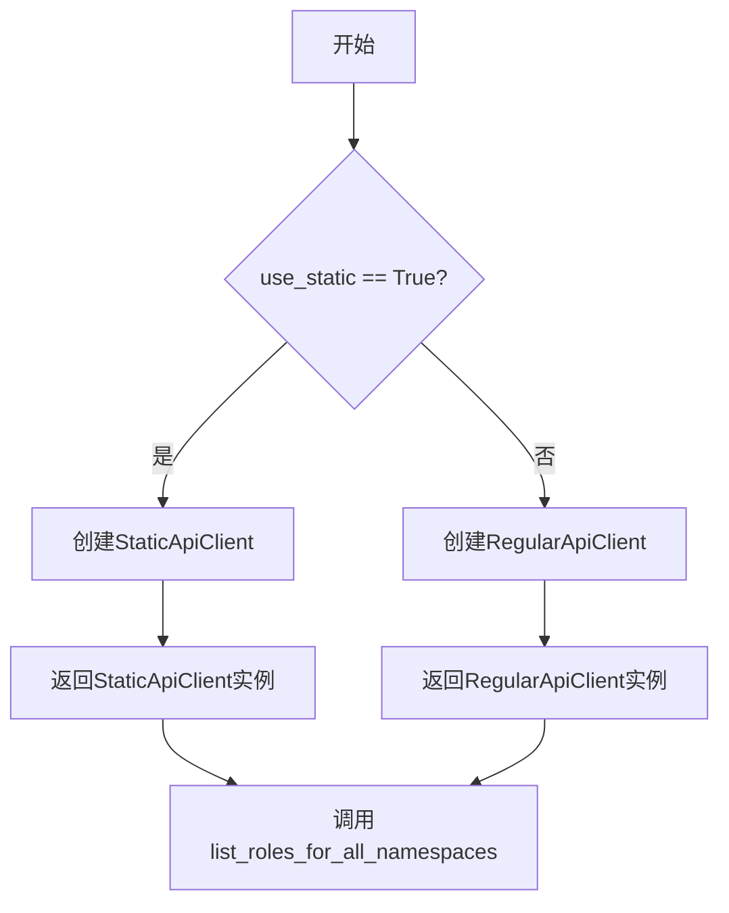
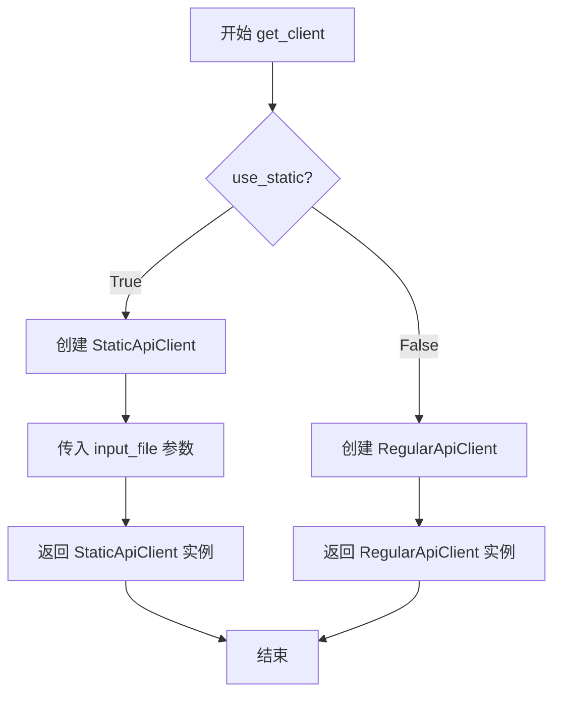
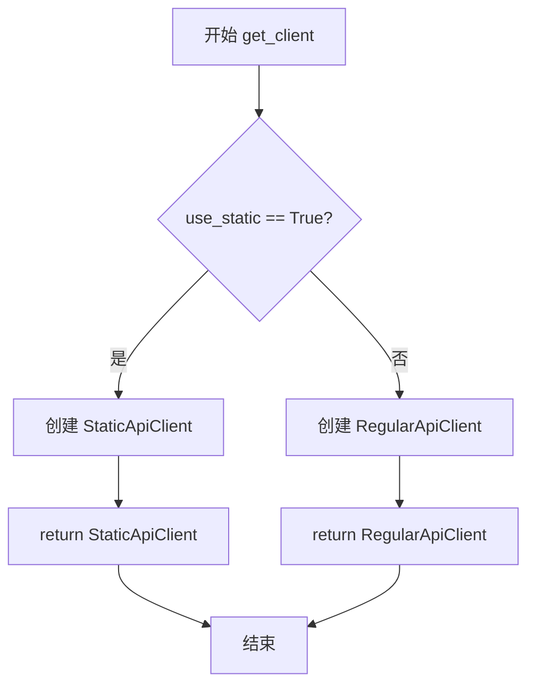

# `KubiScan\api\client_factory.py` 详细设计文档

一个简单的工厂模式实现，用于根据配置动态创建API客户端实例。通过静态方法get_client可选择创建StaticApiClient（从本地JSON文件读取数据）或RegularApiClient（常规实时API客户端），支持Kubernetes角色的批量扫描场景。

## 整体流程



## 类结构

```
ApiClientFactory (工厂类)
├── get_client() [静态方法]
```

## 全局变量及字段


    

## 全局函数及方法


### `ApiClientFactory.get_client`

该静态方法是一个工厂方法，根据参数选择创建不同类型的API客户端实例：若 `use_static` 为 `True`，则返回 `StaticApiClient`（通常用于从文件加载数据）；否则返回 `RegularApiClient`（用于实时API调用）。

参数：

- `use_static`：`bool`，指示是否使用静态API客户端。默认为 `False`，即使用常规实时API客户端。
- `input_file`：`str`，可选参数，指定静态客户端要读取的JSON文件路径。仅在 `use_static=True` 时有效。

返回值：`ApiClient`（或子类 `StaticApiClient` / `RegularApiClient`），返回创建的API客户端实例，用于后续的API操作。

#### 流程图



#### 带注释源码

```python
@staticmethod
def get_client(use_static=False, input_file=None):
    """
    静态工厂方法，根据参数创建并返回相应的API客户端实例。
    
    参数:
        use_static (bool): 标识是否使用静态模式。若为True，则从本地JSON文件
                          加载数据；否则连接实时Kubernetes API Server。
        input_file (str):  仅在use_static为True时有效，指定要读取的JSON数据文件路径。
    
    返回:
        ApiClient: 返回一个API客户端实例（StaticApiClient或RegularApiClient），
                 调用方可以使用该实例执行list_roles等操作。
    """
    # 判断是否需要创建静态客户端
    if use_static:
        # 创建静态客户端，从指定文件读取数据
        return StaticApiClient(input_file=input_file)
    else:
        # 创建常规客户端，连接实时API Server
        return RegularApiClient()
```


### `ApiClientFactory.get_client`

该方法是一个静态工厂方法，用于根据参数条件创建并返回不同的API客户端实例：当`use_static`为True时返回支持从文件加载数据的StaticApiClient，否则返回常规的RegularApiClient。

参数：

- `use_static`：`bool`，可选参数，默认为False。指定是否使用静态客户端，当为True时返回StaticApiClient，否则返回RegularApiClient
- `input_file`：`str`，可选参数，默认为None。指定静态客户端需要读取的输入文件路径，仅在use_static为True时生效

返回值：`Union[StaticApiClient, RegularApiClient]`，返回API客户端实例，根据use_static参数返回不同类型的客户端对象

#### 流程图



#### 带注释源码

```python
from .static_api_client import StaticApiClient
from .api_client import RegularApiClient

class ApiClientFactory:
    """
    API客户端工厂类，用于创建不同类型的API客户端实例
    """
    
    @staticmethod
    def get_client(use_static=False, input_file=None):
        """
        获取API客户端实例的工厂方法
        
        参数:
            use_static (bool): 是否使用静态客户端模式，默认为False
            input_file (str): 静态客户端使用的输入文件路径，默认为None
            
        返回:
            Union[StaticApiClient, RegularApiClient]: 返回对应的客户端实例
        """
        # 判断是否使用静态客户端模式
        if use_static:
            # 当use_static为True时，返回StaticApiClient实例
            # 并将input_file参数传递给StaticApiClient构造函数
            return StaticApiClient(input_file=input_file)
        else:
            # 当use_static为False时，返回常规的RegularApiClient实例
            return RegularApiClient()


# 使用示例
# 方式1：获取静态客户端（从JSON文件加载数据）
# api_client = ApiClientFactory.get_client(use_static=True, input_file="/home/noamr/Documents/KubiScan/combined.json")

# 方式2：获取常规客户端（实时API调用）
# api_client = ApiClientFactory.get_client()

# 使用示例：列出所有命名空间的角色
# print(api_client.list_roles_for_all_namespaces())
```

## 关键组件


### ApiClientFactory

工厂类，负责根据配置参数创建不同类型的API客户端实例。

### get_client 静态方法

工厂方法，根据 use_static 参数决定返回 StaticApiClient 或 RegularApiClient 实例。

### StaticApiClient

静态数据API客户端，用于从本地文件加载数据。

### RegularApiClient

常规API客户端，用于实时API调用。

### use_static 参数

布尔类型参数，控制使用静态客户端还是常规客户端。

### input_file 参数

字符串类型参数，指定静态客户端要读取的JSON文件路径。


## 问题及建议


### 已知问题

-   缺少抽象基类或接口定义，`StaticApiClient` 和 `RegularApiClient` 没有共同约束，可能导致返回对象行为不一致
-   `input_file` 参数未进行有效性验证（如文件路径是否存在、是否为有效文件路径），可能导致运行时错误
-   缺少异常处理机制，未处理可能发生的导入错误、文件读取错误等情况
-   完全缺少类型提示（Type Hints），降低代码可维护性和 IDE 支持
-   缺少文档字符串（Docstring），类和方法缺乏使用说明
-   工厂方法使用静态方法（`@staticmethod`）而非类方法或实例方法，降低了可测试性和扩展性
-   代码注释掉的示例行暴露了硬编码的绝对文件路径 `/home/noamr/Documents/KubiScan/combined.json`，违反最佳实践

### 优化建议

-   引入抽象基类（ABC）定义统一的客户端接口，确保 `StaticApiClient` 和 `RegularApiClient` 实现相同的方法签名
-   为 `get_client` 方法添加参数验证逻辑，检查 `input_file` 是否存在且可读
-   添加异常处理，使用 try-except 捕获并处理可能的异常，提供有意义的错误信息
-   为所有类和方法添加类型提示和文档字符串，提升代码可读性和可维护性
-   考虑将工厂方法改为实例方法或类方法，或实现完整的依赖注入模式，提高可测试性
-   移除或移动硬编码的文件路径示例代码，避免泄露本地路径信息
-   考虑使用配置对象或环境变量管理客户端类型和配置，而非简单的布尔标志
-   添加日志记录功能，便于调试和监控


## 其它


### 设计目标与约束

该代码实现了一个简单的工厂模式，用于根据参数动态创建不同类型的API客户端实例。设计目标是解耦客户端的创建逻辑，使调用方无需关心具体客户端的实现细节。约束条件包括：use_static参数为布尔类型，input_file参数仅在使用静态客户端时有效，且input_file应为有效的文件路径。

### 错误处理与异常设计

当前代码缺少错误处理机制。建议添加以下异常场景处理：当use_static=True但input_file为None时应抛出ValueError；当input_file指定的文件不存在时应抛出FileNotFoundError；当客户端初始化失败时应捕获相应异常并向上传递。此外，建议定义自定义异常类，如ApiClientCreationError，用于标识客户端创建过程中的特定错误。

### 数据流与状态机

数据流如下：调用方传入use_static和input_file参数 → 工厂方法接收参数 → 判断use_static值 → 根据判断结果实例化对应客户端 → 返回客户端实例。状态机相对简单，主要状态包括：初始状态（等待参数）→ 创建中状态（实例化客户端）→ 完成状态（返回客户端）或错误状态（抛出异常）。

### 外部依赖与接口契约

该模块依赖于两个外部客户端类：StaticApiClient和RegularApiClient。两个客户端类应遵循统一的接口契约，确保调用方可以无差别地调用list_roles_for_all_namespaces()等方法。建议定义抽象基类ApiClientBase，规定必须实现的方法列表。输入文件路径应遵循文件系统路径规范，兼容不同操作系统的路径格式。

### 使用示例与调用约定

调用方应按照以下方式使用：from api_client_factory import ApiClientFactory; client = ApiClientFactory.get_client(use_static=True, input_file="/path/to/file.json")。use_static默认为False，input_file默认为None。当使用静态客户端时，必须提供有效的input_file参数；当使用常规客户端时，无需提供input_file。

### 扩展性与未来考虑

当前工厂方法通过if-else分支扩展，未来可考虑使用注册表模式支持更多客户端类型的动态注册。可添加配置驱动的方式，通过配置文件定义支持的客户端类型列表。客户端实例的生命周期管理（创建、缓存、销毁）也可纳入设计考量。

### 测试策略建议

建议为工厂类编写单元测试，覆盖以下场景：默认参数调用、use_static=True带有效input_file、use_static=True带无效input_file、use_static=True带None的input_file、use_static=False等情况。使用mock对象模拟StaticApiClient和RegularApiClient的实例化过程，验证工厂方法正确调用了对应的客户端构造函数。


    