# `KubiScan\api\static_api_client.py` 详细设计文档

StaticApiClient类用于从本地YAML/JSON文件中加载Kubernetes RBAC资源（Role、ClusterRole、RoleBinding、ClusterRoleBinding）和Pod资源，并将其转换为Kubernetes Python客户端的对象模型，同时提供类似于Kubernetes API的查询接口方法，实现对静态配置文件的读取和检索功能。

## 整体流程

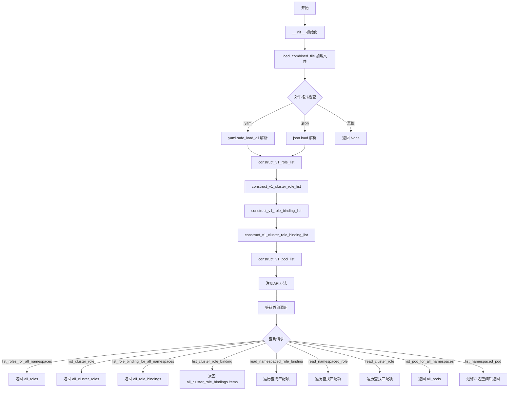

## 类结构

```
BaseApiClient (抽象基类/外部依赖)
└── StaticApiClient (本类)
```

## 全局变量及字段


### `StaticApiClient.combined_data`
    
从输入文件加载的组合数据，可能是YAML文档列表、JSON对象或None（加载失败时）

类型：`Union[list, dict, None]`
    


### `StaticApiClient.all_roles`
    
包含所有命名空间Role资源的V1RoleList对象

类型：`V1RoleList`
    


### `StaticApiClient.all_cluster_roles`
    
包含所有集群级别ClusterRole资源的V1RoleList对象

类型：`V1RoleList`
    


### `StaticApiClient.all_role_bindings`
    
包含所有命名空间RoleBinding资源的V1RoleBindingList对象

类型：`V1RoleBindingList`
    


### `StaticApiClient.all_cluster_role_bindings`
    
包含所有集群级别ClusterRoleBinding资源的V1RoleBindingList对象

类型：`V1RoleBindingList`
    


### `StaticApiClient.all_pods`
    
包含所有Pod资源的V1PodList对象

类型：`V1PodList`
    
    

## 全局函数及方法


### `StaticApiClient.__init__`

构造函数，用于初始化 StaticApiClient 实例，加载输入的 JSON/YAML 文件，并构造 Kubernetes RBAC 和 Pod 相关的资源列表。

参数：

- `input_file`：`str`，输入文件的路径，支持 .json 或 .yaml 格式

返回值：`None`，无返回值（构造函数）

#### 流程图

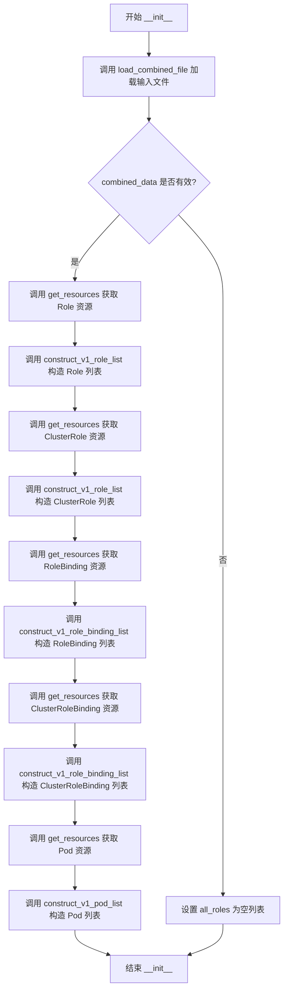

#### 带注释源码

```python
def __init__(self, input_file):
    """
    初始化 StaticApiClient 实例
    
    参数:
        input_file: 输入文件的路径，支持 .json 或 .yaml 格式
    """
    # 步骤1: 加载并解析输入文件 (JSON 或 YAML)
    # 该方法会根据文件扩展名自动判断格式，并返回解析后的数据
    self.combined_data = self.load_combined_file(input_file)
    
    # 步骤2: 获取 Role 资源并构造 V1RoleList 对象
    # 从 combined_data 中筛选 kind='Role' 的资源
    self.all_roles = self.construct_v1_role_list("Role", self.get_resources('Role'))
    
    # 步骤3: 获取 ClusterRole 资源并构造 V1RoleList 对象
    # 从 combined_data 中筛选 kind='ClusterRole' 的资源
    self.all_cluster_roles = self.construct_v1_role_list("ClusterRole", self.get_resources('ClusterRole'))
    
    # 步骤4: 获取 RoleBinding 资源并构造 V1RoleBindingList 对象
    # 从 combined_data 中筛选 kind='RoleBinding' 的资源
    self.all_role_bindings = self.construct_v1_role_binding_list("RoleBinding", self.get_resources('RoleBinding'))
    
    # 步骤5: 获取 ClusterRoleBinding 资源并构造 V1RoleBindingList 对象
    # 从 combined_data 中筛选 kind='ClusterRoleBinding' 的资源
    self.all_cluster_role_bindings = self.construct_v1_role_binding_list("ClusterRoleBinding", self.get_resources('ClusterRoleBinding'))
    
    # 步骤6: 获取 Pod 资源并构造 V1PodList 对象
    # 从 combined_data 中筛选 kind='Pod' 的资源
    self.all_pods = self.construct_v1_pod_list("Pod", self.get_resources('Pod'))
```


### `StaticApiClient.load_combined_file`

该方法负责读取指定路径的 Kubernetes 资源定义文件（支持 YAML 和 JSON 格式），根据文件扩展名自动判断并解析文件内容，返回对应的数据结构（YAML 返回文档列表，JSON 返回字典对象），并在遇到不支持的格式、文件不存在或其他读取错误时返回 `None`。

参数：
-  `input_file`：`str`，输入文件的路径字符串。

返回值：`Optional[Union[List[Dict], Dict]]`，成功解析时返回数据（YAML 格式返回包含多个文档的列表，JSON 格式返回字典对象）；若文件不存在、格式不支持或发生读取错误，则返回 `None`。

#### 流程图

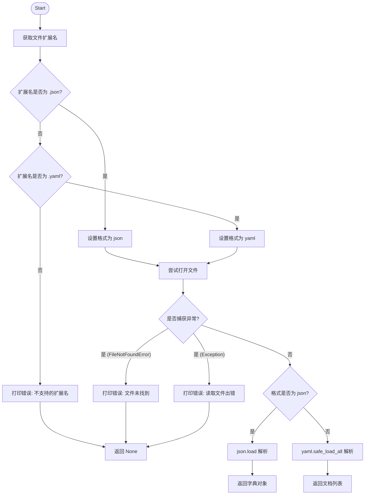

#### 带注释源码

```python
def load_combined_file(self, input_file):
    """
    加载并解析输入的组合文件（YAML 或 JSON）。
    """
    # 分离文件路径和扩展名
    _, file_extension = os.path.splitext(input_file)
    
    # 根据扩展名判断文件格式
    if file_extension.lower() == '.json':
        file_format = 'json'
    elif file_extension.lower() == '.yaml':
        file_format = 'yaml'
    else:
        file_format = None
    
    # 如果格式不支持，打印错误信息并返回 None
    if not file_format:
        print("Unsupported file extension. Only '.yaml' and '.json' are supported.")
        return None

    try:
        # 以只读模式打开文件
        with open(input_file, 'r') as file:
            # 如果是 YAML 格式，读取所有文档（支持多文档 YAML）
            if file_format == "yaml":
                documents = list(yaml.safe_load_all(file))
                return documents
            # 如果是 JSON 格式，读取并解析 JSON 对象
            elif file_format == "json":
                return json.load(file)
    except FileNotFoundError:
        # 处理文件未找到的异常
        print(f"File not found: {input_file}")
        return None
    except Exception as e:
        # 处理其他读取或解析异常
        print(f"Error reading file: {e}")
        return None
```


### `StaticApiClient.get_resources`

该方法是一个实例方法，属于 `StaticApiClient` 类。它负责从初始化时加载的 `combined_data`（通常是 Kubernetes 资源的 YAML 或 JSON 列表）中，根据传入的资源类型（`kind`）筛选出符合条件的资源字典列表。

#### 参数

- `kind`：`str`，要查询的 Kubernetes 资源类型（例如 "Role", "Pod", "Service" 等）。

#### 返回值

- `List[dict]`，返回包含所有匹配指定 `kind` 的资源字典列表。如果未找到或数据未加载，则返回空列表。

#### 流程图

```mermaid
flowchart TD
    A[开始: get_resources] --> B{self.combined_data 是否存在?}
    B -- 否 --> F[返回空列表 []]
    B -- 是 --> C[遍历 combined_data 中的每个 entry]
    C --> D{entry 中是否存在 'items' 且为列表?}
    D -- 否 --> C
    D -- 是 --> E[遍历 items 中的每个 item]
    E --> G{item.get('kind') == kind?}
    G -- 否 --> E
    G -- 是 --> H[将该 item 添加到 resources 列表]
    H --> E
    E --> I[返回 resources 列表]
```

#### 带注释源码

```python
def get_resources(self, kind):
    """
    根据资源类型(kind)从加载的数据中筛选资源。

    参数:
        kind (str): Kubernetes 资源的类型，例如 'Role', 'Pod', 'Service' 等。

    返回:
        list: 包含所有匹配 kind 的资源字典的列表。
    """
    resources = []
    # 检查 combined_data 是否已成功加载（可能为 None 如果文件读取失败）
    if self.combined_data:
        # combined_data 通常是一个列表，包含了 YAML/JSON 文件中的所有文档对象
        for entry in self.combined_data:
            # Kubernetes 资源通常嵌套在 'items' 键下
            if 'items' in entry and isinstance(entry['items'], list):
                # 使用列表推导式过滤出 kind 匹配的资源
                # extend 用于将筛选出的多个 item 合并到 resources 列表中
                resources.extend(item for item in entry['items'] if item.get('kind') == kind)
    return resources
```


### `StaticApiClient.parse_metadata`

该方法用于将原始Kubernetes资源中的metadata字典转换为Kubernetes Python客户端的V1ObjectMeta对象,特别处理了时间戳字段的格式转换。

参数：

- `self`：StaticApiClient，类的实例本身
- `metadata_dict`：`dict`，包含Kubernetes资源元数据的字典，通常包含name、namespace、creationTimestamp等字段

返回值：`V1ObjectMeta`，返回Kubernetes Python客户端的V1ObjectMeta对象，包含解析后的name、namespace和creation_timestamp属性

#### 流程图

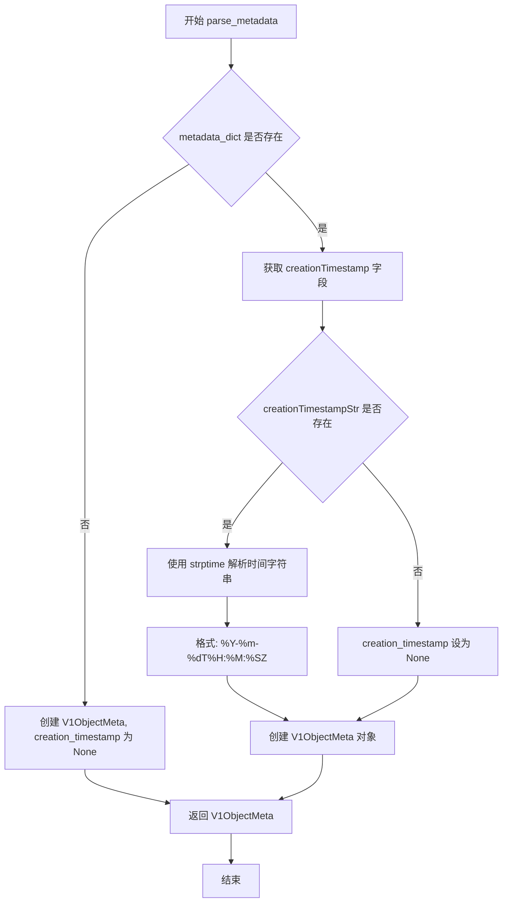

#### 带注释源码

```python
def parse_metadata(self, metadata_dict):
    """
    解析metadata字典并转换为V1ObjectMeta对象
    
    参数:
        metadata_dict: 包含Kubernetes资源元数据的字典
                     预期包含字段: name (必选), namespace (可选), 
                     creationTimestamp (可选, 格式: ISO8601)
    
    返回:
        V1ObjectMeta: Kubernetes Python客户端的元数据对象
    """
    # 获取creationTimestamp字段,这是Kubernetes资源创建时间的ISO8601格式字符串
    creation_timestamp_str = metadata_dict.get('creationTimestamp')
    
    # 初始化creation_timestamp为None
    creation_timestamp = None
    
    # 如果存在creationTimestamp字符串,则解析为datetime对象
    if creation_timestamp_str:
        # 使用strptime解析ISO8601格式的时间字符串
        # 格式: YYYY-MM-DDTHH:MM:SZ (例如: 2024-01-15T10:30:00Z)
        creation_timestamp = datetime.strptime(creation_timestamp_str, "%Y-%m-%dT%H:%M:%SZ")
    
    # 构建并返回V1ObjectMeta对象
    return V1ObjectMeta(
        name=metadata_dict['name'],  # 必选字段,资源的名称
        namespace=metadata_dict.get('namespace'),  # 可选字段,命名空间
        creation_timestamp=creation_timestamp  # 转换后的datetime对象或None
    )
```


### `StaticApiClient.construct_v1_role_list`

该函数是 `StaticApiClient` 类的核心方法之一，负责将原始的 YAML/JSON 字典数据（代表 Kubernetes RBAC 中的 Role 资源）转换为 Kubernetes Python 客户端的原生 `V1Role` 和 `V1RoleList` 对象，以便于程序内部进行类型安全的操作和调用。

参数：

- `kind`：`str`，指定角色的类型（例如 "Role" 或 "ClusterRole"），用于构建返回列表的 `kind` 字段。
- `items`：`List[Dict]`，从输入文件中提取的角色资源字典列表。

返回值：`V1RoleList`，返回包含转换后的 `V1Role` 对象列表的 Kubernetes RBAC API 对象。

#### 流程图

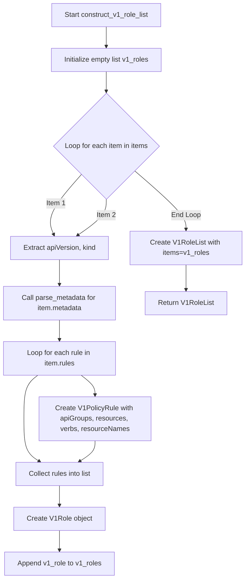

#### 带注释源码

```python
def construct_v1_role_list(self, kind, items):
    """
    将原始的角色字典列表转换为 Kubernetes V1RoleList 对象。
    
    参数:
        kind (str): 角色类型 (例如 "Role").
        items (List[Dict]): 包含角色原始数据的字典列表。
        
    返回:
        V1RoleList: Kubernetes RBAC 角色列表对象。
    """
    v1_roles = []
    
    # 遍历每一个原始的角色数据项
    for item in items:
        # 解析元数据，将字典转换为 V1ObjectMeta 对象
        # 注意：这里假设 item 中必须包含 'apiVersion', 'kind', 'metadata'
        v1_role = V1Role(
            api_version=item['apiVersion'],
            kind=item['kind'],
            metadata=self.parse_metadata(item['metadata']),
            rules=[
                # 遍历角色规则，将字典转换为 V1PolicyRule 对象
                V1PolicyRule(
                    api_groups=rule.get('apiGroups', []), 
                    resources=rule.get('resources', []), 
                    verbs=rule.get('verbs', []), 
                    resource_names=rule.get('resourceNames', [])  
                ) for rule in item.get('rules', [])
            ]
        )
        v1_roles.append(v1_role)
    
    # 构建并返回 V1RoleList 对象
    return V1RoleList(
        api_version="rbac.authorization.k8s.io/v1",
        kind=f"{kind}List", # 例如 "RoleList"
        items=v1_roles,
        metadata={'resourceVersion': '1'} # 硬编码的资源版本
    )
```

#### 关键组件信息

- **V1Role**: Kubernetes RBAC Role 对象。
- **V1PolicyRule**: 定义角色的权限规则（允许的 API 组、资源、动词）。
- **V1ObjectMeta**: 包含角色的元数据（名称、命名空间、创建时间等）。

#### 潜在的技术债务或优化空间

1.  **脆弱的错误处理**：该方法直接访问字典的键（如 `item['apiVersion']`、`item['metadata']`），如果原始数据缺少这些必填字段，会导致 `KeyError` 异常。应该增加健壮性检查或使用 `item.get()` 并提供默认值/日志警告。
2.  **硬编码元数据**：在返回 `V1RoleList` 时，`metadata` 中的 `resourceVersion` 被硬编码为 `'1'`，在实际使用中应尽可能保留原始文件的版本信息或动态生成。
3.  **时间解析风险**：`parse_metadata` 方法中时间格式被硬编码为 `"%Y-%m-%dT%H:%M:%SZ"`，如果数据中的时间格式不同（例如包含时区信息），会导致解析失败。

#### 其它项目

- **外部依赖**：依赖 `kubernetes` 库中的 `V1Role`, `V1RoleList`, `V1PolicyRule`, `V1ObjectMeta` 等模型类。
- **设计约束**：该方法假设输入数据已经被 `get_resources` 方法正确过滤为指定 `kind` 的资源。
- **数据流**：数据流从 `__init__` 加载的 `combined_data` 开始，流经 `get_resources` 筛选，最终在这里完成对象化转换。


### `StaticApiClient.construct_v1_role_binding_list`

该方法负责将原始的 RoleBinding 资源数据（字典列表）转换为 Kubernetes Python 客户端的 `V1RoleBindingList` 对象。它遍历输入列表，提取元数据、主题（Subjects）和角色引用（RoleRef）信息，封装成标准的 Kubernetes API 对象。

参数：

-  `kind`：`str`，指定 RoleBinding 的类型（例如 "RoleBinding" 或 "ClusterRoleBinding"），用于构造返回列表的 `kind` 字段。
-  `items`：`list`，包含原始 RoleBinding 资源数据的字典列表。

返回值：`V1RoleBindingList`，返回构造完成的 Kubernetes V1RoleBindingList 对象，包含所有转换后的 RoleBinding 实体。

#### 流程图

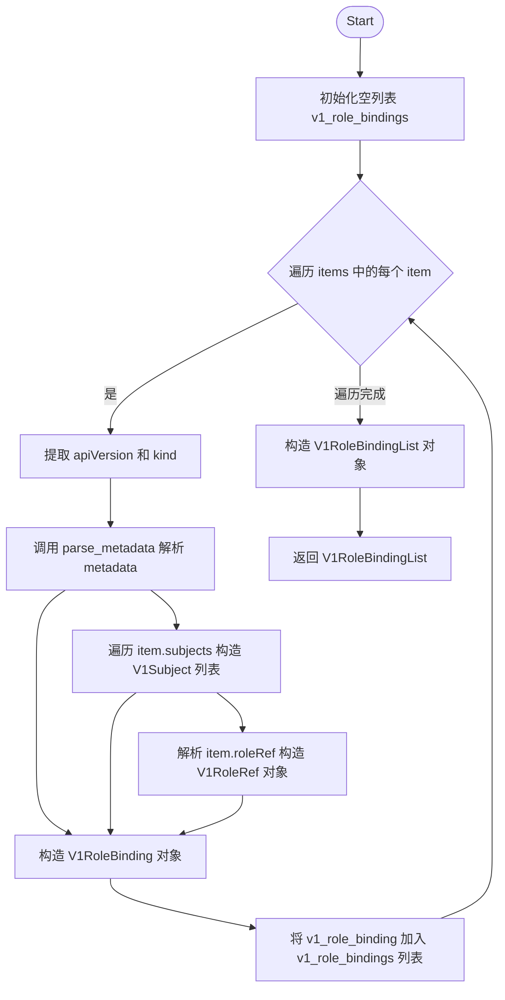

#### 带注释源码

```python
def construct_v1_role_binding_list(self, kind, items):
    """
    将原始的 RoleBinding 资源数据列表转换为 Kubernetes V1RoleBindingList 对象。

    参数:
        kind (str): RoleBinding 的种类 (e.g., "RoleBinding", "ClusterRoleBinding")。
        items (list): 包含 RoleBinding 数据的字典列表。

    返回:
        V1RoleBindingList: 转换后的 Kubernetes API 对象列表。
    """
    v1_role_bindings = []
    # 遍历每一个原始的 RoleBinding 数据项
    for item in items:

       

        # 构造 V1RoleBinding 对象
        v1_role_binding = V1RoleBinding(
            api_version=item['apiVersion'],
            kind=item['kind'],
            # 调用类方法解析 metadata
            metadata =self.parse_metadata(item['metadata']),
            # 解析 subjects 列表，转换为 V1Subject 对象列表
            subjects=[
                V1Subject(
                    kind=subject.get('kind'),
                    name=subject.get('name'),
                    namespace=subject.get('namespace')
                ) for subject in item.get('subjects', [])
            ],
            # 解析 roleRef，转换为 V1RoleRef 对象
            role_ref=V1RoleRef(
                api_group=item['roleRef'].get('apiGroup'),
                kind=item['roleRef'].get('kind'),
                name=item['roleRef'].get('name')
            )
        )
        v1_role_bindings.append(v1_role_binding)

    # 将处理完成的 V1RoleBinding 对象列表包装成 V1RoleBindingList 返回
    return V1RoleBindingList(
        api_version="rbac.authorization.k8s.io/v1",
        kind=f"{kind}List",
        items=v1_role_bindings,
        metadata={'resourceVersion': '1'}
    )
```


### `StaticApiClient.construct_v1_pod_list`

该方法负责将输入文件中的原始 Pod 资源数据（字典列表）转换为 Kubernetes Python 客户端的 `V1Pod` 对象列表，并最终封装在 `V1PodList` 对象中返回。它遍历列表，逐个解析 Pod 的元数据（Metadata）、规格（Spec，包含容器、卷、安全上下文）以及状态（Status），生成符合 Kubernetes API 规范的结构化对象。

参数：

- `kind`：`str`，资源类型，通常指定为 "Pod"。
- `items`：`List[Dict]`，从输入文件中提取的原始 Pod 资源字典列表。

返回值：`V1PodList`，包含转换后的 `V1Pod` 对象集合的 Kubernetes API 列表对象。

#### 流程图

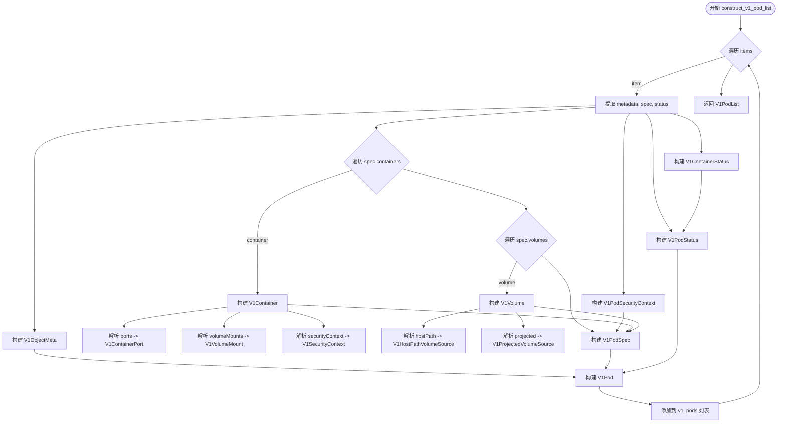

#### 带注释源码

```python
def construct_v1_pod_list(self, kind, items):
    v1_pods = []
    # 遍历输入的每个原始 Pod 数据项
    for item in items:
        # 获取字典中的元数据、规格和状态部分
        metadata = item.get('metadata', {})
        spec = item.get('spec', {})
        status = item.get('status', {})
        
        # 1. 解析并构建 Pod 级别的安全上下文 (Security Context)
        pod_security_context = V1PodSecurityContext(
            run_as_user=spec.get('securityContext', {}).get('runAsUser', None),
            run_as_group=spec.get('securityContext', {}).get('runAsGroup', None),
            fs_group=spec.get('securityContext', {}).get('fsGroup', None),
            se_linux_options=spec.get('securityContext', {}).get('seLinuxOptions', None)
        )
        
        # 2. 解析容器状态 (Container Statuses)
        container_statuses = [
            V1ContainerStatus(
                name=container_status.get('name'),
                ready=container_status.get('ready', False),
                restart_count=container_status.get('restartCount', 0),
                image=container_status.get('image'),
                image_id=container_status.get('imageID'),
                container_id=container_status.get('containerID')
            ) for container_status in status.get('containerStatuses', [])
        ]

        # 3. 构建 V1Pod 对象
        v1_pod = V1Pod(
            api_version=item.get('apiVersion', 'v1'),
            kind=item.get('kind', 'Pod'),
            # 3.1 构建元数据 (Metadata)
            metadata=V1ObjectMeta(
                name=metadata.get('name'),
                namespace=metadata.get('namespace', None),
                labels=metadata.get('labels', {}),
                annotations=metadata.get('annotations', {}),
                creation_timestamp=metadata.get('creationTimestamp', None),
                uid=metadata.get('uid', None),
                resource_version=metadata.get('resourceVersion', None)
            ),
            # 3.2 构建 Pod 规格 (Spec)
            spec=V1PodSpec(
                security_context=pod_security_context,
                service_account=spec.get('serviceAccount', None), 
                service_account_name=spec.get('serviceAccountName', None),
                node_name=spec.get('nodeName', None),
                host_ipc=spec.get('hostIpc', False),
                host_pid=spec.get('hostPid', False),  
                host_network=spec.get('hostNetwork', False),
                restart_policy=spec.get('restartPolicy', 'Always'),
                # 3.2.1 解析容器列表
                containers=[
                    V1Container(
                        name=container['name'],
                        image=container.get('image'),
                        # 解析端口
                        ports=[
                            V1ContainerPort(
                                container_port=port.get('containerPort'),
                                host_port=port.get('hostPort'),
                                protocol=port.get('protocol', 'TCP'), 
                                name=port.get('name', None)
                            ) for port in container.get('ports', [])
                        ],
                        # 解析卷挂载
                        volume_mounts=[  
                            V1VolumeMount(
                                mount_path=volume_mount.get('mountPath'),
                                name=volume_mount.get('name'),
                                read_only=volume_mount.get('readOnly', False)
                            ) for volume_mount in container.get('volumeMounts', [])
                        ],
                        image_pull_policy=container.get('imagePullPolicy'),
                        resources=container.get('resources', {}),
                        # 解析容器安全上下文
                        security_context=V1SecurityContext(
                            run_as_user=container.get('securityContext', {}).get('runAsUser', None),
                            run_as_group=container.get('securityContext', {}).get('runAsGroup', None),
                            privileged=container.get('securityContext', {}).get('privileged', False),
                            allow_privilege_escalation=container.get('securityContext', {}).get('allowPrivilegeEscalation', None),
                            capabilities=V1Capabilities(
                                add=container.get('securityContext', {}).get('capabilities', {}).get('add', []),
                                drop=container.get('securityContext', {}).get('capabilities', {}).get('drop', [])
                            ) if container.get('securityContext', {}).get('capabilities') else None
                        )
                    ) for container in spec.get('containers', [])
                ],
                # 3.2.2 解析卷列表
                volumes=[
                    V1Volume(
                        name=volume.get('name'),
                        empty_dir=volume.get('emptyDir', {}),
                        persistent_volume_claim=volume.get('persistentVolumeClaim', {}),
                        # 解析 HostPath 卷
                        host_path=V1HostPathVolumeSource(
                            path=volume.get('hostPath', {}).get('path', ''),
                            type=volume.get('hostPath', {}).get('type', '')
                        ),
                        # 解析 Projected 卷 (用于 ServiceAccountToken, Secret, ConfigMap, DownwardAPI)
                        projected=V1ProjectedVolumeSource(
                            sources=[
                                V1VolumeProjection(
                                    service_account_token=V1ServiceAccountTokenProjection(
                                        path=source.get('serviceAccountToken', {}).get('path', ''),
                                        expiration_seconds=source.get('serviceAccountToken', {}).get('expirationSeconds', None)
                                    ),
                                    secret=V1SecretProjection(
                                        name=source.get('secret', {}).get('name', None)
                                    ),
                                    config_map=V1ConfigMapProjection(
                                        name=source.get('configMap', {}).get('name', None)
                                    ),
                                    downward_api=V1DownwardAPIProjection(
                                        items=[
                                            V1DownwardAPIVolumeFile(
                                                path=item.get('path'),
                                                field_ref=V1ObjectFieldSelector(
                                                    api_version=item.get('fieldRef', {}).get('apiVersion', 'v1'),
                                                    field_path=item.get('fieldRef', {}).get('fieldPath', '')
                                                )
                                            ) for item in source.get('downwardAPI', {}).get('items', [])
                                        ]
                                    )
                                ) for source in volume.get('projected', {}).get('sources', [])
                            ]
                        )
                    ) for volume in spec.get('volumes', [])
                ]
            ),
            # 3.3 构建状态 (Status)
            status=V1PodStatus(
                phase=status.get('phase', 'Unknown'),  # 默认状态为 'Unknown'
                conditions=status.get('conditions', []),
                container_statuses=container_statuses                
            )
        )
        v1_pods.append(v1_pod)

    # 最终返回 V1PodList 对象
    return V1PodList(
        api_version="v1",
        kind=f"{kind}List",
        items=v1_pods,
        metadata={'resourceVersion': '1'}
    )
```


### `StaticApiClient.list_roles_for_all_namespaces`

这是一个简单的取值器（Accessor）方法，用于返回在客户端初始化时从静态输入文件加载并构建的所有 Kubernetes RBAC Role 资源列表（`V1RoleList`）。

参数：
- 无（该方法仅接收实例属性 `self`）

返回值：`V1RoleList`，返回包含所有 Role 对象的列表。

#### 流程图

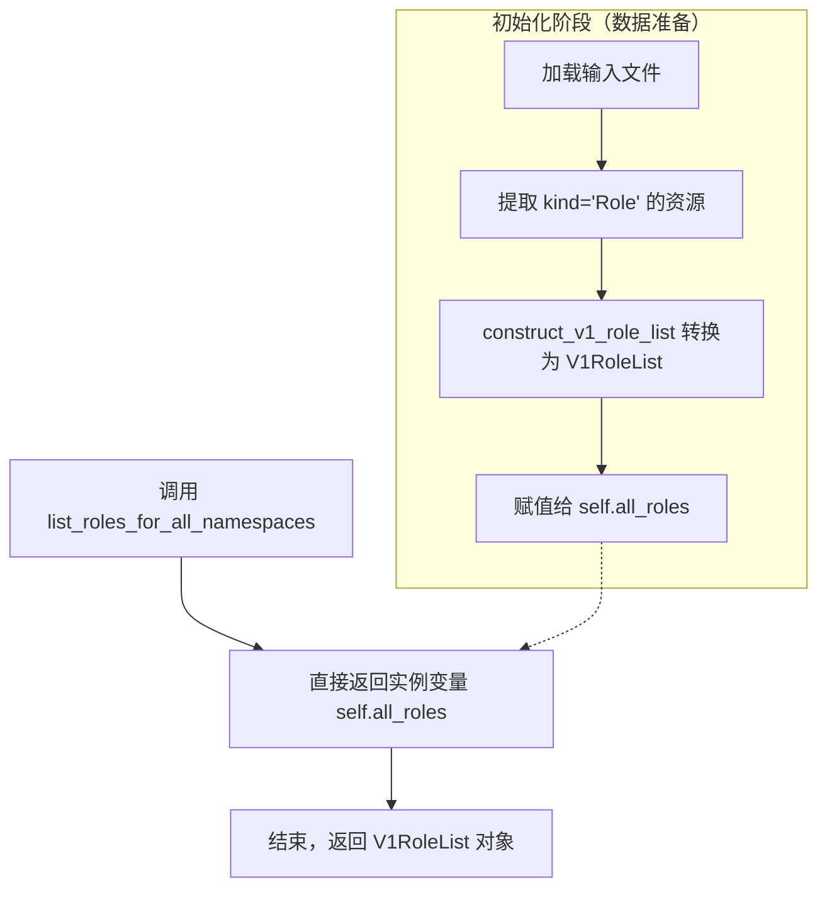

#### 带注释源码

```python
def list_roles_for_all_namespaces(self):
    """
    列出所有命名空间下的 Role。
    
    该方法是一个简单的取值器，返回在 __init__ 阶段预先加载并构建的
    V1RoleList 对象。

    返回:
        V1RoleList: 包含从输入文件中解析出的所有 Role 对象的列表。
    """
    return self.all_roles
```


### `StaticApiClient.list_cluster_role`

该方法用于获取所有ClusterRole资源列表，无需任何参数，直接返回初始化时构建的ClusterRole列表对象。

参数：

-  `self`：`StaticApiClient`，表示类的实例本身

返回值：`V1RoleList`，返回包含所有ClusterRole资源的列表对象

#### 流程图

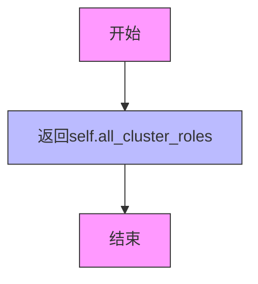

#### 带注释源码

```python
def list_cluster_role(self):
    """
    列出所有ClusterRole资源。
    
    该方法返回在客户端初始化时构建的ClusterRole列表。
    无需任何参数，直接返回self.all_cluster_roles属性。
    
    Returns:
        V1RoleList: 包含所有ClusterRole资源的V1RoleList对象
    """
    return self.all_cluster_roles
```


### `StaticApiClient.list_role_binding_for_all_namespaces`

该方法是一个只读访问器方法（Getter），用于获取在 `StaticApiClient` 初始化时从输入配置文件中解析并构建的所有 Kubernetes `RoleBinding` 资源。它直接返回实例属性 `self.all_role_bindings`，该属性是一个 `V1RoleBindingList` 对象。如果初始化阶段文件加载失败或未找到资源，此处将返回空列表对象。

参数：
- `self`：`StaticApiClient` 类实例本身，无需显式传入。

返回值：`V1RoleBindingList`，返回包含 Kubernetes `V1RoleBinding` 对象的列表结构。

#### 流程图

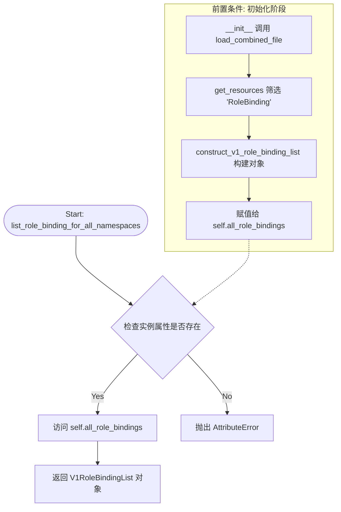

#### 带注释源码

```python
def list_role_binding_for_all_namespaces(self):
    """
    列出所有命名空间下的 RoleBinding。
    
    注意：此方法依赖于 __init__ 阶段构建的 self.all_role_bindings。
    它不从动态的 Kubernetes API 获取数据，而是返回静态文件中的数据副本。
    
    Returns:
        V1RoleBindingList: 包含从输入文件解析出的所有 RoleBinding 资源的列表对象。
                          如果文件中没有 RoleBinding 资源，将返回 items 为空列表的 V1RoleBindingList。
    """
    # 直接返回在构造函数中预先构建好的 RoleBinding 列表对象
    return self.all_role_bindings
```


### `StaticApiClient.list_cluster_role_binding`

该方法用于获取当前加载的所有 ClusterRoleBinding 资源列表，返回存储在 `all_cluster_role_bindings` 中的 ClusterRoleBinding 对象集合。

参数： 无（仅包含隐式参数 `self`）

返回值：`List[V1RoleBinding]`，返回所有 ClusterRoleBinding 对象的列表

#### 流程图

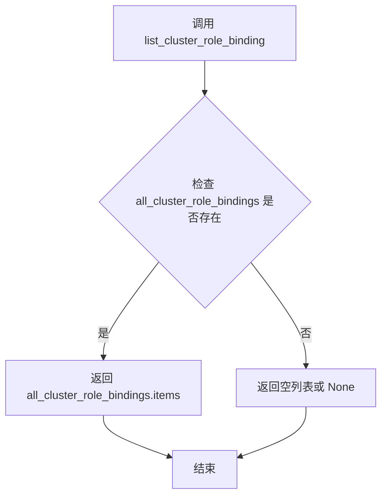

#### 带注释源码

```python
def list_cluster_role_binding(self):
    """
    获取所有 ClusterRoleBinding 资源列表。
    
    该方法直接返回在 __init__ 阶段通过 construct_v1_role_binding_list 方法
    构建的 V1RoleBindingList 对象的 items 属性，即 V1RoleBinding 对象列表。
    
    返回:
        List[V1RoleBinding]: 包含所有 ClusterRoleBinding 资源的列表
    """
    return self.all_cluster_role_bindings.items
```


### `StaticApiClient.read_namespaced_role_binding`

该方法用于在本地加载的 RoleBinding 列表中，根据指定的名称和命名空间查找并返回对应的 RoleBinding 对象。如果未找到匹配的 RoleBinding，则返回 None。

参数：

- `rolebinding_name`：`str`，要查找的 RoleBinding 资源的名称
- `namespace`：`str`，RoleBinding 资源所在的命名空间

返回值：`V1RoleBinding | None`，返回找到的 V1RoleBinding 对象，如果未找到则返回 None

#### 流程图

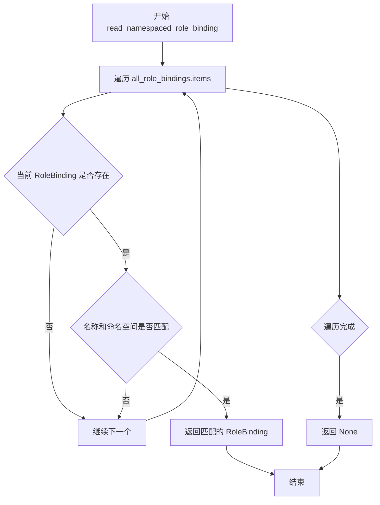

#### 带注释源码

```python
def read_namespaced_role_binding(self, rolebinding_name, namespace):
    """
    根据名称和命名空间查找并返回对应的 RoleBinding 对象。
    
    该方法遍历当前客户端已加载的所有 RoleBinding 资源，
    通过比对 metadata.name 和 metadata.namespace 来定位目标资源。
    
    参数:
        rolebinding_name (str): 要查找的 RoleBinding 的名称
        namespace (str): RoleBinding 所在的命名空间
    
    返回:
        V1RoleBinding | None: 
            - 如果找到匹配的 RoleBinding，返回 V1RoleBinding 对象
            - 如果未找到，返回 None
    """
    # 遍历所有已加载的 RoleBinding 列表
    for rolebinding in self.all_role_bindings.items:
        # 检查当前 RoleBinding 的名称和命名空间是否与请求的参数匹配
        if rolebinding.metadata.name == rolebinding_name and rolebinding.metadata.namespace == namespace:
            # 匹配成功，返回该 RoleBinding 对象
            return rolebinding
    
    # 遍历完所有资源均未匹配，返回 None
    return None
```


### `StaticApiClient.read_namespaced_role`

该方法用于在本地静态数据中查找并返回指定命名空间下的 Role 资源。它通过遍历预先加载的 `self.all_roles` 列表，对比每个 Role 对象的元数据名称（`metadata.name`）和命名空间（`metadata.namespace`）与输入参数是否匹配，从而获取目标 `V1Role` 对象。如果遍历结束未找到匹配项，则返回 `None`。

参数：
- `role_name`：`str`，需要查找的 Role 的名称。
- `namespace`：`str`，需要查找的 Role 所在的命名空间。

返回值：`V1Role | None`，如果存在则返回 `kubernetes.client.V1Role` 对象，否则返回 `None`。

#### 流程图

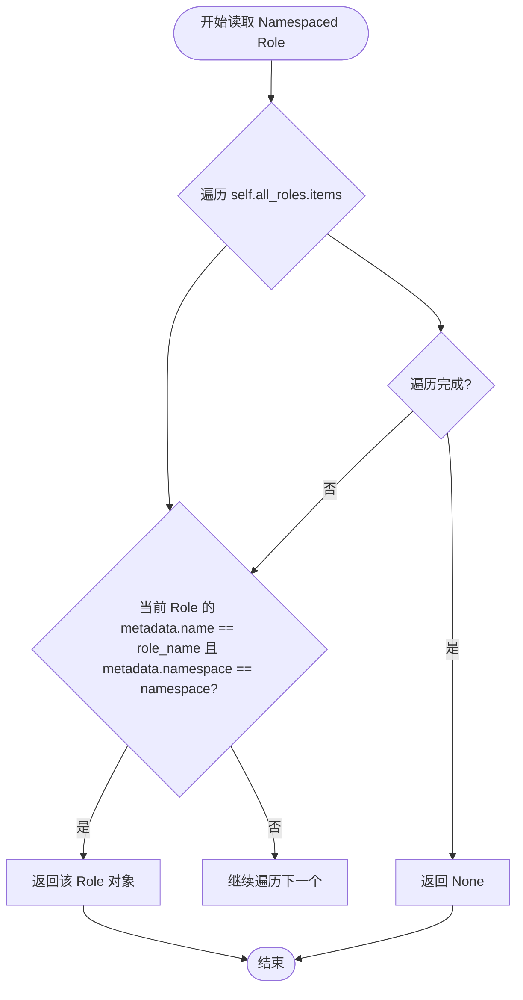

#### 带注释源码

```python
def read_namespaced_role(self, role_name, namespace):
    """
    根据名称和命名空间查找 Role 资源。

    参数:
        role_name (str): Role 的名称。
        namespace (str): Role 所在的命名空间。

    返回:
        V1Role: 找到的 Role 对象，未找到则返回 None。
    """
    # 遍历所有 Role 列表项
    for role in self.all_roles.items:
        # 检查名称和命名空间是否完全匹配
        if role.metadata.name == role_name and role.metadata.namespace == namespace:
            # 匹配成功，返回 V1Role 对象
            return role
    # 遍历结束未找到匹配项，返回 None
    return None
```


### `StaticApiClient.read_cluster_role`

该方法用于从预先加载的 ClusterRole 列表中根据名称查找并返回对应的 ClusterRole（角色）对象。如果在列表中找不到指定名称的角色，则返回 `None`。

参数：

- `role_name`：`str`，需要查找的 ClusterRole 的名称。

返回值：`V1Role` 或 `None`，返回匹配的 `V1Role` 对象（在此实现中代表 ClusterRole），如果未找到则返回 `None`。

#### 流程图

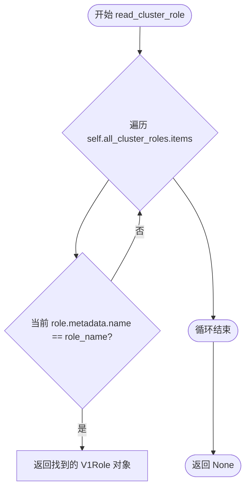

#### 带注释源码

```python
def read_cluster_role(self, role_name):
    """
    根据名称读取指定的 ClusterRole。

    参数:
        role_name (str): ClusterRole 的名称。

    返回:
        V1Role: 如果找到则返回 V1Role 对象，否则返回 None。
    """
    # 遍历所有预加载的 ClusterRole 列表
    for role in self.all_cluster_roles.items:
        # 检查当前角色的元数据名称是否与请求的名称匹配
        if role.metadata.name == role_name:
            # 匹配成功，返回该角色对象
            return role
    # 遍历完所有角色均未匹配，返回 None
    return None
```


### `StaticApiClient.list_pod_for_all_namespaces`

该方法用于获取所有命名空间下的 Pod 列表，返回预先从输入文件中加载并构建的 V1PodList 对象。

参数：

- `watch`：`bool`，（可选）Kubernetes API 的 watch 参数，用于是否开启实时监听，但在当前静态实现中未被使用，保留为 API 兼容性参数

返回值：`V1PodList`，返回所有命名空间的 Pod 列表对象，包含 Pod 的元数据、规格和状态信息

#### 流程图

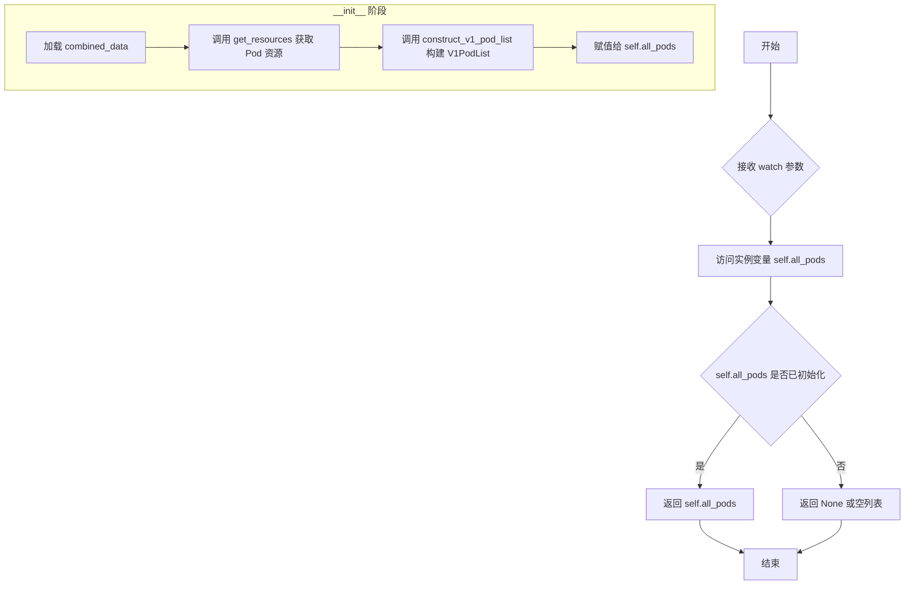

#### 带注释源码

```python
def list_pod_for_all_namespaces(self, watch):
    """
    获取所有命名空间下的 Pod 列表。
    
    该方法返回预先在 __init__ 阶段从输入文件加载并构建的 V1PodList 对象。
    这是一个静态实现，模拟 Kubernetes API 的 list_pod_for_all_namespaces 接口。
    
    参数:
        watch (bool): 保留参数，用于 API 兼容性。当前实现中未被使用。
                     在真实的 Kubernetes Client 中，此参数用于开启 Watch 模式。
    
    返回:
        V1PodList: 包含所有命名空间的 Pod 列表对象。
                  返回的 V1PodList 对象包含以下属性:
                  - api_version: "v1"
                  - kind: "PodList"
                  - items: V1Pod 对象列表
                  - metadata: 包含 resourceVersion 的字典
    
    示例:
        >>> client = StaticApiClient("input.yaml")
        >>> pods = client.list_pod_for_all_namespaces(watch=False)
        >>> for pod in pods.items:
        ...     print(f"{pod.metadata.namespace}/{pod.metadata.name}")
    """
    return self.all_pods
```


### `StaticApiClient.list_namespaced_pod`

该方法根据指定的 namespace 过滤并返回对应命名空间下的 Pod 列表。

参数：

- `namespace`：`str`，目标命名空间名称，用于过滤 Pod

返回值：`V1PodList`，包含指定命名空间中所有 Pod 的 V1PodList 对象

#### 流程图

```mermaid
flowchart TD
    A[开始] --> B[接收 namespace 参数]
    B --> C[遍历 self.all_pods.items]
    C --> D{pod.metadata.namespace == namespace?}
    D -->|是| E[将 Pod 加入 filtered_pods 列表]
    D -->|否| F[跳过该 Pod]
    E --> G{是否还有更多 Pod?}
    F --> G
    G -->|是| C
    G -->|否| H[创建 V1PodList 对象]
    H --> I[设置 api_version='v1']
    I --> J[设置 kind='PodList']
    J --> K[设置 items=filtered_pods]
    K --> L[设置 metadata={'resourceVersion': '1'}]
    L --> M[返回 V1PodList 对象]
    M --> N[结束]
```

#### 带注释源码

```python
def list_namespaced_pod(self, namespace):
    """
    列出指定命名空间下的所有 Pod
    
    参数:
        namespace: str, 目标命名空间名称
        
    返回:
        V1PodList: 包含指定命名空间中所有 Pod 的列表对象
    """
    # 根据 namespace 过滤 Pod 列表
    # 遍历所有 Pod，筛选出 namespace 匹配的 Pod
    filtered_pods = [pod for pod in self.all_pods.items if pod.metadata.namespace == namespace]

    # 返回过滤后的 Pod 列表，封装为 V1PodList 对象
    return V1PodList(
        api_version="v1",                          # Kubernetes API 版本
        kind="PodList",                             # 资源类型
        items=filtered_pods,                        # 过滤后的 Pod 列表
        metadata={'resourceVersion': '1'}          # 元数据信息
    )
```

## 关键组件


### 文件加载与格式检测 (load_combined_file)

负责加载输入的 YAML 或 JSON 文件，根据文件扩展名自动识别格式，并使用相应的解析器（yaml.safe_load_all 或 json.load）读取内容

### 资源过滤与提取 (get_resources)

从加载的组合数据中提取指定 kind 类型的资源条目，支持多文档处理和列表遍历

### 元数据解析 (parse_metadata)

将字典格式的元数据转换为 Kubernetes V1ObjectMeta 对象，特别处理 creationTimestamp 时间戳字段的格式转换

### Role 列表构建 (construct_v1_role_list)

将原始 Role/ClusterRole 资源数据转换为 Kubernetes V1RoleList 对象，包含策略规则 (V1PolicyRule) 的完整映射

### RoleBinding 列表构建 (construct_v1_role_binding_list)

将原始 RoleBinding/ClusterRoleBinding 资源数据转换为 Kubernetes V1RoleBindingList 对象，包含 subjects 和 role_ref 的完整映射

### Pod 列表构建 (construct_v1_pod_list)

将原始 Pod 资源数据转换为 Kubernetes V1PodList 对象，包含完整的 Pod 规范（容器、卷、安全上下文、卷挂载等）和状态信息（容器状态、阶段等）

### 角色查询接口 (list_roles_for_all_namespaces / read_namespaced_role / read_cluster_role)

提供命名空间级别和集群级别的 Role 查询功能，支持按名称精确匹配查找

### RoleBinding 查询接口 (list_role_binding_for_all_namespaces / read_namespaced_role_binding)

提供 RoleBinding 资源的查询功能，支持跨命名空间查找和按名称精确匹配

### Pod 查询接口 (list_pod_for_all_namespaces / list_namespaced_pod)

提供全局和命名空间级别的 Pod 列表查询，支持按命名空间过滤返回结果


## 问题及建议


### 已知问题

-   **硬编码的 metadata**：多处使用 `metadata={'resourceVersion': '1'}`，这是硬编码的占位符，不反映真实数据状态，可能导致版本冲突或缓存问题。
-   **不一致的错误处理**：`load_combined_file` 返回 `None` 表示失败，但调用方仅做 `if self.combined_data` 检查，错误信息被打印后无法传递给上层调用者，导致静默失败。
-   **YAML/JSON 数据结构不一致**：`yaml.safe_load_all` 返回文档列表（list），而 `json.load` 返回对象（dict），导致 `get_resources` 方法中 `for entry in self.combined_data` 的遍历逻辑在处理 JSON 时行为不一致。
-   **时间解析缺乏异常保护**：`parse_metadata` 中 `datetime.strptime` 没有 try-except 包裹，若时间格式不符合预期会抛出未捕获的异常。
-   **未使用的导入**：导入了 `V1VolumeProjection`、`V1DownwardAPIProjection` 等类型但在代码中未直接使用。
-   **重复代码模式**：`construct_v1_role_list`、`construct_v1_role_binding_list` 和 `construct_v1_pod_list` 存在大量重复的列表处理逻辑，可抽象为通用方法。
-   **命名不一致**：`list_cluster_role` 返回 `V1RoleList`，而 `list_cluster_role_binding` 返回 `.items`（列表），`read_cluster_role` 返回单个对象但 `list_cluster_role_binding` 返回列表，违背 Kubernetes API 惯例。
-   **未清理的注释代码**：`construct_v1_role_binding_list` 方法中存在被注释掉的空行，可能是未完成的代码遗留。
-   **缺少参数校验**：`read_namespaced_role_binding`、`read_namespaced_role`、`read_cluster_role` 等方法未检查输入参数是否为 `None`。

### 优化建议

-   **统一错误传播机制**：使用自定义异常类或返回 Result/Either 类型，让调用方能够区分"资源不存在"和"加载失败"等不同状态。
-   **统一数据结构**：在加载文件后统一将数据转换为列表格式，或在 `get_resources` 中分别处理 YAML 多文档和 JSON 对象两种情况。
-   **添加类型注解和文档字符串**：为所有方法添加参数和返回值的类型提示，以及描述其功能的 docstring，提升可维护性。
-   **抽取公共方法**：将 `V1PolicyRule`、`V1Subject`、`V1RoleRef` 等对象的构造逻辑抽象为工厂方法，减少重复代码。
-   **修复时间解析**：使用 `try-except` 包裹时间解析逻辑，解析失败时返回 `None` 或记录警告日志。
-   **移除未使用的导入**：清理未使用的 Kubernetes 类型导入，或补全其使用逻辑。
-   **规范化 API 方法返回值**：确保同类型方法返回一致的包装对象（如 `V1RoleList` 或列表），遵循 Kubernetes Python 客户端的惯例。
-   **添加输入校验**：在查询方法中检查 `namespace`、`role_name` 等参数是否为 `None` 或空字符串，防止无效遍历。

## 其它


### 设计目标与约束

本代码的设计目标是提供一个静态API客户端，能够从本地JSON/YAML文件中加载Kubernetes RBAC资源（Role、ClusterRole、RoleBinding、ClusterRoleBinding）和Pod资源，并将其转换为Kubernetes Python客户端的V1对象模型，以便于在不需要实际Kubernetes集群连接的情况下进行资源分析和测试。设计约束包括：仅支持.json和.yaml格式的输入文件；文件必须遵循Kubernetes资源清单格式；不支持实时watch机制；所有数据加载为一次性操作，不支持增量更新。

### 错误处理与异常设计

代码采用基础异常处理机制，主要通过try-except捕获文件读取异常（FileNotFoundError）和通用异常（Exception），错误时返回None并打印错误信息。当前实现缺少细粒度的异常分类，建议增加自定义异常类如InvalidResourceFormatException、UnsupportedKindException、MetadataParseException等，以便调用方进行针对性处理。构造函数中的数据加载失败会导致后续方法调用时可能产生AttributeError，建议增加数据有效性验证并在获取资源时进行空值检查。

### 数据流与状态机

数据流分为三个主要阶段：第一阶段为文件加载（load_combined_file），根据文件扩展名判断格式并解析；第二阶段为资源提取（get_resources），从加载的数据中筛选指定kind的资源；第三阶段为对象构造（construct_v_*_list方法），将原始字典转换为Kubernetes Python客户端对象。状态机方面，客户端初始化后处于就绪状态，可执行读操作（list_*、read_*方法），所有资源对象在内存中以列表形式缓存，不支持写操作和状态变迁。

### 外部依赖与接口契约

主要外部依赖包括：kubernetes Python客户端库（提供V1Role、V1Pod等对象模型）、PyYAML（用于解析YAML格式）、Python标准库json和os模块。接口契约方面，构造函数接收input_file参数（字符串类型），返回值为None或解析后的数据对象；list_*方法返回对应资源的List对象（V1RoleList、V1PodList等）；read_*方法返回单个资源对象或None；get_resources方法接收kind字符串参数，返回资源字典列表。

### 性能考虑

当前实现存在性能优化空间：get_resources方法在每次调用时都遍历combined_data，建议在初始化时缓存所有资源；construct_v1_pod_list方法中大量使用字典get操作和嵌套循环，可考虑使用局部变量缓存以减少字典查找开销；文件加载使用yaml.safe_load_all返回生成器，但随后将其转换为列表，可能在大文件场景下占用较多内存。建议：对于大型文件采用流式处理；增加资源缓存机制；考虑使用__slots__减少对象内存占用。

### 安全性考虑

代码主要处理本地文件读取，需注意输入文件的来源和内容信任问题。当前实现未对输入文件进行Schema验证，恶意构造的JSON/YAML可能导致解析异常或安全问题（如XML外部实体注入虽然Python yaml默认安全，但需注意特殊配置）。建议增加输入Schema验证机制；添加文件大小限制以防止DoS攻击；对敏感信息（如token、secret）进行脱敏处理后再返回。

### 测试策略

建议建立以下测试用例：文件加载测试（JSON格式、YAML格式、不支持格式、文件不存在）；资源提取测试（空数据、单一资源、多种资源混合）；对象构造测试（完整字段、缺失字段、边界值）；方法返回测试（list_roles_for_all_namespaces、read_namespaced_role等）；异常场景测试（无效输入、数据损坏）。建议使用pytest框架，构造测试fixture模拟不同场景的输入文件。

### 版本兼容性

代码依赖kubernetes客户端库的特定对象（V1Role、V1Pod等），需确保与客户端版本兼容。当前硬编码了api_version（如"rbac.authorization.k8s.io/v1"、"v1"），建议提取为常量以便版本升级。yaml.safe_load_all的使用需确认PyYAML版本兼容性。建议在requirements.txt中明确指定依赖版本范围，并进行跨版本测试。

### 使用示例

```python
# 初始化客户端
client = StaticApiClient("k8s-resources.yaml")

# 列出所有角色
roles = client.list_roles_for_all_namespaces()
for role in roles.items:
    print(f"Role: {role.metadata.name}")

# 读取指定命名空间的Pod
pods = client.list_namespaced_pod("default")
for pod in pods.items:
    print(f"Pod: {pod.metadata.name}, Status: {pod.status.phase}")

# 读取特定角色绑定
role_binding = client.read_namespaced_role_binding("my-role-binding", "default")
```

### 已知限制

不支持实时与Kubernetes API Server交互；不支持资源的创建、更新、删除操作；不支持watch机制；不支持自定义资源定义（CRD）；所有时间戳仅支持RFC3339格式（%Y-%m-%dT%H:%M:%SZ）；不支持多文档YAML的部分加载；资源版本（resourceVersion）硬编码为"1"；不支持Pod的某些高级特性如ephemeralContainers、initContainers的完整映射。

### 扩展性设计

建议以下扩展方向：增加缓存机制支持增量更新；添加资源过滤和查询接口（支持标签选择器、字段选择器）；实现更多Kubernetes资源类型的支持（如Deployment、Service、ConfigMap等）；添加资源转换器支持将V1对象反向导出为YAML/JSON；增加插件机制支持自定义资源处理逻辑；支持从多个文件或目录批量加载；实现资源关系图谱构建（如RoleBinding引用的Role）。

    