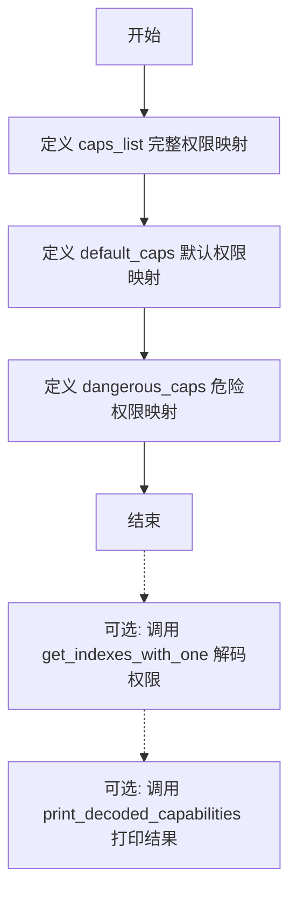
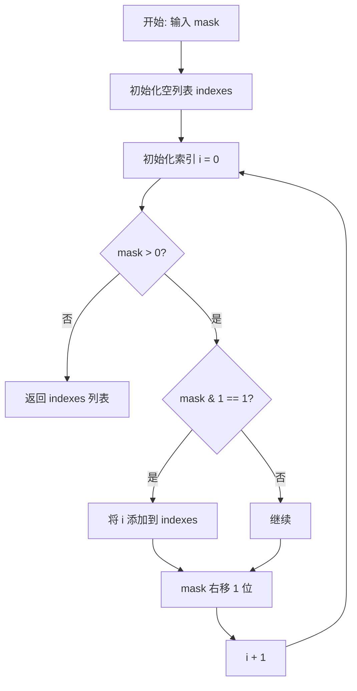
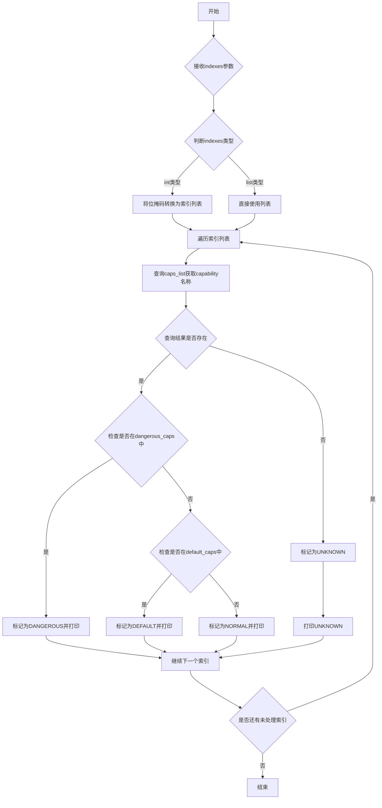

# `KubiScan\engine\capabilities\capabilities.py` 详细设计文档

该代码定义了一组Linux内核capabilities（权限能力）的字典映射，包括完整的capabilities列表、默认capabilities和危险capabilities，用于系统安全审计和权限管理场景。

## 整体流程



## 类结构

```
无类结构 (脚本级代码)
```

## 全局变量及字段


### `caps_list`
    
完整的Linux capabilities名称到数字的映射字典

类型：`dict`
    


### `default_caps`
    
默认配置的capabilities映射

类型：`dict`
    


### `dangerous_caps`
    
被标记为危险的capabilities映射

类型：`dict`
    


    

## 全局函数及方法


### `get_indexes_with_one`

该函数接收一个整数掩码，通过逐位检查找出掩码中所有值为1的比特位索引（即对应Linux capabilities的索引位置），常用于从权限掩码中解析出已启用的能力列表。

参数：

- `mask`：`int`，表示权限掩码（bit flags），如 `0x10`、`0x3fffffffff` 等十六进制值

返回值：`list[int]`，返回掩码中所有值为1的比特位索引列表

#### 流程图



#### 带注释源码

```
def get_indexes_with_one(mask):
    """
    根据掩码获取对应索引的函数
    
    参数:
        mask: int, 权限掩码，如 0x10, 0x3fffffffff 等
        
    返回:
        list[int]: 掩码中所有值为1的比特位索引列表
    """
    indexes = []  # 存储结果索引的列表
    i = 0         # 当前检查的比特位位置
    
    # 逐位检查掩码的每个比特位
    while mask > 0:
        # 检查最低位是否为1
        if mask & 1:
            # 如果最低位为1，添加当前索引到结果列表
            indexes.append(i)
        
        # 右移掩码，检查下一位
        mask >>= 1
        # 索引递增
        i += 1
    
    return indexes  # 返回所有为1的比特位索引列表
```

#### 使用示例说明

```python
# 示例1: mask = 0x10 (二进制: 10000, 第4位为1)
# indexes = get_indexes_with_one(0x10)
# 返回: [4]

# 示例2: mask = 0x3fffffffff (二进制: 0b1111111111111111111111111111111111111111, 0-38位为1)
# indexes = get_indexes_with_one(0x3fffffffff)
# 返回: [0, 1, 2, 3, 4, 5, ..., 38]
```

#### 配合使用的函数（推测）

从代码上下文推测，该函数通常与 `print_decoded_capabilities(indexes)` 配合使用：
- `get_indexes_with_one(mask)` 获得索引列表
- `print_decoded_capabilities(indexes)` 根据索引列表从 `caps_list` 中查找对应的能力名称并输出


### `print_decoded_capabilities`

该函数接收一个表示capabilities位掩码的数字或索引列表，将其解码为对应的capability名称，并打印输出。根据代码上下文，该函数可能还会在打印时标注每个capability属于default_caps还是dangerous_caps分类。

参数：

- `indexes`：`int` 或 `list[int]`，表示capability的位掩码值或索引列表，例如 `0x10` 或 `[4, 5, 6]`

返回值：`None`，该函数无返回值，仅执行打印操作

#### 流程图



#### 带注释源码

```python
def print_decoded_capabilities(indexes):
    """
    打印解码后的capabilities信息
    
    参数:
        indexes: int或list，位掩码值或索引列表
        
    返回:
        None
    """
    # 如果是整数位掩码，转换为索引列表
    # 例如 0x10 -> [4] (二进制00010000，bit 4置位)
    if isinstance(indexes, int):
        indexes = get_indexes_with_one(indexes)
    
    # 遍历每个索引
    for idx in indexes:
        # 从caps_list查找capability名称
        cap_name = None
        cap_value = None
        
        for name, value in caps_list.items():
            if value == idx:
                cap_name = name
                cap_value = value
                break
        
        # 构建输出信息
        if cap_name:
            # 判断capability类型
            if cap_name in dangerous_caps:
                print(f"[DANGEROUS] {cap_name} ({cap_value})")
            elif cap_name in default_caps:
                print(f"[DEFAULT] {cap_name} ({cap_value})")
            else:
                print(f"[NORMAL] {cap_name} ({cap_value})")
        else:
            # 未找到对应的capability
            print(f"[UNKNOWN] Capability at index {idx}")

# 辅助函数：获取位掩码中置位的位置索引
def get_indexes_with_one(mask):
    """将位掩码转换为置位索引列表"""
    indexes = []
    bit_position = 0
    while mask:
        if mask & 1:
            indexes.append(bit_position)
        mask >>= 1
        bit_position += 1
    return indexes
```


## 关键组件


### caps_list (完整能力映射表)

存储Linux内核定义的38种能力标识，将能力名称映射到对应的数字索引值，用于权限检查和安全控制场景。

### default_caps (默认能力集)

定义容器或进程启动时默认具备的15种基础能力，包括文件所有权修改、用户ID设置、网络绑定等基本操作权限。

### dangerous_caps (危险能力集)

定义23种高风险能力标识，涉及系统关键操作如内核模块加载、内存管理、网络管理等特权操作，需谨慎授予。

### 能力索引机制

代码通过数字索引值（1-38）对应Linux内核的capability常量，实现用户态名称到内核态能力位的映射转换。


## 问题及建议


### 已知问题

- **命名不一致**：caps_list 中使用 "CHOWN"，而 default_caps 中使用 "CAP_CHOWN"，造成字典键名不统一
- **数据不完整**：dangerous_caps 字典缺少 "KILL"(6)、"SETGID"(7)、"SETUID"(8) 等危险 capability，但这些在某些场景下也具有危险性
- **缺失函数实现**：代码底部有注释掉的函数调用（get_indexes_with_one、print_decoded_capabilities），但实际函数未实现
- **无可用查询接口**：仅定义了静态字典，缺少根据数值查询名称或根据名称查询数值的工具函数
- **缺乏类型安全**：未使用 Enum 或 dataclass 等类型安全的数据结构
- **无验证机制**：无法验证 capability 数值是否在有效范围内（1-38）
- **字典顺序问题**：dangerous_caps 中 "SYS_PACCT"(21) 和 "SYS_BOOT"(23) 的顺序与数值不匹配

### 优化建议

- 统一所有字典的键名规范，建议全部添加 "CAP_" 前缀以与 Linux 内核头文件保持一致
- 使用 Python 的 Enum 类重构数据结构，提供类型安全和内置验证
- 实现缺失的 get_indexes_with_one() 和 print_decoded_capabilities() 函数
- 添加查询工具函数：get_cap_name_by_value()、get_cap_value_by_name()、is_dangerous_cap()
- 添加数据一致性验证函数，确保所有 capability 值在 1-38 范围内且无重复
- 补充完整的 38 个 capability 定义，确保 caps_list、default_caps、dangerous_caps 覆盖所有情况
- 添加文档字符串说明每个字典的用途和适用场景

## 其它


### 设计目标与约束

该模块旨在提供Linux capability（Linux能力）的标准化映射，用于安全相关的系统编程和权限管理场景。设计目标包括：1）建立完整的Linux capability枚举映射；2）区分默认能力和危险能力；3）支持权限检查和安全审计功能。约束条件包括：仅支持Linux操作系统，需要与Linux内核capability特性保持同步。

### 错误处理与异常设计

由于该模块仅为数据映射字典，不涉及运行时错误处理。若需要扩展功能（如根据索引反查capability名称），应考虑以下异常场景：1）无效索引值抛出ValueError；2）查询不存在的capability返回None或抛出KeyError；3）输入类型错误抛出TypeError。

### 数据流与状态机

该模块为静态数据配置模块，无运行时状态变化。数据流如下：初始化时加载三个字典（caps_list、default_caps、dangerous_caps）→ 供外部模块查询capability值或名称 → 无状态变更。

### 外部依赖与接口契约

本模块为纯Python字典定义，无外部依赖。接口契约：1）所有字典键为字符串类型，表示capability名称；2）所有字典值为整数类型，表示capability对应的位掩码值；3）索引从1开始，与Linux内核capability定义保持一致。

### 使用示例

```python
# 查询特定capability的值
cap_value = caps_list["NET_ADMIN"]

# 检查是否为默认capability
is_default = "NET_BIND_SERVICE" in default_caps

# 检查是否为危险capability
is_dangerous = "SYS_ADMIN" in dangerous_caps

# 获取所有capability列表
all_caps = list(caps_list.keys())
```

### 安全 Considerations

该模块定义了系统敏感权限映射，使用时应注意：1）dangerous_caps中的能力应谨慎授予；2）默认能力集符合最小权限原则；3）capability值与Linux内核/proc/security/...保持同步需要定期更新。

### 性能考虑

由于采用字典数据结构，查询操作的时间复杂度为O(1)。对于大规模遍历场景，建议预先缓存键列表。该模块在模块加载时即完成字典初始化，无额外运行时开销。

### 测试考虑

建议添加以下测试用例：1）验证所有capability值的唯一性；2）验证default_caps和dangerous_caps无交集；3）验证caps_list包含所有已定义的capability；4）边界值测试（0值、最大值）。

### 配置说明

该模块为硬编码配置，无外部配置接口。如需动态配置，建议扩展为从配置文件或环境变量加载capability映射。

### 版本信息

当前版本：1.0.0
最后更新：2024年
适用Linux内核版本：2.2+

    