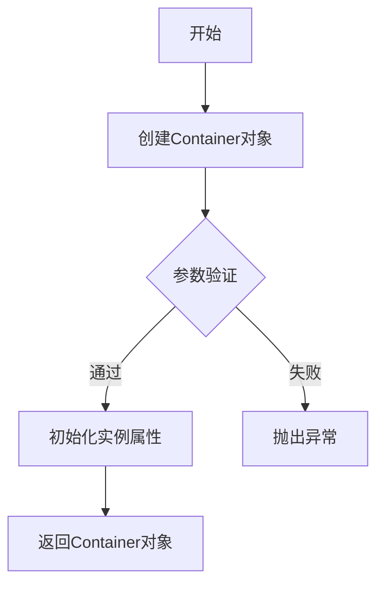
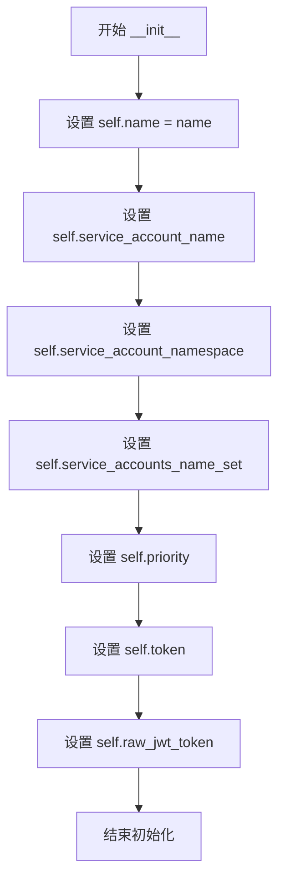

# `KubiScan\engine\container.py` 详细设计文档

这是一个用于表示容器配置的Python类，封装了容器的基本属性包括名称、服务账户信息、优先级以及认证令牌等核心字段，用于在Kubernetes等容器编排系统中传递和管理容器配置信息。

## 整体流程



## 类结构

```
Container (容器配置类)
```

## 全局变量及字段


### `Container.name`
    
容器名称

类型：`str`
    


### `Container.service_account_name`
    
服务账户名称

类型：`str`
    


### `Container.service_account_namespace`
    
服务账户命名空间

类型：`str`
    


### `Container.service_accounts_name_set`
    
服务账户名称集合

类型：`set`
    


### `Container.priority`
    
容器优先级

类型：`int`
    


### `Container.token`
    
认证令牌

类型：`str`
    


### `Container.raw_jwt_token`
    
原始JWT令牌

类型：`str`
    
    

## 全局函数及方法


### `Container.__init__`

构造函数，用于初始化容器对象，设置容器的名称、服务账户信息、优先级和令牌等属性。

参数：

- `name`：`str`，容器名称，用于标识容器
- `service_account_name`：`str | None`，服务账户名称，关联到容器的服务账户
- `service_account_namespace`：`str | None`，服务账户所在的命名空间
- `service_accounts_name_set`：`set | None`，服务账户名称集合，用于存储多个服务账户
- `priority`：`int | None`，容器的优先级，用于调度和资源分配
- `token`：`str | None`，认证令牌，用于容器身份验证
- `raw_jwt_token`：`str | None`，原始JWT令牌，包含完整的JWT认证信息

返回值：`None`，构造函数不返回值，仅初始化对象状态

#### 流程图



#### 带注释源码

```python
class Container:
    def __init__(self, name, service_account_name=None, service_account_namespace=None, service_accounts_name_set=None, priority=None, token=None, raw_jwt_token=None):
        """
        构造函数，用于初始化容器对象
        
        参数:
            name: 容器名称，用于标识容器
            service_account_name: 服务账户名称，关联到容器的服务账户
            service_account_namespace: 服务账户所在的命名空间
            service_accounts_name_set: 服务账户名称集合，用于存储多个服务账户
            priority: 容器的优先级，用于调度和资源分配
            token: 认证令牌，用于容器身份验证
            raw_jwt_token: 原始JWT令牌，包含完整的JWT认证信息
        """
        # 设置容器名称
        self.name = name
        # 设置服务账户名称
        self.service_account_name = service_account_name
        # 设置服务账户命名空间
        self.service_account_namespace = service_account_namespace
        # 设置服务账户名称集合
        self.service_accounts_name_set = service_accounts_name_set
        # 设置容器优先级
        self.priority = priority
        # 设置认证令牌
        self.token = token
        # 设置原始JWT令牌
        self.raw_jwt_token = raw_jwt_token
```

## 关键组件


### Container 类

用于封装容器配置信息的核心类，存储容器名称、服务账户相关信息、优先级以及认证令牌等元数据。

### 文件整体运行流程

该代码定义了一个数据容器类，用于在系统中传递和存储容器相关的配置信息。实例化时接收可选参数，初始化后可通过对象属性访问配置内容。

### 类字段详细信息

- **name**: str，容器名称标识
- **service_account_name**: str 或 None，关联的服务账户名称
- **service_account_namespace**: str 或 None，服务账户所在的命名空间
- **service_accounts_name_set**: 集合类型或 None，服务账户名称集合
- **priority**: 整数或 None，容器优先级
- **token**: 字符串或 None，认证令牌
- **raw_jwt_token**: 字符串或 None，原始JWT令牌

### 类方法详细信息

#### __init__ 方法

- **参数**:
  - name: str，容器名称
  - service_account_name: str 或 None，服务账户名称
  - service_account_namespace: str 或 None，服务账户命名空间
  - service_accounts_name_set: 集合或 None，服务账户名称集合
  - priority: 整数或 None，优先级
  - token: 字符串或 None，认证令牌
  - raw_jwt_token: 字符串或 None，原始JWT令牌
- **返回值**: None
- **描述**: 构造函数，初始化容器对象的各项属性

### 关键组件信息

- **Container 类**: 核心数据结构，用于存储容器配置和服务账户认证信息
- **JWT 令牌管理**: 支持存储原始 JWT 令牌和解析后的 token
- **服务账户配置**: 支持多服务账户名称集合配置

### 潜在技术债务或优化空间

- 缺少属性验证逻辑，输入参数未做类型校验
- 未实现 __repr__ 或 __str__ 方法，不利于调试
- 缺少序列化/反序列化方法（如 to_dict, from_dict）
- 未定义默认值处理机制，部分字段为 None 时业务逻辑不明确

### 其它项目

- **设计目标**: 提供统一的容器配置对象封装
- **约束**: 参数均为可选，初始化灵活
- **错误处理**: 当前无异常处理机制，需调用方保证参数合法性
- **数据流**: 作为数据传递对象，在业务逻辑层间流转
- **外部依赖**: 无外部依赖，纯Python内置类型


## 问题及建议


### 已知问题

-   **缺少类型注解**：所有构造函数参数和实例变量均无类型声明，不利于静态分析和IDE智能提示
-   **缺少默认值处理**：除 `name` 外，其他参数均为必填参数但无默认值，降低了类的使用灵活性
-   **缺少文档字符串**：类本身无 docstring，无法快速理解类的用途和使用场景
-   **无参数验证**：构造函数未对输入参数进行有效性校验（如 priority 应为整数、name 不能为空等）
-   **缺少调试辅助方法**：未实现 `__repr__` 方法，在调试时难以查看对象状态
-   **命名不一致**：`service_accounts_name_set` 使用复数形式 "accounts"，而其他参数使用单数形式，风格不统一
-   **参数顺序不合理**：`name` 作为必填参数应放在可选参数之后，更符合 Python 惯例
-   **缺少对象比较能力**：未实现 `__eq__` 和 `__hash__` 方法，不支持对象相等性比较和集合操作
-   **敏感信息处理缺失**：`token` 和 `raw_jwt_token` 为敏感字段，无明确的访问控制或保护机制

### 优化建议

-   使用 `@dataclass` 装饰器简化代码，自动生成 `__init__`、`__repr__`、`__eq__` 等方法
-   为所有参数添加类型注解，明确各字段的数据类型
-   为可选参数设置合理的默认值（如 `service_account_name` 等默认为 `None`）
-   添加类级别的文档字符串，说明类的核心职责
-   实现参数验证逻辑，可考虑使用 Pydantic 或 attrs 库进行自动校验
-   统一命名风格，建议将 `service_accounts_name_set` 改为 `service_account_names` 或与其它参数保持一致的命名
-   添加 `__repr__` 方法便于调试输出
-   考虑为敏感字段（token 相关）提供只读属性或封装方法


## 其它


### 设计目标与约束

设计目标：该类用于封装Kubernetes容器的配置信息，提供统一的容器对象建模，支持服务账户、优先级和JWT令牌等关键属性的初始化与管理。

设计约束：
- 该类为纯数据类，无业务逻辑处理能力
- 参数均为可选，支持灵活配置
- 当前版本仅支持属性设置，无验证逻辑
- 适用于配置初始化场景，不涉及运行时状态管理

### 错误处理与异常设计

当前实现未包含错误处理与异常机制：
- 构造函数未对输入参数进行类型校验
- 未对必填字段（如name）进行空值检查
- 未定义自定义异常类
- 建议增加参数类型校验和必填字段验证

### 数据流与状态机

数据流分析：
- 输入：外部调用者传入容器配置参数
- 处理：构造函数接收参数并赋值给实例属性
- 输出：Container对象实例，供其他模块使用

状态机：该类为静态配置类，不涉及状态机设计

### 外部依赖与接口契约

外部依赖：无明确外部依赖

接口契约：
- 构造函数参数：name(str, 必填), service_account_name(str, 可选), service_account_namespace(str, 可选), service_accounts_name_set(set, 可选), priority(int/str, 可选), token(str, 可选), raw_jwt_token(str, 可选)
- 返回值：Container类实例
- 调用方需自行保证参数合法性和类型正确性

### 性能要求

- 构造函数执行时间应<1ms
- 内存占用最小化，仅存储传入属性
- 无I/O操作，无网络请求

### 安全性考虑

- raw_jwt_token和token可能包含敏感信息，建议增加加密存储或脱敏处理
- 当前实现明文存储敏感数据，需注意内存安全
- 建议增加属性访问控制，限制敏感字段读取

### 兼容性设计

- 当前版本：Python 3.x
- 建议增加__repr__方法便于调试
- 建议增加__eq__和__hash__方法支持对象比较

### 测试策略

建议测试用例：
- 正常构造：所有参数均传入
- 最小构造：仅传入name
- 边界情况：空字符串、None值、特殊字符
- 类型验证：各参数类型正确性
- 对象比较：相等性判断

### 配置管理

当前实现不支持配置持久化：
- 无序列化方法（to_dict/to_json）
- 无反序列化方法（from_dict/from_json）
- 建议增加配置导入导出能力

### 扩展性建议

当前类功能单一，扩展方向：
- 增加属性验证方法
- 增加序列化/反序列化支持
- 增加配置合并方法（merge）
- 增加默认值管理
- 考虑使用dataclass或pydantic替代


    