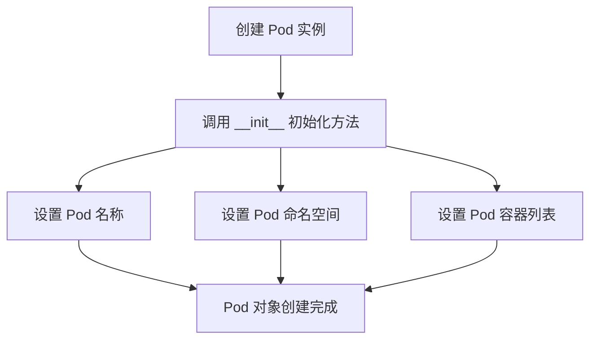
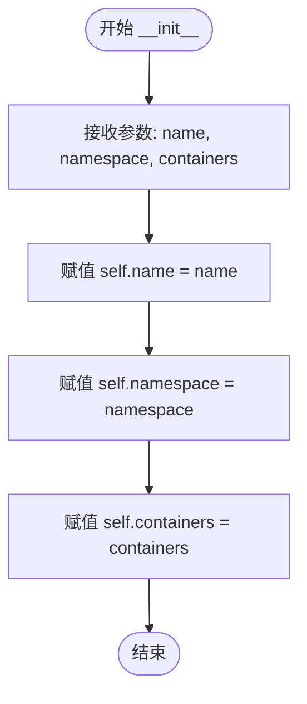

# `KubiScan\engine\pod.py` 详细设计文档

该代码定义了一个基础的 Pod 类，用于表示 Kubernetes 中的 Pod 对象模型，包含名称（name）、命名空间（namespace）和容器列表（containers）三个核心属性，用于封装 Pod 的基本结构和初始化逻辑。

## 整体流程



## 类结构

```
Pod (Pod 模型类)
└── __init__ (初始化方法)
```

## 全局变量及字段


### `Pod.name`
    
Pod 的名称，用于标识 Pod 对象

类型：`str`
    


### `Pod.namespace`
    
Pod 所属的命名空间，用于资源隔离

类型：`str`
    


### `Pod.containers`
    
Pod 中包含的容器列表

类型：`list`
    
    

## 全局函数及方法


### `Pod.__init__`

这是 Pod 类的构造函数，用于初始化 Pod 对象的核心属性，包括名称、命名空间和容器列表。

参数：

-  `name`：`str`，Pod 的名称
-  `namespace`：`str`，Pod 所属的命名空间
-  `containers`：`list`，容器对象列表

返回值：`None`，构造函数无返回值，仅初始化对象属性

#### 流程图



#### 带注释源码

```python
class Pod:
    def __init__(self, name, namespace, containers):
        """
        Pod 类的构造函数，初始化 Pod 的核心属性
        
        参数:
            name: Pod 的名称，用于唯一标识一个 Pod
            namespace: Pod 所属的命名空间，用于资源隔离
            containers: 容器对象列表，包含 Pod 中运行的所有容器
        """
        # 将传入的 name 参数赋值给实例属性 name
        self.name = name
        # 将传入的 namespace 参数赋值给实例属性 namespace
        self.namespace = namespace
        # 将传入的 containers 参数赋值给实例属性 containers
        self.containers = containers
```

## 关键组件


### Pod 类
表示 Kubernetes Pod 的核心数据结构，用于封装 Pod 的基本属性

### name 字段
Pod 的名称标识，用于唯一识别 Pod 对象

### namespace 字段
Pod 所在的 Kubernetes 命名空间，用于资源隔离和管理

### containers 字段
Pod 中包含的容器列表，存储该 Pod 所运行的所有容器实例

### __init__ 方法
Pod 类的构造函数，用于初始化 Pod 对象的核心属性


## 问题及建议


### 已知问题

-   **缺少priority字段**：代码中存在TODO注释，表明需要添加priority字段来存储容器的最高优先级，但该功能尚未实现
-   **缺少类型注解**：所有参数和字段都缺乏类型注解，不利于静态分析和代码提示
-   **缺乏参数验证**：构造函数未对name、namespace、containers等参数进行有效性校验，可能导致后续逻辑错误
-   **缺少文档字符串**：类和构造函数均无文档说明，不利于代码理解和维护
-   **可变性风险**：self.containers直接引用传入的列表对象，外部可修改该列表，缺乏封装性保护
-   **缺少调试方法**：未实现__repr__或__str__方法，不利于对象状态的查看和调试

### 优化建议

-   **添加priority字段**：根据TODO注释，实现priority属性，从containers中计算最高优先级值
-   **添加类型注解**：为name、namespace、containers等参数添加str、List[Container]等类型注解
-   **实现参数验证**：在__init__中添加参数校验逻辑，如检查name和namespace非空、containers非空等
-   **添加文档字符串**：为类和构造函数添加完整的docstring，说明用途、参数和返回值
-   **防御性复制**：将containers参数进行深拷贝或使用不可变数据结构，防止外部修改
-   **实现__repr__方法**：添加便于调试的对象表示方法
-   **考虑使用@dataclass**：如无需复杂业务逻辑，可使用Python dataclass简化代码


## 其它


### 设计目标与约束

该Pod类作为Kubernetes集群管理的基础数据结构，用于表示一个独立的部署单元，包含名称、命名空间和容器列表。设计目标是提供一个轻量级的数据模型来抽象Pod概念，支持后续扩展如优先级调度等功能。约束条件包括：name和namespace为必填字段且不能为空，containers为列表结构可以为空但必须为可迭代对象。

### 错误处理与异常设计

当前代码未实现显式的错误处理机制。建议添加参数验证：name和namespace应为非空字符串类型，containers应为列表或其他可迭代对象。当传入无效参数时，应抛出TypeError或ValueError异常。未来可考虑实现自定义异常类如PodValidationError以提供更清晰的错误信息。

### 数据流与状态机

Pod对象的数据流主要包括：创建时接收name、namespace、containers三个参数，存储为实例属性供后续读取或修改。类本身不维护状态机，状态管理由上层调度器或控制器负责。数据流转路径为：外部调用者 → Pod构造函数 → 实例属性存储 → 外部读取。

### 外部依赖与接口契约

该类目前无外部依赖，仅使用Python内置类型。接口契约包括：构造函数接收字符串类型的name和namespace，以及可迭代对象类型的containers；所有属性提供getter访问，未来可扩展setter方法实现属性验证。类设计遵循数据模型模式，不包含业务逻辑。

### 性能考虑

当前实现性能开销极低，仅涉及基本的属性赋值操作。潜在优化方向：若containers数量巨大，可考虑使用懒加载或生成器模式；__init__方法可添加__slots__声明以减少内存占用；TODO中提到的priority字段可考虑缓存机制避免重复计算。

### 扩展性设计

类设计预留了扩展空间，TODO中已标注priority字段需求。扩展方向包括：添加优先级计算逻辑、实现容器健康检查状态、集成资源限制（CPU/内存）管理、添加元数据标签和注解支持。建议采用组合模式而非继承以便灵活扩展Pod的功能。

### 测试策略建议

应包含单元测试验证：正常创建Pod实例、边界条件（空containers）、异常输入（非法类型参数）。测试用例应覆盖name和namespace的字符串类型验证、containers的可迭代性验证、属性读写功能的正确性。

### 序列化与反序列化

建议实现__repr__方法便于调试，__eq__方法用于实例比较，以及to_dict和from_dict类方法支持JSON序列化和反序列化，满足持久化存储或网络传输的需求。


    