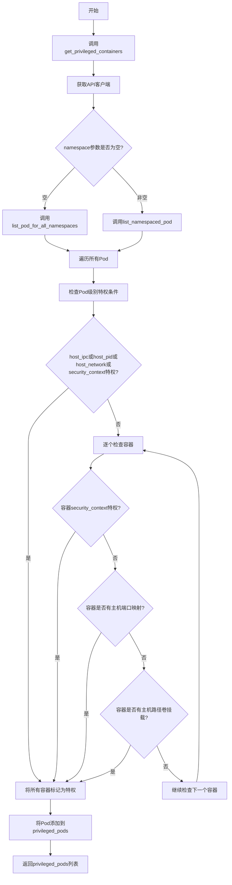
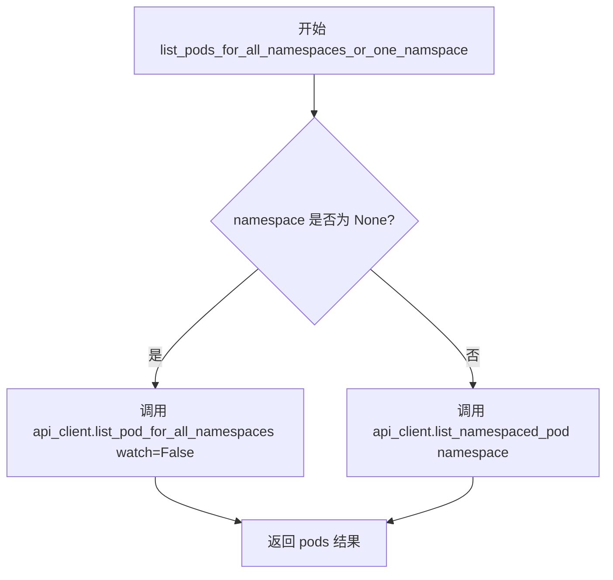
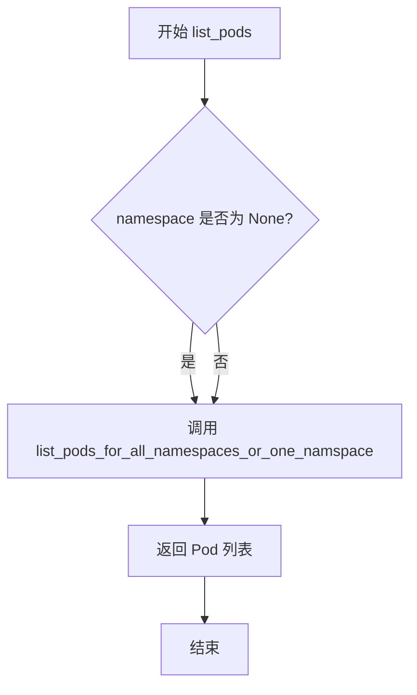
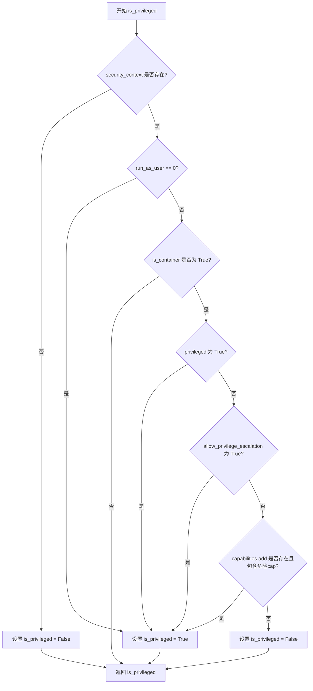
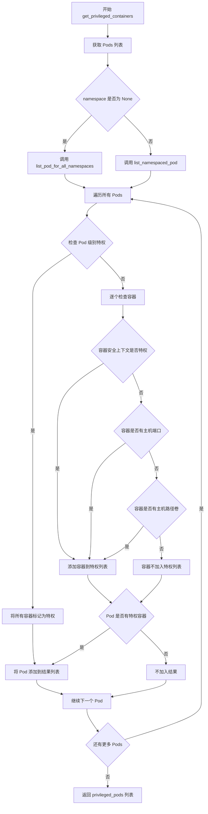

# `KubiScan\engine\privleged_containers.py` 详细设计文档

这是一个Kubernetes特权容器检测工具,用于扫描集群中的特权容器和潜在的安全风险。它通过Kubernetes API获取pod信息,并根据安全上下文(运行用户、权限提升、能力添加等)、主机端口映射、主机路径卷挂载等条件判断容器是否为特权容器,以便安全团队识别和修复潜在的安全漏洞。

## 整体流程



## 类结构

```
privileged_container_detection.py (模块)
└── 全局函数
    ├── list_pods_for_all_namespaces_or_one_namspace
    ├── list_pods
    ├── is_privileged
    └── get_privileged_containers
```

## 全局变量及字段


### `namespace`
    
Kubernetes命名空间，None表示获取所有命名空间的资源

类型：`str | None`
    


### `api_client`
    
Kubernetes API客户端实例

类型：`Kubernetes API Client`
    


### `pods`
    
从Kubernetes API获取的Pod列表对象

类型：`V1PodList`
    


### `is_privileged`
    
标志变量，表示当前安全上下文是否具有特权

类型：`bool`
    


### `security_context`
    
Kubernetes安全上下文对象，包含运行用户、特权模式、能力等安全设置

类型：`V1SecurityContext | None`
    


### `is_container`
    
标志参数，区分检查的是Pod级别还是Container级别的安全上下文

类型：`bool`
    


### `privileged_containers`
    
存储检测到的具有特权属性的容器列表

类型：`list[V1Container]`
    


### `pod`
    
循环遍历中的当前Pod对象

类型：`V1Pod`
    


### `found_privileged_container`
    
标志变量，表示当前容器是否已被判定为特权容器

类型：`bool`
    


### `cap`
    
循环变量，表示Capabilities.add中的单个能力名称

类型：`str`
    


### `volume`
    
循环遍历中的当前Volume对象

类型：`V1Volume`
    


### `volume_mount`
    
循环遍历中的当前容器卷挂载对象

类型：`V1VolumeMount`
    


### `privileged_pods`
    
存储包含特权容器的Pod列表

类型：`list[V1Pod]`
    


    

## 全局函数及方法


### `list_pods_for_all_namespaces_or_one_namspace`

该函数是 Kubernetes Pod 查询的统一入口，根据是否传入 namespace 参数，调用不同的 API 方法获取 Pod 列表：如果未指定 namespace，则查询所有 namespace 下的 Pod；否则查询指定 namespace 下的 Pod。

参数：

- `namespace`：`str | None`，要查询的 Kubernetes 命名空间，如果为 `None` 则查询所有命名空间下的 Pod

返回值：`任意`，Kubernetes API 返回的 Pod 列表对象（通常为 V1PodList），包含 items 属性用于遍历所有 Pod

#### 流程图



#### 带注释源码

```python
def list_pods_for_all_namespaces_or_one_namspace(namespace=None):
    """
    获取 Kubernetes Pod 列表的统一接口函数。
    根据是否传入 namespace 参数，调用不同的 API 方法获取 Pod 列表。
    
    参数:
        namespace (str | None): 命名空间名称。如果为 None，则查询所有命名空间下的 Pod；
                                如果指定了具体的命名空间，则只查询该命名空间下的 Pod。
    
    返回:
        任意类型: Kubernetes API 返回的 Pod 列表对象（V1PodList），
                 该对象包含 items 属性，可遍历获取每个 Pod 的详细信息。
    """
    # 获取 API 客户端实例，用于与 Kubernetes API Server 通信
    api_client = get_api_client()
    
    # 判断是否需要查询所有命名空间
    if namespace is None:
        # 未指定命名空间，调用 list_pod_for_all_namespaces 获取所有命名空间的 Pod
        # watch=False 表示不开启 watch 模式，只返回一次结果
        pods = api_client.list_pod_for_all_namespaces(watch=False)
    else:
        # 指定了命名空间，调用 list_namespaced_pod 获取指定命名空间的 Pod
        pods = api_client.list_namespaced_pod(namespace)
    
    # 返回查询结果
    return pods
```


### `list_pods`

该函数是一个 Kubernetes Pod 列表查询的封装函数，通过可选的命名空间参数获取一个特定命名空间或所有命名空间下的 Pod 列表。

参数：

- `namespace`：`str | None`，Kubernetes 命名空间名称，传入 `None` 时获取所有命名空间的 Pod，传入具体命名空间名称时获取该命名空间下的 Pod

返回值：`object`，Kubernetes API 返回的 Pod 列表对象（通常为 V1PodList 类型）

#### 流程图



#### 带注释源码

```
def list_pods(namespace=None):
    """
    获取一个或所有命名空间的 Pod 列表。
    
    参数:
        namespace: 命名空间名称，默认为 None，表示获取所有命名空间的 Pod
        
    返回:
        Pod 列表对象，包含 items 属性的可迭代对象
    """
    return list_pods_for_all_namespaces_or_one_namspace(namespace)
```


### `is_privileged`

该函数用于判断给定的安全上下文（security_context）是否表示具有特权（privileged）模式。它通过检查运行用户、容器特权标志、权限提升设置以及危险 capabilities 来综合判断。

参数：

- `security_context`：安全上下文对象，包含 `run_as_user`、`privileged`、`allow_privilege_escalation`、`capabilities` 等属性，用于判断是否具有特权
- `is_container`：`bool`，指示检查的是 Pod 级别还是 Container 级别。为 `True` 时会额外检查容器特有的特权条件

返回值：`bool`，返回 `True` 表示具有特权，返回 `False` 表示不具有特权

#### 流程图



#### 带注释源码

```python
def is_privileged(security_context, is_container=False):
    """
    判断给定的安全上下文是否表示具有特权模式
    
    参数:
        security_context: 安全上下文对象,包含run_as_user、privileged等属性
        is_container: bool,指示是否按容器级别检查(会额外检查容器特有属性)
    
    返回:
        bool: True表示具有特权,False表示不具有特权
    """
    # 初始化默认为非特权
    is_privileged = False
    
    # 检查安全上下文是否存在
    if security_context:
        # 检查运行用户是否为root(UID 0)
        if security_context.run_as_user == 0:
            is_privileged = True
        # 如果是容器级别检查,额外检查容器特有属性
        elif is_container:
            # 检查是否显式标记为特权容器
            if security_context.privileged:
                is_privileged = True
            # 检查是否允许权限提升
            elif security_context.allow_privilege_escalation:
                is_privileged = True
            # 检查是否添加了危险的Linux capabilities
            elif security_context.capabilities:
                if security_context.capabilities.add:
                    # 遍历所有添加的capabilities
                    for cap in security_context.capabilities.add:
                        # 如果包含危险cap则判定为特权
                        if cap in caps.dangerous_caps:
                            is_privileged = True
                            break
    
    # 返回最终的特权判定结果
    return is_privileged
```


### `get_privileged_containers`

获取所有命名空间或指定命名空间下的特权容器所在的 Pod 列表。函数会检查每个 Pod 的主机共享资源（hostIPC、hostPID、hostNetwork）、安全上下文、容器端口中的主机端口以及主机路径卷，从而识别具有特权访问的容器。

参数：

- `namespace`：`str | None`，可选参数，指定要查询的 Kubernetes 命名空间，默认为 None 表示查询所有命名空间

返回值：`list`，返回包含特权容器的 Pod 列表，每个 Pod 对象的 containers 字段仅保留特权容器

#### 流程图



#### 带注释源码

```
def get_privileged_containers(namespace=None):
    """
    获取具有特权容器的 Pod 列表
    
    参数:
        namespace: 可选的命名空间，None 表示所有命名空间
    
    返回:
        包含特权容器的 Pod 列表
    """
    # 存储包含特权容器的 Pods
    privileged_pods = []
    
    # 获取所有命名空间或指定命名空间的 Pods
    # 调用 list_pods_for_all_namespaces_or_one_namspace 获取 Pod 列表
    pods = list_pods_for_all_namespaces_or_one_namspace(namespace)
    
    # 遍历每个 Pod
    for pod in pods.items:
        # 用于存储当前 Pod 的特权容器
        privileged_containers = []
        
        # 检查 Pod 级别是否具有特权
        # 如果 Pod 使用了 hostIPC、hostPID、hostNetwork，或者 Pod 级安全上下文为特权
        # 则该 Pod 的所有容器都被视为特权容器
        if pod.spec.host_ipc or pod.spec.host_pid or pod.spec.host_network or is_privileged(pod.spec.security_context, is_container=False):
            # 将所有容器标记为特权容器
            privileged_containers = pod.spec.containers
        else:
            # 逐个检查每个容器
            for container in pod.spec.containers:
                # 标记是否已找到特权容器
                found_privileged_container = False
                
                # 检查容器安全上下文是否具有特权
                # 包括: privileged=true, allow_privilege_escalation=true, 或具有危险 capabilities
                if is_privileged(container.security_context, is_container=True):
                    privileged_containers.append(container)
                # 检查容器端口是否使用了主机端口
                elif container.ports:
                    for ports in container.ports:
                        if ports.host_port:
                            privileged_containers.append(container)
                            found_privileged_container = True
                            break
                
                # 如果仍未找到特权容器，检查卷挂载
                if not found_privileged_container:
                    # 检查 Pod 的卷是否有主机路径
                    if pod.spec.volumes is not None:
                        for volume in pod.spec.volumes:
                            # 已经找到特权容器则跳出循环
                            if found_privileged_container:
                                break
                            # 检查是否为 hostPath 卷
                            if volume.host_path:
                                # 检查容器的卷挂载是否匹配
                                for volume_mount in container.volume_mounts:
                                    if volume_mount.name == volume.name:
                                        # 找到具有主机路径卷挂载的容器
                                        privileged_containers.append(container)
                                        found_privileged_container = True
                                        break
        
        # 如果当前 Pod 包含特权容器，则将其添加到结果列表
        if privileged_containers:
            # 只保留特权容器，过滤掉非特权容器
            pod.spec.containers = privileged_containers
            privileged_pods.append(pod)

    # 返回包含特权容器的 Pod 列表
    return privileged_pods
```

## 关键组件


### Pod列表获取模块

负责从Kubernetes API获取Pod信息，支持获取所有命名空间或指定命名空间的Pod列表

### 安全上下文特权判断模块

核心逻辑判断模块，用于分析容器的安全上下文（包括运行用户、 privileged模式、权限升级和能力添加）来确定是否为特权容器

### 特权容器筛选引擎

主处理模块，遍历Pod及其容器，结合安全上下文、主机端口映射、主机路径卷挂载等多维度条件筛选出特权容器

### 危险能力识别组件

基于Kubernetes安全能力白名单，识别容器是否添加了危险系统能力（dangerous capabilities）

### API客户端封装

提供统一的API客户端获取接口，封装与Kubernetes API的通信细节


## 问题及建议


### 已知问题

-   **函数名拼写错误**：`list_pods_for_all_namespaces_or_one_namspace` 中的 "namspace" 应为 "namespace"，这是明显的拼写错误，会影响代码可读性和可维护性。
-   **逻辑分散且重复**：Pod 级别的特权检查（host_ipc、host_pid、host_network）在 `get_privileged_containers` 函数中直接判断，而容器级别的特权检查调用 `is_privileged` 函数，导致特权判断逻辑分散在两处，容易产生不一致。
-   **嵌套循环过深**：`get_privileged_containers` 函数中存在至少 4 层嵌套循环（pod -> container -> ports/volumes -> volume_mounts），导致代码可读性极差，逻辑难以理解和维护。
-   **变量遮蔽（Variable Shadowing）**：`is_privileged` 函数中定义了与函数名同名的局部变量 `is_privileged = False`，虽然不会导致错误，但容易引起混淆，应该使用不同的变量名如 `result` 或 `is_priv`。
-   **缺少错误处理**：所有 API 调用（`api_client.list_pod_for_all_namespaces`、`api_client.list_namespaced_pod`）都没有异常处理机制，网络故障或 API 错误会导致程序直接崩溃。
-   **API 客户端重复获取**：`list_pods_for_all_namespaces_or_one_namspace` 函数每次调用都会通过 `get_api_client()` 获取新的 API 客户端实例，没有缓存或单例模式，增加了不必要的开销。
-   **废弃字段检查**：`ports.host_port` 在 Kubernetes API 中已被废弃，应检查 `containerPorts` 或直接使用 `container.ports` 中的 `containerPort` 字段。
-   **缺少参数验证**：namespace 参数没有进行有效性验证，传入空字符串或无效命名空间时可能导致意外行为。
-   **代码可测试性差**：函数依赖全局的 `api_client` 和 `caps` 模块，没有通过依赖注入的方式解耦，导致单元测试困难。

### 优化建议

-   修正函数名拼写错误，将 `namspace` 改为 `namespace`。
-   重构 `is_privileged` 函数，将 Pod 级别的特权检查（host_ipc、host_pid、host_network）纳入其中，提供统一的特权判断逻辑。
-   重构 `get_privileged_containers` 函数，通过提取子函数的方式减少嵌套层级，例如将容器特权判断、端口检查、卷挂载检查分别拆分为独立的辅助函数。
-   重命名 `is_privileged` 函数中的局部变量，避免与函数名同名。
-   添加 API 调用的异常处理，使用 try-except 捕获 `ApiException` 等可能的异常，并提供有意义的错误信息和重试机制。
-   考虑在模块级别缓存 API 客户端实例，或使用单例模式，避免重复创建。
-   更新端口检查逻辑，使用正确的字段名或兼容新旧版本。
-   添加 namespace 参数的验证逻辑，确保其符合 Kubernetes 命名规范。
-   引入依赖注入，将 `api_client` 和 `caps` 作为参数传入，提高代码的可测试性。
-   为所有公共函数添加文档字符串（docstring），说明函数功能、参数和返回值。
-   添加类型注解（Type Hints），提高代码的可读性和 IDE 支持。

## 其它


### 设计目标与约束

该代码旨在识别Kubernetes集群中的特权容器（privileged containers），通过分析Pod和容器安全上下文、主机访问权限（hostIPC、hostPID、hostNetwork）以及卷挂载情况，判断容器是否具有提升的权限。设计约束包括：仅支持Kubernetes API可访问的环境，需确保API客户端正确配置；假设Kubernetes Python客户端库（kubernetes-client）可用；仅检查特定的安全上下文字段和主机访问标志。

### 错误处理与异常设计

代码缺少显式的错误处理机制。需要添加以下错误处理：
- API调用异常：捕获`kubernetes.client.rest.ApiException`处理Kubernetes API错误（如认证失败、权限不足、资源不存在），捕获`urllib3.exceptions.HTTPError`处理网络连接问题
- 空值检查：Pod或Container对象可能为None，需要在访问其属性前进行空值检查
- 异常传播：定义自定义异常类（如`PodListError`、`PrivilegedCheckError`）以便调用方区分不同类型的错误
- 日志记录：添加日志记录以便于调试和监控API调用过程

### 数据流与状态机

数据流如下：
1. 入口函数`get_privileged_containers(namespace)`接收可选的namespace参数
2. 调用`list_pods_for_all_namespaces_or_one_namspace`获取Pod列表
3. 遍历每个Pod，检查以下特权条件（任一满足即标记Pod为特权）：
   - Pod级别：`host_ipc=True`、`host_pid=True`、`host_network=True`或`security_context`为特权
   - Container级别：容器安全上下文为特权、存在hostPort映射、使用hostPath卷
4. 对满足特权条件的Pod，过滤其`containers`列表仅保留特权容器
5. 返回包含特权容器的Pod列表

### 外部依赖与接口契约

外部依赖包括：
- `kubernetes`（Kubernetes Python客户端）：用于API调用
- `engine.capabilities.capabilities`模块：提供`caps.dangerous_caps`危险能力列表
- `api.api_client`：Kubernetes API客户端实例
- `api.config.get_api_client`：获取API客户端的工厂函数

接口契约：
- `list_pods(namespace=None)`：namespace为字符串或None，返回Kubernetes V1PodList对象
- `is_privileged(security_context, is_container=False)`：security_context为V1SecurityContext对象，is_container为布尔值，返回布尔值
- `get_privileged_containers(namespace=None)`：namespace为字符串或None，返回包含特权容器的V1Pod列表

### 性能考虑与优化空间

当前实现存在以下性能问题：
- 重复遍历：代码中有多层嵌套循环，O(n*m*k)复杂度，其中n为Pod数，m为容器数，k为卷/端口数
- 冗余检查：在检查host_path时，遍历所有volume和volume_mounts组合，内层循环效率低
- 无缓存机制：每次调用都重新从API获取Pod列表，缺乏缓存
- API调用优化：可使用`field_selector`减少返回的Pod字段数量，使用`label_selector`过滤不需要检查的Pod

优化建议：使用字典进行O(1)查找替代嵌套循环；添加可选的结果缓存；支持增量更新而非全量扫描；添加并发处理支持以加速大规模集群分析

### 安全注意事项

代码涉及敏感的安全检查逻辑，需注意：
- 认证凭证安全：API客户端凭据不应硬编码，应通过Kubernetes Service Account或外部密钥管理服务获取
- 数据泄露风险：返回的Pod对象可能包含敏感信息（如环境变量中的密钥），应考虑在返回前进行脱敏处理
- 权限最小化：运行该代码的Service Account应仅具有读取Pod和Pod状态的权限（get、list、watch）

### 配置与可扩展性

可扩展性设计：
- 危险能力列表（caps.dangerous_caps）应可配置，支持从外部源加载
- 特权判断逻辑应支持插件化，便于添加新的检查规则
- namespace参数应支持通配符或正则表达式匹配
- 应支持通过配置文件定义哪些安全上下文字段被认为是"特权"

### 测试策略建议

建议添加以下测试用例：
- 单元测试：`is_privileged`函数应覆盖各种安全上下文组合（特权用户、特权模式、危险能力等）
- 集成测试：使用mock Kubernetes API服务器测试完整的Pod筛选流程
- 边界条件：空Pod列表、单Pod单容器、多namespace、API错误场景
- 性能测试：在大规模集群（数千Pod）下的执行时间和内存使用

### 代码质量与技术债务

识别的问题：
- 拼写错误：`list_pods_for_all_namespaces_or_one_namspace`函数名中"namspace"应为"namespace"
- 魔法字符串/数字：0（UID）应定义为常量`ROOT_UID`
- 重复代码：privileged_containers的添加逻辑有重复
- 缺少类型注解：Python类型注解可提高代码可读性和IDE支持
- 函数职责不单一：`get_privileged_containers`同时负责获取数据、筛选和过滤，职责过多
- 注释不足：关键逻辑缺乏解释性注释

### 部署与环境要求

运行环境要求：
- Python 3.7+
- kubernetes>=12.0.0（Kubernetes Python客户端版本）
- 有效的kubeconfig配置或In-Cluster配置（当在Pod内运行时）
- Kubernetes集群访问权限（读取Pod资源）

部署方式：
- 可作为独立脚本运行
- 可集成到现有的Kubernetes安全扫描工具中
- 建议以CronJob或DaemonSet形式定期执行以检测集群中的特权容器


    