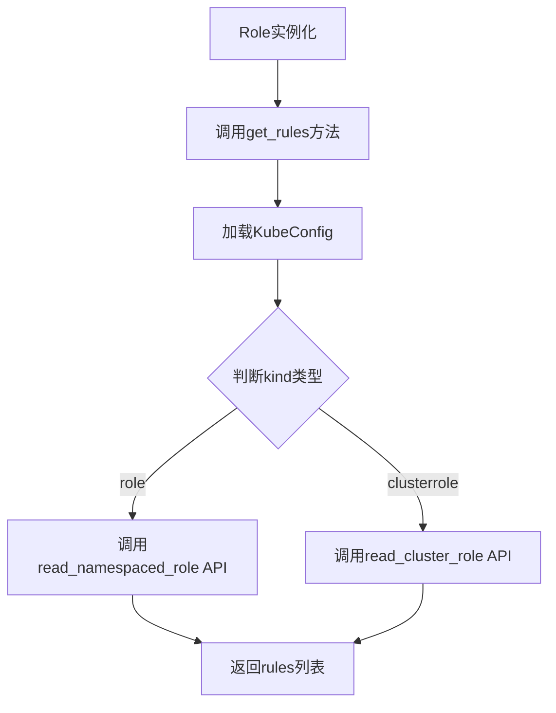
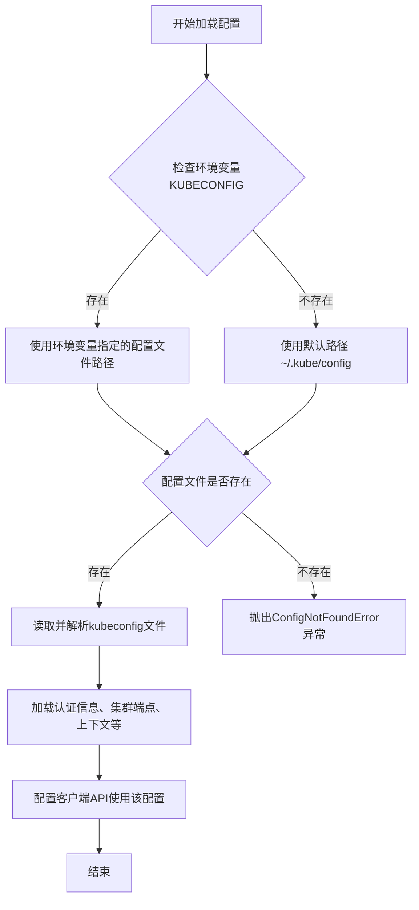
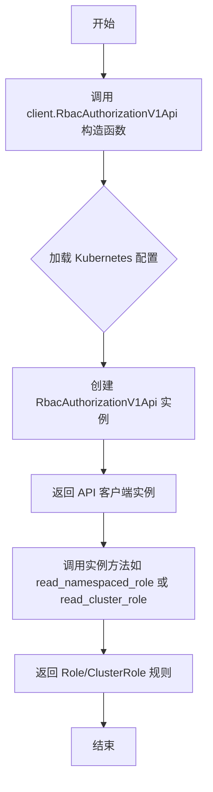
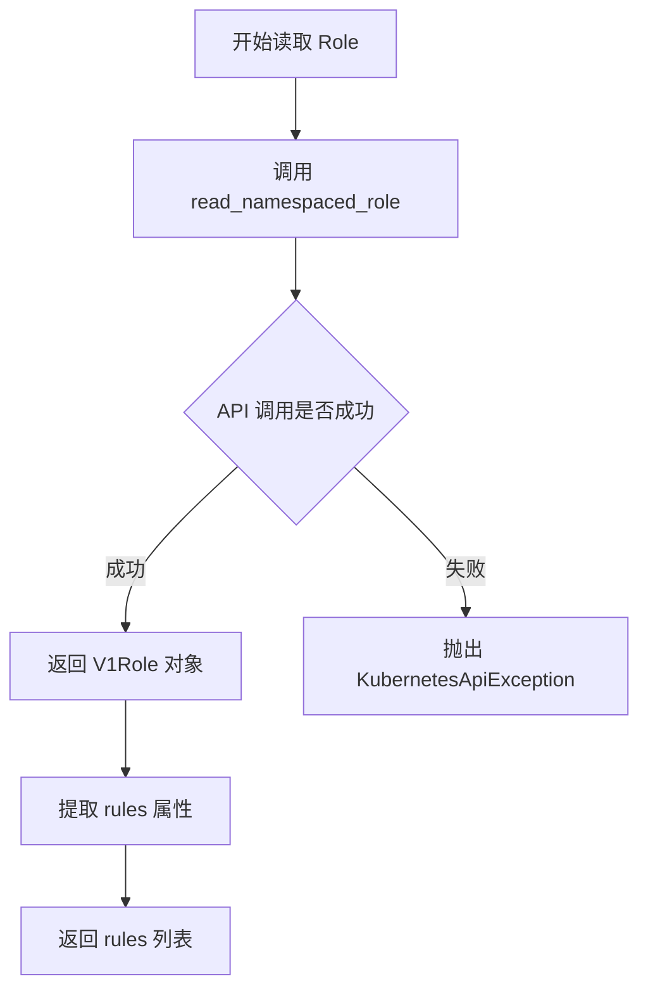
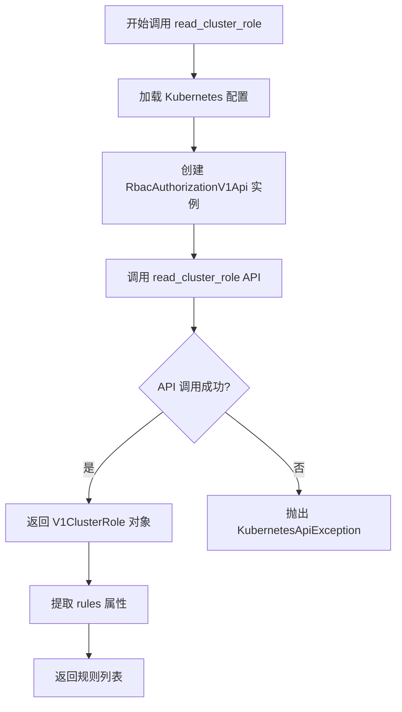
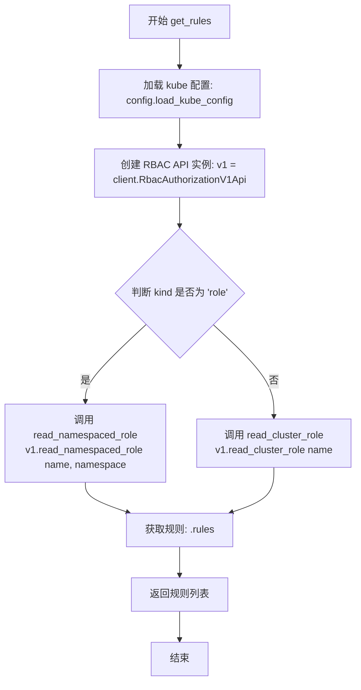

# `KubiScan\engine\role.py` 详细设计文档

定义了一个Role类，用于封装Kubernetes RBAC中的Role或ClusterRole对象，提供通过Kubernetes API获取角色权限规则的能力，支持命名空间级别的Role和集群级别的ClusterRole。

## 整体流程



## 类结构

```
Role (具体类)
└── 无继承关系，直接继承自Python object
```

## 全局变量及字段


### `client`
    
Kubernetes Python客户端的API模块,提供RBAC认证等Kubernetes API调用功能

类型：`module`
    


### `config`
    
Kubernetes配置模块,用于加载kubeconfig配置以连接Kubernetes集群

类型：`module`
    


### `Role.name`
    
角色名称

类型：`str`
    


### `Role.priority`
    
角色优先级

类型：`int/str`
    


### `Role.rules`
    
RBAC权限规则列表

类型：`list`
    


### `Role.namespace`
    
命名空间,用于namespaced Role

类型：`str`
    


### `Role.kind`
    
角色类型,值为'role'或'clusterrole'

类型：`str`
    


### `Role.time`
    
时间戳

类型：`str/datetime`
    
    

## 全局函数及方法


### `config.load_kube_config`

该函数是 Kubernetes Python 客户端库中的配置加载函数，用于从默认位置（~/.kube/config）或环境变量加载 kubeconfig 配置文件，以获取访问 Kubernetes 集群所需的认证信息和集群端点。

参数：

- （无参数）

返回值：`None` 或 `ConfigNotFoundError`，加载 kubeconfig 配置后无返回值，但会设置客户端使用的配置上下文。

#### 流程图



#### 带注释源码

```python
# 源代码来源：kubernetes-client/python 库的 config 模块
# 以下为函数调用的上下文示例

def get_rules(self):
    """
    获取角色或集群角色的规则列表
    """
    # 调用 config.load_kube_config() 加载 kubeconfig 配置
    # 该函数会：
    # 1. 查找 kubeconfig 文件（优先环境变量KUBECONFIG，其次默认路径 ~/.kube/config）
    # 2. 解析 YAML 格式的配置文件
    # 3. 提取当前上下文、用户凭据、集群信息
    # 4. 配置 client 的认证和连接信息
    config.load_kube_config()
    
    # 创建 RBAC 授权 v1 API 客户端实例
    v1 = client.RbacAuthorizationV1Api()
    
    # 根据 kind 判断是 Role 还是 ClusterRole
    if self.kind.lower() == "role":
        # 调用 API 获取命名空间级别的 Role 规则
        return (v1.read_namespaced_role(self.name, self.namespace)).rules
    else: 
        # 调用 API 获取集群级别的 ClusterRole 规则
        return (v1.read_cluster_role(self.name)).rules
```


### `client.RbacAuthorizationV1Api`

该函数是 Kubernetes Python 客户端库中的构造函数，用于创建 RbacAuthorizationV1Api 类的实例，该实例是与 Kubernetes RBAC (Role-Based Access Control) API 进行交互的客户端对象，支持对 Role、ClusterRole、RoleBinding 和 ClusterRoleBinding 等资源进行 CRUD 操作。

参数：

- 该函数无参数（默认构造函数）

返回值：`RbacAuthorizationV1Api`，返回一个新的 RbacAuthorizationV1Api 实例，用于调用 Kubernetes RBAC API

#### 流程图



#### 带注释源码

```python
from kubernetes import client, config

# This class is also for ClusterRole
class Role:
    def __init__(self, name, priority, rules=None, namespace=None, kind=None, time=None):
        self.name = name
        self.priority = priority
        self.rules = rules
        self.namespace = namespace
        self.kind = kind
        self.time = time

    def get_rules(self):
        # 加载 kubeconfig 配置（从默认位置或环境变量）
        config.load_kube_config()
        
        # 创建 RBAC Authorization V1 API 客户端实例
        # 这是用户要求提取的核心函数/类
        v1 = client.RbacAuthorizationV1Api()
        
        # 根据 kind 类型判断是 Role 还是 ClusterRole
        if self.kind.lower() == "role":
            # 调用 read_namespaced_role 获取命名空间级别的 Role
            return (v1.read_namespaced_role(self.name, self.namespace)).rules
        else: 
            # "clusterrole" - 调用 read_cluster_role 获取集群级别的 ClusterRole
            return (v1.read_cluster_role(self.name)).rules
```


### `RbacAuthorizationV1Api.read_namespaced_role`

该函数是 Kubernetes RBAC 授权 API 的一部分，用于从指定命名空间中读取 Role 资源的信息，并返回该 Role 的规则（rules）列表。

参数：

- `name`：`str`，Role 资源的名称
- `namespace`：`str`，Role 所在的命名空间名称

返回值：`V1Role`，包含 `rules` 属性的 Role 对象，其中 `rules` 是一个规则列表，定义了授予的权限

#### 流程图



#### 带注释源码

```python
# 从 kubernetes import 客户端和配置模块
from kubernetes import client, config

# 定义 Role 类，用于表示 Kubernetes RBAC Role 或 ClusterRole
class Role:
    def __init__(self, name, priority, rules=None, namespace=None, kind=None, time=None):
        self.name = name                                    # Role 名称
        self.priority = priority                            # 优先级
        self.rules = rules                                  # 权限规则列表
        self.namespace = namespace                          # 命名空间（Role 需要）
        self.kind = kind                                    # 类型：role 或 clusterrole
        self.time = time                                    # 时间戳

    def get_rules(self):
        """
        获取 Role 的权限规则
        根据 kind 类型调用不同的 API：
        - role: 调用 read_namespaced_role（需要命名空间）
        - clusterrole: 调用 read_cluster_role（不需要命名空间）
        """
        # 加载 kubeconfig 配置（从 ~/.kube/config 或 Pod 内置配置）
        config.load_kube_config()
        
        # 创建 RBAC Authorization V1 API 客户端实例
        v1 = client.RbacAuthorizationV1Api()
        
        # 根据 kind 类型判断调用哪个 API
        if self.kind.lower() == "role":
            # 调用 read_namespaced_role 读取指定命名空间的 Role
            # 参数1: name - Role 名称（str）
            # 参数2: namespace - 命名空间（str）
            # 返回值: V1Role 对象，包含 rules 属性
            return (v1.read_namespaced_role(self.name, self.namespace)).rules
        else: 
            # "clusterrole" 的情况
            # 调用 read_cluster_role 读取集群级别的 ClusterRole
            return (v1.read_cluster_role(self.name)).rules
```

#### 附加信息

- **外部依赖**：需要 `kubernetes` Python 包（版本需支持 RbacAuthorizationV1Api）
- **错误处理**：如果 API 调用失败，会抛出 `kubernetes.client.exceptions.ApiException`
- **接口契约**：
  - `name` 参数不能为空且必须是有效的 Kubernetes 资源名称
  - `namespace` 参数对于 Role 类型是必需的，对于 ClusterRole 应为 `None`
  - 返回的 `V1Role` 对象结构遵循 Kubernetes RBAC API 规范


### `RbacAuthorizationV1Api.read_cluster_role`

该方法是 Kubernetes Python 客户端 `RbacAuthorizationV1Api` 类中的核心方法，用于从 Kubernetes 集群中读取指定的 ClusterRole 资源定义，并返回其包含的权限规则列表。

参数：

- `name`：`str`，ClusterRole 的名称，用于唯一标识要查询的集群级别角色

返回值：`V1ClusterRole`，返回完整的 ClusterRole 资源对象，包含 `rules` 属性（权限规则列表）

#### 流程图



#### 带注释源码

```python
# 在 Role.get_rules() 方法中调用
def get_rules(self):
    """
    获取角色或集群角色的权限规则
    """
    # 加载本地 kubeconfig 配置（用于认证到 Kubernetes 集群）
    config.load_kube_config()
    
    # 创建 RBAC Authorization V1 API 客户端实例
    v1 = client.RbacAuthorizationV1Api()
    
    # 根据 kind 判断是 Role 还是 ClusterRole
    if self.kind.lower() == "role":
        # 调用 namespaced Role API：读取指定命名空间下的 Role
        return (v1.read_namespaced_role(self.name, self.namespace)).rules
    else:
        # "clusterrole"
        # 调用集群级别 RBAC API：读取 ClusterRole
        # 这是用户要求提取的方法 v1.read_cluster_role(self.name)
        # 
        # 参数说明：
        #   - name: str 类型，ClusterRole 的名称（必填参数）
        # 返回值：
        #   - V1ClusterRole 对象，包含以下关键属性：
        #     * rules: 权限规则列表 V1PolicyRule[]
        #     * metadata: 元数据信息
        #     * kind: 'ClusterRole'
        #     * api_version: 'rbac.authorization.k8s.io/v1'
        return (v1.read_cluster_role(self.name)).rules
```


### `Role.get_rules`

该方法用于从 Kubernetes API 获取角色（Role）或集群角色（ClusterRole）的规则列表，根据对象的 kind 属性判断是调用 Namespaced Role API 还是 ClusterRole API。

参数：无（仅包含隐式参数 `self`）

返回值：`list`，返回角色的权限规则列表（V1PolicyRule 对象列表）

#### 流程图



#### 带注释源码

```python
def get_rules(self):
    """
    获取角色的规则列表。
    
    根据 self.kind 类型判断是 Role 还是 ClusterRole，
    并调用相应的 Kubernetes RBAC API 获取权限规则。
    
    Returns:
        list: 角色规则的列表，每个元素为 V1PolicyRule 对象
    """
    # 加载本地 kubeconfig 配置（用于连接 Kubernetes 集群）
    config.load_kube_config()
    
    # 创建 RBAC Authorization V1 API 客户端实例
    v1 = client.RbacAuthorizationV1Api()
    
    # 判断角色类型：Role（命名空间级别）或 ClusterRole（集群级别）
    if self.kind.lower() == "role":
        # 调用 Namespaced Role API 获取指定命名空间下的 Role
        # 返回 V1Role 对象，从中提取 rules 属性
        return (v1.read_namespaced_role(self.name, self.namespace)).rules
    else: 
        # 调用 ClusterRole API 获取集群级别的 ClusterRole
        # 返回 V1ClusterRole 对象，从中提取 rules 属性
        return (v1.read_cluster_role(self.name)).rules
```

## 关键组件


### Role 类

用于表示 Kubernetes RBAC 角色（Role）或集群角色（ClusterRole），封装角色名称、优先级、规则、命名空间、类型和时间等属性，并提供从 Kubernetes API 获取角色规则的方法。

### get_rules 方法

从 Kubernetes API 动态获取角色或集群角色的权限规则，根据 kind 属性区分命名空间级 Role 和集群级 ClusterRole。

### config.load_kube_config()

加载本地 kubeconfig 文件，用于配置 Kubernetes 客户端与集群的连接凭证和上下文。

### client.RbacAuthorizationV1Api()

创建 Kubernetes RBAC Authorization v1 API 客户端实例，用于调用集群的 RBAC 相关 API 接口。

### namespace 属性

存储角色所属的 Kubernetes 命名空间，仅对 Role（命名空间级角色）有效，ClusterRole 不需要命名空间。

### kind 属性

标识角色类型，用于区分 "role"（命名空间级）和 "clusterrole"（集群级），决定调用不同的 API 端点。

### priority 属性

表示角色的优先级数值，用于在多个角色场景下的排序或优先级决策。

### name 属性

角色的名称，用于在 Kubernetes API 调用中定位具体的 Role 或 ClusterRole 资源。


## 问题及建议


### 已知问题

-   **异常处理缺失**：`get_rules()`方法直接调用Kubernetes API，没有任何try-except捕获，API调用失败时会导致未处理的异常向上传播
-   **配置加载重复**：`config.load_kube_config()`在每次调用`get_rules()`时都会执行，在高频调用场景下会造成性能浪费
-   **参数验证不足**：`kind`参数仅做小写转换处理，未验证其值是否为有效值（"role"或"clusterrole"），无效值会导致意外行为
-   **未使用的字段**：`priority`和`time`字段在构造函数中被接收但从未使用，造成接口污染
-   **参数不一致风险**：当`kind`为"clusterrole"时，`namespace`参数被传入但实际不使用，可能导致逻辑混淆
-   **类型注解缺失**：所有参数和方法均无类型提示，降低了代码可读性和IDE支持
-   **文档字符串缺失**：类和方法的文档字符串完全缺失，影响代码可维护性
-   **API客户端未复用**：`client.RbacAuthorizationV1Api()`实例每次调用都重新创建，没有复用机制

### 优化建议

-   为`get_rules()`添加try-except块，捕获`ApiException`等可能异常并返回有意义的错误信息或默认值
-   将`config.load_kube_config()`移至类外部或模块级别，只在需要时调用一次，或使用配置缓存
-   在`__init__`或`get_rules()`中添加`kind`参数的有效性验证，确保只接受"role"或"clusterrole"
-   移除未使用的`priority`和`time`字段，或在文档中说明其为预留字段
-   为所有参数、返回值和方法添加类型注解，提升代码清晰度
-   为类和关键方法添加docstring文档字符串，说明用途、参数和返回值
-   考虑将API客户端作为类属性或通过依赖注入方式创建并复用
-   考虑添加缓存机制，避免重复调用Kubernetes API获取相同角色的规则

## 其它


### 设计目标与约束

本模块旨在提供对Kubernetes RBAC Role和ClusterRole对象的抽象封装，使开发者能够通过简洁的接口查询角色所包含的权限规则。设计约束包括：仅支持Kubernetes RBAC API v1版本；要求目标集群已配置kubeconfig文件或Pod内ServiceAccount认证；仅提供读取操作，不支持角色的创建、更新和删除；kind参数仅接受"role"或"clusterrole"两种枚举值。

### 错误处理与异常设计

get_rules()方法可能触发以下异常场景：config.load_kube_config()失败时抛出ConfigException；API调用失败时抛出ApiException（如角色不存在返回404，权限不足返回403，网络异常返回5xx）；namespace为None时对Namespaced Role操作会抛出ValueError。建议在调用方进行try-except包装，对ApiException进行状态码区分处理，对ConfigException提供明确的配置缺失提示。

### 外部依赖与接口契约

核心依赖为kubernetes Python客户端库（kubernetes>=12.0.0），通过client.RbacAuthorizationV1Api与Kubernetes API Server通信。接口契约要求：调用get_rules()前必须保证self.kind已正确赋值且不为None；namespace参数在kind为"role"时必须提供有效值，在kind为"clusterrole"时可为None；返回值为kubernetes.client.V1PolicyRule列表或None。

### 性能考虑

当前实现每次调用get_rules()都会重新加载kubeconfig并创建API客户端实例，在高频调用场景下会产生性能开销。建议在类初始化时或通过单例模式缓存API客户端对象；同时可考虑增加结果缓存机制，减少对Kubernetes API Server的频繁请求。

### 安全性考虑

代码通过Kubernetes RBAC进行权限控制，调用者需具备对目标Role/ClusterRole的get权限。config.load_kube_config()默认读取~/.kube/config文件，生产环境建议使用ServiceAccount Token方式认证（config.load_incluster_config()）。敏感信息不应硬编码在代码中，应通过Kubernetes Secret或外部配置中心管理。

### 兼容性考虑

代码兼容Kubernetes 1.22+版本（RBAC v1 API）。对于较老版本（1.5-1.21）的集群，需确认RbacAuthorizationV1Api可用性。kind参数大小写不敏感，但在传入其他值时缺乏验证逻辑，存在潜在风险。time字段在当前实现中未被使用，可能为遗留字段或计划用于后续的时间相关功能。

### 测试策略

建议采用单元测试结合Mock的方式验证逻辑：使用unittest.mock.patch模拟config.load_kube_config()和API客户端返回值；测试"role"和"clusterrole"两种kind的分支路径；测试异常场景（角色不存在、权限不足、网络错误）；考虑使用pytest fixtures管理测试环境配置。

### 数据流与状态机

数据流为：调用方实例化Role对象 → 设置name、kind、namespace属性 → 调用get_rules() → 加载kube配置 → 创建RbacAuthorizationV1Api实例 → 根据kind类型调用对应API（read_namespaced_role或read_cluster_role） → 返回rules属性。状态转换相对简单，对象从初始化状态到就绪状态（rules被成功获取），异常情况会进入错误状态。

### 配置管理

当前代码使用config.load_kube_config()自动加载配置，建议在文档中明确说明配置加载优先级：环境变量KUBECONFIG指定路径 > ~/.kube/config > Pod内ServiceAccount（当使用load_incluster_config时）。namespace参数建议通过配置文件或环境变量注入，避免硬编码。

### 潜在改进空间

当前类职责不单一，兼具数据模型和业务逻辑（API调用），建议拆分；rules属性仅在get_rules()调用后才会从API获取，初始为None或构造函数传入，状态不一致；缺少__repr__、__eq__等通用方法；priority和time字段未在get_rules()中使用，设计意图不明确；可考虑添加类型注解（Type Hints）提升代码可维护性。


    