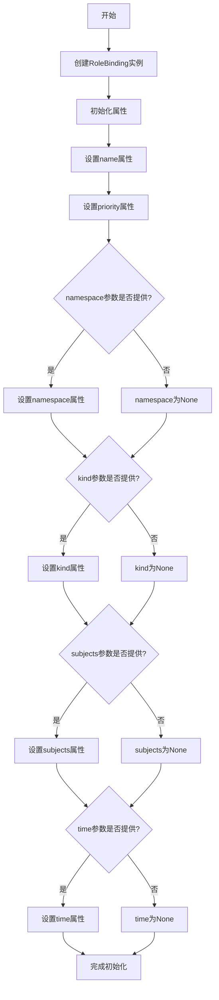
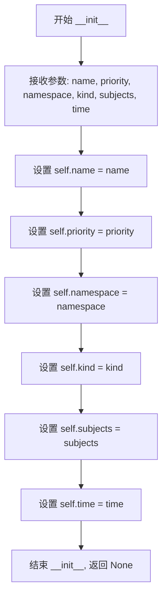
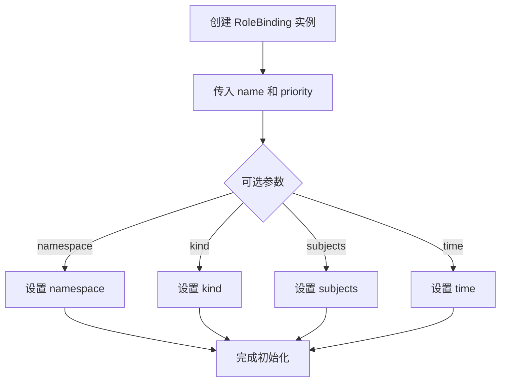

# `KubiScan\engine\role_binding.py` 详细设计文档

这是一个用于表示Kubernetes RBAC（基于角色的访问控制）中RoleBinding资源的简单数据类，封装了RoleBinding的名称、优先级、命名空间、类型、主题列表和时间戳等核心属性，用于在Kubernetes集群中建立角色与用户或服务账户之间的权限绑定关系。

## 整体流程



## 类结构

```
RoleBinding (数据模型类)
└── 无继承关系，独立类
```

## 全局变量及字段


### `RoleBinding.name`
    
RoleBinding资源的名称

类型：`str`
    


### `RoleBinding.priority`
    
优先级

类型：`int`
    


### `RoleBinding.namespace`
    
命名空间（可选）

类型：`str`
    


### `RoleBinding.kind`
    
资源类型（可选）

类型：`str`
    


### `RoleBinding.subjects`
    
主题列表（可选）

类型：`list`
    


### `RoleBinding.time`
    
时间戳（可选）

类型：`datetime`
    
    

## 全局函数及方法


### `RoleBinding.__init__`

该构造函数用于初始化 RoleBinding 实例，接收绑定名称、优先级、命名空间、类型、主题和时间等参数，并将这些参数赋值给实例的属性，用于描述一个 Kubernetes RoleBinding 或 ClusterRoleBinding 资源对象。

参数：

- `name`：`str`，RoleBinding 的名称，用于唯一标识该绑定
- `priority`：`int`，RoleBinding 的优先级，数值越大优先级越高
- `namespace`：`str`（可选），RoleBinding 所属的命名空间，ClusterRoleBinding 此参数为 None
- `kind`：`str`（可选），RoleBinding 的类型，如 Role 或 ClusterRole
- `subjects`：`any`（可选），RoleBinding 的主体列表，指定哪些用户或组被绑定到角色
- `time`：`any`（可选），RoleBinding 的创建或更新时间戳

返回值：`None`，该方法为构造函数，不返回任何值，仅初始化实例属性

#### 流程图



#### 带注释源码

```python
def __init__(self, name, priority, namespace=None, kind=None, subjects=None, time=None):
    """
    构造函数，初始化 RoleBinding 实例
    
    参数:
        name: RoleBinding 的名称
        priority: RoleBinding 的优先级
        namespace: 命名空间（可选）
        kind: 角色类型（可选）
        subjects: 主体列表（可选）
        time: 时间戳（可选）
    """
    # 将传入的 name 参数赋值给实例的 name 属性
    self.name = name
    
    # 将传入的 priority 参数赋值给实例的 priority 属性
    self.priority = priority
    
    # 将传入的 namespace 参数赋值给实例的 namespace 属性（可选参数）
    self.namespace = namespace
    
    # 将传入的 kind 参数赋值给实例的 kind 属性（可选参数）
    self.kind = kind
    
    # 将传入的 subjects 参数赋值给实例的 subjects 属性（可选参数）
    self.subjects = subjects
    
    # 将传入的 time 参数赋值给实例的 time 属性（可选参数）
    self.time = time
```

## 关键组件


### 概述

该代码定义了一个用于表示 Kubernetes RoleBinding 或 ClusterRoleBinding 资源的 Python 类，通过初始化方法接收绑定名称、优先级、命名空间、类型、主题列表和时间戳等参数，用于封装 RBAC 角色绑定的核心属性。

### 文件整体运行流程

该代码以类定义形式存在，不包含执行逻辑。作为数据模型类，其运行流程为：当其他模块需要创建 RoleBinding 对象时，实例化该类并传入相应参数，类内部通过 `__init__` 方法将参数赋值给实例属性，供后续序列化为 Kubernetes 资源清单或进行资源管理使用。

### 类的详细信息

#### RoleBinding 类

- **类描述**：用于表示 Kubernetes RBAC 中的 RoleBinding 或 ClusterRoleBinding 资源的数据模型类
- **类字段**：
  - `name`: str，角色绑定的名称
  - `priority`: int，角色绑定的优先级
  - `namespace`: str，命名空间（可选，默认 None）
  - `kind`: str，资源类型（可选，默认 None，用于区分 RoleBinding 或 ClusterRoleBinding）
  - `subjects`: list，主题列表（可选，默认 None，表示被绑定的主体如用户、组或服务账户）
  - `time`: datetime，时间戳（可选，默认 None，记录创建或更新时间）

- **类方法**：
  - `__init__(name, priority, namespace=None, kind=None, subjects=None, time=None)`
    - **参数**：
      - `name`: str，角色绑定的名称
      - `priority`: int，角色绑定的优先级
      - `namespace`: str，命名空间（可选）
      - `kind`: str，资源类型（可选）
      - `subjects`: list，主题列表（可选）
      - `time`: datetime，时间戳（可选）
    - **返回值**：无
    - **描述**：构造函数，初始化 RoleBinding 对象的各个属性



```python
# 源码
class RoleBinding:
    def __init__(self, name, priority, namespace=None, kind=None, subjects=None, time=None):
        self.name = name
        self.priority = priority
        self.namespace = namespace
        self.kind = kind
        self.subjects = subjects
        self.time = time
```

### 关键组件信息

- **RoleBinding 类**：核心数据模型，用于封装 Kubernetes RBAC 角色绑定资源的所有属性
- **name 字段**：标识角色绑定的唯一名称，是必需参数
- **priority 字段**：表示角色绑定的优先级，用于排序或优先级处理
- **namespace 字段**：可选字段，用于区分命名空间级别的 RoleBinding
- **kind 字段**：可选字段，用于区分 RoleBinding 和 ClusterRoleBinding 类型
- **subjects 字段**：可选字段列表，存储被授权的主体信息（用户、组或服务账户）
- **time 字段**：可选时间戳字段，记录角色绑定的时间信息

### 潜在的技术债务或优化空间

1. **缺少数据验证**：构造函数未对输入参数进行有效性验证，如 name 不应为空、priority 应为非负整数等
2. **缺少序列化方法**：未提供 to_dict/to_json 方法，无法直接转换为 Kubernetes 资源清单格式
3. **缺少类型注解**：参数和返回值均缺少类型提示，影响代码可读性和 IDE 智能提示
4. **缺少默认值处理逻辑**：未定义 kind 的默认值推断逻辑（当 kind 为 None 时的行为）
5. **缺少字符串表示方法**：未实现 __str__ 或 __repr__ 方法，不便于调试和日志输出

### 其它项目

- **设计目标**：作为 Kubernetes RBAC 资源的数据模型，用于在 Python 代码中表示和管理角色绑定
- **约束**：该类为纯数据类，仅负责属性存储，不包含业务逻辑或 Kubernetes API 交互
- **错误处理**：当前无错误处理机制，依赖调用方保证参数合法性
- **外部依赖**：无外部依赖，仅使用 Python 内置类型
- **使用场景**：适用于 Kubernetes 配置管理工具、权限检查工具或资源生成器等场景


## 问题及建议


### 已知问题

-   **缺少类型注解**：所有参数和属性都缺少类型声明，降低了代码的可读性和静态检查能力
-   **缺少文档字符串**：类和方法没有文档说明，难以理解类的用途和字段含义
-   **无参数验证**：构造函数未对参数合法性进行校验（如name不能为空、priority范围等）
-   **参数语义不明确**：subjects应为列表类型、time应为datetime类型，但未做类型约定
-   **缺少默认值**：namespace、kind、subjects、time等可选参数未提供默认值，需手动传None
-   **未实现必要方法**：缺少`__repr__`、`__eq__`、`__hash__`等常用魔术方法
-   **设计职责模糊**：注释表明此类同时处理RoleBinding和ClusterRoleBinding，但未做逻辑区分（ClusterRoleBinding不需要namespace）
-   **未使用现代Python特性**：可使用dataclass简化代码并自动生成方法

### 优化建议

-   **引入类型注解**：为所有参数和属性添加类型声明（如`name: str`, `priority: int`, `namespace: Optional[str]`等）
-   **添加文档字符串**：为类编写docstring，说明用途、字段含义及ClusterRoleBinding场景
-   **实现参数验证**：在`__init__`中加入参数校验逻辑，抛出有意义的异常信息
-   **使用dataclass重构**：改用`@dataclass`装饰器，自动生成`__init__`、`__repr__`等方法
-   **添加默认值**：使用`field(default=None)`为可选参数提供默认值
-   **增加辅助方法**：添加`to_dict()`、`from_dict()`等序列化方法，便于JSON转换
-   **分离关注点**：考虑是否需要子类或工厂方法分别处理RoleBinding和ClusterRoleBinding的差异

## 其它


### 设计目标与约束

本类用于在Kubernetes RBAC权限管理场景中表示角色绑定关系，支持ClusterRoleBinding和RoleBinding两种类型。设计约束：name和priority为必填字段，namespace可选（RoleBinding需要，ClusterRoleBinding不需要），kind取值范围为"Role"或"ClusterRole"，subjects为列表类型。

### 错误处理与异常设计

本类未实现显式的错误处理机制。潜在的异常场景包括：name为空字符串时的合法性校验缺失；priority为非整数类型时的类型检查缺失；subjects参数类型校验缺失（应为列表或None）；namespace在kind为"ClusterRole"时的冲突处理缺失。建议在构造函数中添加参数校验逻辑，抛出ValueError或TypeError异常。

### 数据流与状态机

本类作为数据传输对象（DTO），不涉及复杂的状态机逻辑。对象创建后处于"已初始化"状态，字段值可被修改。数据流方向：外部调用方通过构造函数传入参数 → 创建RoleBinding实例 → 实例被传递给其他组件（如Kubernetes API客户端）进行角色绑定操作。

### 外部依赖与接口契约

本类无外部依赖，仅使用Python内置类型。接口契约：构造函数接受name(str)、priority(int)、namespace(str|None)、kind(str|None)、subjects(list|None)、time(any)六个参数，所有字段均可通过属性访问器读写。

### 性能考虑

本类为轻量级数据容器，无性能敏感操作。创建实例时仅进行简单的属性赋值，时间复杂度O(1)。如需优化，可考虑使用__slots__限定允许的属性以减少内存开销。

### 安全性考虑

本类不直接处理敏感数据，但subjects字段可能包含用户或服务账号信息。需注意：避免在日志中直接打印完整subjects内容；对传入的name参数进行长度限制和字符校验，防止注入风险。

### 测试策略

建议测试用例包括：正常构造所有字段的实例；可选字段传None的情况；kind为"Role"时namespace必填的校验；kind为"ClusterRole"时namespace应忽略的逻辑；priority字段类型错误时的异常抛出；空name的边界情况。

### 使用示例

```python
# 创建RoleBinding示例
rb = RoleBinding(
    name="read-pods-binding",
    priority=1,
    namespace="default",
    kind="Role",
    subjects=[{"kind": "User", "name": "alice"}],
    time="2024-01-01T00:00:00Z"
)
```

    