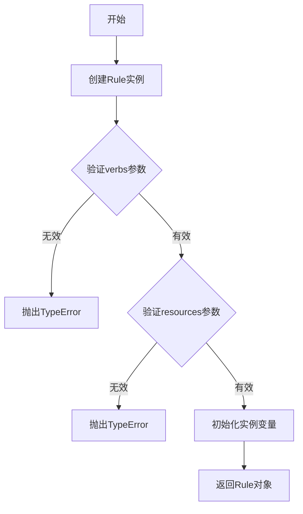
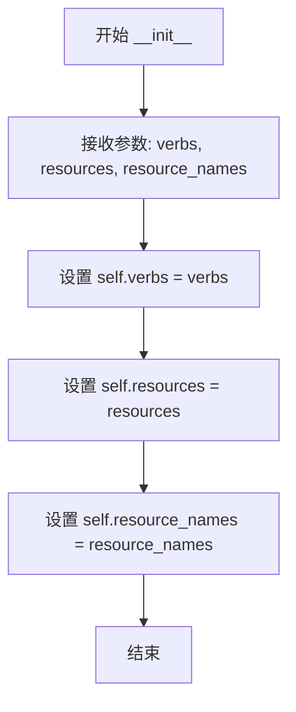

# `KubiScan\engine\rule.py` 详细设计文档

这是一个简单的RBAC策略规则类，用于定义权限控制中的动词、资源和资源名称，支持Kubernetes风格的策略规则配置

## 整体流程



## 类结构

```
Rule (策略规则类)
```

## 全局变量及字段


### `Rule.verbs`
    
定义允许的操作，如['get', 'list', 'create']

类型：`list/tuple`
    


### `Rule.resources`
    
定义作用的资源类型，如['pods', 'services']

类型：`list/tuple`
    


### `Rule.resource_names`
    
可选，指定具体资源名称，None表示作用于所有该类型资源

类型：`list/tuple/None`
    
    

## 全局函数及方法


### Rule.__init__

这是Rule类的构造函数，用于初始化一个权限规则对象，接受权限动作（verbs）、资源类型（resources）和可选的具体资源名称（resource_names）作为参数。

参数：

- `verbs`：`list/tuple`，权限动作列表，定义了该规则允许的操作类型（如 "get"、"post" 等）
- `resources`：`list/tuple`，资源类型列表，指定该规则适用的资源类型（如 "pods"、"services" 等）
- `resource_names`：`list/tuple/None`，可选参数，具体资源名称列表，用于限定特定资源实例，默认为 None

返回值：`None`，构造函数无返回值

#### 流程图



#### 带注释源码

```python
class Rule:
    def __init__(self, verbs, resources, resource_names=None):
        """
        Rule 类的构造函数，初始化权限规则对象
        
        参数:
            verbs (list/tuple): 权限动作列表，如 ['get', 'post', 'delete']
            resources (list/tuple): 资源类型列表，如 ['pods', 'services']
            resource_names (list/tuple/None, optional): 具体资源名称列表，
                                                     用于精确匹配特定资源实例，
                                                     默认为 None（表示匹配所有该类型的资源）
        
        返回值:
            None: 构造函数无返回值
        """
        # 将传入的权限动作列表赋值给实例属性
        self.verbs = verbs
        
        # 将传入的资源类型列表赋值给实例属性
        self.resources = resources
        
        # 将传入的资源名称列表赋值给实例属性（可选，默认为 None）
        self.resource_names = resource_names
```

## 关键组件


### Rule 类

用于定义RBAC策略规则的核心类，封装了 verbs、resources 和 resource_names 三个属性

### verbs 属性

字符串列表，定义规则允许的操作（如 get、list、create、delete 等）

### resources 属性

字符串列表，定义规则适用的资源类型（如 pods、services、configmaps 等）

### resource_names 属性

可选的字符串列表，用于限制规则仅作用于特定的资源实例名称

### __init__ 方法

类的构造函数，接收 verbs 和 resources 必需参数以及 resource_names 可选参数，用于初始化规则对象


## 问题及建议


### 已知问题

-   **参数验证缺失**：未对 `verbs` 和 `resources` 参数进行有效性校验，可能传入空列表或非预期类型导致后续逻辑错误
-   **类型注解缺失**：所有参数和属性均未定义类型注解，不利于静态分析和 IDE 智能提示
-   **文档字符串缺失**：类和方法缺少 docstring，无法快速理解其用途和使用方式
-   **与 Kubernetes API 不完全对应**：注释中提及 `client.V1PolicyRule` 支持 `api_groups`、`non_resource_urls` 等更多参数，但当前实现仅支持部分参数，导致功能不完整
-   **属性可变性**：所有属性为公开可写状态，缺乏不可变性设计，可能在多线程场景下产生竞态条件
-   **调试支持不足**：未实现 `__repr__` 或 `__str__` 方法，实例对象难以直观查看内容

### 优化建议

-   为所有参数和返回值添加类型注解（如 `List[str]`），提升代码可维护性
-   在 `__init__` 方法中添加参数校验逻辑，确保 `verbs` 和 `resources` 为非空列表
-   补充类和方法级别的文档字符串，说明参数含义和业务用途
-   考虑扩展参数列表以匹配 Kubernetes V1PolicyRule 的完整接口，或在文档中明确说明支持的参数范围
-   使用 `__slots__` 限制动态属性，或提供只读属性的 getter 方法，增强对象不可变性
-   实现 `__repr__` 方法，便于调试时查看对象状态
-   考虑添加数据类（dataclass）或 Pydantic 模型替代手写类，提升代码简洁性和类型安全性


## 其它


### 设计目标与约束

本类用于定义Kubernetes RBAC（基于角色的访问控制）策略规则，核心目标是提供一种简洁的方式来描述对Kubernetes资源的操作权限。设计约束包括：仅支持基本的RBAC规则定义，不包含完整的Kubernetes API调用能力；作为轻量级数据模型类，不实现复杂的业务逻辑；遵循Python面向对象设计原则，提供清晰的属性接口。

### 错误处理与异常设计

当前类设计较为简单，未实现显式的错误处理机制。建议增加以下异常处理设计：参数类型验证，当verbs、resources参数类型不为list或tuple时抛出TypeError；参数值校验，当verbs或resources为空列表时抛出ValueError并给出明确提示；对于resource_names参数，应支持None、空列表和字符串列表三种情况，并进行相应处理；考虑定义自定义异常类（如RuleValidationError）以区分不同类型的验证失败。

### 数据流与状态机

该类为简单的数据模型类，不涉及复杂的状态机设计。数据流如下：创建Rule实例时接收verbs（操作动词列表如["get", "list", "create"]）、resources（资源类型列表如["pods", "services"]）、resource_names（可选的具体资源名称列表）；实例化后生成包含这三个属性的Rule对象；该对象通常作为参数传递给Kubernetes RBAC策略创建接口（如client.V1PolicyRule）；无状态变更操作，实例创建后属性为只读。

### 外部依赖与接口契约

根据代码注释，该类与Kubernetes Python客户端库（client）存在潜在关联。完整实现应与client.V1PolicyRule接口保持兼容，后者支持更多参数包括api_groups（非资源API组）、non_resource_urls（非资源URL）等。当前类的设计应作为V1PolicyRule的简化包装器或前置验证层。外部依赖包括：Python标准库（无需额外依赖）；建议依赖kubernetes-client/python库以实现完整的RBAC策略创建能力。

### 使用示例与典型场景

典型使用场景包括：定义命名空间级别的角色权限（Role），定义集群级别的角色权限（ClusterRole），以及在授权服务中构建权限检查规则。使用示例：创建只读权限规则（rule = Rule(verbs=["get", "list"], resources=["pods", "services"])），创建特定资源操作权限（rule = Rule(verbs=["update"], resources=["configmaps"], resource_names=["app-config"]))），创建多动词多资源权限（rule = Rule(verbs=["get", "list", "watch", "create", "delete"], resources=["pods", "deployments", "services"])）。

### 安全性考虑

当前类不涉及敏感数据处理，但作为RBAC权限定义组件，需要注意：resource_names参数应进行输入校验，防止特殊字符导致权限提升；建议记录权限变更日志以便审计；考虑实现权限序列化和反序列化时的安全验证；在多租户场景下需确保权限边界清晰。

### 性能考虑

作为轻量级数据模型，该类性能开销极低。潜在优化点包括：使用__slots__减少内存占用（当前未定义，可能导致较高的内存消耗）；对于大量Rule实例的场景，考虑实现__eq__和__hash__方法以支持集合操作；如需频繁序列化，可添加to_dict()方法直接转换为字典格式。

### 兼容性考虑

当前代码为简化版本，与完整版client.V1PolicyRule的兼容性问题包括：缺少api_groups参数支持，无法定义非资源API组的权限；缺少non_resource_urls参数支持，无法定义对非资源URL（如"/healthz"）的权限；缺少verbs的全参数支持，应考虑添加verbs参数的可选默认值处理。建议在文档中明确标注版本兼容性和迁移路径。

### 测试策略建议

建议补充的测试用例包括：正常创建Rule实例并验证属性赋值正确性；验证resource_names为None、空列表、字符串列表三种情况的处理；测试verbs和resources为空列表时的异常抛出；测试类型错误时的异常处理；测试多个Rule实例的相等性比较（如需要）；集成测试验证与client.V1PolicyRule的兼容性转换。

### 已知限制与扩展方向

当前版本的已知限制包括：仅支持三个基本参数，缺少完整的RBAC策略属性；缺少与Kubernetes API的直接交互能力；未实现属性验证和默认值处理；不支持权限规则的序列化/反序列化。推荐的扩展方向包括：添加所有V1PolicyRule支持的参数；实现from_dict()和to_dict()方法支持JSON序列化；添加validate()方法进行规则有效性校验；考虑添加权限合并或冲突检测逻辑。


    