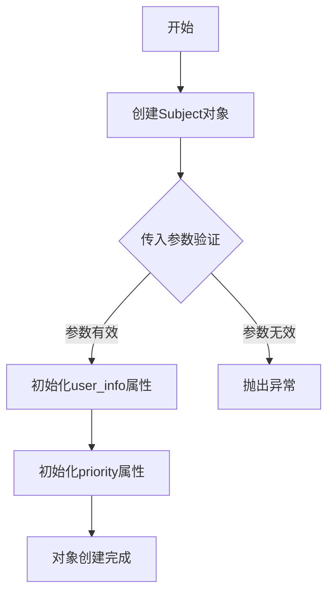
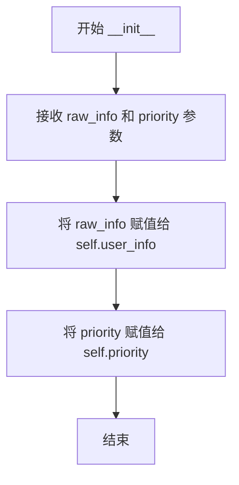

# `KubiScan\engine\subject.py` 详细设计文档

定义了一个Subject类，用于表示Kubernetes RBAC中的主体（用户、组或服务账户），并为其分配优先级。该类封装了用户信息和优先级两个核心属性，支持在多主体场景下进行优先级排序和选择。

## 整体流程



## 类结构

```
Subject
```

## 全局变量及字段


### `Subject.user_info`
    
存储原始的用户信息数据，可能包含用户、组或服务账号的详细信息

类型：`any`
    


### `Subject.priority`
    
表示该主体的优先级，用于排序或优先级决策

类型：`int`
    
    

## 全局函数及方法


### `Subject.__init__`

这是 `Subject` 类的构造函数，用于初始化用户主体对象，接收原始信息和优先级并将其存储为实例属性。

参数：

- `raw_info`：任意类型，表示原始用户信息（可以是 User、Group 或 ServiceAccount 等 Kubernetes 主题对象）
- `priority`：整数，表示该主体的优先级

返回值：`None`，构造函数没有返回值

#### 流程图



#### 带注释源码

```python
class Subject:
    def __init__(self, raw_info, priority):
        """
        初始化 Subject 对象
        
        参数:
            raw_info: 原始用户信息，可以是以下三种类型之一：
                      1. User - 用户主体
                      2. Group - 用户组主体
                      3. ServiceAccount - 服务账户主体
            priority: 整数类型，表示该主体的优先级，用于排序或决策
        
        返回值:
            None
        """
        # 将原始信息存储为实例属性 user_info
        self.user_info = raw_info
        
        # 将优先级存储为实例属性 priority
        self.priority = priority
```

## 关键组件


### Subject 类

表示 Kubernetes 中的主体对象，用于封装用户、用户组或服务账户的信息及其优先级

### raw_info 字段

存储主体的原始信息，类型为任意，用于保存传入的主体详细数据

### priority 字段

表示主体的优先级，类型为整数，用于在多主体场景下进行排序和优先级决策

### __init__ 方法

初始化 Subject 实例，接收 raw_info 和 priority 两个参数，将主体信息和优先级绑定到实例属性上


## 问题及建议


### 已知问题

-   **类型提示缺失**：未使用 Python 类型提示（Type Hints），降低了代码的可读性和静态分析工具的检测能力
-   **文档字符串缺失**：类和构造函数均无文档字符串（docstring），无法明确说明类的用途、参数含义和返回值
-   **参数验证缺失**：未对 `raw_info` 和 `priority` 参数进行类型校验和有效性验证，可能导致运行时错误
-   **命名不一致**：构造函数的参数名为 `raw_info`，而实例属性名为 `user_info`，命名不一致可能导致理解混淆
-   **未使用官方类型**：代码注释引用了 `kubernetes-client/python` 的 `V1Subject`，但实际未使用，存在与官方类型集成的潜在需求
-   **priority 语义不明确**：未说明 `priority` 字段的含义、使用场景及优先级规则（数值越大越高还是越低越高）
-   **可扩展性不足**：类仅包含简单的属性赋值，缺乏如属性验证、序列化、比较操作等常用方法
-   **无错误处理**：未考虑空值输入、类型错误等边界情况的处理

### 优化建议

-   为类和方法添加完整的类型提示和文档字符串
-   在 `__init__` 方法中添加参数类型检查和必要的验证逻辑
-   统一参数命名，建议使用 `user_info` 作为参数名以保持一致性
-   考虑继承自或封装 Kubernetes 官方的 `V1Subject` 类型，以保持类型一致性
-   添加 `__repr__`、`__eq__` 等魔术方法，提升调试和比较体验
-   明确 `priority` 字段的业务含义并在文档中说明
-   添加 getter/setter 方法或使用 `@property` 装饰器进行更精细的属性控制


## 其它


### 设计目标与约束

设计目标：定义Kubernetes RBAC中的主体对象结构，支持User、Group、ServiceAccount三种主体类型，并为其分配优先级用于权限决策排序。

约束：
- raw_info参数应为字典类型，包含主体的原始信息
- priority参数应为整数类型，用于多主体时的优先级比较
- 该类为简单数据容器，不包含业务逻辑

### 错误处理与异常设计

- 暂未定义特定的异常类
- 建议在实例化时对raw_info进行类型检查，确保为字典类型
- 建议对priority进行类型检查和值范围验证（如非负整数）

### 数据流与状态机

数据流：
1. 外部调用方传入raw_info（字典）和priority（整数）
2. 构造函数初始化self.user_info和self.priority
3. 实例被传递给需要主体信息的调用方

状态机：单一状态，无状态转换

### 外部依赖与接口契约

接口契约：
- 构造函数：__init__(self, raw_info, priority)
  - raw_info: dict类型，表示主体的原始信息
  - priority: int类型，表示主体优先级
- 公开属性：user_info（只读）、priority（可读写）

外部依赖：
- 无外部依赖，仅使用Python内置类型

### 安全性考虑

- user_info可能包含敏感的主体认证信息，需注意保密
- 建议在日志输出时避免直接打印user_info的完整内容

### 性能考虑

- 该类为轻量级数据对象，性能开销极低
- 无缓存或计算密集型操作

### 扩展性设计

扩展点：
- 可添加validate()方法验证raw_info的字段完整性
- 可添加compare方法支持优先级比较
- 可添加__repr__方法便于调试
- 可添加类型注解（typing）增强代码可读性

### 测试策略

建议测试用例：
- 正常实例化：验证user_info和priority正确赋值
- 类型验证：测试传入错误类型时的行为
- 属性访问：验证属性可正常读写

### 使用示例

```python
# 创建User主体
user = Subject({"kind": "User", "name": "alice"}, 100)

# 创建Group主体
group = Subject({"kind": "Group", "name": "developers"}, 50)

# 创建ServiceAccount主体
sa = Subject({"kind": "ServiceAccount", "namespace": "default", "name": "deployer"}, 80)
```

### 版本兼容性

- 当前版本：1.0.0
- Python版本要求：3.6+
- 变更历史：初始版本

    