# `KubiScan\engine\utils.py` 详细设计文档

这是一个Kubernetes RBAC安全分析工具，用于扫描集群中的风险角色(Role/ClusterRole)、角色绑定(RoleBinding/ClusterRoleBinding)、风险用户(ServiceAccount)以及运行风险容器的Pod，并通过JWT token分析容器身份，识别潜在的安全威胁。

## 整体流程

```mermaid
graph TD
A[开始] --> B[加载静态风险角色配置]
B --> C[获取所有Role和ClusterRole]
C --> D{遍历每个角色}
D --> E[检查是否为风险角色]
E --> F[获取所有RoleBinding和ClusterRoleBinding]
F --> G{遍历每个绑定}
G --> H[检查绑定是否引用风险角色]
H --> I[提取风险主题/用户]
I --> J{深度分析模式?]
J -- 是 --> K[Exec进入容器读取JWT Token]
J -- 否 --> L[分析Volume挂载的ServiceAccount]
K --> M[解码JWT识别服务账号]
L --> M
M --> N[识别风险Pod和容器]
N --> O[输出风险分析结果]
```

## 类结构

```
无明确类定义（纯函数式模块）
辅助类需从engine模块导入:
├── Role (engine.role)
├── Priority (engine.priority)
├── RoleBinding (engine.role_binding)
├── Subject (engine.subject)
├── Pod (engine.pod)
├── Container (engine.container)
└── JWT Token处理 (engine.jwt_token)
```

## 全局变量及字段


### `list_of_service_accounts`
    
全局变量，缓存所有命名空间的服务账号列表，用于在检查密钥关联时快速查找服务账号

类型：`list[ kubernetes.client.models.v1_service_account.V1ServiceAccount ]`
    


### `STATIC_RISKY_ROLES`
    
从 static_risky_roles 模块导入的静态风险角色定义列表，用于判断角色是否具有风险

类型：`list[ RiskyRole ]`
    


### `ROLE_KIND`
    
从 misc.constants 导入的常量，表示 Kubernetes Role 资源类型

类型：`str`
    


### `CLUSTER_ROLE_KIND`
    
从 misc.constants 导入的常量，表示 Kubernetes ClusterRole 资源类型

类型：`str`
    


### `ROLE_BINDING_KIND`
    
从 misc.constants 导入的常量，表示 Kubernetes RoleBinding 资源类型

类型：`str`
    


### `SERVICEACCOUNT_KIND`
    
从 misc.constants 导入的常量，表示 Kubernetes ServiceAccount 资源类型

类型：`str`
    


### `模块级全局变量.list_of_service_accounts`
    
全局变量，缓存所有命名空间的服务账号列表，用于在检查密钥关联时快速查找服务账号

类型：`list[ kubernetes.client.models.v1_service_account.V1ServiceAccount ]`
    
    

## 全局函数及方法


### is_risky_resource_name_exist

检查源角色中是否存在危险资源名称（循环引用检查）

参数：
- `source_rolename`：str，源角色名称，用于防止循环引用
- `source_resourcenames`：list，源资源名称列表

返回值：`bool`，如果存在危险资源名称返回True，否则返回False

#### 流程图

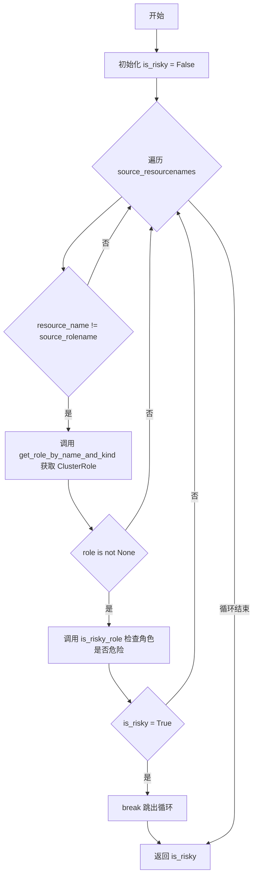

#### 带注释源码

```
def is_risky_resource_name_exist(source_rolename, source_resourcenames):
    """
    检查源角色中是否存在危险资源名称
    
    参数:
        source_rolename: 源角色名称，用于防止循环引用
        source_resourcenames: 源资源名称列表
    返回:
        bool: 是否存在危险资源名称
    """
    is_risky = False
    # 遍历所有资源名称
    for resource_name in source_resourcenames:
        # 防止循环引用：如果资源名称等于源角色名称，则跳过
        if resource_name != source_rolename:
            # TODO: 需要考虑命名空间，也应该允许检查 'roles' 资源名称
            # 根据资源名称获取 ClusterRole 对象
            role = get_role_by_name_and_kind(resource_name, CLUSTER_ROLE_KIND)
            if role is not None:
                # 检查该角色是否为危险角色
                is_risky, priority = is_risky_role(role)
                if is_risky:
                    # 找到危险角色，跳出循环
                    break

    return is_risky
```

---

### is_rule_contains_risky_rule

检查源规则是否包含危险规则

参数：
- `source_role_name`：str，源角色名称
- `source_rule`：Rule，源规则对象
- `risky_rule`：Rule，危险规则对象

返回值：`bool`，如果源规则包含危险规则返回True，否则返回False

#### 流程图

```mermaid
flowchart TD
    A[开始] --> B[初始化标志变量]
    B --> C{遍历 risky_rule.verbs}
    C --> D{verb in source_rule.verbs}
    D -->|否| E[is_contains = False, break]
    D -->|是| F{verb.lower == 'bind'}
    F -->|是| G[is_bind_verb_found = True]
    F -->|否| C
    C -->|循环结束| H{is_contains and source_rule.resources is not None}
    H -->|否| I[is_contains = False]
    H -->|是| J{遍历 risky_rule.resources}
    J --> K{resource in source_rule.resources}
    K -->|否| L[is_contains = False, break]
    K -->|是| M{resource.lower in ['roles', 'clusterroles']}
    M -->|是| N[is_role_resource_found = True]
    M -->|否| J
    J -->|循环结束| O{is_contains and risky_rule.resource_names is not None}
    O -->|否| P[返回 is_contains]
    O -->|是| Q[is_contains = False]
    Q --> R{is_bind_verb_found and is_role_resource_found}
    R -->|否| P
    R -->|是| S[调用 is_risky_resource_name_exist]
    S --> T{is_risky}
    T -->|是| U[is_contains = True]
    T -->|否| P
    P --> V[返回 is_contains]
```

#### 带注释源码

```
def is_rule_contains_risky_rule(source_role_name, source_rule, risky_rule):
    """
    检查源规则是否包含危险规则
    
    参数:
        source_role_name: 源角色名称
        source_rule: 源规则对象
        risky_rule: 危险规则对象
    返回:
        bool: 源规则是否包含危险规则
    """
    is_contains = True
    is_bind_verb_found = False
    is_role_resource_found = False

    # 注意：可以取消注释下面的代码来检查包含 "*" 的规则
    # 当前这部分逻辑在 risky_roles.yaml 中部分处理
    # if (source_rule.verbs is not None and "*" not in source_rule.verbs) 
    #    and (source_rule.resources is not None and "*" not in source_rule.resources):
    
    # 遍历危险规则的所有动词
    for verb in risky_rule.verbs:
        if verb not in source_rule.verbs:
            is_contains = False
            break

        # 检查是否存在 'bind' 动词
        if verb.lower() == "bind":
            is_bind_verb_found = True

    # 如果包含动词且源规则有资源
    if is_contains and source_rule.resources is not None:
        # 遍历危险规则的所有资源
        for resource in risky_rule.resources:
            if resource not in source_rule.resources:
                is_contains = False
                break
            # 检查是否存在 roles 或 clusterroles 资源
            if resource.lower() == "roles" or resource.lower() == "clusterroles":
                is_role_resource_found = True

        # 如果包含资源且危险规则指定了资源名称
        if is_contains and risky_rule.resource_names is not None:
            is_contains = False
            # 只有同时满足 bind 动词和 roles/clusterroles 资源时才检查
            if is_bind_verb_found and is_role_resource_found:
                # 检查资源名称是否存在危险角色
                is_risky = is_risky_resource_name_exist(source_role_name, source_rule.resource_names)
                if is_risky:
                    is_contains = True
    else:
        is_contains = False

    return is_contains
```

---

### get_current_version

获取Kubernetes集群的当前版本

参数：
- `certificate_authority_file`：str，可选，证书授权文件路径
- `client_certificate_file`：str，可选，客户端证书文件路径
- `client_key_file`：str，可选，客户端密钥文件路径
- `host`：str，可选，Kubernetes API服务器地址

返回值：`str` 或 `None`，返回版本号（如"1.28.0"），获取失败返回None

#### 流程图

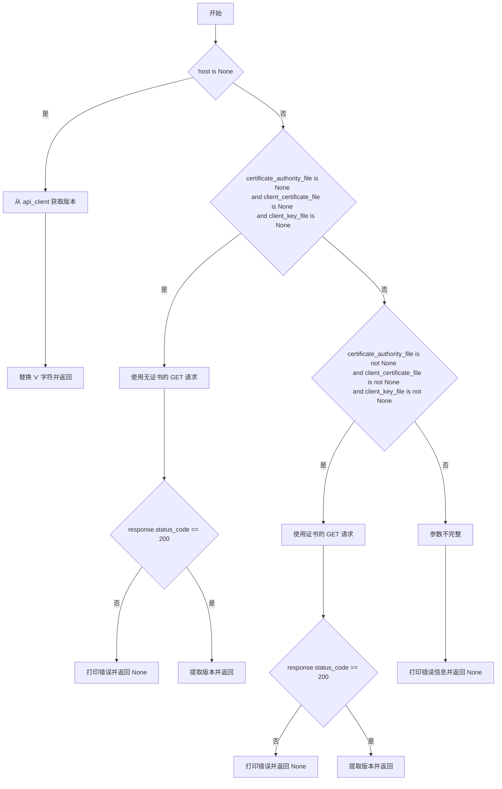

#### 带注释源码

```
def get_current_version(certificate_authority_file=None, client_certificate_file=None, 
                        client_key_file=None, host=None):
    """
    获取Kubernetes集群的当前版本
    
    参数:
        certificate_authority_file: 证书授权文件路径
        client_certificate_file: 客户端证书文件路径
        client_key_file: 客户端密钥文件路径
        host: Kubernetes API服务器地址
    返回:
        str: 版本号（如"1.28.0"），失败返回None
    """
    # 如果没有指定host，使用本地api_client获取版本
    if host is None:
        version = api_client.api_version.get_code().git_version
        return version.replace('v', "")
    else:
        # 无证书的简单请求
        if certificate_authority_file is None and client_certificate_file is None \
           and client_key_file is None:
            response = requests.get(host + '/version', verify=False)
            if response.status_code != 200:
                print(response.text)
                return None
            else:
                return response.json()["gitVersion"].replace('v', "")
        
        # 完整证书配置的请求
        if certificate_authority_file is not None and client_certificate_file is not None \
           and client_key_file is not None:
            response = requests.get(host + '/version', 
                                    cert=(client_certificate_file, client_key_file),
                                    verify=certificate_authority_file)
            if response.status_code != 200:
                print(response.text)
                return None
            else:
                return response.json()["gitVersion"].replace('v', "")
        
        # 参数不完整的情况
        if certificate_authority_file is None or client_certificate_file is None \
           or client_key_file is None or host is None:
            print("Please provide certificate authority file path, client certificate file path, "
                  "client key file path and host address")
            return None
        
        # 默认尝试（兜底逻辑）
        response = requests.get(host + '/version', 
                                cert=(client_certificate_file, client_key_file),
                                verify=certificate_authority_file)
        if response.status_code != 200:
            print(response.text)
            return None
        else:
            return response.json()["gitVersion"].replace('v', "")
```

---

### get_role_by_name_and_kind

根据名称和类型获取角色

参数：
- `name`：str，角色名称
- `kind`：str，角色类型（如"Role"或"ClusterRole"）
- `namespace`：str，可选，命名空间

返回值：`Role` 或 `None`，找到返回角色对象，否则返回None

#### 流程图

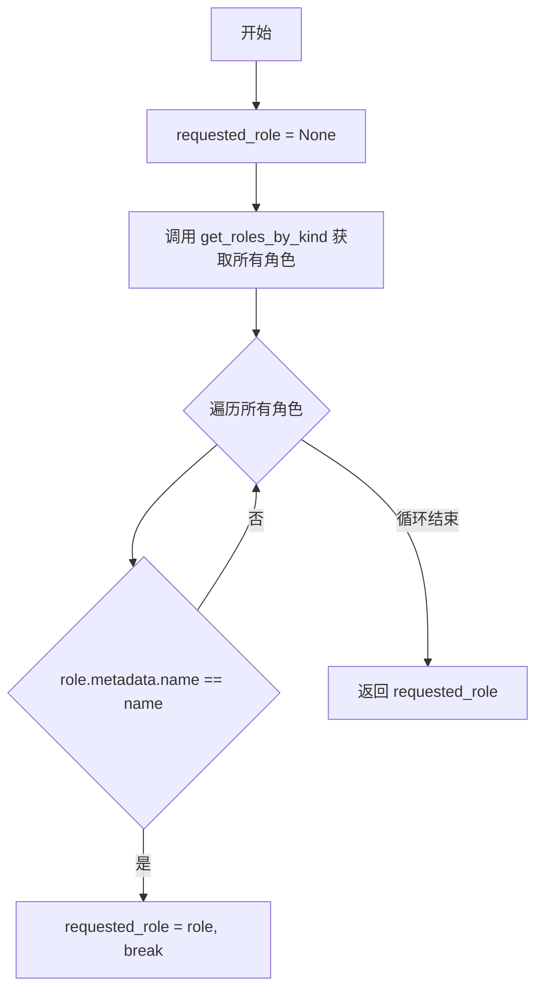

#### 带注释源码

```
def get_role_by_name_and_kind(name, kind, namespace=None):
    """
    根据名称和类型获取角色
    
    参数:
        name: 角色名称
        kind: 角色类型（Role或ClusterRole）
        namespace: 可选的命名空间
    返回:
        Role: 找到返回角色对象，否则返回None
    """
    requested_role = None
    # 根据kind获取所有角色
    roles = get_roles_by_kind(kind)
    # 遍历查找匹配的角色
    for role in roles.items:
        if role.metadata.name == name:
            requested_role = role
            break
    return requested_role
```

---

### are_rules_contain_other_rules

检查源规则列表是否包含目标规则列表中的所有规则

参数：
- `source_role_name`：str，源角色名称
- `source_rules`：list，源规则列表
- `target_rules`：list，目标规则列表

返回值：`bool`，如果源规则包含所有目标规则返回True，否则返回False

#### 流程图

```mermaid
flowchart TD
    A[开始] --> B[初始化 is_contains = False, matched_rules = 0]
    B --> C{not target_rules or not source_rules}
    C -->|是| D[返回 is_contains = False]
    C -->|否| E{遍历 target_rules}
    E --> F{遍历 source_rules}
    F --> G[调用 is_rule_contains_risky_rule]
    G --> H{matched_rules == len(target_rules)}
    H -->|是| I[is_contains = True, return]
    H -->|否| E
    E -->|循环结束| J[返回 is_contains]
```

#### 带注释源码

```
def are_rules_contain_other_rules(source_role_name, source_rules, target_rules):
    """
    检查源规则是否包含目标规则
    
    参数:
        source_role_name: 源角色名称
        source_rules: 源规则列表
        target_rules: 目标规则列表
    返回:
        bool: 源规则是否包含所有目标规则
    """
    is_contains = False
    matched_rules = 0
    
    # 如果任一规则列表为空，直接返回False
    if not (target_rules and source_rules):
        return is_contains
    
    # 遍历目标规则
    for target_rule in target_rules:
        if source_rules is not None:
            # 遍历源规则，查找匹配
            for source_rule in source_rules:
                if is_rule_contains_risky_rule(source_role_name, source_rule, target_rule):
                    matched_rules += 1
                    # 如果匹配的目标规则数等于目标规则总数，说明完全包含
                    if matched_rules == len(target_rules):
                        is_contains = True
                        return is_contains

    return is_contains
```

---

### is_risky_role

检查角色是否为危险角色

参数：
- `role`：Role，角色对象

返回值：`tuple(bool, Priority)`，元组包含是否危险和优先级

#### 流程图

```mermaid
flowchart TD
    A[开始] --> B[初始化 is_risky = False, priority = LOW]
    B --> C{遍历 STATIC_RISKY_ROLES}
    C --> D[调用 are_rules_contain_other_rules]
    D --> E{is_contains = True}
    E -->|是| F[is_risky = True, priority = risky_role.priority, break]
    E -->|否| C
    C -->|循环结束| G[返回 (is_risky, priority)]
```

#### 带注释源码

```
def is_risky_role(role):
    """
    检查角色是否为危险角色
    
    参数:
        role: 角色对象
    返回:
        tuple: (是否危险, 优先级)
    """
    is_risky = False
    priority = Priority.LOW
    
    # 遍历所有预定义的危险角色
    for risky_role in STATIC_RISKY_ROLES:
        # 检查当前角色的规则是否包含危险角色的规则
        if are_rules_contain_other_rules(role.metadata.name, role.rules, risky_role.rules):
            is_risky = True
            priority = risky_role.priority
            break

    return is_risky, priority
```

---

### find_risky_roles

从角色列表中找出所有危险角色

参数：
- `roles`：list，角色列表
- `kind`：str，角色类型

返回值：`list`，危险角色对象列表

#### 流程图

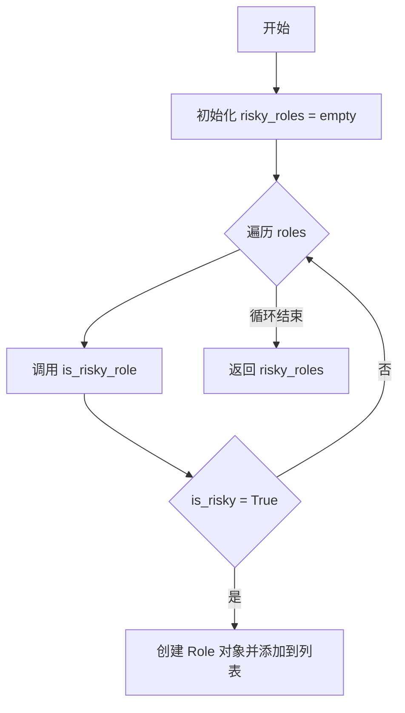

#### 带注释源码

```
def find_risky_roles(roles, kind):
    """
    从角色列表中找出所有危险角色
    
    参数:
        roles: 角色列表
        kind: 角色类型（Role或ClusterRole）
    返回:
        list: 危险角色对象列表
    """
    risky_roles = []
    # 遍历所有角色
    for role in roles:
        # 检查是否为危险角色
        is_risky, priority = is_risky_role(role)
        if is_risky:
            # 创建并添加危险角色对象
            risky_roles.append(
                Role(role.metadata.name, priority, rules=role.rules, 
                     namespace=role.metadata.namespace, kind=kind,
                     time=role.metadata.creation_timestamp))

    return risky_roles
```

---

### get_roles_by_kind

根据类型获取所有角色

参数：
- `kind`：str，角色类型（"Role"或"ClusterRole"）

返回值：`list`，角色列表

#### 流程图

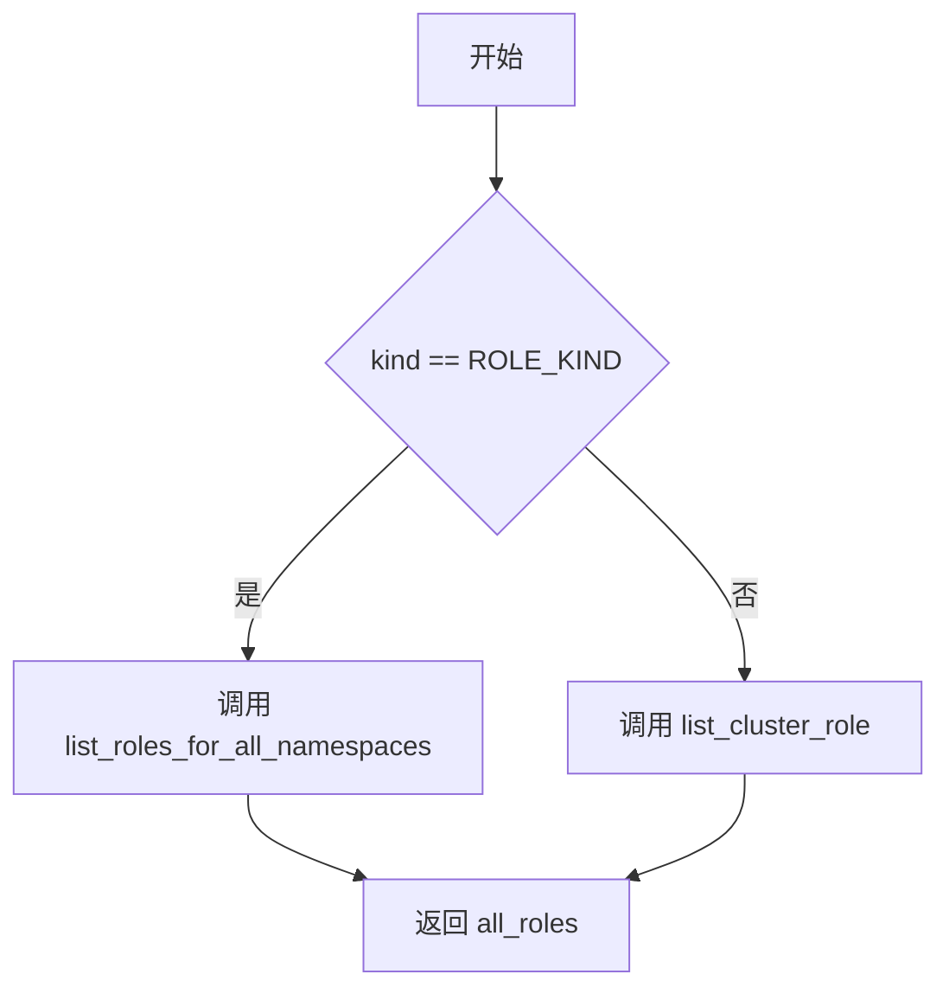

#### 带注释源码

```
def get_roles_by_kind(kind):
    """
    根据类型获取所有角色
    
    参数:
        kind: 角色类型（Role或ClusterRole）
    返回:
        list: 角色列表
    """
    all_roles = []
    if kind == ROLE_KIND:
        # 获取所有命名空间下的Role
        # all_roles = api_client.RbacAuthorizationV1Api.list_role_for_all_namespaces()
        all_roles = Config.api_client.list_roles_for_all_namespaces()
    else:
        # 获取所有ClusterRole
        # all_roles = api_client.RbacAuthorizationV1Api.list_cluster_role()
        # all_roles = api_client.api_temp.list_cluster_role() 
        all_roles = Config.api_client.list_cluster_role()
    return all_roles
```

---

### get_risky_role_by_kind

根据类型获取所有危险角色

参数：
- `kind`：str，角色类型（"Role"或"ClusterRole"）

返回值：`list`，危险角色列表

#### 流程图

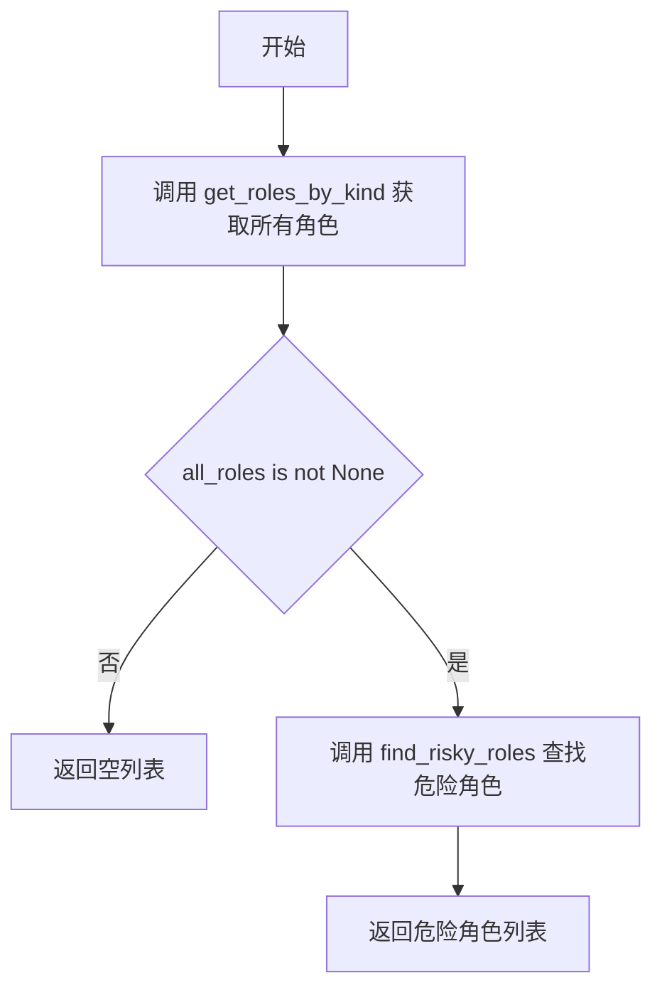

#### 带注释源码

```
def get_risky_role_by_kind(kind):
    """
    根据类型获取所有危险角色
    
    参数:
        kind: 角色类型（Role或ClusterRole）
    返回:
        list: 危险角色列表
    """
    risky_roles = []

    # 获取指定类型的所有角色
    all_roles = get_roles_by_kind(kind)

    # 如果获取成功，查找危险角色
    if all_roles is not None:
        risky_roles = find_risky_roles(all_roles.items, kind)

    return risky_roles
```

---

### get_risky_roles_and_clusterroles

获取所有危险角色和危险集群角色

参数：无

返回值：`list`，所有危险角色列表（包含Role和ClusterRole）

#### 流程图

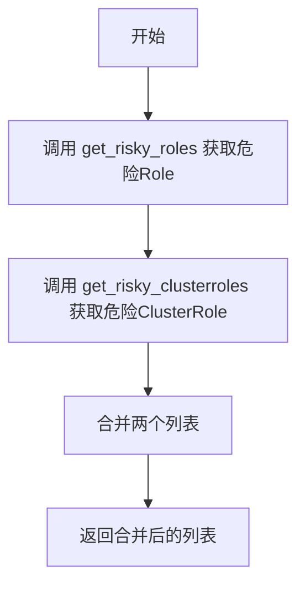

#### 带注释源码

```
def get_risky_roles_and_clusterroles():
    """
    获取所有危险角色和危险集群角色
    
    返回:
        list: 所有危险角色列表
    """
    # 获取危险的Role
    risky_roles = get_risky_roles()
    # 获取危险的ClusterRole
    risky_clusterroles = get_risky_clusterroles()

    # 合并结果
    # return risky_roles, risky_clusterroles
    all_risky_roles = risky_roles + risky_clusterroles
    return all_risky_roles
```

---

### get_risky_roles

获取所有危险角色（Role）

参数：无

返回值：`list`，危险Role列表

#### 流程图

```mermaid
flowchart TD
    A[开始] --> B[调用 get_risky_role_by_kind('Role')]
    B --> C[返回结果]
```

#### 带注释源码

```
def get_risky_roles():
    """
    获取所有危险角色（Role）
    
    返回:
        list: 危险Role列表
    """
    return get_risky_role_by_kind('Role')
```

---

### get_risky_clusterroles

获取所有危险集群角色（ClusterRole）

参数：无

返回值：`list`，危险ClusterRole列表

#### 流程图

```mermaid
flowchart TD
    A[开始] --> B[调用 get_risky_role_by_kind('ClusterRole')]
    B --> C[返回结果]
```

#### 带注释源码

```
def get_risky_clusterroles():
    """
    获取所有危险集群角色（ClusterRole）
    
    返回:
        list: 危险ClusterRole列表
    """
    return get_risky_role_by_kind('ClusterRole')
```


### `is_risky_rolebinding`

该函数用于判断给定的 RoleBinding 或 ClusterRoleBinding 是否关联到危险角色（risky role）。它通过遍历预定义的危险角色列表，检查 RoleBinding 的 role_ref.name 是否与危险角色名称匹配来确定风险性。

参数：

- `risky_roles`：`List[Role]`，危险角色列表，包含所有需要检查的危险角色对象
- `rolebinding`：`Any`，Kubernetes 的 RoleBinding 或 ClusterRoleBinding 对象，需要检查其是否关联危险角色

返回值：`Tuple[bool, Priority]`，返回元组包含两个元素：第一个是布尔值表示是否危险，第二个是 Priority 枚举表示危险优先级

#### 流程图

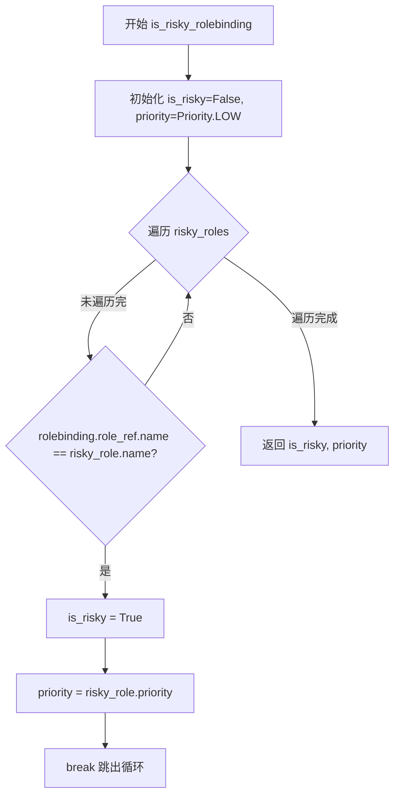

#### 带注释源码

```
def is_risky_rolebinding(risky_roles, rolebinding):
    """
    检查给定的 RoleBinding 是否关联到危险角色
    
    参数:
        risky_roles: 危险角色列表
        rolebinding: 要检查的 RoleBinding 对象
    
    返回:
        (is_risky, priority) 元组
    """
    is_risky = False
    priority = Priority.LOW
    # 遍历所有危险角色，检查 RoleBinding 引用的角色是否为危险角色
    for risky_role in risky_roles:
        # It is also possible to add check for role kind
        # 检查 RoleBinding 引用的角色名称是否与危险角色名称匹配
        if rolebinding.role_ref.name == risky_role.name:
            is_risky = True
            priority = risky_role.priority
            # 找到危险角色后跳出循环，提高效率
            break

    return is_risky, priority
```

---

### `find_risky_rolebindings_or_clusterrolebindings`

该函数用于从 RoleBinding 或 ClusterRoleBinding 列表中筛选出所有关联到危险角色的绑定。它调用 is_risky_rolebinding 函数对每个绑定进行风险评估，并将危险的绑定转换为自定义的 RoleBinding 对象。

参数：

- `risky_roles`：`List[Role]`，危险角色列表，用于判断 RoleBinding 是否危险
- `rolebindings`：`List[Any]`，
- `kind`：`str`，绑定类型，值为 "RoleBinding" 或 "ClusterRoleBinding"

返回值：`List[RoleBinding]`，返回危险的 RoleBinding 对象列表

#### 流程图

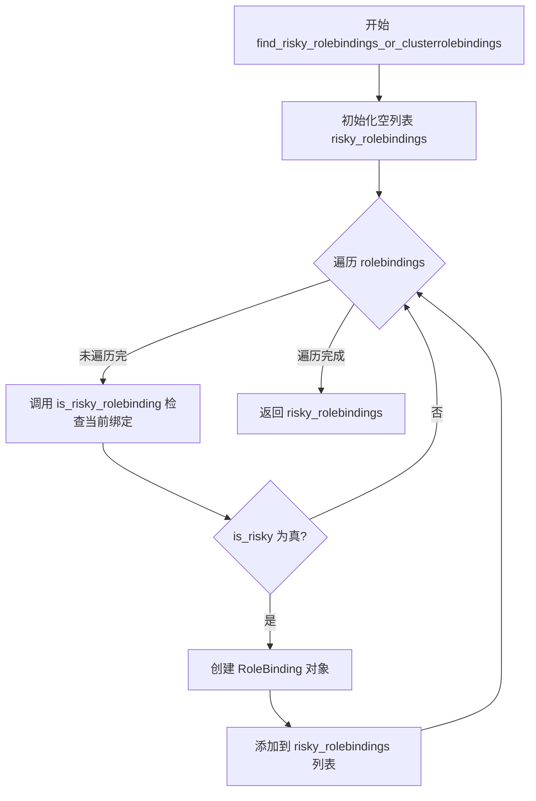

#### 带注释源码

```
def find_risky_rolebindings_or_clusterrolebindings(risky_roles, rolebindings, kind):
    """
    从 RoleBinding 或 ClusterRoleBinding 列表中找出所有危险的绑定
    
    参数:
        risky_roles: 危险角色列表
        rolebindings: 要检查的绑定列表
        kind: 绑定类型 'RoleBinding' 或 'ClusterRoleBinding'
    
    返回:
        危险的 RoleBinding 对象列表
    """
    risky_rolebindings = []
    # 遍历所有 RoleBinding/ClusterRoleBinding
    for rolebinding in rolebindings:
        # 调用 is_risky_rolebinding 判断当前绑定是否危险
        is_risky, priority = is_risky_rolebinding(risky_roles, rolebinding)
        if is_risky:
            # 将危险的绑定转换为 RoleBinding 对象并添加到结果列表
            risky_rolebindings.append(RoleBinding(rolebinding.metadata.name,
                                                  priority,
                                                  namespace=rolebinding.metadata.namespace,
                                                  kind=kind, subjects=rolebinding.subjects,
                                                  time=rolebinding.metadata.creation_timestamp))
    return risky_rolebindings
```

---

### `get_rolebinding_by_kind_all_namespaces`

该函数用于获取指定类型（RoleBinding 或 ClusterRoleBinding）的所有绑定，跨所有命名空间。它内部调用 Kubernetes API 来获取集群中的绑定资源。

参数：

- `kind`：`str`，绑定类型，值为 "RoleBinding" 或 "ClusterRoleBinding"

返回值：`Any`，返回 Kubernetes API 返回的绑定列表对象

#### 流程图

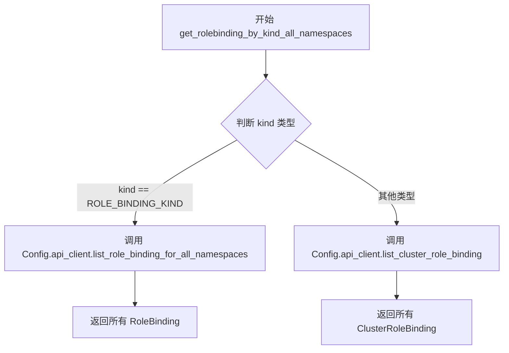

#### 带注释源码

```
def get_rolebinding_by_kind_all_namespaces(kind):
    """
    获取指定类型的所有 RoleBinding 或 ClusterRoleBinding（跨所有命名空间）
    
    参数:
        kind: 绑定类型，'RoleBinding' 或 'ClusterRoleBinding'
    
    返回:
        Kubernetes API 返回的绑定列表对象
    """
    all_roles = []
    # 根据 kind 类型调用不同的 Kubernetes API
    if kind == ROLE_BINDING_KIND:
        # 获取所有命名空间的 RoleBinding
        all_roles = Config.api_client.list_role_binding_for_all_namespaces()
    # else:
    # TODO: check if it was fixed
    # all_roles = api_client.RbacAuthorizationV1Api.list_cluster_role_binding()

    return all_roles
```

---

### `get_all_risky_rolebinding`

该函数是顶层入口函数，用于获取所有危险的 RoleBinding 和 ClusterRoleBinding。它首先调用 get_risky_roles_and_clusterroles 获取所有危险角色，然后分别调用 get_risky_rolebindings 和 get_risky_clusterrolebindings 获取危险的绑定，最后合并结果返回。

参数：

- 无参数

返回值：`List[RoleBinding]`，返回所有危险的 RoleBinding 和 ClusterRoleBinding 列表

#### 流程图

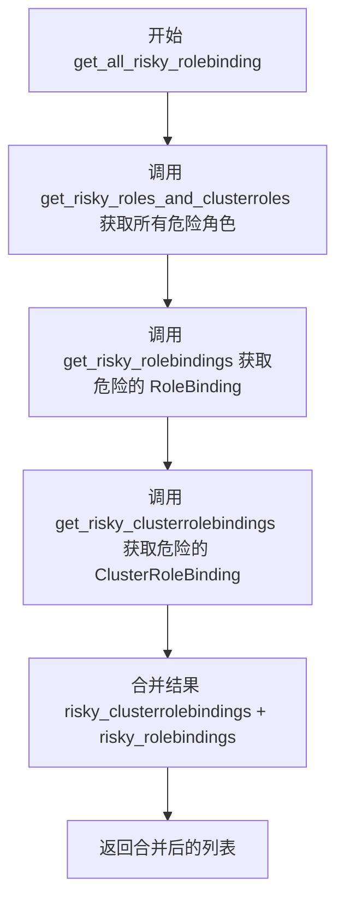

#### 带注释源码

```
def get_all_risky_rolebinding():
    """
    获取所有危险的 RoleBinding 和 ClusterRoleBinding
    
    这是一个顶层入口函数，流程如下:
    1. 获取所有危险角色（包括 Role 和 ClusterRole）
    2. 分别获取危险的 RoleBinding 和 ClusterRoleBinding
    3. 合并结果并返回
    
    参数:
        无
    
    返回:
        所有危险的 RoleBinding 和 ClusterRoleBinding 列表
    """
    # 第一步：获取所有危险角色（包括 Role 和 ClusterRole）
    all_risky_roles = get_risky_roles_and_clusterroles()

    # 第二步：获取危险的 RoleBinding（命名空间级别）
    risky_rolebindings = get_risky_rolebindings(all_risky_roles)
    # 第三步：获取危险的 ClusterRoleBinding（集群级别）
    risky_clusterrolebindings = get_risky_clusterrolebindings(all_risky_roles)

    # 合并结果并返回
    risky_rolebindings_and_clusterrolebindings = risky_clusterrolebindings + risky_rolebindings
    return risky_rolebindings_and_clusterrolebindings
```

---

### `get_risky_rolebindings`

该函数用于获取所有危险的 RoleBinding（命名空间级别）。它首先获取所有危险角色，然后获取所有 RoleBinding，最后通过调用 find_risky_rolebindings_or_clusterrolebindings 筛选出危险的绑定。如果未提供危险角色列表，则自动获取。

参数：

- `all_risky_roles`：`Optional[List[Role]]`，可选参数，危险角色列表，如果为 None 则自动获取

返回值：`List[RoleBinding]`，返回危险的 RoleBinding 对象列表

#### 流程图

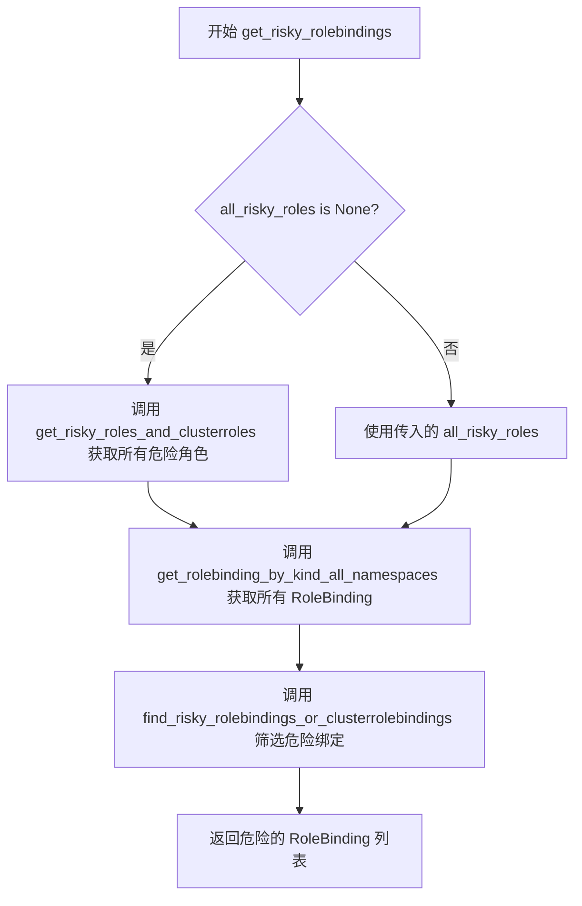

#### 带注释源码

```
def get_risky_rolebindings(all_risky_roles=None):
    """
    获取所有危险的 RoleBinding（命名空间级别）
    
    参数:
        all_risky_roles: 可选的危险角色列表，如果为 None 则自动获取
    
    返回:
        危险的 RoleBinding 对象列表
    """
    # 如果未提供危险角色列表，则自动获取
    if all_risky_roles is None:
        all_risky_roles = get_risky_roles_and_clusterroles()
    
    # 获取所有命名空间的 RoleBinding
    all_rolebindings = get_rolebinding_by_kind_all_namespaces(ROLE_BINDING_KIND)
    # 筛选出危险的 RoleBinding
    risky_rolebindings = find_risky_rolebindings_or_clusterrolebindings(all_risky_roles, all_rolebindings.items,
                                                                        "RoleBinding")

    return risky_rolebindings
```

---

### `get_risky_clusterrolebindings`

该函数用于获取所有危险的 ClusterRoleBinding（集群级别）。它首先获取所有危险角色，然后获取所有 ClusterRoleBinding，最后通过调用 find_risky_rolebindings_or_clusterrolebindings 筛选出危险的绑定。如果未提供危险角色列表，则自动获取。

参数：

- `all_risky_roles`：`Optional[List[Role]]`，可选参数，危险角色列表，如果为 None 则自动获取

返回值：`List[RoleBinding]`，返回危险的 ClusterRoleBinding 对象列表

#### 流程图

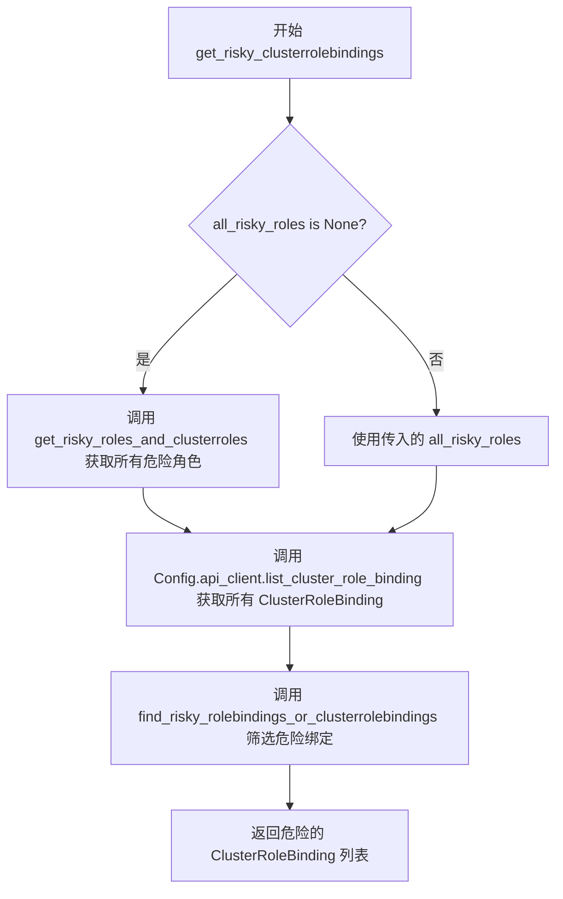

#### 带注释源码

```
def get_risky_clusterrolebindings(all_risky_roles=None):
    """
    获取所有危险的 ClusterRoleBinding（集群级别）
    
    参数:
        all_risky_roles: 可选的危险角色列表，如果为 None 则自动获取
    
    返回:
        危险的 ClusterRoleBinding 对象列表
    """
    # 如果未提供危险角色列表，则自动获取
    if all_risky_roles is None:
        all_risky_roles = get_risky_roles_and_clusterroles()
    
    # Cluster doesn't work.
    # https://github.com/kubernetes-client/python/issues/577 - when it will be solve, can remove the comments
    # all_clusterrolebindings = api_client.RbacAuthorizationV1Api.list_cluster_role_binding()
    # 获取所有 ClusterRoleBinding
    all_clusterrolebindings = Config.api_client.list_cluster_role_binding()
    
    # 筛选出危险的 ClusterRoleBinding
    # risky_clusterrolebindings = find_risky_rolebindings(all_risky_roles, all_clusterrolebindings.items, "ClusterRoleBinding")
    risky_clusterrolebindings = find_risky_rolebindings_or_clusterrolebindings(all_risky_roles, all_clusterrolebindings,
                                                                               "ClusterRoleBinding")
    return risky_clusterrolebindings
```


### `get_all_risky_subjects`

该函数用于从所有有风险的角色绑定（RoleBinding 和 ClusterRoleBinding）中提取唯一的有风险用户（Subject），并为每个用户关联对应的风险优先级。它会遍历所有有风险的角色绑定，提取其中的用户主体，去除重复项，并返回包含风险用户及其优先级的列表。

参数： 无

返回值：`List[Subject]`，返回所有有风险的用户（Subject）列表，每个 Subject 对象包含用户信息和对应的风险优先级。

#### 流程图

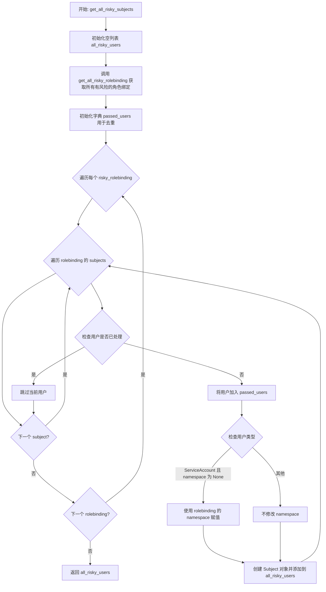

#### 带注释源码

```python
def get_all_risky_subjects():
    """
    从所有有风险的角色绑定中提取唯一的有风险用户（Subject）。
    
    该函数会：
    1. 获取所有有风险的角色绑定（包括 RoleBinding 和 ClusterRoleBinding）
    2. 遍历每个角色绑定的 subjects（用户、组、服务账号等）
    3. 去除重复的用户（基于 kind、name、namespace 的组合）
    4. 为每个用户关联其所属角色绑定的风险优先级
    5. 返回所有有风险用户的列表
    
    返回:
        List[Subject]: 包含所有有风险用户及其优先级的列表
    """
    # 初始化存储有风险用户的列表
    all_risky_users = []
    
    # 调用 get_all_risky_rolebinding() 获取所有有风险的角色绑定
    # 该函数内部会调用 get_risky_roles() 和 get_risky_clusterroles()
    # 然后根据这些角色查找对应的 RoleBinding 和 ClusterRoleBinding
    all_risky_rolebindings = get_all_risky_rolebinding()
    
    # 使用字典进行去重，key 为 'kind + name + namespace' 的组合
    # value 固定为 True，仅用于存在性检查
    passed_users = {}
    
    # 遍历每个有风险的角色绑定
    for risky_rolebinding in all_risky_rolebindings:
        
        # 使用 'or []' 防止 subjects 为 None 时抛出异常
        # In case 'risky_rolebinding.subjects' is 'None', 'or []' will prevent an exception.
        for user in risky_rolebinding.subjects or []:
            
            # 构建唯一键用于去重：拼接 kind、name 和 namespace
            # Removing duplicated users
            user_key = ''.join((user.kind, user.name, str(user.namespace)))
            
            # 如果该用户还未被处理过
            if user_key not in passed_users:
                # 标记该用户已处理
                passed_users[user_key] = True
                
                # 特殊处理 ServiceAccount：
                # 如果用户的 namespace 为 None 且类型是 ServiceAccount
                # 则从所属的 RoleBinding 中获取 namespace 进行填充
                # （ClusterRoleBinding 可能没有 namespace，需要从绑定中继承）
                if user.namespace == None and (user.kind).lower() == "serviceaccount":
                    user.namespace = risky_rolebinding.namespace
                
                # 创建 Subject 对象，传入用户信息和对应的风险优先级
                # risky_rolebinding.priority 来自关联的风险角色
                all_risky_users.append(Subject(user, risky_rolebinding.priority))
    
    # 返回所有有风险的用户列表
    return all_risky_users
```


# 代码详细设计文档

## 一、代码核心功能概述

该代码是一个Kubernetes安全审计工具，主要用于识别具有潜在安全风险的Pod、容器、用户和角色。通过解析JWT令牌、检查ServiceAccount、角色绑定和卷挂载，检测并标记可能被恶意利用的高风险资源。

## 二、文件整体运行流程

代码主要分为以下几个区域：
1. **Roles和ClusterRoles处理** - 识别风险角色
2. **RoleBindings和ClusterRoleBindings处理** - 识别风险角色绑定
3. **Risky Users处理** - 从角色绑定中提取所有风险主体
4. **Risky Pods处理** - 核心功能，识别具有风险用户的Pod和容器

---

## 三、类详细信息

### 导入的外部模块和类
- `requests` - HTTP请求库
- `Role`, `Priority` - 引擎角色和优先级类
- `RoleBinding` - 角色绑定类
- `Pod`, `Container` - Kubernetes资源类
- `Subject` - 主体类
- `api_client` - Kubernetes API客户端

---

## 四、函数详细信息

### `pod_exec_read_token`

在指定Pod的指定容器中执行命令读取token文件。

参数：
- `pod`：`Pod`对象，Kubernetes Pod实例
- `container_name`：`str`，目标容器名称
- `path`：`str`，要读取的token文件路径

返回值：`str`，读取到的token内容，如果失败返回空字符串

#### 流程图

```mermaid
flowchart TD
    A[开始] --> B[构建cat命令]
    B --> C[执行stream调用]
    C --> D{API调用是否成功?}
    D -->|是| E[返回响应内容]
    D -->|否| F[打印异常信息]
    F --> G[返回空字符串]
    E --> G
```

#### 带注释源码

```python
def pod_exec_read_token(pod, container_name, path):
    # 构建cat命令，用于读取指定路径的文件
    cat_command = 'cat ' + path
    # 构建执行命令列表，使用/bin/sh执行cat命令
    exec_command = ['/bin/sh',
                    '-c',
                    cat_command]
    resp = ''
    try:
        # 使用Kubernetes流API在指定容器的Pod中执行命令
        # 参数：pod名称、命名空间、执行命令、容器名、错误流、输入流、输出流、tty模式
        resp = stream(api_client.CoreV1Api.connect_post_namespaced_pod_exec, pod.metadata.name, pod.metadata.namespace,
                      command=exec_command, container=container_name,
                      stderr=False, stdin=False,
                      stdout=True, tty=False)
    except ApiException as e:
        # 捕获API异常并打印错误信息
        print("Exception when calling api_client.CoreV1Api->connect_post_namespaced_pod_exec: %s\n" % e)
        print('{0}, {1}'.format(pod.metadata.name, pod.metadata.namespace))

    return resp
```

---

### `pod_exec_read_token_two_paths`

尝试从两个默认路径读取token，优先尝试第一个路径。

参数：
- `pod`：`Pod`对象，Kubernetes Pod实例
- `container_name`：`str`，目标容器名称

返回值：`str`，读取到的token内容，如果两个路径都失败返回空字符串

#### 流程图

```mermaid
flowchart TD
    A[开始] --> B[尝试第一个路径/run/secrets/...]
    B --> C{第一个路径是否成功?}
    C -->|是| D[返回token]
    C -->|否| E[尝试第二个路径/var/run/secrets/...]
    E --> F{第二个路径是否成功?}
    F -->|是| D
    F -->|否| G[返回空字符串]
```

#### 带注释源码

```python
def pod_exec_read_token_two_paths(pod, container_name):
    # 首先尝试读取/run/secrets/kubernetes.io/serviceaccount/token路径
    result = pod_exec_read_token(pod, container_name, '/run/secrets/kubernetes.io/serviceaccount/token')
    # 如果第一个路径失败，尝试备用路径
    if result == '':
        result = pod_exec_read_token(pod, container_name, '/var/run/secrets/kubernetes.io/serviceaccount/token')
    return result
```

---

### `get_jwt_token_from_container`

从容器中获取并解码JWT token。

参数：
- `pod`：`Pod`对象，Kubernetes Pod实例
- `container_name`：`str`，目标容器名称

返回值：`(dict, str)`，元组包含解码后的token body（字典）和原始token字符串

#### 流程图

```mermaid
flowchart TD
    A[开始] --> B[调用pod_exec_read_token_two_paths]
    B --> C{token是否有效?}
    C -->|否| D[返回空token_body和空resp]
    C -->|是| E{token是否为OCI格式?}
    E -->|是| D
    E -->|否| F[解码JWT token]
    F --> G{token解析成功?}
    G -->|是| H[解析JSON返回token_body]
    G -->|否| I[打印错误并返回空]
    H --> J[返回token_body和原始resp]
    D --> J
```

#### 带注释源码

```python
def get_jwt_token_from_container(pod, container_name):
    # 调用两路径读取方法获取原始token
    resp = pod_exec_read_token_two_paths(pod, container_name)

    token_body = ''
    # 检查响应是否有效且不是OCI格式（某些容器运行时的特殊格式）
    if resp != '' and not resp.startswith('OCI'):
        # 导入JWT解码模块
        from engine.jwt_token import decode_jwt_token_data
        # 解码JWT token数据
        decoded_data = decode_jwt_token_data(resp)
        if decoded_data is not None and decoded_data != '':
            try:
                # 将解码后的JSON字符串解析为字典
                token_body = json.loads(decoded_data)
            except json.JSONDecodeError as e:
                # 捕获JSON解析错误
                print(f"Error decoding JWT token for container {container_name} in pod {pod.metadata.name}: {e}")
    
    return token_body, resp
```

---

### `is_same_user`

比较两个用户信息是否相同（用户名和命名空间都相同）。

参数：
- `a_username`：`str`，第一个用户名
- `a_namespace`：`str`，第一个用户所属命名空间
- `b_username`：`str`，第二个用户名
- `b_namespace`：`str`，第二个用户所属命名空间

返回值：`bool`，用户和命名空间都相同时返回True

#### 带注释源码

```python
def is_same_user(a_username, a_namespace, b_username, b_namespace):
    # 比较两个用户的用户名和命名空间是否完全相同
    return (a_username == b_username and a_namespace == b_namespace)
```

---

### `get_risky_user_from_container`

从JWT token body中提取服务账户信息，并与风险用户列表匹配。

参数：
- `jwt_body`：`dict`，JWT token解析后的内容
- `risky_users`：`list`，风险用户列表

返回值：`Subject`对象或`None`，匹配到的风险用户，不匹配则返回None

#### 流程图

```mermaid
flowchart TD
    A[开始] --> B[从jwt_body提取serviceaccount信息]
    B --> C{是否有serviceaccount信息?}
    C -->|否| D[返回None]
    C -->|是| E[提取name和namespace]
    E --> F{name和namespace都存在?}
    F -->|否| G[尝试备用结构]
    G --> H{备用结构有数据?}
    H -->|否| D
    H -->|是| I[遍历risky_users]
    F -->|是| I
    I --> J{找到匹配用户?}
    J -->|是| K[返回匹配的risky_user]
    J -->|否| L[返回None]
    K --> M[结束]
    L --> M
    D --> M
```

#### 带注释源码

```python
def get_risky_user_from_container(jwt_body, risky_users):
    risky_user_in_container = None
    
    # 尝试从JWT body中获取kubernetes.io下的serviceaccount信息
    service_account_info = jwt_body.get('kubernetes.io', {}).get('serviceaccount', {})
    if not service_account_info:
        return None
    
    # 从第一层结构中获取服务账户名称和命名空间
    service_account_name = service_account_info.get('name')
    service_account_namespace = jwt_body.get('kubernetes.io', {}).get('namespace')

    # 如果主要结构中没有完整信息，尝试备用结构
    if not service_account_name or not service_account_namespace:
        # Fallback to the alternative structure (kubernetes.io/serviceaccount/...)
        service_account_name = jwt_body.get('kubernetes.io/serviceaccount/service-account.name')
        service_account_namespace = jwt_body.get('kubernetes.io/serviceaccount/namespace')

    # 如果成功获取服务账户名称和命名空间，遍历风险用户列表进行匹配
    if service_account_name and service_account_namespace:
        for risky_user in risky_users:
            # 只检查ServiceAccount类型的用户
            if risky_user.user_info.kind == 'ServiceAccount':
                # 使用is_same_user函数比较用户名和命名空间
                if is_same_user(service_account_name,
                                service_account_namespace,
                                risky_user.user_info.name, 
                                risky_user.user_info.namespace):
                    risky_user_in_container = risky_user
                    break

    return risky_user_in_container
```

---

### `get_risky_containers`

识别Pod中的风险容器。

参数：
- `pod`：`Pod`对象，Kubernetes Pod实例
- `risky_users`：`list`，风险用户列表
- `read_token_from_container`：`bool`，是否从容器内读取token（深度分析模式）

返回值：`list`，风险容器列表

#### 流程图

```mermaid
flowchart TD
    A[开始] --> B{read_token_from_container?}
    B -->|是| C[遍历pod.status.container_statuses]
    C --> D{容器ready且running?}
    D -->|否| E[跳过]
    D -->|是| F[获取JWT token]
    F --> G{token有效?}
    G -->|是| H[获取risky_user]
    H --> I{找到risky_user?}
    I -->|是| J[添加到risky_containers]
    I -->|否| E
    G -->|否| E
    B -->|否| K[构建volumes_dict]
    K --> L[遍历pod.spec.containers]
    L --> M[调用get_risky_users_from_container]
    M --> N{容器已存在?}
    N -->|是| O[跳过]
    N -->|否| P{有risky_users?}
    P -->|是| Q[获取最高优先级]
    Q --> R[创建Container添加到列表]
    P -->|否| O
    J --> S[返回risky_containers列表]
    R --> S
    O --> S
```

#### 带注释源码

```python
def get_risky_containers(pod, risky_users, read_token_from_container=False):
    risky_containers = []
    # 如果启用深度分析模式，直接从运行的容器中读取token
    if read_token_from_container:
        # Skipping terminated and evicted pods
        # This will run only on the containers with the "ready" status
        if pod.status.container_statuses:
            for container in pod.status.container_statuses:
                # 只处理处于就绪状态且正在运行的容器
                if container.ready and container.state.running:
                    jwt_body, _ = get_jwt_token_from_container(pod, container.name)
                    if jwt_body:
                        # 检查容器中运行的用户是否是风险用户
                        risky_user = get_risky_user_from_container(jwt_body, risky_users)
                        if risky_user:
                           risky_containers.append(
                                Container(
                                    container.name, 
                                    risky_user.user_info.name,
                                    risky_user.user_info.namespace,  
                                    # 如果risky_user为None则创建空集合，否则创建包含risky_user的集合
                                    set() if risky_user is None else {risky_user}, 
                                    risky_user.priority
                                )
                            )

    else:
        # 非深度分析模式，通过卷挂载和service account进行判断
        # A dictionary for the volume
        volumes_dict = {}
        # 构建卷名称到卷对象的映射字典
        for volume in pod.spec.volumes or []:
            volumes_dict[volume.name] = volume
        # 遍历Pod中的所有容器
        for container in pod.spec.containers:
            # 获取容器关联的风险用户集合
            risky_users_set = get_risky_users_from_container(container, risky_users, pod, volumes_dict)
            # 检查容器是否已存在于风险容器列表中
            if not container_exists_in_risky_containers(risky_containers, container.name,
                                                        risky_users_set):
                # 如果找到风险用户且容器不在列表中
                if len(risky_users_set) > 0:
                    # 获取风险用户中的最高优先级
                    priority = get_highest_priority(risky_users_set)
                    # 创建风险容器对象并添加到列表
                    risky_containers.append(
                        Container(container.name, None, pod.metadata.namespace, risky_users_set,
                                  priority))
    return risky_containers
```

---

### `get_highest_priority`

获取风险用户列表中的最高优先级。

参数：
- `risky_users_list`：`list`，风险用户列表

返回值：`Priority`，最高优先级枚举值

#### 带注释源码

```python
# Get the highest priority user in the list
def get_highest_priority(risky_users_list):
    # 初始化为最低优先级
    highest_priority = Priority.NONE
    # 遍历所有风险用户
    for user in risky_users_list:
        # 如果当前用户的优先级高于已记录的最高优先级，则更新
        if user.priority.value > highest_priority.value:
            highest_priority = user.priority
    return highest_priority
```

---

### `get_risky_users_from_container`

通过检查容器的卷挂载来识别风险用户。

参数：
- `container`：`Container`对象，Kubernetes容器对象
- `risky_users`：`list`，风险用户列表
- `pod`：`Pod`对象，Kubernetes Pod实例
- `volumes_dict`：`dict`，卷名称到卷对象的映射字典

返回值：`set`，风险用户集合

#### 流程图

```mermaid
flowchart TD
    A[开始] --> B[初始化空risky_users_set]
    B --> C[遍历容器volume_mounts]
    C --> D{volume在volumes_dict中?}
    D -->|否| C
    D -->{是} --> E{是projected卷?}
    E -->|是| F[遍历projected sources]
    F --> G{有service_account_token?}
    G -->|是| H[调用is_user_risky]
    H --> I[添加到risky_users_set]
    E -->|否| J{是secret卷?}
    J -->|是| K[调用get_jwt_and_decode]
    K --> L[添加到risky_users_set]
    J -->|否| C
    C --> M[返回risky_users_set]
```

#### 带注释源码

```python
def get_risky_users_from_container(container, risky_users, pod, volumes_dict):
    risky_users_set = set()
    # '[]' for checking if 'container.volume_mounts' is None
    # 遍历容器的所有卷挂载
    for volume_mount in container.volume_mounts or []:
        # 检查卷是否存在于volumes_dict中
        if volume_mount.name in volumes_dict:
            # 检查是否是projected卷（可包含service account token）
            if volumes_dict[volume_mount.name].projected is not None:
                for source in volumes_dict[volume_mount.name].projected.sources or []:
                    # 检查是否包含service account token
                    if source.service_account_token is not None:
                        # 检查service account是否是风险用户
                        risky_user = is_user_risky(risky_users, pod.spec.service_account, pod.metadata.namespace)
                        if risky_user is not None:
                            risky_users_set.add(risky_user)
            # 检查是否是secret卷
            elif volumes_dict[volume_mount.name].secret is not None:
                # 解码JWT token并检查是否是风险用户
                risky_user = get_jwt_and_decode(pod, risky_users, volumes_dict[volume_mount.name])
                if risky_user is not None:
                    risky_users_set.add(risky_user)
    return risky_users_set
```

---

### `container_exists_in_risky_containers`

检查容器是否已存在于风险容器列表中。

参数：
- `risky_containers`：`list`，风险容器列表
- `container_name`：`str`，要检查的容器名称
- `risky_users_list`：`list`，风险用户列表

返回值：`bool`，存在返回True，否则返回False

#### 带注释源码

```python
def container_exists_in_risky_containers(risky_containers, container_name, risky_users_list):
    # 遍历已有的风险容器列表
    for risky_container in risky_containers:
        # 找到同名容器
        if risky_container.name == container_name:
            # 将新的风险用户添加到容器的service_account_name集合中
            for user_name in risky_users_list:
                risky_container.service_account_name.append(user_name)
            return True
    return False
```

---

### `default_path_exists`

检查卷挂载中是否存在默认的Kubernetes service account路径。

参数：
- `volume_mounts`：`list`，卷挂载列表

返回值：`bool`，存在返回True，否则返回False

#### 带注释源码

```python
def default_path_exists(volume_mounts):
    # 遍历所有卷挂载
    for volume_mount in volume_mounts:
        # 检查挂载路径是否是Kubernetes默认的service account路径
        if volume_mount.mount_path == "/var/run/secrets/kubernetes.io/serviceaccount":
            return True
    return False
```

---

### `is_user_risky`

检查指定的ServiceAccount是否是风险用户。

参数：
- `risky_users`：`list`，风险用户列表
- `service_account`：`str`，ServiceAccount名称
- `namespace`：`str`，命名空间

返回值：`Subject`对象或`None`，匹配的风险用户

#### 带注释源码

```python
def is_user_risky(risky_users, service_account, namespace):
    # 遍历风险用户列表
    for risky_user in risky_users:
        # 比较ServiceAccount名称和命名空间
        if risky_user.user_info.name == service_account and risky_user.user_info.namespace == namespace:
            return risky_user
    return None
```

---

### `get_jwt_and_decode`

从secret卷中读取并解码JWT token。

参数：
- `pod`：`Pod`对象，Kubernetes Pod实例
- `risky_users`：`list`，风险用户列表
- `volume`：`Volume`对象，卷对象

返回值：`Subject`对象或`None`，匹配的风险用户

#### 流程图

```mermaid
flowchart TD
    A[开始] --> B[读取secret]
    B --> C{secret存在?}
    C -->|否| D[抛出异常]
    C -->|是| E{有token数据?}
    E -->|是| F[解码base64 JWT]
    F --> G[解析JSON]
    G --> H{成功解析?}
    H -->|是| I[调用get_risky_user_from_container]
    I --> J[返回risky_user]
    H -->|否| D
    E -->|否| D
    D --> K[调用get_risky_user_from_container_secret备用]
    K --> L[返回结果]
```

#### 带注释源码

```python
def get_jwt_and_decode(pod, risky_users, volume):
    # 导入base64 JWT解码函数
    from engine.jwt_token import decode_base64_jwt_token
    try:
        # 尝试读取命名空间中的secret
        secret = api_client.CoreV1Api.read_namespaced_secret(name=volume.secret.secret_name,
                                                             namespace=pod.metadata.namespace)
    except Exception:
        secret = None
    try:
        # 如果secret存在且包含数据
        if secret is not None and secret.data is not None:
            if 'token' in secret.data:
                # 解码base64编码的JWT token
                decoded_data = decode_base64_jwt_token(secret.data['token'])
                token_body = json.loads(decoded_data)
                if token_body:
                    # 检查token body中的用户是否是风险用户
                    risky_user = get_risky_user_from_container(token_body, risky_users)
                    return risky_user
        # 如果上述尝试失败，抛出异常进入备用处理
        raise Exception()
    except Exception:
        # 备用方法：从secret本身检查风险用户
        if secret is not None:
            return get_risky_user_from_container_secret(secret, risky_users)
```

---

### `get_risky_user_from_container_secret`

通过secret元数据匹配ServiceAccount来查找风险用户。

参数：
- `secret`：`V1Secret`对象，Kubernetes Secret对象
- `risky_users`：`list`，风险用户列表

返回值：`Subject`对象或`None`，匹配的风险用户

#### 带注释源码

```python
def get_risky_user_from_container_secret(secret, risky_users):
    if secret is not None:
        global list_of_service_accounts
        # 如果全局service account列表为空，则获取所有命名空间的service accounts
        if not list_of_service_accounts:
            list_of_service_accounts = api_client.CoreV1Api.list_service_account_for_all_namespaces()
        # 遍历所有service accounts
        for sa in list_of_service_accounts.items:
            # 遍历service account的secrets
            for service_account_secret in sa.secrets or []:
                # 找到匹配的secret
                if secret.metadata.name == service_account_secret.name:
                    # 遍历风险用户列表，查找匹配的ServiceAccount
                    for risky_user in risky_users:
                        if risky_user.user_info.name == sa.metadata.name:
                            return risky_user
```

---

### `get_risky_pods`

获取所有风险Pod。

参数：
- `namespace`：`str`或`None`，可选的命名空间过滤
- `deep_analysis`：`bool`，是否进行深度分析（从容器内读取token）

返回值：`list`，风险Pod列表

#### 流程图

```mermaid
flowchart TD
    A[开始] --> B[获取所有pod或指定命名空间的pod]
    B --> C[获取所有risky_users]
    C --> D[遍历每个pod]
    D --> E[调用get_risky_containers获取风险容器]
    E --> F{有风险容器?}
    F -->|是| G[创建Pod对象添加到列表]
    F -->|否| H[跳过]
    G --> I[继续遍历]
    H --> I
    I --> J[返回所有risky_pods]
```

#### 带注释源码

```python
def get_risky_pods(namespace=None, deep_analysis=False):
    risky_pods = []
    # 获取所有命名空间或指定命名空间的Pods
    pods = list_pods_for_all_namespaces_or_one_namspace(namespace)
    # 获取所有风险用户
    risky_users = get_all_risky_subjects()
    # 遍历每个Pod
    for pod in pods.items:
        # 获取Pod中的风险容器
        risky_containers = get_risky_containers(pod, risky_users, deep_analysis)
        # 如果存在风险容器，将Pod添加到风险列表
        if len(risky_containers) > 0:
            risky_pods.append(Pod(pod.metadata.name, pod.metadata.namespace, risky_containers))

    return risky_pods
```

---

## 五、关键组件信息

| 组件名称 | 描述 |
|---------|------|
| `Pod` | Kubernetes Pod对象封装类 |
| `Container` | Kubernetes容器信息封装类，包含名称、service account、风险用户等 |
| `Subject` | 主体对象，封装用户信息和优先级 |
| `Role` | 风险角色对象 |
| `RoleBinding` | 角色绑定对象 |
| `Priority` | 优先级枚举类（LOW, MEDIUM, HIGH, CRITICAL, NONE） |
| `api_client` | Kubernetes Python客户端 |

---

## 六、潜在技术债务与优化空间

1. **全局变量管理**：`list_of_service_accounts`作为全局变量，缺乏线程安全性和缓存失效机制
2. **错误处理**：大量使用`try-except`捕获所有异常，建议细化异常类型
3. **重复代码**：`get_risky_user_from_container`中存在重复的服务账户信息提取逻辑
4. **API调用效率**：`get_risky_user_from_container_secret`中每次调用都列出所有ServiceAccount，应增加缓存
5. **硬编码路径**：token路径硬编码，可考虑配置化
6. **日志记录**：缺少结构化日志，建议使用标准logging模块

---

## 七、其他项目

### 设计目标与约束
- **目标**：识别Kubernetes集群中具有潜在安全风险的Pod、容器、ServiceAccount和角色绑定
- **约束**：依赖Kubernetes API，需集群访问权限

### 错误处理与异常设计
- 使用`ApiException`捕获Kubernetes API错误
- 使用`json.JSONDecodeError`处理JWT解析错误
- 使用通用`Exception`作为兜底处理

### 数据流与状态机
- 主流程：`get_risky_pods` → `get_risky_containers` → `get_risky_users_from_container`/`get_jwt_token_from_container`
- 两种分析模式：快速模式（基于卷挂载）和深度分析模式（直接读取容器token）

### 外部依赖
- `kubernetes` Python客户端
- `requests`库
- 本地模块：`engine.jwt_token`, `engine.role`, `engine.priority`, `static_risky_roles`


# 详细设计文档

## 函数提取与分析

以下是从给定代码中提取的指定函数的详细设计文档。

---

### `get_rolebindings_all_namespaces_and_clusterrolebindings`

获取所有命名空间中的 RoleBinding 和所有 ClusterRoleBinding。

参数：
- 无

返回值：`tuple`，返回一个元组，包含 (namespaced_rolebindings, cluster_rolebindings)，分别是所有命名空间的 RoleBinding 列表和 ClusterRoleBinding 列表。

#### 流程图

```mermaid
flowchart TD
    A[开始] --> B[调用 Config.api_client.list_role_binding_for_all_namespaces]
    B --> C[调用 Config.api_client.list_cluster_role_binding]
    C --> D[返回元组 namespaced_rolebindings, cluster_rolebindings]
```

#### 带注释源码

```
def get_rolebindings_all_namespaces_and_clusterrolebindings():
    # 获取所有命名空间中的 RoleBinding
    namespaced_rolebindings = Config.api_client.list_role_binding_for_all_namespaces()

    # TODO: check when this bug will be fixed
    # cluster_rolebindings = api_client.RbacAuthorizationV1Api.list_cluster_role_binding()
    # cluster_rolebindings = api_client.api_temp.list_cluster_role_binding()
    # 获取所有 ClusterRoleBinding
    cluster_rolebindings = Config.api_client.list_cluster_role_binding()
    
    return namespaced_rolebindings, cluster_rolebindings
```

---

### `get_rolebindings_and_clusterrolebindings_associated_to_subject`

根据主题（subject）的名称、类型和命名空间，获取关联的 RoleBinding 和 ClusterRoleBinding。

参数：
- `subject_name`：`str`，要查询的主题名称
- `kind`：`str`，主题的类型（如 User、Group、ServiceAccount）
- `namespace`：`str`，命名空间（对于 ServiceAccount 类型需要）

返回值：`tuple`，返回 (associated_rolebindings, associated_clusterrolebindings)，分别是关联的 RoleBinding 列表和 ClusterRoleBinding 列表。

#### 流程图

```mermaid
flowchart TD
    A[开始] --> B[调用 get_rolebindings_all_namespaces_and_clusterrolebindings]
    B --> C{遍历 RoleBinding items}
    C --> D{检查 subject 是否匹配}
    D -->|是| E{检查 kind == ServiceAccount}
    E -->|是| F{检查 namespace 匹配}
    F -->|是| G[添加到 associated_rolebindings]
    E -->|否| G
    D -->|否| H{继续下一个 RoleBinding}
    C --> I{遍历 ClusterRoleBinding}
    I --> J{检查 subject 是否匹配}
    J -->|是| K{检查 kind == ServiceAccount}
    K -->|是| L{检查 namespace 匹配}
    L -->|是| M[添加到 associated_clusterrolebindings]
    K -->|否| M
    J -->|否| N[继续下一个 ClusterRoleBinding]
    I --> O[返回关联的 RoleBinding 和 ClusterRoleBinding 列表]
```

#### 带注释源码

```
def get_rolebindings_and_clusterrolebindings_associated_to_subject(subject_name, kind, namespace):
    # 获取所有的 RoleBinding 和 ClusterRoleBinding
    rolebindings_all_namespaces, cluster_rolebindings = get_rolebindings_all_namespaces_and_clusterrolebindings()
    associated_rolebindings = []

    # 遍历所有 RoleBinding，查找匹配的主题
    for rolebinding in rolebindings_all_namespaces.items:
        # In case 'rolebinding.subjects' is 'None', 'or []' will prevent an exception.
        for subject in rolebinding.subjects or []:
            # 检查主题名称和类型是否匹配（不区分大小写）
            if subject.name.lower() == subject_name.lower() and subject.kind.lower() == kind.lower():
                # 对于 ServiceAccount，还需要检查命名空间
                if kind == SERVICEACCOUNT_KIND:
                    if subject.namespace.lower() == namespace.lower():
                        associated_rolebindings.append(rolebinding)
                else:
                    associated_rolebindings.append(rolebinding)

    associated_clusterrolebindings = []
    # 遍历所有 ClusterRoleBinding，查找匹配的主题
    for clusterrolebinding in cluster_rolebindings:

        # In case 'clusterrolebinding.subjects' is 'None', 'or []' will prevent an exception.
        for subject in clusterrolebinding.subjects or []:
            if subject.name == subject_name.lower() and subject.kind.lower() == kind.lower():
                if kind == SERVICEACCOUNT_KIND:
                    if subject.namespace.lower() == namespace.lower():
                        associated_clusterrolebindings.append(clusterrolebinding)
                else:
                    associated_clusterrolebindings.append(clusterrolebinding)

    return associated_rolebindings, associated_clusterrolebindings
```

---

### `get_rolebindings_associated_to_role`

获取与指定 Role 关联的所有 RoleBinding（Role 只能存在于 RoleBinding 中）。

参数：
- `role_name`：`str`，Role 的名称
- `namespace`：`str`，Role 所在的命名空间

返回值：`list`，返回关联的 RoleBinding 列表。

#### 流程图

```mermaid
flowchart TD
    A[开始] --> B[调用 Config.api_client.list_role_binding_for_all_namespaces]
    B --> C{遍历 RoleBinding items}
    C --> D{检查 role_ref.name, role_ref.kind, metadata.namespace 是否匹配}
    D -->|是| E[添加到 associated_rolebindings]
    D -->|否| F[继续下一个 RoleBinding]
    C --> G[返回 associated_rolebindings 列表]
```

#### 带注释源码

```
# Role can be only inside RoleBinding
def get_rolebindings_associated_to_role(role_name, namespace):
    # 获取所有命名空间的 RoleBinding
    rolebindings_all_namespaces = Config.api_client.list_role_binding_for_all_namespaces()
    associated_rolebindings = []

    # 遍历所有 RoleBinding，查找与指定 Role 关联的
    for rolebinding in rolebindings_all_namespaces.items:
        # 检查 role_ref 名称、类型和命名空间是否匹配
        if rolebinding.role_ref.name.lower() == role_name.lower() and rolebinding.role_ref.kind == ROLE_KIND and rolebinding.metadata.namespace.lower() == namespace.lower():
            associated_rolebindings.append(rolebinding)

    return associated_rolebindings
```

---

### `get_rolebindings_and_clusterrolebindings_associated_to_clusterrole`

获取与指定 ClusterRole 关联的所有 RoleBinding 和 ClusterRoleBinding。

参数：
- `role_name`：`str`，ClusterRole 的名称

返回值：`tuple`，返回 (associated_rolebindings, associated_clusterrolebindings)，分别是关联的 RoleBinding 列表和 ClusterRoleBinding 列表。

#### 流程图

```mermaid
flowchart TD
    A[开始] --> B[调用 get_rolebindings_all_namespaces_and_clusterrolebindings]
    B --> C{遍历 RoleBinding items}
    C --> D{检查 role_ref.name 和 role_ref.kind == ClusterRole}
    D -->|是| E[添加到 associated_rolebindings]
    D -->|否| F[继续下一个 RoleBinding]
    C --> G{遍历 ClusterRoleBinding}
    G --> H{检查 role_ref.name 和 role_ref.kind == ClusterRole}
    H -->|是| I[添加到 associated_clusterrolebindings]
    H -->|否| J[继续下一个 ClusterRoleBinding]
    G --> K[返回关联的 RoleBinding 和 ClusterRoleBinding 列表]
```

#### 带注释源码

```
def get_rolebindings_and_clusterrolebindings_associated_to_clusterrole(role_name):
    # 获取所有的 RoleBinding 和 ClusterRoleBinding
    rolebindings_all_namespaces, cluster_rolebindings = get_rolebindings_all_namespaces_and_clusterrolebindings()

    associated_rolebindings = []

    # 遍历 RoleBinding，查找与 ClusterRole 关联的
    for rolebinding in rolebindings_all_namespaces.items:
        if rolebinding.role_ref.name.lower() == role_name.lower() and rolebinding.role_ref.kind == CLUSTER_ROLE_KIND:
            associated_rolebindings.append(rolebinding)

    associated_clusterrolebindings = []

    # for clusterrolebinding in cluster_rolebindings.items:
    for clusterrolebinding in cluster_rolebindings:
        if clusterrolebinding.role_ref.name.lower() == role_name.lower() and clusterrolebinding.role_ref.kind == CLUSTER_ROLE_KIND:
            associated_rolebindings.append(clusterrolebinding)

    return associated_rolebindings, associated_clusterrolebindings
```

---

### `dump_containers_tokens_by_pod`

获取指定 Pod 中容器的 JWT 令牌信息。

参数：
- `pod_name`：`str`，Pod 的名称
- `namespace`：`str`，Pod 所在的命名空间
- `read_token_from_container`：`bool`，是否从容器内部读取令牌（默认为 False）

返回值：`list` 或 `None`，返回 Container 对象列表，如果 Pod 不存在则返回 None。

#### 流程图

```mermaid
flowchart TD
    A[开始] --> B[尝试读取 Pod]
    B --> C{Pod 是否存在}
    C -->|否| D[打印错误信息并返回 None]
    C -->|是| E{read_token_from_container == True}
    E -->|是| F{检查 container_statuses}
    F --> G{遍历 container_statuses}
    G --> H{container.ready == True}
    H -->|是| I[调用 get_jwt_token_from_container]
    I --> J[添加到 containers_with_tokens]
    H -->|否| K[继续下一个 container]
    G --> L[返回 containers_with_tokens]
    E -->|否| M[调用 fill_container_with_tokens_list]
    M --> N[返回 containers_with_tokens]
```

#### 带注释源码

```
def dump_containers_tokens_by_pod(pod_name, namespace, read_token_from_container=False):
    containers_with_tokens = []
    try:
        # 尝试通过 API 读取指定命名空间中的 Pod
        pod = api_client.CoreV1Api.read_namespaced_pod(name=pod_name, namespace=namespace)
    except ApiException:
        # 如果 Pod 不存在，打印错误信息并返回 None
        print(pod_name + " was not found in " + namespace + " namespace")
        return None
    
    # 如果要求从容器内部读取令牌
    if read_token_from_container:
        # 检查容器状态
        if pod.status.container_statuses:
            # 遍历容器的状态
            for container in pod.status.container_statuses:
                # 只处理处于就绪状态的容器
                if container.ready:
                    # 获取 JWT 令牌和原始令牌
                    jwt_body, raw_jwt_token = get_jwt_token_from_container(pod, container.name)
                    if jwt_body:
                        # 将容器及其令牌信息添加到列表
                        containers_with_tokens.append(
                            Container(container.name, token=jwt_body, raw_jwt_token=raw_jwt_token))

    else:
        # 从卷挂载中读取令牌
        fill_container_with_tokens_list(containers_with_tokens, pod)
    
    return containers_with_tokens
```

---

### `fill_container_with_tokens_list`

通过检查 Pod 的卷和密钥来填充容器的令牌列表。

参数：
- `containers_with_tokens`：`list`，用于存储 Container 对象的列表
- `pod`：`object`，Kubernetes Pod 对象

返回值：无（直接修改传入的列表）

#### 流程图

```mermaid
flowchart TD
    A[开始] --> B[遍历 pod.spec.containers]
    B --> C[遍历 container.volume_mounts]
    C --> D[遍历 pod.spec.volumes]
    D --> E{volume.name == volume_mount.name and volume.secret 存在}
    E -->|是| F[尝试读取 secret]
    F --> G{secret 存在且有 token 数据}
    G -->|是| H[解码 JWT token 并解析为 JSON]
    H --> I[创建 Container 对象并添加到列表]
    E -->|否| J[继续下一个 volume]
    G -->|否| J
    B --> K[结束]
```

#### 带注释源码

```
def fill_container_with_tokens_list(containers_with_tokens, pod):
    from engine.jwt_token import decode_base64_jwt_token
    # 遍历 Pod 中的所有容器
    for container in pod.spec.containers:
        # 遍历容器的卷挂载
        for volume_mount in container.volume_mounts or []:
            # 遍历 Pod 中的所有卷
            for volume in pod.spec.volumes or []:
                # 检查卷名称匹配且卷包含 secret
                if volume.name == volume_mount.name and volume.secret:
                    try:
                        # 尝试读取 secret
                        secret = api_client.CoreV1Api.read_namespaced_secret(volume.secret.secret_name,
                                                                             pod.metadata.namespace)
                        # 检查 secret 存在且包含 token 数据
                        if secret and secret.data and secret.data['token']:
                            # 解码 JWT token 并解析为 JSON
                            decoded_data = decode_base64_jwt_token(secret.data['token'])
                            token_body = json.loads(decoded_data)
                            # 创建 Container 对象并添加到列表
                            containers_with_tokens.append(Container(container.name, token=token_body,
                                                                    raw_jwt_token=None))
                    except ApiException:
                        print("No secret found.")
```

---

### `dump_all_pods_tokens_or_by_namespace`

获取所有命名空间或指定命名空间中所有 Pod 的容器令牌。

参数：
- `namespace`：`str` 或 `None`，指定命名空间，为 None 时获取所有命名空间
- `read_token_from_container`：`bool`，是否从容器内部读取令牌（默认为 False）

返回值：`list`，返回带有令牌信息的 Pod 对象列表。

#### 流程图

```mermaid
flowchart TD
    A[开始] --> B[调用 list_pods_for_all_namespaces_or_one_namspace]
    B --> C{遍历 pods.items}
    C --> D[调用 dump_containers_tokens_by_pod]
    D --> E{containers 不为 None}
    E -->|是| F[创建 Pod 对象并添加到列表]
    E -->|否| G[继续下一个 Pod]
    C --> H[返回 pods_with_tokens 列表]
```

#### 带注释源码

```
def dump_all_pods_tokens_or_by_namespace(namespace=None, read_token_from_container=False):
    pods_with_tokens = []
    # 获取所有命名空间或指定命名空间中的 Pods
    pods = list_pods_for_all_namespaces_or_one_namspace(namespace)
    # 遍历每个 Pod
    for pod in pods.items:
        # 获取每个 Pod 的容器令牌
        containers = dump_containers_tokens_by_pod(pod.metadata.name, pod.metadata.namespace, read_token_from_container)
        if containers is not None:
            # 将带有令牌的 Pod 添加到列表
            pods_with_tokens.append(Pod(pod.metadata.name, pod.metadata.namespace, containers))

    return pods_with_tokens
```

---

### `dump_pod_tokens`

获取指定命名空间中特定 Pod 的容器令牌。

参数：
- `name`：`str`，Pod 的名称
- `namespace`：`str`，Pod 所在的命名空间
- `read_token_from_container`：`bool`，是否从容器内部读取令牌（默认为 False）

返回值：`list`，返回带有令牌信息的 Pod 对象列表。

#### 流程图

```mermaid
flowchart TD
    A[开始] --> B[调用 dump_containers_tokens_by_pod]
    B --> C[创建 Pod 对象并添加到列表]
    C --> D[返回 pod_with_tokens 列表]
```

#### 带注释源码

```
def dump_pod_tokens(name, namespace, read_token_from_container=False):
    pod_with_tokens = []
    # 获取指定 Pod 的容器令牌
    containers = dump_containers_tokens_by_pod(name, namespace, read_token_from_container)
    # 创建 Pod 对象并添加到列表
    pod_with_tokens.append(Pod(name, namespace, containers))

    return pod_with_tokens
```

---

### `search_subject_in_subjects_by_kind`

在给定的主题列表中搜索指定类型的主题。

参数：
- `subjects`：`list`，Subject 对象列表
- `kind`：`str`，要搜索的主题类型（如 User、Group、ServiceAccount）

返回值：`list`，返回匹配类型的主题列表。

#### 流程图

```mermaid
flowchart TD
    A[开始] --> B[初始化空列表 subjects_found]
    B --> C{遍历 subjects}
    C --> D{subject.kind.lower == kind.lower}
    D -->|是| E[添加到 subjects_found]
    D -->|否| F[继续下一个 subject]
    C --> G[返回 subjects_found 列表]
```

#### 带注释源码

```
def search_subject_in_subjects_by_kind(subjects, kind):
    subjects_found = []
    # 遍历所有主题
    for subject in subjects:
        # 检查主题类型是否匹配（不区分大小写）
        if subject.kind.lower() == kind.lower():
            subjects_found.append(subject)
    return subjects_found
```

---

### `get_subjects_by_kind`

获取所有 RoleBinding 和 ClusterRoleBinding 中指定类型的所有主题。

参数：
- `kind`：`str`，要搜索的主题类型（如 User、Group、ServiceAccount）

返回值：`list`，返回去重后的主题列表。

#### 流程图

```mermaid
flowchart TD
    A[开始] --> B[调用 list_role_binding_for_all_namespaces]
    B --> C[调用 list_cluster_role_binding]
    C --> D{遍历 rolebindings.items}
    D --> E{rolebinding.subjects 不为 None}
    E -->|是| F[调用 search_subject_in_subjects_by_kind]
    F --> G[添加到 subjects_found]
    E -->|否| H[继续下一个 rolebinding]
    D --> I{遍历 clusterrolebindings}
    I --> J{clusterrolebinding.subjects 不为 None}
    J -->|是| K[调用 search_subject_in_subjects_by_kind]
    K --> L[添加到 subjects_found]
    J -->|否| M[继续下一个 clusterrolebinding]
    I --> N[调用 remove_duplicated_subjects 去重]
    N --> O[返回去重后的 subjects_found 列表]
```

#### 带注释源码

```
# It get subjects by kind for all rolebindings.
def get_subjects_by_kind(kind):
    subjects_found = []
    # 获取所有的 RoleBinding
    rolebindings = Config.api_client.list_role_binding_for_all_namespaces()
    # 获取所有的 ClusterRoleBinding
    clusterrolebindings = Config.api_client.list_cluster_role_binding()
    
    # 遍历每个 RoleBinding
    for rolebinding in rolebindings.items:
        if rolebinding.subjects is not None:
            # 搜索匹配类型的主题并添加到列表
            subjects_found += search_subject_in_subjects_by_kind(rolebinding.subjects, kind)

    # 遍历每个 ClusterRoleBinding
    for clusterrolebinding in clusterrolebindings:
        if clusterrolebinding.subjects is not None:
            # 搜索匹配类型的主题并添加到列表
            subjects_found += search_subject_in_subjects_by_kind(clusterrolebinding.subjects, kind)

    # 去除重复的主题
    return remove_duplicated_subjects(subjects_found)
```

---

### `remove_duplicated_subjects`

去除重复的主题对象。

参数：
- `subjects`：`list`，Subject 对象列表

返回值：`list`，返回去重后的主题列表。

#### 流程图

```mermaid
flowchart TD
    A[开始] --> B[初始化空集合 seen_subjects]
    B --> C[初始化空列表 new_subjects]
    C --> D{遍历 subjects}
    D --> E{subject.namespace 为 None}
    E -->|是| F[构建唯一名称: name + kind]
    E -->|否| G[构建唯一名称: name + namespace + kind]
    G --> H{唯一名称不在 seen_subjects 中}
    H -->|是| I[添加到 new_subjects 并加入 seen_subjects]
    H -->|否| J[跳过]
    D --> K[返回 new_subjects 列表]
```

#### 带注释源码

```
def remove_duplicated_subjects(subjects):
    seen_subjects = set()
    new_subjects = []
    # 遍历所有主题
    for s1 in subjects:
        # 根据是否有命名空间构建唯一标识符
        if s1.namespace == None:
            s1_unique_name = ''.join([s1.name, s1.kind])
        else:
            s1_unique_name = ''.join([s1.name, s1.namespace, s1.kind])
        # 如果没有见过这个主题，则添加到新列表
        if s1_unique_name not in seen_subjects:
            new_subjects.append(s1)
            seen_subjects.add(s1_unique_name)

    return new_subjects
```

---

### `get_rolebinding_role`

获取 RoleBinding 所引用的 Role 或 ClusterRole。

参数：
- `rolebinding_name`：`str`，RoleBinding 的名称
- `namespace`：`str`，RoleBinding 所在的命名空间

返回值：`object` 或 `None`，返回关联的 Role 或 ClusterRole 对象，如果不存在则返回 None。

#### 流程图

```mermaid
flowchart TD
    A[开始] --> B[调用 read_namespaced_role_binding]
    B --> C{role_ref.kind == Role}
    C -->|是| D[调用 read_namespaced_role]
    C -->|否| E[调用 read_cluster_role]
    D --> F[返回 role 对象]
    E --> F
    F --> G{发生 ApiException}
    G -->|是| H[打印错误信息并返回 None]
    G -->|否| I[返回 role 对象]
```

#### 带注释源码

```
def get_rolebinding_role(rolebinding_name, namespace):
    rolebinding = None
    role = None
    try:
        # 读取指定命名空间中的 RoleBinding
        rolebinding = Config.api_client.read_namespaced_role_binding(rolebinding_name, namespace)
        # 根据 role_ref 的类型获取对应的 Role 或 ClusterRole
        if rolebinding.role_ref.kind == ROLE_KIND:
            role = Config.api_client.read_namespaced_role(rolebinding.role_ref.name,
                                                                          rolebinding.metadata.namespace)
        else:
            role = Config.api_client.read_cluster_role(rolebinding.role_ref.name)

        return role
    except ApiException:
        # 处理异常情况
        if rolebinding is None:
            print("Could not find " + rolebinding_name + " rolebinding in " + namespace + " namespace")
        elif role is None:
            print(
                "Could not find " + rolebinding.role_ref.name + " role in " + rolebinding.role_ref.name + " rolebinding")
        return None
```

---

### `get_clusterrolebinding_role`

获取 ClusterRoleBinding 所引用的 ClusterRole。

参数：
- `cluster_rolebinding_name`：`str`，ClusterRoleBinding 的名称

返回值：`object`，返回关联的 ClusterRole 对象。

#### 流程图

```mermaid
flowchart TD
    A[开始] --> B[调用 read_cluster_role_binding]
    B --> C[调用 read_cluster_role]
    C --> D[返回 cluster_role 对象]
```

#### 带注释源码

```
def get_clusterrolebinding_role(cluster_rolebinding_name):
    cluster_role = ''
    try:
        # 读取 ClusterRoleBinding
        cluster_rolebinding = api_client.RbacAuthorizationV1Api.read_cluster_role_binding(cluster_rolebinding_name)
        # 获取引用的 ClusterRole
        cluster_role = api_client.RbacAuthorizationV1Api.read_cluster_role(cluster_rolebinding.role_ref.name)
    except ApiException as e:
        print(e)
        exit()

    return cluster_role
```

---

### `get_roles_associated_to_subject`

获取与指定主题关联的所有 Role 和 ClusterRole。

参数：
- `subject_name`：`str`，主题的名称
- `kind`：`str`，主题的类型
- `namespace`：`str`，主题的命名空间

返回值：`list`，返回关联的 Role/ClusterRole 对象列表。

#### 流程图

```mermaid
flowchart TD
    A[开始] --> B[调用 get_rolebindings_and_clusterrolebindings_associated_to_subject]
    B --> C{遍历 associated_rolebindings}
    C --> D[调用 get_rolebinding_role]
    D --> E{成功获取 role}
    E -->|是| F[添加到 associated_roles]
    E -->|否| G[继续下一个]
    C --> H{遍历 associated_clusterrolebindings}
    H --> I[调用 get_clusterrolebinding_role]
    I --> J[添加到 associated_roles]
    H --> K[返回 associated_roles 列表]
```

#### 带注释源码

```
def get_roles_associated_to_subject(subject_name, kind, namespace):
    # 获取与主题关联的 RoleBinding 和 ClusterRoleBinding
    associated_rolebindings, associated_clusterrolebindings = get_rolebindings_and_clusterrolebindings_associated_to_subject(
        subject_name, kind, namespace)

    associated_roles = []
    # 遍历每个关联的 RoleBinding，获取其引用的 Role
    for rolebind in associated_rolebindings:
        try:
            role = get_rolebinding_role(rolebind.metadata.name, rolebind.metadata.namespace)
            associated_roles.append(role)
        except ApiException as e:
            # 404 not found
            continue

    # 遍历每个关联的 ClusterRoleBinding，获取其引用的 ClusterRole
    for clusterrolebinding in associated_clusterrolebindings:
        role = get_clusterrolebinding_role(clusterrolebinding.metadata.name)
        associated_roles.append(role)

    return associated_roles
```

---

### `list_pods_for_all_namespaces_or_one_namspace`

列出所有命名空间或指定命名空间中的 Pod。

参数：
- `namespace`：`str` 或 `None`，指定命名空间，为 None 时列出所有命名空间

返回值：`object` 或 `None`，返回 Pod 列表对象，如果发生异常则返回 None。

#### 流程图

```mermaid
flowchart TD
    A[开始] --> B{namespace is None}
    B -->|是| C[调用 list_pod_for_all_namespaces]
    B -->|否| D[调用 list_namespaced_pod]
    C --> E{发生 ApiException}
    D --> E
    E -->|是| F[返回 None]
    E -->|否| G[返回 pods 对象]
```

#### 带注释源码

```
def list_pods_for_all_namespaces_or_one_namspace(namespace=None):
    try:
        if namespace is None:
            # 获取所有命名空间中的 Pod
            pods = Config.api_client.list_pod_for_all_namespaces(watch=False)
        else:
            # 获取指定命名空间中的 Pod
            pods = Config.api_client.list_namespaced_pod(namespace)
        return pods
    except ApiException:
        return None
```

---

### `list_boostrap_tokens_decoded`

列出并解码所有 bootstrap tokens。

参数：
- 无

返回值：`list`，返回解码后的 bootstrap token 列表，格式为 "token-id.token-secret"。

#### 流程图

```mermaid
flowchart TD
    A[开始] --> B[调用 list_namespaced_secret 筛选 type=bootstrap.kubernetes.io/token]
    B --> C[导入 base64 模块]
    C --> D{遍历 secrets.items}
    D --> E[解码 token-id 和 token-secret]
    E --> F[拼接并添加到 tokens 列表]
    D --> G[返回 tokens 列表]
```

#### 带注释源码

```
# https://<master_ip>:<port>/api/v1/namespaces/kube-system/secrets?fieldSelector=type=bootstrap.kubernetes.io/token
def list_boostrap_tokens_decoded():
    tokens = []
    # 从 kube-system 命名空间获取类型为 bootstrap.kubernetes.io/token 的 secrets
    secrets = api_client.CoreV1Api.list_namespaced_secret(namespace='kube-system',
                                                          field_selector='type=bootstrap.kubernetes.io/token')
    import base64

    # 遍历每个 secret，解码 token-id 和 token-secret
    for secret in secrets.items:
        tokens.append('.'.join((base64.b64decode(secret.data['token-id']).decode('utf-8'),
                                base64.b64decode(secret.data['token-secret']).decode('utf-8'))))

    return tokens
```

## 关键组件


### Roles和ClusterRoles风险分析模块

负责从Kubernetes集群中获取所有Role和ClusterRole，分析其规则（rules）是否包含风险操作，如bind verb配合roles/clusterroles资源，用于识别可能导致权限提升的风险角色。

### RoleBindings和ClusterRoleBindings风险分析模块

负责获取所有角色绑定，并检查它们引用的角色是否属于风险角色，从而识别哪些用户或服务账户通过角色绑定获得了高风险权限。

### 风险用户/Subject识别模块

从所有风险角色绑定中提取subject（用户、服务账户、组），去重后返回具有风险权限的所有主体列表，并关联其对应的风险优先级。

### Pod风险分析模块

分析集群中的Pod，识别哪些Pod使用了风险服务账户。该模块支持两种模式：深度分析模式（通过exec进入容器读取JWT token）和基于卷挂载的静态分析模式。

### JWT Token处理模块

提供JWT Token的解码功能，从Pod的service account token中提取用户信息（namespace、name），用于与风险用户列表进行匹配。

### 角色关联查询模块

提供根据subject、role名称查找关联的角色绑定和集群角色绑定的功能，支持安全分析和审计追踪。

### Bootstrap Token管理模块

列出集群中用于节点引导的bootstrap tokens，这些tokens如果泄露可能导致节点被非法加入集群。

### 容器Token导出模块

导出Pod中容器的service account token，可用于安全分析和取证调查。


## 问题及建议


### 已知问题

-   **全局可变状态**：`list_of_service_accounts` 作为全局变量在首次调用后缓存数据，可能导致数据过期问题，且在多线程环境下不安全。
-   **重复的API调用**：`get_risky_roles_and_clusterroles()` 在多个函数中被重复调用（`get_all_risky_rolebinding`、`get_risky_rolebindings`、`get_risky_clusterrolebindings`），且每次调用都会重新获取所有角色数据。
-   **循环依赖风险**：`is_risky_resource_name_exist` 函数中的循环检查逻辑不完整，仅检查 `resource_name != source_rolename`，但未处理间接循环引用的情况。
-   **异常处理不当**：`pod_exec_read_token`、`get_jwt_and_decode` 等函数中捕获异常后仅打印错误信息后返回空字符串或 None，可能导致调用方难以定位问题根源。
-   **硬编码字符串**：存在大量硬编码的字符串如 'Role'、'ClusterRole'、'RoleBinding'、'ClusterRoleBinding'、'ServiceAccount' 等，应使用常量统一管理。
-   **安全风险**：代码中使用 `verify=False` 和 `urllib3.disable_warnings` 禁用证书验证，在生产环境中存在安全风险。
-   **TODO 遗留问题**：代码中存在多个未完成的 TODO 注释（约第30行、第170行、第250行附近），表明功能尚未完全实现。
-   **代码重复**：获取 ServiceAccount 信息的逻辑在 `get_risky_user_from_container` 中重复出现（两种不同结构的解析），且 `get_rolebindings_all_namespaces_and_clusterrolebindings` 返回的数据结构不一致（一个带 `.items` 一个不带）。
-   **嵌套层级过深**：`get_current_version` 函数包含多层嵌套的条件判断，可读性差。
-   **性能问题**：嵌套循环遍历 roles、rules、rolebindings 的逻辑复杂度较高，在大规模集群中可能存在性能瓶颈。

### 优化建议

-   **重构全局状态**：将 `list_of_service_accounts` 改为函数级变量或使用缓存机制，并添加过期时间或主动刷新机制。
-   **提取公共函数**：将 `get_risky_roles_and_clusterroles()` 的调用结果缓存或传递给需要它的函数，避免重复 API 调用。
-   **完善循环检测**：增强 `is_risky_resource_name_exist` 的循环检测逻辑，使用访问集合记录已检查的角色，防止间接循环。
-   **统一异常处理**：建立统一的异常处理机制，记录详细日志而非仅打印，或使用结构化日志框架。
-   **提取常量**：定义常量类或枚举类型，统一管理所有角色绑定相关的字符串常量。
-   **安全配置**：添加配置选项允许在开发环境禁用证书验证，但在生产环境中强制启用验证。
-   **完成 TODO**：逐一实现 TODO 标记的功能，如 ClusterRoleBinding 的完整支持。
-   **简化条件判断**：使用早期返回模式重构 `get_current_version`，减少嵌套层级。
-   **性能优化**：考虑使用集合（set）代替列表进行成员检查，优化算法复杂度。
-   **统一数据结构**：`get_rolebindings_all_namespaces_and_clusterrolebindings` 函数返回值应保持一致性。


## 其它


### 设计目标与约束

本系统旨在自动识别Kubernetes RBAC权限配置中的安全风险，通过静态分析和动态token检测相结合的方式，发现过度授权的Roles/ClusterRoles、关联的RoleBindings/ClusterRoleBindings，以及使用这些高权限Service Account的Pods和Containers。约束条件包括：必须拥有对Kubernetes API的读取权限（通过kubeconfig或显式传入证书），不支持对Etcd数据的直接读取，深度分析模式需要Pod具备exec权限以读取运行中的token。

### 错误处理与异常设计

系统采用分层异常处理策略：对于Kubernetes API调用产生的ApiException，根据错误码分别处理——404错误通常表示资源不存在被跳过，401/403错误表示权限不足会打印警告后继续执行；对于JWT解码使用try-except捕获JSONDecodeError；对于网络请求使用requests库的异常捕获；关键函数如get_jwt_and_decode在secret读取失败时会降级到通过Service Account列表进行匹配。所有异常均会打印详细错误信息但不会中断主流程，确保扫描能够持续进行。

### 数据流与状态机

系统数据流遵循"自上而下"的层级分析：首先通过Kubernetes API获取所有Roles和ClusterRoles，遍历其Rules与预定义的risky roles规则进行匹配，识别出risky roles；接着获取所有RoleBindings和ClusterRoleBindings，检查其role_ref是否指向已识别的risky roles，从而确定risky rolebindings；然后从risky rolebindings中提取subjects（用户、组、Service Account）得到risky subjects；最后扫描所有Pods，检查其service account或挂载的token是否属于risky subjects，形成risky pods和containers列表。

### 外部依赖与接口契约

系统依赖以下外部组件：kubernetes-client Python库用于与Kubernetes API交互，requests库用于直接HTTP调用获取集群版本信息，urllib3用于抑制不安全的HTTPS警告，json库用于解析JWT token和API响应，base64库用于解码bootstrap token。配置通过Config类统一管理api_client实例，调用方需确保Config已正确初始化。

### 安全性考虑

系统涉及敏感信息处理：JWT tokens包含用户身份信息，Secrets可能包含凭证数据。代码中仅在内存中处理token和secret数据，不进行持久化存储；通过深

度分析模式读取Pod内token时使用stream API的exec方式，不会将token写入磁盘；打印异常信息时会避免输出完整的token内容。

### 性能优化与监控

在大规模集群中，建议实施批量处理和缓存机制来提升系统性能。对于role和rolebinding的获取操作，应考虑实现本地缓存以减少API调用次数；同时可以添加进度指示器帮助用户了解扫描进度，异常统计和日志记录功能也便于问题排查和系统监控。

### 可扩展性设计

系统预置了STATIC_RISKY_ROLES配置用于定义危险角色规则，支持通过配置文件扩展而非修改代码。is_risky_role函数遍历规则列表，可轻松添加新的风险检测逻辑。此外，get_current_version函数支持传入自定义host和证书参数，使得该模块能够适配多种Kubernetes环境。

### 配置与参数说明

系统提供灵活的配置选项：get_current_version支持certificate_authority_file、client_certificate_file、client_key_file和host参数用于连接不同集群；get_risky_pods的namespace参数限制扫描范围，deep_analysis参数控制是否执行高权限的token读取操作；dump_containers_tokens_by_pod的read_token_from_container参数决定是从运行中容器读取还是从挂载的secret读取。

### 相关资源标识

ROLE_KIND、CLUSTER_ROLE_KIND、ROLE_BINDING_KIND、CLUSTER_ROLE_BINDING_KIND、SERVICEACCOUNT_KIND等常量定义在misc.constants模块中，Priority枚举定义在engine.priority模块，Role、RoleBinding、Subject、Pod、Container等数据模型分别定义在engine.role、engine.role_binding、engine.subject、engine.pod、engine.container模块，JWT解码功能由engine.jwt_token模块提供。
    