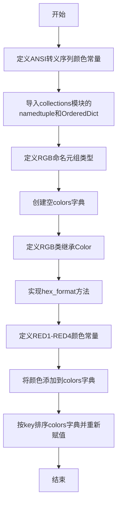
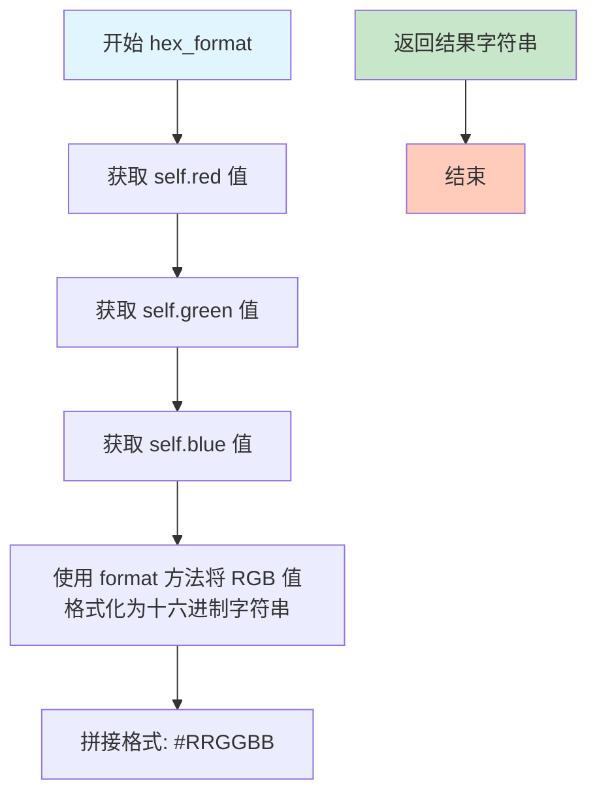

# `KubiScan\misc\colours.py` 详细设计文档

一个颜色工具模块，提供终端ANSI转义序列常量用于彩色输出，以及RGB颜色命名元组定义和有序颜色字典，支持将RGB颜色转换为十六进制格式

## 整体流程



## 类结构

```
模块级
├── 全局常量 (ANSI转义序列)
│   ├── RED
│   ├── LIGHTRED
│   ├── YELLOW
│   ├── LIGHTYELLOW
│   └── WHITE
├── RGB类 (继承自namedtuple)
│   └── hex_format() 方法
└── 全局变量
    └── colors 字典 (OrderedDict)
```

## 全局变量及字段


### `RED`
    
ANSI转义序列，用于在终端中显示红色前景色

类型：`str`
    


### `LIGHTRED`
    
ANSI转义序列，用于在终端中显示亮红色前景色

类型：`str`
    


### `YELLOW`
    
ANSI转义序列，用于在终端中显示黄色前景色

类型：`str`
    


### `LIGHTYELLOW`
    
ANSI转义序列，用于在终端中显示亮黄色前景色

类型：`str`
    


### `WHITE`
    
ANSI转义序列，用于在终端中显示白色背景（实际为白色背景）

类型：`str`
    


### `colors`
    
存储颜色名称到RGB颜色对象的映射，按名称字母顺序排序

类型：`OrderedDict`
    


### `RED1`
    
纯红色，RGB值为(255, 0, 0)

类型：`RGB`
    


### `RED2`
    
深红色，RGB值为(238, 0, 0)

类型：`RGB`
    


### `RED3`
    
中红色，RGB值为(205, 0, 0)

类型：`RGB`
    


### `RED4`
    
暗红色，RGB值为(139, 0, 0)

类型：`RGB`
    


### `RGB.red`
    
RGB颜色中的红色通道值，范围0-255

类型：`int`
    


### `RGB.green`
    
RGB颜色中的绿色通道值，范围0-255

类型：`int`
    


### `RGB.blue`
    
RGB颜色中的蓝色通道值，范围0-255

类型：`int`
    
    

## 全局函数及方法


### `RGB.hex_format()`

将 RGB 颜色实例转换为十六进制格式字符串（例如 "#FF0000"），便于在 Web 开发或图形界面中作为颜色值使用。

参数：

- `self`：`RGB`，调用该方法的 RGB 颜色实例本身，包含 red、green、blue 三个属性

返回值：`str`，返回以 "#" 开头，后跟两位十六进制红、绿、蓝值的颜色字符串（如 "#FF0000" 表示红色）

#### 流程图



#### 带注释源码

```python
class RGB(Color):
    def hex_format(self):
        '''
        将 RGB 颜色转换为十六进制格式字符串
        
        Returns:
            str: 形如 "#FF0000" 的十六进制颜色字符串
        '''
        # 使用 format 方法将红、绿、蓝三个分量转换为两位大写十六进制数
        # {:02X} 表示至少两位，不足前面补0，使用大写字母表示十六进制字母
        return '#{:02X}{:02X}{:02X}'.format(self.red, self.green, self.blue)
```

## 关键组件


### 核心功能概述

该代码模块提供了终端彩色输出的ANSI转义序列常量定义，以及基于RGB模型的颜色常量管理功能，支持在终端中输出带有前景色和背景色的彩色文本。

### 文件运行流程

1. **定义ANSI转义序列常量**：在文件开头定义终端彩色输出所需的转义序列常量（RED、LIGHTRED、YELLOW、LIGHTYELLOW、WHITE）
2. **导入数据结构**：从collections模块导入namedtuple和OrderedDict
3. **定义RGB类**：创建继承自namedtuple的RGB颜色类，实现十六进制格式转换方法
4. **实例化颜色常量**：创建四个红色调的颜色常量（RED1-RED4）
5. **构建颜色字典**：将颜色常量添加到字典并按键排序

### 类详细信息

#### RGB 类

- **继承自**：namedtuple('RGB', 'red, green, blue')
- **类方法**：
  - **hex_format**
    - **参数**：无
    - **返回值类型**：str
    - **返回值描述**：返回十六进制颜色格式字符串，格式为"#RRGGBB"
    - **mermaid流程图**：
    ```mermaid
    flowchart TD
    A[开始] --> B[获取self.red]
    B --> C[获取self.green]
    C --> D[获取self.blue]
    D --> E[格式化为#RRGGBB]
    E --> F[返回字符串]
    ```
    - **源码**：
    ```python
    def hex_format(self):
        '''Returns color in hex format'''
        return '#{:02X}{:02X}{:02X}'.format(self.red, self.green, self.blue)
    ```

### 全局变量

| 名称 | 类型 | 描述 |
|------|------|------|
| RED | str | 前景红色（31）的ANSI转义序列 |
| LIGHTRED | str | 前景亮红色（91）的ANSI转义序列 |
| YELLOW | str | 前景黄色（33）的ANSI转义序列 |
| LIGHTYELLOW | str | 前景亮黄色（93）的ANSI转义序列 |
| WHITE | str | 白色背景（47）的ANSI转义序列 |
| colors | dict/OrderedDict | 存储预定义颜色常量的有序字典 |

### 全局常量

| 名称 | 类型 | 描述 |
|------|------|------|
| RED1 | RGB | 红色调常量，RGB(255, 0, 0) |
| RED2 | RGB | 红色调常量，RGB(238, 0, 0) |
| RED3 | RGB | 红色调常量，RGB(205, 0, 0) |
| RED4 | RGB | 红色调常量，RGB(139, 0, 0) |

### 关键组件信息

#### 组件1：ANSI转义序列系统

提供终端彩色文本输出能力，支持多种颜色和样式组合

#### 组件2：RGB颜色类

基于namedtuple的不可变颜色对象，支持十六进制格式转换

#### 组件3：colors有序字典

存储和管理预定义颜色集合，支持按键自动排序

### 潜在技术债务与优化空间

1. **颜色种类有限**：目前仅定义了红色系列，建议扩展其他颜色如green、blue等
2. **缺少背景色支持**：仅WHITE定义了背景色常量，其他颜色只有前景色
3. **重复代码**：RED1-RED4的定义可使用循环或列表推导式简化
4. **文档注释不完整**：colors字典和RGB类的使用示例缺失
5. **类型注解缺失**：建议添加Python类型提示以提高代码可维护性

### 其他项目

#### 设计目标与约束

- 目标：提供轻量级的终端彩色输出和颜色管理解决方案
- 约束：不依赖外部模块（colorama为可选），使用Python标准库

#### 错误处理与异常设计

- RGB类继承自namedtuple，字段类型和值域未做校验
- hex_format方法假设red、green、blue为0-255范围内的整数

#### 数据流与状态机

- 数据流程：颜色常量定义 → 添加至字典 → 排序 → 外部查询使用
- 状态机不适用：本模块为静态数据结构定义

#### 外部依赖与接口契约

- 依赖：Python标准库collections（namedtuple、OrderedDict）
- 接口：colors字典的键值访问接口


## 问题及建议


### 已知问题

- **变量遮蔽（Shadowing）**：第30行定义 `colors = {}`，第38行又重新赋值为 `colors = OrderedDict(...)`，导致原始字典对象被覆盖，虽然功能正常但容易造成混淆和潜在的bug
- **颜色定义不完整**：代码注释和文档提到支持多种颜色，但实际上只定义了红色系列（red1-red4），其他颜色（green、blue等）缺失，与文档描述不符
- **重复的颜色概念**：ANSI转义序列（RED、LIGHTRED等）和RGB颜色类（RED1、RED2等）两套系统独立存在，缺乏统一的颜色管理接口或转换机制
- **命名不一致**：ANSI常量使用全大写（RED），而字典键使用小写加数字（'red1'），这种不一致会增加维护成本
- **未使用的模块导入**：注释中提到可以使用colorama模块但未实现，表明可能有彩色输出的需求但当前实现不完整
- **缺少模块文档**：整个Python文件没有模块级的docstring来说明该模块的用途和使用方式

### 优化建议

- 将 `colors` 变量改为明确区分初始字典和排序后的OrderedDict，例如使用 `colors_dict` 和 `colors` 两个变量
- 扩展颜色字典以包含完整的颜色系列（至少覆盖主要颜色），或明确限制模块为"仅红色系"并更新文档
- 考虑创建一个统一的颜色管理系统，桥接ANSI转义序列和RGB颜色，支持相互转换
- 统一命名规范，要么全部使用全大写常量，要么全部使用描述性键名
- 如果需要跨平台彩色输出，考虑实现或集成colorama模块，并在代码中说明依赖
- 为模块添加docstring，说明模块用途、颜色系统和主要入口点

## 其它


### 设计目标与约束

本模块旨在提供RGB颜色值的标准化定义和终端ANSI彩色输出支持，遵循以下约束：1）仅依赖Python标准库（collections模块），不引入外部依赖；2）颜色值使用0-255范围的整数表示RGB三原色；3）ANSI转义序列仅支持基础的前景色和背景色设置，不支持256色或RGB真彩色；4）colors字典按键名升序排列以保证一致性。

### 错误处理与异常设计

当前模块设计较为简单，未涉及复杂的错误处理场景。若需要扩展，可考虑：1）RGB值的有效性校验（确保red、green、blue在0-255范围内）；2）colors字典键名冲突检测；3）hex_format方法的异常捕获（防止格式化失败）。模块本身不会抛出自定义异常。

### 数据流与状态机

本模块为静态数据定义模块，无运行时状态机逻辑。数据流如下：1）RGB namedtuple定义颜色数据结构；2）预定义RED1-RED4四个红色调常量；3）colors字典收集并排序所有颜色常量；4）外部模块通过导入colors字典或RGB类使用颜色定义。

### 外部依赖与接口契约

本模块仅依赖Python标准库collections模块，具体依赖：1）namedtuple用于创建RGB不可变数据结构；2）OrderedDict用于维护colors字典的插入顺序。接口契约：1）RGB类提供hex_format()方法返回十六进制颜色字符串；2）colors字典提供颜色名称到RGB对象的映射；3）ANSI转义序列常量可直接用于终端输出。

### 扩展性分析

模块具备良好的扩展性，可通过以下方式扩展：1）添加更多颜色常量（GREEN、BLUE等）到colors字典；2）扩展RGB类方法（如获取互补色、计算颜色距离等）；3）支持从十六进制字符串创建RGB对象；4）添加颜色名称大小写不敏感查询功能。

### 使用示例与调用约定

外部模块使用本模块的典型方式：1）from colors import RGB, colors导入颜色类和字典；2）直接使用ANSI常量：print(f"{RED}错误信息{WHITE}")；3）使用RGB对象：colors['red1'].hex_format()返回'#FF0000'；4）遍历颜色：for name, rgb in colors.items()。

### 版本与变更记录

当前版本为1.0.0，初始版本包含：1）ANSI转义序列常量定义；2）RGB namedtuple类及hex_format方法；3）四种红色调的定义与colors字典构建。建议后续添加：变更日志记录、颜色常量完整集合、颜色转换工具方法。


    