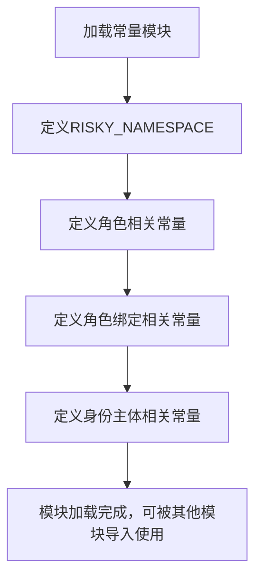

# `KubiScan\misc\constants.py` 详细设计文档

该代码文件定义了Kubernetes RBAC（基于角色的访问控制）相关的常量，包括危险命名空间标识、角色类型、角色绑定类型以及用户、组和服务账户的类型定义，用于在Kubernetes权限管理和安全审计场景中统一使用这些常量值。

## 整体流程



## 类结构

```
无类层次结构（纯常量定义模块）
```

## 全局变量及字段


### `RISKY_NAMESPACE`
    
用于标识危险或高风险命名空间的常量值

类型：`string`
    


### `ROLE_KIND`
    
Kubernetes RBAC 中 Role 资源类型的名称

类型：`string`
    


### `CLUSTER_ROLE_KIND`
    
Kubernetes RBAC 中 ClusterRole 资源类型的名称

类型：`string`
    


### `ROLE_BINDING_KIND`
    
Kubernetes RBAC 中 RoleBinding 资源类型的名称

类型：`string`
    


### `CLUSTER_ROLE_BINDING_KIND`
    
Kubernetes RBAC 中 ClusterRoleBinding 资源类型的名称

类型：`string`
    


### `USER_KIND`
    
Kubernetes RBAC 中 User（用户）身份类型的名称

类型：`string`
    


### `GROUP_KIND`
    
Kubernetes RBAC 中 Group（用户组）身份类型的名称

类型：`string`
    


### `SERVICEACCOUNT_KIND`
    
Kubernetes RBAC 中 ServiceAccount（服务账号）身份类型的名称

类型：`string`
    


    

## 全局函数及方法


## 关键组件


### RISKY_NAMESPACE

危险命名空间标识符，用于标记需要特殊权限控制的Kubernetes命名空间。

### ROLE_KIND

Kubernetes Role资源类型标识，表示在特定命名空间内定义的权限角色。

### CLUSTER_ROLE_KIND

Kubernetes ClusterRole资源类型标识，表示集群级别的权限角色，可跨命名空间使用。

### ROLE_BINDING_KIND

Kubernetes RoleBinding资源类型标识，用于将角色绑定到用户、组或服务账户。

### CLUSTER_ROLE_BINDING_KIND

Kubernetes ClusterRoleBinding资源类型标识，用于将集群角色绑定到集群范围内的主体。

### USER_KIND

Kubernetes User用户资源类型标识，代表需要进行身份验证的终端用户实体。

### GROUP_KIND

Kubernetes Group组资源类型标识，代表一组用户的集合，用于批量授权。

### SERVICEACCOUNT_KIND

Kubernetes ServiceAccount服务账户资源类型标识，用于Pod或进程的程序化身份认证。


## 问题及建议


### 已知问题

-   **硬编码字符串缺乏类型安全**：所有常量均为字符串类型，无法在编译期进行类型检查，容易出现拼写错误且难以发现
-   **缺乏枚举或强类型定义**：未使用枚举类或强类型结构，导致使用时无自动补全和编译期校验
-   **缺少文档注释**：常量定义无任何注释说明其用途和使用场景
-   **命名空间隔离不足**：仅定义了一个硬编码的 `RISKY_NAMESPACE`，缺乏灵活性，无法适配多环境（如 dev/staging/prod）
-   **常量组织结构松散**：所有常量平铺在全局作用域，缺乏分类和命名空间组织
-   **缺失关联常量**：RBAC 相关常量不完整，缺少 `Kind` 之外的 `ApiVersion`、`verbs` 等常用常量
-   **无验证机制**：常量值没有对应的验证函数，无法确保传入的 kind 是合法值

### 优化建议

-   **引入枚举或数据类**：使用 Python 的 `Enum` 类或 `dataclass` 定义种类常量，提升类型安全性和可读性
-   **增加文档字符串**：为每个常量或常量类添加 docstring，说明其含义和适用场景
-   **设计配置化方案**：将 namespace 等环境相关常量提取到配置文件或环境变量，支持多环境切换
-   **分类组织常量**：按功能将常量分组（如 Role 相关、Binding 相关、Subject 相关），使用类或模块封装
-   **补充完整常量集合**：根据业务需求补充 `APIVERSION`、`VERBS`、`RESOURCES` 等相关常量
-   **实现常量验证函数**：提供 `is_valid_kind()`、`is_namespaced_kind()` 等验证函数，确保使用时的合法性


## 其它


### 一段话描述

该代码模块定义了Kubernetes RBAC（基于角色的访问控制）系统中各类资源类型的常量标识符，涵盖命名空间级别和集群级别的角色、角色绑定以及身份实体（用户、组、服务账户）的类型定义，用于在Kubernetes权限管理场景中作为Kind字段的标准字符串值。

### 文件的整体运行流程

该代码文件为纯静态常量定义模块，不涉及运行时流程执行。其主要使用场景包括：
1. 导入模块以获取常量值
2. 在Kubernetes资源对象创建时引用这些常量作为kind字段
3. 在权限检查逻辑中作为资源类型比对的枚举值
4. 在CRD（自定义资源定义）开发中作为标准化常量引用

### 全局变量详细信息

| 名称 | 类型 | 描述 |
|------|------|------|
| RISKY_NAMESPACE | str | 表示存在安全风险的命名空间标识符，用于权限过滤和审计场景 |
| ROLE_KIND | str | 标准Role资源的类型标识，用于命名空间级别的权限定义 |
| CLUSTER_ROLE_KIND | str | 标准ClusterRole资源的类型标识，用于集群级别的权限定义 |
| ROLE_BINDING_KIND | str | 标准RoleBinding资源的类型标识，用于命名空间级别的角色绑定 |
| CLUSTER_ROLE_BINDING_KIND | str | 标准ClusterRoleBinding资源的类型标识，用于集群级别的角色绑定 |
| USER_KIND | str | User身份实体的类型标识，代表Kubernetes集群中的用户主体 |
| GROUP_KIND | str | Group身份实体的类型标识，代表Kubernetes集群中的用户组主体 |
| SERVICEACCOUNT_KIND | str | ServiceAccount身份实体的类型标识，代表Kubernetes中的服务账户主体 |

### 关键组件信息

| 名称 | 一句话描述 |
|------|------|
| RBAC常量模块 | Kubernetes RBAC系统资源类型标识符的集中定义模块 |

### 潜在的技术债务或优化空间

1. **缺少类型注解和文档字符串**：建议为每个常量添加docstring说明其用途和适用场景，增强代码可维护性
2. **无输入验证机制**：建议添加RISKY_NAMESPACE的格式验证逻辑，确保符合Kubernetes命名规范
3. **常量分组不清晰**：建议使用Enum类或dataclass进行分组，提供更结构化的常量管理方式
4. **国际化支持缺失**：若需支持多语言环境，建议引入i18n机制
5. **版本兼容性考量**：需确保常量与目标Kubernetes版本的API资源类型保持一致

### 设计目标与约束

- **设计目标**：提供Kubernetes RBAC资源类型的标准化字符串常量，避免硬编码，提升代码可读性和可维护性
- **设计约束**：遵循Kubernetes API规范，常量值必须与官方Resource Kind定义完全一致
- **适用范围**：仅作为静态常量定义模块，不包含业务逻辑，适用于Kubernetes权限管理、审计、自动化脚本等场景

### 错误处理与异常设计

- 该代码模块为纯常量定义，不涉及运行时错误处理
- 建议使用方在引用常量时进行空值检查，防止NoneType引用错误
- 若后续扩展为动态获取常量，建议添加配置加载失败的异常捕获机制

### 数据流与状态机

- 本模块为无状态模块，不涉及数据流和状态机设计
- 常量作为只读配置数据被其他模块引用

### 外部依赖与接口契约

- **外部依赖**：无外部依赖，仅使用Python内置类型
- **接口契约**：提供模块级常量导出，其他模块通过`import`语句引用常量值
- **兼容性要求**：需与Kubernetes v1.20+版本的API资源类型保持兼容

### 使用示例

```python
# 正确使用方式
from kubernetes_rbac_constants import (
    ROLE_KIND,
    CLUSTER_ROLE_KIND,
    USER_KIND,
    SERVICEACCOUNT_KIND
)

# 在创建K8s资源时使用
role_manifest = {
    "kind": ROLE_KIND,
    "metadata": {"namespace": "default"}
}
```


    