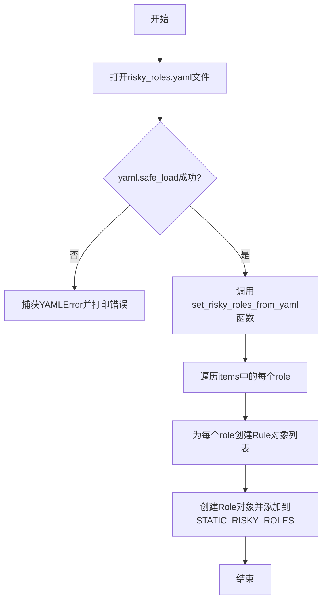
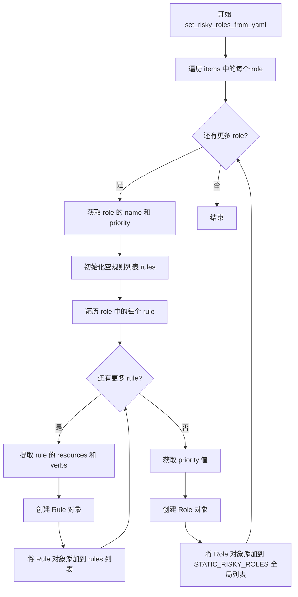

# `KubiScan\static_risky_roles.py` 详细设计文档

该代码从YAML配置文件加载风险角色（risky roles）信息，解析其中的角色和规则，并将其存储在全局列表STATIC_RISKY_ROLES中，供后续权限风险评估使用。

## 整体流程



## 类结构

```
Role (外部类，来自engine.role)
Rule (外部类，来自engine.rule)
```

## 全局变量及字段


### `STATIC_RISKY_ROLES`
    
全局列表，用于存储从YAML配置加载的风险角色对象

类型：`list[Role]`
    


### `Role.name`
    
角色的名称，用于标识角色

类型：`str`
    


### `Role.priority`
    
角色的优先级，用于决定角色的重要性等级

类型：`int`
    


### `Role.rules`
    
角色关联的规则列表，定义了角色的权限规则集合

类型：`list[Rule]`
    


### `Role.namespace`
    
角色所属的命名空间，用于隔离和分组管理

类型：`str`
    


### `Rule.resources`
    
规则适用的资源列表，定义规则作用的资源范围

类型：`list[str]`
    


### `Rule.verbs`
    
规则允许的操作列表，定义可对资源执行的动作

类型：`list[str]`
    
    

## 全局函数及方法


### `set_risky_roles_from_yaml`

该函数接收从 YAML 文件解析的角色数据列表，遍历每个角色及其规则，创建相应的 Role 和 Rule 对象，并将这些角色添加到全局静态列表 `STATIC_RISKY_ROLES` 中，以初始化系统的高风险角色配置。

参数：

- `items`：`list`，从 YAML 文件加载的角色数据列表，每个元素包含 `metadata` 和 `rules` 字段

返回值：`None`，该函数无返回值，仅修改全局变量 `STATIC_RISKY_ROLES`

#### 流程图



#### 带注释源码

```python
def set_risky_roles_from_yaml(items):
    """
    从 YAML 解析的角色数据中设置高风险角色
    
    参数:
        items: 从 risky_roles.yaml 加载的角色列表，每个元素包含 metadata 和 rules
    """
    # 遍历 YAML 中的每个角色定义
    for role in items:
        # 初始化当前角色的规则列表
        rules = []
        
        # 遍历当前角色下的所有规则定义
        for rule in role['rules']:
            # 从规则字典中提取 resources 和 verbs，创建 Rule 对象
            rule_obj = Rule(resources=rule['resources'], verbs=rule['verbs'])
            # 将创建好的规则对象添加到规则列表中
            rules.append(rule_obj)

            # 创建 Role 对象，传入角色名称、优先级、规则列表和命名空间
            # 使用 get_priority_by_name 将优先级名称转换为优先级值
            STATIC_RISKY_ROLES.append(Role(role['metadata']['name'],
                                           get_priority_by_name(role['metadata']['priority']),
                                           rules,
                                           namespace=RISKY_NAMESPACE)
                                      )
```

## 关键组件


### STATIC_RISKY_ROLES

全局变量，用于存储从YAML配置文件加载的风险角色列表，供系统进行权限检查和安全评估使用。

### set_risky_roles_from_yaml 函数

负责解析YAML配置中的角色项，将每个角色的规则转换为Rule对象，并创建对应的Role对象，最终添加到全局风险角色列表中。

### YAML配置文件加载模块

使用PyYAML库加载risky_roles.yaml文件，并进行安全的反序列化操作，同时包含异常处理机制。

### Role 与 Rule 对象创建逻辑

根据YAML中定义的元数据（名称、优先级）和规则（资源、动词）信息，实例化Role和Rule对象，用于表示风险角色的结构化数据。


## 问题及建议


### 已知问题

-   **全局可变状态**：STATIC_RISKY_ROLES 是全局列表，在模块导入时直接执行修改操作，违反最佳实践且难以测试
-   **缺少错误处理**：yaml 文件不存在或读取失败时仅捕获 YAMLError，其他异常（如 FileNotFoundError）会导致程序崩溃
-   **硬编码路径和命名空间**：risky_roles.yaml 路径和 RISKY_NAMESPACE 常量直接耦合在代码中，降低可配置性
-   **使用 print 而非日志**：调试信息使用 print 无法控制日志级别和输出目标
-   **函数无返回值**：set_risky_roles_from_yaml 仅修改全局状态，无返回值，调用方无法判断执行结果
-   **路径拼接方式**：使用字符串 + 拼接路径，应使用 os.path.join 提高可移植性
-   **缺少类型注解**：函数参数和返回值均无类型提示，降低代码可读性和 IDE 支持
-   **无入口保护**：模块级别代码在 import 时立即执行，缺乏 if __name__ == "__main__" 保护
-   **规则对象重复创建**：在循环中每次创建 Rule 后立即 append 到 STATIC_RISKY_ROLES，逻辑位置不当

### 优化建议

-   将全局变量封装为配置类或使用单例模式管理
-   添加完整的异常捕获链，包括 FileNotFoundError、PermissionError 等
-   将路径和命名空间参数化或从配置文件读取
-   使用 logging 模块替代 print
-   函数应返回创建的 Role 列表或抛出自定义异常
-   统一使用 os.path.join 拼接路径
-   为所有函数添加类型注解 (typing)
-   添加模块入口保护，确保代码仅在直接执行时运行
-   将 STATIC_RISKY_ROLES.append 移至内层循环之外，减少重复操作

## 其它


### 设计目标与约束

本模块的核心目标是从YAML配置文件加载风险角色定义，并将其转换为内存中的Role对象集合，供后续权限检查使用。设计约束包括：1) 配置文件路径硬编码为当前模块目录下的risky_roles.yaml；2) 使用yaml.safe_load防止代码执行漏洞；3) 全局变量STATIC_RISKY_ROLES在模块加载时即完成初始化。

### 错误处理与异常设计

代码中包含两处错误处理：1) yaml.YAMLError捕获YAML解析错误并打印异常信息；2) 文件打开失败时Python内置的FileNotFoundError会被抛出但未捕获。建议增加：a) 对文件不存在情况的处理；b) 对YAML结构不符合预期格式的校验；c) 考虑将错误向上传递而非仅打印。

### 外部依赖与接口契约

本模块依赖以下外部组件：1) engine.role.Role类 - 角色对象构造；2) engine.rule.Rule类 - 规则对象构造；3) engine.priority.get_priority_by_name函数 - 根据优先级名称获取优先级值；4) misc.constants模块的RISKY_NAMESPACE常量；5) PyYAML库用于YAML解析；6) os模块用于路径操作。调用方可通过导入STATIC_RISKY_ROLES全局变量获取风险角色列表。

### 数据流与状态机

数据流如下：1) 读取risky_roles.yaml文件内容；2) 使用yaml.safe_load解析为Python字典；3) 遍历items数组，对每个role条目提取metadata和rules；4) 对每个rule创建Rule对象；5) 使用metadata信息创建Role对象并附加规则列表；6) 将Role对象追加到STATIC_RISKY_ROLES全局列表。状态机为简单的线性流程：加载→解析→转换→存储，无分支状态。

### 性能考虑

当前实现存在性能优化空间：1) 模块导入时同步加载配置文件，对于大型配置文件会导致启动延迟，建议改为懒加载或后台线程加载；2) STATIC_RISKY_ROLES为全局列表，随着角色数量增长，查找效率为O(n)，建议改用字典或集合以提升查找性能。

### 安全考虑

1) 使用yaml.safe_load而非yaml.load防止反序列化漏洞；2) 文件路径来自__file__相对路径，相对安全但仍建议增加路径验证；3) 全局可变状态STATIC_RISKY_ROLES可能导致测试困难和多线程竞争条件，建议封装为单例模式或依赖注入。

### 配置文件格式说明

期望的risky_roles.yaml格式如下：items为角色列表，每个角色包含metadata（name, priority字段）和rules（resources, verbs数组）数组。示例结构：{"items": [{"metadata": {"name": "admin", "priority": "high"}, "rules": [{"resources": ["*"], "verbs": ["*"]}]}]}。当前代码未对配置格式进行校验，若格式不符会导致KeyError。

### 初始化流程

模块级别的代码在import时执行，初始化流程为：1) 定义空列表STATIC_RISKY_ROLES；2) 定义函数set_risky_roles_from_yaml；3) 打开并读取risky_roles.yaml；4) 解析YAML并调用set_risky_roles_from_yaml；5) 填充STATIC_RISKY_ROLES。此初始化为同步阻塞操作。

### 模块职责边界

本模块（engine/role_loader.py）职责边界：1) 负责YAML配置加载和解析；2) 负责Role/Rule对象构造；3) 负责全局状态管理。不应包含：1) 权限检查逻辑（应由调用方负责）；2) 业务规则定义（应由配置文件定义）；3) 日志记录（当前仅print输出，建议引入日志框架）。

### 潜在扩展点

1) 支持动态重载配置文件功能；2) 支持多配置文件合并；3) 支持角色继承或组合；4) 支持基于环境变量的配置文件路径配置；5) 增加配置版本控制和格式校验。


    