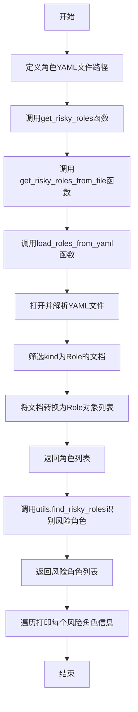
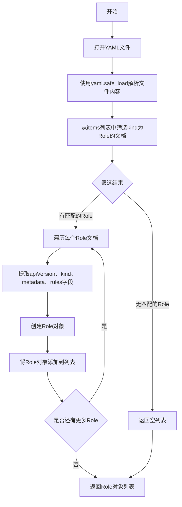
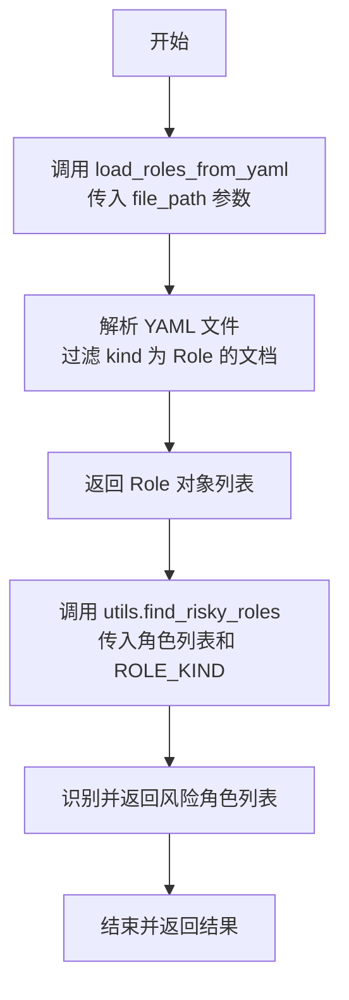
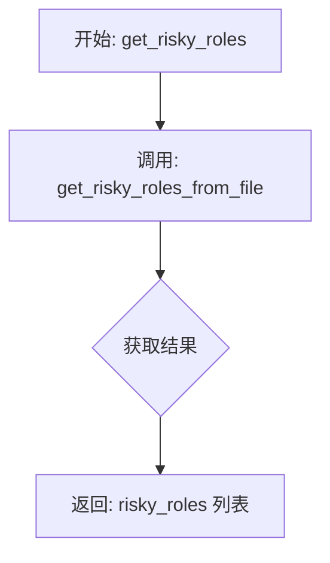

# `KubiScan\static_scan.py` 详细设计文档

该代码是一个Kubernetes角色安全扫描工具，用于从YAML配置文件中加载Role资源，并调用引擎工具识别具有风险权限的角色，最终输出所有风险角色的名称和命名空间信息。

## 整体流程



## 类结构

```
Role (数据模型类)
└── 属性: apiVersion, kind, metadata, rules

engine.utils (工具模块)
└── find_risky_roles(角色识别函数)
```

## 全局变量及字段


### `ROLE_KIND`
    
用于过滤的Role类型标识常量，值为'Role'

类型：`str`
    


### `file_path`
    
roles.yaml文件的绝对路径

类型：`str`
    


### `all_risky_roles`
    
存储所有识别出的风险角色对象列表

类型：`list`
    


### `Role.apiVersion`
    
角色的API版本

类型：`str`
    


### `Role.kind`
    
资源类型标识

类型：`str`
    


### `Role.metadata`
    
元数据包含name和namespace

类型：`dict`
    


### `Role.rules`
    
角色权限规则列表

类型：`list`
    
    

## 全局函数及方法


### `load_roles_from_yaml`

该函数从指定的YAML文件中加载所有Role类型的资源，并将其转换为Role对象列表返回。

参数：

- `file_path`：`str`，YAML文件的路径，用于读取角色配置数据

返回值：`list[Role]`，返回从YAML文件中解析出的所有Role对象列表，每个对象包含apiVersion、kind、metadata和rules属性

#### 流程图



#### 带注释源码

```python
# 导入PyYAML库用于解析YAML文件
import yaml
# 导入引擎工具模块，包含find_risky_roles等函数
from engine import utils

# 定义角色类型常量，用于过滤YAML中的Role资源
ROLE_KIND = "Role"

def load_roles_from_yaml(file_path):
    """
    从YAML文件加载并返回Role对象列表
    
    参数:
        file_path: str - YAML文件的路径
        
    返回:
        list: Role对象列表
    """
    # 使用上下文管理器打开文件，确保文件正确关闭
    with open(file_path, 'r') as file:
        # 使用yaml.safe_load安全地解析YAML文件内容
        documents = yaml.safe_load(file)
        
        # 列表推导式：从items中筛选kind等于ROLE_KIND的文档
        # documents.get('items', []) 处理items不存在的情况
        roles_dict = [doc for doc in documents.get('items', []) if doc.get('kind') == ROLE_KIND]
        
        # 遍历筛选出的角色字典列表，为每个角色创建Role对象
        # Role类的构造函数接受apiVersion、kind、metadata、rules四个参数
        roles = [Role(
            apiVersion=role.get('apiVersion'),    # 获取apiVersion字段
            kind=role.get('kind'),                # 获取kind字段
            metadata=role.get('metadata'),        # 获取metadata字段（包含name、namespace等）
            rules=role.get('rules')               # 获取rules权限规则字段
        ) for role in roles_dict]
    
    # 返回构建完成的Role对象列表
    return roles
```


### `get_risky_roles_from_file`

该函数是风险角色扫描模块的核心入口，负责从指定的 YAML 文件中加载角色定义，并调用工具函数识别存在安全风险的角色。它封装了加载和风险检测的逻辑，为上层调用提供简洁的接口。

参数：

- `file_path`：`str`，YAML 格式的角色定义文件路径

返回值：`list`，返回包含风险角色的列表，每个元素为 Role 对象

#### 流程图



#### 带注释源码

```python
def get_risky_roles_from_file(file_path):
    """
    从 YAML 文件加载角色并识别风险角色
    
    参数:
        file_path: str - 角色定义文件的路径
    
    返回:
        list: 包含所有被识别为风险角色的 Role 对象列表
    """
    # 步骤1: 调用 load_roles_from_yaml 函数从文件中加载角色
    # 该函数会解析 YAML 文档，筛选出 kind 为 "Role" 的资源
    roles = load_roles_from_yaml(file_path)
    
    # 步骤2: 使用工具函数 find_risky_roles 对角色进行风险评估
    # ROLE_KIND 为全局常量 "Role"，用于标识角色类型
    # 该函数内部会分析角色的 rules 属性，判断是否存在过度权限
    risky_roles = utils.find_risky_roles(roles, ROLE_KIND)
    
    # 步骤3: 返回识别出的风险角色列表
    return risky_roles
```


### `get_risky_roles`

这是整个模块的入口函数之一，负责接收 YAML 文件路径，并返回其中定义的所有被视为有风险的 Kubernetes Role 对象。它内部封装了对文件读取和风险计算逻辑的调用，提供了一个简洁的接口给外部使用。

参数：

-  `file_path`：`str`，字符串类型，指定 Kubernetes Roles 配置文件（roles.yaml）的绝对路径。

返回值：`list`，返回 Role 对象列表。这些对象包含了角色的元数据（名称、命名空间）以及规则信息，且被识别为存在安全风险的角色。

#### 流程图



#### 带注释源码

```python
def get_risky_roles(file_path):
    """
    入口函数：获取风险角色列表。
    该函数作为一个简单的包装器（Wrapper），将请求转发给内部函数 get_risky_roles_from_file
    以执行具体的业务逻辑（加载 YAML 和计算风险）。

    参数:
        file_path (str): 包含 Kubernetes Role 定义的 YAML 文件路径。

    返回:
        list: 返回由 utils.find_risky_roles 识别出的风险 Role 对象列表。
    """
    # 调用内部函数获取风险角色
    # 这样做的好处是将文件 I/O 和数据处理逻辑与入口函数解耦
    risky_roles = get_risky_roles_from_file(file_path)
    
    # 将结果直接返回给调用者
    return risky_roles
```


## 关键组件


### YAML 文档解析组件

负责从 YAML 文件中加载并解析 Kubernetes Role 资源。使用 yaml.safe_load 读取文件内容，支持多文档格式，通过 items 字段获取资源列表。

### Role 资源过滤组件

根据 kind 字段过滤出类型为 "Role" 的资源。使用列表推导式高效筛选，支持 API 版本、元数据和规则字段的提取。

### Role 对象创建组件

将字典格式的 Role 资源转换为 Role 对象实例。封装了 apiVersion、kind、metadata 和 rules 等属性，提供统一的对象接口。

### 风险角色检测组件

调用 engine.utils 模块中的 find_risky_roles 函数，识别具有潜在安全风险的 Role 资源。支持传入角色列表和角色类型进行风险评估。

### 角色结果显示组件

遍历风险角色列表并格式化输出。显示角色的 kind、name 和 namespace 属性，提供清晰的可读性。


## 问题及建议


### 已知问题

-   **硬编码文件路径**：文件路径 `/home/noamr/Documents/KubiScan/roles.yaml` 被硬编码在全局，降低了代码的可移植性和可配置性
-   **冗余函数**：函数 `get_risky_roles` 直接调用 `get_risky_roles_from_file`，未增加任何额外逻辑，造成不必要的函数包装
-   **缺乏错误处理**：文件读取、YAML 解析等操作均未进行异常捕获，可能导致程序直接崩溃
-   **缺少类型注解**：所有函数均缺少参数和返回值的类型提示，降低了代码的可读性和可维护性
-   **模块级代码执行**：最后的角色获取和打印代码在模块导入时立即执行，违反了 "import-time should not execute" 的最佳实践
-   **YAML 解析结果未做空值处理**：`yaml.safe_load(file)` 可能返回 `None`，但代码直接调用 `.get('items', [])` 假设其返回字典
-   **变量名遮蔽**：函数参数 `file_path` 与全局变量 `file_path` 同名，导致全局变量被遮蔽

### 优化建议

-   将硬编码的文件路径改为通过参数传入或环境变量/配置文件获取
-   移除冗余的 `get_risky_roles` 函数，直接使用 `get_risky_roles_from_file`
-   添加 `try-except` 块处理文件不存在、YAML 解析错误等异常情况
-   为函数添加类型注解（如 `def load_roles_from_yaml(file_path: str) -> List[Role]:`）
-   将模块级执行的代码移至 `if __name__ == "__main__":` 块中
-   对 YAML 解析结果进行空值检查：`if documents is None: documents = {}`
-   使用更语义化的变量名避免与全局变量冲突（如将参数改为 `path` 或 `yaml_file_path`）
-   考虑添加日志记录功能以便调试和监控
-   考虑使用数据类（dataclass）或 Pydantic 替代简单的 Role 对象以增加验证

## 其它


### 设计目标与约束

本代码的核心设计目标是从 Kubernetes 的 roles.yaml 文件中加载 Role 资源，并识别其中存在安全风险的 Roles。主要约束包括：1）仅处理 kind 为 "Role" 的资源；2）依赖外部 engine.utils 模块的 find_risky_roles 函数进行风险评估；3）假设输入的 YAML 文件格式遵循 Kubernetes MultiDocument 格式；4）文件路径以硬编码方式提供，不支持动态配置。

### 错误处理与异常设计

代码采用了基础的文件读取和 YAML 解析错误处理。使用 with open 语句确保文件正确关闭，yaml.safe_load 安全地解析 YAML 内容。潜在异常包括：FileNotFoundError（文件不存在）、yaml.YAMLError（YAML 格式错误）、KeyError（缺少必需的键如 kind、apiVersion 等）、以及 utils.find_risky_roles 可能抛出的异常。当前实现未对这些异常进行显式捕获和处理，建议增加 try-except 块进行统一异常管理。

### 外部依赖与接口契约

主要外部依赖包括：1）PyYAML 库（yaml 模块），用于解析 YAML 格式的 Kubernetes 资源定义文件；2）engine.utils 模块，提供 find_risky_roles 函数用于识别风险 Roles。接口契约方面：load_roles_from_yaml 接收 file_path（字符串）参数，返回 Role 对象列表；get_risky_roles_from_file 接收 file_path 参数，调用 load_roles_from_yaml 和 utils.find_risky_roles，返回风险 Roles 列表；get_risky_roles 作为简单包装函数，传递 file_path 参数并返回结果。

### 性能考虑与优化空间

当前实现的主要性能考量：1）YAML 文件一次性加载到内存，对于大型文件可能存在内存压力；2）列表推导式创建 Roles 对象，存在一定的内存开销；3）每次调用都会重新读取和解析 YAML 文件，无缓存机制。优化建议：引入缓存机制避免重复解析，考虑使用流式处理大型 YAML 文件，优化 Role 对象创建过程减少不必要的属性复制。

### 安全性考虑

代码涉及从文件系统读取配置文件，存在路径遍历攻击风险（虽然当前路径硬编码）。YAML 解析使用 safe_load 可防止恶意 YAML _payload 执行。敏感信息处理方面，当前实现未对 Role 的 metadata 或 rules 中的敏感数据进行脱敏处理。外部依赖 engine.utils 模块的调用缺乏安全校验，建议增加输入验证和信任边界检查。

### 配置管理

当前实现采用硬编码方式配置文件路径（file_path = r'/home/noamr/Documents/KubiScan/roles.yaml'），不便于配置管理和环境切换。建议重构为：1）支持命令行参数或环境变量传入文件路径；2）将 ROLE_KIND 等常量提取为可配置项；3）考虑引入配置文件（如 config.yaml）管理相关参数，提高代码的灵活性和可维护性。

### 单元测试与集成测试策略

建议补充以下测试用例：1）单元测试：测试 load_roles_from_yaml 函数处理正常文件、空文件、缺少 kind 字段、kind 不匹配等情况；2）单元测试：测试 get_risky_roles_from_file 函数的异常处理和边界条件；3）集成测试：模拟真实的 roles.yaml 文件，验证与 engine.utils 模块的集成；4）Mock 测试：使用 unittest.mock 模拟 yaml.safe_load 和 utils.find_risky_roles 函数。

### 部署与环境要求

运行代码需要以下环境：1）Python 3.x 解释器；2）PyYAML 库（pip install pyyaml）；3）engine.utils 模块（需确保在 Python 路径中）；4）有效的 roles.yaml 文件且路径可访问。部署时应注意文件路径的绝对性，建议使用相对路径或环境变量提高可移植性。

### 版本历史与变更记录

当前版本为初始实现版本（v1.0），主要功能为从 YAML 文件加载 Kubernetes Roles 并识别风险 Roles。后续建议维护 CHANGELOG 记录每次变更：功能新增、bug 修复、性能优化、API 变更等信息，采用语义化版本号（Semantic Versioning）管理版本。

### 参考资料

1. PyYAML 官方文档：https://pyyaml.org/wiki/PyYAMLDocumentation
2. Kubernetes Role 和 RBAC 文档：https://kubernetes.io/docs/reference/generated/kubernetes-api/v1.27/#role-v1-rbac-authorization-k8s-io
3. Python 异常处理最佳实践：https://docs.python.org/3/tutorial/errors.html


    