# `KubiScan\static_unit_test\static_scan_test.py` 详细设计文档

这是一个单元测试套件，用于验证KubiScan工具的两种扫描方式（常规API扫描与静态JSON/YAML文件扫描）的输出结果是否一致，确保静态扫描能够完全替代API实时扫描。

## 整体流程

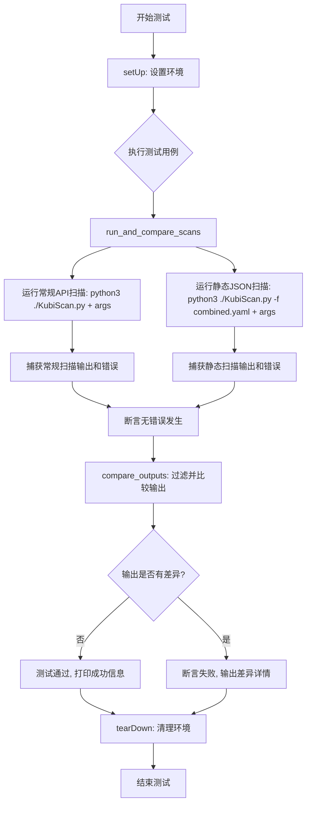

## 类结构

```
TestKubiScan (unittest.TestCase)
├── setUp (测试初始化)
├── tearDown (测试清理)
├── run_command (执行shell命令)
├── filter_output (过滤输出)
├── compare_outputs (比较输出差异)
├── run_and_compare_scans (核心比较逻辑)
├── test_risky_roles (测试风险角色)
├── test_risky_clusterroles (测试风险集群角色)
├── test_risky_any_roles (测试所有风险角色)
├── test_risky_rolebindings (测试风险角色绑定)
├── test_risky_clusterrolebindings (测试风险集群角色绑定)
├── test_risky_any_rolebindings (测试所有风险绑定)
├── test_risky_subjects (测试风险主体)
├── test_risky_pods (测试风险Pod)
├── test_risky_rolebindings_namespace (测试指定命名空间的角色绑定)
└── test_risky_all (测试所有风险项)
```

## 全局变量及字段


### `cmd`
    
要执行的shell命令列表

类型：`list`
    


### `output`
    
需要过滤的输出字符串

类型：`str`
    


### `output1`
    
第一个要比较的输出字符串

类型：`str`
    


### `output2`
    
第二个要比较的输出字符串

类型：`str`
    


### `regular_args`
    
常规API扫描的命令行参数列表

类型：`list`
    


### `static_args`
    
静态JSON扫描的命令行参数列表

类型：`list`
    


### `description`
    
测试场景的描述文字

类型：`str`
    


### `regular_cmd`
    
常规API扫描的完整命令列表

类型：`list`
    


### `static_cmd`
    
静态JSON扫描的完整命令列表，包含-f参数和json文件路径

类型：`list`
    


### `regular_output`
    
常规API扫描命令的标准输出

类型：`str`
    


### `static_output`
    
静态JSON扫描命令的标准输出

类型：`str`
    


### `regular_error`
    
常规API扫描命令的标准错误输出

类型：`str`
    


### `static_error`
    
静态JSON扫描命令的标准错误输出

类型：`str`
    


### `output1_filtered`
    
过滤掉版本、作者等非关键信息后的第一个输出

类型：`str`
    


### `output2_filtered`
    
过滤掉版本、作者等非关键信息后的第二个输出

类型：`str`
    


### `diff`
    
unified_diff生成的差异行列表

类型：`list`
    


### `diff_output`
    
格式化的差异输出字符串

类型：`str`
    


### `filtered_lines`
    
过滤后的输出行列表

类型：`list`
    


### `TestKubiScan.current_directory`
    
当前工作目录路径

类型：`str`
    


### `TestKubiScan.json_file_path`
    
静态扫描使用的JSON/YAML文件路径

类型：`str`
    
    

## 全局函数及方法


### `os.getcwd`

获取当前 Python 进程的工作目录（Current Working Directory），返回该目录的绝对路径字符串。

参数： 无

返回值：`str`，返回当前工作目录的绝对路径（例如：`/home/user/project`）

#### 流程图

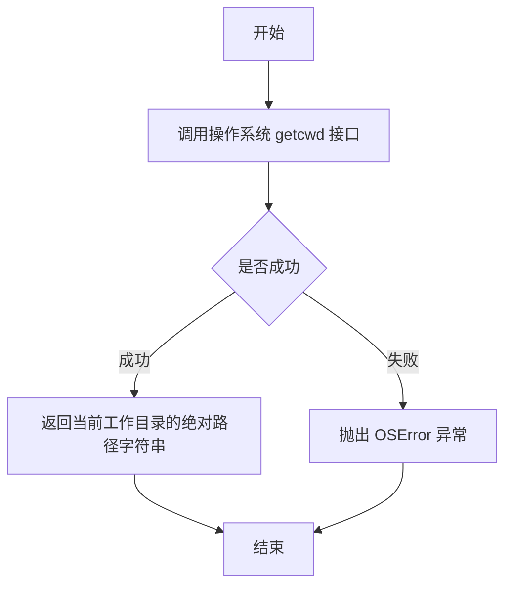

#### 带注释源码

```python
# os.getcwd() 是 Python 标准库 os 模块提供的函数
# 用于获取当前工作目录的绝对路径
# 返回值类型: str
# 无参数

# 在代码中的实际使用方式：
self.current_directory = os.getcwd()  # 获取测试执行时的当前工作目录路径
```

#### 上下文代码片段

```python
def setUp(self):
    """Set up the environment for each test."""
    # 调用 os.getcwd() 获取当前工作目录
    # 用于拼接测试所需的 JSON/YAML 文件路径
    self.current_directory = os.getcwd()

    #CHANGE combined.yaml to the json/yaml file you created for the static scan.
    # 使用获取到的当前目录路径拼接完整的文件路径
    self.json_file_path = os.path.join(self.current_directory, "combined.yaml")
    print(f"Setting up for test in {self.current_directory}")
```


### `os.path.join`

将多个路径组合成一个路径，返回拼接后的完整文件路径。

参数：

- `path`：`str`，基础路径（当前工作目录，通过 `os.getcwd()` 获取）
- `*paths`：`str`，可变数量的路径部分（这里是 `"combined.yaml"` 文件名）

返回值：`str`，拼接后的完整文件路径（如 `/home/user/project/combined.yaml`）

#### 流程图

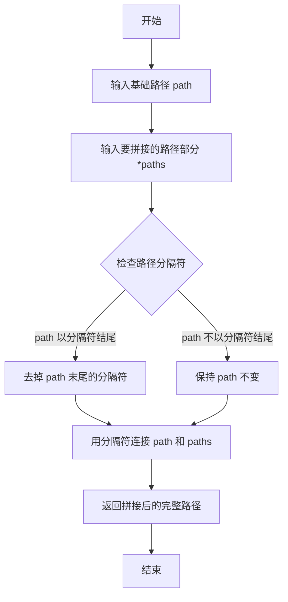

#### 带注释源码

```python
# 使用 os.path.join 拼接当前工作目录和文件名，生成完整的文件路径
self.json_file_path = os.path.join(self.current_directory, "combined.yaml")
# self.current_directory: 通过 os.getcwd() 获取的当前工作目录字符串
# "combined.yaml": 要拼接的 YAML 文件名
# 返回值示例: "/home/user/project/combined.yaml"
```


### `subprocess.run`

该函数是 Python 标准库中的进程调用接口，用于执行外部命令并捕获其输出。在本代码中，它被用作测试辅助函数，运行 KubiScan.py 脚本并捕获标准输出和标准错误，以验证动态 API 扫描与静态 JSON 扫描的输出结果是否一致。

参数：

- `cmd`：`list[str]`，要执行的命令列表，例如 `["python3", "./KubiScan.py", "-rr"]`
- `stdout`：`int`，标准输出重定向模式，使用 `subprocess.PIPE` 表示通过管道捕获输出
- `stderr`：`int`，标准错误重定向模式，使用 `subprocess.PIPE` 表示通过管道捕获错误输出
- `text`：`bool`，是否将输出转换为文本字符串，设置为 `True` 返回字符串格式

返回值：`subprocess.CompletedProcess`，包含已执行进程的信息对象，通过 `.stdout` 属性获取标准输出字符串，通过 `.stderr` 属性获取标准错误字符串

#### 流程图

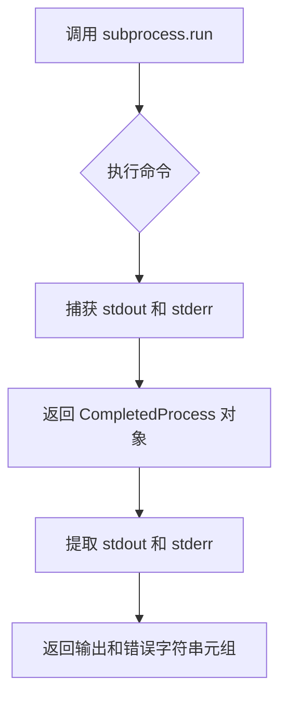

#### 带注释源码

```python
def run_command(self, cmd):
    """Helper function to run shell commands and capture output."""
    # 调用 subprocess.run 执行外部命令
    # cmd: 命令列表，如 ["python3", "./KubiScan.py", "-rr"]
    # stdout=subprocess.PIPE: 捕获标准输出到管道
    # stderr=subprocess.PIPE: 捕获标准错误到管道
    # text=True: 返回字符串格式的输出而非字节
    result = subprocess.run(
        cmd,                    # 要执行的命令列表
        stdout=subprocess.PIPE, # 捕获标准输出
        stderr=subprocess.PIPE, # 捕获标准错误
        text=True               # 返回文本字符串
    )
    # 返回标准输出和标准错误的字符串内容
    return result.stdout, result.stderr
```


### `difflib.unified_diff`

`difflib.unified_diff` 是 Python 标准库 `difflib` 模块中的一个函数，用于生成两个序列（或文件内容）的统一差异格式（Unified Diff）。在给定的代码中，它被用于比较常规 API 扫描和静态 JSON 扫描的输出差异。

参数：

- `a`：`list[str]`，第一个序列（被比较的原始输出），对应代码中的 `output1_filtered.splitlines()`
- `b`：`list[str]`，第二个序列（比较的目标输出），对应代码中的 `output2_filtered.splitlines()`
- `fromfile`：`str`，第一个文件的名称，代码中传递值为 `'Regular API Scan'`
- `tofile`：`str`，第二个文件的名称，代码中传递值为 `'Static JSON Scan'`
- `fromfiledate`：`str`，第一个文件的修改时间（可选），代码中未使用
- `tofiledate`：`str`，第二个文件的修改时间（可选），代码中未使用
- `lineterminator`：`str`，行终止符，代码中传递值为空字符串 `''`（默认值为 `'\n'`）
- `n`：`int`，上下文行数（可选），代码中未使用（默认值为 3）

返回值：`Iterator[str]`，返回一个生成器，产生统一差异格式的行列表。

#### 流程图

```mermaid
flowchart TD
    A[调用 difflib.unified_diff] --> B{参数验证}
    B -->|参数有效| C[初始化上下文行数 n=3]
    B -->|参数无效| D[抛出异常]
    C --> E[逐行比较 a 和 b 序列]
    E --> F{发现差异?}
    F -->|是| G[生成差异行 - 包含 --- 和 +++ 文件头]
    F -->|否| H[生成空结果]
    G --> I[添加上下文行和差异行]
    I --> J[yield 生成器返回行]
    H --> J
    J --> K[返回 Iterator[str] 给调用方]
```

#### 带注释源码

```python
# 代码中调用 unified_diff 的具体实现
diff = difflib.unified_diff(
    output1_filtered.splitlines(),  # a: 第一个列表 - 常规 API 扫描的输出（过滤后）
    output2_filtered.splitlines(),  # b: 第二个列表 - 静态 JSON 扫描的输出（过滤后）
    lineterm='',                     # lineterminator: 不附加任何行终止符，使用空字符串
    fromfile='Regular API Scan',    # fromfile: 统一差异中的源文件名称
    tofile='Static JSON Scan'        # tofile: 统一差异中的目标文件名称
)
# 返回值 diff 是一个 Iterator[str] 生成器对象
# 包含以下格式的行:
# --- Regular API Scan      # 表示源文件
# +++ Static JSON Scan      # 表示目标文件
# @@ -n1,n2 +n3,n4 @@       # 差异块的头部，显示行号范围
# - 内容                    # 表示被删除的行
# + 内容                    # 表示新增的行
#  (上下文行)               # 显示差异附近的上下文内容
```


### `TestKubiScan.setUp`

设置每个测试用例的运行环境，初始化当前工作目录并构建静态扫描所需的JSON/YAML文件路径。

参数：

- `self`：`TestKubiScan`，隐式参数，表示测试类实例本身

返回值：`None`，无返回值，仅执行环境初始化操作

#### 流程图

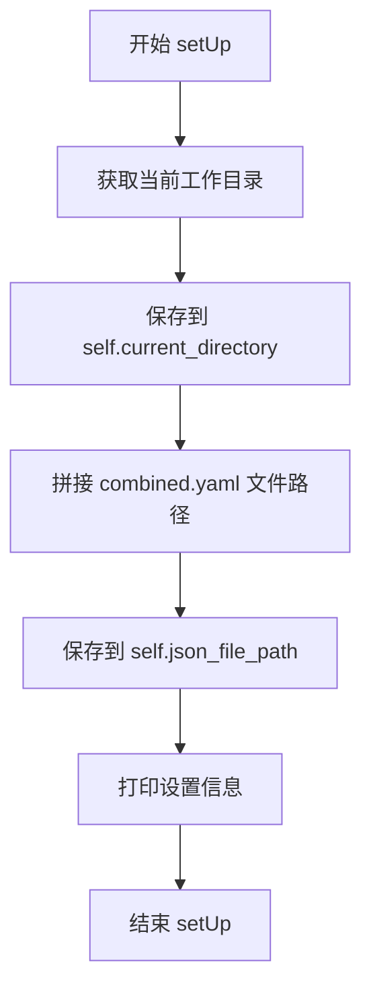

#### 带注释源码

```python
def setUp(self):
    """Set up the environment for each test."""
    # 获取当前工作目录的绝对路径
    self.current_directory = os.getcwd()

    # CHANGE combined.yaml to the json/yaml file you created for the static scan.
    # 构建 combined.yaml 文件的完整路径，用于静态扫描测试
    self.json_file_path = os.path.join(self.current_directory, "combined.yaml")
    # 打印当前测试设置的目录信息，便于调试和日志追踪
    print(f"Setting up for test in {self.current_directory}")
```


### `TestKubiScan.tearDown`

清理测试环境，在每个测试用例执行完毕后被调用，用于执行必要的清理工作。

参数：

-  `self`：`object`，TestKubiScan 类的实例对象，隐式参数，用于访问类属性和方法

返回值：`None`，无返回值，该方法仅执行清理操作

#### 流程图

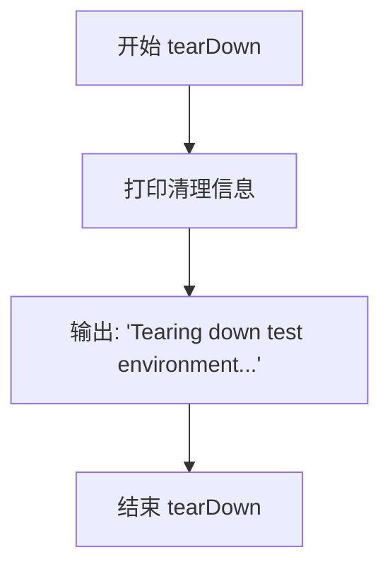

#### 带注释源码

```python
def tearDown(self):
    """Clean up after each test."""
    print("Tearing down test environment...")
    # 该方法在每个测试方法执行完毕后由 unittest 框架自动调用
    # 用于清理 setUp 中创建的测试资源和环境变量
    # 当前实现仅输出一条日志信息，如有需要可在此处添加文件清理、进程终止等操作
```


### `TestKubiScan.run_command`

该方法是测试类 `TestKubiScan` 中的一个辅助方法，用于执行shell命令并捕获其标准输出和标准错误返回。

参数：

- `cmd`：`List[str]`，要执行的shell命令，以列表形式传递，其中第一个元素是命令本身，后续元素是参数

返回值：`Tuple[str, str]`，返回一个元组，包含命令执行后的标准输出（stdout）和标准错误（stderr）

#### 流程图

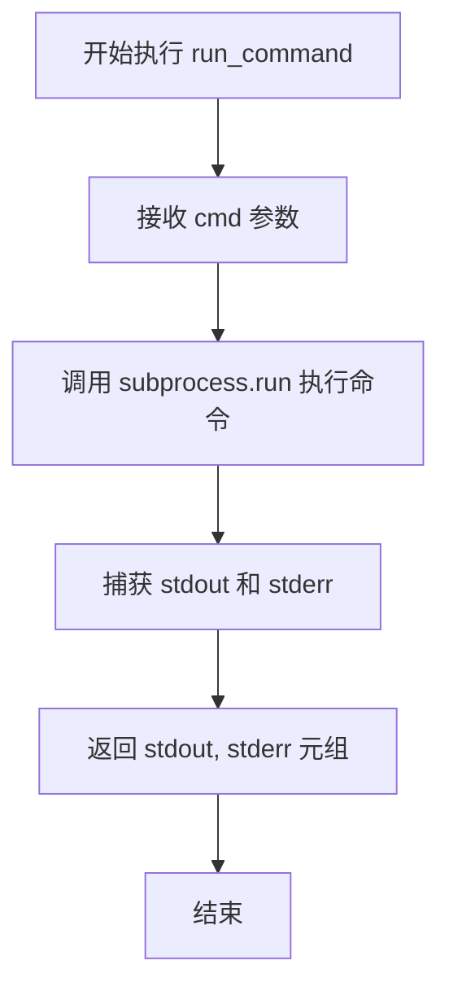

#### 带注释源码

```python
def run_command(self, cmd):
    """Helper function to run shell commands and capture output."""
    # 使用 subprocess.run 执行传入的命令
    # stdout=subprocess.PIPE: 捕获标准输出
    # stderr=subprocess.PIPE: 捕获标准错误
    # text=True: 以文本模式返回结果（而非字节）
    result = subprocess.run(cmd, stdout=subprocess.PIPE, stderr=subprocess.PIPE, text=True)
    # 返回标准输出和标准错误的元组
    return result.stdout, result.stderr
```


### `TestKubiScan.filter_output`

过滤掉输出中的非必要行（如版本信息、作者信息、kubeconfig文件路径等），以便进行准确的输出比较。

参数：

- `output`：`str`，需要过滤的输出字符串

返回值：`str`，过滤后的输出字符串

#### 流程图

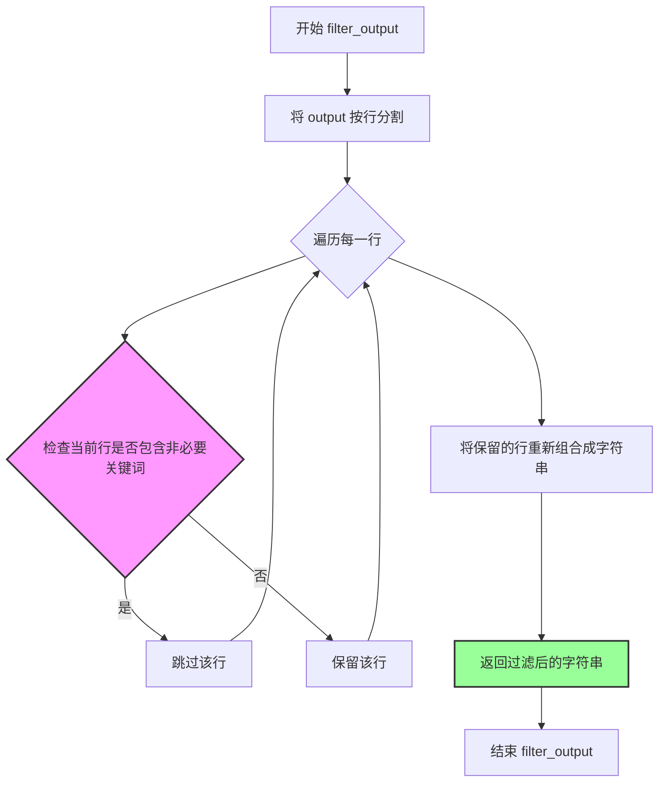

#### 带注释源码

```python
def filter_output(self, output):
    """Helper function to filter out non-essential lines from the output."""
    # 使用列表推导式过滤输出中的非必要行
    # 过滤条件：移除包含以下关键词的行：
    # - "KubiScan version"（版本信息）
    # - "Author"（作者信息）
    # - "Using kube config file"（kubeconfig文件路径）
    filtered_lines = [line for line in output.splitlines() 
                      if "KubiScan version" not in line 
                      and "Author" not in line 
                      and "Using kube config file" not in line]
    # 将过滤后的行重新组合成字符串并返回
    return "\n".join(filtered_lines)
```


### TestKubiScan.compare_outputs

该方法是一个辅助函数，用于比较两个输出内容并显示它们之间的差异，通过过滤掉非必要信息后使用统一差异算法生成差异报告。

参数：

- `output1`：`str`，表示第一个要比较的输出内容
- `output2`：`str`，表示第二个要比较的输出内容

返回值：`str`，返回两个输出之间的差异字符串，如果没有差异则返回空字符串

#### 流程图

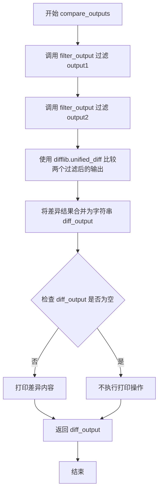

#### 带注释源码

```python
def compare_outputs(self, output1, output2):
    """Helper function to compare two outputs and show differences."""
    # 使用 filter_output 方法过滤第一个输出，去除非必要信息（如版本信息、作者信息等）
    output1_filtered = self.filter_output(output1)
    
    # 使用 filter_output 方法过滤第二个输出
    output2_filtered = self.filter_output(output2)

    # 使用 Python 标准库的 difflib.unified_diff 生成统一格式的差异
    # 参数说明：
    # - output1_filtered.splitlines()：第一个输出的行列表
    # - output2_filtered.splitlines()：第二个输出的行列表
    # - lineterm=''：不使用行终止符
    # - fromfile='Regular API Scan'：差异报告中第一个文件的名称
    # - tofile='Static JSON Scan'：差异报告中第二个文件的名称
    diff = difflib.unified_diff(
        output1_filtered.splitlines(), output2_filtered.splitlines(), lineterm='', 
        fromfile='Regular API Scan', tofile='Static JSON Scan'
    )
    
    # 将差异迭代器转换为字符串格式
    diff_output = '\n'.join(diff)
    
    # 如果存在差异，则打印差异内容供调试参考
    if diff_output:
        print(f"Differences found:\n{diff_output}")
    
    # 返回差异字符串，如果没有差异则返回空字符串
    return diff_output
```


### `TestKubiScan.run_and_compare_scans`

该方法是测试类的核心辅助函数，用于执行并比较常规 API 扫描与静态 JSON 扫描的输出结果，验证两种扫描方式的一致性。

参数：

- `regular_args`：`list`，常规 API 扫描的命令行参数列表
- `static_args`：`list`，静态 JSON 扫描的命令行参数列表
- `description`：`str`，测试描述信息，用于输出和断言消息

返回值：`None`，该方法通过 unittest 断言验证结果，不返回任何值

#### 流程图

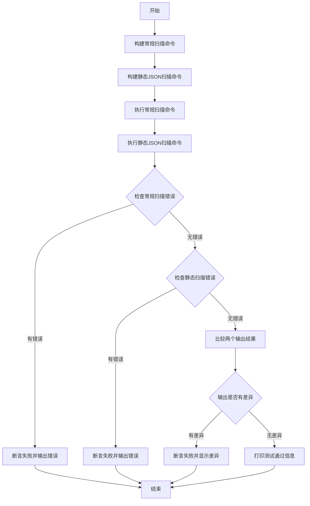

#### 带注释源码

```python
def run_and_compare_scans(self, regular_args, static_args, description):
    """Helper function to run and compare regular API scan with static JSON scan."""
    # 构建常规API扫描命令：使用python3运行KubiScan.py并传入regular_args参数
    regular_cmd = ["python3", "./KubiScan.py"] + regular_args
    
    # 构建静态JSON扫描命令：使用python3运行KubiScan.py，指定-f参数加载JSON文件，并传入static_args参数
    static_cmd = ["python3", "./KubiScan.py", "-f", self.json_file_path] + static_args

    # 执行常规扫描命令，获取标准输出和标准错误
    regular_output, regular_error = self.run_command(regular_cmd)
    
    # 执行静态JSON扫描命令，获取标准输出和标准错误
    static_output, static_error = self.run_command(static_cmd)

    # 确保常规扫描命令运行没有错误，如果存在错误则断言失败并显示错误信息
    self.assertEqual(regular_error, '', f"Error in regular API scan: {regular_error}")
    
    # 确保静态JSON扫描命令运行没有错误，如果存在错误则断言失败并显示错误信息
    self.assertEqual(static_error, '', f"Error in static JSON scan: {static_error}")

    # 比较两个扫描输出并获取差异结果
    diff = self.compare_outputs(regular_output, static_output)
    
    # 断言两个输出没有差异，如果不同则显示差异详情和测试描述
    self.assertEqual(diff, '', f"Outputs differ between regular API scan and static JSON scan for {description}.")
    
    # 测试通过时打印成功信息，包含测试描述
    print(f"✅ Test passed: {description} scan comparison is identical.")
```


### `TestKubiScan.test_risky_roles`

该测试方法用于验证KubiScan工具在扫描"Risky Roles"（危险角色）时，通过常规API扫描与静态JSON扫描两种方式得到的输出结果是否一致，确保静态扫描功能的正确性。

参数：

- `self`：`TestKubiScan`，隐式参数，表示测试类的实例本身

返回值：`None`，测试方法无返回值，执行完成后通过断言验证扫描结果一致性

#### 流程图

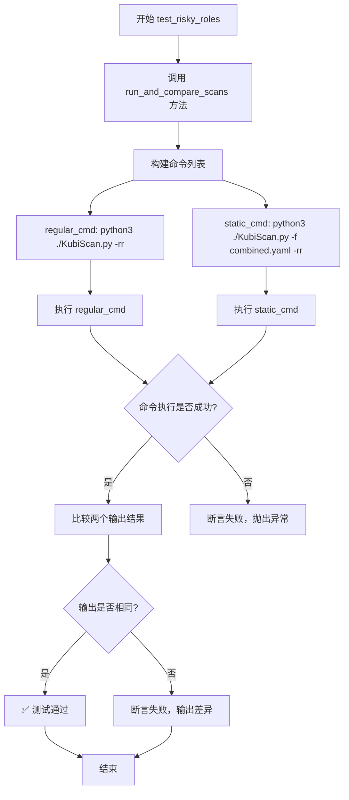

#### 带注释源码

```python
def test_risky_roles(self):
    """
    测试函数：验证 Risky Roles 扫描结果的一致性
    
    该测试方法比较通过常规 API 扫描与静态 JSON 扫描
    两种方式获取的 Risky Roles 信息是否完全一致
    """
    # 调用辅助方法 run_and_compare_scans 执行扫描比较
    # 参数说明：
    #   - 第一个参数 ["-rr"]：常规 API 扫描使用的命令行参数
    #   - 第二个参数 ["-rr"]：静态 JSON 扫描使用的命令行参数
    #   - 第三个参数 "Risky Roles"：测试描述，用于日志输出
    self.run_and_compare_scans(["-rr"], ["-rr"], "Risky Roles")
```


### `TestKubiScan.test_risky_clusterroles`

该测试方法用于验证 KubiScan 工具在扫描风险 ClusterRoles 时的功能一致性，通过对比常规 API 扫描与静态 JSON 扫描的输出结果，确保两种扫描方式返回相同的结果。

参数：

- `self`：`TestKubiScan`，表示测试类实例本身，包含测试所需的上下文和辅助方法

返回值：`None`，该方法为测试方法，不返回任何值，通过测试框架的断言机制来验证结果

#### 流程图

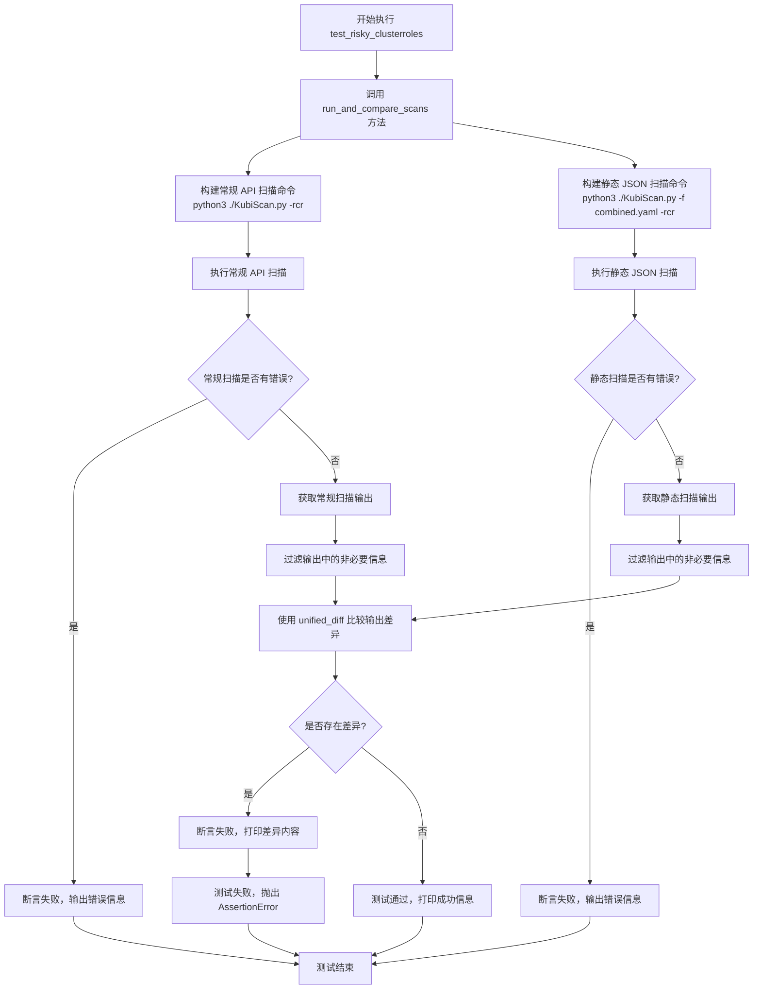

#### 带注释源码

```python
def test_risky_clusterroles(self):
    """
    测试风险 ClusterRoles 扫描功能。
    
    该测试方法通过调用 run_and_compare_scans 辅助方法，
    验证 KubiScan 工具在使用 -rcr 参数时，常规 API 扫描
    与静态 JSON 扫描两种方式产生的输出结果是否一致。
    
    测试目标：
    - 验证扫描 ClusterRoles 的功能正常工作
    - 确保静态扫描模式与动态 API 扫描模式输出等价
    """
    
    # 调用通用扫描比较方法，传入以下参数：
    # - 常规扫描参数：["-rcr"]，表示扫描风险 ClusterRoles
    # - 静态扫描参数：["-rcr"]，同样扫描风险 ClusterRoles
    # - 描述信息："Risky ClusterRoles"，用于测试输出标识
    self.run_and_compare_scans(["-rcr"], ["-rcr"], "Risky ClusterRoles")
    
    # run_and_compare_scans 方法内部会执行以下操作：
    # 1. 构建并执行两条命令：
    #    - 常规扫描: python3 ./KubiScan.py -rcr
    #    - 静态扫描: python3 ./KubiScan.py -f combined.yaml -rcr
    # 2. 捕获并验证两条命令的标准错误输出为空
    # 3. 过滤并比较两条命令的标准输出
    # 4. 使用 unittest 断言验证两者输出完全一致
    # 5. 输出测试结果：✅ Test passed: Risky ClusterRoles scan comparison is identical.
```

#### 关键信息补充

| 项目 | 描述 |
|------|------|
| **所属类** | `TestKubiScan` |
| **测试类型** | 单元测试/集成测试 |
| **测试目的** | 验证 KubiScan 工具在风险 ClusterRoles 扫描场景下的一致性 |
| **依赖命令** | `python3 ./KubiScan.py -rcr`（常规扫描）<br/>`python3 ./KubiScan.py -f combined.yaml -rcr`（静态扫描）|
| **前置条件** | `combined.yaml` 文件必须存在于当前工作目录 |
| **断言逻辑** | 静态扫描输出必须与常规 API 扫描输出完全一致 |

#### 潜在的技术债务或优化空间

1. **硬编码文件路径**：`self.json_file_path` 硬编码为 `combined.yaml`，建议通过环境变量或配置文件管理
2. **测试参数重复**：`test_risky_clusterroles` 与 `test_risky_roles` 等多个测试方法的参数结构高度相似，可考虑使用参数化测试（`@parameterized`）减少代码冗余
3. **缺乏错误恢复机制**：如果 `KubiScan.py` 不存在，测试会直接失败，缺少友好的错误提示
4. **过滤逻辑不够灵活**：过滤非必要行使用硬编码的字符串匹配，可考虑将过滤规则配置化
5. **命令执行路径依赖**：依赖 `python3` 命令在不同系统环境中的可用性，建议使用 `sys.executable` 替代硬编码的 `python3`


### `TestKubiScan.test_risky_any_roles`

该方法是一个集成测试用例，用于自动化验证 KubiScan 工具在执行“扫描所有风险角色（Risky Roles and ClusterRoles）”操作时，其通过 Kubernetes API 的动态扫描结果与通过本地静态 YAML/JSON 文件的扫描结果是否完全一致。这确保了静态扫描功能的准确性。

参数：

- `self`：隐式参数，类型为 `TestKubiScan` (unittest.TestCase)，代表测试类实例本身，无需显式描述。

返回值：`None`，该方法为 `void` 类型，通过 unittest 框架的断言（Assertions）来判定测试成功或失败。

#### 流程图

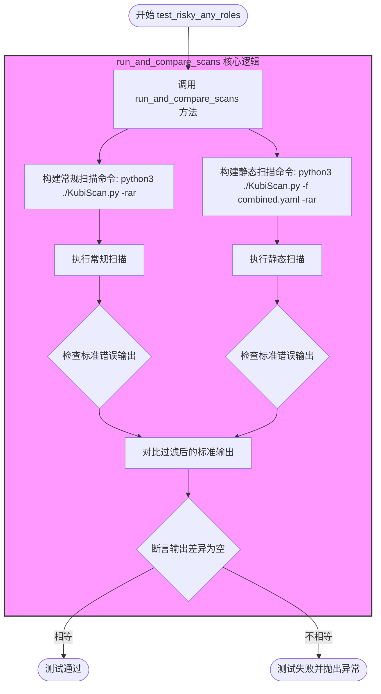

#### 带注释源码

```python
def test_risky_any_roles(self):
    """
    测试扫描所有风险角色（Roles 和 ClusterRoles）的功能。
    
    该测试用例通过调用通用的比较辅助函数 run_and_compare_scans，
    验证使用 '-rar' 参数时，动态 API 扫描与静态 JSON/YAML 扫描的结果是否一致。
    """
    # 调用内部辅助方法，参数分别为：
    # 1. 常规扫描参数列表: ["-rar"]
    # 2. 静态扫描参数列表: ["-rar"]
    # 3. 测试描述: "Risky Roles and ClusterRoles"
    self.run_and_compare_scans(["-rar"], ["-rar"], "Risky Roles and ClusterRoles")
```


### TestKubiScan.test_risky_rolebindings

该方法是一个单元测试用例，用于验证通过常规 Kubernetes API 扫描和使用静态 JSON/YAML 文件扫描获得的 Risky RoleBindings 结果是否一致。它通过调用 `run_and_compare_scans` 辅助方法，传递相同的命令行参数 `-rb` 分别执行两种扫描方式，并比较输出结果。

参数：无

返回值：`None`，无返回值（unittest 测试方法）

#### 流程图

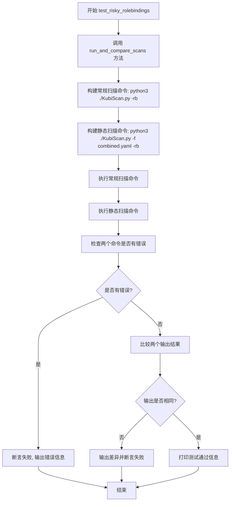

#### 带注释源码

```python
def test_risky_rolebindings(self):
    """
    测试 Risky RoleBindings 的扫描结果一致性。
    
    该测试方法执行以下操作:
    1. 使用常规 Kubernetes API 扫描 (-rb 参数)
    2. 使用静态 JSON/YAML 文件扫描 (-rb 参数配合 -f 参数)
    3. 比较两种扫描方式的输出结果是否一致
    
    验证目标: 确保静态扫描模式能够产生与常规 API 扫描相同的 Risky RoleBindings 结果。
    """
    # 调用 run_and_compare_scans 辅助方法进行比较
    # 参数说明:
    #   - 第一个列表: 常规扫描的命令行参数 ['-rb']
    #   - 第二个列表: 静态扫描的命令行参数 ['-rb']
    #   - 第三个参数: 测试描述字符串 'Risky RoleBindings'
    self.run_and_compare_scans(["-rb"], ["-rb"], "Risky RoleBindings")
```


### `TestKubiScan.test_risky_clusterrolebindings`

该方法是一个测试用例，用于验证 KubiScan 工具在扫描存在风险的 ClusterRoleBinding 资源时，常规 API 扫描与静态 JSON 扫描的输出结果是否一致。

参数：
- `self`：`TestKubiScan`，表示测试类的实例本身

返回值：`None`，该方法没有显式返回值，通过调用 `run_and_compare_scans` 方法执行测试断言

#### 流程图

```mermaid
graph TD
    A[开始 test_risky_clusterrolebindings] --> B[调用 run_and_compare_scans 方法]
    B --> C[传入参数: ['-rcb'], ['-rcb'], 'Risky ClusterRoleBindings']
    C --> D[执行常规API扫描: python3 ./KubiScan.py -rcb]
    D --> E[执行静态JSON扫描: python3 ./KubiScan.py -f combined.yaml -rcb]
    E --> F{两种扫描结果是否一致?}
    F -->|是| G[测试通过: 输出成功信息]
    F -->|否| H[测试失败: 抛出断言异常]
    G --> I[结束]
    H --> I
```

#### 带注释源码

```python
def test_risky_clusterrolebindings(self):
    """
    测试用例：验证 Risky ClusterRoleBindings 扫描结果一致性
    
    该方法执行以下操作：
    1. 使用常规 API 方式扫描存在风险的 ClusterRoleBinding（参数: -rcb）
    2. 使用静态 JSON 文件方式扫描存在风险的 ClusterRoleBinding（参数: -rcb）
    3. 比较两种方式的输出结果，确保完全一致
    
    测试目标：
    - 验证 KubiScan 工具在不同扫描模式下对 ClusterRoleBinding 的分析结果一致
    - 确保静态扫描模式能够正确解析和呈现风险信息
    
    参数:
        无（除了隐式的 self 参数）
    
    返回值:
        None（通过 unittest 框架的断言进行验证）
    """
    # 调用通用扫描比较方法，传入相同的参数列表
    # 第一个列表：常规 API 扫描参数
    # 第二个列表：静态 JSON 扫描参数
    # 第三个字符串：测试描述信息
    self.run_and_compare_scans(["-rcb"], ["-rcb"], "Risky ClusterRoleBindings")
```


### `TestKubiScan.test_risky_any_rolebindings`

该函数是 TestKubiScan 类中的一个测试用例，用于验证在使用 `-rab` 参数时，常规 API 扫描与静态 JSON 扫描的输出结果是否一致，确保两种扫描方式对于 Risks RoleBindings and ClusterRoleBindings 的检测结果相同。

参数：该函数无显式参数（隐含接收 self 参数）

返回值：`None`，该函数通过 unittest 框架的断言来验证扫描结果一致性，若测试失败则抛出异常

#### 流程图

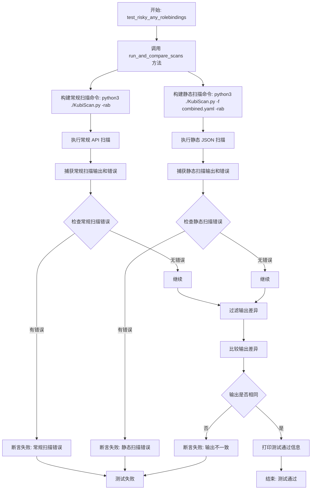

#### 带注释源码

```python
def test_risky_any_rolebindings(self):
    """
    测试函数：验证 Risky RoleBindings and ClusterRoleBindings 扫描结果一致性
    
    该测试用例执行以下操作：
    1. 使用 -rab 参数运行常规 Kubernetes API 扫描
    2. 使用 -rab 参数运行静态 JSON/YAML 文件扫描
    3. 比较两种扫描方式的输出，确保结果一致
    
    注意：-rab 参数表示扫描所有 Risks RoleBindings and ClusterRoleBindings
    """
    # 调用辅助方法 run_and_compare_scans，传入相同的参数列表
    # 第一个参数列表用于常规 API 扫描
    # 第二个参数列表用于静态 JSON 扫描
    # 第三个参数是测试描述，用于输出信息和错误消息
    self.run_and_compare_scans(["-rab"], ["-rab"], "Risky RoleBindings and ClusterRoleBindings")
    
    # 该方法内部会：
    # 1. 执行命令: python3 ./KubiScan.py -rab (常规扫描)
    # 2. 执行命令: python3 ./KubiScan.py -f combined.yaml -rab (静态扫描)
    # 3. 比较两个命令的输出
    # 4. 使用 self.assertEqual 断言输出相同
    # 5. 如果输出不同，打印差异并导致测试失败
```


### `TestKubiScan.test_risky_subjects`

该方法是一个单元测试函数，用于验证 KubiScan 工具在扫描"Risky Subjects"（风险主体）时，通过常规 Kubernetes API 扫描与通过静态 JSON/YAML 文件扫描的输出结果是否一致，以确保静态扫描功能的正确性。

参数：该方法无显式参数（仅隐式接收 `self` 作为实例属性）

返回值：`None`，该方法为测试方法，通过 unittest 框架的断言来验证结果，不返回具体值

#### 流程图

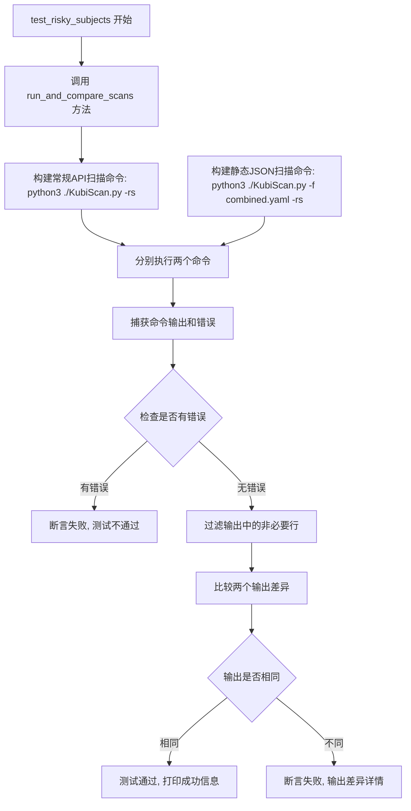

#### 带注释源码

```python
def test_risky_subjects(self):
    """
    测试方法：验证 Risky Subjects 扫描结果的一致性
    
    该方法通过调用 run_and_compare_scans 辅助方法，
    比较使用 Kubernetes API 扫描与使用静态 JSON 文件扫描
    两种方式获取的 Risky Subjects 结果是否完全一致。
    
    参数: 无（继承自 unittest.TestCase）
    返回值: None（通过 unittest 断言验证）
    """
    # 调用通用扫描比较方法，传入相同的命令行参数
    # "-rs" 参数表示扫描 Risky Subjects（风险主体）
    # 第一个列表用于常规 API 扫描，第二个列表用于静态文件扫描
    self.run_and_compare_scans(["-rs"], ["-rs"], "Risky Subjects")
```


### `TestKubiScan.test_risky_pods`

该方法是一个测试用例，用于验证KubiScan工具在扫描风险Pod（Risky Pods）时，常规API扫描模式与静态JSON/YAML扫描模式的输出结果是否一致。通过调用`run_and_compare_scans`方法，传入`-rp`参数来执行两种扫描方式的对比测试。

参数： 无（该方法不接受任何参数）

返回值：`None`，该方法为测试方法，不返回任何值，仅通过断言验证扫描结果一致性

#### 流程图

```mermaid
flowchart TD
    A[开始 test_risky_pods] --> B[调用 run_and_compare_scans 方法]
    B --> C[传入参数: regular_args=['-rp'], static_args=['-rp'], description='Risky Pods']
    C --> D[执行常规API扫描: python3 ./KubiScan.py -rp]
    C --> E[执行静态JSON扫描: python3 ./KubiScan.py -f combined.yaml -rp]
    D --> F[捕获标准输出和标准错误]
    E --> F
    F --> G{两种扫描是否有错误?}
    G -->|是| H[断言失败, 输出错误信息]
    G -->|否| I[过滤输出中的非必要信息]
    I --> J{输出是否存在差异?}
    J -->|是| K[断言失败, 显示差异]
    J -->|否| L[断言通过, 输出测试成功信息]
    H --> M[测试结束]
    K --> M
    L --> M
```

#### 带注释源码

```python
def test_risky_pods(self):
    """
    测试KubiScan的Risky Pods扫描功能。
    
    该测试方法验证使用-rp参数时，KubiScan工具通过以下两种方式
    扫描风险Pod的输出结果是否一致：
    1. 常规API扫描（直接连接Kubernetes集群）
    2. 静态JSON/YAML扫描（使用预先导出的combined.yaml文件）
    
    测试目标：确保静态扫描功能的准确性，使其与API扫描结果一致。
    """
    # 调用辅助方法run_and_compare_scans，传入以下参数：
    # - regular_args: 常规API扫描使用的命令行参数 ['-rp']
    # - static_args: 静态扫描使用的命令行参数 ['-rp']
    # - description: 测试描述字符串 'Risky Pods'
    self.run_and_compare_scans(["-rp"], ["-rp"], "Risky Pods")
```


### `TestKubiScan.test_risky_rolebindings_namespace`

该方法是一个测试用例，用于验证在使用 `-rb`（Risky RoleBindings）参数和 `-ns kube-system`（指定命名空间）参数时，常规 API 扫描与静态 JSON 扫描的输出结果是否一致。

参数：

- `self`：`unittest.TestCase`，测试类实例本身，包含测试所需的环境和工具方法

返回值：`None`，该方法为测试用例，通过 `unittest` 框架的断言机制验证功能，不显式返回值

#### 流程图

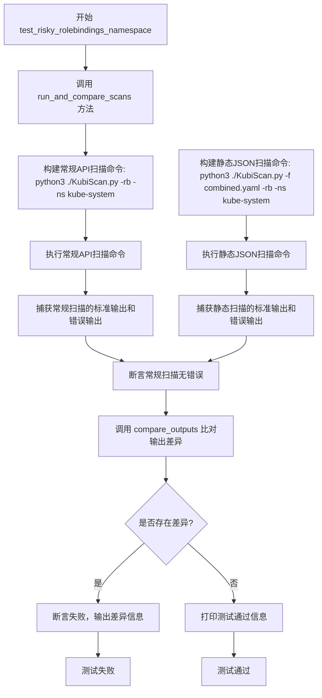

#### 带注释源码

```python
def test_risky_rolebindings_namespace(self):
    """
    测试用例：验证带有命名空间过滤的 Risky RoleBindings 扫描功能。
    
    该测试方法通过比较常规 Kubernetes API 扫描和静态 YAML/JSON 文件扫描
    的输出结果，确保两种扫描模式对于指定命名空间（kube-system）的
    Risky RoleBindings 能够产生一致的结果。
    
    参数:
        self: TestKubiScan 实例，继承自 unittest.TestCase
        
    返回值:
        None (通过 unittest 断言验证结果)
        
    异常:
        AssertionError: 当扫描结果不一致时抛出
    """
    # 调用通用扫描比较方法，传入常规扫描参数、静态扫描参数和测试描述
    # 常规扫描: 使用 -rb 参数查找 Risky RoleBindings，使用 -ns kube-system 过滤命名空间
    # 静态扫描: 同样使用 -rb 和 -ns 参数，但从 combined.yaml 文件读取数据进行扫描
    self.run_and_compare_scans(
        ["-rb", "-ns", "kube-system"],  # 常规 API 扫描参数列表
        ["-rb", "-ns", "kube-system"],  # 静态 JSON/YAML 扫描参数列表
        "Risky RoleBindings with namespace!"  # 测试描述信息
    )
```


### `TestKubiScan.test_risky_all`

该方法用于测试KubiScan工具的完整扫描功能，比较通过常规API扫描与通过静态JSON文件扫描的结果是否一致，验证工具在扫描所有风险角色、角色绑定、用户和Pod/容器时的准确性。

参数：

- `self`：`TestKubiScan`，unittest测试用例实例本身，用于访问类中的其他方法和属性

返回值：`None`，无显式返回值（test方法在unittest框架中不需要返回值，通过断言来验证测试结果）

#### 流程图

```mermaid
flowchart TD
    A[开始 test_risky_all] --> B[调用 run_and_compare_scans 方法]
    B --> C[构建常规API扫描命令: python3 ./KubiScan.py -a]
    D[构建静态JSON扫描命令: python3 ./KubiScan.py -f combined.yaml -a]
    C --> E[执行常规扫描命令]
    D --> F[执行静态JSON扫描命令]
    E --> G[获取常规扫描输出和错误]
    F --> H[获取静态JSON扫描输出和错误]
    G --> I[断言常规扫描无错误]
    H --> J[断言静态JSON扫描无错误]
    I --> K[过滤输出中的非必要行]
    J --> L[过滤输出中的非必要行]
    K --> M[使用 unified_diff 比较两个输出]
    L --> M
    M --> N{输出是否相同?}
    N -->|是| O[测试通过，打印成功消息]
    N -->|否| P[测试失败，输出差异内容]
    O --> Q[结束]
    P --> Q
```

#### 带注释源码

```python
def test_risky_all(self):
    """
    测试KubiScan的完整扫描功能(-a参数)
    
    该测试方法验证KubiScan在使用-a参数（即扫描所有风险项）时，
    通过常规Kubernetes API扫描与通过静态JSON/YAML文件扫描的结果一致性。
    包括以下类型的风险资源:
    - Roles和ClusterRoles
    - RoleBindings和ClusterRoleBindings
    - Users（用户）
    - Pods和Containers
    """
    # 调用辅助方法执行扫描并比较结果
    # 参数说明:
    #   ["-a"]: 常规API扫描使用的命令行参数
    #   ["-a"]: 静态JSON扫描使用的命令行参数（-f指定文件已在run_and_compare_scans中处理）
    #   "All risky Roles\\ClusterRoles, RoleBindings\\ClusterRoleBindings, users and pods\\containers.": 测试描述
    self.run_and_compare_scans(["-a"], ["-a"], "All risky Roles\\ClusterRoles, RoleBindings\\ClusterRoleBindings, users and pods\\containers.")
```

## 关键组件


### TestKubiScan类

这是核心测试类，继承自unittest.TestCase，用于验证KubiScan工具的静态扫描功能是否与常规API扫描功能产生一致的结果。

### setUp方法

初始化测试环境，设置当前工作目录和静态扫描所需的JSON/YAML文件路径。

### run_command方法

辅助方法，通过subprocess执行shell命令并捕获标准输出和错误输出。

### filter_output方法

辅助方法，过滤掉输出中的非关键信息行（如版本信息、作者信息等），以便进行准确的结果比较。

### compare_outputs方法

辅助方法，使用difflib对比两个输出内容，生成统一差异格式的对比结果。

### run_and_compare_scans方法

核心比较方法，同时运行常规API扫描和静态JSON扫描命令，比较两者输出是否完全一致，并断言无差异。

### 测试方法组

包含多个测试方法（test_risky_roles、test_risky_clusterroles、test_risky_any_roles等），分别验证不同扫描参数下两种扫描模式的结果一致性。


## 问题及建议


### 已知问题

- **硬编码的文件路径**：`json_file_path` 被硬编码为当前目录下的 "combined.yaml"，缺乏灵活性，测试在不同环境运行时可能失败
- **命令参数使用魔法字符串**：测试方法中重复使用 "-rr"、"-rcr"、"-rb" 等参数，但没有任何常量定义，导致可读性差且易出错
- **subprocess 缺少超时处理**：`run_command` 方法未设置超时参数，可能导致测试在命令挂起时无限期等待
- **tearDown 方法为空**：测试后没有进行任何清理工作，可能导致测试残留文件影响后续测试
- **存在被注释掉的测试**：代码中存在多个被注释掉的测试方法（test_risky_pods Deep 和 test_privleged_pods），表明功能不完整或存在已知 bug 未修复
- **硬编码 Python 解释器**：直接使用 "python3" 硬编码，在某些环境（如 Windows 或虚拟环境）中可能无法正常运行
- **测试隔离性不足**：所有测试共享 `json_file_path` 变量，若某一测试修改该变量会影响其他测试
- **过滤逻辑脆弱**：`filter_output` 方法使用简单字符串匹配过滤输出，若输出格式变化测试会失败且不易追踪
- **使用 print 语句而非日志框架**：测试中使用 `print` 进行输出，缺乏日志级别控制和日志管理
- **参数冗余传递**：多数测试方法将相同参数传递两次给 `run_and_compare_scans`（如 `["-rr"], ["-rr"]`），设计不够优雅

### 优化建议

- 将命令行参数提取为常量或枚举类，提高可维护性和可读性
- 为 `subprocess.run` 添加 `timeout` 参数，防止命令挂起导致测试卡死
- 使用 `setUpClass` 和 `tearDownClass` 进行类级别的初始化和清理，提高测试执行效率
- 实现完整的 tearDown 清理逻辑，删除测试生成的临时文件
- 使用 `logging` 模块替代 print 语句，便于日志管理和调试
- 将被注释掉的测试方法补充完整或移除，明确标记已知 bug 的处理状态
- 考虑使用 pytest 框架或添加参数化测试，减少重复代码
- 添加输出内容的基本验证，不仅比较差异还要确保输出包含预期关键信息

## 其它


### 设计目标与约束

本测试代码的设计目标是验证KubiScan工具在两种不同扫描模式（实时API扫描和静态JSON/YAML文件扫描）下产生一致的输出结果，确保静态扫描功能的正确性。约束条件包括：测试必须在KubiScan.py可执行的环境下运行，需要预先准备好combined.yaml文件，且测试用例覆盖了KubiScan的主要命令行参数。

### 错误处理与异常设计

测试代码采用Python unittest框架的断言机制进行错误处理。使用assertEqual验证命令执行的错误输出（stderr）为空，确保两种扫描模式都能正常执行。使用assertEqual比较过滤后的输出差异（diff），若存在差异则测试失败并打印详细的diff信息。辅助方法run_command捕获subprocess的返回结果，filter_output过滤非必要信息，compare_outputs生成统一格式的差异对比。

### 数据流与状态机

测试数据流为：准备阶段（setUp获取当前目录和yaml文件路径）→ 执行阶段（run_and_compare_scans分别运行两种扫描命令）→ 比对阶段（filter_output过滤输出，compare_outputs生成diff）→ 验证阶段（assertEqual断言无差异）。状态机包含：初始化状态 → 命令执行状态 → 输出比对状态 → 通过/失败状态。

### 外部依赖与接口契约

主要外部依赖包括：Python3解释器、KubiScan.py主程序、combined.yaml静态扫描数据文件、subprocess模块（用于执行shell命令）、difflib模块（用于文本差异比对）、os模块（用于获取当前目录）。接口契约要求KubiScan.py支持命令行参数（-rr, -rcr, -rar, -rb, -rcb, -rab, -rs, -rp, -a等）以及-f参数指定静态文件路径。

### 测试覆盖率分析

代码覆盖了KubiScan的8种核心扫描场景：risky roles（-rr）、risky clusterroles（-rcr）、risky any roles（-rar）、risky rolebindings（-rb）、risky clusterrolebindings（-rcb）、risky any rolebindings（-rab）、risky subjects（-rs）、risky pods（-rp）。额外覆盖了namespace参数场景（-rb -ns kube-system）和全量扫描场景（-a）。存在注释掉的测试用例（deep scan和privileged pods）表明存在已知bug待修复。

### 环境要求与配置

运行环境要求Python3标准库，无需额外安装第三方包。需要确保KubiScan.py具有可执行权限且位于测试脚本同级目录。静态扫描文件combined.yaml需要预先通过KubiScan的静态扫描功能生成。测试执行时会在控制台输出设置和清理信息，便于调试和环境问题排查。

### 潜在技术债务与优化空间

代码中存在两处注释掉的测试用例（test_risky_pods深度扫描和test_privleged_pods），表明存在已知bug需要修复。filter_output方法的过滤逻辑采用硬编码方式，若KubiScan版本更新输出格式变化需要手动维护过滤规则。测试用例采用重复性的参数列表，可考虑使用pytest参数化测试（pytest.mark.parametrize）减少代码冗余。compare_outputs方法在无差异时返回空字符串，但打印信息只在有差异时输出，建议统一日志级别。

    