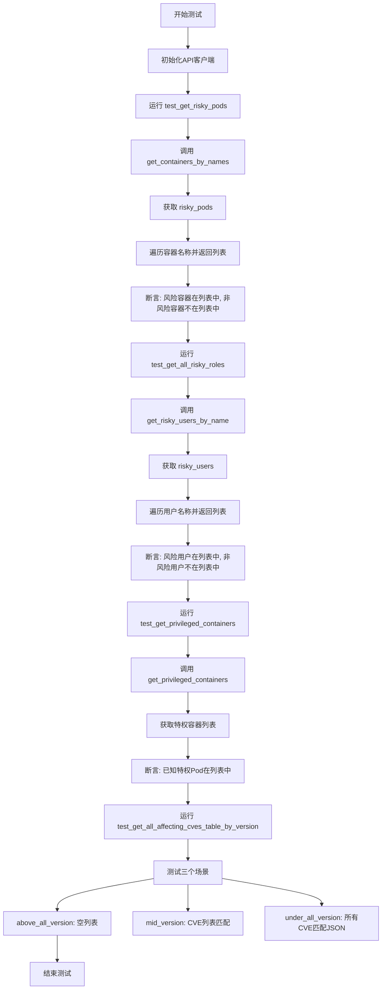
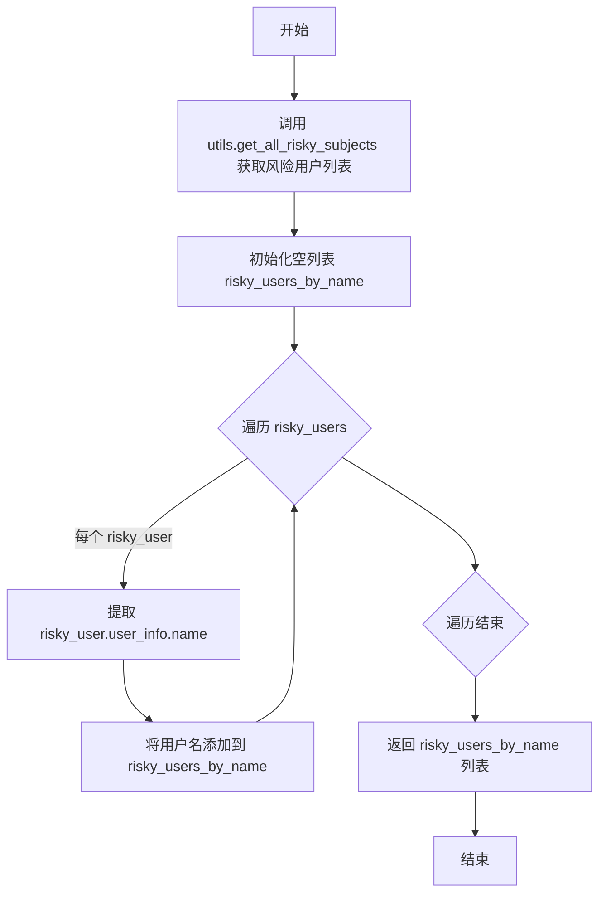
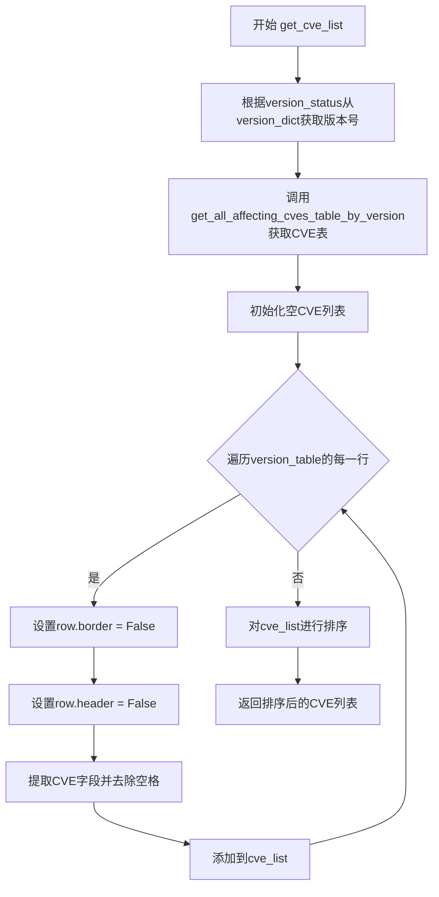
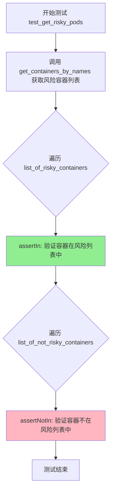
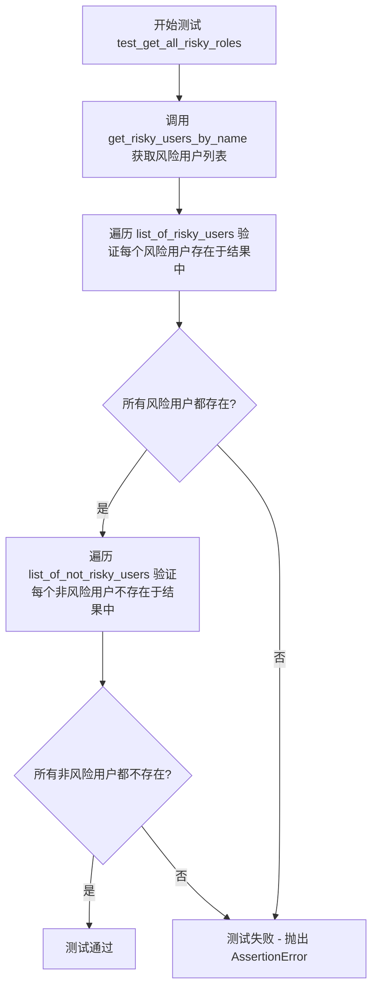
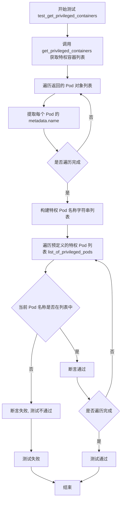
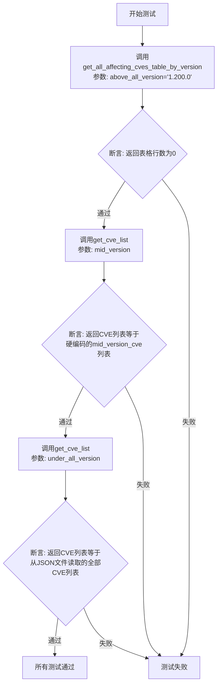

# `KubiScan\unit_test.py` 详细设计文档

这是一个用于测试KubiScan Kubernetes安全扫描工具的单元测试文件，测试内容包括风险容器识别、风险用户识别、特权容器检测以及CVE漏洞版本匹配等功能。

## 整体流程



## 类结构

```
unittest.TestCase
└── TestKubiScan (测试类)
```

## 全局变量及字段


### `list_of_risky_containers`
    
测试用风险容器名称列表

类型：`List[str]`
    


### `list_of_not_risky_containers`
    
测试用非风险容器名称列表

类型：`List[str]`
    


### `list_of_risky_users`
    
测试用风险用户列表

类型：`List[str]`
    


### `list_of_not_risky_users`
    
测试用非风险用户列表

类型：`List[str]`
    


### `list_of_privileged_pods`
    
测试用特权Pod名称列表

类型：`List[str]`
    


### `version_dict`
    
版本字典(包含mid_version/above_all_version/under_all_version)

类型：`Dict[str, str]`
    


### `mid_version_cve`
    
中间版本CVE硬编码列表

类型：`List[str]`
    


### `TestKubiScan.api_client`
    
API客户端实例

类型：`ApiClient`
    
    

## 全局函数及方法


### `get_containers_by_names`

该函数负责从系统识别出的所有“风险 Pod”中提取其内部运行的所有容器名称，并将其汇总成一个列表返回。

参数：
- (无)

返回值：`List[str]`，返回包含所有风险容器名称的列表。

#### 流程图

```mermaid
flowchart TD
    A([开始]) --> B[调用 utils.get_risky_pods 获取风险 Pod 列表]
    B --> C{risky_pods 是否为空?}
    C -- 是 (None) --> D[使用空列表 [] 防止空指针]
    D --> G[初始化空列表 risky_containers_by_name]
    C -- 否 --> G
    G --> E[遍历每个 risky_pod]
    E --> F[遍历 pod 中的每个 container]
    F --> H[将 container.name 添加到列表]
    H --> I{是否还有 container?}
    I -- 是 --> F
    I -- 否 --> J{是否还有 pod?}
    J -- 是 --> E
    J -- 否 --> K([返回列表 risky_containers_by_name])
```

#### 带注释源码

```python
def get_containers_by_names():
    """
    获取所有风险容器名称
    
    返回:
        List[str]: 包含所有被识别为风险的容器名称的列表
    """
    # 1. 调用工具函数获取所有被标记为 risky 的 Pod 对象列表
    #    返回值可能是 None，因此后续使用 or [] 进行保护
    risky_pods = utils.get_risky_pods()
    
    # 2. 初始化用于存储容器名称的列表
    risky_containers_by_name = []
    
    # 3. 遍历每一个风险 Pod
    #    这里使用 'or []' 是为了防止 get_risky_pods 返回 None 导致遍历报错
    for risky_pod in risky_pods or []:
        # 4. 遍历当前 Pod 下的所有容器
        for container in risky_pod.containers:
            # 5. 提取容器名称并追加到结果列表中
            risky_containers_by_name.append(container.name)
            
    # 6. 返回收集到的所有容器名称
    return risky_containers_by_name
```

#### 潜在的技术债务与优化空间

1.  **数据去重缺失**：该函数直接返回所有找到的容器名称。如果同一个容器名称出现在不同的 Namespace 或多次调度中（虽然较少见），列表中会包含重复值。根据具体业务需求，可能需要在返回前进行 `set()` 去重。
2.  **空值假设**：代码假设 `risky_pod.containers` 总是存在的且可遍历。如果 `risky_pod` 对象结构不完整或 `containers` 属性为 `None`，可能会抛出异常。可以在内层循环增加 `if risky_pod.containers:` 检查。
3.  **性能考量**：如果风险 Pod 数量非常庞大，该函数会阻塞主线程。考虑是否需要引入异步获取或分页机制。


### `get_risky_users_by_name`

获取所有风险用户的名称列表，通过遍历风险用户对象提取用户名信息。

参数： 无

返回值：`List[str]`，返回包含所有风险用户名称的字符串列表

#### 流程图



#### 带注释源码

```python
def get_risky_users_by_name():
    """
    获取所有风险用户的名称列表
    
    该函数通过调用工具模块获取所有风险主体（用户）对象，
    然后遍历提取每个用户的名称，最终返回名称列表。
    
    Returns:
        List[str]: 包含所有风险用户名称的列表
    """
    # 调用工具函数获取所有风险用户对象列表
    risky_users = utils.get_all_risky_subjects()
    
    # 初始化用于存储用户名称的空列表
    risky_users_by_name = []
    
    # 遍历每个风险用户对象，提取用户名
    for risky_user in risky_users:
        # 访问用户对象的user_info属性，提取name字段
        risky_users_by_name.append(risky_user.user_info.name)
    
    # 返回包含所有风险用户名称的列表
    return risky_users_by_name
```


### `get_cve_list`

根据指定的版本状态从版本字典中获取对应的版本，并调用`get_all_affecting_cves_table_by_version`函数获取该版本影响的所有CVE，然后提取CVE编号并进行排序返回。

参数：

- `version_status`：`str`，版本状态标识符，用于从`version_dict`中获取对应的Kubernetes版本号（如"mid_version"、"above_all_version"、"under_all_version"）

返回值：`list[str]`，返回排序后的CVE编号列表

#### 流程图



#### 带注释源码

```python
def get_cve_list(version_status):
    """
    根据版本状态获取CVE列表
    
    参数:
        version_status: str, 版本状态标识符，用于从version_dict中获取对应的版本号
                       可选值: "mid_version", "above_all_version", "under_all_version"
    
    返回:
        list[str]: 排序后的CVE编号列表
    """
    
    # 根据version_status从version_dict字典中获取对应的Kubernetes版本号
    # version_dict = {
    #     "mid_version": "1.19.14",
    #     "above_all_version": "1.200.0", 
    #     "under_all_version": "1.0.0"
    # }
    version_table = get_all_affecting_cves_table_by_version(version_dict[version_status])
    
    # 初始化空列表用于存储CVE编号
    cve_list = []
    
    # 遍历获取到的CVE表格的每一行
    for row in version_table:
        # 设置行的边框和表头为False，用于后续的字符串转换
        row.border = False
        row.header = False
        
        # 提取CVE字段的值，并去除首尾空格
        # row.get_string(fields=['CVE']) 返回类似 "CVE-2021-25741" 的字符串
        cve_list.append(row.get_string(fields=['CVE']).strip())
    
    # 对CVE列表进行排序并返回
    return sorted(cve_list)
```


### `get_all_cve_from_json`

该函数用于从本地JSON文件中读取CVE数据，提取并返回所有CVE编号的列表。

参数： 无

返回值：`List[str]`，返回从JSON文件中提取的所有CVE编号组成的列表

#### 流程图

```mermaid
flowchart TD
    A[开始] --> B[打开 CVE.json 文件]
    B --> C[读取 JSON 数据]
    C --> D[初始化空列表 all_cves]
    D --> E{遍历 data['CVES']}
    E -->|对于每个CVE| F[提取 CVENumber]
    F --> G[将 CVENumber 添加到列表]
    G --> E
    E -->|遍历完成| H[返回 all_cves 列表]
    H --> I[结束]
```

#### 带注释源码

```python
def get_all_cve_from_json():
    """
    从JSON文件获取所有CVE编号
    
    读取当前目录下的CVE.json文件，解析其中的CVES数组，
    提取每个CVE的CVENumber并返回列表
    
    返回:
        List[str]: 包含所有CVE编号的列表
    """
    # 打开CVE.json文件，使用上下文管理器确保文件正确关闭
    with open('CVE.json', 'r') as f:
        # 解析JSON文件内容为Python字典
        data = json.load(f)
    
    # 初始化用于存储所有CVE编号的列表
    all_cves = []
    
    # 遍历JSON数据中的CVES数组
    for cve in data["CVES"]:
        # 提取每个CVE对象的CVENumber字段
        all_cves.append(cve["CVENumber"])
    
    # 返回包含所有CVE编号的列表
    return all_cves
```


### TestKubiScan.test_get_risky_pods

这是一个单元测试方法，用于验证获取风险Pod容器的功能是否正确。测试通过比较实际获取的风险容器列表与预期的风险和非风险容器列表，确保`get_containers_by_names()`函数能正确识别风险容器。

参数：

- `self`：`unittest.TestCase`，表示测试类的实例本身，用于访问测试框架的断言方法

返回值：`None`，该方法为测试方法，通过assert语句进行验证，不返回任何值

#### 流程图



#### 带注释源码

```python
def test_get_risky_pods(self):
    """
    测试获取风险Pod容器的功能
    验证get_containers_by_names函数返回的容器列表中：
    1. 包含预定义的风险容器列表
    2. 不包含预定义的非风险容器列表
    """
    # 调用被测试的函数，获取所有风险容器的名称列表
    risky_containers_by_name = get_containers_by_names()
    
    # 遍历预定义的风险容器列表，验证每个容器都在返回的风险列表中
    # list_of_risky_containers = ["test1-yes", "test3-yes", "test5ac2-yes", "test6a-yes", "test6b-yes", "test7c2-yes", "test8c-yes"]
    for container in list_of_risky_containers:
        self.assertIn(container, risky_containers_by_name)
    
    # 遍历预定义的非风险容器列表，验证每个容器都不在返回的风险列表中
    # list_of_not_risky_containers = ["test5ac1-no", "test1-no", "test2b-no", "test7c1-no"]
    for container in list_of_not_risky_containers:
        self.assertNotIn(container, risky_containers_by_name)
```


### TestKubiScan.test_get_all_risky_roles

该方法用于测试获取所有风险用户角色的功能，验证 `get_risky_users_by_name()` 函数返回的风险用户列表是否正确包含预期的高风险用户（如 `kubiscan-sa`），并正确排除非风险用户（如 `kubiscan-sa2`、`default`）。

参数：无（除 `self` 外）

返回值：`None`，该方法为单元测试方法，通过 `unittest` 框架的断言机制验证功能，不返回具体值

#### 流程图



#### 带注释源码

```python
def test_get_all_risky_roles(self):
    """
    测试获取所有风险用户角色功能
    验证风险用户列表的准确性
    """
    # 调用 get_risky_users_by_name 函数获取当前系统中所有风险用户的名称列表
    risky_users_by_name = get_risky_users_by_name()
    
    # 遍历预定义的风险用户列表（list_of_risky_users），验证每个风险用户都存在于返回的列表中
    for user in list_of_risky_users:
        self.assertIn(user, risky_users_by_name)
    
    # 遍历预定义的非风险用户列表（list_of_not_risky_users），验证每个非风险用户都不存在于返回的列表中
    for user in list_of_not_risky_users:
        self.assertNotIn(user, risky_users_by_name)
```


### `TestKubiScan.test_get_privileged_containers`

该测试方法用于验证 `get_privileged_containers()` 函数能否正确获取并返回 Kubernetes 集群中的所有特权容器（Privileged Containers）。测试通过比对预定义的系统组件 Pod 列表（如 etcd、kube-apiserver 等）来确认函数返回结果的准确性。

参数：

- `self`：`unittest.TestCase`，代表测试类实例本身，用于访问断言方法

返回值：`None`，该方法无显式返回值，通过 `assertIn` 断言进行测试验证

#### 流程图



#### 带注释源码

```python
def test_get_privileged_containers(self):
    """
    测试获取特权容器的功能是否正确
    验证 get_privileged_containers() 函数能否返回所有预期的特权 Pod
    """
    # 调用被测试的函数，获取集群中所有的特权容器
    # 返回值是一个 Pod 对象列表，每个对象包含 metadata 等属性
    pods = get_privileged_containers()
    
    # 初始化一个空列表，用于存储特权 Pod 的名称字符串
    string_list_of_privileged_pods = []
    
    # 遍历所有返回的 Pod 对象
    for pod in pods:
        # 从每个 Pod 对象的 metadata 中提取 name 属性
        # 并添加到名称列表中
        string_list_of_privileged_pods.append(pod.metadata.name)
    
    # 遍历预定义的预期特权 Pod 列表
    # 这些是 Kubernetes 系统组件，通常以 privileged 模式运行
    for pod_name in list_of_privileged_pods:
        # 断言：每个预期的特权 Pod 名称都应该出现在
        # get_privileged_containers() 函数返回的结果中
        # list_of_privileged_pods 包含: etcd-minikube, kube-apiserver-minikube,
        # kube-controller-manager-minikube, kube-scheduler-minikube, storage-provisioner
        self.assertIn(pod_name, string_list_of_privileged_pods)
```


### `TestKubiScan.test_get_all_affecting_cves_table_by_version`

该测试方法用于验证 `get_all_affecting_cves_table_by_version` 函数在不同版本参数下的正确性，包括三个测试场景：验证高于所有版本时返回空表、验证中间版本返回特定CVE列表、验证低于所有版本时返回全部CVE列表。

参数：

-  `self`：`unittest.TestCase`，测试类实例本身，无需显式传递

返回值：`None`，测试方法不返回任何值，结果通过 unittest 断言验证

#### 流程图



#### 带注释源码

```python
def test_get_all_affecting_cves_table_by_version(self):
    """
    测试 get_all_affecting_cves_table_by_version 函数在不同版本下的行为
    
    测试场景：
    1. above_all_version (1.200.0): 应该返回空表，因为没有CVE影响此版本
    2. mid_version (1.19.14): 应该返回特定的CVE列表
    3. under_all_version (1.0.0): 应该返回所有CVE
    """
    
    # 场景1: 测试高于所有版本时返回空表
    # 调用 get_all_affecting_cves_table_by_version，传入最高版本号 1.200.0
    empty_table = get_all_affecting_cves_table_by_version(version_dict["above_all_version"])
    # 断言返回的表格行数为0，验证无CVE影响该版本
    self.assertTrue(len(empty_table._rows) == 0)

    # 场景2: 测试中间版本返回特定CVE列表
    # 获取 mid_version (1.19.14) 对应的CVE列表并排序
    mid_cve_list_sorted = get_cve_list("mid_version")
    # 获取硬编码的中间版本CVE预期列表并排序
    hard_coded_mid_version_cve_sorted = sorted(mid_version_cve)
    # 断言实际返回的CVE列表与预期列表相等
    self.assertListEqual(hard_coded_mid_version_cve_sorted, mid_cve_list_sorted)

    # 场景3: 测试低于所有版本时返回所有CVE
    # 获取 under_all_version (1.0.0) 对应的CVE列表并排序
    all_cve_list_sorted = get_cve_list("under_all_version")
    # 从JSON文件读取所有CVE并排序
    all_cve_from_json = sorted(get_all_cve_from_json())
    # 断言实际返回的CVE列表与JSON文件中的全部CVE相等
    self.assertListEqual(all_cve_list_sorted, all_cve_from_json)
```


## 关键组件


### CVE数据管理

从JSON文件或API获取CVE列表，支持按版本筛选受影响的CVE，包括get_cve_list和get_all_cve_from_json两个核心函数

### 风险容器识别

通过调用utils.get_risky_pods()获取存在风险的Pod，并从中提取容器名称，用于安全扫描和风险评估

### 风险用户识别

通过调用utils.get_all_risky_subjects()获取所有风险主体（包括用户），并提取用户名称进行风险用户识别

### 特权容器获取

调用engine.privleged_containers模块的get_privileged_containers()函数获取具有特权访问的容器列表

### 版本-CVE映射管理

通过version_dict和mid_version_cve维护版本与CVE的映射关系，支持按版本状态查询对应的CVE列表

### API客户端初始化

通过ApiClientFactory创建API客户端并进行初始化，配置api_client用于与后端服务通信


## 问题及建议


### 已知问题

-   **拼写错误**：模块名 `privleged_containers` 应为 `privileged_containers`，这会导致代码可读性问题和潜在的导入错误
-   **重复导入**：`set_api_client` 被重复导入（Line 4 和 Line 7），增加冗余且影响代码清晰度
-   **硬编码测试数据**：测试用的容器名、用户名、CVE列表等以硬编码形式直接写在代码中（Line 12-23），应分离到独立的测试数据文件或使用 fixture
-   **类级别副作用**：在 `TestKubiScan` 类中直接执行 `api_client = ApiClientFactory.get_client(...)`、`api_init()` 和 `set_api_client(api_client)`（Line 36-38），这些在类加载时就会执行，可能导致测试间状态污染
-   **缺少类型提示**：所有函数都缺少参数类型和返回类型注解，降低了代码的可维护性和 IDE 支持
-   **魔法字符串**：版本字典的键（`"mid_version"`, `"above_all_version"` 等）在 `get_cve_list` 函数中以字符串形式使用，容易产生拼写错误
-   **文件操作无异常处理**：`get_all_cve_from_json` 函数中的文件读取操作（Line 51）缺少 try-except 异常处理
-   **循环效率**：在 `get_containers_by_names` 和 `get_risky_users_by_name` 中使用 `append` 构建列表，可考虑使用列表推导式
-   **测试数据与实现耦合**：`mid_version_cve` 列表（Line 23）与 `get_all_affecting_cves_table_by_version` 返回结果耦合，当 CVE 数据库更新时测试可能失效

### 优化建议

-   修正拼写错误，统一模块导入命名规范
-   使用 pytest fixture 或 unittest setUp 方法来初始化 API 客户端，避免类级别的副作用执行
-   将测试数据抽取到独立的 JSON/YAML 配置文件或 conftest.py 中管理
-   为所有函数添加类型注解（Type Hints），提升代码可读性和静态分析能力
-   使用 Enum 或常量类定义版本状态键值，避免魔法字符串
-   为文件读取操作添加异常处理（FileNotFoundError, JSONDecodeError 等）
-   考虑使用列表推导式重构循环逻辑，提升代码简洁性和执行效率
-   使用 `@unittest.mock` 对外部依赖（如 API 调用、文件读取）进行 mock，提高测试的独立性和稳定性

## 其它


### 1. 一段话描述

该代码是 KubiScan 安全扫描工具的单元测试模块，通过测试用例验证系统对 Kubernetes 集群中危险容器、特权容器、风险用户以及已知安全漏洞（CVE）的识别能力，确保安全扫描功能的准确性和可靠性。

### 2. 文件的整体运行流程

文件作为 unittest 测试套件运行，主要流程包括：测试类初始化时创建 API 客户端并完成配置；依次执行四个测试方法分别验证风险容器获取、风险角色获取、特权容器获取和 CVE 表格查询功能；每个测试方法通过对比预期结果与实际扫描结果来判定测试是否通过。

### 3. 类的详细信息

### 类：TestKubiScan

**类字段：**
| 名称 | 类型 | 描述 |
|------|------|------|
| api_client | ApiClient | 类级别类变量，存储 API 客户端实例 |

**类方法：**

#### test_get_risky_pods

| 项目 | 详情 |
|------|------|
| 方法名称 | test_get_risky_pods |
| 参数 | 无 |
| 参数类型 | 无 |
| 参数描述 | 无参数 |
| 返回值类型 | None |
| 返回值描述 | 无返回值，通过 unittest 断言验证结果 |
| Mermaid 流程图 | ```mermaid\ngraph TD\n    A[开始测试] --> B[调用get_containers_by_names获取风险容器列表]\n    B --> C{遍历预期风险容器列表}\n    C -->|container in list_of_risky_containers| D[断言container在结果中]\n    C --> E{遍历预期非风险容器列表}\n    E -->|container in list_of_not_risky_containers| F[断言container不在结果中]\n    D --> G[测试通过]\n    F --> G\n``` |
| 带注释源码 | ```python\ndef test_get_risky_pods(self):\n    # 获取实际扫描到的风险容器名称列表\n    risky_containers_by_name = get_containers_by_names()\n    # 验证所有预期的风险容器都被正确识别\n    for container in list_of_risky_containers:\n        self.assertIn(container, risky_containers_by_name)\n    # 验证非风险容器未被误识别为风险容器\n    for container in list_of_not_risky_containers:\n        self.assertNotIn(container, risky_containers_by_name)\n``` |

#### test_get_all_risky_roles

| 项目 | 详情 |
|------|------|
| 方法名称 | test_get_all_risky_roles |
| 参数 | 无 |
| 参数类型 | 无 |
| 参数描述 | 无参数 |
| 返回值类型 | None |
| 返回值描述 | 无返回值，通过 unittest 断言验证结果 |
| Mermaid 流程图 | ```mermaid\ngraph TD\n    A[开始测试] --> B[调用get_risky_users_by_name获取风险用户列表]\n    B --> C{遍历预期风险用户列表}\n    C -->|user in list_of_risky_users| D[断言user在结果中]\n    C --> E{遍历预期非风险用户列表}\n    E -->|user in list_of_not_risky_users| F[断言user不在结果中]\n    D --> G[测试通过]\n    F --> G\n``` |
| 带注释源码 | ```python\ndef test_get_all_risky_roles(self):\n    # 获取实际扫描到的风险用户名称列表\n    risky_users_by_name = get_risky_users_by_name()\n    # 验证所有预期的风险用户都被正确识别\n    for user in list_of_risky_users:\n        self.assertIn(user, risky_users_by_name)\n    # 验证非风险用户未被误识别为风险用户\n    for user in list_of_not_risky_users:\n        self.assertNotIn(user, risky_users_by_name)\n``` |

#### test_get_privileged_containers

| 项目 | 详情 |
|------|------|
| 方法名称 | test_get_privileged_containers |
| 参数 | 无 |
| 参数类型 | 无 |
| 参数描述 | 无参数 |
| 返回值类型 | None |
| 返回值描述 | 无返回值，通过 unittest 断言验证结果 |
| Mermaid 流程图 | ```mermaid\ngraph TD\n    A[开始测试] --> B[调用get_privileged_containers获取特权容器列表]\n    B --> C[遍历Pod对象提取名称到字符串列表]\n    C --> D{遍历预期特权Pod列表}\n    D -->|pod_name in list_of_privileged_pods| E[断言pod_name在结果列表中]\n    E --> F[测试通过]\n``` |
| 带注释源码 | ```python\ndef test_get_privileged_containers(self):\n    # 获取实际扫描到的特权容器列表\n    pods = get_privileged_containers()\n    # 将 Pod 对象转换为名称字符串列表\n    string_list_of_privileged_pods = []\n    for pod in pods:\n        string_list_of_privileged_pods.append(pod.metadata.name)\n    # 验证所有预期的特权容器都被正确识别\n    for pod_name in list_of_privileged_pods:\n        self.assertIn(pod_name, string_list_of_privileged_pods)\n``` |

#### test_get_all_affecting_cves_table_by_version

| 项目 | 详情 |
|------|------|
| 方法名称 | test_get_all_affecting_cves_table_by_version |
| 参数 | 无 |
| 参数类型 | 无 |
| 参数描述 | 无参数 |
| 返回值类型 | None |
| 返回值描述 | 无返回值，通过 unittest 断言验证结果 |
| Mermaid 流程图 | ```mermaid\ngraph TD\n    A[开始测试] --> B[测试版本above_all_version应返回空列表]\n    B --> C[调用get_cve_list获取mid_version的CVE列表]\n    C --> D[与硬编码的mid_version_cve比较]\n    D --> E[调用get_cve_list获取under_all_version的CVE列表]\n    E --> F[从JSON文件加载所有CVE比较]\n    F --> G[测试通过]\n``` |
| 带注释源码 | ```python\ndef test_get_all_affecting_cves_table_by_version(self):\n    # 测试最高版本以上应返回空结果（无匹配CVE）\n    empty_table = get_all_affecting_cves_table_by_version(version_dict["above_all_version"])\n    self.assertTrue(len(empty_table._rows) == 0)\n    \n    # 测试中间版本返回特定CVE列表\n    mid_cve_list_sorted = get_cve_list("mid_version")\n    hard_coded_mid_version_cve_sorted = sorted(mid_version_cve)\n    self.assertListEqual(hard_coded_mid_version_cve_sorted, mid_cve_list_sorted)\n    \n    # 测试最低版本以下应返回所有CVE（从JSON文件读取）\n    all_cve_list_sorted = get_cve_list("under_all_version")\n    all_cve_from_json = sorted(get_all_cve_from_json())\n    self.assertListEqual(all_cve_list_sorted, all_cve_from_json)\n``` |

### 4. 全局变量详细信息

| 名称 | 类型 | 描述 |
|------|------|------|
| list_of_risky_containers | List[str] | 预期被识别为风险的容器名称列表，用于测试验证 |
| list_of_not_risky_containers | List[str] | 预期不被识别为风险的容器名称列表，用于测试验证 |
| list_of_risky_users | List[str] | 预期被识别为风险的用户名称列表，用于测试验证 |
| list_of_not_risky_users | List[str] | 预期不被识别为风险的用户名称列表，用于测试验证 |
| list_of_privileged_pods | List[str] | 预期具有特权访问的 Pod 名称列表，用于测试验证 |
| version_dict | Dict[str, str] | 版本号字典，包含中间版本、最高版本和最低版本的版本字符串 |
| mid_version_cve | List[str] | 中间版本对应的已知 CVE 编号硬编码列表 |

### 5. 全局函数详细信息

#### get_containers_by_names

| 项目 | 详情 |
|------|------|
| 函数名称 | get_containers_by_names |
| 参数 | 无 |
| 参数类型 | 无 |
| 参数描述 | 无参数 |
| 返回值类型 | List[str] |
| 返回值描述 | 返回所有风险容器名称的列表 |
| Mermaid 流程图 | ```mermaid\ngraph TD\n    A[开始] --> B[调用utils.get_risky_pods获取风险Pod对象列表]\n    B --> C{遍历risk_pods}\n    C --> D[遍历每个Pod的containers]\n    D --> E[提取container.name添加到列表]\n    E --> F[返回容器名称列表]\n``` |
| 带注释源码 | ```python\ndef get_containers_by_names():\n    # 获取所有被识别为风险的 Pod 对象列表\n    risky_pods = utils.get_risky_pods()\n    risky_containers_by_name = []\n    # 遍历每个风险 Pod，提取其所有容器的名称\n    for risky_pod in risky_pods or []:\n        for container in risky_pod.containers:\n            risky_containers_by_name.append(container.name)\n    return risky_containers_by_name\n``` |

#### get_risky_users_by_name

| 项目 | 详情 |
|------|------|
| 函数名称 | get_risky_users_by_name |
| 参数 | 无 |
| 参数类型 | 无 |
| 参数描述 | 无参数 |
| 返回值类型 | List[str] |
| 返回值描述 | 返回所有风险用户名称的列表 |
| Mermaid 流程图 | ```mermaid\ngraph TD\n    A[开始] --> B[调用utils.get_all_risky_subjects获取风险主体对象列表]\n    B --> C{遍历risk_users}\n    C --> D[提取user.user_info.name添加到列表]\n    D --> E[返回用户名称列表]\n``` |
| 带注释源码 | ```python\ndef get_risky_users_by_name():\n    # 获取所有被识别为风险的主体（用户/服务账户）对象列表\n    risky_users = utils.get_all_risky_subjects()\n    risky_users_by_name = []\n    # 遍历每个风险主体，提取其用户名\n    for risky_user in risky_users:\n        risky_users_by_name.append(risky_user.user_info.name)\n    return risky_users_by_name\n``` |

#### get_cve_list

| 项目 | 详情 |
|------|------|
| 函数名称 | get_cve_list |
| 参数名称 | version_status |
| 参数类型 | str |
| 参数描述 | 版本状态键，用于从 version_dict 中获取具体版本号 |
| 返回值类型 | List[str] |
| 返回值描述 | 返回指定版本对应的 CVE 编号排序列表 |
| Mermaid 流程图 | ```mermaid\ngraph TD\n    A[开始] --> B[根据version_status从version_dict获取版本号]\n    B --> C[调用get_all_affecting_cves_table_by_version获取CVE表格]\n    C --> D{遍历表格每行}\n    D --> E[提取CVE字段并去除空白]\n    E --> F[添加到CVE列表]\n    F --> G[返回排序后的CVE列表]\n``` |
| 带注释源码 | ```python\ndef get_cve_list(version_status):\n    # 根据版本状态获取对应的 CVE 表格\n    version_table = get_all_affecting_cves_table_by_version(version_dict[version_status])\n    cve_list = []\n    # 遍历表格每一行，提取 CVE 编号并清理格式\n    for row in version_table:\n        row.border = False\n        row.header = False\n        cve_list.append(row.get_string(fields=['CVE']).strip())\n    return sorted(cve_list)\n``` |

#### get_all_cve_from_json

| 项目 | 详情 |
|------|------|
| 函数名称 | get_all_cve_from_json |
| 参数 | 无 |
| 参数类型 | 无 |
| 参数描述 | 无参数 |
| 返回值类型 | List[str] |
| 返回值描述 | 返回 CVE.json 文件中所有 CVE 编号的列表 |
| Mermaid 流程图 | ```mermaid\ngraph TD\n    A[开始] --> B[打开CVE.json文件]\n    B --> C[解析JSON数据]\n    C --> D{遍历CVES数组}\n    D --> E[提取CVENumber字段]\n    E --> F[添加到列表]\n    F --> G[返回CVE编号列表]\n``` |
| 带注释源码 | ```python\ndef get_all_cve_from_json():\n    # 打开并读取本地 CVE.json 文件\n    with open('CVE.json', 'r') as f:\n        data = json.load(f)\n    all_cves = []\n    # 遍历 JSON 中的 CVE 数组，提取每个 CVE 编号\n    for cve in data["CVES"]:\n        all_cves.append(cve["CVENumber"])\n    return all_cves\n``` |

### 6. 关键组件信息

| 名称 | 一句话描述 |
|------|------|
| unittest | Python 标准库单元测试框架，用于组织和管理测试用例 |
| ApiClientFactory | 工厂类，用于创建不同类型的 API 客户端实例 |
| api_init | API 初始化函数，用于建立与 Kubernetes API 的连接 |
| set_api_client | 配置函数，将创建的 API 客户端设置到全局配置中 |
| utils.get_risky_pods | 工具函数，扫描并返回集群中所有具有风险配置的 Pod |
| utils.get_all_risky_subjects | 工具函数，扫描并返回集群中所有具有风险权限的用户和组 |
| get_privileged_containers | 容器扫描函数，返回集群中所有以特权模式运行的容器 |
| get_all_affecting_cves_table_by_version | CVE 查询函数，根据 Kubernetes 版本返回受影响的已知漏洞列表 |

### 7. 潜在的技术债务或优化空间

1. **硬编码数据问题**：测试用例中的预期结果（list_of_risky_containers、list_of_not_risky_containers 等）采用硬编码方式，当集群配置变化时需要手动更新，建议改为从配置文件或测试数据文件加载

2. **魔法字符串/值**：version_dict 中的版本号和 mid_version_cve 中的 CVE 列表硬编码在代码中，应迁移至独立的测试数据配置文件

3. **重复导入**：代码中重复导入了 api_client 和 set_api_client，应清理冗余导入语句

4. **文件路径依赖**：get_all_cve_from_json 函数依赖于本地文件 'CVE.json'，未做文件存在性检查和异常处理

5. **私有函数暴露**：get_containers_by_names 和 get_risky_users_by_name 作为模块级全局函数，可能与项目其他测试共享时产生命名冲突

6. **测试隔离性不足**：测试类使用类级别的 api_client 变量，可能导致测试之间状态污染

7. **错误信息不明确**：断言失败时提供的上下文信息不足，难以快速定位问题

### 8. 设计目标与约束

**设计目标**：通过单元测试验证 KubiScan 工具对 Kubernetes 集群安全风险（风险容器、风险用户、特权容器、CVE 漏洞）的识别准确性，确保扫描功能在不同 Kubernetes 版本场景下能正确返回预期结果。

**约束条件**：
- 测试依赖真实的 Kubernetes 集群环境（通过 API 客户端连接）
- 测试数据依赖于特定版本的 Kubernetes 集群配置（minikube 环境）
- CVE 数据依赖于本地 CVE.json 文件的数据完整性

### 9. 错误处理与异常设计

**异常处理机制**：
- get_all_cve_from_json 函数未对文件不存在或 JSON 解析错误进行捕获，可能导致测试意外终止
- utils.get_risky_pods() 调用时使用 `risky_pods or []` 进行空值处理，但未处理其他可能的异常情况
- API 客户端调用未显式处理网络异常和认证失败场景

**改进建议**：
- 为文件读取操作添加 try-except 异常处理
- 为 API 调用添加超时处理和重试机制
- 在测试用例中添加明确的错误类型断言

### 10. 数据流与状态机

**数据流转路径**：

```
测试执行流程：
1. unittest框架加载TestKubiScan类
2. 类初始化时执行api_client创建和API初始化
3. 依次执行四个测试方法：
   - test_get_risky_pods: utils.get_risky_pods() → 提取容器名 → 断言验证
   - test_get_all_risky_roles: utils.get_all_risky_subjects() → 提取用户名 → 断言验证
   - test_get_privileged_containers: get_privileged_containers() → 提取Pod名 → 断言验证
   - test_get_all_affecting_cves_table_by_version: 版本查询 → CVE表获取 → JSON数据比对 → 断言验证
4. 测试结果汇总输出
```

**状态转换**：
- API 客户端：未初始化 → 已初始化（测试前）
- 测试结果：待执行 → 通过/失败（测试后）

### 11. 外部依赖与接口契约

**外部依赖**：
| 依赖模块 | 依赖说明 | 版本要求 |
|------|------|------|
| unittest | Python 标准库单元测试框架 | Python 3.x |
| engine.utils | KubiScan 工具的核心扫描工具模块 | 需与主项目保持一致 |
| engine.privleged_containers | 特权容器扫描模块 | 需与主项目保持一致 |
| api.api_client | Kubernetes API 客户端封装 | 需与 Kubernetes 版本兼容 |
| api.config | API 配置管理模块 | 需与主项目保持一致 |
| api.client_factory | API 客户端工厂类 | 需与主项目保持一致 |
| CVE.json | 本地 CVE 数据文件 | 需包含完整的 CVE 数据 |

**接口契约**：
- utils.get_risky_pods() 应返回包含 containers 属性的 Pod 对象列表
- utils.get_all_risky_subjects() 应返回包含 user_info 属性的主体对象列表
- get_privileged_containers() 应返回包含 metadata.name 属性的 Pod 对象列表
- get_all_affecting_cves_table_by_version() 应返回表格对象，支持 get_string(fields=[]) 方法调用

### 12. 测试覆盖范围分析

**已覆盖场景**：
- 风险容器识别功能验证
- 风险用户识别功能验证
- 特权容器识别功能验证
- CVE 查询功能按版本过滤验证

**未覆盖场景**：
- API 连接失败时的错误处理
- 空集群环境（无 Pod/用户）的边界情况
- CVE.json 文件缺失或损坏的处理
- 大量 Pod/用户时的性能表现

### 13. 命名规范问题

代码中存在以下命名不一致问题：
- privleged_containers 模块名应为 privileged_containers（拼写错误：privleged → privileged）
- 建议统一使用美式拼写规范

    