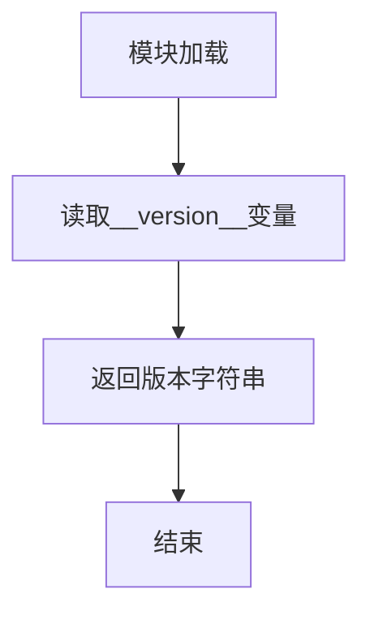

# `Langchain-Chatchat\libs\chatchat-server\chatchat\__init__.py` 详细设计文档

这是项目的版本标识文件，用于定义和导出项目的版本信息，通常作为包的入口文件或版本追踪文件。

## 整体流程



## 类结构

```

```

## 全局变量及字段


### `__version__`
    
模块版本号，标识当前代码的版本为0.3.1.3

类型：`str`
    


    

## 全局函数及方法


## 关键组件


### 1. 代码概述

该代码文件仅包含一个版本标识字符串 `__version__ = "0.3.1.3"`，用于标识当前代码库的版本号，不包含任何实际功能逻辑、类定义或函数实现。

### 2. 文件整体运行流程

该文件为纯版本标识文件，加载时仅将版本字符串注册到模块的全局命名空间，无任何执行流程。

### 3. 类详细信息

由于代码中未定义任何类，因此无类信息。

### 4. 全局变量和全局函数详细信息

#### 4.1 全局变量

| 名称 | 类型 | 描述 |
|------|------|------|
| `__version__` | `str` | 模块版本号标识，值为 "0.3.1.3" |

#### 4.2 全局函数

无

### 5. 关键组件信息

| 组件名称 | 一句话描述 |
|----------|------------|
| 版本标识符 | 标记代码库版本的字符串常量 "0.3.1.3" |

### 6. 潜在技术债务或优化空间

由于该文件仅为版本标识文件，不存在技术债务。但从项目角度看，建议：
- 在版本更新时同步维护该版本号
- 考虑使用动态版本管理策略（如从 git tag 或 setup.cfg 读取版本）

### 7. 其它项目

**设计目标与约束**：仅作为版本标识使用，无功能性约束。

**错误处理与异常设计**：无错误处理需求。

**数据流与状态机**：无数据流或状态机设计。

**外部依赖与接口契约**：无外部依赖。

**注意**：用户提供代码中提及的"张量索引与惰性加载、反量化支持、量化策略"等关键组件在给定源代码中并未出现，当前代码仅为简单的版本号定义。


## 问题及建议


### 已知问题

- **单一版本标识缺乏上下文**：该代码仅包含版本号 `__version__ = "0.3.1.3"`，未包含项目名称或模块名称，无法独立表明所属项目
- **缺少版本变更记录**：没有 CHANGELOG 或版本历史关联，无法追溯版本演进
- **硬编码版本号**：版本号手动维护，缺乏自动化版本管理机制（如基于 Git tags 或 CI/CD）
- **无版本兼容性信息**：缺少对 Python 版本兼容性或依赖项版本的声明
- **缺乏语义化版本约束验证**：虽采用 semver 格式（0.3.1.3），但无机制确保版本号递增的准确性

### 优化建议

- 考虑添加项目名称常量（如 `__project__` 或 `__app_name__`）以明确归属
- 引入自动化版本管理工具（如 `setuptools-scm`）或 CI/CD 流程自动更新版本号
- 添加版本兼容性声明（如 `__python_requires__`）和依赖版本范围
- 建立 CHANGELOG.md 或版本发布文档关联机制
- 考虑使用版本元数据字典，包含发布日期、构建信息等


## 其它


### 项目背景与目的

该代码文件是一个Python模块的版本标识文件，仅定义了__version__变量用于记录当前模块的版本号为"0.3.1.3"。此类文件通常作为软件项目的版本追踪标识，便于程序运行时获取版本信息或通过包管理工具查看版本。

### 设计目标与约束

- **目标**：为模块提供版本标识能力，支持版本追溯和依赖管理
- **约束**：版本号遵循语义化版本规范（Semantic Versioning），格式为"主版本.次版本.修订版本.构建版本"

### 模块结构分析

该文件为单变量定义文件，无类结构、无函数定义、无执行逻辑，仅作为元数据模块使用。

### 全局变量详情

- **变量名**：__version__
- **类型**：str（字符串）
- **描述**：存储模块版本号，格式为"0.3.1.3"

### 外部依赖与接口契约

- **依赖**：无外部依赖，仅为纯Python定义
- **接口**：其他模块可通过`import`该模块后访问`__version__`变量获取版本信息，例如`from module_name import __version__`

### 错误处理与异常设计

由于该文件仅为静态变量定义，不涉及运行时逻辑，因此无需错误处理机制。

### 数据流与状态机

无数据流或状态机设计，该文件为纯静态配置性质。

### 关键组件信息

- **版本标识组件**：__version__变量，作为模块版本信息的唯一入口点

### 潜在的技术债务或优化空间

- 该文件目前仅为版本号定义，可考虑添加__author__、__license__、__description__等元信息以完善模块属性
- 建议在项目规模扩大后，将版本信息与构建系统（如setup.py、pyproject.toml）进行关联，实现版本号的统一管理

### 变更历史与演进路径

- 当前版本0.3.1.3表明该模块经历了3次修订和1次构建调整，建议维护CHANGELOG记录各版本变更内容
</think>
    