# `Langchain-Chatchat\libs\chatchat-server\chatchat\cli.py` 详细设计文档

这是chatchat项目的命令行入口工具，提供项目初始化(init)、服务启动(start)和知识库管理(kb)等命令，支持配置LLM模型、Embedding模型及知识库重建等功能。

## 整体流程

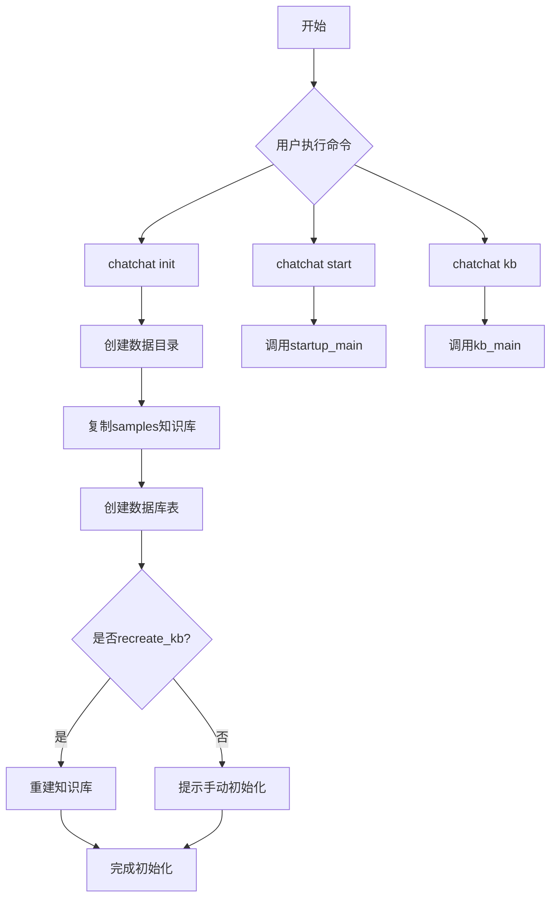

## 类结构

```
无自定义类（使用第三方类和Settings配置类）
Settings (配置类 - 外部导入)
├── basic_settings
├── model_settings
└── kb_settings
```

## 全局变量及字段


### `logger`
    
build_logger构建的日志对象，用于记录项目运行日志

类型：`logging.Logger`
    


### `xf_endpoint`
    
Xinference API服务端点参数，用于指定模型推理服务地址

类型：`str`
    


### `llm_model`
    
默认LLM模型参数，用于指定大语言模型名称

类型：`str`
    


### `embed_model`
    
默认Embedding模型参数，用于指定文本向量 embedding 模型名称

类型：`str`
    


### `recreate_kb`
    
是否重建知识库标志，指示是否重新创建向量知识库

类型：`bool`
    


### `kb_names`
    
知识库名称列表，以逗号分隔的待初始化知识库名称

类型：`List[str]`
    


### `bs`
    
basic_settings配置对象，包含项目基础配置信息如路径和根目录

类型：`BasicSettings`
    


    

## 全局函数及方法


### `main`（命令行组入口函数）

这是 chatchat 项目的命令行工具入口函数，使用 Click 框架构建。它作为主命令组，聚合了项目初始化（init）、服务启动（start）和知识库管理（kb）三个核心功能，为用户提供统一的 CLI 操作界面。

#### 参数

该函数为 Click 命令组，无显式参数（参数由 Click 自动通过上下文管理）。

#### 返回值

`click.Group`，返回 Click 命令组对象，用于注册子命令。

#### 流程图

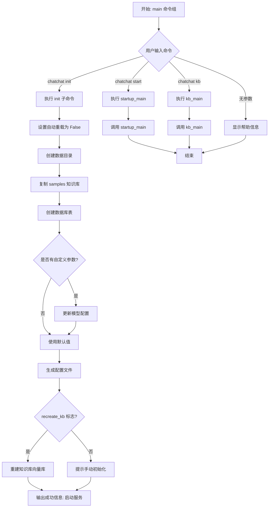

#### 带注释源码

```python
import click                          # 导入 Click 框架用于构建 CLI
from pathlib import Path              # 导入 Path 处理文件路径
import shutil                         # 导入 shutil 处理目录操作
import typing as t                    # 导入类型提示

# 导入项目内部模块
from chatchat.startup import main as startup_main      # 启动服务主函数
from chatchat.init_database import (                   # 知识库初始化模块
    main as kb_main,           # 知识库命令行入口
    create_tables,             # 创建数据库表函数
    folder2db                  # 文件夹转数据库函数
)
from chatchat.settings import Settings                 # 设置管理类
from chatchat.utils import build_logger                 # 日志构建器
from chatchat.server.utils import get_default_embedding  # 获取默认嵌入模型


logger = build_logger()  # 初始化日志记录器


# ============================================================
# 主命令组定义 - 使用 Click 框架的 @click.group 装饰器
# ============================================================
@click.group(help="chatchat 命令行工具")
def main():
    """
    主命令组入口函数
    
    该函数不执行任何实际操作，仅作为子命令的容器。
    实际的命令处理由注册的子命令完成。
    """
    ...


# ============================================================
# init 子命令 - 负责项目初始化
# ============================================================
@main.command("init", help="项目初始化")
@click.option("-x", "--xinference-endpoint", "xf_endpoint",
              help="指定Xinference API 服务地址。默认为 http://127.0.0.1:9997/v1")
@click.option("-l", "--llm-model",
              help="指定默认 LLM 模型。默认为 glm4-chat")
@click.option("-e", "--embed-model",
              help="指定默认 Embedding 模型。默认为 bge-large-zh-v1.5")
@click.option("-r", "--recreate-kb",
              is_flag=True,
              show_default=True,
              default=False,
              help="同时重建知识库（必须确保指定的 embed model 可用）。")
@click.option("-k", "--kb-names", "kb_names",
              show_default=True,
              default="samples",
              help="要重建知识库的名称。可以指定多个知识库名称，以 , 分隔。")
def init(
    xf_endpoint: str = "",        # Xinference API 端点
    llm_model: str = "",          # 默认 LLM 模型名称
    embed_model: str = "",        # 默认 Embedding 模型名称
    recreate_kb: bool = False,    # 是否重建知识库标志
    kb_names: str = "",           # 知识库名称列表（逗号分隔）
):
    """
    项目初始化命令
    
    执行完整的项目初始化流程，包括：
    1. 创建数据目录结构
    2. 复制示例知识库文件
    3. 初始化知识库数据库
    4. 生成配置文件
    5. （可选）重建知识库向量库
    
    Args:
        xf_endpoint: Xinference API 服务地址
        llm_model: 默认语言模型名称
        embed_model: 默认嵌入模型名称
        recreate_kb: 是否重建知识库
        kb_names: 要重建的知识库名称列表
    """
    # 步骤 1: 禁用自动重载，提高初始化性能
    Settings.set_auto_reload(False)
    bs = Settings.basic_settings
    
    # 步骤 2: 解析知识库名称列表
    kb_names = [x.strip() for x in kb_names.split(",")]
    
    # 步骤 3: 创建数据目录
    logger.success(f"开始初始化项目数据目录：{Settings.CHATCHAT_ROOT}")
    Settings.basic_settings.make_dirs()
    logger.success("创建所有数据目录：成功。")
    
    # 步骤 4: 复制示例知识库文件（如果路径不同）
    if(bs.PACKAGE_ROOT / "data/knowledge_base/samples" != Path(bs.KB_ROOT_PATH) / "samples"):
        shutil.copytree(
            bs.PACKAGE_ROOT / "data/knowledge_base/samples", 
            Path(bs.KB_ROOT_PATH) / "samples", 
            dirs_exist_ok=True
        )
    logger.success("复制 samples 知识库文件：成功。")
    
    # 步骤 5: 创建数据库表
    create_tables()
    logger.success("初始化知识库数据库：成功。")
    
    # 步骤 6: 应用自定义模型配置（如果提供）
    if xf_endpoint:
        Settings.model_settings.MODEL_PLATFORMS[0].api_base_url = xf_endpoint
    if llm_model:
        Settings.model_settings.DEFAULT_LLM_MODEL = llm_model
    if embed_model:
        Settings.model_settings.DEFAULT_EMBEDDING_MODEL = embed_model
    
    # 步骤 7: 生成配置模板并启用自动重载
    Settings.createl_all_templates()
    Settings.set_auto_reload(True)
    
    logger.success("生成默认配置文件：成功。")
    logger.success("请先检查确认 model_settings.yaml 里模型平台、LLM模型和Embed模型信息已经正确")
    
    # 步骤 8: 可选 - 重建知识库向量库
    if recreate_kb:
        folder2db(kb_names=kb_names,
                  mode="recreate_vs",
                  vs_type=Settings.kb_settings.DEFAULT_VS_TYPE,
                  embed_model=get_default_embedding())
        logger.success("<green>所有初始化已完成，执行 chatchat start -a 启动服务。</green>")
    else:
        logger.success("执行 chatchat kb -r 初始化知识库，然后 chatchat start -a 启动服务。")


# ============================================================
# 注册子命令 - 将其他模块的命令添加到主命令组
# ============================================================
main.add_command(startup_main, "start")  # 注册启动服务命令
main.add_command(kb_main, "kb")           # 注册知识库管理命令


# ============================================================
# 程序入口点
# ============================================================
if __name__ == "__main__":
    main()  # 执行主命令组
```


### `init`

项目初始化命令处理函数，用于初始化项目的配置目录、知识库模板和可选的知识库文件。

参数：

- `xf_endpoint`：`str`，Xinference API 服务地址，默认为空字符串（使用 `http://127.0.0.1:9997/v1`）
- `llm_model`：`str`，默认 LLM 模型名称，默认为空字符串（使用 `glm4-chat`）
- `embed_model`：`str`，默认 Embedding 模型名称，默认为空字符串（使用 `bge-large-zh-v1.5`）
- `recreate_kb`：`bool`，是否同时重建知识库，默认为 `False`
- `kb_names`：`str`，要重建的知识库名称列表，以逗号分隔，默认为 `"samples"`

返回值：`None`，该函数通过 Click 框架直接输出结果，不返回任何值

#### 流程图

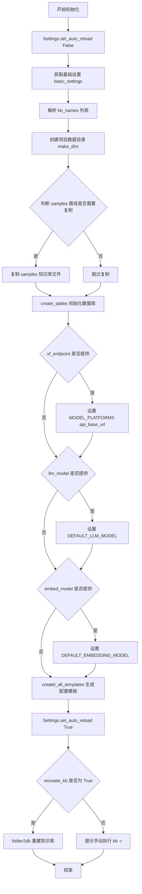

#### 带注释源码

```python
@main.command("init", help="项目初始化")
@click.option("-x", "--xinference-endpoint", "xf_endpoint",
              help="指定Xinference API 服务地址。默认为 http://127.0.0.1:9997/v1")
@click.option("-l", "--llm-model",
              help="指定默认 LLM 模型。默认为 glm4-chat")
@click.option("-e", "--embed-model",
              help="指定默认 Embedding 模型。默认为 bge-large-zh-v1.5")
@click.option("-r", "--recreate-kb",
              is_flag=True,
              show_default=True,
              default=False,
              help="同时重建知识库（必须确保指定的 embed model 可用）。")
@click.option("-k", "--kb-names", "kb_names",
              show_default=True,
              default="samples",
              help="要重建知识库的名称。可以指定多个知识库名称，以 , 分隔。")
def init(
    xf_endpoint: str = "",
    llm_model: str = "",
    embed_model: str = "",
    recreate_kb: bool = False,
    kb_names: str = "",
):
    """
    项目初始化命令处理函数
    
    参数:
        xf_endpoint: Xinference API 服务地址
        llm_model: 默认 LLM 模型名称
        embed_model: 默认 Embedding 模型名称
        recreate_kb: 是否重建知识库
        kb_names: 知识库名称列表（逗号分隔）
    """
    # 禁用配置自动重载，确保初始化过程配置稳定
    Settings.set_auto_reload(False)
    bs = Settings.basic_settings
    
    # 解析知识库名称列表，去除空格
    kb_names = [x.strip() for x in kb_names.split(",")]
    
    # 记录开始初始化日志
    logger.success(f"开始初始化项目数据目录：{Settings.CHATCHAT_ROOT}")
    
    # 创建所有必要的数据目录
    Settings.basic_settings.make_dirs()
    logger.success("创建所有数据目录：成功。")
    
    # 判断 samples 路径是否与默认知识库路径一致，不一致则复制
    if(bs.PACKAGE_ROOT / "data/knowledge_base/samples" != Path(bs.KB_ROOT_PATH) / "samples"):
        shutil.copytree(
            bs.PACKAGE_ROOT / "data/knowledge_base/samples", 
            Path(bs.KB_ROOT_PATH) / "samples", 
            dirs_exist_ok=True
        )
    logger.success("复制 samples 知识库文件：成功。")
    
    # 初始化知识库数据库表结构
    create_tables()
    logger.success("初始化知识库数据库：成功。")
    
    # 根据命令行参数覆盖默认模型配置
    if xf_endpoint:
        Settings.model_settings.MODEL_PLATFORMS[0].api_base_url = xf_endpoint
    if llm_model:
        Settings.model_settings.DEFAULT_LLM_MODEL = llm_model
    if embed_model:
        Settings.model_settings.DEFAULT_EMBEDDING_MODEL = embed_model
    
    # 生成所有配置模板文件
    Settings.createl_all_templates()
    
    # 恢复配置自动重载
    Settings.set_auto_reload(True)
    
    logger.success("生成默认配置文件：成功。")
    logger.success("请先检查确认 model_settings.yaml 里模型平台、LLM模型和Embed模型信息已经正确")
    
    # 根据 recreate_kb 标志决定是否重建知识库
    if recreate_kb:
        # 使用 folder2db 函数重建向量知识库
        folder2db(
            kb_names=kb_names,
            mode="recreate_vs",
            vs_type=Settings.kb_settings.DEFAULT_VS_TYPE,
            embed_model=get_default_embedding()
        )
        logger.success("<green>所有初始化已完成，执行 chatchat start -a 启动服务。</green>")
    else:
        # 提示用户手动初始化知识库
        logger.success("执行 chatchat kb -r 初始化知识库，然后 chatchat start -a 启动服务。")
```


### `startup_main`

该函数是 chatchat 项目的服务启动入口，通过命令行方式启动 ChatChat 服务。它封装了服务初始化、模型加载、知识库加载等核心启动逻辑，作为 Click 子命令被注册到主 CLI 中，命令名为 "start"。

参数：

- 由于 `startup_main` 是从外部模块 `chatchat.startup` 导入的，其具体参数定义需要查看源代码。根据代码中的使用方式推测，它可能接受以下参数：
- `host`：`str`，服务监听地址（可选）
- `port`：`int`，服务监听端口（可选）
- `api_keys`：`str` 或 `List[str]`，API 密钥认证（可选）
- `embed_model`：`str`，指定 Embedding 模型（可选）
- `llm_model`：`str`，指定 LLM 模型（可选）

返回值：`int` 或 `None`，返回 0 表示正常退出，非 0 表示异常退出

#### 流程图

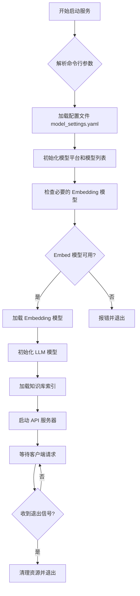

#### 带注释源码

```python
# 注意：startup_main 函数的实际源码在 chatchat.startup 模块中
# 以下是基于代码使用方式的推测实现

# 从 chatchat.startup 导入主启动函数
from chatchat.startup import main as startup_main

# 在 CLI 中注册 startup_main 为 'start' 子命令
main.add_command(startup_main, "start")

# 使用示例（在命令行中）：
# chatchat start                    # 使用默认配置启动
# chatchat start -h 0.0.0.1 -p 7860  # 指定主机和端口
# chatchat start --api-keys xxx     # 指定 API 密钥
```

---

**注意**：由于 `startup_main` 是从外部模块 `chatchat.startup` 导入的，上述参数和流程是基于代码使用方式的推测。要获取准确的参数定义和实现细节，需要查看 `chatchat/startup.py` 源文件。


### `kb_main`

`kb_main` 是从 `chatchat.init_database` 模块导入的主函数，在本文件中作为 `kb` 子命令注册到 CLI 中，用于处理知识库相关的操作（如创建、重建、查看知识库等）。

参数：

- 该函数的具体参数定义在 `chatchat.init_database` 模块的 `main` 函数中，从当前代码文件中无法直接获取其完整参数列表。

返回值：

- 返回值为 Click 命令的退出状态（通常是 `None` 或整数），具体返回值类型取决于 `chatchat.init_database.main` 的实现。

#### 流程图

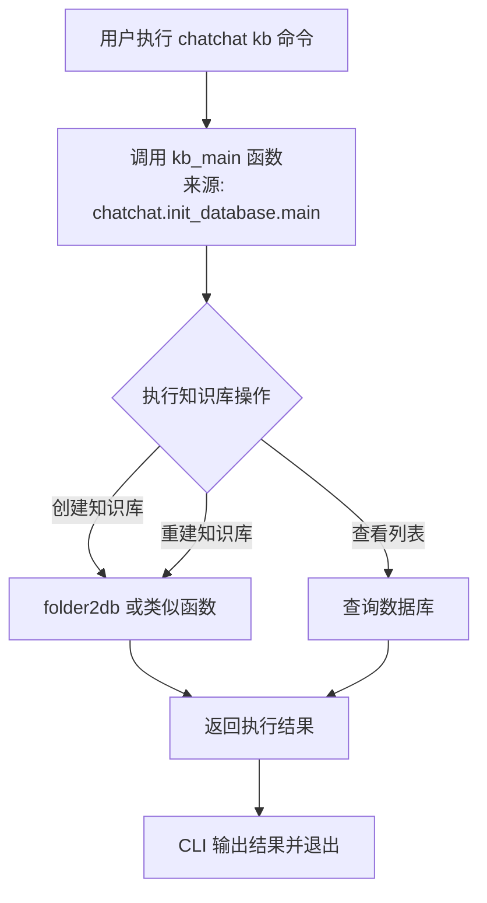

#### 带注释源码

```python
# 从 chatchat.init_database 模块导入 main 函数，并重命名为 kb_main
# kb_main 是知识库管理的主入口函数
from chatchat.init_database import main as kb_main, create_tables, folder2db

# ... (其他导入和代码) ...

# 将 kb_main 注册为 main CLI 的 'kb' 子命令
# 用户可以通过 'chatchat kb' 调用知识库管理功能
main.add_command(kb_main, "kb")

# 注意：kb_main 函数的具体实现位于 chatchat.init_database 模块中
# 当前代码文件仅展示了其导入和注册方式
```

---

**说明**：该代码文件并未定义 `kb_main` 函数本身，而是从 `chatchat.init_database` 模块导入并将其注册为 CLI 子命令。`kb_main` 的具体参数、返回值和实现逻辑需要查看 `chatchat/init_database.py` 模块的源码。


### `create_tables`

该函数是用于初始化知识库数据库表的核心函数，由外部模块 `chatchat.init_database` 导入，在项目初始化过程中被调用以创建所需的数据库表结构。

参数： 无

返回值：`None`，该函数直接操作数据库，不返回任何值

#### 流程图

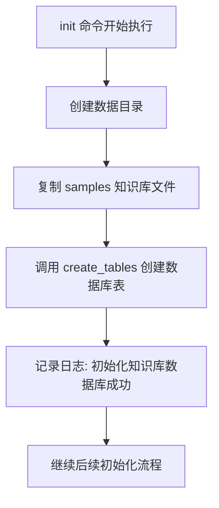

#### 带注释源码

```python
# 该函数由外部模块导入，源码位于 chatchat.init_database 模块
# 在 init 命令中调用如下：
create_tables()  # 创建知识库所需的数据库表结构
logger.success("初始化知识库数据库：成功。")  # 成功后记录日志
```


### `folder2db`

该函数是文件夹转知识库的核心功能函数，用于将指定的知识库文件夹内容解析并导入到向量数据库中，支持创建新知识库或重建已有知识库。

参数：

- `kb_names`：`list[str]`，要导入的知识库名称列表
- `mode`：`str`，操作模式，如 "recreate_vs" 表示重建向量库
- `vs_type`：`str`，向量存储类型，来自配置中的 DEFAULT_VS_TYPE
- `embed_model`：`t.Any`，嵌入模型实例，用于将文本向量化

返回值：`None`，该函数直接操作数据库，无返回值

#### 流程图

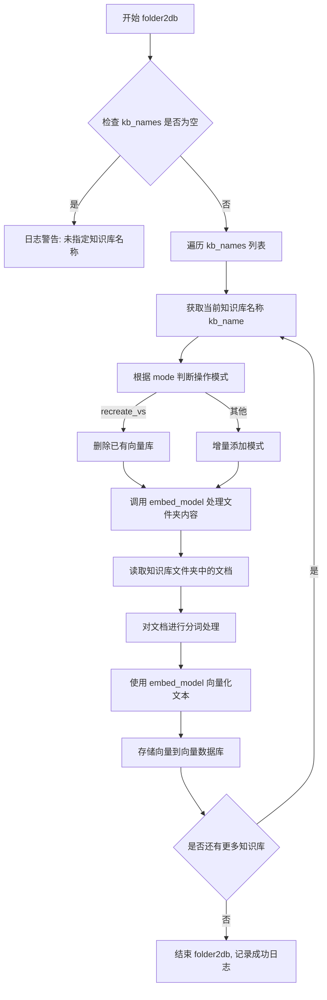

#### 带注释源码

```python
# 从 chatchat.init_database 导入 folder2db 函数
from chatchat.init_database import main as kb_main, create_tables, folder2db

# 在 init 命令中调用 folder2db
if recreate_kb:
    folder2db(kb_names=kb_names,
              mode="recreate_vs",  # 重建向量库模式
              vs_type=Settings.kb_settings.DEFAULT_VS_TYPE,  # 默认向量存储类型
              embed_model=get_default_embedding())  # 获取默认嵌入模型
    logger.success("<green>所有初始化已完成，执行 chatchat start -a 启动服务。</green>")
```

> **注意**：由于 `folder2db` 函数定义在 `chatchat.init_database` 模块中，该模块代码未在当前代码片段中提供。以上信息基于函数调用点的参数推断得出。实际函数实现可能包含更多细节，如文档解析、向量存储配置、进度回调等功能。


### `get_default_embedding`

获取默认embedding模型函数，用于从配置中获取当前设置的默认embedding模型实例。

参数：
- 无参数

返回值：`t.Any` 或 `t.Optional[t.Any]`，返回默认embedding模型实例，可能为None

#### 流程图

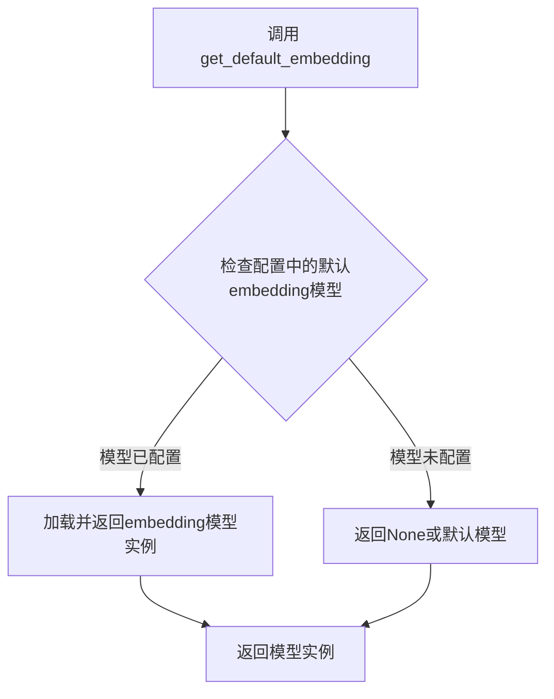

#### 带注释源码

```
# 该函数为外部导入函数，具体实现位于 chatchat.server.utils 模块
# 此处仅展示在当前代码中的调用方式
from chatchat.server.utils import get_default_embedding

# 在 init 命令中调用，获取默认embedding模型
if recreate_kb:
    folder2db(kb_names=kb_names,
              mode="recreate_vs",
              vs_type=Settings.kb_settings.DEFAULT_VS_TYPE,
              embed_model=get_default_embedding())  # 调用获取默认embedding模型实例
    logger.success("<green>所有初始化已完成，执行 chatchat start -a 启动服务。</green>")
```

---

### 补充信息

1. **函数来源**：该函数是从 `chatchat.server.utils` 模块导入的外部函数，并非在本项目中定义
2. **调用场景**：在 `init` 命令的 `recreate_kb` 分支中使用，用于在重建知识库时获取embedding模型实例
3. **设计意图**：通过该函数获取当前系统配置的默认embedding模型，供向量化和知识库重建使用
4. **潜在技术债务**：由于该函数是外部依赖，建议在文档中注明其接口契约，包括返回值类型、可能的异常等


### Settings.set_auto_reload

设置自动重载配置，用于控制系统配置文件的热重载功能。

参数：

-  `auto_reload`：`bool`，设置是否启用自动重载功能。`True` 启用自动重载，`False` 禁用自动重载

返回值：`None`，该方法无返回值

#### 流程图

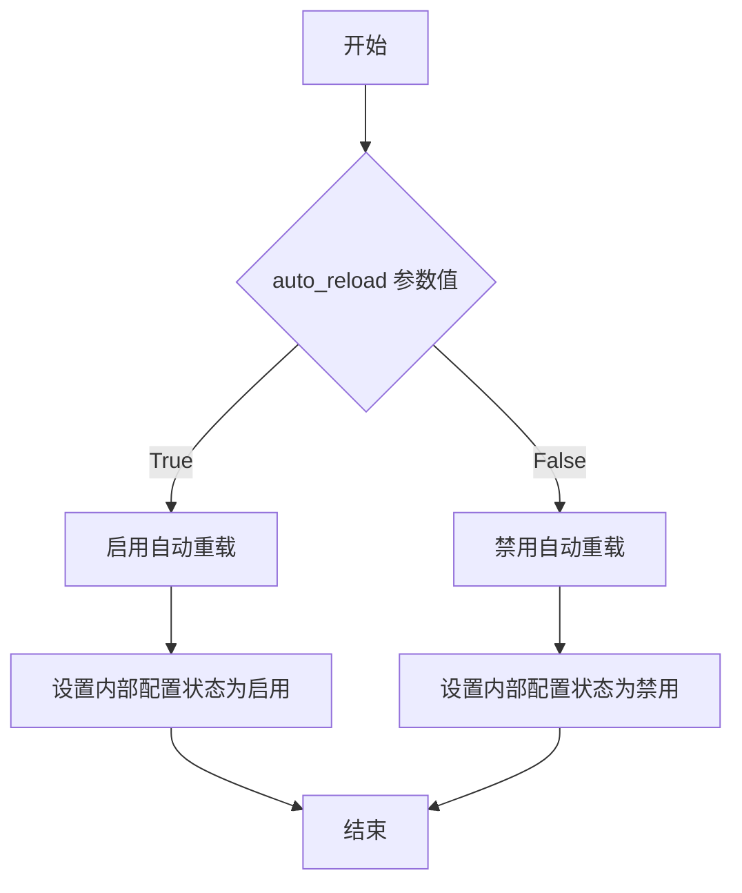

#### 带注释源码

```python
# 从 chatchat.settings 模块导入 Settings 类
from chatchat.settings import Settings

# 在 init 命令中调用 set_auto_reload 方法
# 第一次调用：初始化开始时禁用自动重载，避免初始化过程中配置被意外重载
Settings.set_auto_reload(False)

# ... 初始化配置操作 ...

# 第二次调用：初始化完成后启用自动重载，使配置可以在运行时动态更新
Settings.set_auto_reload(True)
```

#### 说明

该方法定义在 `chatchat.settings.Settings` 类中（源码未在当前文件中展示）。根据调用场景分析：

1. **调用时机**：在项目初始化命令中被调用两次
2. **第一次调用** (`False`)：在初始化开始时禁用自动重载，防止初始化过程中配置文件被意外重载导致操作失败
3. **第二次调用** (`True`)：在初始化完成后启用自动重载，使系统运行时可以监听配置文件变化并自动重新加载

该方法的设计体现了配置管理的灵活性和安全性，确保关键初始化操作不会被配置变更打断。


### Settings.basic_settings.make_dirs

该方法用于在项目初始化时创建所有必要的数据目录，确保项目运行所需的文件夹结构完整。

参数：无

返回值：无（`None`），该方法主要执行目录创建操作，不返回任何值。

#### 流程图

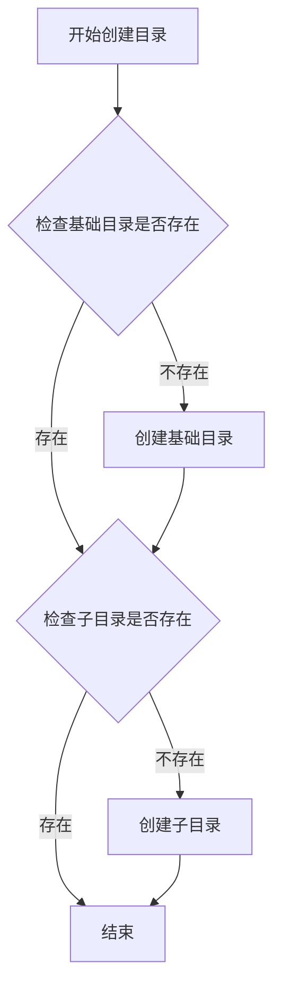

#### 带注释源码

```
# 由于提供的代码文件中未直接包含 make_dirs 方法的定义
# 以下为基于调用上下文推断的实现逻辑

# 调用位置（在 init 命令中）：
Settings.basic_settings.make_dirs()

# 推断的 make_dirs 方法实现逻辑：
def make_dirs(self):
    """
    创建项目所需的所有数据目录
    
    根据 Settings 中的配置，创建以下目录：
    - CHATCHAT_ROOT: 项目根目录
    - KB_ROOT_PATH: 知识库根目录
    - DATA_ROOT_PATH: 数据根目录
    - LOG_ROOT_PATH: 日志目录
    - CACHE_ROOT_PATH: 缓存目录
    等其他必要的子目录
    """
    # 创建基础目录结构
    # 确保每个目录都存在，如果不存在则创建
    # 使用 Path.mkdir(parents=True, exist_ok=True) 创建目录
```

> **注意**：由于 `make_dirs` 方法的具体实现源代码未在提供的代码文件中给出，以上源码为基于调用上下文和功能描述的合理推断。实际的实现可能包含更多的目录创建逻辑和错误处理。


### Settings.createl_all_templates

该方法用于生成项目的所有默认配置文件模板，包括模型配置、提示词模板等必要的配置文件的初始化。

参数：此方法无显式参数（隐式使用 Settings 类的实例属性）

返回值：`None`，该方法直接修改配置文件，不返回任何值。

#### 流程图

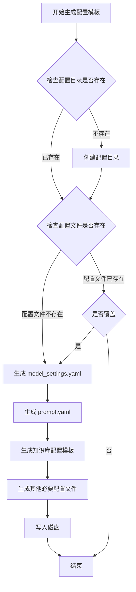

#### 带注释源码

```python
# 该方法定义在 chatchat/settings.py 中
# 以下为推测的实现逻辑，基于方法名和调用上下文

def createl_all_templates(self) -> None:
    """
    生成所有默认配置文件模板
    
    该方法负责创建项目运行所需的各类配置文件：
    1. model_settings.yaml - 模型平台和模型参数配置
    2. prompt.yaml - 提示词模板配置
    3. knowledge_base_settings.yaml - 知识库配置
    4. 其他运行时必要配置文件
    """
    # 1. 获取基础设置
    basic_settings = self.basic_settings
    
    # 2. 确定配置模板目录
    # 通常位于项目根目录或配置目录下
    
    # 3. 遍历预定义的配置模板
    # 根据当前配置生成对应的 YAML 配置文件
    
    # 4. 写入配置文件到磁盘
    # 使用 YAML 格式保存配置
    
    # 5. 设置文件权限
    # 确保配置文件可读写
```

> **注意**：由于提供的代码片段中仅包含 `Settings.createl_all_templates()` 的调用位置，未包含该方法的具体实现代码。以上源码为基于方法名和上下文的合理推测。实际实现请查阅 `chatchat/settings.py` 文件中的完整定义。


### Settings.model_settings.MODEL_PLATFORMS

模型平台配置项，存储系统中可用的模型平台列表。每个平台配置包含 API 地址、模型类型等关键信息。在初始化命令中用于动态修改默认 Xinference 平台的 API 地址。

参数：无（此为属性，非方法）

返回值：`list`，返回模型平台配置列表，每个元素包含平台名称、API地址、模型类型等配置信息。

#### 流程图

```mermaid
graph TD
    A[Settings.model_settings] -->|访问| B[MODEL_PLATFORMS]
    B -->|索引 [0]| C[平台配置对象]
    C -->|设置属性| D[api_base_url]
    
    style A fill:#f9f,color:#333
    style B fill:#bfb,color:#333
    style C fill:#bbf,color:#333
    style D fill:#fbb,color:#333
```

#### 带注释源码

```python
# Settings 是从 chatchat.settings 导入的设置类
# model_settings 是 Settings 的属性，包含模型相关的配置
# MODEL_PLATFORMS 是 model_settings 的属性，存储平台列表

# 在 init 命令中，通过以下方式修改平台配置：
if xf_endpoint:
    # 获取第一个平台配置，并设置其 api_base_url 属性
    Settings.model_settings.MODEL_PLATFORMS[0].api_base_url = xf_endpoint

# MODEL_PLATFORMS 的结构推测：
# [
#     {
#         "platform_name": "xinference",
#         "api_base_url": "http://127.0.0.1:9997/v1",
#         "model_types": ["chat", "embedding"]
#     },
#     ...
# ]
```


### `Settings.kb_settings.DEFAULT_VS_TYPE`

该属性用于获取知识库的默认向量存储类型配置值，定义在 `Settings` 类的 `kb_settings` 子配置对象中，在初始化知识库时作为参数传递给 `folder2db` 函数以指定创建向量存储的类型。

参数：
- 该属性为类属性，无函数参数

返回值：`str`，返回默认的向量存储类型字符串（如 "faiss"、"milvus" 等）

#### 流程图

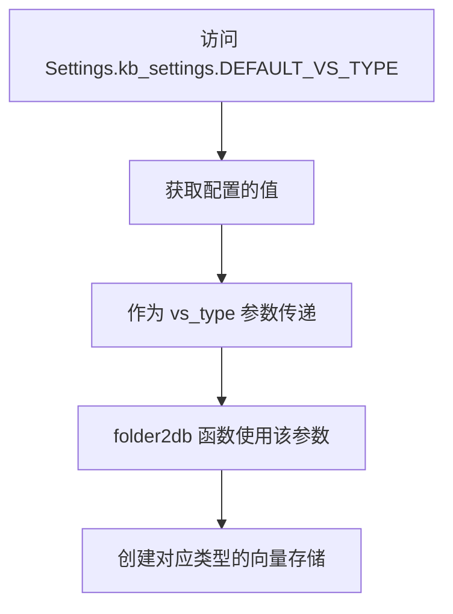

#### 带注释源码

```python
# 在 init 命令中使用该属性的上下文
if recreate_kb:
    folder2db(kb_names=kb_names,
              mode="recreate_vs",
              # DEFAULT_VS_TYPE 是 kb_settings 的属性，表示默认向量存储类型
              vs_type=Settings.kb_settings.DEFAULT_VS_TYPE,
              embed_model=get_default_embedding())
    logger.success("<green>所有初始化已完成，执行 chatchat start -a 启动服务。</green>")
```

> **注**：由于 `Settings` 类的完整定义未在当前代码文件中展示，`DEFAULT_VS_TYPE` 的具体类型定义需要查看 `chatchat/settings.py` 中的 `kb_settings` 类或配置结构。根据代码上下文推断，该值为字符串类型，用于指定知识库向量化存储的后端类型。


### `main.add_command`

将子命令添加到主 CLI 命令组，使得可以通过 `chatchat start` 和 `chatchat kb` 调用对应的功能模块。

参数：

- `cmd`: `Callable`，要添加的命令函数或命令对象（此处为 `startup_main` 或 `kb_main`）
- `name`: `str`，命令的名称，用于在命令行中调用（"start" 或 "kb"）

返回值：`None`，该方法直接修改命令组，不返回任何值

#### 流程图

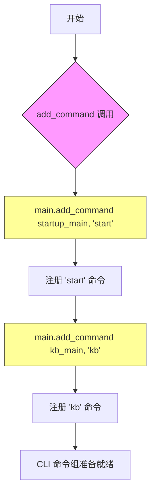

#### 带注释源码

```python
# 向 main 命令组添加 'start' 子命令
# cmd 参数是来自 chatchat.startup 模块的 main 函数
# name 参数定义了命令行调用的名称 'start'
# 执行后可通过 'chatchat start' 启动服务
main.add_command(startup_main, "start")

# 向 main 命令组添加 'kb' 子命令
# cmd 参数是来自 chatchat.init_database 模块的 main 函数
# name 参数定义了命令行调用的名称 'kb'
# 执行后可通过 'chatchat kb' 管理知识库
main.add_command(kb_main, "kb")
```

#### 附加说明

| 项目 | 说明 |
|------|------|
| **所属类** | `click.core.Group` |
| **调用对象** | `main` - 通过 `@click.group()` 装饰器创建的 CLI 命令组 |
| **框架依赖** | Click 框架内置方法 |
| **设计意图** | 解耦子命令模块，使代码结构更清晰，便于独立维护启动和知识库功能 |
| **潜在优化** | 考虑使用 Click 的 `command()` 装饰器直接注册子命令，提高可读性 |

## 关键组件


### CLI 入口 (`main`)

该模块是 chatchat 项目的命令行工具入口，使用 Click 框架构建，提供 `init`、`start`、`kb` 三个子命令来管理项目的初始化、服务启动和知识库操作。

### 初始化命令 (`init`)

该命令负责项目的初始化工作，包括创建数据目录、复制样本知识库文件、初始化数据库、生成默认配置文件，并根据需要重建知识库索引。

### 配置管理模块 (`Settings`)

该模块负责管理项目的所有配置项，包括模型配置、知识库配置、基础设置等，并提供配置的自动重载功能。

### 知识库初始化模块 (`kb_main`, `create_tables`, `folder2db`)

该模块负责知识库的初始化和重建工作，包括数据库表创建、文档向量化、向量存储构建等功能。

### 日志模块 (`build_logger`)

该模块提供统一的日志记录功能，支持彩色输出和不同级别的日志信息。

### 默认嵌入模型获取 (`get_default_embedding`)

该模块用于获取默认的嵌入模型实例，支持后续知识库的向量化处理。

### 启动服务模块 (`startup_main`)

该模块负责启动 chatchat 服务，可能包含 API 服务器初始化、模型加载等核心功能。

### 模型平台配置 (`MODEL_PLATFORMS`)

该配置项管理不同的 LLM 模型平台，包括 API 地址、认证信息等，支持灵活切换不同的模型服务提供商。


## 问题及建议


### 已知问题

-   **硬编码配置值**：默认模型名称（`glm4-chat`、`bge-large-zh-v1.5`）和 API 地址（`http://127.0.0.1:9997/v1`）直接硬编码在代码中，缺乏灵活性
-   **错误处理缺失**：关键操作（`shutil.copytree`、`create_tables`、`folder2db`）没有异常捕获，若初始化中途失败会导致不一致状态
-   **输入验证不足**：未验证 `kb_names` 格式、`xf_endpoint` URL 有效性、`llm_model` 和 `embed_model` 是否可用
-   **函数职责过多**：`init` 函数同时处理目录创建、配置写入、知识库重建等多项职责，违反单一职责原则
-   **路径比较逻辑复杂**：条件判断 `if(bs.PACKAGE_ROOT / "data/knowledge_base/samples" != Path(bs.KB_ROOT_PATH) / "samples")` 缺乏注释，难以理解意图
-   **魔法字符串**：`"samples"` 知识库名称在多处重复出现，应提取为常量
-   **缺少回滚机制**：初始化失败时无法自动回滚已执行的操作
-   **潜在的空字符串问题**：`kb_names.split(",")` 当 `kb_names` 为空字符串时会产生空列表，但后续 `folder2db` 可能未处理此边界情况

### 优化建议

-   将默认配置值提取到配置文件中或使用 `Settings` 的默认值定义，避免硬编码
-   为关键操作添加 `try-except` 块，实现事务性初始化或至少记录失败原因
-   添加输入参数校验函数，验证 URL 格式、模型名称有效性、知识库名称格式等
-   重构 `init` 函数，将不同职责拆分为独立函数（如 `create_directories()`、`copy_samples()`、`setup_config()`、`init_knowledge_base()`）
-   定义常量类或枚举来管理知识库名称、模型类型等魔法字符串
-   实现初始化失败时的回滚机制，或提供 `--force` 选项强制重新初始化
-   简化路径比较逻辑，可考虑使用 `os.path.samefile` 或提取为独立的路径校验函数并添加文档注释

## 其它


### 设计目标与约束

本CLI工具的设计目标是为chatchat项目提供一键初始化能力，降低用户部署门槛。核心约束包括：1) 必须确保Xinference服务可用才能正确配置LLM模型；2) Embedding模型必须与知识库向量存储类型匹配；3) 初始化过程需要写入文件系统权限；4) 数据库初始化为阻塞操作，不支持异步；5) 仅支持Linux/macOS文件系统（使用pathlib.Path）。

### 错误处理与异常设计

代码采用分层错误处理策略：1) Settings.basic_settings.make_dirs()调用可能抛出OSError（权限不足或磁盘空间不足）；2) shutil.copytree()可能抛出FileExistsError（目标目录非空且dirs_exist_ok=False）或PermissionError；3) create_tables()若数据库文件损坏可能抛出SQLAlchemy异常；4) folder2db()执行失败时仅记录日志但不会中断初始化流程；5) get_default_embedding()返回None时会导致向量库重建失败。当前缺乏try-except包装，重大操作失败会导致程序直接退出。

### 数据流与状态机

初始化流程为线性状态机：IDLE → CREATE_DIRS → COPY_SAMPLES → INIT_DB → UPDATE_CONFIG → (OPTIONAL) REBUILD_KB → DONE。关键数据流向：1) 用户输入参数(xf_endpoint/llm_model/embed_model)写入Settings.model_settings；2) PACKAGE_ROOT下的samples目录复制到KB_ROOT_PATH；3) 配置对象通过Settings.createl_all_templates()序列化为YAML文件；4) 向量库重建时从磁盘文件读取文本，经Embedding模型转换为向量，存入向量数据库。

### 外部依赖与接口契约

本模块依赖以下外部组件：1) Xinference API（默认http://127.0.0.1:9997/v1）提供LLM推理能力，调用其/v1/models和/v1/chat/completions接口；2) SQLAlchemy数据库（SQLite）存储知识库元数据；3) Embedding模型服务（通过get_default_embedding()获取）将文本向量化；4) 文件系统存储配置、向量库和日志。接口契约：xf_endpoint必须为完整URL（含/v1后缀），llm_model和embed_model必须与模型注册表中的名称完全匹配，kb_names必须为逗号分隔的字符串。

### 配置管理

配置采用YAML文件+Python对象双重管理：1) Settings类维护basic_settings（基础配置）、model_settings（模型配置）和kb_settings（知识库配置）三个子配置对象；2) 通过set_auto_reload(False)禁用热重载确保初始化期间配置稳定；3) createl_all_templates()将内存中的配置对象序列化到CHATCHAT_ROOT/configs/目录；4) 配置优先级：命令行参数 > 已有配置文件 > 默认值。当前设计缺陷：配置写入后未验证文件内容正确性，且缺乏配置回滚机制。

### 安全性考虑

当前代码存在以下安全风险：1) kb_names参数直接拼接进folder2db()调用，未做输入校验，可能导致路径遍历；2) recreate_kb标志允许覆盖已有向量库，缺乏二次确认；3) 日志中可能记录敏感信息（如API端点地址）；4) 配置文件包含模型API密钥时为明文存储。建议增加：输入参数白名单校验、敏感信息脱敏、配置文件加密、破坏性操作确认提示。

### 性能考虑

初始化流程主要性能瓶颈：1) shutil.copytree()复制大量小文件时IO密集，建议改为增量同步或使用rsync；2) folder2db()的embedding计算为CPU密集型操作，当前串行处理，大规模知识库应考虑批量处理和并行化；3) create_tables()首次调用需创建数据库文件，SSD性能显著优于HDD。建议优化点：添加--parallel选项支持多线程embedding、压缩samples目录减少IO次数、提供--skip-samples选项跳过非必要文件复制。

### 测试策略建议

建议补充以下测试用例：1) 单元测试：Settings配置序列化/反序列化、kb_names字符串解析、路径拼接逻辑；2) 集成测试：完整初始化流程（需mock Xinference和数据库）、多次初始化幂等性验证；3) 边界测试：磁盘空间不足权限拒绝、目标目录已存在、网络超时处理；4) 回归测试：不同参数组合(init --recreate-kb -k "kb1,kb2")的输出一致性。建议使用pytest框架，配合pytest-mock模拟外部依赖。

### 部署与运维

本CLI工具作为chatchat项目的入口点，建议配合以下部署实践：1) 容器化部署时需挂载CHATCHAT_ROOT卷以持久化配置和知识库；2) 首次部署建议使用init --recreate-kb自动构建示例知识库；3) 生产环境应设置CHATCHAT_ROOT为非系统目录（如/home/user/chatchat）；4) 升级前建议备份KB_ROOT_PATH和configs目录；5) 可通过环境变量CHATCHAT_ROOT指定非默认安装路径。日志默认写入STDOUT，建议配置日志收集系统（如ELK）集中管理。


    