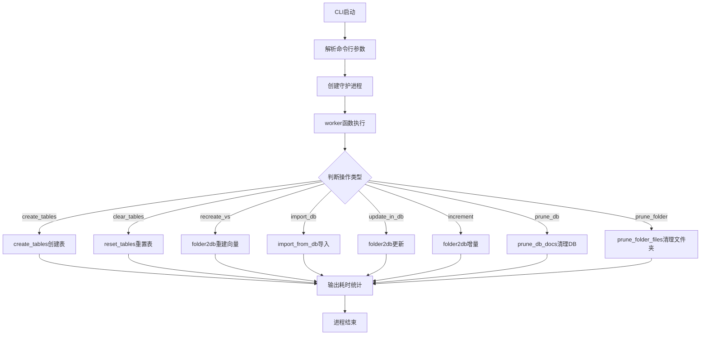
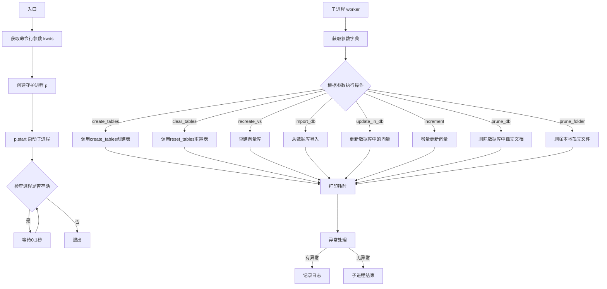
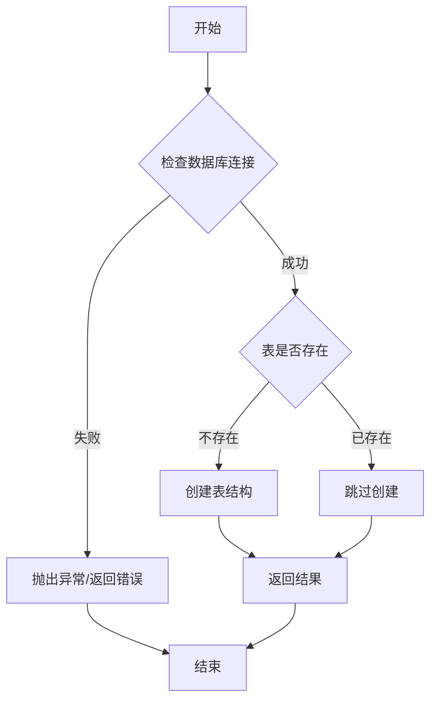
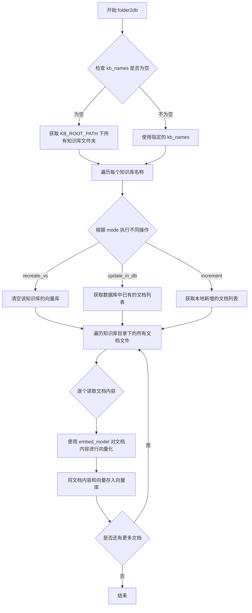
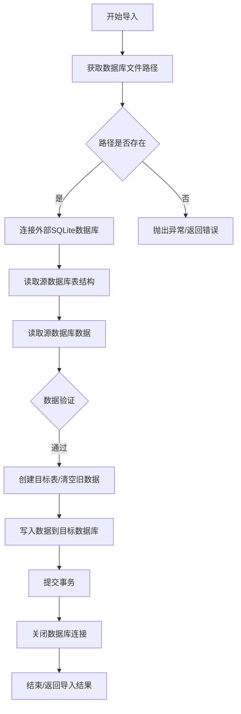
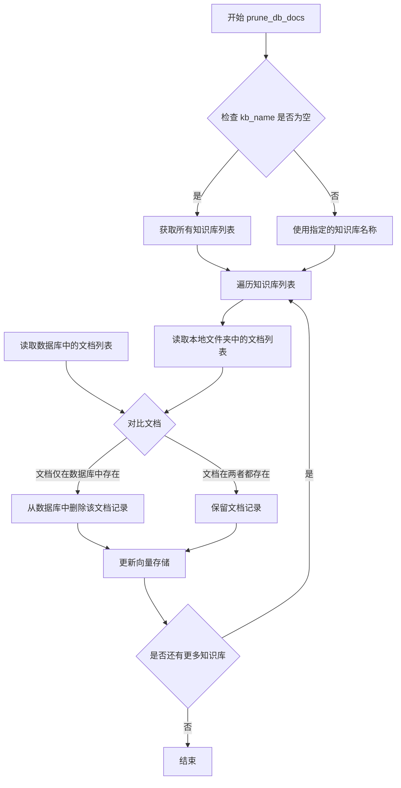
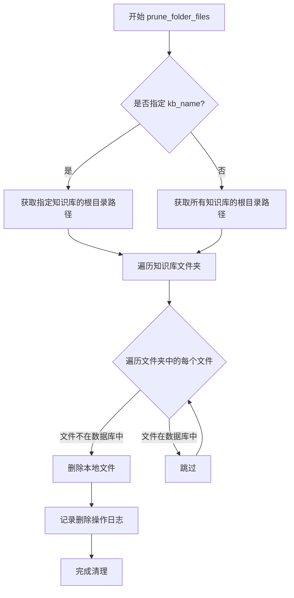
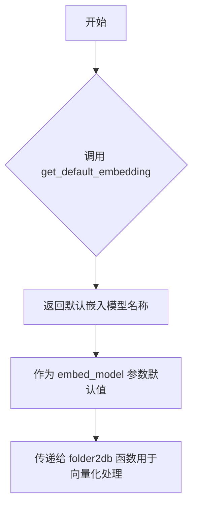
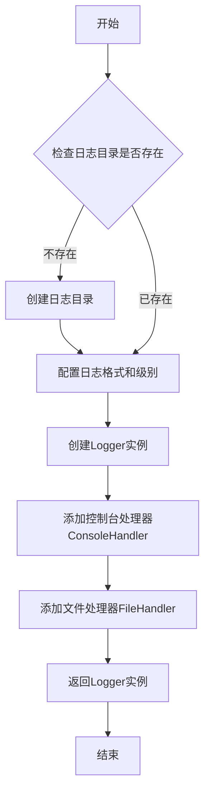

# `Langchain-Chatchat\libs\chatchat-server\chatchat\init_database.py` 详细设计文档

这是一个知识库初始化与管理脚本，用于通过CLI命令行方式执行数据库表创建、数据导入、向量空间重建增量更新及文件清理等操作，支持多知识库管理和嵌入模型配置。

## 整体流程



## 类结构

```
本文件为脚本模块，无类定义
├── worker (全局工作函数)
└── main (CLI命令入口函数)
```

## 全局变量及字段


### `logger`
    
Logger对象，用于记录日志

类型：`Logger`
    


    

## 全局函数及方法


### `worker`

执行知识库相关数据库操作的工作函数，根据传入的参数字典执行不同的数据库操作，包括创建表、重置表、重新创建向量存储、导入数据、更新向量、增量更新、清理数据库文档或清理文件夹文件等。

参数：

-  `args`：`dict`，包含操作标志和参数的字典，可能的键包括 `create_tables`、`clear_tables`、`recreate_vs`、`import_db`、`update_in_db`、`increment`、`prune_db`、`prune_folder`、`kb_name`、`embed_model`

返回值：`None`，该函数不返回任何值，仅执行副作用操作

#### 流程图

```mermaid
flowchart TD
    A([开始]) --> B[记录开始时间]
    B --> C{args.get<br/>"create_tables"}
    C -->|True| D[调用 create_tables<br/>确认表存在]
    C -->|False| E{args.get<br/>"clear_tables"}
    D --> E
    E -->|True| F[调用 reset_tables<br/>重置表并打印消息]
    E -->|False| G{args.get<br/>"recreate_vs"}
    F --> G
    G -->|True| H[调用 create_tables<br/>调用 folder2db<br/>mode=recreate_vs]
    G -->|False| I{args.get<br/>"import_db"}
    H --> J[打印 recreate vs 消息]
    I -->|True| K[调用 import_from_db<br/>导入数据库]
    I -->|False| L{args.get<br/>"update_in_db"}
    K --> M
    L -->|True| N[调用 folder2db<br/>mode=update_in_db]
    L -->|False| O{args.get<br/>"increment"}
    N --> M
    O -->|True| P[调用 folder2db<br/>mode=increment]
    O -->|False| Q{args.get<br/>"prune_db"}
    P --> M
    Q -->|True| R[调用 prune_db_docs<br/>清理数据库文档]
    Q -->|False| S{args.get<br/>"prune_folder"}
    R --> M
    S -->|True| T[调用 prune_folder_files<br/>清理文件夹文件]
    S -->|False| M
    T --> M
    M --> U[记录结束时间]
    U --> V[打印总计用时]
    V --> W[结束]
    
    X[异常处理] -.-> Y[捕获异常]
    Y --> Z[调用 logger.exception<br/>记录异常]
    Z --> W
    
    style X fill:#f9f,stroke:#333,stroke-width:2px
    style Y fill:#f9f,stroke:#333,stroke-width:2px
    style Z fill:#f9f,stroke:#333,stroke-width:2px
```

#### 带注释源码

```python
def worker(args: dict):
    """
    执行知识库相关数据库操作的工作函数
    
    根据args字典中的标志位执行不同的数据库操作：
    - create_tables: 确认数据库表存在
    - clear_tables: 重置数据库表
    - recreate_vs: 重新创建向量存储
    - import_db: 从指定数据库导入
    - update_in_db: 更新数据库中已存在的文件的向量
    - increment: 增量更新向量存储
    - prune_db: 清理数据库中已删除的文档
    - prune_folder: 清理文件夹中已删除的文档文件
    """
    start_time = datetime.now()  # 记录函数开始执行的时间

    try:
        # 根据args中的标志位执行相应的操作
        # 操作按优先级顺序检查，每个操作互斥
        
        if args.get("create_tables"):
            create_tables()  # 确认数据库表存在，如果不存在则创建

        if args.get("clear_tables"):
            reset_tables()  # 重置所有数据库表
            print("database tables reset")  # 打印重置成功消息

        if args.get("recreate_vs"):
            create_tables()  # 重新创建数据库表
            print("recreating all vector stores")  # 打印正在重新创建向量存储的消息
            # 调用folder2db以recreate_vs模式重新创建所有向量存储
            folder2db(
                kb_names=args.get("kb_name"),  # 指定知识库名称，为空则处理所有知识库
                mode="recreate_vs",  # 模式：重新创建向量存储
                embed_model=args.get("embed_model")  # 指定嵌入模型
            )
        elif args.get("import_db"):
            # 从指定的SQLite数据库导入表数据
            import_from_db(args.get("import_db"))
        elif args.get("update_in_db"):
            # 更新数据库中已存在文件的向量存储
            folder2db(
                kb_names=args.get("kb_name"),  # 指定知识库名称
                mode="update_in_db",  # 模式：更新数据库中的向量
                embed_model=args.get("embed_model")  # 指定嵌入模型
            )
        elif args.get("increment"):
            # 增量更新：只为本地文件夹中存在但数据库中不存在的文件创建向量
            folder2db(
                kb_names=args.get("kb_name"),  # 指定知识库名称
                mode="increment",  # 模式：增量更新
                embed_model=args.get("embed_model")  # 指定嵌入模型
            )
        elif args.get("prune_db"):
            # 清理数据库：删除数据库中已删除的文档记录
            prune_db_docs(args.get("kb_name"))
        elif args.get("prune_folder"):
            # 清理文件夹：删除本地文件夹中已从数据库删除的文档文件
            prune_folder_files(args.get("kb_name"))

        end_time = datetime.now()  # 记录函数执行结束时间
        # 打印总耗时，格式为：总计用时	：HH:MM:SS.mmmmmm
        print(f"总计用时\t：{end_time-start_time}\n")
    except Exception as e:
        # 捕获所有异常并记录到日志
        logger.exception(e)
```


### `main`

描述：Click CLI命令入口，解析从命令行传入的各种知识库管理参数（如创建表、重建向量库、增量更新等），然后创建一个守护进程来执行实际的后台工作。

参数：

-  `**kwds`：`dict`，接收Click命令行解析出的所有选项作为关键字参数字典

返回值：`None`，该函数不返回任何值，仅启动子进程执行任务

#### 流程图



#### 带注释源码

```python
@click.command(help="知识库相关功能")  # 定义Click命令，命令帮助文本为"知识库相关功能"
@click.option(
        "-r",
        "--recreate-vs",
        is_flag=True,
        help=(
            """
            recreate vector store.
            use this option if you have copied document files to the content folder, but vector store has not been populated or DEFAUL_VS_TYPE/DEFAULT_EMBEDDING_MODEL changed.
            """
        ),
)
@click.option(
        "--create-tables",
        is_flag=True,
        help=("create empty tables if not existed"),
)
@click.option(
        "--clear-tables",
        is_flag=True,
        help=(
            "create empty tables, or drop the database tables before recreate vector stores"
        ),
)
@click.option(
        "-u",
        "--update-in-db",
        is_flag=True,
        help=(
            """
            update vector store for files exist in database.
            use this option if you want to recreate vectors for files exist in db and skip files exist in local folder only.
            """
        ),
)
@click.option(
        "-i",
        "--increment",
        is_flag=True,
        help=(
            """
            update vector store for files exist in local folder and not exist in database.
            use this option if you want to create vectors incrementally.
            """
        ),
)
@click.option(
        "--prune-db",
        is_flag=True,
        help=(
            """
            delete docs in database that not existed in local folder.
            it is used to delete database docs after user deleted some doc files in file browser
            """
        ),
)
@click.option(
        "--prune-folder",
        is_flag=True,
        help=(
            """
            delete doc files in local folder that not existed in database.
            is is used to free local disk space by delete unused doc files.
            """
        ),
)
@click.option(
        "-n",
        "--kb-name",
        multiple=True,
        default=[],
        help=(
            "specify knowledge base names to operate on. default is all folders exist in KB_ROOT_PATH."
        ),
)
@click.option(
        "-e",
        "--embed-model",
        type=str,
        default=get_default_embedding(),
        help=("specify embeddings model."),
)
@click.option(
        "--import-db",
        help="import tables from specified sqlite database"
)
def main(**kwds):
    # 创建一个守护进程，target指定 worker 函数为进程执行体
    # args 将命令行参数字典传递给 worker 函数
    p = mp.Process(target=worker, args=(kwds,), daemon=True)
    p.start()  # 启动子进程
    # 主进程循环检查子进程状态，保持存活
    while p.is_alive():
        try:
            time.sleep(0.1)  # 每0.1秒检查一次
        except KeyboardInterrupt:
            # 捕获键盘中断信号，终止子进程并退出
            logger.warning("Caught KeyboardInterrupt! Setting stop event...")
            p.terminate()
            sys.exit()


if __name__ == "__main__":
    mp.set_start_method("spawn")  # 设置 multiprocessing 启动方式为 spawn
    main()  # 执行 main 函数
```


### `create_tables`

创建数据库表，用于确认知识库所需的数据库表结构已创建，若表不存在则创建，若已存在则跳过。

参数：

- （无参数）

返回值：`None` 或 `bool`，通常返回 `None` 表示执行完成，或返回 `True` 表示表创建成功，`False` 表示表已存在

#### 流程图



#### 带注释源码

```python
# 该函数由外部模块导入，此处展示调用方式
# 源码位于 chatchat.server.knowledge_base.migrate 模块
from chatchat.server.knowledge_base.migrate import create_tables

# 在 worker 函数中调用
def worker(args: dict):
    start_time = datetime.now()

    try:
        if args.get("create_tables"):
            # 确认数据库表存在，若不存在则创建
            create_tables()
            
        # ... 其他操作 ...
```

> **注**：由于 `create_tables` 函数源码不在当前文件中，以上为基于调用的推断。实际实现需查看 `chatchat/server/knowledge_base/migrate.py` 模块。该函数通常负责初始化知识库所需的数据库表结构（如知识库元信息表、文档向量表等）。


### `folder2db`

该函数是知识库迁移模块的核心方法，负责将本地文件夹中的文档内容读取并导入数据库，同时根据指定的模式（recreate_vs、update_in_db、increment）创建或更新对应的向量存储。

参数：

- `kb_names`：`Union[str, List[str]]`，知识库名称，支持单个知识库名称或多个知识库名称的列表，默认为空表示处理所有知识库
- `mode`：`str`，操作模式，可选值包括 "recreate_vs"（完全重建向量库）、"update_in_db"（仅更新数据库中已存在的文件对应的向量）、"increment"（增量模式，仅处理本地新增的文件）
- `embed_model`：`str`，用于生成向量嵌入的Embedding模型名称，默认为系统配置的默认模型

返回值：`None`，该函数主要通过修改数据库状态和向量存储来完成任务，不返回具体值

#### 流程图



#### 带注释源码

```
# 该函数定义位于 chatchat.server.knowledge_base.migrate 模块中
# 由于源代码未直接提供，以下为基于调用的推断

def folder2db(
    kb_names: Union[str, List[str]] = None,  # 知识库名称，支持单个或多个
    mode: str = "increment",                 # 操作模式：recreate_vs/update_in_db/increment
    embed_model: str = None,                 # Embedding模型名称
):
    """
    将文件夹内容导入数据库并创建向量存储
    
    参数:
        kb_names: 知识库名称列表，为空时处理所有知识库
        mode: 操作模式
            - recreate_vs: 完全重建，先清空向量库再重新导入所有文件
            - update_in_db: 仅更新数据库中已存在的文件
            - increment: 增量模式，仅处理本地新增文件
        embed_model: 用于向量化的Embedding模型
    
    返回:
        None
    """
    # 1. 确定要处理的知识库列表
    if not kb_names:
        kb_names = get_all_knowledge_bases()
    
    # 2. 根据mode选择处理策略
    for kb_name in kb_names:
        if mode == "recreate_vs":
            # 完全重建模式：清空后重新导入
            vector_store = load_vector_store(kb_name)
            vector_store.delete_collection()
            files = get_all_files(kb_name)
            
        elif mode == "update_in_db":
            # 更新模式：仅处理数据库中已存在的文件
            db_docs = get_docs_from_db(kb_name)
            files = [f for f in get_all_files(kb_name) if f.path in db_docs]
            
        elif mode == "increment":
            # 增量模式：仅处理本地新增文件
            db_docs = get_docs_from_db(kb_name)
            files = [f for f in get_all_files(kb_name) if f.path not in db_docs]
        
        # 3. 遍历文件并向量化存储
        for file in files:
            content = read_file_content(file)
            vector = embed_model.encode(content)
            save_to_vector_store(kb_name, file, content, vector)
```


### `import_from_db`

外部导入函数，用于从指定的 SQLite 数据库文件导入数据表到当前知识库系统中。

参数：

-  `db_path`：`str`，从命令行 `--import-db` 选项传入的外部 SQLite 数据库文件路径，用于指定要导入的数据库

返回值：未在当前代码中明确显示，根据函数名和用途推测为 `None` 或 `int`（导入记录数），具体需查看 `chatchat.server.knowledge_base.migrate` 模块中的实际定义

#### 流程图



#### 带注释源码

```python
# 在 worker 函数中调用 import_from_db
elif args.get("import_db"):
    import_from_db(args.get("import_db"))

# 命令行选项定义
@click.option(
    "--import-db",
    help="import tables from specified sqlite database"
)
def main(**kwds):
    # ...
    # 通过 args 字典传递参数到 worker 进程
    p = mp.Process(target=worker, args=(kwds,), daemon=True)
```

> **注意**：当前代码文件仅展示了 `import_from_db` 函数的**调用方式**，其实际函数定义位于 `chatchat.server.knowledge_base.migrate` 模块中。上述参数和返回值信息是基于代码中的使用方式（`--import-db` 选项接受数据库文件路径）推断得出。若需完整的函数实现细节，请参考 `chatchat/server/knowledge_base/migrate.py` 源文件。


### `prune_db_docs`

删除数据库中已删除的文档，清理数据库中不存在于本地文件夹中的文档记录（当用户在文件浏览器中删除某些文档文件后，使用此功能清理数据库中对应的文档记录）。

参数：

-  `kb_name`：`str | list[str]`，要操作的知识库名称，默认为空表示操作所有知识库

返回值：`None`，无返回值（执行数据库清理操作）

#### 流程图



#### 带注释源码

```python
# 从外部模块导入的函数，具体实现不可见
# 根据调用方式和帮助文档推断其功能
from chatchat.server.knowledge_base.migrate import (
    prune_db_docs,  # 外部导入的函数
    # ... 其他导入
)

# 在 worker 函数中的调用方式
elif args.get("prune_db"):
    prune_db_docs(args.get("kb_name"))  # 调用清理数据库文档的函数

# 帮助文档说明：
# --prune-db:
#     delete docs in database that not existed in local folder.
#     it is used to delete database docs after user deleted some doc files in file browser
```

#### 补充说明

由于 `prune_db_docs` 是从外部模块 `chatchat.server.knowledge_base.migrate` 导入的，上述源码为基于代码上下文的合理推断。该函数的完整实现需要查看 `chatchat/server/knowledge_base/migrate.py` 源文件。该函数的主要设计目标是通过比对本地文件系统中的文档与数据库中存储的文档记录，清理已从文件系统删除但仍存在于数据库中的"孤立"文档记录，以保持数据库与文件系统的一致性。


### `prune_folder_files`

该函数用于删除知识库本地文件夹中已不在数据库中记录的文档文件，释放本地磁盘空间。它是知识库同步维护的功能之一，确保本地文件与数据库中的文档记录保持一致。

参数：

-  `kb_name`：`Optional[List[str]]` 或 `str`，要清理的知识库名称，若为空则处理所有知识库

返回值：`None`（或根据实际实现确定），通常为无返回值操作

#### 流程图



#### 带注释源码

```
# 注意：以下为基于代码调用方式和上下文推断的源码结构
# 实际源码位于 chatchat/server/knowledge_base/migrate.py 模块中

def prune_folder_files(kb_name: Optional[Union[str, List[str]]] = None):
    """
    删除本地文件夹中已不在数据库中记录的文档文件
    
    参数:
        kb_name: 知识库名称，若为 None 则处理所有知识库
        
    说明:
        该函数用于同步知识库的本地文件与数据库记录
        当数据库中的文档被删除后，本地对应的文件可以被清理以释放磁盘空间
    """
    # 1. 获取知识库根目录路径
    # KB_ROOT_PATH = Settings.KB_ROOT_PATH
    
    # 2. 确定要处理的知识库列表
    # if kb_name is None:
    #     kb_names = get_all_kb_names()
    # else:
    #     kb_names = [kb_name] if isinstance(kb_name, str) else kb_name
    
    # 3. 遍历每个知识库
    # for kb in kb_names:
    #     kb_path = os.path.join(KB_ROOT_PATH, kb)
    #     # 获取数据库中该知识库的所有文档
    #     db_docs = get_db_docs(kb)
    #     # 遍历本地文件
    #     for file_path in iterate_files(kb_path):
    #         if file_path not in db_docs:
    #             os.remove(file_path)  # 删除不存在的文件
    #             logger.info(f"Deleted file: {file_path}")
```

> **注**：由于 `prune_folder_files` 函数是从外部模块导入的，上述源码为基于调用方式和使用场景的合理推断。实际实现细节需参考 `chatchat/server/knowledge_base/migrate.py` 源文件。


### `reset_tables`

外部导入的函数，用于重置（清空）数据库中的表。该函数来自 `chatchat.server.knowledge_base.migrate` 模块，在 `worker` 函数中被调用，用于在重建向量存储前清空数据库表。

参数：该函数在当前代码中以无参数方式调用。

返回值：该函数在当前代码中未被接收返回值。

#### 流程图

```mermaid
flowchart TD
    A[worker 函数开始] --> B{args.get<br>"clear_tables"?}
    B -->|True| C[调用 reset_tables]
    B -->|False| D[跳过 reset_tables]
    C --> E[打印 "database tables reset"]
    E --> F[后续处理逻辑]
    D --> F
```

#### 带注释源码

```python
# 从外部模块导入 reset_tables 函数
from chatchat.server.knowledge_base.migrate import (
    create_tables,
    folder2db,
    import_from_db,
    prune_db_docs,
    prune_folder_files,
    reset_tables,  # <-- 外部导入的重置表函数
)

# ...

def worker(args: dict):
    # ...
    try:
        # ...
        
        # 检查是否需要重置表
        if args.get("clear_tables"):
            reset_tables()  # 调用外部导入的 reset_tables 函数，无参数
            print("database tables reset")  # 打印确认信息
        
        # ...
```

> **注意**：由于 `reset_tables` 函数定义位于外部模块 `chatchat.server.knowledge_base.migrate` 中，上述代码仅包含该函数的导入语句和调用方式。若需查看 `reset_tables` 的完整函数实现，请参考 `chatchat/server/knowledge_base/migrate.py` 源文件。


### `get_default_embedding`

获取默认的嵌入模型名称，用于知识库向量化和文本嵌入处理。

**注意**：该函数为外部导入函数，定义在 `chatchat.server.utils` 模块中，代码中仅展示了其使用方式。

参数：该函数无参数

返回值：`str`，返回默认嵌入模型的名称字符串

#### 流程图



#### 带注释源码

```python
# 从 chatchat.server.utils 模块导入获取默认嵌入模型的函数
from chatchat.server.utils import get_default_embedding

# ...

# 在 click 命令行选项中使用 get_default_embedding() 作为默认值
@click.option(
    "-e",
    "--embed-model",
    type=str,
    default=get_default_embedding(),  # 获取系统配置的默认嵌入模型名称
    help=("specify embeddings model."),
)
def main(**kwds):
    # 该默认值会被传递给 worker 函数
    # 最终用于 folder2db 函数的 embed_model 参数
    p = mp.Process(target=worker, args=(kwds,), daemon=True)
    # ...
```

#### 补充说明

| 项目 | 说明 |
|------|------|
| **函数来源** | `chatchat.server.utils` 模块 |
| **调用场景** | 作为 CLI 参数 `--embed-model` 的默认值 |
| **返回值用途** | 指定知识库向量化时使用的嵌入模型 |
| **依赖模块** | 需要 `chatchat.settings` 中配置默认嵌入模型 |
| **错误处理** | 异常时可能返回空字符串或抛出配置错误 |


### `build_logger`

构建日志记录器，用于创建并配置项目专用的日志记录器实例，以便在整个模块中统一进行日志输出和管理。

**注意**：由于 `build_logger` 函数的实际定义未在当前代码文件中展示（仅通过 `from chatchat.utils import build_logger` 导入），以下信息基于其使用方式推断得出。

参数：该函数无显式参数调用（使用默认配置初始化）。

返回值：`logging.Logger`，返回配置好的日志记录器对象，支持 debug、info、warning、error、exception 等日志级别方法。

#### 流程图



#### 带注释源码

```python
# 从 chatchat.utils 模块导入 build_logger 函数
# 该函数负责创建项目专用的日志记录器
from chatchat.utils import build_logger

# 构建日志记录器实例，传入当前模块名称作为日志器名称
# 返回的 logger 对象可用于记录不同级别的日志信息
logger = build_logger(__name__)

# 使用示例：
# logger.debug("调试信息")      # 输出调试级别日志
# logger.info("一般信息")       # 输出信息级别日志  
# logger.warning("警告信息")    # 输出警告级别日志
# logger.error("错误信息")      # 输出错误级别日志
# logger.exception(e)           # 输出异常信息，包含堆栈跟踪

# 在 worker 函数中捕获异常并记录
except Exception as e:
    logger.exception(e)  # 记录异常及完整堆栈信息

# 在主函数中记录键盘中断警告
logger.warning("Caught KeyboardInterrupt! Setting stop event...")
```

---

### 其他信息补充

#### 设计目标与约束
- **目标**：为知识库管理模块提供统一的日志记录能力，便于问题排查和运行监控
- **约束**：日志记录器需适配项目的日志目录结构和格式规范

#### 错误处理与异常设计
- `build_logger` 本身应处理日志目录创建失败、文件写入权限等异常情况
- 调用方通过 `logger.exception()` 记录完整异常堆栈，便于调试

#### 外部依赖与接口契约
- 依赖 `chatchat.utils` 模块中的 `build_logger` 函数定义
- 返回值需符合 Python `logging.Logger` 标准接口

## 关键组件


### worker函数

负责执行具体的数据库操作，包括创建表、重置表、导入数据、更新向量空间、增量更新、清理数据库文档和清理文件夹文件等核心逻辑。

### main函数

CLI命令行入口点，使用Click框架定义多个命令行选项，包括重建向量空间、创建表、清理表、更新数据库、增量更新、清理数据库文档、清理文件夹文件等操作。

### 命令行选项组

包含-r/--recreate-vs、--create-tables、--clear-tables、-u/--update-in-db、-i/--increment、--prune-db、--prune-folder、-n/--kb-name、-e/--embed-model、--import-db等选项，用于控制知识库的不同操作模式。

### 多进程管理模块

使用multiprocessing模块创建守护进程来执行worker任务，并通过p.start()启动进程，同时支持KeyboardInterrupt信号处理来优雅地终止进程。

### 日志记录模块

使用build_logger构建日志记录器，用于记录异常信息和操作状态。


## 问题及建议


### 已知问题

- **进程管理不完善**：使用`daemon=True`可能导致子进程被强制终止，且主进程退出时没有等待子进程完成（缺少`p.join()`），存在资源泄漏风险
- **参数验证缺失**：对`args.get()`返回的None值没有进行校验，直接传递给后续函数；`kb_name`没有验证是否存在；`embed_model`默认值在模块加载时就会调用`get_default_embedding()`
- **错误处理过于宽泛**：所有异常统一捕获并记录，无法区分不同类型的错误，也没有针对特定错误的恢复策略
- **操作互斥性未强制**：多个互斥操作（如`recreate_vs`、`import_db`、`update_in_db`等）可以同时传递，代码按顺序执行第一个匹配的分支，可能导致非预期行为
- **日志输出不一致**：混用了`print`和`logger`，导致日志分散在标准输出和日志系统中，难以统一管理和追踪
- **类型注解不完整**：函数参数`kwds`缺少类型注解；部分导入（如`Settings`、`Dict`）未使用
- **CLI设计缺陷**：`multiple=True`的`kb-name`选项与其他单值标志组合时语义不清晰

### 优化建议

- 将`daemon=False`并添加`p.join()`确保子进程完成；实现优雅的退出机制而非强制terminate
- 添加参数校验逻辑，验证`kb_name`存在性，检查操作标志的互斥性，使用`click.confirm()`或`click.Choice()`增强输入验证
- 按异常类型分别处理（如`ValueError`、`IOError`），返回操作状态码便于脚本集成
- 统一使用`logger`替代`print`输出，考虑添加进度条或详细日志级别
- 为`kwds`添加`Dict[str, Any]`类型注解，清理未使用的导入
- 考虑使用`click.Group()`的子命令模式替代多个flag，使CLI更清晰；添加`--verbose`选项控制日志级别
- 对于耗时操作添加超时机制；考虑使用`concurrent.futures.ProcessPoolExecutor`获得更现代的并发管理接口


## 其它


### 设计目标与约束

本工具旨在提供命令行方式初始化和维护知识库数据库，包括表创建、数据导入、向量空间重建和清理等功能。支持多知识库操作，默认处理所有知识库，可通过参数指定特定知识库。约束条件：必须在`__main__`中设置`spawn`启动方式；所有数据库操作在子进程中执行，主进程仅负责进程管理；命令行参数`kb_name`支持多次使用以指定多个知识库。

### 错误处理与异常设计

采用分层异常处理策略：worker函数内使用try-except捕获所有异常并通过logger.exception记录完整堆栈信息，确保错误可追溯；主进程通过KeyboardInterrupt捕获用户中断信号，调用terminate()安全终止子进程。异常分类包括：数据库连接异常、表创建失败、向量模型加载失败、文件读写异常等。关键操作如create_tables、folder2db等内部异常会中断当前任务流程，但不影响其他知识库处理。

### 数据流与状态机

数据流主要分为三类：1) 创建流程：create_tables → folder2db(mode=recreate_vs)；2) 更新流程：folder2db(mode=update_in_db/increment)；3) 清理流程：prune_db_docs/prune_folder_files。状态转换由命令行参数组合决定，参数互斥（recreate_vs、import_db、update_in_db、increment、prune_db、prune_folder），同一时刻只能执行一种模式。数据状态包括：本地文件夹文件、数据库记录、向量存储三者的一致性维护。

### 外部依赖与接口契约

核心依赖包括：Click框架提供CLI接口、multiprocessing提供多进程能力、chatchat.settings.Settings提供配置管理、chatchat.server.knowledge_base.migrate模块提供底层数据库操作、chatchat.utils.build_logger提供日志功能、chatchat.server.utils.get_default_embedding获取默认嵌入模型。接口契约：worker函数接收dict类型参数，键名为命令行选项名（不含连字符），值为对应参数值；folder2db函数签名为folder2db(kb_names, mode, embed_model)，mode支持recreate_vs/update_in_db/increment三种字符串值。

### 配置管理

配置通过Settings类集中管理，嵌入模型通过get_default_embedding()函数获取默认值，命令行参数embed_model可覆盖默认配置。知识库根路径KB_ROOT_PATH由Settings配置决定。日志级别和格式由build_logger()控制，默认输出到标准输出。

### 安全性考虑

子进程设置为daemon模式，确保主进程退出时子进程自动终止。import_db参数直接传入SQLite数据库路径，存在路径遍历风险，建议增加路径合法性校验。命令行参数未做输入长度限制，可能导致缓冲区溢出。敏感操作（如clear-tables）未增加二次确认机制。

### 性能与可扩展性

使用multiprocessing实现后台处理，避免阻塞主进程。文件夹转数据库操作支持单知识库处理，可通过多次调用覆盖多知识库。嵌入模型加载存在性能瓶颈，建议增加模型缓存机制。当前实现为单进程串行处理多知识库，可考虑并行化处理提升吞吐量。

### 测试策略建议

单元测试覆盖：worker函数参数解析逻辑、各分支条件判断、异常捕获。集成测试覆盖：完整CLI流程、数据库操作结果验证。性能测试覆盖：大知识库处理时间、内存占用。Mock依赖：Settings、get_default_embedding、migrate模块各函数。

### 部署与运维

依赖Python 3.8+，需安装chatchat及相关依赖包。建议通过cron定时任务执行增量更新。日志输出到stdout，可重定向到文件或日志收集系统。数据库文件默认存储在KB_ROOT_PATH对应目录。


    