# `Langchain-Chatchat\libs\chatchat-server\chatchat\pydantic_settings_file.py` 详细设计文档

该代码实现了一个基于 Pydantic 的配置管理框架，支持从 YAML/JSON 文件和环境变量自动加载配置（带热重载机制），并提供了从 Pydantic 模型动态生成带注释的 YAML 配置模板的功能。

## 整体流程

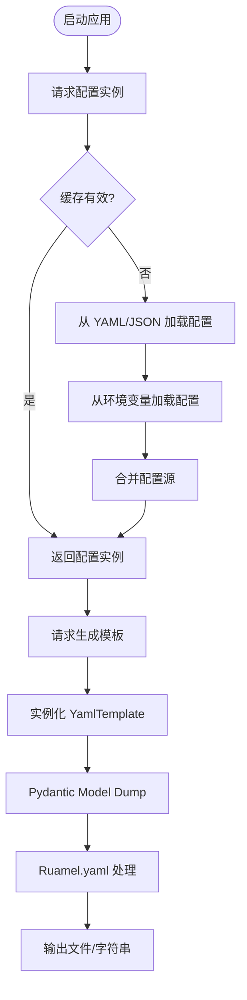

## 类结构

```
pydantic.BaseModel
├── MyBaseModel (配置通用基类)
pydantic_settings.BaseSettings
└── BaseFileSettings (文件配置基类)
    ├── _auto_reload (属性)
    ├── create_template_file (方法)
    └── settings_property (装饰器工厂)
helpers
└── YamlTemplate (模板生成类)
```

## 全局变量及字段


### `__all__`
    
公共 API 导出列表

类型：`list[str]`
    


### `_T`
    
用于泛型约束的 TypeVar

类型：`TypeVar`
    


### `_lazy_load_key`
    
用于缓存失效判断的键生成函数引用

类型：`Callable[[BaseSettings], tuple]`
    


### `_cached_settings`
    
缓存装饰器包装后的设置类

类型：`Callable[[_T], _T]`
    


### `MyBaseModel.model_config`
    
Pydantic 模型配置，包含 docstring 使用和 extra 允许设置

类型：`ConfigDict`
    


### `BaseFileSettings._auto_reload`
    
控制配置是否自动重载的内部标志

类型：`bool`
    


### `BaseFileSettings.model_config`
    
配置文件解析设置

类型：`SettingsConfigDict`
    


### `YamlTemplate.model_obj`
    
要生成模板的 Pydantic 模型实例

类型：`BaseModel`
    


### `YamlTemplate.dump_kwds`
    
模型序列化的关键字参数

类型：`Dict`
    


### `YamlTemplate.sub_comments`
    
用于在模板中添加嵌套注释的配置

类型：`Dict`
    


### `YamlTemplate.model_cls`
    
模型类的缓存属性

类型：`Type[BaseModel]`
    


### `SubModelComment.model_obj`
    
子模型对象

类型：`BaseModel`
    


### `SubModelComment.dump_kwds`
    
序列化参数

类型：`Dict`
    


### `SubModelComment.is_entire_comment`
    
是否为整个复杂字段（如列表）设置注释

类型：`bool`
    


### `SubModelComment.sub_comments`
    
嵌套的子注释

类型：`Dict`
    
    

## 全局函数及方法


### `import_yaml`

配置并返回一个 ruamel.yaml 解析器实例，设置缩进等格式，用于后续 YAML 文件的解析和生成。

参数： 无

返回值：`ruamel.yaml.YAML`，返回配置好的 ruamel.yaml 解析器实例，包含块序列缩进、映射缩进、序列破折号偏移和序列缩进的设置。

#### 流程图

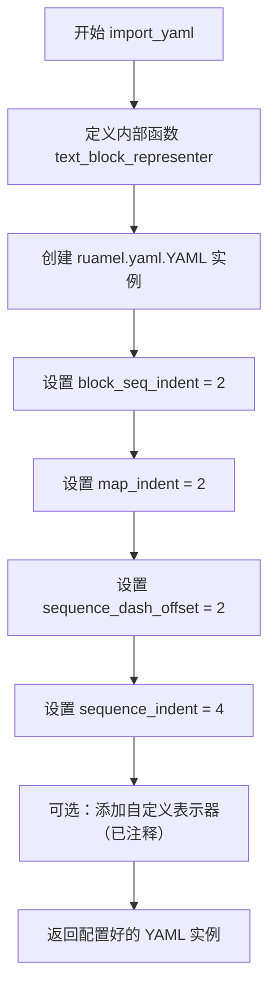

#### 带注释源码

```python
def import_yaml() -> ruamel.yaml.YAML:
    """
    配置并返回 ruamel.yaml 解析器实例，设置缩进等格式
    
    Returns:
        ruamel.yaml.YAML: 配置好的解析器实例
    """
    
    def text_block_representer(dumper, data):
        """
        内部函数：自定义文本块表示器
        用于处理多行文本的 YAML 表示
        """
        style = None
        if len(data.splitlines()) > 1: # 检查是否为多行
            style = "|"  # 使用 | 风格表示多行文本块
        return dumper.represent_scalar("tag.yaml.org,2002:str", data, style=style)

    # 创建 ruamel.yaml 解析器实例
    yaml = ruamel.yaml.YAML()
    
    # 设置块序列缩进为 2
    yaml.block_seq_indent = 2
    # 设置映射缩进为 2
    yaml.map_indent = 2
    # 设置序列破折号偏移为 2
    yaml.sequence_dash_offset = 2
    # 设置序列缩进为 4
    yaml.sequence_indent = 4

    # 此表示器用于将所有 OrderedDict 转换为 TaggedScalar
    # 注意：当前已注释，未启用
    # yaml.representer.add_representer(str, text_block_representer)
    
    # 返回配置好的 YAML 解析器实例
    return yaml
```


### `_lazy_load_key`

根据配置文件修改时间生成缓存键的辅助函数，用于在配置文件的修改时间变化时自动刷新缓存。

参数：

-  `settings`：`BaseSettings`，Pydantic 设置对象，从中获取配置文件路径和配置信息

返回值：`tuple`，包含设置类和各配置文件（env_file、json_file、yaml_file、toml_file）的修改时间戳组成的元组，用于作为缓存键

#### 流程图

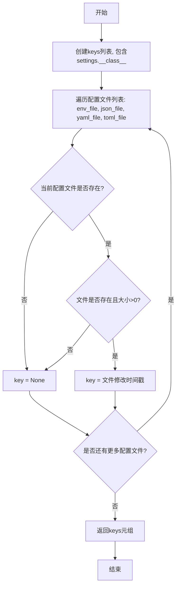

#### 带注释源码

```python
def _lazy_load_key(settings: BaseSettings):
    """
    根据文件修改时间生成缓存键的辅助函数
    
    该函数用于生成缓存键，当配置文件（env/json/yaml/toml）的修改时间
    发生变化时，缓存会自动失效并重新加载配置。
    """
    # 初始化键列表，首先包含设置类本身
    keys = [settings.__class__]
    
    # 遍历所有可能的配置文件类型
    for n in ["env_file", "json_file", "yaml_file", "toml_file"]:
        key = None
        # 从模型配置中获取文件路径
        if file := settings.model_config.get(n):
            # 检查文件是否存在且不为空
            if os.path.isfile(file) and os.path.getsize(file) > 0:
                # 获取文件最后修改时间戳作为键的一部分
                key = int(os.path.getmtime(file))
        keys.append(key)
    
    # 返回元组作为缓存键
    return tuple(keys)
```


### `_cached_settings`

带 LRU 缓存的设置加载器函数，支持基于配置文件（YAML/JSON/TOML/ENV）变化的自动刷新，通过自定义缓存 key 机制（基于文件修改时间）实现缓存失效。

参数：

- `settings`：`_T`（继承自 `BaseFileSettings` 的泛型类型），需要缓存的设置对象实例

返回值：`_T`，返回缓存或重新加载后的设置对象实例

#### 流程图

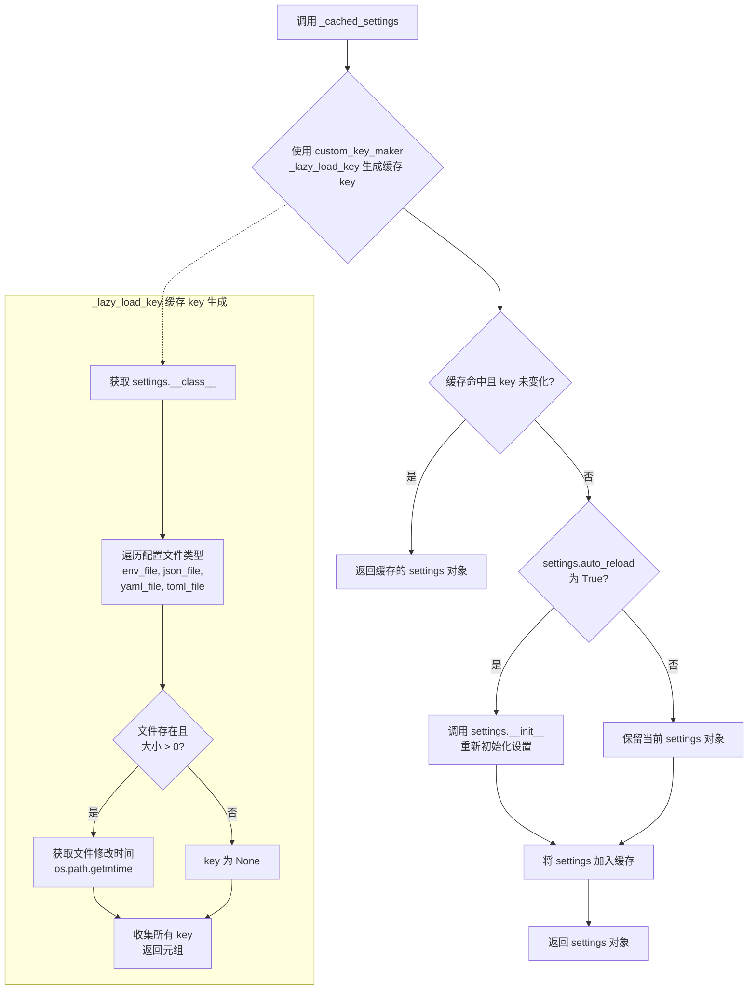

#### 带注释源码

```python
# 定义泛型类型变量 _T，约束为 BaseFileSettings 的子类
_T = t.TypeVar("_T", bound=BaseFileSettings)

# 使用 memoization 库的 @cached 装饰器实现 LRU 缓存
# max_size=1: 最多缓存 1 个 settings 实例
# algorithm=CachingAlgorithmFlag.LRU: 使用 LRU（最近最少使用）淘汰策略
# thread_safe=True: 线程安全，支持多线程环境
# custom_key_maker=_lazy_load_key: 使用自定义函数生成缓存 key，基于配置文件修改时间
@cached(max_size=1, algorithm=CachingAlgorithmFlag.LRU, thread_safe=True, custom_key_maker=_lazy_load_key)
def _cached_settings(settings: _T) -> _T:
    """
    the sesstings is cached, and refreshed when configuration files changed
    缓存设置对象，当配置文件发生变化时自动刷新
    """
    # 检查是否启用自动重载功能
    if settings.auto_reload:
        # 重新初始化 settings 对象，从配置源重新加载配置
        settings.__init__()
    # 返回 settings 对象（可能是缓存的或重新加载后的）
    return settings


# 自定义缓存 key 生成器，用于判断缓存是否失效
def _lazy_load_key(settings: BaseSettings):
    """
    根据 settings 类的类型和关联配置文件的修改时间生成缓存 key
    当配置文件修改时间变化时，缓存 key 也会变化，触发缓存刷新
    """
    # 第一个元素为 settings 的类，确保不同类的 settings 使用不同缓存
    keys = [settings.__class__]
    # 遍历支持的配置文件类型
    for n in ["env_file", "json_file", "yaml_file", "toml_file"]:
        key = None
        # 从 model_config 中获取配置文件路径
        if file := settings.model_config.get(n):
            # 检查文件是否存在且大小大于 0
            if os.path.isfile(file) and os.path.getsize(file) > 0:
                # 获取文件修改时间作为 key 的一部分
                key = int(os.path.getmtime(file))
        keys.append(key)
    # 返回元组作为缓存 key
    return tuple(keys)
```


### `settings_property`

装饰器工厂，用于创建延迟加载且缓存的配置属性，基于配置文件的修改时间自动刷新缓存。

参数：

- `settings`：`_T`（`BaseFileSettings` 的子类），配置对象实例，用于指定要缓存的配置类

返回值：`property`，返回一个新的 property 对象，用于类属性的延迟加载和缓存访问

#### 流程图

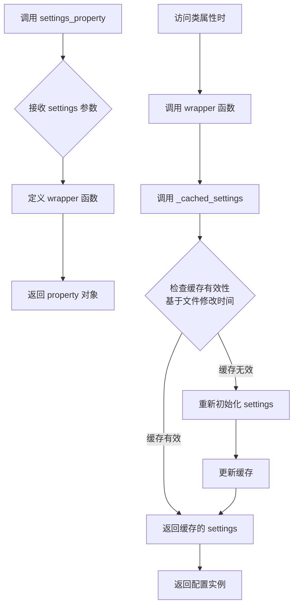

#### 带注释源码

```python
def settings_property(settings: _T):
    """
    装饰器工厂，用于创建延迟加载且缓存的配置属性
    
    参数:
        settings: BaseFileSettings的子类实例，用于指定要缓存的配置类
        
    返回值:
        property: 一个property对象，访问时返回缓存的配置实例
    """
    def wrapper(self) -> _T:
        """
        内部包装函数，作为property的getter
        
        参数:
            self: 拥有该属性的类实例
            
        返回值:
            _T: 缓存的配置实例
        """
        # 调用缓存获取函数，该函数会根据文件修改时间自动刷新缓存
        return _cached_settings(settings)
    
    # 返回property对象，使被装饰的属性变为延迟加载
    return property(wrapper)
```


### `MyBaseModel.model_post_init`

该方法是 Pydantic `BaseModel` 的生命周期钩子。在 `MyBaseModel` 基类中未显式重写，继承自 Pydantic 的标准行为。在子类 `BaseFileSettings` 中有具体实现，用于在模型初始化后自动设置配置属性（如自动重载标志）。

参数：

-  `__context`：`t.Any`，Pydantic 内部传递的上下文对象，通常包含模型构建时的环境信息。

返回值：`None`，该钩子通常用于执行初始化后的副作用，不返回数据。

#### 流程图

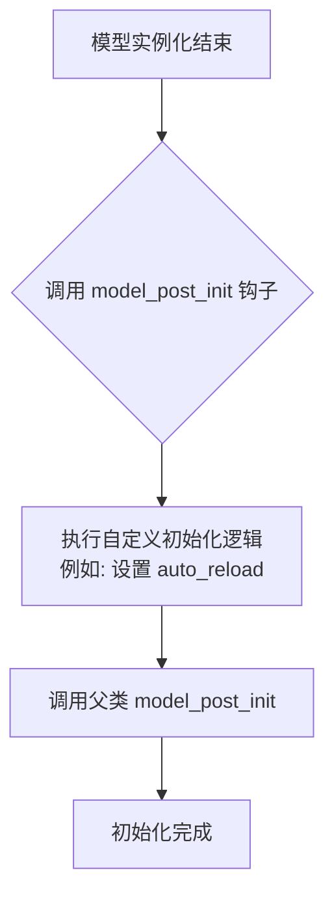

#### 带注释源码

> **注**：在提供的代码中，`MyBaseModel` 本身并未显式定义 `model_post_init` 方法，因此以下源码提取自其子类 `BaseFileSettings` 中的具体实现，用于展示该钩子在实际使用中的逻辑。

```python
def model_post_init(self, __context: os.Any) -> None:
    """
    初始化后调用的钩子。
    在模型属性赋值完毕后执行，常用于设置内部状态或执行依赖模型字段的逻辑。
    """
    # 设置自动重载标志为 True
    # 这是 BaseFileSettings 中的具体业务逻辑
    self._auto_reload = True
    
    # 调用父类（pydantic.BaseModel）的同名方法
    # 以确保 Pydantic 内部的初始化流程得以继续
    return super().model_post_init(__context)
```


### `BaseFileSettings.model_post_init`

设置自动重载标志并调用父类初始化方法，确保在 Pydantic 模型初始化完成后自动启用重载功能。

参数：

- `__context`：`os.Any`，Pydantic 内部上下文对象，用于模型初始化后的回调

返回值：`None`，无返回值

#### 流程图

```mermaid
flowchart TD
    A[开始 model_post_init] --> B[设置 self._auto_reload = True]
    B --> C[调用父类 super().model_post_init]
    C --> D[结束]
```

#### 带注释源码

```python
def model_post_init(self, __context: os.Any) -> None:
    """
    Pydantic 模型初始化后的回调方法。
    在模型实例化完成后自动调用，用于执行额外的初始化逻辑。
    
    参数:
        __context: Pydantic 内部上下文对象，包含模型初始化的相关信息
    """
    # 设置自动重载标志为 True
    # 该属性会在后续用于判断是否需要重新加载配置
    self._auto_reload = True
    
    # 调用父类 BaseSettings 的 model_post_init 方法
    # 确保父类的初始化逻辑能够正常执行
    return super().model_post_init(__context)
```


### `BaseFileSettings.auto_reload` (property)

获取或设置自动重载状态，用于控制配置文件的自动重新加载功能。

参数：

- `self`：`BaseFileSettings`，当前 BaseFileSettings 实例（property getter）
- `self`：`BaseFileSettings`，当前 BaseFileSettings 实例（property setter）
- `val`：`bool`，新的自动重载状态值

返回值：`bool`，当前的自动重载状态（getter 返回）

#### 流程图

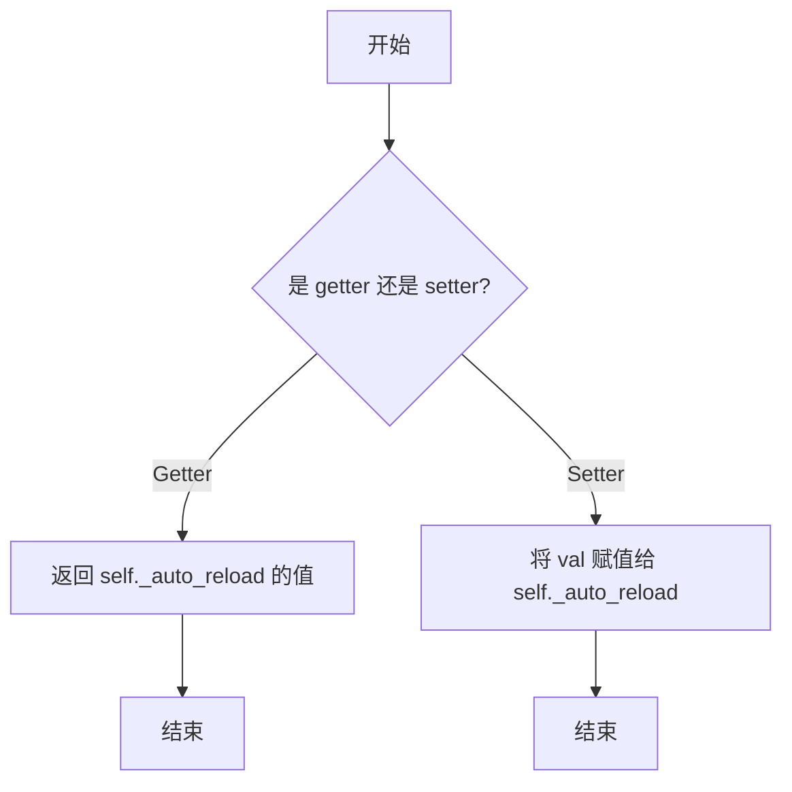

#### 带注释源码

```python
@property
def auto_reload(self) -> bool:
    """
    自动重载属性 getter
    
    返回当前配置文件的自动重载状态
    
    Returns:
        bool: True 表示启用自动重载，False 表示禁用自动重载
    """
    return self._auto_reload

@auto_reload.setter
def auto_reload(self, val: bool):
    """
    自动重载属性 setter
    
    设置配置文件的自动重载状态
    
    Parameters:
        val: bool - 要设置的自动重载状态值
    """
    self._auto_reload = val
```

#### 相关上下文代码

```python
class BaseFileSettings(BaseSettings):
    # ... 其他代码 ...
    
    def model_post_init(self, __context: os.Any) -> None:
        """
        模型初始化后的回调方法
        
        在模型初始化时自动设置 _auto_reload 为 True，
        默认启用自动重载功能
        """
        self._auto_reload = True
        return super().model_post_init(__context)

    @property
    def auto_reload(self) -> bool:
        """
        自动重载属性
        
        控制配置文件是否在文件变更时自动重新加载。
        该属性由 _cached_settings 函数使用，当为 True 时
        会重新初始化配置以刷新配置数据。
        """
        return self._auto_reload
    
    @auto_reload.setter
    def auto_reload(self, val: bool):
        """
        设置自动重载状态
        
        Parameters:
            val: bool - 新的自动重载状态值
        """
        self._auto_reload = val
```


### `BaseFileSettings.auto_reload.setter`

设置自动重载状态，用于控制配置变更时是否自动重新加载配置。

参数：

- `self`：`BaseFileSettings`，当前配置实例
- `val`：`bool`，自动重载状态值

返回值：`None`，无返回值（setter 方法）

#### 流程图

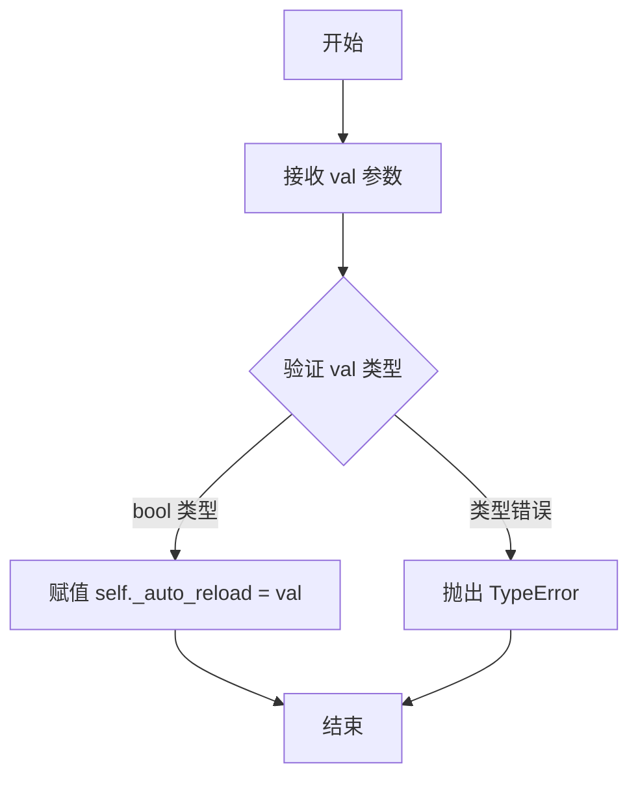

#### 带注释源码

```python
@auto_reload.setter
def auto_reload(self, val: bool):
    """
    设置自动重载状态
    
    Args:
        val: bool, 自动重载状态值。为 True 时启用自动重载，为 False 时禁用
    
    Returns:
        None
    
    Raises:
        TypeError: 如果 val 不是布尔类型
    """
    # 将传入的值赋给内部变量 _auto_reload
    # 该变量在 model_post_init 中被初始化为 True
    self._auto_reload = val
```


### `BaseFileSettings.settings_customise_sources`

定义配置源优先级顺序为 Init > Env > Dotenv > YAML，使得代码中的显式赋值参数具有最高优先级，其次是环境变量，然后是 .env 文件，最后是 YAML 配置文件。

参数：

- `cls`：类型 `type[BaseSettings]`，当前类本身的类型引用
- `settings_cls`：类型 `type[BaseSettings]`，Pydantic 设置类的类型，用于创建 YAML 配置源
- `init_settings`：类型 `PydanticBaseSettingsSource`，通过构造函数参数传递的设置源
- `env_settings`：类型 `PydanticBaseSettingsSource`，从环境变量读取的设置源
- `dotenv_settings`：类型 `PydanticBaseSettingsSource`，从 .env 文件读取的设置源
- `file_secret_settings`：类型 `PydanticBaseSettingsSource`，从密钥文件读取的设置源（本方法中未使用）

返回值：`tuple[PydanticBaseSettingsSource, ...]`，返回按优先级排序的配置源元组，顺序为 Init > Env > Dotenv > YAML

#### 流程图

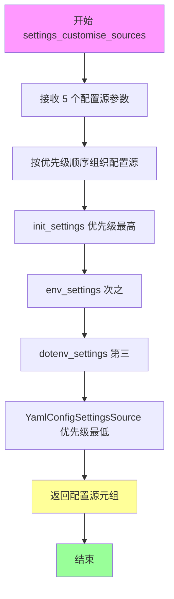

#### 带注释源码

```python
@classmethod
def settings_customise_sources(
    cls,
    settings_cls: type[BaseSettings],
    init_settings: PydanticBaseSettingsSource,
    env_settings: PydanticBaseSettingsSource,
    dotenv_settings: PydanticBaseSettingsSource,
    file_secret_settings: PydanticBaseSettingsSource,
) -> tuple[PydanticBaseSettingsSource, ...]:
    """
    自定义配置源优先级顺序
    
    参数:
        settings_cls: Pydantic Settings 类类型，用于创建 YAML 配置源
        init_settings: 来自构造函数参数的配置源
        env_settings: 来自环境变量的配置源
        dotenv_settings: 来自 .env 文件的配置源
        file_secret_settings: 来自密钥文件的配置源（当前方法中未使用）
    
    返回:
        按优先级排序的配置源元组: (init_settings, env_settings, dotenv_settings, yaml_source)
    """
    # 返回优先级顺序: Init > Env > Dotenv > YAML
    # 第一个配置源的优先级最高，后续配置源作为默认值
    return init_settings, env_settings, dotenv_settings, YamlConfigSettingsSource(settings_cls)
```

#### 关键组件信息

- **YamlConfigSettingsSource**：Pydantic 提供的 YAML 配置文件读取源，用于加载 YAML 格式的配置文件
- **PydanticBaseSettingsSource**：Pydantic 设置源的基类，定义了配置读取的接口
- **settings_property**：装饰器函数，用于创建缓存的属性访问器，支持配置文件的自动重新加载
- **_cached_settings**：带缓存的设置类实例化函数，使用文件修改时间作为缓存键

#### 潜在的技术债务或优化空间

1. **未使用的参数**：`file_secret_settings` 参数被接收但未使用，可能造成代码理解上的困惑
2. **YAML 配置源缺少优先级控制**：YAML 配置源始终放在最低优先级，无法通过配置调整 YAML 文件之间的优先级
3. **缺少配置源验证**：没有对配置源加载失败情况的处理机制
4. **硬编码的优先级顺序**：优先级顺序被硬编码在返回值中，缺少灵活性

#### 其它项目

**设计目标与约束**：
- 设计目标是提供清晰的配置优先级体系，使得开发者可以显式覆盖自动检测的配置
- 约束条件：YAML 配置源必须通过 `YamlConfigSettingsSource` 创建，且必须作为最后一个参数返回

**错误处理与异常设计**：
- 当前实现没有显式的错误处理，依赖 Pydantic 内置的异常机制
- 建议：可以添加对 YAML 文件不存在或格式错误的专门处理

**数据流与状态机**：
- 配置数据流：构造函数参数 → 环境变量 → .env 文件 → YAML 配置文件
- 后续配置源的值会作为默认值，被前面的配置源覆盖

**外部依赖与接口契约**：
- 依赖 `pydantic_settings` 库的 `BaseSettings` 和 `PydanticBaseSettingsSource`
- 依赖 `pydantic_settings` 的 `YamlConfigSettingsSource` 进行 YAML 配置读取
- 接口契约：必须返回一个包含所有配置源的元组，且顺序决定了覆盖优先级


### `BaseFileSettings.create_template_file`

根据模型对象（默认为当前 Settings 实例）生成对应格式的配置文件模板（YAML 或 JSON 字符串），并支持直接写入文件系统。

参数：
- `model_obj`：`BaseFileSettings`，要进行模板生成的目标模型对象。如果为 `None`，则使用当前 Settings 实例本身。
- `dump_kwds`：`Dict`，序列化时的额外参数（例如排除字段 `exclude`、是否包含注释等），将传递给 Pydantic 的 `model_dump` 或 `model_dump_json` 方法。
- `sub_comments`：`Dict[str, SubModelComment]`，仅对 YAML 格式有效。用于定义子模型的注释展示方式、是否共享注释等复杂配置。
- `write_file`：`bool | str | Path`，控制是否将生成的模板写入文件。传入 `True` 时使用配置默认路径；传入路径字符串时，视为目标路径（注意：当前实现中，无论传入什么真值，最终都会尝试覆盖为配置中的 `json_file` 路径）。
- `file_format`：`Literal["yaml", "json"]`，输出文件的格式，默认为 `"yaml"`。

返回值：`str`，返回生成的配置文件模板内容（字符串形式）。

#### 流程图

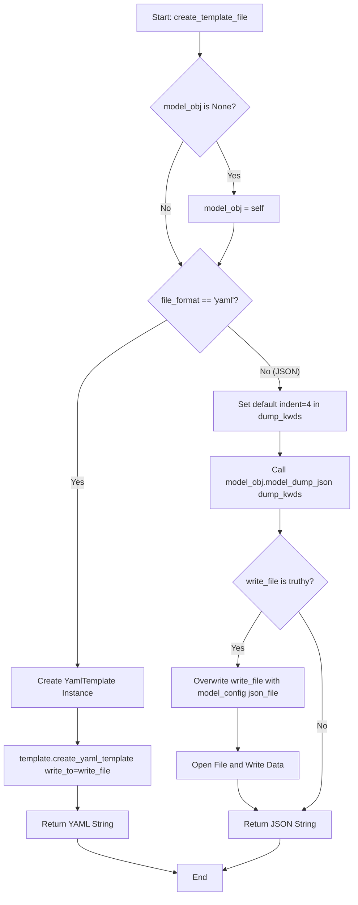

#### 带注释源码

```python
def create_template_file(
    self,
    model_obj: BaseFileSettings=None,
    dump_kwds: t.Dict={},
    sub_comments: t.Dict[str, SubModelComment]={},
    write_file: bool | str | Path = False,
    file_format: t.Literal["yaml", "json"] = "yaml",
) -> str:
    """
    根据模型生成 YAML 或 JSON 模板文件/字符串
    
    参数:
        model_obj: 目标模型对象，默认为 self
        dump_kwds: 序列化参数
        sub_comments: YAML 子模型注释配置
        write_file: 是否写入文件
        file_format: 输出格式 ('yaml' 或 'json')
    """
    # 如果未指定模型对象，则使用当前 Settings 实例
    if model_obj is None:
        model_obj = self
    
    # 根据格式选择生成逻辑
    if file_format == "yaml":
        # 使用 YamlTemplate 类生成 YAML 模板
        template = YamlTemplate(
            model_obj=model_obj, 
            dump_kwds=dump_kwds, 
            sub_comments=sub_comments
        )
        # 调用模板类的生成方法，传入 write_file 参数控制写入
        return template.create_yaml_template(write_to=write_file)
    else:
        # JSON 格式处理
        # 默认设置缩进为 4 空格
        dump_kwds.setdefault("indent", 4)
        # 序列化为 JSON 字符串
        data = model_obj.model_dump_json(**dump_kwds)
        
        # 如果需要写入文件
        if write_file:
            # 注意：此处存在逻辑覆盖，无论传入的 write_file 是路径还是 True，
            # 都会尝试读取配置中的 'json_file' 路径进行写入。
            write_file = self.model_config.get("json_file")
            with open(write_file, "w", encoding="utf-8") as fp:
                fp.write(data)
        
        return data
```


### `YamlTemplate.__init__`

初始化 YamlTemplate 模板生成器，用于为 pydantic 模型对象创建 YAML 配置模板。该方法接收模型对象、dump 参数和子模型注释配置，并将其存储为实例属性供后续模板生成方法使用。

参数：

- `model_obj`：`BaseModel`，要生成模板的 pydantic 模型对象（必填）
- `dump_kwds`：`t.Dict`，可选的字典参数，用于控制模型对象的 dump 行为，例如排除字段、选择字段等，默认为空字典
- `sub_comments`：`t.Dict[str, SubModelComment]`，可选的字典，用于为子模型字段添加注释，支持嵌套结构，默认为空字典

返回值：`None`，无返回值，仅初始化实例属性

#### 流程图

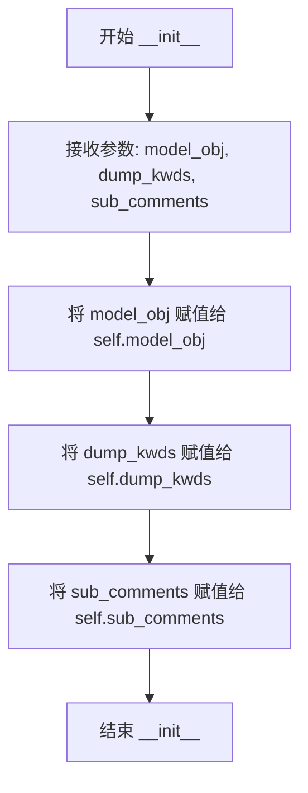

#### 带注释源码

```python
def __init__(
    self,
    model_obj: BaseModel,
    dump_kwds: t.Dict={},
    sub_comments: t.Dict[str, SubModelComment]={},
):
    """
    初始化 YamlTemplate 模板生成器
    
    参数:
        model_obj: 要生成 YAML 模板的 pydantic BaseModel 实例
        dump_kwds: 传递给 model_dump() 的关键字参数，用于控制序列化行为
        sub_comments: 子模型字段的注释配置，支持嵌套定义
    """
    # 存储模型对象，后续用于获取字段信息和生成模板
    self.model_obj = model_obj
    
    # 存储 dump 配置，如 exclude、only 等序列化选项
    self.dump_kwds = dump_kwds
    
    # 存储子模型注释配置，用于在模板中显示详细的字段说明
    self.sub_comments = sub_comments
```


### `YamlTemplate._create_yaml_object`

该方法是一个辅助方法，负责将 Pydantic 模型实例转换为 Ruamel YAML 的 `CommentedBase` 对象，以便后续可以为其添加注释并生成带有注释的 YAML 配置模板。

参数：无需额外参数（仅使用实例属性 `self.model_obj` 和 `self.dump_kwds`）

返回值：`CommentedBase`，返回 Ruamel YAML 库中的注释基类对象，可以在该对象上添加 YAML 注释

#### 流程图

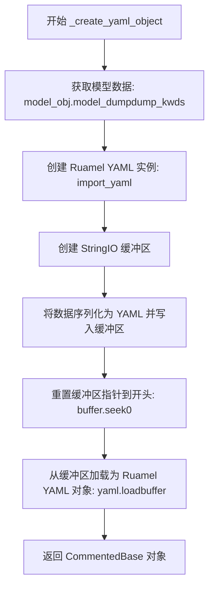

#### 带注释源码

```python
def _create_yaml_object(
    self,
) -> CommentedBase:
    """helper method to convert settings instance to ruamel.YAML object"""
    # # exclude computed fields
    # exclude = set(self.dump_kwds.get("exclude", []))
    # exclude |= set(self.model_cls.model_computed_fields)
    # self.dump_kwds["exclude"] = list(exclude)

    # 第一步：使用 pydantic 的 model_dump 方法将模型实例序列化为字典
    # dump_kwds 允许调用者指定序列化选项（如排除字段、包含默认值等）
    data = self.model_obj.model_dump(**self.dump_kwds)
    
    # 第二步：创建 Ruamel YAML 实例（配置了缩进等格式化选项）
    yaml = import_yaml()
    
    # 第三步：创建内存缓冲区用于临时存储 YAML 内容
    buffer = StringIO()
    
    # 第四步：将数据序列化为 YAML 格式并写入缓冲区
    yaml.dump(data, buffer)
    
    # 第五步：将缓冲区指针重置到开头，以便读取内容
    buffer.seek(0)
    
    # 第六步：从缓冲区加载 YAML 数据为 Ruamel YAML 对象
    # 返回的 obj 是 CommentedBase 类型，支持添加 YAML 注释
    obj = yaml.load(buffer)
    
    # 返回带有注释功能的 YAML 对象
    return obj
```

---

### 补充信息

#### 1. 文件整体运行流程

该文件主要提供了从 Pydantic 模型生成带有注释的 YAML 配置模板的能力：
1. **入口**：`YamlTemplate` 类接收模型实例和配置选项
2. **核心转换**：`_create_yaml_object` 将模型转为 Ruamel YAML 对象
3. **注释处理**：`create_yaml_template` 方法递归遍历字段，添加类注释和字段注释
4. **输出**：可选择写入文件或返回字符串形式

#### 2. 类详细信息（YamlTemplate 类）

| 字段/方法 | 类型 | 描述 |
|-----------|------|------|
| `model_obj` | `BaseModel` | 要生成 YAML 模板的 Pydantic 模型实例 |
| `dump_kwds` | `t.Dict` | 传递给 `model_dump` 的序列化选项 |
| `sub_comments` | `t.Dict[str, SubModelComment]` | 子模型的注释配置（支持嵌套） |
| `model_cls` | `t.Type[BaseModel]` | 模型类的缓存属性 |
| `_create_yaml_object` | 方法 | 将模型实例转换为 Ruamel YAML 对象 |
| `get_class_comment` | 方法 | 获取模型类的描述信息 |
| `get_field_comment` | 方法 | 获取字段的描述信息和枚举值 |
| `create_yaml_template` | 方法 | 生成完整的 YAML 模板字符串 |

#### 3. 关键组件信息

- **`SubModelComment`**：TypedDict，定义如何为子模型生成注释模板
- **`MyBaseModel`**：扩展的 Pydantic BaseModel，启用属性文档字符串支持
- **`BaseFileSettings`**：基于 Pydantic Settings 的配置类，支持 YAML 配置文件加载和模板生成
- **`import_yaml`**：模块级函数，创建配置好的 Ruamel YAML 实例

#### 4. 潜在技术债务与优化空间

1. **`import_yaml` 函数重复调用**：在 `_create_yaml_object` 和 `create_yaml_template` 中都调用了 `import_yaml()`，可以提取为类属性或缓存
2. **注释掉的计算字段排除逻辑**：代码中有注释掉的计算字段排除逻辑，表明该功能可能尚未完成
3. **StringIO 缓冲区使用**：使用内存缓冲区进行 YAML 序列化/反序列化，对于大型模型可能存在性能开销
4. **类型注解不完整**：部分变量如 `fields_schema` 存在但未被完整利用

#### 5. 其它项目

- **设计目标**：解耦 Pydantic 模型与 YAML 注释生成，提供灵活的模板定制能力
- **错误处理**：主要依赖 Pydantic 和 Ruamel YAML 库的异常传播
- **外部依赖**：`pydantic`, `pydantic_settings`, `ruamel.yaml`, `memoization`


### `YamlTemplate.get_class_comment`

获取 pydantic 模型的类描述信息（description），该方法设计为可被子类重写以自定义类注释的获取逻辑。

参数：

- `model_cls`：`t.Type[BaseModel] | BaseModel`，可选，要获取注释的模型类或模型实例，默认为 `None`。当为 `None` 时使用 `self.model_cls`

返回值：`str | None`，返回从模型 JSON Schema 中获取的 description 字段值，如果不存在则返回 `None`

#### 流程图

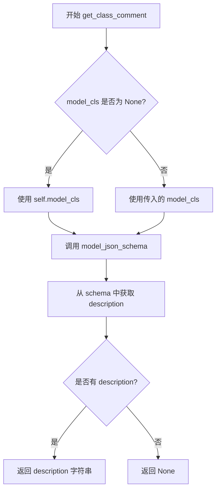

#### 带注释源码

```python
def get_class_comment(self, model_cls: t.Type[BaseModel] | BaseModel=None) -> str | None:
    """
    you can override this to customize class comments
    """
    # 如果未传入 model_cls，则使用实例的 model_cls（通过 cached_property 获取）
    if model_cls is None:
        model_cls = self.model_cls
    
    # 调用 pydantic 模型的 model_json_schema() 方法获取 JSON Schema
    # 然后从 schema 字典中尝试获取 "description" 键
    # 如果模型没有定义 description，则返回 None
    return model_cls.model_json_schema().get("description")
```


### `YamlTemplate.get_field_comment`

获取字段的描述和可选的枚举值，用于生成 YAML 配置模板中的字段注释。

参数：

- `field_name`：`str`，目标字段的名称
- `model_obj`：`BaseModel | None`，字段所属的模型实例，默认为 None，表示使用类级别的 schema

返回值：`str | None`，字段的描述信息，如果字段存在则包含描述和枚举值，否则返回 None

#### 流程图

```mermaid
flowchart TD
    A[开始] --> B{field_name 是否为空}
    B -->|否| C{model_obj 是否为 None}
    C -->|是| D[获取类级别的 JSON Schema]
    C -->|否| E[获取 model_obj 的 JSON Schema]
    D --> F[从 Schema 中获取字段定义]
    E --> F
    F --> G{字段是否存在}
    G -->|否| H[返回 None]
    G -->|是| I[获取字段描述 description]
    I --> J{字段是否有枚举值 enum}
    J -->|是| K[添加枚举值信息: 可选值：{enum}]
    J -->|否| L[跳过添加枚举值]
    K --> M[使用换行符拼接描述和枚举值]
    L --> M
    M --> N[返回拼接后的字符串]
    H --> O[结束]
    N --> O
```

#### 带注释源码

```python
def get_field_comment(self, field_name: str, model_obj: BaseModel=None) -> str | None:
    """
    you can override this to customize field comments
    model_obj is the instance that field_name belongs to
    """
    # 如果未提供 model_obj，则获取类级别的 JSON schema
    if model_obj is None:
        schema = self.model_cls.model_json_schema().get("properties", {})
    else:
        # 否则获取特定模型实例的 JSON schema
        fields_schema = model_obj.model_json_schema().get("properties", {})
    
    # 从字段 schema 中获取指定字段的定义
    if field := fields_schema.get(field_name):
        # 初始化描述列表，包含字段的 description（默认为空字符串）
        lines = [field.get("description", "")]
        
        # 如果字段定义了枚举值，添加枚举值信息
        if enum := field.get("enum"):
            lines.append(f"可选值：{enum}")
        
        # 使用换行符拼接描述和枚举值，返回完整注释
        return "\n".join(lines)
```


### `YamlTemplate.create_yaml_template`

该方法是 `YamlTemplate` 类的核心入口，负责将 Pydantic 模型实例转换为格式化的 YAML 配置模板字符串。它首先将模型对象序列化为基础的 YAML 结构，然后递归遍历字段以添加类级别和字段级别的注释（包括对嵌套子模型的处理），最后将结果持久化到文件或仅作为字符串返回。

参数：

- `write_to`：`str | Path | bool`，指定 YAML 模板的输出路径。若为 `True`，则自动读取模型配置中的 `yaml_file` 路径；若为具体路径（str 或 Path），则写入该文件；默认值为 `False`，表示不写入文件，仅返回字符串。
- `indent`：`int`，用于设置注释缩进的层级，默认为 `0`。

返回值：`str`，返回生成的 YAML 模板内容。

#### 流程图

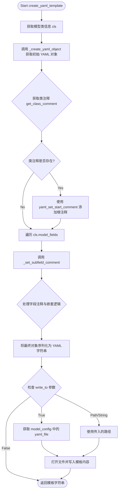

#### 带注释源码

```python
def create_yaml_template(
    self,
    write_to: str | Path | bool = False,
    indent: int = 0,
) -> str:
    """
    generate yaml template with default object
    sub_comments indicate how to populate comments for sub models, it could be nested.
    """
    cls = self.model_cls
    obj = self._create_yaml_object()

    # add start comment for class
    cls_comment = self.get_class_comment()
    if cls_comment:
        obj.yaml_set_start_comment(cls_comment + "\n\n", indent)
    
    sub_comments = self.sub_comments
    # add comments for fields
    def _set_subfield_comment(
        o: CommentedBase,
        m: BaseModel,
        n: str,
        sub_comment: SubModelComment,
        indent: int,
    ):
        if sub_comment:
            if sub_comment.get("is_entire_comment"):
                comment = (YamlTemplate(sub_comment["model_obj"],
                                        dump_kwds=sub_comment.get("dump_kwds", {}),
                                        sub_comments=sub_comment.get("sub_comments", {}),)
                            .create_yaml_template()
                        )
                if comment:
                    o.yaml_set_comment_before_after_key(n, "\n"+comment, indent=indent)
            elif sub_model_obj := sub_comment.get("model_obj"):
                comment = self.get_field_comment(n, m) or self.get_class_comment(sub_model_obj)
                if comment:
                    o.yaml_set_comment_before_after_key(n, "\n"+comment, indent=indent)
                for f in sub_model_obj.model_fields:
                    s = sub_comment.get("sub_comments", {}).get(f, {})
                    _set_subfield_comment(o[n], sub_model_obj, f, s, indent+2)
        else:
            comment = self.get_field_comment(n, m)
            if comment:
                o.yaml_set_comment_before_after_key(n, "\n"+comment, indent=indent)

    for n in cls.model_fields:
        _set_subfield_comment(obj, self.model_obj, n, sub_comments.get(n, {}), indent)

    yaml = import_yaml()
    buffer = StringIO()
    yaml.dump(obj, buffer)
    template = buffer.getvalue()

    if write_to is True:
        write_to = self.model_cls.model_config.get("yaml_file")
    if write_to:
        with open(write_to, "w", encoding="utf-8") as fp:
            fp.write(template)

    return template
```


## 关键组件


### YamlTemplate

YAML配置模板生成器，用于从Pydantic模型对象生成带有注释的YAML配置文件模板，支持嵌套模型的注释处理。

### MyBaseModel

Pydantic基础模型类，配置了属性文档字符串支持，允许额外字段，通过UTF-8编码的env文件加载环境变量。

### BaseFileSettings

文件配置设置基类，继承自Pydantic Settings，支持YAML/JSON配置文件加载，自动重载机制，以及模板文件生成功能。

### _lazy_load_key

懒加载键生成函数，根据设置类和各种配置文件（env、json、yaml、toml）的修改时间戳生成缓存键，用于实现配置文件的自动重载。

### _cached_settings

缓存设置装饰器函数，使用LRU缓存算法缓存设置实例，当配置文件发生变更时自动刷新缓存，支持线程安全。

### settings_property

设置属性装饰器工厂函数，用于创建延迟加载的配置属性，返回配置对象的缓存实例。

### import_yaml

YAML解析器初始化函数，配置了块序列缩进、映射缩进、序列破折号偏移和序列缩进等格式参数，返回配置好的ruamel.yaml对象。

### SubModelComment

子模型注释类型定义字典类型，用于指定如何为子模型创建模板，包含模型对象、转储关键字、是否整体注释和嵌套子注释等字段。


## 问题及建议


### 已知问题

-   **类型标注错误**：代码中使用了 `os.Any`，应该是 `typing.Any` 或直接从 `typing` 导入 `Any`
-   **函数重复调用**：`import_yaml()` 函数在 `_create_yaml_object` 和 `create_yaml_template` 方法中被重复调用，每次都创建新的 ruamel.yaml 实例，没有复用，造成性能浪费
-   **缓存键设计缺陷**：`_lazy_load_key` 函数中 `int(os.path.getmtime(file))` 使用时间戳作为缓存键，当文件在一秒内被修改时可能产生相同的时间戳，导致缓存失效；而且类级别的缓存无法区分同一类的不同实例配置
-   **默认可变参数**：函数参数 `dump_kwds: t.Dict={}` 和 `sub_comments: t.Dict[str, SubModelComment]={}` 使用可变默认参数，容易导致意外的状态共享
-   **缺少异常处理**：文件读写操作没有捕获 `FileNotFoundError`、`PermissionError` 等异常；YAML 解析没有异常处理
-   **冗余代码**：`import_yaml()` 中已注释掉的 `text_block_representer` 代码未被清理
-   **Pydantic 兼容性问题**：使用了 `model_config = ConfigDict(...)` 和 `SettingsConfigDict`，这是 Pydantic v2 的方式，但代码中混用了部分 v1 风格的配置

### 优化建议

-   将 `os.Any` 改为 `typing.Any`，确保类型标注正确
-   将 `import_yaml()` 改为模块级单例或缓存实例，避免重复创建
-   修复 `_lazy_load_key` 使用 `os.path.getmtime(file)` 浮点数时间戳，并考虑使用实例级别的缓存策略
-   使用 `None` 作为默认参数值，在函数内部进行初始化：`def func(dump_kwds: t.Dict | None = None)`
-   为文件操作添加 try-except 异常处理
-   清理注释掉的冗余代码
-   考虑增加对大文件的流式处理或分块加载机制

## 其它


### 设计目标与约束

本模块的核心设计目标是提供一个灵活的配置管理框架，能够从多种来源（YAML、JSON、环境变量）加载Pydantic模型配置，并支持自动模板生成与热重载。约束条件包括：1）依赖Pydantic v2和ruamel.yaml；2）仅支持Python 3.9+；3）配置源优先级为：初始化参数 > 环境变量 > .env文件 > YAML配置文件。

### 错误处理与异常设计

错误处理采用分层策略：1）配置加载失败时抛出pydantic相关异常；2）文件不存在或格式错误时返回默认值或空对象；3）模板生成失败时返回空模板字符串。关键异常类型包括：pydantic.ValidationError（配置验证失败）、FileNotFoundError（配置文件缺失）、yaml.YAMLError（YAML解析错误）。所有异常均向上传播至调用方处理。

### 数据流与状态机

数据流向为：配置文件/环境变量 → Pydantic模型实例化 → 配置验证 → 缓存层(_cached_settings) → 应用程序使用。状态机包含三种状态：初始态(NEW)、已加载(LOADED)、需重载(RELOAD)。当检测到配置文件mtime变化时，_lazy_load_key生成新key，触发重新实例化。

### 外部依赖与接口契约

核心依赖包括：pydantic>=2.0、pydantic-settings>=2.0、ruamel.yaml、memoization。主要接口契约：1）YamlTemplate.create_yaml_template()返回字符串或写入文件；2）BaseFileSettings支持yaml_file/json_file配置；3）settings_property装饰器返回缓存的设置实例；4）_cached_settings使用自定义key_maker实现基于文件时间的缓存失效。

### 安全性考虑

配置处理涉及敏感信息（如密钥、密码），设计时需注意：1）环境变量中的敏感值不应写入日志；2）配置文件应设置适当的文件权限（600）；3）未使用pydantic的SecretStr类型暴露明文；4）extra="ignore"防止注入额外配置字段。

### 性能特性

性能关键点：1）_cached_settings使用LRU缓存（max_size=1）减少重复解析；2）cached_property避免重复计算模型类；3）每次模板生成都重新import_yaml()存在优化空间；4）大配置文件场景下需评估YAML解析性能。预期性能瓶颈在文件I/O和YAML序列化。

### 线程安全

_cached_settings启用thread_safe=True保证线程安全。settings_property返回的property对象在多线程环境下安全，但需要注意设置实例本身的线程安全性取决于Pydantic模型的线程安全特性。

### 配置管理

配置来源按优先级排列：1）代码初始化参数；2）环境变量；3）.env文件；4）YAML/JSON配置文件。通过BaseFileSettings.settings_customise_sources()自定义来源顺序。yaml_file和json_file路径可通过model_config指定，支持自动模板生成。

### 扩展点

主要扩展点包括：1）YamlTemplate.get_class_comment()和get_field_comment()可Override自定义注释；2）SubModelComment支持嵌套子模型注释；3）BaseFileSettings可继承扩展新配置模型；4）settings_property可包装任意BaseFileSettings子类实现热重载。

### 测试策略建议

测试应覆盖：1）YAML/JSON模板生成正确性；2）配置加载优先级；3）文件变化检测与重载；4）嵌套模型注释处理；5）异常场景（文件不存在、格式错误）；6）多线程并发访问。使用pytest+pytest-mock进行单元测试，集成测试需临时文件配合。

### 使用示例

```python
# 基础用法
class AppSettings(BaseFileSettings):
    debug: bool = False
    database_url: str = "localhost"

settings = AppSettings(yaml_file="config.yaml")
print(settings.debug)

# 模板生成
settings.create_template_file(write_file="config.template.yaml")

# 热重载
class LiveSettings(BaseFileSettings):
    model_config = {"yaml_file": "live.yaml"}
    
    host: str = "0.0.0.0"
    port: int = 8080

class App:
    settings = settings_property(LiveSettings())
```


    