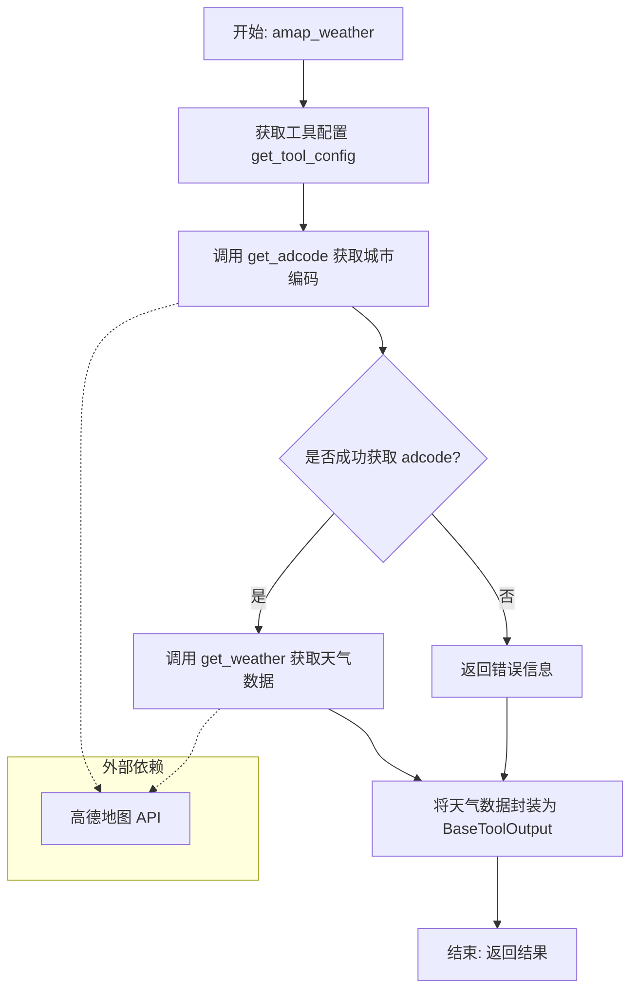
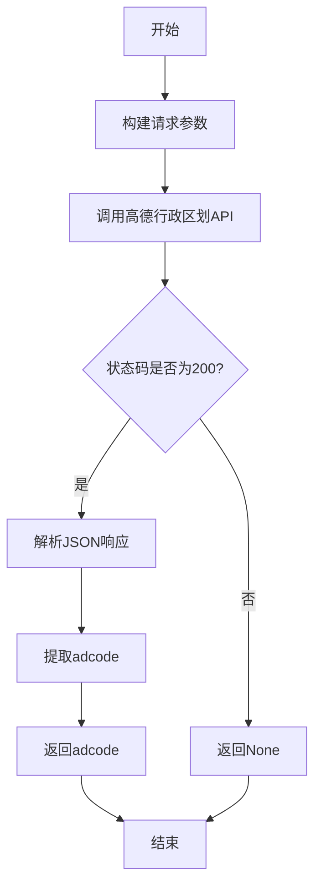
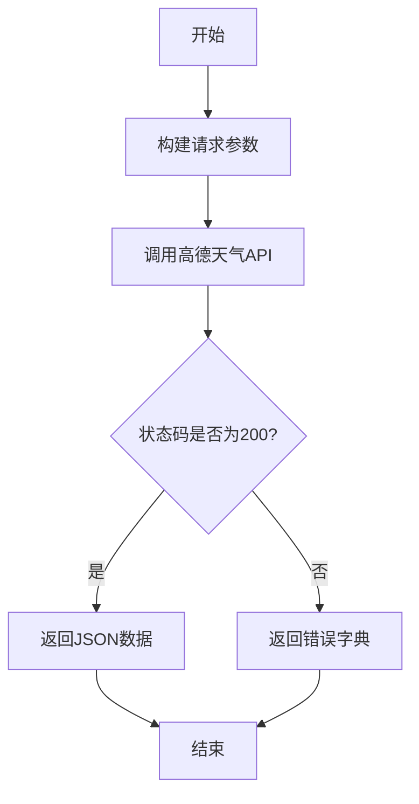
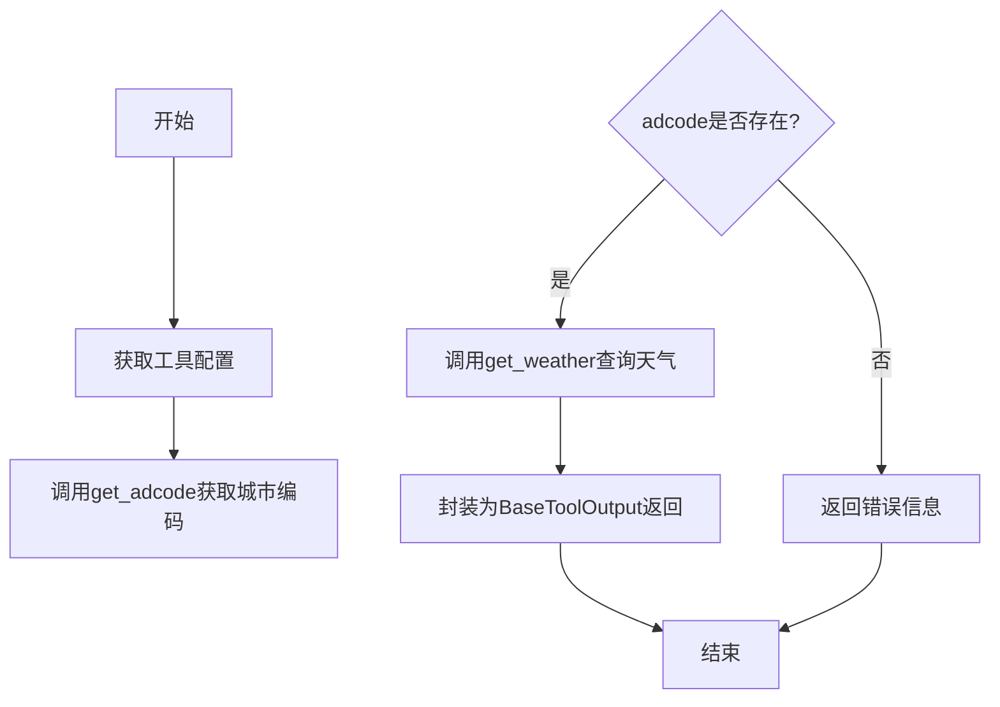

# `Langchain-Chatchat\libs\chatchat-server\chatchat\server\agent\tools_factory\amap_weather.py` 详细设计文档

这是一个高德地图天气查询工具，通过调用高德地图的行政区划API获取城市编码，然后使用天气API查询指定城市的天气信息，并返回标准化的工具输出结果。

## 整体流程

```mermaid
graph TD
    A[开始: amap_weather调用] --> B[获取工具配置]
    B --> C[调用get_adcode获取城市编码]
    C --> D{城市编码是否存在?}
    D -- 否 --> E[返回错误: 无法获取城市编码]
    D -- 是 --> F[调用get_weather获取天气数据]
    F --> G[返回BaseToolOutput(weather_data)]
E --> G
C --> H[requests.get请求高德行政区划API]
H --> I{HTTP状态码200?}
I -- 否 --> J[返回None]
I -- 是 --> K[解析JSON返回adcode]
F --> L[requests.get请求高德天气API]
L --> M{HTTP状态码200?}
M -- 否 --> N[返回错误字典]
M -- 是 --> O[返回天气数据JSON]
```

## 类结构

```
全局变量
├── BASE_DISTRICT_URL (高德行政区划API)
└── BASE_WEATHER_URL (高德天气API)
全局函数
├── get_adcode (获取城市编码)
├── get_weather (获取天气信息)
└── amap_weather (工具入口函数)
```

## 全局变量及字段


### `BASE_DISTRICT_URL`
    
高德地图行政区划查询API的基础URL

类型：`str`
    


### `BASE_WEATHER_URL`
    
高德地图天气查询API的基础URL

类型：`str`
    


    

## 全局函数及方法


### `get_adcode`

该函数通过调用高德地图行政区划查询 API，根据输入的城市名称获取对应的行政编码（adcode），是天气查询工具链中的关键前置步骤，用于将城市名转换为高德地图可识别的行政区划编码。

参数：

-  `city`：`str`，目标城市名称，用于在行政区划 API 中检索对应的行政编码
-  `config`：`dict`，包含高德地图 API 密钥的配置字典，必须包含 "api_key" 键

返回值：`str`，返回城市的行政编码（adcode），如查询失败或 API 返回非 200 状态码则返回 `None`

#### 流程图

```mermaid
flowchart TD
    A[开始 get_adcode] --> B[从 config 获取 API_KEY]
    B --> C[构建请求参数 params]
    C --> D{keywords: city, subdistrict: 0, extensions: base, key: API_KEY}
    D --> E[发送 GET 请求到 BASE_DISTRICT_URL]
    E --> F{响应状态码 == 200?}
    F -->|是| G[解析 JSON 响应数据]
    F -->|否| H[返回 None]
    G --> I[提取 districts[0].adcode]
    I --> J[返回 adcode 字符串]
    H --> J
    J[结束]
```

#### 带注释源码

```python
def get_adcode(city: str, config: dict) -> str:
    """
    获取城市行政编码（adcode）
    
    通过高德地图行政区划查询API，根据城市名获取对应的行政区划编码。
    该编码是后续查询天气信息的必要参数。
    
    参数:
        city: str - 目标城市的中文名称，如"北京"、"上海"等
        config: dict - 包含API配置的字典，必须包含api_key键
    
    返回:
        str - 城市的行政编码，查询失败时返回None
    """
    # 从配置中提取高德地图 API 密钥
    API_KEY = config["api_key"]
    
    # 构建请求参数：keywords为城市名，subdistrict=0表示不查询下级行政区
    # extensions=base表示返回基本信息
    params = {
        "keywords": city,
        "subdistrict": 0, 
        "extensions": "base",
        "key": API_KEY
    }
    
    # 发送 GET 请求到高德地图行政区划查询接口
    response = requests.get(BASE_DISTRICT_URL, params=params)
    
    # 检查 HTTP 响应状态码
    if response.status_code == 200:
        # 状态码正常时，解析 JSON 响应数据
        data = response.json()
        # 从返回的行政区划列表中提取第一个结果的 adcode
        return data["districts"][0]["adcode"]
    else:
        # API 请求失败时返回 None
        return None
```


### `get_weather`

获取指定城市的天气信息，通过高德地图天气API查询数据。

参数：

- `adcode`：`str`，城市的高德地图行政编码
- `config`：`dict`，包含高德地图API配置信息的字典（必须包含 `api_key` 字段）

返回值：`dict`，成功时返回天气信息JSON数据，失败时返回包含错误信息的字典

#### 流程图

```mermaid
flowchart TD
    A[开始 get_weather] --> B[从 config 提取 api_key]
    B --> C[构建请求参数 params]
    C --> D{city: adcode, extensions: 'all', key: API_KEY}
    D --> E[发起 GET 请求到 BASE_WEATHER_URL]
    E --> F{响应状态码 == 200?}
    F -->|是| G[解析 JSON 响应]
    F -->|否| H[返回错误字典 {'error': 'API request failed'}]
    G --> I[返回天气数据字典]
    H --> I
    I[结束]
```

#### 带注释源码

```python
def get_weather(adcode: str, config: dict) -> dict:
    """
    获取指定城市的天气信息。
    
    通过高德地图天气API查询天气数据，需要提供城市行政编码和API配置。
    
    参数:
        adcode: str, 城市的高德地图行政编码（如 '110000' 代表北京市）
        config: dict, 包含API密钥的配置字典，必须包含 'api_key' 字段
    
    返回:
        dict: 成功时返回高德API的天气JSON数据，失败时返回包含error键的字典
    """
    # 从配置中提取高德地图API密钥
    API_KEY = config["api_key"]
    
    # 构建高德天气API请求参数
    # city: 城市编码
    # extensions: 返回格式，'all' 表示返回预报天气
    # key: API密钥
    params = {
        "city": adcode,
        "extensions": "all",
        "key": API_KEY
    }
    
    # 发起GET请求获取天气数据
    response = requests.get(BASE_WEATHER_URL, params=params)
    
    # 检查HTTP响应状态码
    if response.status_code == 200:
        # 成功响应，解析并返回JSON数据
        return response.json()
    else:
        # 请求失败，返回错误信息字典
        return {"error": "API request failed"}
```


### `amap_weather`

该函数是一个天气查询工具的入口函数，通过高德地图API根据城市名获取对应的天气信息。首先获取工具配置，然后通过城市名查询城市编码（adcode），最后使用城市编码调用天气接口获取天气数据，并将结果封装为`BaseToolOutput`对象返回。

参数：

- `city`：`str`，城市名称，用于查询指定城市的天气信息

返回值：`BaseToolOutput`，封装了天气查询结果或错误信息的结果对象

#### 流程图



#### 带注释源码

```python
@regist_tool(title="高德地图天气查询")
def amap_weather(city: str = Field(description="城市名")):
    """
    A wrapper that uses Amap to get weather information.
    使用高德地图API获取天气信息的包装函数
    
    参数:
        city: str, 城市名称，用于查询该城市的天气情况
    
    返回:
        BaseToolOutput: 包含天气数据或错误信息的封装对象
    """
    # 第一步：获取工具配置（包含API密钥等配置信息）
    tool_config = get_tool_config("amap")
    
    # 第二步：通过城市名获取高德地图的城市编码（adcode）
    adcode = get_adcode(city, tool_config)
    
    # 第三步：判断是否成功获取城市编码
    if adcode:
        # 成功获取编码，调用天气接口获取天气数据
        weather_data = get_weather(adcode, tool_config)
        # 将天气数据封装为标准工具输出格式并返回
        return BaseToolOutput(weather_data)
    else:
        # 获取城市编码失败，返回错误信息
        return BaseToolOutput({"error": "无法获取城市编码"})
```

## 关键组件


### 高德地图天气查询工具

该代码是一个集成高德地图API的LangChain工具，用于通过城市名称查询天气信息。核心功能是通过城市名获取对应的行政区划代码（adcode），再调用天气查询接口返回实时天气数据。

### 1. 一段话描述

该代码实现了一个高德地图天气查询工具，通过注册为LangChain工具供Agent调用，支持输入城市名称自动获取行政区划代码并查询天气信息，返回结构化的天气数据。

### 2. 文件整体运行流程

```
用户输入城市名称
        ↓
amap_weather() 被调用
        ↓
获取工具配置 (get_tool_config)
        ↓
调用 get_adcode() 获取城市行政编码
        ↓
调用 get_weather() 查询天气
        ↓
封装结果为 BaseToolOutput 返回
```

### 3. 类详细信息

该文件无类定义，仅包含全局函数和变量。

### 4. 全局变量和全局函数详细信息

#### 4.1 全局变量

| 名称 | 类型 | 描述 |
|------|------|------|
| BASE_DISTRICT_URL | str | 高德地图行政区划查询API基础URL |
| BASE_WEATHER_URL | str | 高德地图天气查询API基础URL |

#### 4.2 全局函数

##### get_adcode

| 项目 | 详情 |
|------|------|
| 名称 | get_adcode |
| 参数 | city: str, config: dict |
| 参数类型 | city: str, config: dict |
| 参数描述 | city为要查询的城市名称，config为API配置字典 |
| 返回值类型 | str 或 None |
| 返回值描述 | 返回城市对应的行政区划代码，失败返回None |

**mermaid流程图**


**源码**
```python
def get_adcode(city: str, config: dict) -> str:
    """Get the adcode"""
    API_KEY = config["api_key"]
    params = {
        "keywords": city,
        "subdistrict": 0, 
        "extensions": "base",
        "key": API_KEY
    }
    response = requests.get(BASE_DISTRICT_URL, params=params)
    if response.status_code == 200:
        data = response.json()
        return data["districts"][0]["adcode"]
    else:
        return None
```

##### get_weather

| 项目 | 详情 |
|------|------|
| 名称 | get_weather |
| 参数 | adcode: str, config: dict |
| 参数类型 | adcode: str, config: dict |
| 参数描述 | adcode为城市行政区划代码，config为API配置字典 |
| 返回值类型 | dict |
| 返回值描述 | 返回天气数据字典，失败返回包含error的字典 |

**mermaid流程图**


**源码**
```python
def get_weather(adcode: str, config: dict) -> dict:
    """Get  weather information."""
    API_KEY = config["api_key"]
    params = {
        "city": adcode,
        "extensions": "all",
        "key": API_KEY
    }
    response = requests.get(BASE_WEATHER_URL, params=params)
    if response.status_code == 200:
        return response.json()
    else:
        return {"error": "API request failed"}
```

##### amap_weather

| 项目 | 详情 |
|------|------|
| 名称 | amap_weather |
| 参数 | city: str |
| 参数类型 | city: str (通过Field指定description) |
| 参数描述 | 要查询天气的城市名称 |
| 返回值类型 | BaseToolOutput |
| 返回值描述 | 封装后的工具输出结果 |

**mermaid流程图**


**源码**
```python
@regist_tool(title="高德地图天气查询")
def amap_weather(city: str = Field(description="城市名")):
    """A wrapper that uses Amap to get weather information."""
    tool_config = get_tool_config("amap")
    adcode = get_adcode(city, tool_config)
    if adcode:
        weather_data = get_weather(adcode, tool_config)
        return BaseToolOutput(weather_data)
    else:
        return BaseToolOutput({"error": "无法获取城市编码"})
```

### 5. 关键组件信息

| 组件名称 | 描述 |
|----------|------|
| BASE_DISTRICT_URL | 高德地图行政区划查询API端点常量 |
| BASE_WEATHER_URL | 高德地图天气信息查询API端点常量 |
| get_adcode | 获取城市行政区划代码的函数 |
| get_weather | 获取天气信息的函数 |
| amap_weather | 工具入口函数，通过装饰器注册为LangChain工具 |
| @regist_tool | 工具注册装饰器，将函数注册为ChatChat系统工具 |

### 6. 潜在技术债务或优化空间

1. **缺少请求超时设置**：使用requests.get()时未设置timeout参数，可能导致请求无限等待
2. **错误处理不完善**：get_adcode返回None后未记录日志，难以追踪问题
3. **API密钥硬编码风险**：虽然通过config获取，但config来源和安全性需关注
4. **缺少重试机制**：网络请求失败时直接返回错误，缺乏重试逻辑
5. **未使用连接池**：频繁调用API时未使用session复用连接
6. **城市名输入验证缺失**：未对city参数进行有效性校验

### 7. 其它项目

#### 7.1 设计目标与约束

- **设计目标**：为LangChain Agent提供高德地图天气查询能力
- **约束**：依赖外部高德地图API，需要有效的API Key

#### 7.2 错误处理与异常设计

- HTTP请求失败时返回包含error键的字典
- 获取adcode失败时返回错误信息而非直接抛异常
- 使用BaseToolOutput封装统一返回格式

#### 7.3 数据流与状态机

- 输入：城市名称字符串
- 处理流程：城市名 → 行政编码 → 天气数据
- 输出：结构化天气信息或错误信息

#### 7.4 外部依赖与接口契约

- 依赖：高德地图REST API (restapi.amap.com)
- 依赖：requests库进行HTTP请求
- 依赖：chatchat.server.utils.get_tool_config获取配置
- 依赖：tools_registry注册工具
- 依赖：BaseToolOutput封装返回结果


## 问题及建议


### 已知问题

-   **缺乏超时控制**：使用requests.get()时未设置timeout参数，可能导致请求无限期挂起，影响系统稳定性
-   **错误处理不完善**：get_adcode函数中response.json()可能抛出异常（如JSON解析失败），且未处理网络连接错误
-   **数据验证缺失**：未验证城市名有效性、adcode存在性，以及API返回数据结构的正确性，可能导致KeyError
-   **API密钥缺乏校验**：直接从config获取api_key但未做存在性检查，KeyError异常未被妥善处理
-   **缺少日志记录**：整个模块无任何日志输出，难以进行问题排查和监控
-   **重复代码模式**：两次API调用具有相同的参数构建和响应处理逻辑，未进行抽象复用
-   **硬编码URL**：BASE_DISTRICT_URL和BASE_WEATHER_URL硬编码在模块级别，不利于配置管理
-   **返回类型不一致**：get_weather函数在失败时返回dict，成功时返回response.json()结果，类型不明确
-   **缺少重试机制**：网络请求失败时无重试逻辑，API调用可靠性不足

### 优化建议

-   为requests.get()添加timeout参数，建议设置为5-10秒
-   添加try-except块捕获JSONDecodeError、ConnectionError等异常，并返回结构化的错误信息
-   使用pydantic或简单的断言验证API返回数据的存在性和格式
-   使用config.get()配合默认值或显式校验，避免KeyError
-   引入logging模块添加适当的日志记录
-   抽取通用HTTP请求逻辑为内部函数，减少重复代码
-   将URL配置化，可通过tool_config或环境变量传入
-   明确函数返回类型注解，使用Union或Optional
-   考虑添加简单的重试机制（如使用tenacity库）
-   将API_KEY的获取抽象为独立函数，统一错误处理


## 其它


### 设计目标与约束

本工具旨在为langchain_chatchat框架提供一个高德地图天气查询工具，支持通过城市名称查询天气信息。设计约束包括：1) 必须使用高德地图API；2) 需要支持配置化管理API Key；3) 工具需要注册到tools_registry中；4) 返回值必须包装为BaseToolOutput对象。

### 错误处理与异常设计

代码中包含以下错误处理机制：1) get_adcode函数在API请求失败时返回None；2) get_weather函数在请求失败时返回包含error键的字典；3) amap_weather函数在无法获取城市编码时返回错误信息。潜在改进：可增加重试机制、网络超时处理、日志记录等。

### 数据流与状态机

数据流为：用户输入城市名 → amap_weather接收参数 → 调用get_adcode获取城市编码 → 调用get_weather获取天气数据 → 包装为BaseToolOutput返回。无复杂状态机，为简单的线性流程。

### 外部依赖与接口契约

主要外部依赖：1) requests库用于HTTP请求；2) chatchat.server.pydantic_v1的Field用于参数定义；3) chatchat.server.utils的get_tool_config用于配置获取；4) tools_registry的regist_tool用于工具注册；5) langchain_chatchat.agent_toolkits的BaseToolOutput用于返回值包装。高德地图API接口契约：district接口返回districts数组，weather接口返回天气数据字典。

### 性能考虑

当前实现为同步阻塞调用，每次查询需要两次HTTP请求。潜在优化点：可考虑添加请求超时设置、连接池复用、结果缓存等。

### 安全性考虑

API Key通过配置文件获取，未硬编码在代码中，这是良好的安全实践。但建议确保配置文件权限正确，避免敏感信息泄露。

### 配置文件要求

需要配置文件中包含amap项，其中必须有api_key字段。配置示例：{"amap": {"api_key": "your_amap_api_key"}}。

### 使用示例

```python
# 注册工具后，可通过以下方式调用
result = amap_weather(city="北京")
# 返回格式：BaseToolOutput对象，包含天气数据或错误信息
```

    