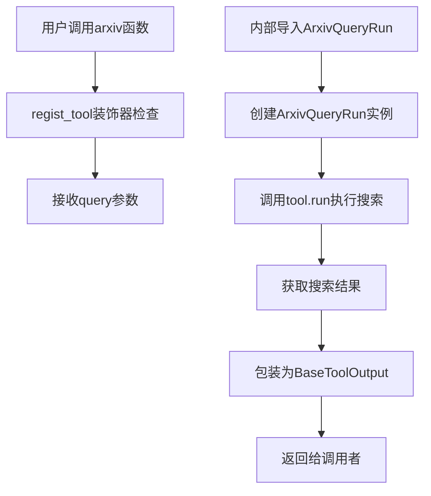
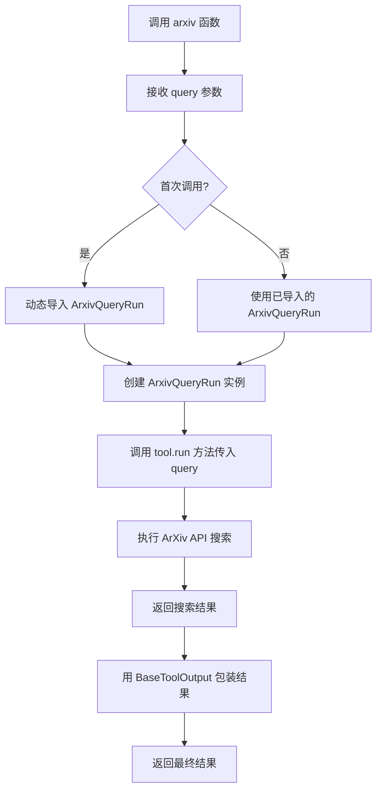

# `Langchain-Chatchat\libs\chatchat-server\chatchat\server\agent\tools_factory\arxiv.py` 详细设计文档

该文件封装了LangChain的ArxivQueryRun工具，提供了一个用于搜索和检索Arxiv.org科学论文的ChatChat工具接口。通过regist_tool装饰器注册后，用户可通过自然语言查询搜索计算机科学、物理、数学等领域的学术论文。

## 整体流程



## 类结构

```
无类定义 - 工具函数模块
```

## 全局变量及字段


### `Field`
    
Pydantic 字段描述器，用于定义工具参数的元数据

类型：`function`
    


### `regist_tool`
    
工具注册装饰器函数，用于将工具注册到工具注册表中

类型：`function`
    


### `BaseToolOutput`
    
基础工具输出类，用于包装工具执行结果

类型：`class`
    


### `ArxivQueryRun`
    
LangChain 的 Arxiv 搜索工具类，用于查询和检索学术论文

类型：`class`
    


### `arxiv`
    
Arxiv 论文搜索工具的封装函数

类型：`function`
    


### `query`
    
搜索查询标题，用于在 Arxiv 上搜索相关论文

类型：`str`
    


    

## 全局函数及方法


### `arxiv`

这是一个ArXiv论文搜索工具的封装函数，通过调用LangChain的ArxivQueryRun来搜索和检索科学论文，并使用BaseToolOutput包装返回结果。

参数：

- `query`：`str`，搜索查询标题，用于在ArXiv上搜索相关论文

返回值：`BaseToolOutput`，包含搜索到的论文信息，以BaseToolOutput对象形式返回

#### 流程图



#### 带注释源码

```python
# 导入pydantic字段定义，用于参数验证和文档生成
from chatchat.server.pydantic_v1 import Field

# 从工具注册表中导入regist_tool装饰器，用于将函数注册为工具
from .tools_registry import regist_tool

# 导入基础工具输出类，用于统一返回格式
from langchain_chatchat.agent_toolkits.all_tools.tool import (
    BaseToolOutput,
)

# 使用装饰器注册工具，标题为"ARXIV论文"
# 这使得该函数可以被AI代理或其他系统发现和调用
@regist_tool(title="ARXIV论文")
def arxiv(query: str = Field(description="The search query title")):
    """
    A wrapper around Arxiv.org for searching and retrieving scientific articles 
    in various fields.
    
    这是一个围绕Arxiv.org的封装器，用于搜索和检索各领域的科学文章。
    """
    # 延迟导入langchain的ArxivQueryRun工具
    # 这种延迟导入方式可以提高模块加载速度，避免不必要的依赖
    from langchain.tools.arxiv.tool import ArxivQueryRun

    # 创建ArxivQueryRun工具实例
    # 该实例封装了与ArXiv API的交互逻辑
    tool = ArxivQueryRun()
    
    # 调用工具的run方法执行搜索
    # tool_input参数接受查询字符串
    # 返回结果用BaseToolOutput包装，以统一输出格式
    return BaseToolOutput(tool.run(tool_input=query))
```

#### 关键组件信息

| 组件名称 | 一句话描述 |
|---------|-----------|
| `ArxivQueryRun` | LangChain封装的ArXiv搜索工具类，负责与ArXiv API交互 |
| `BaseToolOutput` | 工具输出的基类，用于统一工具返回结果的格式 |
| `regist_tool` | 装饰器函数，用于将函数注册为可被AI代理调用的工具 |
| `Field` | Pydantic字段定义器，用于参数验证和自动生成描述文档 |

#### 潜在技术债务与优化空间

1. **缺少错误处理**：当前实现没有try-except捕获ArXiv API调用可能发生的网络错误、超时等异常
2. **重复实例化**：每次调用都创建新的`ArxivQueryRun`实例，可以考虑单例模式或缓存实例
3. **缺少参数验证**：query参数没有长度限制或内容过滤，可能导致无效查询
4. **硬编码导入路径**：延迟导入路径硬编码，如果ArXiv工具位置变动需要修改代码
5. **日志缺失**：没有日志记录搜索查询和结果状态，不利于调试和监控
6. **返回结果未处理**：直接返回原始结果，没有对结果进行解析或格式化

#### 其它项目

**设计目标与约束**：
- 目标：提供统一的工具接口供AI代理调用ArXiv搜索功能
- 约束：必须使用项目内部的`BaseToolOutput`格式返回结果

**错误处理与异常设计**：
- 当前版本未实现显式错误处理
- 建议：添加网络超时处理、API不可用时的降级策略、空结果处理

**外部依赖与接口契约**：
- 依赖`langchain.tools.arxiv.tool.ArxivQueryRun`
- 依赖项目内部`BaseToolOutput`类和`regist_tool`装饰器
- 接口契约：输入字符串查询，返回BaseToolOutput包装的搜索结果

## 关键组件


### 工具注册机制 (regist_tool装饰器)

使用`@regist_tool`装饰器将`arxiv`函数注册到系统的工具注册表中，提供了工具标题"ARXIV论文"，使得该工具可以被系统识别和调用。

### Arxiv查询函数 (arxiv函数)

主要的查询入口函数，接收用户输入的搜索查询字符串，调用底层LangChain的ArxivQueryRun工具执行搜索，并返回包装后的结果。

### 搜索参数 (query参数)

字符串类型的输入参数，使用Pydantic的Field定义，提供了对参数用途的描述"The search query title"，用于指定要搜索的论文标题或关键词。

### 底层LangChain工具 (ArxivQueryRun)

来自langchain.tools.arxiv.tool的ArxivQueryRun类，是实际执行Arxiv搜索的核心组件，封装了与Arxiv.org API交互的逻辑。

### 输出包装器 (BaseToolOutput)

将底层工具返回的原始结果包装成标准化的工具输出格式，提供一致的接口和可能的额外处理。

### 工具文档字符串

函数级别的文档字符串，说明该工具是用于搜索和检索各个领域的科学论文的Arxiv.org包装器。

### 延迟导入模式

采用函数内部导入的方式（import within function），实现了惰性加载，避免模块初始化时的循环依赖问题。


## 问题及建议


### 已知问题

-   **重复实例化工具对象**：每次调用 `arxiv()` 函数都会创建新的 `ArxivQueryRun()` 实例，没有复用，可能导致资源浪费和性能问题
-   **缺少异常处理机制**：对网络请求失败、API 超时、查询无结果等情况没有进行异常捕获和处理，可能导致程序直接崩溃
-   **运行时依赖导入**：将 `ArxivQueryRun` 的导入放在函数内部，虽然实现了延迟加载，但错误只能在运行时发现，不利于代码调试和问题排查
-   **参数配置受限**：仅支持 `query` 参数，没有暴露 `ArxivQueryRun` 的其他可选配置（如返回结果数量限制、超时时间等）
-   **缺乏日志记录**：没有任何日志输出，无法追踪工具调用情况、调试问题或监控使用状态
-   **Field 描述语言不一致**：函数标题为中文"ARXIV论文"，但 `query` 参数的描述使用英文，与整体国际化风格不统一

### 优化建议

-   **使用单例模式或缓存工具实例**：在模块级别创建 `ArxivQueryRun` 实例或在函数外部维护工具实例，避免重复创建
-   **添加完整的异常处理**：使用 try-except 捕获网络异常、超时异常等，返回有意义的错误信息给调用方
-   **增加超时和重试机制**：为外部 API 调用设置合理的超时时间，必要时实现重试逻辑
-   **扩展参数配置**：增加更多可选参数（如 `max_results`、`timeout` 等），允许调用方自定义工具行为
-   **添加日志记录**：使用日志模块记录调用次数、查询内容、执行结果和异常信息
-   **统一语言风格**：将 Field 描述改为中文，保持代码风格一致
-   **添加结果验证**：对返回结果进行有效性检查，确保返回数据格式符合预期
-   **考虑异步支持**：如果上层支持异步调用，可将工具改为异步实现以提高并发性能


## 其它


### 设计目标与约束

本工具旨在为 LangChain Agent 提供一个便捷的 Arxiv 学术论文搜索和检索能力封装，允许用户通过自然语言查询在 Arxiv.org 上搜索科学文章。设计约束包括：依赖 langchain 官方 ArxivQueryRun 实现，仅支持文本查询输入，返回结果为 BaseToolOutput 格式。

### 错误处理与异常设计

工具执行过程中可能遇到的异常包括：网络连接超时或中断导致的 ConnectionError、Arxiv API 返回空结果或无效响应、输入参数格式错误、langchain 工具内部异常等。当前实现中未显式捕获异常，异常将直接向上抛出由调用方处理。建议在 BaseToolOutput 封装时增加异常捕获和标准化错误返回。

### 外部依赖与接口契约

本工具依赖以下外部组件：langchain.tools.arxiv.tool.ArxivQueryRun（核心搜索能力）、chatchat.server.pydantic_v1.Field（参数定义）、tools_registry.regist_tool（工具注册装饰器）、BaseToolOutput（输出封装）。接口契约方面：输入为字符串类型 query 参数，输出为 BaseToolOutput 对象，包含工具执行结果或错误信息。

### 使用示例

```python
# 注册后可通过 Agent 调用
result = arxiv(query="Transformer architecture attention mechanism")
# 或在 Agent 配置中声明
tools = [arxiv]
```

### 配置说明

query 参数使用 pydantic Field 定义，description 为 "The search query title"，提示用户应输入论文标题或相关关键词作为查询内容。

### 性能考虑

Arxiv 搜索性能依赖于 Arxiv.org API 的响应速度，网络延迟为主要性能瓶颈。建议设置合理的超时时间，并考虑添加缓存机制以提升重复查询的响应速度。

### 安全考虑

当前实现对输入 query 缺乏长度限制和恶意内容过滤，建议增加输入验证逻辑防止超长字符串或特殊字符注入攻击。

### 版本兼容性

本工具依赖 langchain.tools.arxiv.tool，需确保 langchain-core 版本与 ArxivQueryRun 接口兼容，建议锁定 langchain-core >= 0.1.0 以保证功能正常。

### 状态机描述

工具执行状态流转为：IDLE（空闲）→ EXECUTING（执行中，调用 ArxivQueryRun.run）→ COMPLETED（完成，返回结果）或 FAILED（失败，抛出异常）。


    